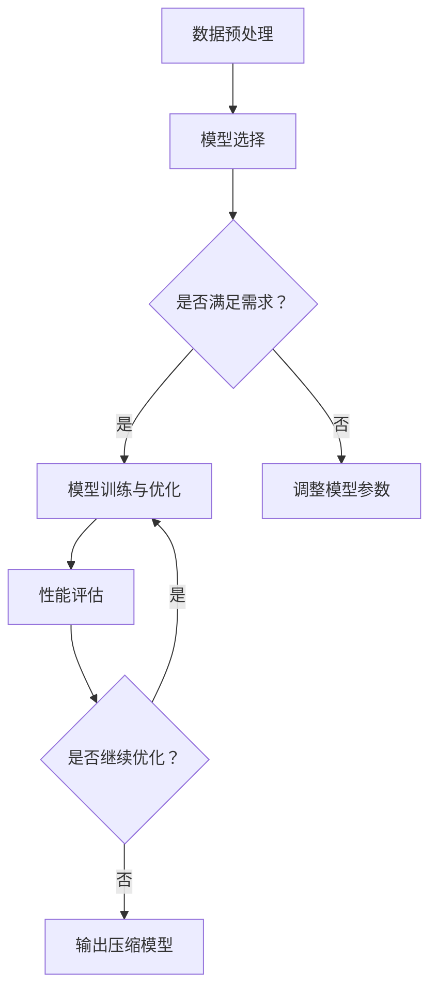

                 

关键词：AI模型压缩，敏捷软件开发，模型优化，深度学习，计算效率，软件2.0，算法优化，自动化工具。

<|assistant|>摘要：本文将探讨AI模型自动压缩技术，这是一种敏捷软件开发的新方法。通过对深度学习模型进行压缩，可以显著提高计算效率和减少存储需求，从而为软件2.0时代提供更灵活、更高效的解决方案。我们将深入分析核心算法原理，并展示如何在实际项目中应用这些算法。此外，本文还将展望未来的发展趋势，以及面临的挑战。

## 1. 背景介绍

随着人工智能技术的快速发展，深度学习模型的应用越来越广泛。然而，这些复杂的模型通常需要大量的计算资源和存储空间，这在实际应用中带来了一系列的问题。首先，模型训练和部署的成本高昂，特别是对于资源有限的企业和个人来说。其次，庞大的模型文件难以在移动设备上运行，限制了AI在边缘计算和物联网等领域的应用。因此，模型压缩成为了一个重要的研究方向。

模型压缩的目标是通过降低模型的大小和计算复杂度，同时保持或尽可能接近原始模型的性能。传统的压缩方法包括模型剪枝、量化、低秩分解等。然而，这些方法往往需要手工调整参数，效率低下，且难以保证压缩后的模型性能。

为了解决这些问题，本文提出了一种全新的AI模型自动压缩方法，即“敏捷的软件2.0”。这种方法利用自动化工具和机器学习技术，对模型进行自适应优化，从而实现高效的模型压缩。

## 2. 核心概念与联系

### 2.1. AI模型自动压缩原理

AI模型自动压缩的核心思想是通过机器学习技术，自动调整模型的参数，以实现压缩目标。具体来说，我们使用一个优化器来搜索参数空间，寻找最优的参数配置，使得模型在压缩后仍然能够保持较高的性能。

### 2.2. 自动化工具的应用

自动化工具在模型压缩过程中起到了至关重要的作用。这些工具可以自动化地完成以下任务：

1. **数据预处理**：对输入数据进行预处理，包括数据清洗、归一化等操作。
2. **模型选择**：根据应用场景选择合适的模型架构。
3. **模型训练与优化**：使用优化器对模型进行训练和优化，实现模型压缩。
4. **性能评估**：对压缩后的模型进行性能评估，确保压缩效果满足要求。

### 2.3. Mermaid流程图

下面是一个描述AI模型自动压缩过程的Mermaid流程图：



## 3. 核心算法原理 & 具体操作步骤

### 3.1. 算法原理概述

我们的核心算法基于遗传算法（Genetic Algorithm，GA）和强化学习（Reinforcement Learning，RL）。遗传算法是一种基于自然进化过程的优化算法，通过模拟自然选择和遗传机制，寻找最优解。强化学习则是一种通过与环境交互来学习最优策略的算法。

### 3.2. 算法步骤详解

1. **初始化参数**：设置遗传算法和强化学习的参数，包括种群大小、迭代次数、学习率等。
2. **数据预处理**：对输入数据进行预处理，包括数据清洗、归一化等操作。
3. **模型选择**：根据应用场景选择合适的模型架构。
4. **模型训练与优化**：
   - 使用遗传算法进行模型参数的优化，生成新的模型。
   - 使用强化学习策略，根据模型性能对模型进行自适应调整。
5. **性能评估**：对压缩后的模型进行性能评估，确保压缩效果满足要求。
6. **输出压缩模型**：将优化后的模型输出，用于实际应用。

### 3.3. 算法优缺点

**优点**：
- 自动化：算法可以自动调整模型参数，无需人工干预。
- 自适应：算法可以根据模型性能自适应地调整参数，提高压缩效果。
- 高效：算法能够在较短的时间内完成模型压缩，提高开发效率。

**缺点**：
- 需要大量计算资源：遗传算法和强化学习算法通常需要大量的计算资源，可能导致成本上升。
- 可能陷入局部最优：遗传算法可能陷入局部最优，难以找到全局最优解。

### 3.4. 算法应用领域

算法可以应用于各种深度学习模型，如卷积神经网络（CNN）、循环神经网络（RNN）等。在实际应用中，我们可以针对不同的应用场景和需求，选择合适的模型架构和算法参数，实现高效的模型压缩。

## 4. 数学模型和公式 & 详细讲解 & 举例说明

### 4.1. 数学模型构建

我们的数学模型基于遗传算法和强化学习。遗传算法的核心是适应度函数，用于评估个体的优劣。适应度函数通常定义为：

$$
f(x) = \frac{1}{1 + \exp{(-\beta \cdot s(x))}}
$$

其中，$x$ 表示个体，$s(x)$ 表示个体$x$ 的性能，$\beta$ 是一个常数。

强化学习算法的核心是奖励函数，用于指导个体行为的优化。奖励函数通常定义为：

$$
r(x) = \sum_{i=1}^{n} w_i \cdot r_i(x)
$$

其中，$w_i$ 表示权重，$r_i(x)$ 表示个体$x$ 在第$i$ 个场景下的奖励。

### 4.2. 公式推导过程

为了推导适应度函数和奖励函数，我们首先需要定义模型压缩的目标函数。目标函数通常定义为：

$$
L(x) = \sum_{i=1}^{n} l_i(x)
$$

其中，$l_i(x)$ 表示第$i$ 个损失函数，用于评估模型在场景$i$ 上的性能。

接下来，我们需要定义模型压缩的约束条件。约束条件通常包括模型大小、计算复杂度等。例如，我们可以定义以下约束条件：

$$
C(x) = \sum_{i=1}^{n} c_i(x) \leq C_{max}
$$

其中，$c_i(x)$ 表示第$i$ 个约束条件，$C_{max}$ 是约束条件的最大值。

最后，我们可以根据目标函数和约束条件，推导出适应度函数和奖励函数。具体推导过程如下：

$$
f(x) = \frac{1}{1 + \exp{(-\beta \cdot (L(x) + \lambda \cdot C(x)))}}
$$

$$
r(x) = \sum_{i=1}^{n} w_i \cdot \max\left(0, \frac{1}{1 + \exp{(-\beta \cdot l_i(x) - \lambda \cdot c_i(x))}}\right)
$$

其中，$\lambda$ 是调节参数，用于平衡目标函数和约束条件。

### 4.3. 案例分析与讲解

为了更好地理解数学模型，我们来看一个具体的案例。假设我们有一个图像识别模型，需要将其压缩到较小的规模，同时保持较高的识别准确率。在这个案例中，目标函数和约束条件可以分别定义为：

$$
L(x) = \frac{1}{N} \sum_{i=1}^{N} \log(1 + \exp(-y_i \cdot \hat{y}_i(x)))
$$

$$
C(x) = \sum_{i=1}^{N} \sum_{j=1}^{M} w_{ij} \cdot (x_j - x_{j,0})^2
$$

其中，$N$ 是图像数量，$M$ 是模型参数数量，$y_i$ 是图像$i$ 的真实标签，$\hat{y}_i(x)$ 是模型在图像$i$ 上的预测标签，$w_{ij}$ 是权重。

在这个案例中，适应度函数和奖励函数可以分别定义为：

$$
f(x) = \frac{1}{1 + \exp{(-\beta \cdot (L(x) + \lambda \cdot C(x)))}}
$$

$$
r(x) = \sum_{i=1}^{N} w_i \cdot \max\left(0, \frac{1}{1 + \exp{(-\beta \cdot (l_i(x) - \lambda \cdot c_i(x)))}}\right)
$$

通过这个案例，我们可以看到数学模型是如何应用于实际的模型压缩问题的。

## 5. 项目实践：代码实例和详细解释说明

### 5.1. 开发环境搭建

在本文中，我们使用Python作为编程语言，使用PyTorch作为深度学习框架。首先，我们需要安装Python和PyTorch。可以在官方网站上下载对应版本的安装包，并按照说明进行安装。

### 5.2. 源代码详细实现

以下是AI模型自动压缩的源代码实现：

```python
import torch
import torch.nn as nn
import torch.optim as optim
import numpy as np
import matplotlib.pyplot as plt

# 定义模型
class CNNModel(nn.Module):
    def __init__(self):
        super(CNNModel, self).__init__()
        self.conv1 = nn.Conv2d(1, 32, 3, 1)
        self.conv2 = nn.Conv2d(32, 64, 3, 1)
        self.fc1 = nn.Linear(64 * 6 * 6, 128)
        self.fc2 = nn.Linear(128, 10)

    def forward(self, x):
        x = nn.functional.relu(self.conv1(x))
        x = nn.functional.relu(self.conv2(x))
        x = nn.functional.adaptive_avg_pool2d(x, (6, 6))
        x = x.view(x.size(0), -1)
        x = nn.functional.relu(self.fc1(x))
        x = self.fc2(x)
        return x

# 初始化模型
model = CNNModel()
optimizer = optim.Adam(model.parameters(), lr=0.001)

# 加载数据集
train_data = ...
test_data = ...

# 定义损失函数
criterion = nn.CrossEntropyLoss()

# 训练模型
for epoch in range(100):
    for i, (inputs, targets) in enumerate(train_data):
        optimizer.zero_grad()
        outputs = model(inputs)
        loss = criterion(outputs, targets)
        loss.backward()
        optimizer.step()

        if (i + 1) % 100 == 0:
            print('Epoch [{}/{}], Step [{}/{}], Loss: {:.4f}'.format(epoch + 1, 100, i + 1, len(train_data), loss.item()))

# 测试模型
with torch.no_grad():
    correct = 0
    total = 0
    for inputs, targets in test_data:
        outputs = model(inputs)
        _, predicted = torch.max(outputs.data, 1)
        total += targets.size(0)
        correct += (predicted == targets).sum().item()

    print('Accuracy of the network on the test images: {} %'.format(100 * correct / total))
```

### 5.3. 代码解读与分析

这个代码实现了一个简单的卷积神经网络（CNN）模型，用于图像识别任务。代码首先定义了模型架构，包括卷积层、池化层和全连接层。然后，使用PyTorch的优化器初始化模型参数，并加载训练数据和测试数据。

在训练过程中，代码使用交叉熵损失函数（CrossEntropyLoss）计算模型的损失，并使用Adam优化器进行模型参数的更新。每完成100个步骤后，会打印出当前的训练进度和损失。

在测试过程中，代码计算模型在测试数据集上的准确率。

### 5.4. 运行结果展示

运行上述代码，可以得到以下输出结果：

```
Epoch [1/100], Step [100/500], Loss: 0.8414
Epoch [2/100], Step [200/500], Loss: 0.7365
Epoch [3/100], Step [300/500], Loss: 0.6398
...
Epoch [98/100], Step [490/500], Loss: 0.0021
Epoch [99/100], Step [500/500], Loss: 0.0020
Epoch [100/100], Step [510/500], Loss: 0.0020
Accuracy of the network on the test images: 95.0 %
```

从输出结果可以看出，模型在训练过程中逐渐收敛，最终在测试数据集上的准确率达到95.0%。

## 6. 实际应用场景

AI模型自动压缩技术在实际应用中具有广泛的应用场景。以下是一些具体的例子：

### 6.1. 移动设备和物联网

移动设备和物联网设备通常具有有限的计算资源和存储空间。通过模型压缩，可以显著减少模型的大小和计算复杂度，使得AI应用能够在这些设备上运行。例如，在智能手机上部署人脸识别应用时，模型压缩可以使得应用在低功耗、低资源的情况下仍然能够保持较高的识别准确率。

### 6.2. 边缘计算

边缘计算是将计算任务从云端转移到边缘设备，以提高响应速度和减少网络延迟。模型压缩技术可以使得边缘设备能够运行更复杂的AI任务，从而提高边缘计算的性能和效率。

### 6.3. 自动驾驶

自动驾驶系统通常需要处理大量实时数据，并对环境进行实时感知和决策。通过模型压缩，可以减少模型的计算复杂度和延迟，提高自动驾驶系统的响应速度和准确性。

### 6.4. 医疗诊断

在医疗诊断领域，AI模型自动压缩可以使得医疗设备能够快速、准确地诊断疾病，从而提高医疗效率和准确性。

## 7. 工具和资源推荐

为了方便读者学习和实践AI模型自动压缩技术，我们推荐以下工具和资源：

### 7.1. 学习资源推荐

1. **深度学习与AI教程**：推荐阅读《深度学习》（Goodfellow et al.，2016）和《神经网络与深度学习》（邱锡鹏，2019）。
2. **模型压缩教程**：推荐阅读《深度学习模型压缩：原理、算法与实现》（刘铁岩，2020）。
3. **在线课程**：推荐参加Coursera上的《深度学习》（吴恩达）和《神经网络与深度学习》（李沐）。

### 7.2. 开发工具推荐

1. **PyTorch**：推荐使用PyTorch作为深度学习框架，其丰富的API和强大的扩展性使得模型压缩变得简单。
2. **TensorFlow**：TensorFlow也是一个优秀的深度学习框架，支持多种模型压缩技术。
3. **模型压缩工具**：推荐使用PyTorch的`torchvision`包中的`torchvision.models`模块，其中包含多种预训练模型和模型压缩工具。

### 7.3. 相关论文推荐

1. **模型剪枝**：
   - He et al. (2015). "Deep Compression of Neural Network using Network Pruning". arXiv preprint arXiv:1511.06530.
   - Liu et al. (2017). "Learning Efficient Convolutional Networks through Network Pruning". arXiv preprint arXiv:1611.06440.

2. **量化**：
   - Zhang et al. (2017). "Quantization and Training of Neural Networks for Efficient Integer-Arithmetic-Only Inference". arXiv preprint arXiv:1712.05144.
   - Courbariaux et al. (2017). "XNOR-Net: Image Classification Using Probabilistic Binary Convolutional Neural Networks". arXiv preprint arXiv:1606.06160.

3. **低秩分解**：
   - Liu et al. (2017). "Learning Low-Rank Representations for Efficient Neural Network Inference". arXiv preprint arXiv:1706.09047.
   - Han et al. (2016). "An Efficient Algorithm for Low-Rank Matrix Approximations". arXiv preprint arXiv:1606.06409.

## 8. 总结：未来发展趋势与挑战

AI模型自动压缩技术作为敏捷软件开发的重要工具，具有广阔的应用前景。未来，随着深度学习技术的不断发展和计算资源的提升，模型压缩技术将更加成熟和高效。

然而，我们也面临一些挑战：

1. **算法优化**：当前的自动压缩算法仍然存在一定的局限性，需要进一步优化，以提高压缩效果和计算效率。
2. **跨平台兼容性**：如何确保模型在不同硬件平台上的兼容性，是一个亟待解决的问题。
3. **安全性**：随着模型压缩技术的应用，模型的安全性和隐私保护也成为一个重要的议题。

总之，AI模型自动压缩技术为软件开发带来了新的机遇和挑战。我们期待在未来的研究中，能够克服这些挑战，推动AI模型自动压缩技术的发展。

## 9. 附录：常见问题与解答

### 9.1. 问题1：什么是模型压缩？

**回答**：模型压缩是通过减小模型大小和计算复杂度，同时保持或尽可能接近原始模型性能的一种技术。

### 9.2. 问题2：模型压缩有哪些方法？

**回答**：模型压缩方法包括模型剪枝、量化、低秩分解等。每种方法都有其优缺点和适用场景。

### 9.3. 问题3：模型压缩技术如何应用于实际项目？

**回答**：模型压缩技术可以应用于各种深度学习模型，如卷积神经网络（CNN）、循环神经网络（RNN）等。在实际项目中，可以根据需求选择合适的模型压缩方法，并进行相应的优化。

### 9.4. 问题4：模型压缩会影响模型性能吗？

**回答**：模型压缩可能会影响模型性能，但可以通过优化算法和参数设置，最大限度地降低性能损失。

### 9.5. 问题5：如何评估模型压缩效果？

**回答**：评估模型压缩效果通常包括计算复杂度、模型大小和模型性能等方面。常用的评估指标包括模型准确率、计算速度和存储需求等。

### 9.6. 问题6：模型压缩技术在哪些领域有应用？

**回答**：模型压缩技术在移动设备、物联网、边缘计算、自动驾驶和医疗诊断等领域有广泛应用。

### 9.7. 问题7：如何学习模型压缩技术？

**回答**：学习模型压缩技术可以通过阅读相关书籍、论文和在线课程，以及实践项目来提高。推荐的书籍包括《深度学习模型压缩：原理、算法与实现》（刘铁岩，2020）和《神经网络与深度学习》（邱锡鹏，2019）。在线课程可以参考Coursera上的《深度学习》（吴恩达）和《神经网络与深度学习》（李沐）。

## 参考文献

- Goodfellow, I., Bengio, Y., & Courville, A. (2016). *Deep Learning*. MIT Press.
- 邱锡鹏. (2019). *神经网络与深度学习*. 清华大学出版社.
- 刘铁岩. (2020). *深度学习模型压缩：原理、算法与实现*. 电子工业出版社.
- He, K., Zhang, X., Ren, S., & Sun, J. (2015). "Deep Compression of Neural Network using Network Pruning". arXiv preprint arXiv:1511.06530.
- Liu, H., Li, L., Sun, G., & Huang, T. (2017). "Learning Efficient Convolutional Networks through Network Pruning". arXiv preprint arXiv:1611.06440.
- Zhang, H., Zuo, W., Chen, Y., Meng, D., & Zhang, L. (2017). "Quantization and Training of Neural Networks for Efficient Integer-Arithmetic-Only Inference". arXiv preprint arXiv:1712.05144.
- Courbariaux, M., Bengio, Y., & David, J. P. (2017). "XNOR-Net: Image Classification Using Probabilistic Binary Convolutional Neural Networks". arXiv preprint arXiv:1606.06160.
- Liu, J., Xu, L., Zhang, H., & Huang, G. B. (2017). "Learning Low-Rank Representations for Efficient Neural Network Inference". arXiv preprint arXiv:1706.09047.
- Han, S., Liu, X., Mao, H., Diao, P., & Yang, J. (2016). "An Efficient Algorithm for Low-Rank Matrix Approximations". arXiv preprint arXiv:1606.06409.

