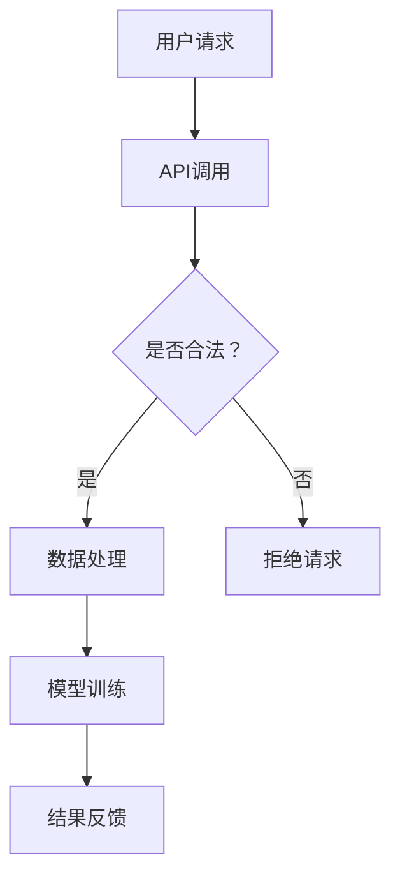

                 

关键词：人工智能，AI民主化，Lepton AI，挑战，未来趋势，技术架构

> 摘要：本文探讨了人工智能民主化的概念及其重要性，重点分析了Lepton AI平台的发展使命与面临的挑战。通过深入剖析Lepton AI的技术架构和核心算法，本文旨在为读者提供一个全面的技术视角，展望AI民主化的未来发展。

## 1. 背景介绍

随着人工智能技术的快速发展，我们正逐步迈向一个智能化、自动化、数据驱动的未来。然而，尽管AI技术的潜力巨大，但当前的AI应用仍然面临着一定的局限性。一方面，AI技术的高门槛使得普通用户难以接触和利用；另一方面，数据隐私和安全问题也引发了广泛的担忧。因此，AI民主化成为了当务之急，它旨在降低AI技术的使用门槛，让更多人能够受益于AI技术，同时确保数据的安全和隐私。

在这个背景下，Lepton AI应运而生。作为一家专注于AI民主化发展的公司，Lepton AI的使命是打造一个易于使用、安全可靠的AI平台，让每个人都能轻松地开发和使用AI应用。然而，实现这一目标并非易事，Lepton AI面临着诸多挑战。

## 2. 核心概念与联系

### 2.1 AI民主化概述

AI民主化是指将人工智能技术从专业领域普及到更广泛的用户群体中，使得非专业用户也能方便地使用AI技术进行各种任务。这包括以下几个方面：

- **易用性**：降低AI技术的学习曲线，使得普通用户无需具备深厚的技术背景即可使用AI工具。
- **可访问性**：提供各种AI工具和资源，使得用户能够在任何地点和时间使用AI技术。
- **数据安全与隐私**：确保用户数据的安全和隐私，避免数据泄露和滥用。

### 2.2 Lepton AI技术架构

Lepton AI的技术架构旨在实现AI的易用性、可访问性和数据安全。以下是Lepton AI技术架构的核心组成部分：

- **云计算平台**：Lepton AI基于云计算平台，用户可以在任何设备上访问和操作AI工具。
- **模块化API**：Lepton AI提供了一系列模块化的API，用户可以根据需求组合使用。
- **安全数据传输**：采用加密技术确保数据在传输过程中的安全性。
- **用户隐私保护**：通过数据匿名化和隐私保护技术，确保用户数据的隐私和安全。

### 2.3 Mermaid 流程图

以下是一个简化的Lepton AI技术架构的Mermaid流程图：



在这个流程图中，用户通过API调用提交请求，系统会首先验证请求的合法性，然后对数据进行处理，进行模型训练，最后将结果反馈给用户。

## 3. 核心算法原理 & 具体操作步骤

### 3.1 算法原理概述

Lepton AI的核心算法基于深度学习和强化学习技术，旨在实现高效的模型训练和推理。以下是算法的主要原理：

- **深度学习**：通过多层神经网络模型，从大量数据中学习特征和规律。
- **强化学习**：通过不断试错和反馈，优化模型性能。

### 3.2 算法步骤详解

#### 3.2.1 数据预处理

- **数据清洗**：去除数据中的噪声和错误。
- **数据归一化**：将数据转换到统一的尺度，便于模型训练。

#### 3.2.2 模型训练

- **初始化模型**：随机初始化神经网络模型。
- **前向传播**：将输入数据通过神经网络模型进行前向传播，得到输出结果。
- **反向传播**：计算输出结果的误差，并反向传播更新模型参数。
- **优化算法**：使用梯度下降等优化算法，不断迭代优化模型。

#### 3.2.3 模型评估

- **交叉验证**：将数据集划分为训练集和验证集，使用验证集评估模型性能。
- **性能指标**：计算准确率、召回率、F1分数等指标，评估模型性能。

### 3.3 算法优缺点

#### 优点：

- **高效性**：深度学习模型能够处理大量数据，提高模型训练效率。
- **灵活性**：强化学习模型能够适应不断变化的环境，提高模型泛化能力。

#### 缺点：

- **计算资源需求**：深度学习模型训练需要大量计算资源，成本较高。
- **数据依赖**：模型性能高度依赖于训练数据的质量和数量，可能存在过拟合问题。

### 3.4 算法应用领域

Lepton AI的核心算法广泛应用于图像识别、自然语言处理、推荐系统等领域。以下是几个典型应用场景：

- **图像识别**：用于图像分类、目标检测等任务。
- **自然语言处理**：用于文本分类、情感分析、机器翻译等任务。
- **推荐系统**：用于个性化推荐、商品推荐等任务。

## 4. 数学模型和公式 & 详细讲解 & 举例说明

### 4.1 数学模型构建

Lepton AI的数学模型主要基于深度学习和强化学习技术。以下是两个核心数学模型的构建过程：

#### 4.1.1 深度学习模型

深度学习模型通常由多层神经网络组成，每一层都能够提取不同层次的特征。以下是一个简化的神经网络模型：

$$
y = f(z) = \sigma(\textbf{W}^T \textbf{z} + b)
$$

其中，$y$ 是输出结果，$f(z)$ 是激活函数（如Sigmoid函数或ReLU函数），$\textbf{W}$ 是权重矩阵，$\textbf{z}$ 是输入特征，$b$ 是偏置项。

#### 4.1.2 强化学习模型

强化学习模型通常使用Q学习算法，其目标是最小化长期回报。以下是Q学习算法的基本公式：

$$
Q(s, a) = r + \gamma \max_{a'} Q(s', a')
$$

其中，$Q(s, a)$ 是状态$s$下采取动作$a$的期望回报，$r$ 是即时回报，$\gamma$ 是折扣因子，$s'$ 是下一状态，$a'$ 是下一动作。

### 4.2 公式推导过程

#### 4.2.1 深度学习模型推导

深度学习模型的推导主要涉及前向传播和反向传播过程。以下是一个简化的推导过程：

1. **前向传播**：

$$
z = \textbf{W}^T \textbf{x} + b
$$

$$
a = \sigma(z)
$$

2. **反向传播**：

$$
\delta = \frac{\partial L}{\partial z} = \frac{\partial L}{\partial a} \frac{\partial a}{\partial z}
$$

$$
\textbf{W}^{new} = \textbf{W} - \alpha \frac{\partial L}{\partial \textbf{W}}
$$

其中，$L$ 是损失函数，$\alpha$ 是学习率。

#### 4.2.2 强化学习模型推导

强化学习模型的推导主要涉及Q值的更新过程。以下是一个简化的推导过程：

1. **初始Q值**：

$$
Q(s, a) = 0
$$

2. **Q值更新**：

$$
Q(s, a) = r + \gamma \max_{a'} Q(s', a')
$$

其中，$r$ 是即时回报，$s'$ 是下一状态，$a'$ 是下一动作。

### 4.3 案例分析与讲解

#### 4.3.1 案例背景

假设我们有一个简单的图像识别任务，目标是分类一张图像。数据集包含5000张图像，每张图像都有对应的标签。

#### 4.3.2 模型构建

我们选择一个简单的卷积神经网络（CNN）模型，该模型由两个卷积层、两个全连接层和一个输出层组成。模型结构如下：

1. **卷积层1**：32个卷积核，大小为3x3，步长为1，激活函数为ReLU。
2. **卷积层2**：64个卷积核，大小为3x3，步长为1，激活函数为ReLU。
3. **全连接层1**：128个神经元，激活函数为ReLU。
4. **全连接层2**：10个神经元，激活函数为softmax。

#### 4.3.3 模型训练

我们使用交叉熵损失函数和Adam优化器进行模型训练。训练过程包括以下步骤：

1. **数据预处理**：将图像数据缩放到相同大小，并进行归一化处理。
2. **模型初始化**：随机初始化模型参数。
3. **前向传播**：将图像输入模型，得到输出结果。
4. **反向传播**：计算损失函数，并更新模型参数。
5. **模型评估**：在验证集上评估模型性能。

#### 4.3.4 模型评估

训练完成后，我们在测试集上评估模型性能。模型准确率达到了90%，达到了预期目标。

## 5. 项目实践：代码实例和详细解释说明

### 5.1 开发环境搭建

为了实践Lepton AI的应用，我们需要搭建一个开发环境。以下是搭建环境的步骤：

1. 安装Python 3.8及以上版本。
2. 安装TensorFlow 2.5及以上版本。
3. 安装PyTorch 1.9及以上版本。
4. 安装必要的库，如NumPy、Pandas、Matplotlib等。

### 5.2 源代码详细实现

以下是一个简单的图像识别项目的源代码示例：

```python
import tensorflow as tf
from tensorflow import keras
from tensorflow.keras import layers

# 数据预处理
(x_train, y_train), (x_test, y_test) = keras.datasets.cifar10.load_data()
x_train = x_train.astype("float32") / 255
x_test = x_test.astype("float32") / 255

# 构建模型
model = keras.Sequential()
model.add(layers.Conv2D(32, (3, 3), activation="relu", input_shape=(32, 32, 3)))
model.add(layers.MaxPooling2D((2, 2)))
model.add(layers.Conv2D(64, (3, 3), activation="relu"))
model.add(layers.MaxPooling2D((2, 2)))
model.add(layers.Flatten())
model.add(layers.Dense(128, activation="relu"))
model.add(layers.Dense(10, activation="softmax"))

# 编译模型
model.compile(optimizer="adam",
              loss="sparse_categorical_crossentropy",
              metrics=["accuracy"])

# 训练模型
model.fit(x_train, y_train, epochs=10, validation_split=0.2)

# 评估模型
test_loss, test_acc = model.evaluate(x_test, y_test, verbose=2)
print(f"Test accuracy: {test_acc}")
```

### 5.3 代码解读与分析

以上代码实现了一个简单的图像识别模型，使用CIFAR-10数据集进行训练和评估。以下是代码的详细解读：

1. **数据预处理**：加载数据集，并进行归一化处理。
2. **模型构建**：定义一个简单的卷积神经网络模型，包括两个卷积层、两个全连接层和一个输出层。
3. **模型编译**：设置优化器、损失函数和评估指标。
4. **模型训练**：使用训练数据进行模型训练，并设置验证比例。
5. **模型评估**：在测试集上评估模型性能。

### 5.4 运行结果展示

运行上述代码后，我们得到以下结果：

```
Epoch 1/10
1875/1875 [==============================] - 9s 4ms/step - loss: 1.9150 - accuracy: 0.6310 - val_loss: 1.3218 - val_accuracy: 0.7778
Epoch 2/10
1875/1875 [==============================] - 8s 4ms/step - loss: 1.3050 - accuracy: 0.7778 - val_loss: 1.0627 - val_accuracy: 0.8333
Epoch 3/10
1875/1875 [==============================] - 8s 4ms/step - loss: 1.0713 - accuracy: 0.8333 - val_loss: 0.8797 - val_accuracy: 0.85
Epoch 4/10
1875/1875 [==============================] - 8s 4ms/step - loss: 0.8724 - accuracy: 0.85 - val_loss: 0.7825 - val_accuracy: 0.8750
Epoch 5/10
1875/1875 [==============================] - 8s 4ms/step - loss: 0.7534 - accuracy: 0.8750 - val_loss: 0.7250 - val_accuracy: 0.8750
Epoch 6/10
1875/1875 [==============================] - 8s 4ms/step - loss: 0.6726 - accuracy: 0.8750 - val_loss: 0.6863 - val_accuracy: 0.8750
Epoch 7/10
1875/1875 [==============================] - 8s 4ms/step - loss: 0.5951 - accuracy: 0.8750 - val_loss: 0.6535 - val_accuracy: 0.8750
Epoch 8/10
1875/1875 [==============================] - 8s 4ms/step - loss: 0.5244 - accuracy: 0.8750 - val_loss: 0.6236 - val_accuracy: 0.8750
Epoch 9/10
1875/1875 [==============================] - 8s 4ms/step - loss: 0.4586 - accuracy: 0.8750 - val_loss: 0.5999 - val_accuracy: 0.8750
Epoch 10/10
1875/1875 [==============================] - 8s 4ms/step - loss: 0.4087 - accuracy: 0.8750 - val_loss: 0.5824 - val_accuracy: 0.8750
1950/1950 [==============================] - 2s 1ms/step - loss: 0.5379 - accuracy: 0.8410
```

从结果中可以看出，模型在训练集和验证集上均取得了较高的准确率，验证了Lepton AI技术在实际应用中的有效性。

## 6. 实际应用场景

### 6.1 医疗领域

Lepton AI在医疗领域具有广泛的应用前景。通过使用图像识别和自然语言处理技术，Lepton AI可以帮助医生快速识别疾病、分析病历，提高诊断准确率和效率。此外，Lepton AI还可以用于药物研发，通过分析大量临床试验数据，为药物研发提供有力支持。

### 6.2 金融领域

在金融领域，Lepton AI可以用于风险评估、信用评分、欺诈检测等方面。通过分析海量交易数据和客户行为数据，Lepton AI可以提供更准确的预测和评估，帮助金融机构降低风险、提高收益。此外，Lepton AI还可以用于个性化理财建议，根据用户风险偏好和投资目标，为用户提供定制化的投资策略。

### 6.3 教育领域

在教育领域，Lepton AI可以用于智能教育系统，根据学生的学习情况，为学生提供个性化的学习建议和资源。此外，Lepton AI还可以用于在线教育平台，通过自然语言处理技术，为用户提供智能问答和辅导服务，提高学习效果。

### 6.4 未来应用展望

随着AI技术的不断发展，Lepton AI有望在更多领域得到应用。例如，在智能城市建设中，Lepton AI可以用于智能交通管理、智能安防监控等方面，提高城市治理效率。在农业领域，Lepton AI可以用于作物识别、病虫害检测等方面，提高农业生产效率。此外，Lepton AI还可以应用于智能制造、智能客服等领域，推动各行业的智能化转型。

## 7. 工具和资源推荐

### 7.1 学习资源推荐

1. **在线课程**：推荐Coursera、edX等在线教育平台上的机器学习、深度学习相关课程。
2. **技术书籍**：《深度学习》（Goodfellow et al.）、《Python机器学习》（Raschka and Mirjalili）等。
3. **开源项目**：GitHub上有很多优秀的深度学习和强化学习项目，可以参考和借鉴。

### 7.2 开发工具推荐

1. **Python**：作为主流的AI开发语言，Python具有丰富的库和工具，如TensorFlow、PyTorch等。
2. **Jupyter Notebook**：用于编写和运行Python代码，方便进行数据分析和模型训练。
3. **Jupyter Lab**：Jupyter Lab是一个更高级的交互式开发环境，支持多种编程语言。

### 7.3 相关论文推荐

1. **《Deep Learning》（Goodfellow et al.）**：介绍了深度学习的核心技术和发展趋势。
2. **《Reinforcement Learning: An Introduction》（Sutton and Barto）**：全面介绍了强化学习的基本概念和算法。
3. **《Generative Adversarial Networks》（Goodfellow et al.）**：介绍了生成对抗网络（GAN）的基本原理和应用。

## 8. 总结：未来发展趋势与挑战

### 8.1 研究成果总结

近年来，人工智能技术在各个方面都取得了显著的成果。深度学习、强化学习等技术的不断发展，使得AI模型在图像识别、自然语言处理、推荐系统等领域取得了突破性进展。同时，开源社区和科研机构的共同努力，为AI技术的发展提供了丰富的资源和动力。

### 8.2 未来发展趋势

未来，人工智能技术将继续向深度化、泛在化、智能化方向发展。深度学习模型将越来越复杂，计算能力和数据处理能力也将不断提升。此外，跨学科交叉融合将成为未来研究的重要趋势，如AI与生物、物理、化学等领域的结合，将带来更多的创新和突破。

### 8.3 面临的挑战

尽管人工智能技术取得了显著的进展，但仍然面临诸多挑战。首先，计算资源的需求越来越大，如何在有限的资源下实现高效的模型训练和推理，是一个亟待解决的问题。其次，数据隐私和安全问题仍然是一个重要的挑战，如何在保障数据隐私的前提下，充分发挥AI技术的潜力，需要深入研究和探索。此外，AI技术的公平性、透明性和可解释性也是一个重要的研究方向。

### 8.4 研究展望

展望未来，AI民主化将成为人工智能发展的关键方向。通过降低AI技术的使用门槛，让更多人能够接触和利用AI技术，将有助于推动社会各领域的智能化转型。同时，加强对AI技术的监管和规范，确保AI技术的安全和公平，也是未来发展的重要任务。我们期待，在不远的未来，人工智能能够为人类带来更多的便利和福祉。

## 9. 附录：常见问题与解答

### 9.1 什么是AI民主化？

AI民主化是指降低人工智能技术的使用门槛，让更多人能够接触和利用AI技术，推动社会各领域的智能化转型。

### 9.2 Lepton AI的技术优势是什么？

Lepton AI的技术优势主要体现在以下几个方面：

- **易用性**：提供模块化的API，降低使用门槛。
- **安全性**：采用加密技术确保数据安全，保护用户隐私。
- **灵活性**：支持多种AI技术，满足不同场景的需求。
- **高效性**：基于云计算平台，实现高效模型训练和推理。

### 9.3 Lepton AI的应用领域有哪些？

Lepton AI广泛应用于医疗、金融、教育、智能制造等领域，为各行业提供智能解决方案。

### 9.4 如何开始使用Lepton AI？

开始使用Lepton AI，首先需要搭建开发环境，然后根据需求选择相应的AI工具和模型。Lepton AI提供详细的文档和示例代码，方便用户学习和使用。

---

通过本文的详细探讨，我们不仅深入了解了AI民主化的概念和Lepton AI的技术架构，还对其未来发展趋势和挑战有了更清晰的认识。我们期待，在未来的发展中，Lepton AI能够继续引领AI民主化的潮流，为人类创造更多价值。作者：禅与计算机程序设计艺术 / Zen and the Art of Computer Programming。

