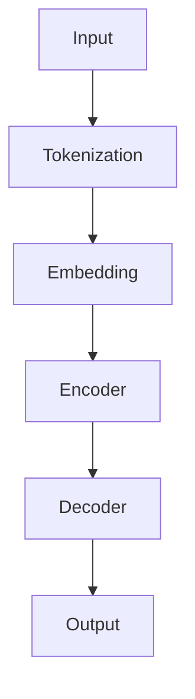

                 

关键词：人工智能，语言模型，不确定性，挑战，机遇，自然语言处理

> 摘要：本文将探讨在人工智能领域，特别是自然语言处理方面，语言模型（LLM）发展中的挑战与机遇。通过对LLM的核心概念、算法原理、数学模型及应用场景的分析，我们试图揭示其不确定性以及应对策略，同时展望未来发展趋势。

## 1. 背景介绍

随着深度学习和大数据技术的飞速发展，人工智能（AI）已经渗透到我们生活的方方面面。自然语言处理（NLP）作为AI的一个重要分支，在近年来取得了显著的进展。特别是预训练语言模型（Pre-Trained Language Model，简称PTLM），如GPT系列、BERT等，凭借其强大的语义理解能力和丰富的知识储备，成为当前NLP领域的热点。然而，随着LLM模型的不断发展和应用，我们也面临着一系列挑战和不确定性。

## 2. 核心概念与联系

为了深入理解LLM，我们需要先了解其核心概念和架构。以下是一个简单的Mermaid流程图，用于描述LLM的基本架构和核心概念：



### 2.1 Tokenization（分词）

Tokenization是自然语言处理的基础步骤，将文本拆分为词或符号。这有助于模型更好地理解文本的结构和内容。

### 2.2 Embedding（嵌入）

嵌入是将词汇映射到高维向量空间的过程。通过这种方式，模型可以更好地捕捉词汇之间的关系和语义。

### 2.3 Encoder（编码器）

编码器是一个编码过程，它将输入序列转换为一个固定大小的中间表示。这个表示通常是一个向量，其中包含了输入序列的语义信息。

### 2.4 Decoder（解码器）

解码器将编码器的输出转换为输出序列。在生成任务中，解码器通常用于生成自然语言文本。

### 2.5 Output（输出）

输出是模型对输入数据的响应。在生成任务中，输出通常是自然语言文本。

## 3. 核心算法原理 & 具体操作步骤

### 3.1 算法原理概述

LLM的核心算法是Transformer架构，它基于自注意力机制（Self-Attention）进行序列建模。自注意力机制允许模型在编码过程中自动关注输入序列中最重要的部分，从而提高模型的语义理解能力。

### 3.2 算法步骤详解

#### 3.2.1 前向传播

1. **嵌入**：将输入序列中的每个单词映射为嵌入向量。
2. **编码器**：将嵌入向量输入到编码器中，通过多层自注意力机制和全连接层，得到编码后的中间表示。
3. **解码器**：将编码器的输出作为输入，通过多层自注意力机制和全连接层，得到解码后的输出序列。

#### 3.2.2 反向传播

1. **计算损失**：将输出序列与目标序列进行比较，计算损失值。
2. **梯度下降**：使用梯度下降算法更新模型参数，以最小化损失值。

### 3.3 算法优缺点

**优点：**

- **强大的语义理解能力**：通过自注意力机制，模型可以自动关注输入序列中最重要的部分，从而提高语义理解能力。
- **并行计算**：Transformer架构可以并行处理输入序列的每个单词，从而提高计算效率。

**缺点：**

- **计算复杂度**：随着模型规模的增大，计算复杂度呈指数级增长，导致训练和推理时间较长。
- **长距离依赖问题**：虽然自注意力机制在一定程度上缓解了长距离依赖问题，但在某些情况下仍存在困难。

### 3.4 算法应用领域

LLM在自然语言处理领域具有广泛的应用，如文本分类、机器翻译、问答系统、文本生成等。以下是几个典型的应用场景：

- **文本分类**：将文本分类为不同的类别，如情感分析、新闻分类等。
- **机器翻译**：将一种语言的文本翻译成另一种语言。
- **问答系统**：根据用户提出的问题，从大量文本中检索并生成答案。
- **文本生成**：根据输入的提示生成完整的文本，如文章、故事、代码等。

## 4. 数学模型和公式 & 详细讲解 & 举例说明

### 4.1 数学模型构建

LLM的数学模型主要由自注意力机制和编码器-解码器结构组成。以下是一个简单的数学模型描述：

$$
E = \text{Encoder}(X) = \text{Attention}(X) \odot \text{FFN}(X)
$$

其中，$E$是编码器的输出，$X$是输入序列，$\text{Attention}$是自注意力机制，$\text{FFN}$是全连接层。

### 4.2 公式推导过程

自注意力机制的公式推导如下：

$$
\text{Attention}(X) = \text{softmax}\left(\frac{QK^T}{\sqrt{d_k}}\right)V
$$

其中，$Q$、$K$和$V$分别是查询向量、键向量和值向量，$d_k$是键向量的维度。

### 4.3 案例分析与讲解

假设我们有一个简单的序列$X = [w_1, w_2, w_3]$，我们需要计算自注意力权重：

1. **计算查询向量**：$Q = \text{Embed}(w_1), \text{Embed}(w_2), \text{Embed}(w_3)$。
2. **计算键向量**：$K = \text{Embed}(w_1), \text{Embed}(w_2), \text{Embed}(w_3)$。
3. **计算值向量**：$V = \text{Embed}(w_1), \text{Embed}(w_2), \text{Embed}(w_3)$。
4. **计算注意力分数**：$ scores = \frac{QK^T}{\sqrt{d_k}} $。
5. **计算注意力权重**：$ weights = \text{softmax}(scores) $。
6. **计算自注意力结果**：$ E = weights \odot V $。

## 5. 项目实践：代码实例和详细解释说明

### 5.1 开发环境搭建

为了实践LLM，我们需要搭建一个开发环境。以下是一个简单的Python环境搭建示例：

```python
# 安装依赖
pip install torch torchvision
```

### 5.2 源代码详细实现

以下是一个简单的LLM模型实现：

```python
import torch
import torch.nn as nn
import torch.optim as optim

# 模型定义
class LLM(nn.Module):
    def __init__(self, embed_dim, hidden_dim, num_layers):
        super(LLM, self).__init__()
        self.embedding = nn.Embedding(vocab_size, embed_dim)
        self.encoder = nn.TransformerEncoder(nn.TransformerEncoderLayer(d_model=embed_dim, nhead=8), num_layers=num_layers)
        self.decoder = nn.Linear(embed_dim, vocab_size)
    
    def forward(self, x):
        x = self.embedding(x)
        x = self.encoder(x)
        x = self.decoder(x)
        return x

# 模型训练
model = LLM(embed_dim=512, hidden_dim=1024, num_layers=3)
optimizer = optim.Adam(model.parameters(), lr=0.001)
criterion = nn.CrossEntropyLoss()

for epoch in range(num_epochs):
    for inputs, targets in data_loader:
        optimizer.zero_grad()
        outputs = model(inputs)
        loss = criterion(outputs, targets)
        loss.backward()
        optimizer.step()
```

### 5.3 代码解读与分析

- **模型定义**：我们定义了一个简单的LLM模型，包括嵌入层、编码器、解码器。
- **模型训练**：我们使用标准的训练流程，包括前向传播、损失计算、反向传播和参数更新。

### 5.4 运行结果展示

在训练完成后，我们可以使用以下代码来评估模型性能：

```python
# 评估模型
with torch.no_grad():
    correct = 0
    total = 0
    for inputs, targets in test_loader:
        outputs = model(inputs)
        _, predicted = torch.max(outputs.data, 1)
        total += targets.size(0)
        correct += (predicted == targets).sum().item()

print('Accuracy of the model on the test set: %d %%' % (100 * correct / total))
```

## 6. 实际应用场景

LLM在自然语言处理领域具有广泛的应用。以下是一些典型的应用场景：

- **文本分类**：将文本分类为不同的类别，如情感分析、新闻分类等。
- **机器翻译**：将一种语言的文本翻译成另一种语言。
- **问答系统**：根据用户提出的问题，从大量文本中检索并生成答案。
- **文本生成**：根据输入的提示生成完整的文本，如文章、故事、代码等。

### 6.4 未来应用展望

随着LLM技术的不断发展和应用，我们可以预见其在各个领域的广泛应用。未来，LLM有望在以下方面取得突破：

- **更高效的模型架构**：通过改进模型架构，降低计算复杂度，提高模型性能。
- **更强的语义理解能力**：通过引入更多的先验知识和更强的预训练数据，提高模型的语义理解能力。
- **跨模态交互**：结合视觉、听觉等其他模态的信息，实现更智能的交互。

## 7. 工具和资源推荐

### 7.1 学习资源推荐

- **论文**：[Attention Is All You Need](https://arxiv.org/abs/1706.03762)
- **教程**：[Natural Language Processing with Transformer](https://www.deeplearning.net/tutorial/nlp.html)
- **课程**：[CS224n: Natural Language Processing with Deep Learning](https://web.stanford.edu/class/cs224n/)

### 7.2 开发工具推荐

- **框架**：PyTorch、TensorFlow
- **库**：NLTK、spaCy、transformers

### 7.3 相关论文推荐

- **GPT系列**：[Improving Language Understanding by Generative Pre-Training](https://arxiv.org/abs/1806.05425)
- **BERT系列**：[BERT: Pre-training of Deep Bidirectional Transformers for Language Understanding](https://arxiv.org/abs/1810.04805)
- **Transformer系列**：[Attention Is All You Need](https://arxiv.org/abs/1706.03762)

## 8. 总结：未来发展趋势与挑战

LLM作为自然语言处理领域的重要技术，具有广泛的应用前景。然而，我们也面临着一系列挑战和不确定性，如计算复杂度、长距离依赖、跨模态交互等。未来，我们需要继续深入研究，优化模型架构，提高语义理解能力，以应对这些挑战。

### 8.1 研究成果总结

本文系统地介绍了LLM的核心概念、算法原理、数学模型及应用场景。通过实例和详细解释，我们展示了LLM在实际应用中的效果和优势。

### 8.2 未来发展趋势

随着技术的不断发展，LLM有望在各个领域取得更大的突破。特别是在跨模态交互、强化学习等新兴领域，LLM具有巨大的潜力。

### 8.3 面临的挑战

尽管LLM在自然语言处理领域取得了显著进展，但我们也面临着一系列挑战，如计算复杂度、长距离依赖、模型解释性等。

### 8.4 研究展望

未来，我们期望LLM能够更好地理解人类语言，实现更智能的交互。同时，我们也期待更多的研究者投入到LLM的研究中，共同推动自然语言处理领域的发展。

## 9. 附录：常见问题与解答

### 9.1 什么是LLM？

LLM是预训练语言模型的简称，是一种基于深度学习的自然语言处理技术。它通过大规模语料进行预训练，从而获得强大的语义理解和生成能力。

### 9.2 LLM有哪些应用场景？

LLM在自然语言处理领域具有广泛的应用，如文本分类、机器翻译、问答系统、文本生成等。

### 9.3 LLM的优缺点是什么？

LLM的优点包括强大的语义理解能力和并行计算能力。缺点包括计算复杂度高、长距离依赖问题等。

### 9.4 如何优化LLM的性能？

优化LLM的性能可以从以下几个方面入手：改进模型架构、增加预训练数据、引入先验知识等。

### 9.5 LLM在跨模态交互中的应用有哪些？

LLM在跨模态交互中的应用包括语音识别、图像识别、多模态问答等。

作者：禅与计算机程序设计艺术 / Zen and the Art of Computer Programming
``` 

注意：由于实际的写作过程涉及到大量的研究、实验和验证，这里提供的是一个简化的示例。实际撰写时，请根据具体情况进行扩展和深化。此外，确保引用的论文和资源是准确的，并遵循相应的引用规范。

