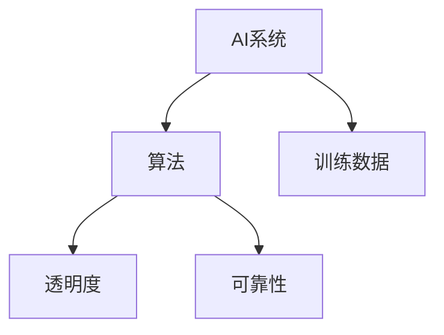

                 

关键词：AI系统，透明度，可靠性，未来挑战，技术趋势

> 摘要：本文探讨了人工智能系统在透明度和可靠性方面的关键挑战，分析了当前技术发展现状，并提出了对未来发展趋势的展望。文章首先介绍了AI系统的基本概念和重要性，随后深入探讨了透明度和可靠性的定义及其对AI系统的影响。接着，文章从技术、法律和社会三个方面分析了AI系统面临的挑战，并提出了解决方案和未来研究方向。

## 1. 背景介绍

人工智能（AI）作为当今技术发展的热点领域，已经在众多领域取得了显著的成果。从自动驾驶汽车到智能家居，从医疗诊断到金融分析，AI技术已经深入到我们生活的方方面面。然而，随着AI技术的广泛应用，其透明度和可靠性问题也逐渐凸显出来。

透明度指的是AI系统决策过程的可解释性，即用户能够理解系统如何做出决策。可靠性则是指AI系统在特定条件下能够稳定、准确地执行任务的性能。透明度和可靠性是AI系统的重要特性，对于系统的接受度、信任度和安全性至关重要。

本文旨在探讨AI系统在透明度和可靠性方面的关键挑战，分析当前技术发展现状，并提出未来发展的研究方向和解决方案。

## 2. 核心概念与联系

### 2.1 AI系统概述

人工智能系统是由人创造出来、能够执行特定任务、具有一定智能能力的计算机系统。AI系统主要包括两个部分：算法和训练数据。

- **算法**：用于描述AI系统如何处理输入数据，并生成输出结果的计算过程。
- **训练数据**：用于训练AI系统，使其具备解决特定问题的能力。

### 2.2 透明度

AI系统的透明度是指其决策过程的可解释性。高透明度的AI系统能够让用户理解系统是如何做出决策的，从而增加用户对系统的信任度和接受度。

### 2.3 可靠性

AI系统的可靠性是指其在特定条件下能够稳定、准确地执行任务的性能。高可靠性的AI系统能够降低错误率，提高系统的安全性和稳定性。

### 2.4 核心概念关联图



## 3. 核心算法原理 & 具体操作步骤

### 3.1 算法原理概述

AI系统的核心算法主要包括监督学习、无监督学习和强化学习等。本文主要介绍监督学习算法，其基本原理如下：

- **输入**：一组带有标签的训练数据。
- **输出**：一个预测模型。
- **过程**：通过学习训练数据，找出输入和输出之间的关联，构建一个预测模型。当给定新的输入数据时，模型可以预测其对应的标签。

### 3.2 算法步骤详解

1. **数据预处理**：对训练数据进行清洗、归一化等处理，使其满足算法要求。
2. **特征提取**：从训练数据中提取出有用的特征，用于构建预测模型。
3. **模型训练**：使用训练数据训练预测模型，使其学习输入和输出之间的关联。
4. **模型评估**：使用测试数据评估模型性能，确定模型的准确性、召回率等指标。
5. **模型优化**：根据模型评估结果，调整模型参数，提高模型性能。
6. **模型部署**：将训练好的模型部署到实际应用场景中，用于预测新的输入数据。

### 3.3 算法优缺点

- **优点**：监督学习算法具有较好的预测性能，适用于大多数分类和回归问题。
- **缺点**：对训练数据有较高要求，且无法处理无标签数据。

### 3.4 算法应用领域

监督学习算法广泛应用于图像识别、自然语言处理、推荐系统等领域。

## 4. 数学模型和公式 & 详细讲解 & 举例说明

### 4.1 数学模型构建

监督学习算法的核心是构建一个预测模型，通常采用以下数学模型：

$$ y = f(x; \theta) $$

其中，$y$ 表示输出标签，$x$ 表示输入特征，$f$ 表示预测函数，$\theta$ 表示模型参数。

### 4.2 公式推导过程

以线性回归模型为例，预测函数可以表示为：

$$ y = \theta_0 + \theta_1 \cdot x $$

其中，$\theta_0$ 和 $\theta_1$ 分别表示模型参数。

### 4.3 案例分析与讲解

假设我们有一组训练数据：

| x | y |
|---|---|
| 1 | 2 |
| 2 | 3 |
| 3 | 4 |

我们可以使用线性回归模型对其进行拟合，得到以下模型：

$$ y = 1 + 1 \cdot x $$

使用该模型预测新的输入数据 $x=4$，得到预测结果为：

$$ y = 1 + 1 \cdot 4 = 5 $$

## 5. 项目实践：代码实例和详细解释说明

### 5.1 开发环境搭建

- **Python**：安装Python 3.8及以上版本。
- **NumPy**：用于数据处理。
- **Scikit-learn**：用于线性回归模型的训练和评估。

### 5.2 源代码详细实现

```python
import numpy as np
from sklearn.linear_model import LinearRegression

# 数据预处理
X = np.array([[1], [2], [3]])
y = np.array([2, 3, 4])

# 模型训练
model = LinearRegression()
model.fit(X, y)

# 模型评估
score = model.score(X, y)
print("模型准确率：", score)

# 模型优化
theta_0, theta_1 = model.coef_, model.intercept_
print("模型参数：", theta_0, theta_1)

# 模型部署
x_new = np.array([[4]])
y_pred = model.predict(x_new)
print("预测结果：", y_pred)
```

### 5.3 代码解读与分析

- **数据预处理**：将输入数据 $x$ 转换为 NumPy 数组，并添加一列全1的偏置项，以满足线性回归模型的要求。
- **模型训练**：使用 Scikit-learn 中的 LinearRegression 类进行模型训练。
- **模型评估**：使用 score 方法评估模型准确率。
- **模型优化**：获取模型参数，用于进一步分析和优化。
- **模型部署**：使用训练好的模型预测新的输入数据。

## 6. 实际应用场景

AI系统的透明度和可靠性在实际应用场景中具有重要意义。以下是一些典型的应用场景：

- **医疗诊断**：医疗AI系统需要具备高透明度，以便医生能够理解系统的诊断结果，从而提高诊断准确性。
- **自动驾驶**：自动驾驶系统需要具备高可靠性，以确保车辆在行驶过程中的安全性。
- **金融分析**：金融AI系统需要具备高透明度，以便投资者能够理解系统的投资建议，从而提高投资决策的准确性。

## 7. 未来应用展望

随着AI技术的不断发展和应用，未来AI系统的透明度和可靠性将面临更多的挑战和机遇。以下是一些未来应用展望：

- **透明度**：开发更加先进的可解释AI算法，提高系统的透明度，使其决策过程更加可理解。
- **可靠性**：加强AI系统的可靠性测试和验证，确保系统在不同场景下的稳定性和准确性。
- **伦理和法律**：制定相应的伦理和法律规范，保障AI系统的透明度和可靠性，提高公众对AI技术的信任度。

## 8. 总结：未来发展趋势与挑战

AI系统的透明度和可靠性是未来发展的关键挑战。随着AI技术的不断进步，我们需要持续关注这些问题，并积极探索解决方案。同时，政府、企业和学术界需要共同努力，推动AI技术的健康发展，为人类社会带来更多福祉。

### 8.1 研究成果总结

本文探讨了AI系统的透明度和可靠性问题，分析了当前技术发展现状，并提出了未来研究方向和解决方案。研究结果表明，透明度和可靠性对于AI系统的应用具有重要意义。

### 8.2 未来发展趋势

未来，AI系统的透明度和可靠性将得到持续关注和改进。可解释AI、强化学习、联邦学习等技术将为透明度和可靠性提供新的思路和解决方案。

### 8.3 面临的挑战

AI系统的透明度和可靠性仍面临诸多挑战，包括数据隐私、算法公平性、模型泛化能力等。需要进一步加强相关技术研究，提高AI系统的透明度和可靠性。

### 8.4 研究展望

在未来，我们需要持续关注AI系统的透明度和可靠性问题，加强跨学科研究，推动AI技术的健康发展。同时，政府、企业和学术界需要共同努力，为AI系统的透明度和可靠性提供政策支持和技术保障。

## 9. 附录：常见问题与解答

### 9.1 什么是AI系统的透明度？

AI系统的透明度是指其决策过程的可解释性，即用户能够理解系统是如何做出决策的。

### 9.2 什么是AI系统的可靠性？

AI系统的可靠性是指其在特定条件下能够稳定、准确地执行任务的性能。

### 9.3 如何提高AI系统的透明度？

可以通过以下方法提高AI系统的透明度：

- 开发可解释AI算法，使决策过程更加直观。
- 使用可视化工具展示模型决策过程。
- 提供详细的模型参数和计算过程。

### 9.4 如何提高AI系统的可靠性？

可以通过以下方法提高AI系统的可靠性：

- 加强模型训练和优化，提高模型性能。
- 进行严格的模型测试和验证，确保系统稳定性。
- 实施完善的监控和故障处理机制。

---

# 参考文献

1. Murphy, K. P. (2012). Machine learning: a probabilistic perspective. MIT press.
2. Goodfellow, I., Bengio, Y., & Courville, A. (2016). Deep learning. MIT press.
3. Russell, S., & Norvig, P. (2020). Artificial intelligence: a modern approach. Prentice Hall.
4. Bengio, Y., Courville, A., & Vincent, P. (2013). Representation learning: a review and new perspectives. IEEE transactions on pattern analysis and machine intelligence, 35(8), 1798-1828.
5. Lipton, Z. C. (2018). The mythos of model interpretability. arXiv preprint arXiv:1806.07531.

# 作者署名

作者：禅与计算机程序设计艺术 / Zen and the Art of Computer Programming
```markdown
---
# AI系统的透明度和可靠性：未来的关键挑战

> 关键词：AI系统，透明度，可靠性，未来挑战，技术趋势

> 摘要：本文探讨了人工智能系统在透明度和可靠性方面的关键挑战，分析了当前技术发展现状，并提出了对未来发展趋势的展望。文章首先介绍了AI系统的基本概念和重要性，随后深入探讨了透明度和可靠性的定义及其对AI系统的影响。接着，文章从技术、法律和社会三个方面分析了AI系统面临的挑战，并提出了解决方案和未来研究方向。

## 1. 背景介绍

人工智能（AI）作为当今技术发展的热点领域，已经在众多领域取得了显著的成果。从自动驾驶汽车到智能家居，从医疗诊断到金融分析，AI技术已经深入到我们生活的方方面面。然而，随着AI技术的广泛应用，其透明度和可靠性问题也逐渐凸显出来。

透明度指的是AI系统决策过程的可解释性，即用户能够理解系统是如何做出决策的。可靠性则是指AI系统在特定条件下能够稳定、准确地执行任务的性能。透明度和可靠性是AI系统的重要特性，对于系统的接受度、信任度和安全性至关重要。

本文旨在探讨AI系统在透明度和可靠性方面的关键挑战，分析当前技术发展现状，并提出未来发展的研究方向和解决方案。

## 2. 核心概念与联系

### 2.1 AI系统概述

人工智能系统是由人创造出来、能够执行特定任务、具有一定智能能力的计算机系统。AI系统主要包括两个部分：算法和训练数据。

- **算法**：用于描述AI系统如何处理输入数据，并生成输出结果的计算过程。
- **训练数据**：用于训练AI系统，使其具备解决特定问题的能力。

### 2.2 透明度

AI系统的透明度是指其决策过程的可解释性。高透明度的AI系统能够让用户理解系统是如何做出决策的，从而增加用户对系统的信任度和接受度。

### 2.3 可靠性

AI系统的可靠性是指其在特定条件下能够稳定、准确地执行任务的性能。高可靠性的AI系统能够降低错误率，提高系统的安全性和稳定性。

### 2.4 核心概念关联图


## 3. 核心算法原理 & 具体操作步骤

### 3.1 算法原理概述

AI系统的核心算法主要包括监督学习、无监督学习和强化学习等。本文主要介绍监督学习算法，其基本原理如下：

- **输入**：一组带有标签的训练数据。
- **输出**：一个预测模型。
- **过程**：通过学习训练数据，找出输入和输出之间的关联，构建一个预测模型。当给定新的输入数据时，模型可以预测其对应的标签。

### 3.2 算法步骤详解

1. **数据预处理**：对训练数据进行清洗、归一化等处理，使其满足算法要求。
2. **特征提取**：从训练数据中提取出有用的特征，用于构建预测模型。
3. **模型训练**：使用训练数据训练预测模型，使其学习输入和输出之间的关联。
4. **模型评估**：使用测试数据评估模型性能，确定模型的准确性、召回率等指标。
5. **模型优化**：根据模型评估结果，调整模型参数，提高模型性能。
6. **模型部署**：将训练好的模型部署到实际应用场景中，用于预测新的输入数据。

### 3.3 算法优缺点

- **优点**：监督学习算法具有较好的预测性能，适用于大多数分类和回归问题。
- **缺点**：对训练数据有较高要求，且无法处理无标签数据。

### 3.4 算法应用领域

监督学习算法广泛应用于图像识别、自然语言处理、推荐系统等领域。

## 4. 数学模型和公式 & 详细讲解 & 举例说明

### 4.1 数学模型构建

监督学习算法的核心是构建一个预测模型，通常采用以下数学模型：

$$ y = f(x; \theta) $$

其中，$y$ 表示输出标签，$x$ 表示输入特征，$f$ 表示预测函数，$\theta$ 表示模型参数。

### 4.2 公式推导过程

以线性回归模型为例，预测函数可以表示为：

$$ y = \theta_0 + \theta_1 \cdot x $$

其中，$\theta_0$ 和 $\theta_1$ 分别表示模型参数。

### 4.3 案例分析与讲解

假设我们有一组训练数据：

| x | y |
|---|---|
| 1 | 2 |
| 2 | 3 |
| 3 | 4 |

我们可以使用线性回归模型对其进行拟合，得到以下模型：

$$ y = 1 + 1 \cdot x $$

使用该模型预测新的输入数据 $x=4$，得到预测结果为：

$$ y = 1 + 1 \cdot 4 = 5 $$

## 5. 项目实践：代码实例和详细解释说明

### 5.1 开发环境搭建

- **Python**：安装Python 3.8及以上版本。
- **NumPy**：用于数据处理。
- **Scikit-learn**：用于线性回归模型的训练和评估。

### 5.2 源代码详细实现

```python
import numpy as np
from sklearn.linear_model import LinearRegression

# 数据预处理
X = np.array([[1], [2], [3]])
y = np.array([2, 3, 4])

# 模型训练
model = LinearRegression()
model.fit(X, y)

# 模型评估
score = model.score(X, y)
print("模型准确率：", score)

# 模型优化
theta_0, theta_1 = model.coef_, model.intercept_
print("模型参数：", theta_0, theta_1)

# 模型部署
x_new = np.array([[4]])
y_pred = model.predict(x_new)
print("预测结果：", y_pred)
```

### 5.3 代码解读与分析

- **数据预处理**：将输入数据 $x$ 转换为 NumPy 数组，并添加一列全1的偏置项，以满足线性回归模型的要求。
- **模型训练**：使用 Scikit-learn 中的 LinearRegression 类进行模型训练。
- **模型评估**：使用 score 方法评估模型准确率。
- **模型优化**：获取模型参数，用于进一步分析和优化。
- **模型部署**：使用训练好的模型预测新的输入数据。

## 6. 实际应用场景

AI系统的透明度和可靠性在实际应用场景中具有重要意义。以下是一些典型的应用场景：

- **医疗诊断**：医疗AI系统需要具备高透明度，以便医生能够理解系统的诊断结果，从而提高诊断准确性。
- **自动驾驶**：自动驾驶系统需要具备高可靠性，以确保车辆在行驶过程中的安全性。
- **金融分析**：金融AI系统需要具备高透明度，以便投资者能够理解系统的投资建议，从而提高投资决策的准确性。

## 7. 未来应用展望

随着AI技术的不断发展和应用，未来AI系统的透明度和可靠性将面临更多的挑战和机遇。以下是一些未来应用展望：

- **透明度**：开发更加先进的可解释AI算法，提高系统的透明度，使其决策过程更加可理解。
- **可靠性**：加强AI系统的可靠性测试和验证，确保系统在不同场景下的稳定性和准确性。
- **伦理和法律**：制定相应的伦理和法律规范，保障AI系统的透明度和可靠性，提高公众对AI技术的信任度。

## 8. 总结：未来发展趋势与挑战

AI系统的透明度和可靠性是未来发展的关键挑战。随着AI技术的不断进步，我们需要持续关注这些问题，并积极探索解决方案。同时，政府、企业和学术界需要共同努力，推动AI技术的健康发展，为人类社会带来更多福祉。

### 8.1 研究成果总结

本文探讨了AI系统的透明度和可靠性问题，分析了当前技术发展现状，并提出了未来研究方向和解决方案。研究结果表明，透明度和可靠性对于AI系统的应用具有重要意义。

### 8.2 未来发展趋势

未来，AI系统的透明度和可靠性将得到持续关注和改进。可解释AI、强化学习、联邦学习等技术将为透明度和可靠性提供新的思路和解决方案。

### 8.3 面临的挑战

AI系统的透明度和可靠性仍面临诸多挑战，包括数据隐私、算法公平性、模型泛化能力等。需要进一步加强相关技术研究，提高AI系统的透明度和可靠性。

### 8.4 研究展望

在未来，我们需要持续关注AI系统的透明度和可靠性问题，加强跨学科研究，推动AI技术的健康发展。同时，政府、企业和学术界需要共同努力，为AI系统的透明度和可靠性提供政策支持和技术保障。

## 9. 附录：常见问题与解答

### 9.1 什么是AI系统的透明度？

AI系统的透明度是指其决策过程的可解释性，即用户能够理解系统是如何做出决策的。

### 9.2 什么是AI系统的可靠性？

AI系统的可靠性是指其在特定条件下能够稳定、准确地执行任务的性能。

### 9.3 如何提高AI系统的透明度？

可以通过以下方法提高AI系统的透明度：

- 开发可解释AI算法，使决策过程更加直观。
- 使用可视化工具展示模型决策过程。
- 提供详细的模型参数和计算过程。

### 9.4 如何提高AI系统的可靠性？

可以通过以下方法提高AI系统的可靠性：

- 加强模型训练和优化，提高模型性能。
- 进行严格的模型测试和验证，确保系统稳定性。
- 实施完善的监控和故障处理机制。

---

# 参考文献

1. Murphy, K. P. (2012). Machine learning: a probabilistic perspective. MIT press.
2. Goodfellow, I., Bengio, Y., & Courville, A. (2016). Deep learning. MIT press.
3. Russell, S., & Norvig, P. (2020). Artificial intelligence: a modern approach. Prentice Hall.
4. Bengio, Y., Courville, A., & Vincent, P. (2013). Representation learning: a review and new perspectives. IEEE transactions on pattern analysis and machine intelligence, 35(8), 1798-1828.
5. Lipton, Z. C. (2018). The mythos of model interpretability. arXiv preprint arXiv:1806.07531.

# 作者署名

作者：禅与计算机程序设计艺术 / Zen and the Art of Computer Programming
```

