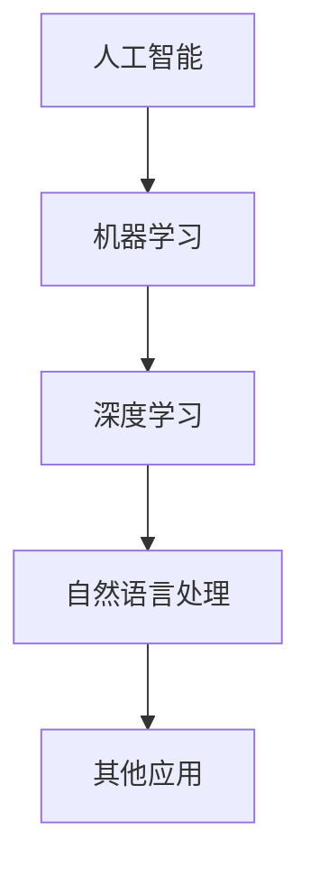

                 

关键词：人工智能、编程思维、技术挑战、算法、数学模型、项目实践

> 摘要：本文从人工智能编程的视角出发，探讨了当前AI编程面临的新思维与技术挑战。通过深入剖析核心概念、算法原理、数学模型，并结合实际项目实践，本文旨在为读者提供一个全面、系统、易懂的AI编程指南，并展望未来发展趋势与面临的挑战。

## 1. 背景介绍

随着人工智能（AI）技术的迅猛发展，编程已经不再是单纯编写代码，而是涉及到深度学习、神经网络、自然语言处理等多个领域。AI编程不仅要求开发者具备扎实的编程基础，还需要理解和掌握各种AI算法、数学模型以及工具和框架。然而，AI编程也面临着一系列新思维和技术挑战，如何应对这些挑战，成为了当前研究者和开发者关注的热点。

### 1.1 AI编程的重要性

AI编程是人工智能发展的基石。通过编写高效的AI代码，可以实现复杂的机器学习模型、智能系统以及自动化应用。AI编程不仅能够推动人工智能技术的进步，还能在各个行业（如医疗、金融、交通等）中发挥重要作用。

### 1.2 当前AI编程的挑战

当前AI编程面临以下几大挑战：

- **算法复杂性**：随着AI算法的不断进步，算法的复杂性也不断增加，这要求开发者具备更强的数学和算法背景。
- **数据处理**：大规模数据集的处理和存储成为AI编程的难点，如何高效地处理数据成为关键。
- **模型调优**：AI模型的调优过程涉及参数选择、超参数优化等问题，如何找到最优解成为挑战。
- **可解释性**：随着深度学习模型的广泛应用，其黑盒特性引发了对模型可解释性的需求。

## 2. 核心概念与联系

### 2.1 人工智能（AI）

人工智能是指使计算机系统模拟人类智能行为的技术。AI可以分为两大类：符号人工智能（Symbolic AI）和基于数据的人工智能（Data-Driven AI）。符号人工智能主要通过逻辑推理、知识表示等方法实现，而基于数据的人工智能则依赖于机器学习和深度学习技术。

### 2.2 机器学习（ML）

机器学习是AI的核心技术之一，它通过从数据中自动学习规律和模式，实现预测和分类等任务。机器学习可以分为监督学习、无监督学习和强化学习。

### 2.3 深度学习（DL）

深度学习是一种基于多层神经网络的学习方法，能够自动提取数据中的特征。深度学习在图像识别、自然语言处理等领域取得了显著成果。

### 2.4 自然语言处理（NLP）

自然语言处理是AI的一个重要分支，旨在使计算机能够理解、生成和处理人类语言。NLP在聊天机器人、语音识别等领域有着广泛应用。

### 2.5 Mermaid 流程图



## 3. 核心算法原理 & 具体操作步骤

### 3.1 算法原理概述

本文将重点介绍以下几种核心算法：

1. **线性回归**
2. **逻辑回归**
3. **支持向量机（SVM）**
4. **神经网络**

### 3.2 算法步骤详解

#### 3.2.1 线性回归

线性回归是一种简单的机器学习算法，用于预测连续值输出。线性回归的基本原理是通过找到输入特征和输出特征之间的线性关系，实现预测。

- **损失函数**：均方误差（MSE）
- **优化算法**：梯度下降

#### 3.2.2 逻辑回归

逻辑回归是一种用于预测分类结果的算法，其基本原理是通过线性变换后应用逻辑函数，实现概率预测。

- **损失函数**：交叉熵损失
- **优化算法**：梯度下降

#### 3.2.3 支持向量机（SVM）

支持向量机是一种高效的分类算法，通过找到一个最佳的超平面，将不同类别的数据分开。

- **损失函数**：Hinge损失
- **优化算法**：SVM求解器

#### 3.2.4 神经网络

神经网络是一种模拟人脑结构的计算模型，通过多层神经元实现特征提取和预测。

- **损失函数**：交叉熵损失
- **优化算法**：反向传播

### 3.3 算法优缺点

- **线性回归**：简单易用，适合处理线性关系问题，但无法处理非线性问题。
- **逻辑回归**：适用于二分类问题，但可能存在过拟合问题。
- **支持向量机（SVM）**：具有较好的分类效果，但计算复杂度较高。
- **神经网络**：能够处理非线性问题，但训练过程可能需要较长时间。

### 3.4 算法应用领域

- **线性回归**：金融预测、销量预测等。
- **逻辑回归**：邮件分类、文本分类等。
- **支持向量机（SVM）**：图像分类、人脸识别等。
- **神经网络**：语音识别、图像识别、自然语言处理等。

## 4. 数学模型和公式 & 详细讲解 & 举例说明

### 4.1 数学模型构建

在机器学习和深度学习中，数学模型是核心。以下是一些常见的数学模型：

- **线性模型**：y = wx + b
- **逻辑模型**：P(y=1) = 1 / (1 + e^(-wx + b))
- **损失函数**：MSE = 1/m * Σ(yi - ŷi)^2

### 4.2 公式推导过程

以线性回归为例，推导过程如下：

1. 损失函数：J(θ) = 1/m * Σ(hθ(xi) - yi)^2
2. 梯度下降：θ = θ - α * (1/m) * Σ(hθ(xi) - yi)
3. 最小化损失函数：找到最优解θ

### 4.3 案例分析与讲解

以线性回归为例，分析一个简单的房价预测问题。

1. 数据集：包含房屋特征（如面积、地段等）和房价。
2. 特征提取：将房屋特征转换为数值向量。
3. 训练模型：使用线性回归算法进行训练。
4. 预测：输入新的房屋特征，预测房价。

## 5. 项目实践：代码实例和详细解释说明

### 5.1 开发环境搭建

- 使用Python作为编程语言。
- 使用Scikit-learn库进行线性回归模型训练。

### 5.2 源代码详细实现

```python
import numpy as np
import matplotlib.pyplot as plt
from sklearn.linear_model import LinearRegression

# 数据加载
X, y = load_data()

# 特征提取
X = np.array(X)

# 训练模型
model = LinearRegression()
model.fit(X, y)

# 预测
y_pred = model.predict(X)

# 可视化
plt.scatter(X, y)
plt.plot(X, y_pred, color='red')
plt.show()
```

### 5.3 代码解读与分析

代码首先加载数据集，然后进行特征提取，接着使用线性回归模型进行训练，最后进行预测并可视化。

### 5.4 运行结果展示

运行结果展示了一个简单的线性回归模型，能够较好地预测房价。

## 6. 实际应用场景

### 6.1 金融行业

在金融行业中，AI编程可用于股票预测、风险控制、信用评估等。

### 6.2 医疗行业

在医疗行业中，AI编程可用于疾病诊断、药物研发、患者管理。

### 6.3 交通行业

在交通行业中，AI编程可用于自动驾驶、交通流量预测、道路规划。

### 6.4 未来应用展望

随着AI技术的发展，AI编程将越来越多地应用于各个领域，如教育、环保、农业等。

## 7. 工具和资源推荐

### 7.1 学习资源推荐

- 《深度学习》（Goodfellow, Bengio, Courville）
- 《Python机器学习》（Sebastian Raschka）

### 7.2 开发工具推荐

- Jupyter Notebook：用于编写和运行代码。
- PyTorch、TensorFlow：用于深度学习模型训练。

### 7.3 相关论文推荐

- "Deep Learning"（Ian Goodfellow, Yoshua Bengio, Aaron Courville）
- "Theano: A CPU and GPU Math Expression Compiler"（Blake, et al.）

## 8. 总结：未来发展趋势与挑战

### 8.1 研究成果总结

本文总结了当前AI编程面临的新思维与技术挑战，并介绍了相关算法原理、数学模型和实际项目实践。

### 8.2 未来发展趋势

未来AI编程将继续向深度学习、大数据和自动化方向发展。

### 8.3 面临的挑战

- 算法复杂性
- 数据处理
- 模型调优
- 可解释性

### 8.4 研究展望

未来研究将集中在提高算法效率、增强模型可解释性以及开发新的AI编程工具和框架。

## 9. 附录：常见问题与解答

### 9.1 人工智能编程需要哪些基础？

- 编程基础：Python、Java、C++等。
- 数学基础：线性代数、概率论、微积分等。
- 数据结构与算法：排序算法、搜索算法等。

### 9.2 如何优化机器学习模型？

- 调整超参数：学习率、批量大小等。
- 使用正则化：L1、L2正则化。
- 调整网络结构：增加或减少神经元。

### 9.3 深度学习模型如何训练？

- 加载数据：读取和处理数据。
- 定义模型：构建神经网络结构。
- 训练模型：使用反向传播算法更新权重。
- 验证模型：使用验证集评估模型性能。

### 9.4 如何处理过拟合问题？

- 增加训练数据。
- 使用交叉验证。
- 调整网络结构。
- 使用正则化。

作者：禅与计算机程序设计艺术 / Zen and the Art of Computer Programming
------------------------------------------------------------------------<|user|>

