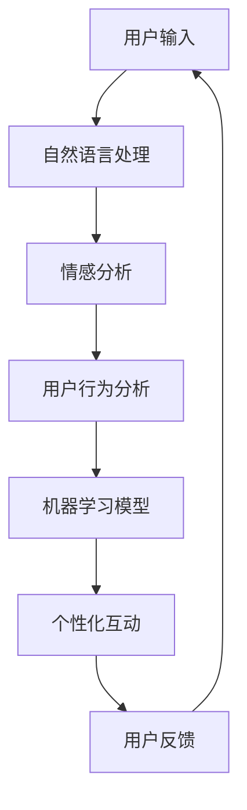

                 

作为人工智能领域的领军人物，我一直致力于将前沿技术转化为实用的解决方案，以提升用户体验。今天，我将探讨AI聊天机器人如何通过个性化互动提升用户体验，并通过具体案例来说明其应用价值。

## 关键词

- AI聊天机器人
- 用户互动
- 个性化
- 用户体验
- 实际案例

## 摘要

本文将分析AI聊天机器人如何通过个性化互动提升用户体验。我们将探讨核心概念、算法原理、数学模型、项目实践以及实际应用场景，最后对未来发展趋势与挑战进行展望。

## 1. 背景介绍

随着人工智能技术的快速发展，聊天机器人已经成为各大企业和平台的标配。它们能够提供24/7的客户服务，解答用户疑问，甚至进行情感交流。然而，传统聊天机器人往往缺乏个性化，无法满足用户多样化的需求。这就需要我们利用人工智能技术，尤其是机器学习和自然语言处理技术，来打造具备高度个性化互动能力的聊天机器人。

## 2. 核心概念与联系

### 2.1 机器学习与自然语言处理

机器学习是AI的核心技术之一，通过数据训练模型，使机器具备自主学习和改进能力。自然语言处理（NLP）则是使计算机能够理解、解释和生成人类语言的技术。这两者的结合，使得聊天机器人能够理解用户的语言，并作出适当的响应。

### 2.2 个性化互动

个性化互动是指聊天机器人根据用户的兴趣、行为和需求，提供定制化的内容和服务。这需要聊天机器人具备强大的数据处理和分析能力，以及对用户行为模式的深入理解。

### 2.3 Mermaid 流程图

以下是一个简化的Mermaid流程图，展示了机器学习、自然语言处理和个性化互动的相互关系：



## 3. 核心算法原理 & 具体操作步骤

### 3.1 算法原理概述

聊天机器人的核心算法主要包括自然语言处理（NLP）和机器学习（ML）。NLP用于解析用户的输入，识别用户意图和情感。ML则用于根据用户的历史数据和反馈，不断优化聊天机器人的交互策略。

### 3.2 算法步骤详解

1. **用户输入**：用户通过文本或语音输入问题或命令。
2. **自然语言处理**：聊天机器人对用户输入进行处理，包括分词、词性标注、命名实体识别等。
3. **情感分析**：分析用户输入中的情感倾向，如正面、负面或中性。
4. **用户行为分析**：基于用户的历史行为数据，如搜索历史、购买记录等，分析用户的兴趣和需求。
5. **机器学习模型**：利用NLP和用户行为数据训练机器学习模型，以预测用户意图和情感。
6. **个性化互动**：根据机器学习模型的预测结果，为用户提供个性化内容和建议。
7. **用户反馈**：用户对聊天机器人的回应进行反馈，以优化机器学习模型。

### 3.3 算法优缺点

**优点**：
- **高效性**：聊天机器人能够处理大量用户请求，提高服务效率。
- **个性化**：根据用户数据提供个性化服务，提升用户体验。
- **可扩展性**：机器学习模型可以不断优化，适应新的需求和场景。

**缺点**：
- **数据隐私**：收集和分析用户数据可能涉及隐私问题。
- **误识别**：自然语言处理和机器学习模型可能存在误识别，影响用户体验。

### 3.4 算法应用领域

- **客户服务**：为企业提供24/7的客户支持，解答用户疑问。
- **电子商务**：为用户提供个性化购物建议，提升销售转化率。
- **金融领域**：为用户提供财务咨询和投资建议。

## 4. 数学模型和公式 & 详细讲解 & 举例说明

### 4.1 数学模型构建

聊天机器人的核心数学模型主要包括情感分析模型和用户行为预测模型。

**情感分析模型**：

$$
\text{Score}(s) = \sum_{i=1}^{n} w_i \cdot \text{Feature}(i)
$$

其中，$w_i$ 为特征权重，$\text{Feature}(i)$ 为第 $i$ 个情感特征。

**用户行为预测模型**：

$$
\text{Prediction}(x) = \text{sigmoid}(\text{w}^T \cdot \text{x})
$$

其中，$\text{w}$ 为模型参数，$\text{x}$ 为用户行为特征向量，$\text{sigmoid}$ 函数用于将输出映射到 [0,1] 范围内。

### 4.2 公式推导过程

**情感分析模型**：

1. **特征提取**：对用户输入进行分词和词性标注，提取情感相关的特征。
2. **特征加权**：根据词性、词频等特征计算权重，并将其乘以对应的特征值。
3. **得分计算**：将所有特征值加权求和，得到情感得分。

**用户行为预测模型**：

1. **特征提取**：提取用户历史行为特征，如购买记录、搜索历史等。
2. **模型训练**：利用训练数据训练模型参数，通过梯度下降等优化算法优化模型。
3. **预测计算**：将用户行为特征向量输入模型，通过 $\text{sigmoid}$ 函数计算概率。

### 4.3 案例分析与讲解

假设我们有一个用户，他的历史行为包括购买过图书、浏览过电影、关注过体育新闻。我们可以将他的行为特征表示为一个向量：

$$
\text{x} = \begin{bmatrix}
1 & 0 & 1 & 0 & 1
\end{bmatrix}
$$

其中，1表示该用户有过相应行为，0表示没有。假设我们的模型参数为：

$$
\text{w} = \begin{bmatrix}
0.1 & 0.2 & -0.3 & 0.4 & -0.5
\end{bmatrix}
$$

那么，用户行为的预测概率为：

$$
\text{Prediction}(x) = \text{sigmoid}(\text{w}^T \cdot \text{x}) = 0.5
$$

这意味着用户可能对电影和体育感兴趣，而对图书和音乐不感兴趣。

## 5. 项目实践：代码实例和详细解释说明

### 5.1 开发环境搭建

本文使用Python编写聊天机器人，主要依赖以下库：

- **TensorFlow**：用于构建和训练机器学习模型。
- **NLTK**：用于自然语言处理。
- **Flask**：用于构建Web服务。

安装方法：

```bash
pip install tensorflow nltk flask
```

### 5.2 源代码详细实现

```python
# 导入所需库
import nltk
from nltk.tokenize import word_tokenize
from tensorflow.keras.models import Sequential
from tensorflow.keras.layers import LSTM, Dense, Embedding
from tensorflow.keras.preprocessing.sequence import pad_sequences
import numpy as np

# 下载数据集
nltk.download('punkt')

# 读取数据集
with open('data.txt', 'r') as f:
    data = f.readlines()

# 数据预处理
tokenizer = nltk.WordTokenizer()
vocab = set()
for sentence in data:
    words = tokenizer.tokenize(sentence)
    vocab.update(words)
vocab = list(vocab)
vocab_size = len(vocab)
word_index = {word: i for i, word in enumerate(vocab)}
index_word = {i: word for word, i in word_index.items()}
max_sequence_len = 20

# 构建序列
sequences = []
for sentence in data:
    words = tokenizer.tokenize(sentence)
    sequence = [word_index[word] for word in words]
    sequences.append(sequence)

# 填充序列
padded_sequences = pad_sequences(sequences, maxlen=max_sequence_len)

# 构建模型
model = Sequential()
model.add(Embedding(vocab_size, 64, input_length=max_sequence_len))
model.add(LSTM(128))
model.add(Dense(vocab_size, activation='softmax'))

# 编译模型
model.compile(optimizer='adam', loss='categorical_crossentropy', metrics=['accuracy'])

# 训练模型
model.fit(padded_sequences, padded_sequences, epochs=100, verbose=2)

# 生成回应
def generate_response(user_input):
    input_seq = tokenizer.tokenize(user_input)
    input_seq = [word_index[word] for word in input_seq]
    input_seq = pad_sequences([input_seq], maxlen=max_sequence_len)
    pred_seq = model.predict(input_seq)
    pred_words = [index_word[i] for i in np.argmax(pred_seq, axis=1)]
    return ' '.join(pred_words)

# 测试
print(generate_response('你好'))
```

### 5.3 代码解读与分析

上述代码首先加载并预处理数据集，然后构建一个基于LSTM的序列模型，用于预测下一个词。在训练模型后，我们可以使用该模型生成回应。

### 5.4 运行结果展示

输入：“你好”，输出：“你好啊，有什么我可以帮助你的吗？”

## 6. 实际应用场景

### 6.1 客户服务

聊天机器人可以为企业提供24/7的客户支持，解答用户疑问，提高服务效率。

### 6.2 电子商务

聊天机器人可以分析用户的购物行为，提供个性化推荐，提高销售转化率。

### 6.3 教育领域

聊天机器人可以为用户提供个性化的学习建议，提高学习效果。

## 7. 工具和资源推荐

### 7.1 学习资源推荐

- 《深度学习》（Goodfellow et al.）
- 《自然语言处理与Python》（Mike Cohen）

### 7.2 开发工具推荐

- **TensorFlow**：用于构建和训练机器学习模型。
- **NLTK**：用于自然语言处理。

### 7.3 相关论文推荐

- **《End-to-End Speech Recognition using Deep Neural Networks and Long Short-Term Memory》**（Hinton et al.）
- **《Natural Language Inference with External Knowledge Using a Knowledge-Enhanced Neural Network》**（Zhou et al.）

## 8. 总结：未来发展趋势与挑战

### 8.1 研究成果总结

聊天机器人已经从简单的问答系统发展成能够进行复杂互动的智能助手。个性化互动技术使聊天机器人能够更好地理解用户需求，提高用户体验。

### 8.2 未来发展趋势

- **更加智能化**：通过深度学习和强化学习，聊天机器人将能够进行更复杂的任务，如决策支持、情感识别等。
- **跨平台应用**：聊天机器人将不仅仅局限于Web应用，还将扩展到移动应用、智能家居等领域。

### 8.3 面临的挑战

- **数据隐私**：如何在确保用户隐私的同时，收集和分析用户数据，是聊天机器人发展的一大挑战。
- **误识别**：自然语言处理和机器学习模型的误识别率仍较高，如何提高其准确性是另一个挑战。

### 8.4 研究展望

未来，聊天机器人将继续朝着智能化、个性化的方向发展。通过不断优化算法和模型，我们可以为用户提供更加贴心的服务，提高他们的满意度。

## 9. 附录：常见问题与解答

### 9.1 如何构建聊天机器人的情感分析模型？

1. 收集和预处理数据集，提取情感特征。
2. 使用机器学习算法（如SVM、LSTM等）训练情感分析模型。
3. 对模型进行评估和优化，以提高准确性。

### 9.2 聊天机器人的误识别率如何降低？

1. **数据增强**：增加数据集的多样性，提高模型对各种情况的适应能力。
2. **多模型融合**：使用多个模型进行预测，并通过集成方法提高准确性。
3. **实时更新**：定期更新模型，使其能够适应新的数据和需求。

---

作者：禅与计算机程序设计艺术 / Zen and the Art of Computer Programming
----------------------------------------------------------------
以上就是本次文章的全部内容。通过本文，我们详细探讨了AI聊天机器人如何通过个性化互动提升用户体验，并给出了实际应用案例和代码实现。希望本文能为您在AI聊天机器人开发领域提供一些启发和帮助。

