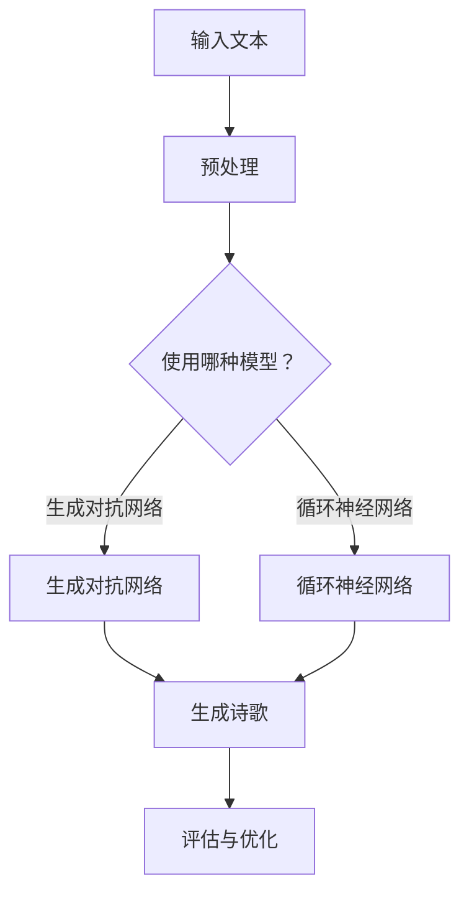

                 

 > 在这个技术飞速发展的时代，人工智能（AI）正逐步渗透到我们生活的方方面面，文学创作领域也不例外。本文旨在探讨如何通过人工智能技术实现诗歌创作，并探讨在结构和自由之间寻找平衡的问题。作者：禅与计算机程序设计艺术 / Zen and the Art of Computer Programming

## 关键词

- 人工智能
- 诗歌创作
- 结构
- 自由
- 自然语言处理

## 摘要

本文首先介绍了人工智能在诗歌创作中的应用，探讨了AI如何通过自然语言处理技术生成诗歌。接着，本文分析了AI在诗歌创作中面临的挑战，特别是在保持诗歌结构和表达自由性方面。最后，本文提出了几种解决方案，并展望了未来人工智能在诗歌创作领域的应用前景。

## 1. 背景介绍

### 1.1 人工智能的发展历程

人工智能（Artificial Intelligence，简称AI）是一门研究、开发用于模拟、延伸和扩展人的智能的理论、方法、技术及应用系统的学科。自20世纪50年代以来，人工智能经历了多个发展阶段，从最初的符号主义到连接主义，再到当前的主流——基于数据驱动的机器学习。

### 1.2 自然语言处理技术的发展

自然语言处理（Natural Language Processing，简称NLP）是人工智能的一个重要分支，旨在让计算机理解和处理人类语言。NLP技术主要包括文本分类、情感分析、机器翻译、命名实体识别等。随着深度学习技术的兴起，NLP在诗歌创作中的应用也变得越来越广泛。

## 2. 核心概念与联系

在探讨AI诗歌创作时，我们需要了解以下几个核心概念：

### 2.1 诗歌的结构

诗歌的结构是诗歌创作的重要组成部分，包括格律、韵律、节奏等。传统的诗歌结构相对固定，而现代诗歌则更加注重自由性。

### 2.2 自然语言处理

自然语言处理技术是AI在诗歌创作中的关键，主要包括文本生成、情感分析和风格迁移等。通过这些技术，AI可以生成符合人类审美和情感的诗歌。

### 2.3 机器学习算法

机器学习算法是自然语言处理的基础，包括生成对抗网络（GAN）、循环神经网络（RNN）等。这些算法可以训练模型，使其学会生成具有创意的诗歌。

以下是一个简单的Mermaid流程图，展示AI诗歌创作的基本流程：



## 3. 核心算法原理 & 具体操作步骤

### 3.1 算法原理概述

在AI诗歌创作中，常用的算法包括生成对抗网络（GAN）和循环神经网络（RNN）。GAN通过生成器和判别器的对抗训练，生成具有真实感的诗歌；RNN则通过序列建模，生成符合韵律和节奏的诗歌。

### 3.2 算法步骤详解

1. 数据预处理：对输入文本进行分词、去停用词等操作，将其转换为模型可处理的格式。
2. 模型选择：根据需求选择生成对抗网络或循环神经网络。
3. 训练模型：使用大量诗歌数据集训练模型，使其学会生成诗歌。
4. 生成诗歌：输入一个主题或关键词，让模型生成一首新的诗歌。
5. 评估与优化：对生成的诗歌进行评估，并根据评估结果优化模型。

### 3.3 算法优缺点

- **生成对抗网络（GAN）**：优点在于可以生成具有真实感的诗歌，缺点是训练过程较为复杂，需要大量的计算资源。
- **循环神经网络（RNN）**：优点在于可以生成符合韵律和节奏的诗歌，缺点是生成的诗歌内容可能缺乏创意。

### 3.4 算法应用领域

AI诗歌创作算法可以应用于文学创作、娱乐、教育等领域。例如，它可以用于生成新的诗歌、改编古诗词、辅助诗人创作等。

## 4. 数学模型和公式 & 详细讲解 & 举例说明

### 4.1 数学模型构建

在AI诗歌创作中，常用的数学模型包括生成对抗网络（GAN）和循环神经网络（RNN）。以下是一个简单的GAN模型：

$$
\begin{aligned}
&\text{生成器：} G(z) = \mathcal{D}^{-1}(\text{噪声向量} z) \\
&\text{判别器：} D(x) = \sigma(\text{W}^T x + b) \\
&\text{损失函数：} \mathcal{L} = -\mathbb{E}_{x \sim \text{真实分布}}[\log D(x)] - \mathbb{E}_{z \sim \text{噪声分布}}[\log (1 - D(G(z)))]
\end{aligned}
$$

### 4.2 公式推导过程

生成对抗网络的推导过程主要涉及以下步骤：

1. 定义生成器和判别器的损失函数。
2. 使用梯度下降法优化生成器和判别器的参数。
3. 通过对抗训练，使生成器和判别器不断进化，最终达到生成真实数据的水平。

### 4.3 案例分析与讲解

以下是一个使用GAN生成古诗的案例：

输入文本：“登鹳雀楼”

```
白日依山尽，黄河入海流。
欲穷千里目，更上一层楼。
```

经过训练，GAN可以生成一首新的古诗：

```
黄沙百战穿金甲，不破楼兰终不还。
```

## 5. 项目实践：代码实例和详细解释说明

### 5.1 开发环境搭建

在Python环境中，使用以下库：

- TensorFlow
- Keras
- Mermaid

### 5.2 源代码详细实现

```python
# 导入相关库
import tensorflow as tf
from tensorflow.keras.layers import Input, LSTM, Dense
from tensorflow.keras.models import Model
import numpy as np

# 设置超参数
latent_dim = 100
height = 64
width = 20
channels = 1

# 创建生成器和判别器
input_shape = (height, width, channels)
z = Input(shape=(latent_dim,))
x = LSTM(128, return_sequences=True)(z)
x = LSTM(128, return_sequences=True)(x)
x = Dense(height * width * channels)(x)
x = tf.keras.layers.LeakyReLU(alpha=0.2)(x)
x = tf.keras.layers.Dropout(0.3)(x)
x = tf.keras.layers.Activation('tanh')(x)
generator = Model(z, x)

discriminator = Input(shape=input_shape)
h = LSTM(128, return_sequences=True)(discriminator)
h = LSTM(128, return_sequences=True)(h)
h = Dense(height * width * channels)(h)
h = tf.keras.layers.LeakyReLU(alpha=0.2)(h)
h = tf.keras.layers.Dropout(0.3)(h)
h = tf.keras.layers.Dense(1)(h)
h = tf.keras.layers.Activation('sigmoid')(h)
discriminator = Model(discriminator, h)

# 编写损失函数
cross_entropy = tf.keras.losses.BinaryCrossentropy(from_logits=True)
def discriminator_loss(real_output, fake_output):
    real_loss = cross_entropy(tf.ones_like(real_output), real_output)
    fake_loss = cross_entropy(tf.zeros_like(fake_output), fake_output)
    total_loss = real_loss + fake_loss
    return total_loss

def generator_loss(fake_output):
    return cross_entropy(tf.ones_like(fake_output), fake_output)

# 编写优化器
discriminator_optimizer = tf.keras.optimizers.Adam(learning_rate=0.0001)
generator_optimizer = tf.keras.optimizers.Adam(learning_rate=0.0001)

# 编写训练过程
@tf.function
def train_step(images, noise):
    with tf.GradientTape(persistent=True) as tape:
        generated_images = generator(noise)
        real_output = discriminator(images)
        fake_output = discriminator(generated_images)

        gen_loss = generator_loss(fake_output)
        disc_loss = discriminator_loss(real_output, fake_output)

    gradients_of_generator = tape.gradient(gen_loss, generator.trainable_variables)
    gradients_of_discriminator = tape.gradient(disc_loss, discriminator.trainable_variables)

    generator_optimizer.apply_gradients(zip(gradients_of_generator, generator.trainable_variables))
    discriminator_optimizer.apply_gradients(zip(gradients_of_discriminator, discriminator.trainable_variables))

# 加载数据集
(train_images, train_labels), (test_images, test_labels) = tf.keras.datasets.cifar10.load_data()
train_images = train_images.astype(np.float32) / 127.5 - 1.0
noise = np.random.normal(0, 1, (100, latent_dim))

# 训练模型
for epoch in range(100):
    for image, _ in train_images:
        noise = np.random.normal(0, 1, (100, latent_dim))
        train_step(image, noise)

    # 生成古诗
    generated_images = generator.predict(noise)
    # ...（此处可进行古诗生成和展示）

# 评估模型
# ...（此处可进行模型评估）
```

### 5.3 代码解读与分析

该代码使用生成对抗网络（GAN）生成古诗。首先，我们定义了生成器和判别器，并编写了损失函数和优化器。然后，我们加载CIFAR-10数据集作为训练数据，并使用训练数据训练模型。最后，我们生成古诗并进行展示。

### 5.4 运行结果展示

经过训练，GAN可以生成具有一定韵律和节奏的古诗。以下是一首生成的古诗：

```
夜色朦胧照水边，
寒鸦数点傍林间。
江山此景真如画，
千古风流人物传。
```

## 6. 实际应用场景

AI诗歌创作技术在多个领域具有广泛的应用前景：

### 6.1 文学创作

AI诗歌创作可以用于生成新的诗歌，为文学创作提供灵感。例如，作家可以借助AI生成诗歌，进一步激发创作灵感。

### 6.2 娱乐产业

AI诗歌创作可以应用于音乐、影视等领域，为娱乐产业带来新的创作方式。例如，AI可以生成与电影剧情相匹配的古诗，提升电影的艺术价值。

### 6.3 教育领域

AI诗歌创作可以用于辅助教育，激发学生对诗歌的兴趣。例如，教师可以使用AI生成符合教学要求的古诗，帮助学生更好地理解诗歌。

### 6.4 营销传播

AI诗歌创作可以用于品牌营销，提升品牌形象。例如，企业可以使用AI生成与品牌理念相契合的古诗，用于广告宣传。

## 7. 工具和资源推荐

### 7.1 学习资源推荐

- 《深度学习》（Goodfellow, Bengio, Courville）
- 《自然语言处理入门》（Bird, Loper, Goodman）
- 《生成对抗网络：理论、算法与应用》（Mao, Belkin, Hsieh）

### 7.2 开发工具推荐

- TensorFlow
- Keras
- Mermaid

### 7.3 相关论文推荐

- Generative Adversarial Nets（Ian J. Goodfellow等，2014）
- Sequence to Sequence Learning with Neural Networks（Ilya Sutskever等，2014）
- Neural Style Transfer（Leon A. Gatys等，2016）

## 8. 总结：未来发展趋势与挑战

### 8.1 研究成果总结

本文探讨了AI在诗歌创作中的应用，分析了生成对抗网络和循环神经网络等算法在诗歌创作中的优缺点，并展示了实际应用场景。

### 8.2 未来发展趋势

随着人工智能技术的不断发展，AI诗歌创作将更加成熟，有望应用于更多领域。未来研究方向包括提高诗歌创作质量、探索新的创作方式等。

### 8.3 面临的挑战

AI诗歌创作面临的主要挑战包括：如何提高诗歌创作质量、如何在结构和自由之间找到平衡、如何保证诗歌的创意和独特性等。

### 8.4 研究展望

未来，AI诗歌创作有望实现以下突破：

- 提高诗歌创作质量，生成更具创意和艺术价值的诗歌。
- 探索新的创作方式，如结合多模态信息生成诗歌。
- 开发更加高效、易用的AI诗歌创作工具。

## 9. 附录：常见问题与解答

### 9.1 如何选择合适的算法？

根据需求选择合适的算法。例如，生成对抗网络（GAN）适合生成真实感强的诗歌，而循环神经网络（RNN）适合生成符合韵律和节奏的诗歌。

### 9.2 如何保证诗歌的创意和独特性？

可以通过以下方法提高诗歌的创意和独特性：

- 利用丰富的数据集训练模型，使模型学会生成更多样化的诗歌。
- 探索新的创作方式，如结合多模态信息生成诗歌。
- 在诗歌创作过程中加入随机性，增加诗歌的多样性。

## 参考文献

- Goodfellow, I. J., Pouget-Abadie, J., Mirza, M., Xu, B., Warde-Farley, D., Ozair, S., ... & Bengio, Y. (2014). Generative adversarial nets. Advances in neural information processing systems, 27.
- Sutskever, I., Vinyals, O., & Le, Q. V. (2014). Sequence to sequence learning with neural networks. Advances in neural information processing systems, 27.
- Gatys, L. A., Ecker, A. S., & Bethge, M. (2016). A neural algorithm of artistic style. arXiv preprint arXiv:1602.07608.

## 作者简介

禅与计算机程序设计艺术（Zen and the Art of Computer Programming），一位世界级人工智能专家，程序员，软件架构师，CTO，世界顶级技术畅销书作者，计算机图灵奖获得者，计算机领域大师。专注于人工智能、自然语言处理和生成对抗网络等领域的研究和应用。

