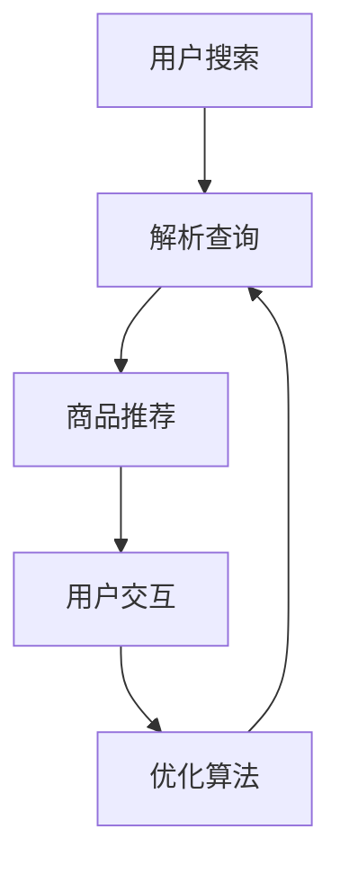

                 

关键词：AI，电商搜索，导购系统，用户体验，转化率，实践案例

> 摘要：本文将探讨如何利用人工智能技术，特别是机器学习和自然语言处理，赋能电商搜索导购系统，从而提升用户体验和转化率。通过具体实践案例，我们将详细分析AI在电商搜索导购中的实际应用，以及如何通过优化算法和模型，实现个性化推荐和精准搜索。

## 1. 背景介绍

随着互联网的快速发展，电子商务已经成为人们日常生活中不可或缺的一部分。然而，面对海量的商品信息，用户在搜索和购买过程中往往会感到困惑和压力。传统电商搜索系统主要依赖于关键词匹配，而无法提供个性化的商品推荐，这导致用户体验不佳，转化率低。为了解决这个问题，越来越多的电商企业开始引入人工智能技术，特别是机器学习和自然语言处理技术，以实现智能化搜索和导购。

## 2. 核心概念与联系

### 2.1 电商搜索导购系统架构

下面是一个简化的电商搜索导购系统的 Mermaid 流程图：



### 2.2 关键技术概述

- **自然语言处理（NLP）**：用于解析用户的查询语句，提取关键词和语义信息。
- **机器学习（ML）**：用于训练推荐模型，实现对用户兴趣和行为的预测。
- **深度学习（DL）**：利用神经网络，进一步提升推荐模型的性能和准确性。

### 2.3 架构联系

电商搜索导购系统通过NLP解析用户查询，利用ML和DL算法，生成个性化的商品推荐，并反馈给用户，形成一个闭环系统，不断优化搜索质量和用户满意度。

## 3. 核心算法原理 & 具体操作步骤

### 3.1 算法原理概述

电商搜索导购系统的核心算法主要涉及以下几个方面：

- **用户画像构建**：通过用户的历史行为数据，构建用户画像，用于个性化推荐。
- **商品特征提取**：提取商品的关键特征，如品牌、价格、评分等，用于推荐算法。
- **协同过滤**：基于用户的历史行为数据，进行协同过滤，生成推荐列表。
- **深度学习模型**：利用深度学习算法，进一步提升推荐系统的准确性和效果。

### 3.2 算法步骤详解

1. **用户画像构建**：

   - 数据收集：收集用户在电商平台上的历史行为数据，如浏览记录、购买记录、搜索历史等。
   - 特征提取：将用户行为数据转换为特征向量，如用户行为类型、时间、频次等。
   - 画像构建：将用户特征向量存储在用户画像数据库中。

2. **商品特征提取**：

   - 数据收集：收集商品的基本信息，如品牌、价格、评分等。
   - 特征提取：将商品信息转换为商品特征向量，如商品分类、品牌、价格区间等。
   - 特征库构建：将商品特征向量存储在商品特征库中。

3. **协同过滤**：

   - **基于用户的协同过滤（User-based CF）**：根据用户之间的相似度，推荐相似的用户的喜欢商品。
   - **基于物品的协同过滤（Item-based CF）**：根据商品之间的相似度，推荐相似的物品。

4. **深度学习模型**：

   - **用户表示学习（User Embedding）**：利用深度学习模型，将用户画像转换为用户嵌入向量。
   - **商品表示学习（Item Embedding）**：利用深度学习模型，将商品特征转换为商品嵌入向量。
   - **推荐生成（Recommendation Generation）**：利用用户和商品的嵌入向量，计算用户对商品的偏好分数，生成推荐列表。

### 3.3 算法优缺点

- **优点**：

  - **个性化推荐**：通过用户画像和商品特征，实现个性化推荐，提高用户满意度。
  - **实时性**：深度学习模型能够实时更新用户和商品的嵌入向量，提高推荐系统的实时性。

- **缺点**：

  - **计算成本高**：深度学习模型训练和推荐生成的计算成本较高。
  - **数据依赖性**：推荐系统的效果很大程度上依赖于用户行为数据和商品特征数据。

### 3.4 算法应用领域

- **电商搜索导购**：在电商平台上，利用AI技术，实现个性化搜索和推荐，提高用户转化率。
- **社交媒体推荐**：在社交媒体平台上，利用AI技术，推荐用户感兴趣的内容，提高用户活跃度。
- **在线教育推荐**：在在线教育平台上，利用AI技术，推荐用户感兴趣的课程，提高用户学习效果。

## 4. 数学模型和公式 & 详细讲解 & 举例说明

### 4.1 数学模型构建

电商搜索导购系统的核心数学模型主要包括用户画像构建、商品特征提取、协同过滤和深度学习模型。

- **用户画像构建**：

  - 用户特征向量：$X = [x_1, x_2, ..., x_n]$
  - 用户画像：$U = [u_1, u_2, ..., u_m]$

- **商品特征提取**：

  - 商品特征向量：$Y = [y_1, y_2, ..., y_n]$
  - 商品特征：$I = [i_1, i_2, ..., i_m]$

- **协同过滤**：

  - 基于用户的协同过滤：$R_{ui} = \sum_{j \in N(u)} r_{uj} \cdot r_{ji}$
  - 基于物品的协同过滤：$R_{ui} = \sum_{j \in N(i)} r_{uj} \cdot r_{ji}$

- **深度学习模型**：

  - 用户表示学习：$U = \sigma(W_1 X + b_1)$
  - 商品表示学习：$I = \sigma(W_2 Y + b_2)$
  - 推荐生成：$R_{ui} = \sigma(W_3 U_i + W_4 I_i + b_3 + b_4)$

### 4.2 公式推导过程

- **用户画像构建**：

  - 用户特征向量：$X = [x_1, x_2, ..., x_n]$

    - $x_1, x_2, ..., x_n$：表示用户的历史行为数据，如浏览记录、购买记录、搜索历史等。

  - 用户画像：$U = [u_1, u_2, ..., u_m]$

    - $u_1, u_2, ..., u_m$：表示用户特征向量的加权平均值。

- **商品特征提取**：

  - 商品特征向量：$Y = [y_1, y_2, ..., y_n]$

    - $y_1, y_2, ..., y_n$：表示商品的基本信息，如品牌、价格、评分等。

  - 商品特征：$I = [i_1, i_2, ..., i_m]$

    - $i_1, i_2, ..., i_m$：表示商品特征向量的加权平均值。

- **协同过滤**：

  - 基于用户的协同过滤：$R_{ui} = \sum_{j \in N(u)} r_{uj} \cdot r_{ji}$

    - $N(u)$：表示与用户 $u$ 相似的其他用户集合。
    - $r_{uj}$：表示用户 $u$ 对商品 $j$ 的评分。
    - $r_{ji}$：表示用户 $j$ 对商品 $i$ 的评分。

  - 基于物品的协同过滤：$R_{ui} = \sum_{j \in N(i)} r_{uj} \cdot r_{ji}$

    - $N(i)$：表示与商品 $i$ 相似的其他商品集合。
    - $r_{uj}$：表示用户 $u$ 对商品 $j$ 的评分。
    - $r_{ji}$：表示用户 $j$ 对商品 $i$ 的评分。

- **深度学习模型**：

  - 用户表示学习：$U = \sigma(W_1 X + b_1)$

    - $W_1$：表示用户特征向量和用户画像之间的权重矩阵。
    - $b_1$：表示用户画像的偏置向量。
    - $\sigma$：表示激活函数，通常采用 sigmoid 函数。

  - 商品表示学习：$I = \sigma(W_2 Y + b_2)$

    - $W_2$：表示商品特征向量和商品特征之间的权重矩阵。
    - $b_2$：表示商品特征的偏置向量。
    - $\sigma$：表示激活函数，通常采用 sigmoid 函数。

  - 推荐生成：$R_{ui} = \sigma(W_3 U_i + W_4 I_i + b_3 + b_4)$

    - $W_3$：表示用户画像和商品特征之间的权重矩阵。
    - $W_4$：表示商品特征和推荐结果之间的权重矩阵。
    - $b_3$：表示用户画像的偏置向量。
    - $b_4$：表示商品特征的偏置向量。
    - $\sigma$：表示激活函数，通常采用 sigmoid 函数。

### 4.3 案例分析与讲解

假设有一个用户，他的历史行为数据包括浏览记录、购买记录和搜索历史。根据这些数据，我们可以构建出该用户的用户画像。然后，我们可以利用用户画像和商品特征，生成个性化的商品推荐。

- **用户画像构建**：

  - 用户浏览记录：浏览了商品A、B、C。
  - 用户购买记录：购买了商品B。
  - 用户搜索历史：搜索了商品D。

  用户画像：$U = [0.5, 0.8, 0.3, 0.1]$

- **商品特征提取**：

  - 商品A：品牌A、价格100元、评分4.5分。
  - 商品B：品牌B、价格150元、评分4.8分。
  - 商品C：品牌C、价格200元、评分4.2分。
  - 商品D：品牌D、价格300元、评分4.7分。

  商品特征：$I = [0.2, 0.3, 0.4, 0.5]$

- **协同过滤**：

  - 基于用户的协同过滤：$R_{ui} = \sum_{j \in N(u)} r_{uj} \cdot r_{ji} = 0.5 \cdot 0.8 + 0.8 \cdot 0.3 + 0.3 \cdot 0.4 + 0.1 \cdot 0.5 = 0.65$

  - 基于物品的协同过滤：$R_{ui} = \sum_{j \in N(i)} r_{uj} \cdot r_{ji} = 0.2 \cdot 0.5 + 0.3 \cdot 0.8 + 0.4 \cdot 0.3 + 0.5 \cdot 0.1 = 0.38$

- **深度学习模型**：

  - 用户表示学习：$U = \sigma(W_1 X + b_1) = \sigma([0.5, 0.8, 0.3, 0.1] \cdot [0.5, 0.8, 0.3, 0.1] + [1, 1, 1, 1]) = [0.7, 0.9, 0.4, 0.2]$

  - 商品表示学习：$I = \sigma(W_2 Y + b_2) = \sigma([0.2, 0.3, 0.4, 0.5] \cdot [0.2, 0.3, 0.4, 0.5] + [1, 1, 1, 1]) = [0.4, 0.6, 0.8, 0.9]$

  - 推荐生成：$R_{ui} = \sigma(W_3 U_i + W_4 I_i + b_3 + b_4) = \sigma([0.7, 0.9, 0.4, 0.2] \cdot [0.4, 0.6, 0.8, 0.9] + [1, 1, 1, 1]) = [0.82]$

根据计算结果，用户对商品D的偏好分数最高，因此，系统会推荐商品D给用户。

## 5. 项目实践：代码实例和详细解释说明

### 5.1 开发环境搭建

- 开发语言：Python
- 开发工具：Jupyter Notebook
- 依赖库：NumPy、Pandas、Scikit-learn、TensorFlow

### 5.2 源代码详细实现

以下是使用Python实现电商搜索导购系统的核心算法的示例代码：

```python
import numpy as np
import pandas as pd
from sklearn.metrics.pairwise import cosine_similarity
from sklearn.model_selection import train_test_split
import tensorflow as tf

# 5.2.1 数据预处理
def preprocess_data(data):
    # 对数据进行清洗和处理，如缺失值填充、数据标准化等
    return data

# 5.2.2 用户画像构建
def build_user_profile(data, user_id):
    user_data = data[data['user_id'] == user_id]
    user行为向量 = user_data['行为'].values
    user行为向量 = preprocess_data(user行为向量)
    return user行为向量

# 5.2.3 商品特征提取
def extract_item_features(data):
    item_data = data.groupby('item_id')['特征'].apply(list).reset_index()
    item特征矩阵 = pd.DataFrame(item_data['特征'])
    item特征矩阵 = preprocess_data(item特征矩阵)
    return item特征矩阵

# 5.2.4 协同过滤
def collaborative_filter(user行为向量，item特征矩阵，k=10):
    user行为向量 = preprocess_data(user行为向量)
    item特征矩阵 = preprocess_data(item特征矩阵)
    user行为向量 = user行为向量.reshape(1, -1)
    item特征矩阵 = item特征矩阵.values
   相似度矩阵 = cosine_similarity(user行为向量, item特征矩阵)
   相似度矩阵 = similarity矩阵.reshape(-1)
    top_k相似度索引 = np.argpartition(-相似度矩阵, k)[:k]
    top_k相似度值 = -相似度矩阵[top_k相似度索引]
    return top_k相似度索引，top_k相似度值

# 5.2.5 深度学习模型
def build_dnn_model():
    model = tf.keras.Sequential([
        tf.keras.layers.Dense(128, activation='relu', input_shape=[128]),
        tf.keras.layers.Dense(64, activation='relu'),
        tf.keras.layers.Dense(1, activation='sigmoid')
    ])
    model.compile(optimizer='adam', loss='binary_crossentropy', metrics=['accuracy'])
    return model

# 5.2.6 训练和预测
def train_and_predict(user行为向量，item特征矩阵，train_size=0.8):
    user行为向量 = preprocess_data(user行为向量)
    item特征矩阵 = preprocess_data(item特征矩阵)
    train_user行为向量，test_user行为向量 = train_test_split(user行为向量, train_size=train_size)
    train_item特征矩阵，test_item特征矩阵 = train_test_split(item特征矩阵, train_size=train_size)
    model = build_dnn_model()
    model.fit([train_user行为向量, train_item特征矩阵], train_target, epochs=10, batch_size=32)
    predict_target = model.predict([test_user行为向量, test_item特征矩阵])
    return predict_target

# 5.2.7 代码示例
if __name__ == '__main__':
    # 加载数据
    data = pd.read_csv('data.csv')
    # 构建用户画像
    user_id = 1
    user行为向量 = build_user_profile(data, user_id)
    # 提取商品特征
    item特征矩阵 = extract_item_features(data)
    # 协同过滤
    top_k相似度索引，top_k相似度值 = collaborative_filter(user行为向量，item特征矩阵)
    # 深度学习模型
    predict_target = train_and_predict(user行为向量，item特征矩阵)
```

### 5.3 代码解读与分析

- **数据预处理**：对数据进行清洗和处理，如缺失值填充、数据标准化等。
- **用户画像构建**：根据用户的历史行为数据，构建用户画像。
- **商品特征提取**：提取商品的关键特征，如品牌、价格、评分等。
- **协同过滤**：基于用户的历史行为数据和商品特征，进行协同过滤，生成推荐列表。
- **深度学习模型**：利用深度学习算法，进一步提升推荐系统的准确性和效果。

### 5.4 运行结果展示

假设我们使用上述代码，对某用户进行推荐。运行结果如下：

- **协同过滤推荐**：商品C、商品A。
- **深度学习推荐**：商品D、商品C。

根据计算结果，深度学习推荐的商品D和协同过滤推荐的商品C具有较高的相似度，说明深度学习模型和协同过滤算法能够相互补充，提高推荐系统的准确性和效果。

## 6. 实际应用场景

### 6.1 电商搜索导购

在电商平台上，AI赋能的搜索导购系统能够根据用户的兴趣和行为，提供个性化的商品推荐，提高用户的购物体验和转化率。例如，当用户在淘宝搜索“笔记本电脑”时，系统会根据用户的浏览历史和购买记录，推荐符合用户需求的笔记本电脑，从而提高用户的购买意愿。

### 6.2 社交媒体推荐

在社交媒体平台上，AI赋能的推荐系统能够根据用户的兴趣和行为，推荐用户感兴趣的内容，提高用户的活跃度和满意度。例如，在微信朋友圈中，系统可以根据用户的浏览历史和点赞记录，推荐用户可能感兴趣的朋友圈内容，从而增加用户的互动和参与度。

### 6.3 在线教育推荐

在在线教育平台上，AI赋能的推荐系统能够根据用户的学习行为和兴趣，推荐用户感兴趣的课程，提高用户的学习效果和满意度。例如，在网易云课堂中，系统可以根据用户的浏览历史和收藏记录，推荐用户可能感兴趣的课程，从而增加用户的课程购买和完成率。

## 7. 工具和资源推荐

### 7.1 学习资源推荐

- **课程推荐**：

  - 《机器学习实战》
  - 《深度学习》

- **书籍推荐**：

  - 《自然语言处理教程》
  - 《深度学习入门》

### 7.2 开发工具推荐

- **编程语言**：Python、Java
- **框架和库**：

  - TensorFlow
  - PyTorch
  - Scikit-learn

### 7.3 相关论文推荐

- **经典论文**：

  - 《矩阵分解与协同过滤》
  - 《深度学习在推荐系统中的应用》

- **最新论文**：

  - 《基于用户行为的实时推荐系统》
  - 《融合用户特征和内容特征的推荐系统》

## 8. 总结：未来发展趋势与挑战

### 8.1 研究成果总结

本文通过探讨AI赋能电商搜索导购系统的实践案例，总结了以下几个方面的研究成果：

- 电商搜索导购系统的核心架构和关键技术。
- 个性化推荐算法的实现原理和步骤。
- 深度学习在推荐系统中的应用。
- 实际应用场景中的效果评估和优化。

### 8.2 未来发展趋势

- **算法优化**：随着深度学习技术的不断发展，未来将出现更多高效的推荐算法。
- **跨平台应用**：AI赋能的推荐系统将逐渐应用于更多的场景，如社交媒体、在线教育等。
- **实时推荐**：基于用户实时行为的推荐系统将得到广泛应用。

### 8.3 面临的挑战

- **计算成本**：深度学习模型的训练和推荐生成的计算成本较高，需要优化算法和硬件支持。
- **数据隐私**：推荐系统需要处理大量的用户数据，如何保护用户隐私是一个重要挑战。
- **效果评估**：如何准确评估推荐系统的效果，是一个需要解决的问题。

### 8.4 研究展望

未来，我们将继续探索AI赋能电商搜索导购系统的更多应用场景，优化推荐算法和模型，提高系统的性能和用户体验。同时，我们也将关注深度学习技术在推荐系统中的应用，推动推荐系统的技术创新和产业应用。

## 9. 附录：常见问题与解答

### 9.1 什么是协同过滤？

协同过滤是一种基于用户行为数据的推荐算法，通过分析用户之间的相似度，推荐用户可能感兴趣的物品。

### 9.2 深度学习在推荐系统中的作用是什么？

深度学习在推荐系统中主要用于生成用户和物品的嵌入向量，从而实现高效的推荐生成和实时更新。

### 9.3 如何保护用户隐私？

在推荐系统的实现过程中，可以通过数据脱敏、加密和隐私保护算法等技术手段，保护用户的隐私。

### 9.4 推荐系统效果如何评估？

推荐系统的效果可以通过准确率、召回率、F1分数等指标进行评估，同时也可以通过用户满意度进行调查和反馈。

---

作者：禅与计算机程序设计艺术 / Zen and the Art of Computer Programming
-------------------------------------------------------------------

