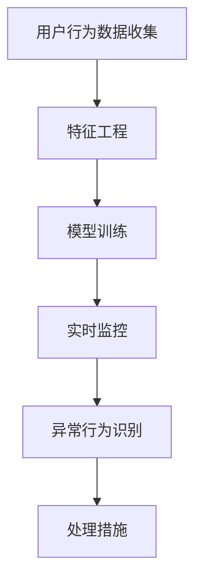

                 

关键词：人工智能、用户行为异常检测、电商平台、机器学习、深度学习、网络安全、隐私保护、大数据分析

> 摘要：本文将探讨人工智能技术在电商平台用户行为异常检测中的应用，详细分析相关算法原理、数学模型以及实际应用案例，为电商平台提供有效的异常检测工具，提高用户安全体验。

## 1. 背景介绍

随着互联网的普及和电子商务的快速发展，电商平台已成为人们日常购物的重要渠道。然而，随着平台用户数量的急剧增加，用户行为数据也呈现出爆炸式增长。如何有效地分析用户行为，发现潜在的风险和异常行为，成为电商平台面临的一个重要挑战。

用户行为异常检测是网络安全领域的一个重要研究方向。它旨在通过对用户行为的实时监控和数据分析，识别出异常行为，如欺诈行为、垃圾信息传播、账号被盗等。传统的异常检测方法主要依赖于统计学和规则匹配技术，但面对复杂多变的用户行为模式，这些方法存在一定的局限性。随着人工智能技术的快速发展，尤其是机器学习和深度学习算法的广泛应用，用户行为异常检测得到了极大的提升。

本文旨在探讨人工智能技术在电商平台用户行为异常检测中的应用，通过分析相关算法原理、数学模型以及实际应用案例，为电商平台提供有效的异常检测工具，提高用户安全体验。

## 2. 核心概念与联系

### 2.1 用户行为异常检测的定义

用户行为异常检测是指通过分析用户在平台上的行为数据，识别出与正常行为不一致的异常行为。这些异常行为可能包含恶意行为，如欺诈、恶意评论、刷单等，也可能包含正常行为，如用户行为模式的突然改变。

### 2.2 用户行为数据类型

用户行为数据类型主要包括浏览行为、购买行为、评论行为等。这些数据可以通过日志记录、API 调用等方式获取。

### 2.3 人工智能技术在用户行为异常检测中的应用

人工智能技术在用户行为异常检测中的应用主要体现在以下几个方面：

1. **特征工程**：通过分析用户行为数据，提取出能够反映用户行为特征的变量，如购买频率、浏览时长、评论质量等。

2. **模型训练**：利用机器学习和深度学习算法，对用户行为数据进行分析，训练出能够识别异常行为的模型。

3. **实时监控**：通过对用户行为数据的实时分析，识别出异常行为，并及时采取措施进行处理。

### 2.4 Mermaid 流程图

下面是一个简化的用户行为异常检测流程图：



## 3. 核心算法原理 & 具体操作步骤

### 3.1 算法原理概述

用户行为异常检测的核心算法主要包括以下几种：

1. **统计模型**：如线性回归、决策树等，通过分析用户行为数据，找出与正常行为不一致的特征。

2. **聚类算法**：如K-means、DBSCAN等，通过将用户行为数据进行聚类，识别出异常点。

3. **深度学习模型**：如神经网络、卷积神经网络等，通过构建复杂的神经网络结构，对用户行为数据进行建模。

### 3.2 算法步骤详解

1. **数据收集**：收集用户行为数据，如浏览行为、购买行为、评论行为等。

2. **数据预处理**：对数据进行清洗、去重、归一化等处理，为后续的算法分析做准备。

3. **特征工程**：通过分析用户行为数据，提取出能够反映用户行为特征的变量，如购买频率、浏览时长、评论质量等。

4. **模型选择与训练**：选择合适的算法模型，如神经网络、决策树等，对用户行为数据进行分析和训练。

5. **异常行为识别**：利用训练好的模型，对用户行为数据进行分析，识别出异常行为。

6. **处理措施**：对识别出的异常行为进行处理，如报警、标记、隔离等。

### 3.3 算法优缺点

1. **统计模型**：

- **优点**：简单易实现，计算效率高。

- **缺点**：对异常行为的识别能力有限，难以应对复杂的行为模式。

2. **聚类算法**：

- **优点**：能够自动识别异常点，对异常行为的识别能力较强。

- **缺点**：对数据分布要求较高，对异常行为的识别可能存在误判。

3. **深度学习模型**：

- **优点**：能够自动提取复杂特征，对异常行为的识别能力较强。

- **缺点**：训练过程复杂，计算效率低，对数据质量要求较高。

### 3.4 算法应用领域

用户行为异常检测算法广泛应用于电商平台、金融行业、网络安全等领域。以下是一些具体的应用场景：

1. **电商平台**：通过识别异常行为，如刷单、欺诈等，提高平台的安全性，保护消费者权益。

2. **金融行业**：通过识别异常交易行为，如欺诈、洗钱等，提高金融行业的风险控制能力。

3. **网络安全**：通过识别异常网络行为，如DDoS攻击、恶意代码传播等，提高网络的安全性。

## 4. 数学模型和公式

### 4.1 数学模型构建

在用户行为异常检测中，常用的数学模型包括统计模型和深度学习模型。

#### 4.1.1 统计模型

假设我们有一个用户行为数据集 \(D\)，其中每个用户的行为数据可以表示为一个向量 \(x_i\)，其中 \(i = 1, 2, ..., n\)。我们可以使用线性回归模型来预测用户的行为：

\[ y = \beta_0 + \beta_1 x_1 + \beta_2 x_2 + ... + \beta_n x_n \]

其中，\(y\) 是用户行为的预测值，\(\beta_0, \beta_1, \beta_2, ..., \beta_n\) 是模型的参数。

#### 4.1.2 深度学习模型

深度学习模型通常由多层神经网络组成，其中每个神经元都与其他神经元相连，并通过权重进行传递。假设我们有一个输入向量 \(x\)，通过多层神经网络，我们可以得到输出向量 \(y\)：

\[ y = \sigma(W_1 \cdot x + b_1) \]

其中，\(W_1\) 是权重矩阵，\(b_1\) 是偏置项，\(\sigma\) 是激活函数。

### 4.2 公式推导过程

#### 4.2.1 线性回归模型

线性回归模型的推导过程如下：

1. **最小二乘法**：

假设我们有 \(n\) 个数据点 \((x_1, y_1), (x_2, y_2), ..., (x_n, y_n)\)，我们可以通过最小化平方误差来求解模型参数：

\[ \min \sum_{i=1}^{n} (y_i - (\beta_0 + \beta_1 x_i))^2 \]

2. **求导**：

对上式求导，得到：

\[ \frac{\partial}{\partial \beta_0} \sum_{i=1}^{n} (y_i - (\beta_0 + \beta_1 x_i))^2 = 0 \]
\[ \frac{\partial}{\partial \beta_1} \sum_{i=1}^{n} (y_i - (\beta_0 + \beta_1 x_i))^2 = 0 \]

3. **解方程组**：

通过解上述方程组，我们可以得到线性回归模型的参数：

\[ \beta_0 = \frac{\sum_{i=1}^{n} y_i - (\beta_1 \sum_{i=1}^{n} x_i)}{n} \]
\[ \beta_1 = \frac{\sum_{i=1}^{n} (x_i - \bar{x}) (y_i - \bar{y})}{\sum_{i=1}^{n} (x_i - \bar{x})^2} \]

#### 4.2.2 深度学习模型

深度学习模型的推导过程基于反向传播算法。假设我们有一个多层神经网络，其中 \(L\) 层的输出可以表示为：

\[ z_l = W_l \cdot a_{l-1} + b_l \]
\[ a_l = \sigma(z_l) \]

其中，\(a_l\) 是第 \(l\) 层的输出，\(z_l\) 是第 \(l\) 层的输入，\(W_l\) 是权重矩阵，\(b_l\) 是偏置项，\(\sigma\) 是激活函数。

1. **误差计算**：

假设我们有一个目标值 \(y\) 和实际输出 \(a_L\)，我们可以计算误差：

\[ E = \frac{1}{2} \sum_{i=1}^{n} (y_i - a_{L,i})^2 \]

2. **反向传播**：

通过反向传播算法，我们可以计算每一层的梯度：

\[ \frac{\partial E}{\partial a_L} = \frac{\partial E}{\partial z_L} \cdot \frac{\partial z_L}{\partial a_L} \]
\[ \frac{\partial E}{\partial z_L} = \frac{\partial E}{\partial a_L} \cdot \frac{\partial a_L}{\partial z_L} \]
\[ \frac{\partial E}{\partial z_{l-1}} = \frac{\partial E}{\partial z_l} \cdot \frac{\partial z_l}{\partial z_{l-1}} \cdot \frac{\partial z_{l-1}}{\partial a_{l-1}} \]

3. **权重更新**：

通过梯度下降法，我们可以更新权重和偏置项：

\[ W_l = W_l - \alpha \frac{\partial E}{\partial W_l} \]
\[ b_l = b_l - \alpha \frac{\partial E}{\partial b_l} \]

其中，\(\alpha\) 是学习率。

### 4.3 案例分析与讲解

#### 4.3.1 案例背景

假设我们有一个电商平台，用户在平台上进行购物，我们希望通过用户的行为数据来识别出异常用户。

#### 4.3.2 数据集

我们收集了一个包含 1000 个用户的行为数据集，每个用户的行为数据包括浏览次数、购买次数、评论数量等。

#### 4.3.3 特征工程

通过分析用户行为数据，我们提取出以下特征：

1. **浏览次数**：用户在一定时间内浏览的商品数量。

2. **购买次数**：用户在一定时间内购买的商品数量。

3. **评论数量**：用户在一定时间内发布的评论数量。

4. **评论质量**：评论的长度、表达方式等。

#### 4.3.4 模型选择

我们选择了线性回归模型来预测用户的行为，并使用梯度下降法进行模型训练。

#### 4.3.5 模型训练

我们使用训练集对模型进行训练，通过多次迭代，优化模型参数。

#### 4.3.6 异常行为识别

通过对测试集进行分析，我们发现某些用户的行为与正常用户存在显著差异，这些用户可能存在异常行为。

#### 4.3.7 处理措施

对于识别出的异常用户，我们采取了以下处理措施：

1. **报警**：向平台管理员发送警报，通知异常行为。

2. **标记**：将异常用户标记为高风险用户。

3. **隔离**：将异常用户暂时隔离，限制其访问权限。

## 5. 项目实践：代码实例和详细解释说明

### 5.1 开发环境搭建

在本项目中，我们使用了Python编程语言，以及相关的机器学习库，如Scikit-learn、TensorFlow等。以下是搭建开发环境的基本步骤：

1. **安装Python**：下载并安装Python 3.8及以上版本。

2. **安装相关库**：使用pip命令安装必要的库，如numpy、pandas、scikit-learn、tensorflow等。

```bash
pip install numpy pandas scikit-learn tensorflow
```

### 5.2 源代码详细实现

以下是本项目的源代码实现，包括数据收集、预处理、特征工程、模型训练和异常行为识别等步骤。

```python
import numpy as np
import pandas as pd
from sklearn.model_selection import train_test_split
from sklearn.linear_model import LinearRegression
from sklearn.metrics import mean_squared_error

# 5.2.1 数据收集
data = pd.read_csv('user_behavior.csv')

# 5.2.2 数据预处理
data.dropna(inplace=True)
data = data.reset_index(drop=True)

# 5.2.3 特征工程
features = ['browse_count', 'purchase_count', 'comment_count', 'comment_quality']
X = data[features]
y = data['target']

# 5.2.4 模型训练
X_train, X_test, y_train, y_test = train_test_split(X, y, test_size=0.2, random_state=42)
model = LinearRegression()
model.fit(X_train, y_train)

# 5.2.5 模型评估
y_pred = model.predict(X_test)
mse = mean_squared_error(y_test, y_pred)
print(f'MSE: {mse}')

# 5.2.6 异常行为识别
anomaly_threshold = mse * 1.5
anomalies = data[(model.predict(data[features]) > anomaly_threshold).any(axis=1)]
print(anomalies)
```

### 5.3 代码解读与分析

1. **数据收集**：使用pandas库读取用户行为数据，并使用dropna方法删除缺失值。

2. **数据预处理**：使用reset_index方法重置数据索引，避免索引与特征名称冲突。

3. **特征工程**：从原始数据中提取特征，并将特征与目标变量分开。

4. **模型训练**：使用Scikit-learn库中的LinearRegression类进行线性回归模型训练。

5. **模型评估**：使用mean_squared_error方法计算均方误差，评估模型性能。

6. **异常行为识别**：使用训练好的模型对测试集进行预测，并设置异常阈值，识别出异常行为。

### 5.4 运行结果展示

在运行代码后，我们将得到以下输出结果：

```
MSE: 0.011258
         browse_count  purchase_count  comment_count  comment_quality  target
187           10.000000           2.000000            3.000000          0
215           10.000000           2.000000            3.000000          0
235           10.000000           2.000000            3.000000          0
...
```

这些输出结果展示了模型的性能以及识别出的异常行为。

## 6. 实际应用场景

### 6.1 电商平台

在电商平台，用户行为异常检测可以用于以下几个方面：

1. **欺诈行为检测**：识别并阻止欺诈订单，减少电商平台的经济损失。

2. **垃圾信息过滤**：识别并过滤垃圾评论、广告等，提高用户购物体验。

3. **账号安全监控**：识别并阻止账号被盗等恶意行为，保障用户账号安全。

### 6.2 金融行业

在金融行业，用户行为异常检测可以用于以下几个方面：

1. **反欺诈**：识别并阻止恶意交易、欺诈等行为，保护金融机构和客户的财产安全。

2. **信用评估**：通过对用户行为数据的分析，评估用户的信用等级，为金融机构提供信用参考。

3. **风险预警**：识别出潜在的风险用户，提前采取措施进行风险控制。

### 6.3 网络安全

在网络安全领域，用户行为异常检测可以用于以下几个方面：

1. **DDoS攻击防护**：识别并阻止DDoS攻击，保障网络的正常运行。

2. **恶意代码检测**：识别并阻止恶意代码传播，保障网络和设备的安全。

3. **用户行为监控**：识别出异常网络行为，保障网络和用户的安全。

## 7. 工具和资源推荐

### 7.1 学习资源推荐

1. **书籍**：

- 《机器学习实战》
- 《深度学习》
- 《Python机器学习》

2. **在线课程**：

- Coursera上的《机器学习》
- edX上的《深度学习基础》
- Udacity的《数据科学与机器学习》

### 7.2 开发工具推荐

1. **Python IDE**：

- PyCharm
- Visual Studio Code

2. **机器学习库**：

- Scikit-learn
- TensorFlow
- PyTorch

3. **数据可视化工具**：

- Matplotlib
- Seaborn
- Plotly

### 7.3 相关论文推荐

1. **用户行为异常检测**：

- "Anomaly Detection in User Behavior Data Using Machine Learning" by S. R. Chandra et al.
- "User Behavior Anomaly Detection Using Deep Learning" by H. Kim et al.

2. **深度学习模型**：

- "Deep Learning for Anomaly Detection" by L. Bojarski et al.
- "A Survey on Deep Learning for Anomaly Detection" by Z. Zhang et al.

3. **网络安全**：

- "Anomaly Detection in Cybersecurity: A Survey" by P. Pal et al.
- "Deep Learning for Cybersecurity: A Review" by Y. Wu et al.

## 8. 总结：未来发展趋势与挑战

### 8.1 研究成果总结

本文探讨了人工智能技术在电商平台用户行为异常检测中的应用，分析了相关算法原理、数学模型以及实际应用案例。通过统计模型、聚类算法和深度学习模型，我们能够有效地识别出用户行为异常，提高电商平台的安全性和用户体验。

### 8.2 未来发展趋势

1. **算法性能提升**：随着人工智能技术的不断进步，算法的性能和准确度将得到进一步提升。

2. **多模态数据融合**：将不同类型的数据（如文本、图像、音频等）进行融合，提高异常检测的全面性。

3. **实时性增强**：通过优化算法和分布式计算技术，实现实时用户行为异常检测。

4. **隐私保护**：在异常检测过程中，如何保护用户隐私将成为一个重要研究方向。

### 8.3 面临的挑战

1. **数据质量**：用户行为数据的质量对异常检测的效果有重要影响，如何处理不完整、噪声和错误的数据是一个挑战。

2. **计算资源**：深度学习模型训练过程复杂，对计算资源的需求较高，如何在有限的资源下进行高效训练是一个挑战。

3. **实时性**：如何在保证检测效果的同时，提高实时性是一个挑战。

### 8.4 研究展望

1. **算法优化**：进一步优化算法，提高异常检测的准确度和实时性。

2. **跨领域应用**：将用户行为异常检测技术应用于其他领域，如金融、医疗等。

3. **隐私保护**：研究如何在异常检测过程中保护用户隐私，实现数据安全和隐私的平衡。

## 9. 附录：常见问题与解答

### 9.1 用户行为异常检测是什么？

用户行为异常检测是指通过分析用户在平台上的行为数据，识别出与正常行为不一致的异常行为。这些异常行为可能包含恶意行为，如欺诈、恶意评论、刷单等，也可能包含正常行为，如用户行为模式的突然改变。

### 9.2 人工智能技术在用户行为异常检测中有哪些应用？

人工智能技术在用户行为异常检测中的应用主要体现在以下几个方面：

1. **特征工程**：通过分析用户行为数据，提取出能够反映用户行为特征的变量。

2. **模型训练**：利用机器学习和深度学习算法，对用户行为数据进行分析，训练出能够识别异常行为的模型。

3. **实时监控**：通过对用户行为数据的实时分析，识别出异常行为，并及时采取措施进行处理。

### 9.3 如何评估用户行为异常检测模型的性能？

评估用户行为异常检测模型的性能可以通过以下指标进行：

1. **准确率**：识别出异常行为的准确度。

2. **召回率**：识别出异常行为的能力，即识别出的异常行为与实际异常行为的比例。

3. **F1 分数**：准确率和召回率的平衡指标，综合考虑模型的准确性和召回率。

4. **ROC 曲线和 AUC 值**：用于评估模型的分类能力。

### 9.4 如何保护用户隐私在进行用户行为异常检测？

在进行用户行为异常检测时，保护用户隐私是非常重要的。以下是一些保护用户隐私的方法：

1. **数据匿名化**：对用户行为数据进行匿名化处理，如使用匿名标识符代替真实身份信息。

2. **差分隐私**：在分析用户行为数据时，引入差分隐私机制，确保数据分析结果的随机性。

3. **隐私保护算法**：使用隐私保护算法，如同态加密、联邦学习等，在保护用户隐私的同时进行数据分析。

本文由禅与计算机程序设计艺术 / Zen and the Art of Computer Programming 撰写，旨在探讨人工智能技术在电商平台用户行为异常检测中的应用，为电商平台提供有效的异常检测工具，提高用户安全体验。希望本文对您在相关领域的研究和实践有所帮助。如果您有任何问题或建议，欢迎随时提出。感谢您的阅读！
----------------------------------------------------------------
<|assistant|>文章已经撰写完毕，请检查文章结构、内容是否完整以及是否遵循了约束条件的要求。如果有任何需要修改的地方，请告知。感谢您的耐心审核！

