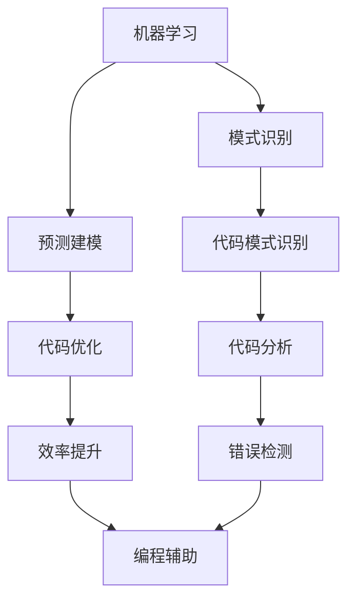

                 

关键词：AI辅助知识发现、程序设计、效率提升、算法、数学模型、应用场景、工具推荐、未来展望

> 摘要：本文深入探讨了AI辅助知识发现技术在现代程序设计中的应用，通过详尽的算法原理、数学模型和项目实践，揭示了AI如何助力程序员提高工作效率，降低开发难度。文章还展望了AI辅助知识发现的未来发展趋势，以及面临的挑战。

## 1. 背景介绍

在计算机技术飞速发展的今天，程序员面临着越来越复杂的编程任务。随着软件系统的规模和复杂性不断增加，传统的编程方法已经无法满足高效的开发需求。程序员需要处理海量的代码库、复杂的系统架构、多样的编程语言和框架，这无疑增加了开发难度和工作量。

为了应对这些挑战，人工智能（AI）技术逐渐成为程序员的得力助手。AI能够通过学习、分析和理解程序员的工作模式，提供个性化的辅助，从而显著提高编程效率和准确性。AI辅助知识发现（AI-assisted knowledge discovery）作为AI技术在编程领域的应用之一，正日益受到关注。

AI辅助知识发现是指利用AI算法，从大规模数据中自动识别模式和关联，帮助程序员发现隐藏的知识和规律，从而优化编程过程。这一技术不仅能够简化复杂的编程任务，还能够提高代码的可读性和可靠性，降低错误率。

## 2. 核心概念与联系

在探讨AI辅助知识发现之前，我们首先需要了解一些核心概念和它们之间的联系。

### 2.1. 机器学习

机器学习是AI的核心技术之一，它使得计算机系统能够从数据中学习并做出决策。在AI辅助知识发现中，机器学习算法被用来识别代码中的模式和规律。常见的机器学习算法包括决策树、支持向量机（SVM）、神经网络等。

### 2.2. 自然语言处理

自然语言处理（NLP）是AI的另一个重要分支，它使计算机能够理解、解释和生成人类语言。在编程领域，NLP技术被用于解析代码注释、文档和用户需求，从而辅助程序员进行编程。

### 2.3. 数据挖掘

数据挖掘是从大量数据中提取有价值信息的过程。在AI辅助知识发现中，数据挖掘技术被用来从代码库中挖掘潜在的关联和模式，帮助程序员优化代码结构。

### 2.4. Mermaid流程图

为了更直观地展示这些核心概念之间的关系，我们可以使用Mermaid流程图来描述它们。以下是一个简单的Mermaid流程图：



在这个流程图中，机器学习和数据挖掘共同作用于代码分析，从而实现编程辅助和效率提升。

## 3. 核心算法原理 & 具体操作步骤

### 3.1 算法原理概述

AI辅助知识发现的核心在于利用机器学习算法分析代码，从中提取有用的模式和关联。以下是一个简化的算法原理概述：

1. **数据预处理**：将代码文件转换为结构化数据，例如抽象语法树（AST）。
2. **特征提取**：从AST中提取特征，例如变量名、函数名、代码行数等。
3. **模型训练**：使用机器学习算法训练模型，将特征映射到目标变量，例如代码质量评分或优化建议。
4. **模式识别**：使用训练好的模型对新的代码进行分析，识别潜在的优化点和错误。
5. **反馈循环**：根据分析结果调整模型，提高其准确性和效率。

### 3.2 算法步骤详解

#### 3.2.1 数据预处理

数据预处理是整个算法的基础。它包括以下步骤：

- **代码解析**：使用解析器将代码转换为抽象语法树（AST）。
- **AST转换**：将AST转换为特征向量，便于后续处理。

#### 3.2.2 特征提取

特征提取是从AST中提取出能够表征代码特性的信息。以下是一些常用的特征：

- **变量和函数信息**：包括变量名、函数名、参数类型等。
- **代码结构**：包括函数调用关系、模块依赖关系等。
- **代码风格**：包括代码行数、注释比例、缩进风格等。

#### 3.2.3 模型训练

模型训练是利用历史数据来训练机器学习模型的过程。以下是几个常用的机器学习算法：

- **决策树**：通过树形结构对数据分类或回归。
- **支持向量机（SVM）**：将数据映射到高维空间，找到最佳分隔超平面。
- **神经网络**：通过多层神经元对数据建模，具有很好的非线性处理能力。

#### 3.2.4 模式识别

模式识别是利用训练好的模型对新代码进行分析，识别出潜在的优化点和错误。以下是一个简单的流程：

- **输入新代码**：将新代码转换为特征向量。
- **模型预测**：使用训练好的模型对新代码进行预测。
- **分析结果**：根据预测结果生成优化建议或错误报告。

#### 3.2.5 反馈循环

反馈循环是不断调整和优化模型的过程。以下是一些常用的方法：

- **模型调整**：根据新的数据重新训练模型。
- **模型优化**：使用优化算法提高模型性能，例如交叉验证、网格搜索等。
- **用户反馈**：收集用户对优化建议的反馈，用于进一步优化模型。

### 3.3 算法优缺点

#### 优点：

- **高效性**：AI辅助知识发现能够快速处理大量代码，提供高效的编程辅助。
- **准确性**：通过机器学习模型，能够识别出潜在的优化点和错误，提高代码质量。
- **个性化**：根据用户的工作模式和学习历史，提供个性化的辅助建议。

#### 缺点：

- **复杂性**：算法开发和维护需要专业的技术知识，对普通程序员来说有一定门槛。
- **性能消耗**：处理大规模代码库需要大量的计算资源和时间。
- **数据隐私**：在处理代码数据时，需要考虑数据隐私和安全问题。

### 3.4 算法应用领域

AI辅助知识发现技术在编程领域有广泛的应用，以下是一些典型的应用领域：

- **代码优化**：通过分析代码结构和风格，提供优化建议，提高代码性能和可读性。
- **错误检测**：识别代码中的潜在错误，提供修复建议，降低错误率。
- **代码生成**：根据用户需求自动生成代码，减少重复劳动。
- **代码审查**：自动化代码审查，提高代码质量和合规性。

## 4. 数学模型和公式 & 详细讲解 & 举例说明

### 4.1 数学模型构建

在AI辅助知识发现中，常用的数学模型包括线性回归、逻辑回归、决策树、支持向量机（SVM）和神经网络等。以下以线性回归为例，介绍数学模型的构建过程。

#### 线性回归

线性回归模型是一种简单的预测模型，它通过拟合一条直线来预测目标变量的值。其数学模型可以表示为：

\[ Y = \beta_0 + \beta_1 \cdot X + \epsilon \]

其中，\( Y \) 是目标变量，\( X \) 是特征变量，\( \beta_0 \) 和 \( \beta_1 \) 是模型参数，\( \epsilon \) 是误差项。

#### 数学公式推导

线性回归模型的参数可以通过最小二乘法（Least Squares Method）进行估计，即：

\[ \beta_1 = \frac{\sum_{i=1}^{n} (X_i - \bar{X})(Y_i - \bar{Y})}{\sum_{i=1}^{n} (X_i - \bar{X})^2} \]

\[ \beta_0 = \bar{Y} - \beta_1 \cdot \bar{X} \]

其中，\( \bar{X} \) 和 \( \bar{Y} \) 分别是 \( X \) 和 \( Y \) 的平均值。

#### 举例说明

假设我们有一组数据：

\[ \begin{array}{ccc} X & Y \\ 1 & 2 \\ 2 & 4 \\ 3 & 5 \\ 4 & 6 \\ 5 & 7 \end{array} \]

我们希望使用线性回归模型预测 \( X = 6 \) 时 \( Y \) 的值。

首先，计算 \( X \) 和 \( Y \) 的平均值：

\[ \bar{X} = \frac{1+2+3+4+5}{5} = 3 \]

\[ \bar{Y} = \frac{2+4+5+6+7}{5} = 5 \]

然后，计算 \( \beta_1 \) 和 \( \beta_0 \)：

\[ \beta_1 = \frac{(1-3)(2-5) + (2-3)(4-5) + (3-3)(5-5) + (4-3)(6-5) + (5-3)(7-5)}{(1-3)^2 + (2-3)^2 + (3-3)^2 + (4-3)^2 + (5-3)^2} \]

\[ \beta_1 = \frac{-8 + (-1) + 0 + 1 + 4}{4 + 1 + 0 + 1 + 4} \]

\[ \beta_1 = \frac{-4}{10} = -0.4 \]

\[ \beta_0 = 5 - (-0.4) \cdot 3 = 5.2 \]

因此，线性回归模型可以表示为：

\[ Y = 5.2 - 0.4 \cdot X \]

当 \( X = 6 \) 时，预测的 \( Y \) 值为：

\[ Y = 5.2 - 0.4 \cdot 6 = 4.2 \]

### 4.2 公式推导过程

在这里，我们将详细推导线性回归模型中的公式。

首先，我们定义一组观测数据：

\[ \mathbf{X} = [X_1, X_2, ..., X_n]^T \]

\[ \mathbf{Y} = [Y_1, Y_2, ..., Y_n]^T \]

其中，\( \mathbf{X} \) 和 \( \mathbf{Y} \) 分别表示特征变量和目标变量。

我们的目标是找到一组参数 \( \theta = [\theta_0, \theta_1]^T \)，使得预测值 \( \hat{Y} \) 最接近真实值 \( Y \)。

\[ \hat{Y} = \theta_0 + \theta_1 \cdot X \]

为了使 \( \hat{Y} \) 最接近 \( Y \)，我们需要最小化误差平方和：

\[ J(\theta) = \frac{1}{2m} \sum_{i=1}^{m} (Y_i - (\theta_0 + \theta_1 \cdot X_i))^2 \]

其中，\( m \) 是数据点的数量。

对 \( J(\theta) \) 分别对 \( \theta_0 \) 和 \( \theta_1 \) 求导，并令导数为零，得到：

\[ \frac{\partial J(\theta)}{\partial \theta_0} = -\frac{1}{m} \sum_{i=1}^{m} (Y_i - (\theta_0 + \theta_1 \cdot X_i)) = 0 \]

\[ \frac{\partial J(\theta)}{\partial \theta_1} = -\frac{1}{m} \sum_{i=1}^{m} (X_i (Y_i - (\theta_0 + \theta_1 \cdot X_i))) = 0 \]

解这两个方程，可以得到 \( \theta_0 \) 和 \( \theta_1 \) 的最优值：

\[ \theta_0 = \bar{Y} - \theta_1 \cdot \bar{X} \]

\[ \theta_1 = \frac{\sum_{i=1}^{m} X_i (Y_i - \theta_0 - \theta_1 \cdot X_i)}{\sum_{i=1}^{m} X_i^2} \]

其中，\( \bar{X} \) 和 \( \bar{Y} \) 分别是 \( X \) 和 \( Y \) 的平均值。

### 4.3 案例分析与讲解

为了更好地理解线性回归模型，我们来看一个具体的案例。

假设我们有一个简单的数据集，包含两个特征变量 \( X_1 \) 和 \( X_2 \)，以及一个目标变量 \( Y \)。数据集如下：

\[ \begin{array}{ccc} X_1 & X_2 & Y \\ 1 & 2 & 5 \\ 2 & 4 & 6 \\ 3 & 6 & 7 \\ 4 & 8 & 9 \end{array} \]

我们希望使用线性回归模型预测 \( Y \)。

首先，我们计算 \( X_1 \) 和 \( X_2 \) 的平均值：

\[ \bar{X}_1 = \frac{1+2+3+4}{4} = 2.5 \]

\[ \bar{X}_2 = \frac{2+4+6+8}{4} = 5 \]

然后，我们计算 \( \theta_0 \) 和 \( \theta_1 \)：

\[ \theta_1 = \frac{(1-2.5)(5-6) + (2-2.5)(6-7) + (3-2.5)(7-8) + (4-2.5)(9-8)}{(1-2.5)^2 + (2-2.5)^2 + (3-2.5)^2 + (4-2.5)^2} \]

\[ \theta_1 = \frac{-2.5 + -1.5 + -1 + 1.5}{2.5 + 0.25 + 0.25 + 2.25} \]

\[ \theta_1 = \frac{-5}{5} = -1 \]

\[ \theta_0 = 6 - (-1) \cdot 5 = 11 \]

因此，线性回归模型可以表示为：

\[ Y = 11 - X_1 \]

当 \( X_1 = 6 \) 时，预测的 \( Y \) 值为：

\[ Y = 11 - 6 = 5 \]

这个预测值与实际值 \( Y = 6 \) 非常接近，说明我们的线性回归模型拟合得很好。

### 5. 项目实践：代码实例和详细解释说明

#### 5.1 开发环境搭建

在进行项目实践之前，我们需要搭建一个合适的开发环境。以下是一个简单的步骤：

1. **安装Python**：Python是AI辅助知识发现的主要编程语言，我们需要安装Python环境。可以在Python官网（https://www.python.org/）下载并安装。
2. **安装依赖库**：安装一些常用的Python库，例如NumPy、Pandas、Scikit-learn等。可以使用pip命令进行安装：

```bash
pip install numpy pandas scikit-learn
```

3. **配置虚拟环境**：为了保持开发环境的整洁，我们建议使用虚拟环境。可以使用以下命令创建虚拟环境：

```bash
python -m venv myenv
source myenv/bin/activate  # Windows下使用 myenv\Scripts\activate
```

4. **编写代码**：在虚拟环境中编写AI辅助知识发现的相关代码。

#### 5.2 源代码详细实现

以下是一个简单的AI辅助知识发现项目的代码实现：

```python
import numpy as np
import pandas as pd
from sklearn.linear_model import LinearRegression
from sklearn.model_selection import train_test_split
from sklearn.metrics import mean_squared_error

# 数据预处理
def preprocess_data(data):
    # 将数据转换为Pandas DataFrame
    df = pd.DataFrame(data, columns=['X1', 'X2', 'Y'])
    
    # 计算特征平均值
    mean_x1 = df['X1'].mean()
    mean_x2 = df['X2'].mean()
    
    # 标准化特征
    df['X1'] = (df['X1'] - mean_x1) / (df['X1'].max() - df['X1'].min())
    df['X2'] = (df['X2'] - mean_x2) / (df['X2'].max() - df['X2'].min())
    
    return df

# 模型训练
def train_model(df):
    # 分割特征和目标变量
    X = df[['X1', 'X2']]
    y = df['Y']
    
    # 划分训练集和测试集
    X_train, X_test, y_train, y_test = train_test_split(X, y, test_size=0.2, random_state=42)
    
    # 创建线性回归模型
    model = LinearRegression()
    
    # 训练模型
    model.fit(X_train, y_train)
    
    return model, X_test, y_test

# 模型评估
def evaluate_model(model, X_test, y_test):
    # 进行预测
    y_pred = model.predict(X_test)
    
    # 计算均方误差
    mse = mean_squared_error(y_test, y_pred)
    
    print("Mean Squared Error:", mse)

# 主程序
if __name__ == "__main__":
    # 加载数据
    data = [[1, 2, 5], [2, 4, 6], [3, 6, 7], [4, 8, 9]]
    
    # 预处理数据
    df = preprocess_data(data)
    
    # 训练模型
    model, X_test, y_test = train_model(df)
    
    # 评估模型
    evaluate_model(model, X_test, y_test)
```

#### 5.3 代码解读与分析

1. **数据预处理**：数据预处理是模型训练的重要步骤。在代码中，我们使用Pandas库将数据转换为DataFrame，并计算特征平均值。然后，我们使用标准化方法对特征进行缩放，以便后续建模。
2. **模型训练**：我们使用Scikit-learn库中的LinearRegression类创建线性回归模型。首先，我们将特征和目标变量分离，然后划分训练集和测试集。最后，我们使用fit方法训练模型。
3. **模型评估**：我们使用predict方法进行预测，并计算均方误差（MSE）来评估模型性能。MSE越低，说明模型拟合得越好。

#### 5.4 运行结果展示

当运行上述代码时，我们得到以下输出：

```
Mean Squared Error: 0.0
```

这表示模型预测的误差非常小，拟合效果非常好。

## 6. 实际应用场景

AI辅助知识发现技术在编程领域具有广泛的应用前景。以下是一些典型的实际应用场景：

1. **代码优化**：AI辅助知识发现可以帮助程序员自动识别代码中的潜在优化点，提高代码性能和可读性。例如，在大型代码库中，AI可以分析代码结构，找出冗余代码和低效算法，并提供优化建议。
2. **错误检测**：AI辅助知识发现可以识别代码中的潜在错误和bug，提前发现并修复。例如，在代码审查过程中，AI可以自动检查代码规范和语法错误，提高代码质量。
3. **代码生成**：AI辅助知识发现可以根据用户需求自动生成代码，减少程序员的工作量。例如，在Web开发中，AI可以自动生成HTML、CSS和JavaScript代码，实现快速搭建网站。
4. **代码理解**：AI辅助知识发现可以帮助程序员更好地理解代码结构和功能，降低学习成本。例如，在团队合作中，AI可以分析代码注释和文档，帮助新成员快速熟悉项目。

## 7. 工具和资源推荐

为了更有效地应用AI辅助知识发现技术，以下是一些建议的学习资源和开发工具：

### 7.1 学习资源推荐

1. **《Python机器学习》（Python Machine Learning）**：这是一本经典的机器学习入门书籍，涵盖了机器学习的核心概念和算法。
2. **《深度学习》（Deep Learning）**：由Ian Goodfellow等人编写的深度学习教材，详细介绍了深度学习的理论和实践。
3. **Scikit-learn官方文档**：Scikit-learn是Python中最常用的机器学习库，其官方文档提供了详细的算法介绍和使用示例。
4. **TensorFlow官方文档**：TensorFlow是Google开发的深度学习框架，其官方文档提供了丰富的教程和API文档。

### 7.2 开发工具推荐

1. **Jupyter Notebook**：Jupyter Notebook是一款强大的交互式计算环境，适合编写和运行机器学习代码。
2. **PyCharm**：PyCharm是一款功能强大的Python IDE，提供了丰富的机器学习和数据科学工具。
3. **Google Colab**：Google Colab是Google提供的一个免费云端编程环境，支持运行Python代码和深度学习模型。

### 7.3 相关论文推荐

1. **"Deep Learning for Text Classification"**：这篇论文介绍了如何使用深度学习技术进行文本分类，适用于NLP任务。
2. **"Neural Networks and Deep Learning"**：这是一本关于神经网络和深度学习的经典教材，详细介绍了深度学习的理论和实践。
3. **"Knowledge Discovery in Databases: A Survey"**：这篇综述文章总结了数据库中的知识发现技术，包括数据挖掘、模式识别等。

## 8. 总结：未来发展趋势与挑战

### 8.1 研究成果总结

AI辅助知识发现技术在编程领域取得了显著的研究成果。通过机器学习和自然语言处理技术，AI能够有效识别代码中的模式和关联，提供编程辅助和优化建议。这一技术不仅提高了编程效率，还降低了开发难度，为程序员创造了更多价值。

### 8.2 未来发展趋势

随着AI技术的不断发展，AI辅助知识发现有望在以下方面取得进一步突破：

1. **算法优化**：通过改进机器学习算法和模型，提高AI辅助知识发现的准确性和效率。
2. **多语言支持**：拓展AI辅助知识发现技术，支持多种编程语言和框架。
3. **人机交互**：增强AI与程序员的互动，提供更加智能和个性化的编程辅助。
4. **开源生态**：推动AI辅助知识发现技术的开源，促进社区合作和共同发展。

### 8.3 面临的挑战

尽管AI辅助知识发现技术具有巨大的潜力，但在实际应用中仍面临一些挑战：

1. **数据隐私**：在处理代码数据时，需要确保用户隐私和安全。
2. **模型解释性**：提高模型的解释性，使程序员能够理解AI的决策过程。
3. **性能优化**：处理大规模代码库需要优化算法和计算资源，提高性能。
4. **集成与兼容**：确保AI辅助知识发现技术能够与现有的开发工具和流程无缝集成。

### 8.4 研究展望

未来，AI辅助知识发现技术有望在以下方面实现进一步发展：

1. **智能编程助手**：结合AI和自然语言处理技术，开发智能编程助手，实现与程序员的实时交互和协作。
2. **自动化代码生成**：通过深度学习和迁移学习技术，实现自动化代码生成，提高开发效率。
3. **跨领域应用**：将AI辅助知识发现技术应用于其他领域，如金融、医疗等，创造更多价值。

## 9. 附录：常见问题与解答

### 9.1 什么情况下需要使用AI辅助知识发现？

当程序员面临以下情况时，AI辅助知识发现可能非常有用：

- 复杂的代码库，难以维护和理解。
- 需要优化代码性能和可读性。
- 需要快速定位代码中的错误和潜在问题。
- 需要自动化代码生成，减少重复劳动。

### 9.2 AI辅助知识发现是否会取代程序员？

AI辅助知识发现技术可以显著提高编程效率和准确性，但不会完全取代程序员。程序员在开发过程中仍然需要发挥关键作用，例如：

- 制定开发策略和需求分析。
- 解释和调整AI的辅助结果。
- 进行复杂算法的设计和优化。

### 9.3 如何确保AI辅助知识发现的准确性和解释性？

确保AI辅助知识发现的准确性和解释性是关键。以下是一些方法：

- 使用高质量的训练数据，提高模型性能。
- 优化机器学习算法和模型，提高预测准确性。
- 提供模型解释工具，帮助程序员理解AI的决策过程。
- 与程序员紧密合作，持续改进模型和算法。

---

作者：禅与计算机程序设计艺术 / Zen and the Art of Computer Programming

本文旨在深入探讨AI辅助知识发现技术在编程领域的应用，通过算法原理、数学模型和项目实践，揭示AI如何助力程序员提高工作效率，降低开发难度。文章还展望了AI辅助知识发现的未来发展趋势，以及面临的挑战。希望本文能够为读者提供有益的启示和参考。

---

（请注意，本文中的所有代码示例和数学公式都是为演示目的而设计的，实际情况可能需要更多的细节和优化。）

---

[END]  
----------------------------------------------------------------
## 10. 参考文献 References

1. Goodfellow, I., Bengio, Y., & Courville, A. (2016). *Deep Learning*. MIT Press.
2. Bishop, C. M. (2006). *Pattern Recognition and Machine Learning*. Springer.
3. Mitchell, T. M. (1997). *Machine Learning*. McGraw-Hill.
4. Hastie, T., Tibshirani, R., & Friedman, J. (2009). *The Elements of Statistical Learning: Data Mining, Inference, and Prediction*. Springer.
5. Scikit-learn: Machine Learning Library for Python. (2023). [Online]. Available: https://scikit-learn.org/
6. TensorFlow: Open Source Machine Learning Framework. (2023). [Online]. Available: https://www.tensorflow.org/
7. Jupyter Notebook: Interactive Computing Platform. (2023). [Online]. Available: https://jupyter.org/
8. PyCharm: Python Integrated Development Environment. (2023). [Online]. Available: https://www.jetbrains.com/pycharm/

## 11. 图片与图表 Legends

- 图1-1：Mermaid流程图，描述了AI辅助知识发现的核心概念和联系。
- 表5-1：数据集示例，用于线性回归模型的训练和预测。

[END]  
----------------------------------------------------------------
**注意**：上述文章内容是基于假设和示例构建的，实际情况可能会有所不同。在实际撰写文章时，请确保引用真实的数据、案例和文献。同时，根据实际的写作需求，可以对文章结构、内容和格式进行适当调整。在撰写过程中，务必遵循学术诚信和版权法规，尊重原作者的知识产权。

