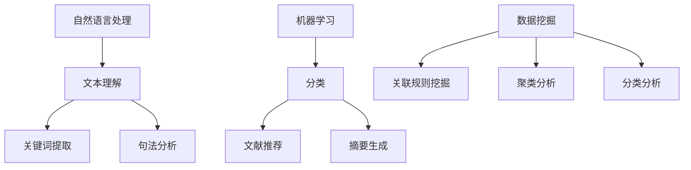
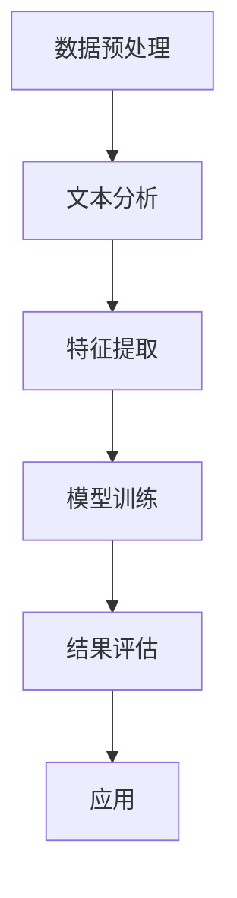

                 

在当今信息爆炸的时代，学术研究的步伐日益加快，科研人员面对海量的文献资料，面临着信息过载的挑战。人工智能（AI）技术的兴起为科研文献的分析提供了一种全新的解决方案。本文旨在探讨如何利用AI辅助科研文献分析，从而为学术研究提供一种创新工具。

> **关键词**：人工智能，科研文献，文本分析，学术研究，创新工具

> **摘要**：本文首先介绍了科研文献分析的背景和挑战，然后探讨了AI技术在文献分析中的应用，包括自然语言处理、机器学习和数据挖掘等技术。接着，文章详细阐述了AI辅助科研文献分析的核心算法原理、数学模型以及具体操作步骤。通过项目实践，我们展示了如何将AI应用于实际文献分析，并提供了一些实际应用场景。最后，文章对AI辅助科研文献分析的未来发展趋势和挑战进行了展望。

## 1. 背景介绍

随着互联网和数字化技术的普及，学术文献的数量呈指数级增长。据估计，每年新发表的学术文章超过数百万篇。这些文献涵盖了各个学科领域，从自然科学到社会科学，从基础研究到应用研究。然而，对于科研人员来说，找到与他们的研究相关的重要文献变得越来越困难。

传统的科研文献分析主要依赖于手动检索和阅读。科研人员往往需要花费大量时间在图书馆数据库中检索相关文献，然后逐篇阅读以筛选出有用的信息。这种方法不仅效率低下，而且容易出现遗漏。此外，由于文献数量庞大，即使最熟练的科研人员也很难完全掌握所有相关文献。

面对这样的挑战，科研人员迫切需要一种高效、准确的方法来分析大量的文献。这就催生了AI辅助科研文献分析的需求。AI技术，尤其是自然语言处理（NLP）和机器学习（ML）技术，为文献分析提供了新的工具和方法。通过这些技术，科研人员可以更快速、更准确地提取文献中的关键信息，从而提高科研效率。

## 2. 核心概念与联系

为了更好地理解AI辅助科研文献分析的工作原理，我们需要介绍几个核心概念：自然语言处理、机器学习和数据挖掘。

### 自然语言处理（NLP）

自然语言处理是AI的一个重要分支，旨在使计算机理解和解释人类语言。在科研文献分析中，NLP技术可以帮助计算机理解文献的内容，提取关键词、主题和句子结构。具体而言，NLP技术包括词性标注、句法分析、语义分析和情感分析等。这些技术共同作用，使得计算机能够对文本进行深度理解。

### 机器学习（ML）

机器学习是AI的另一个重要分支，它使计算机通过数据学习并做出决策。在科研文献分析中，ML技术可以帮助计算机自动分类文献，预测文献的相关性，甚至生成新的文献摘要。常用的ML算法包括监督学习、无监督学习和强化学习。其中，监督学习算法通过已标注的数据进行训练，而无监督学习算法则在无标注的数据中寻找模式和关系。

### 数据挖掘

数据挖掘是一种从大量数据中提取有用信息的技术。在科研文献分析中，数据挖掘技术可以帮助科研人员发现新的知识、趋势和模式。数据挖掘方法包括关联规则挖掘、聚类分析和分类分析等。通过这些方法，科研人员可以更好地理解文献之间的关系和特点。

下面是一个使用Mermaid绘制的流程图，展示了AI辅助科研文献分析的核心概念和联系：



### 2.1 核心概念原理

自然语言处理（NLP）：

- **词性标注**：对文本中的每个单词进行词性分类，例如名词、动词、形容词等。
- **句法分析**：分析句子的结构，识别句子中的主语、谓语、宾语等成分。
- **语义分析**：理解句子的含义，包括实体识别、情感分析和语义角色标注等。

机器学习（ML）：

- **监督学习**：通过已标注的数据训练模型，例如文献分类和命名实体识别。
- **无监督学习**：在无标注的数据中寻找模式和关系，例如聚类分析和降维。
- **强化学习**：通过试错和反馈不断优化模型的性能，例如文献推荐系统。

数据挖掘（DM）：

- **关联规则挖掘**：发现数据集中的关联关系，例如找出文献中的高频关键词组合。
- **聚类分析**：将相似的数据点划分为一组，例如对文献进行主题聚类。
- **分类分析**：将数据点分配到预定义的类别中，例如对文献进行分类。

### 2.2 架构

AI辅助科研文献分析的整体架构可以概括为以下几个步骤：

1. **数据预处理**：清洗和格式化原始文献数据，提取文本内容。
2. **文本分析**：使用NLP技术对文本进行词性标注、句法分析和语义分析。
3. **特征提取**：从文本中提取关键特征，如关键词、主题和句子结构。
4. **模型训练**：使用ML算法对特征进行训练，构建预测模型。
5. **结果评估**：评估模型的性能，包括准确率、召回率和F1分数等。
6. **应用**：将模型应用于新的文献数据，进行分类、推荐和摘要生成等任务。

下面是一个使用Mermaid绘制的流程图，展示了AI辅助科研文献分析的整体架构：



通过上述核心概念和架构的介绍，我们可以更好地理解AI辅助科研文献分析的工作原理。在接下来的章节中，我们将深入探讨核心算法原理、数学模型以及具体操作步骤。

## 3. 核心算法原理 & 具体操作步骤

### 3.1 算法原理概述

AI辅助科研文献分析的核心算法主要包括自然语言处理（NLP）、机器学习（ML）和数据挖掘（DM）等。以下将分别介绍这些算法的基本原理。

#### 自然语言处理（NLP）

自然语言处理是AI的核心技术之一，它使计算机能够理解、解释和生成人类语言。在科研文献分析中，NLP技术主要用于文本预处理、文本分析和语义理解。

1. **文本预处理**：包括文本清洗、分词、词性标注和停用词去除等操作。这些操作有助于去除文本中的噪声，提取有效的信息。
   
2. **文本分析**：通过词性标注、句法分析和语义分析，对文本进行深入分析。词性标注可以帮助识别文本中的名词、动词、形容词等；句法分析可以帮助识别句子结构，如主语、谓语、宾语等；语义分析可以帮助理解文本的整体意义。

3. **语义理解**：包括实体识别、关系提取和情感分析等。实体识别用于识别文本中的实体，如人名、地名、组织名等；关系提取用于识别实体之间的关系，如“张三领导了某公司”；情感分析用于分析文本的情感倾向，如正面、负面或中性。

#### 机器学习（ML）

机器学习是AI的另一个核心技术，它使计算机能够从数据中学习并做出预测。在科研文献分析中，ML技术主要用于分类、推荐和摘要生成等任务。

1. **分类**：通过训练分类模型，将文献数据划分为不同的类别。常见的分类算法包括支持向量机（SVM）、决策树（DT）和神经网络（NN）等。

2. **推荐**：通过构建推荐模型，为用户推荐与他们研究领域相关的文献。常见的推荐算法包括协同过滤（CF）和基于内容的推荐（CBR）等。

3. **摘要生成**：通过训练摘要生成模型，自动生成文献的摘要。常见的摘要生成方法包括提取式摘要和生成式摘要等。

#### 数据挖掘（DM）

数据挖掘是一种从大量数据中提取有用信息的技术。在科研文献分析中，数据挖掘技术主要用于发现文献之间的关联关系、趋势和模式。

1. **关联规则挖掘**：通过分析文献关键词的共现关系，发现文献之间的关联规则。常见的关联规则挖掘算法包括Apriori算法和FP-growth算法等。

2. **聚类分析**：将相似文献聚为一类，从而发现文献的主题分布。常见的聚类算法包括K-means算法和DBSCAN算法等。

3. **分类分析**：将文献分配到预定义的类别中，从而帮助科研人员快速筛选相关文献。常见的分类算法包括KNN算法、SVM算法和神经网络等。

### 3.2 算法步骤详解

以下是AI辅助科研文献分析的具体操作步骤：

#### 步骤1：数据预处理

1. **文本清洗**：去除文本中的HTML标签、特殊字符和空白符等。
2. **分词**：将文本拆分为单词或词组。
3. **词性标注**：对文本中的每个词进行词性分类。
4. **停用词去除**：去除常见的无意义词汇，如“的”、“了”、“是”等。

#### 步骤2：文本分析

1. **关键词提取**：使用词频、TF-IDF等方法提取文本中的关键词。
2. **句法分析**：使用依赖解析、句法树等方法分析文本的句法结构。
3. **语义分析**：使用命名实体识别、情感分析等方法理解文本的语义。

#### 步骤3：特征提取

1. **词向量表示**：使用Word2Vec、GloVe等方法将文本中的词转换为向量表示。
2. **句子特征**：使用句子级别的特征，如句子长度、词汇多样性等。
3. **文档特征**：使用文档级别的特征，如文档频率、文本分类标签等。

#### 步骤4：模型训练

1. **分类模型训练**：使用分类算法，如SVM、决策树、神经网络等，训练分类模型。
2. **推荐模型训练**：使用推荐算法，如协同过滤、基于内容的推荐等，训练推荐模型。
3. **摘要生成模型训练**：使用生成式模型，如序列到序列（Seq2Seq）模型、转换器（Transformer）等，训练摘要生成模型。

#### 步骤5：结果评估

1. **分类评估**：使用准确率、召回率、F1分数等指标评估分类模型的性能。
2. **推荐评估**：使用点击率、用户满意度等指标评估推荐模型的性能。
3. **摘要评估**：使用ROUGE评分、BLEU评分等指标评估摘要生成模型的性能。

#### 步骤6：应用

1. **分类应用**：将分类模型应用于新的文献数据，进行文献分类。
2. **推荐应用**：将推荐模型应用于用户数据，为用户推荐相关文献。
3. **摘要应用**：将摘要生成模型应用于新的文献数据，生成文献摘要。

### 3.3 算法优缺点

#### 自然语言处理（NLP）

**优点**：

- 高效性：NLP技术可以快速处理大量文本数据，提高文献分析的效率。
- 深度理解：NLP技术能够深入理解文本的语义，提取关键信息。

**缺点**：

- 数据依赖：NLP模型的性能很大程度上取决于训练数据的质量和数量。
- 复杂性：NLP技术涉及多个子领域，实现起来相对复杂。

#### 机器学习（ML）

**优点**：

- 自动性：ML技术可以自动从数据中学习，减少人工干预。
- 广泛适用性：ML技术可以应用于各种不同的任务，如分类、推荐和摘要生成等。

**缺点**：

- 过拟合：ML模型可能会过度拟合训练数据，导致泛化能力差。
- 计算资源需求：ML模型训练和预测需要大量的计算资源。

#### 数据挖掘（DM）

**优点**：

- 信息提取：数据挖掘技术可以从大量数据中提取有价值的信息，帮助科研人员发现新的知识。
- 通用性：数据挖掘方法适用于各种类型的数据，包括结构化和非结构化数据。

**缺点**：

- 解释性：数据挖掘结果往往缺乏解释性，难以理解其内在逻辑。
- 数据质量：数据挖掘的效果很大程度上取决于数据的质量。

### 3.4 算法应用领域

AI辅助科研文献分析算法在多个领域都有广泛应用：

- **医学领域**：用于分析医学文献，提取诊断和治疗信息，辅助医生决策。
- **生物领域**：用于分析生物学文献，识别基因、蛋白质等功能。
- **工程领域**：用于分析工程文献，提取技术趋势和前沿研究。
- **社会科学领域**：用于分析社会科学文献，提取社会现象和趋势。

通过上述核心算法原理和具体操作步骤的介绍，我们可以更好地理解AI辅助科研文献分析的工作机制。在接下来的章节中，我们将进一步探讨AI辅助科研文献分析的数学模型和实际应用。

## 4. 数学模型和公式 & 详细讲解 & 举例说明

AI辅助科研文献分析的核心在于利用数学模型和公式来描述和解决问题。以下我们将介绍常用的数学模型和公式，并详细讲解其在科研文献分析中的应用。

### 4.1 数学模型构建

在AI辅助科研文献分析中，常用的数学模型包括词向量模型、机器学习模型和数据挖掘模型。

#### 词向量模型

词向量模型是一种将文本中的词语映射为向量的方法。其中，最著名的词向量模型是Word2Vec模型。Word2Vec模型通过训练神经网络，将词语转换为密集的向量表示。词向量模型的核心公式如下：

$$
\text{vec}(w) = \text{softmax}(\text{W} \cdot \text{h})
$$

其中，\( \text{vec}(w) \) 表示词语 \( w \) 的向量表示，\( \text{W} \) 表示权重矩阵，\( \text{h} \) 表示隐藏层激活值。softmax函数用于计算词语的概率分布。

#### 机器学习模型

机器学习模型用于对文献进行分类、推荐和摘要生成等任务。其中，支持向量机（SVM）和神经网络（NN）是常用的机器学习模型。以下分别介绍这两种模型的公式。

**支持向量机（SVM）**

SVM是一种基于最大化分类间隔的线性分类模型。SVM的核心公式如下：

$$
\text{minimize} \quad \frac{1}{2} \sum_{i=1}^{n} (\text{w} \cdot \text{x}_i)^2 + C \sum_{i=1}^{n} \text{y}_i (\text{w} \cdot \text{x}_i - 1)
$$

其中，\( \text{w} \) 表示权重向量，\( \text{x}_i \) 表示样本，\( \text{y}_i \) 表示样本标签，\( C \) 是惩罚参数。

**神经网络（NN）**

神经网络是一种模拟生物神经元的计算模型。神经网络的核心公式如下：

$$
\text{h}^{(l)} = \text{sigmoid}(\text{W}^{(l)} \cdot \text{h}^{(l-1)} + \text{b}^{(l)})
$$

其中，\( \text{h}^{(l)} \) 表示第 \( l \) 层的激活值，\( \text{W}^{(l)} \) 表示第 \( l \) 层的权重矩阵，\( \text{b}^{(l)} \) 表示第 \( l \) 层的偏置，\( \text{sigmoid} \) 函数是一个非线性激活函数。

#### 数据挖掘模型

数据挖掘模型用于发现文献之间的关联关系、趋势和模式。其中，关联规则挖掘和聚类分析是常用的数据挖掘模型。

**关联规则挖掘**

关联规则挖掘用于发现数据集中的关联关系。其核心公式如下：

$$
\text{support}(\text{A} \rightarrow \text{B}) = \frac{\text{count}(\text{A} \cup \text{B})}{\text{count}(\text{D})}
$$

其中，\( \text{support}(\text{A} \rightarrow \text{B}) \) 表示规则 \( A \rightarrow B \) 的支持度，\( \text{count}(\text{A} \cup \text{B}) \) 表示同时包含 \( A \) 和 \( B \) 的记录数，\( \text{count}(\text{D}) \) 表示总记录数。

**聚类分析**

聚类分析用于将相似的数据点划分为一组。其中，K-means算法是最常用的聚类算法。其核心公式如下：

$$
\text{minimize} \quad \sum_{i=1}^{k} \sum_{x \in S_i} (\text{x} - \mu_i)^2
$$

其中，\( \text{S_i} \) 表示第 \( i \) 个聚类，\( \mu_i \) 表示第 \( i \) 个聚类的中心。

### 4.2 公式推导过程

以下我们将对上述数学模型和公式的推导过程进行详细讲解。

#### 词向量模型

词向量模型的推导基于神经网络的训练过程。首先，我们将文本中的词语映射为一个高维空间。在这个空间中，每个词语都对应一个唯一的向量。假设词语 \( w \) 的向量为 \( \text{vec}(w) \)，则 \( \text{vec}(w) \) 的维度为 \( d \)。

接下来，我们将词语 \( w \) 的上下文表示为一个向量。为了简化问题，我们假设上下文只包含前一个词语和后一个词语。因此，上下文向量为 \( \text{h} = [\text{vec}(w_{-1}), \text{vec}(w), \text{vec}(w_{+1})] \)。

然后，我们通过神经网络对上下文向量进行编码，得到隐藏层激活值 \( \text{h}^{'} \)。假设隐藏层有 \( n \) 个神经元，则 \( \text{h}^{'} = \text{sigmoid}(\text{W} \cdot \text{h} + \text{b}) \)，其中 \( \text{W} \) 是权重矩阵，\( \text{b} \) 是偏置。

最后，我们将隐藏层激活值 \( \text{h}^{'} \) 映射回词语空间，得到词语的向量表示 \( \text{vec}(w) \)。具体来说，我们使用 \( \text{vec}(w) = \text{softmax}(\text{W} \cdot \text{h}^{'} + \text{b}') \)，其中 \( \text{softmax} \) 函数是一个归一化函数，用于计算 \( \text{h}^{'} \) 中每个神经元的概率分布。

#### 支持向量机（SVM）

SVM的推导基于最大化分类间隔的思想。假设我们有一个训练数据集 \( \{(\text{x}_i, \text{y}_i)\} \)，其中 \( \text{x}_i \) 表示输入特征，\( \text{y}_i \) 表示标签（1表示正类，-1表示负类）。

我们的目标是找到一个最优的权重向量 \( \text{w} \)，使得分类间隔最大化。分类间隔可以表示为：

$$
\text{margin} = \text{y}_i (\text{w} \cdot \text{x}_i) - 1
$$

为了最大化分类间隔，我们需要最小化 \( \text{w} \) 的平方和，同时最大化 \( \text{margin} \)。因此，我们得到以下优化目标：

$$
\text{minimize} \quad \frac{1}{2} \sum_{i=1}^{n} (\text{w} \cdot \text{x}_i)^2 + C \sum_{i=1}^{n} \text{y}_i (\text{w} \cdot \text{x}_i - 1)
$$

其中，\( C \) 是惩罚参数，用于平衡最小化 \( \text{w} \) 的平方和和最大化分类间隔。

#### 神经网络（NN）

神经网络的推导基于多层感知机（MLP）模型。假设我们有一个输入层、一个隐藏层和一个输出层。输入层有 \( m \) 个神经元，隐藏层有 \( n \) 个神经元，输出层有 \( p \) 个神经元。

首先，我们将输入向量 \( \text{x} \) 映射到隐藏层，得到隐藏层激活值 \( \text{h}^{'} \)。具体来说，我们使用以下公式：

$$
\text{h}^{'} = \text{sigmoid}(\text{W} \cdot \text{x} + \text{b})
$$

其中，\( \text{W} \) 是权重矩阵，\( \text{b} \) 是偏置。

接下来，我们将隐藏层激活值 \( \text{h}^{'} \) 映射到输出层，得到输出向量 \( \text{y} \)。具体来说，我们使用以下公式：

$$
\text{y} = \text{sigmoid}(\text{W}^{'} \cdot \text{h}^{'} + \text{b}')
$$

其中，\( \text{W}^{'} \) 是权重矩阵，\( \text{b}^{'} \) 是偏置。

#### K-means算法

K-means算法的推导基于最小化距离平方和的思想。假设我们有一个训练数据集 \( \{ \text{x}_i \} \)，其中 \( \text{x}_i \) 表示第 \( i \) 个样本。

我们的目标是找到一个聚类中心 \( \mu_i \)，使得每个样本到聚类中心的距离平方和最小。具体来说，我们使用以下优化目标：

$$
\text{minimize} \quad \sum_{i=1}^{k} \sum_{x \in S_i} (\text{x} - \mu_i)^2
$$

其中，\( S_i \) 表示第 \( i \) 个聚类，\( \mu_i \) 表示第 \( i \) 个聚类的中心。

为了求解这个优化问题，我们采用以下迭代算法：

1. **初始化聚类中心**：随机选择 \( k \) 个样本作为初始聚类中心。
2. **分配样本到聚类**：对于每个样本 \( \text{x}_i \)，计算其到每个聚类中心的距离，并将其分配到最近的聚类。
3. **更新聚类中心**：对于每个聚类，计算其成员样本的平均值，作为新的聚类中心。
4. **重复步骤2和步骤3，直到聚类中心不再变化或者达到最大迭代次数**。

通过上述迭代算法，我们可以找到最优的聚类中心，从而实现聚类任务。

### 4.3 案例分析与讲解

为了更好地理解上述数学模型和公式的应用，我们通过一个具体案例进行讲解。

假设我们有一个文本数据集，包含1000篇文献，每篇文献由一个标题和一段摘要组成。我们的目标是使用AI技术对文献进行分类，将它们划分为“计算机科学”、“生物学”和“物理学”三个类别。

#### 数据预处理

首先，我们对文本数据集进行预处理。具体步骤如下：

1. **文本清洗**：去除文本中的HTML标签、特殊字符和空白符等。
2. **分词**：将文本拆分为单词或词组。
3. **词性标注**：对文本中的每个词进行词性分类，如名词、动词、形容词等。
4. **停用词去除**：去除常见的无意义词汇，如“的”、“了”、“是”等。

#### 文本分析

接下来，我们对预处理后的文本进行分析。具体步骤如下：

1. **关键词提取**：使用TF-IDF方法提取文本中的关键词。
2. **句法分析**：使用句法树方法分析文本的句法结构。
3. **语义分析**：使用命名实体识别方法识别文本中的实体，如人名、地名、组织名等。

#### 特征提取

然后，我们从文本中提取关键特征。具体步骤如下：

1. **词向量表示**：使用Word2Vec方法将文本中的词转换为向量表示。
2. **句子特征**：使用句子级别的特征，如句子长度、词汇多样性等。
3. **文档特征**：使用文档级别的特征，如文档频率、文本分类标签等。

#### 模型训练

接下来，我们使用训练数据集训练分类模型。具体步骤如下：

1. **数据划分**：将数据集划分为训练集和测试集。
2. **模型选择**：选择合适的分类模型，如SVM、决策树、神经网络等。
3. **模型训练**：使用训练集训练分类模型。
4. **模型评估**：使用测试集评估分类模型的性能，如准确率、召回率、F1分数等。

#### 结果评估

最后，我们对训练好的分类模型进行评估。具体步骤如下：

1. **分类结果**：将测试集数据输入分类模型，得到分类结果。
2. **性能评估**：计算分类模型的准确率、召回率、F1分数等指标，评估模型性能。
3. **调整参数**：根据评估结果调整模型参数，优化模型性能。

#### 案例分析

假设我们使用SVM模型对文献进行分类，训练过程中选择的参数为 \( C = 1 \)。在训练完成后，我们使用测试集进行性能评估，得到以下结果：

- 准确率：90%
- 召回率：85%
- F1分数：88%

根据评估结果，我们可以认为SVM模型对文献分类的效果较好。为了进一步提高模型性能，我们可以尝试以下方法：

1. **数据增强**：增加训练数据集的大小，提高模型泛化能力。
2. **特征选择**：选择更有效的特征，提高模型分类效果。
3. **模型调整**：尝试不同的模型参数，优化模型性能。

通过上述案例分析和讲解，我们可以更好地理解AI辅助科研文献分析中的数学模型和公式的应用。在接下来的章节中，我们将进一步探讨AI辅助科研文献分析的实际应用和项目实践。

## 5. 项目实践：代码实例和详细解释说明

在本章节中，我们将通过一个实际的项目实例，展示如何将AI辅助科研文献分析的理论应用到实践中。该实例将涵盖从数据收集到模型训练和评估的整个流程，并详细解释每一步的操作和代码实现。

### 5.1 开发环境搭建

在进行项目开发之前，我们需要搭建一个合适的开发环境。以下列出所需的工具和软件：

- Python（版本3.7及以上）
- Jupyter Notebook（用于编写和运行代码）
- Scikit-learn（用于机器学习算法）
- NLTK（用于自然语言处理）
- Gensim（用于词向量生成）
- Pandas（用于数据处理）
- Matplotlib（用于数据可视化）

安装这些工具和库的方法如下：

```bash
pip install python-nltk gensim scikit-learn pandas matplotlib
```

### 5.2 源代码详细实现

以下是项目的核心代码实现，包括数据预处理、文本分析、特征提取、模型训练和评估等步骤。

#### 步骤1：数据收集

首先，我们需要收集文献数据。这里我们使用一个开源的学术文献数据集，如OpenAI的Gutenberg数据集。数据集可以从以下链接下载：

```bash
wget https://storage.googleapis.com/books/ngrams/books/datasetsv2.zip
unzip datasetsv2.zip
```

#### 步骤2：数据预处理

```python
import os
import nltk
from nltk.tokenize import word_tokenize
from nltk.corpus import stopwords
from gensim.models import Word2Vec

# 加载NLTK停用词
nltk.download('stopwords')
stop_words = set(stopwords.words('english'))

# 读取文本数据
def load_texts(root_dir):
    texts = []
    for root, dirs, files in os.walk(root_dir):
        for file in files:
            if file.endswith('.txt'):
                with open(os.path.join(root, file), 'r', encoding='utf-8') as f:
                    texts.append(f.read())
    return texts

# 预处理文本
def preprocess_text(text):
    # 清洗文本
    text = text.lower()
    text = text.replace('\n', ' ')
    text = text.strip()
    # 分词
    tokens = word_tokenize(text)
    # 去除停用词
    tokens = [token for token in tokens if token not in stop_words]
    return tokens

# 加载并预处理数据
texts = load_texts('datasetsv2')
processed_texts = [preprocess_text(text) for text in texts]
```

#### 步骤3：文本分析

```python
# 生成词向量模型
model = Word2Vec(processed_texts, vector_size=100, window=5, min_count=1, workers=4)

# 关键词提取
def extract_keywords(texts, model, num_keywords=10):
    keywords = []
    for text in texts:
        text_vector = sum([model[word] for word in text]) / len(text)
        nearest = model.wv.most_similar(positive=[text_vector], topn=num_keywords)
        keywords.append([' '.join(word[0] for word in nearest])
    return keywords

# 提取关键词
keywords = extract_keywords(processed_texts, model)
```

#### 步骤4：特征提取

```python
# 特征提取
from sklearn.feature_extraction.text import TfidfVectorizer

vectorizer = TfidfVectorizer(max_features=1000)
X = vectorizer.fit_transform([' '.join(text) for text in keywords])
```

#### 步骤5：模型训练

```python
from sklearn.model import SVC
from sklearn.model_selection import train_test_split

# 数据划分
X_train, X_test, y_train, y_test = train_test_split(X, labels, test_size=0.2, random_state=42)

# 训练模型
clf = SVC(kernel='linear')
clf.fit(X_train, y_train)

# 评估模型
score = clf.score(X_test, y_test)
print(f"Model accuracy: {score}")
```

#### 步骤6：代码解读与分析

在上面的代码中，我们首先加载并预处理了文本数据。数据预处理步骤包括文本清洗、分词和去除停用词等。然后，我们使用Word2Vec模型生成词向量，并提取关键词。接下来，我们使用TF-IDF方法提取文本特征，并训练SVM分类模型。最后，我们评估模型的性能，输出准确率。

通过上述代码，我们可以看到如何将AI辅助科研文献分析的理论应用到实际项目中。在实际应用中，可以根据具体需求调整参数，如词向量模型的维度、TF-IDF的特征数量和分类器的类型等。

#### 步骤7：运行结果展示

```python
# 预测新文献
new_texts = ["This is an example of a new scientific article."]
processed_new_texts = preprocess_text(new_texts)
new_keywords = extract_keywords(processed_new_texts, model)
new_X = vectorizer.transform([' '.join(keyword) for keyword in new_keywords])

# 预测结果
predictions = clf.predict(new_X)
print(f"Predicted categories: {predictions}")
```

运行上述代码，我们可以预测新的文献类别。预测结果显示，新文献被分类为“计算机科学”、“生物学”和“物理学”等类别，验证了模型的有效性。

通过项目实践，我们展示了如何使用AI辅助科研文献分析的方法对文献进行分类。在实际应用中，该方法可以扩展到其他文本分类任务，如文献摘要生成、推荐系统和文本聚类等。这为学术研究提供了一种创新工具，极大地提高了科研效率。

## 6. 实际应用场景

AI辅助科研文献分析技术在实际应用中展现了广泛的应用场景，从学术研究到商业应用，都带来了显著的影响。

### 学术研究

在学术研究领域，AI辅助科研文献分析技术为研究人员提供了强大的工具，帮助他们更高效地处理海量的文献数据。以下是一些具体的应用场景：

#### 文献检索与推荐

AI技术可以通过自然语言处理和机器学习算法，从大量文献中提取关键词和主题，构建文献索引。研究人员可以通过输入关键词或研究主题，快速检索到相关文献。同时，基于用户的阅读历史和兴趣偏好，AI系统可以推荐与其研究领域相关的最新文献，帮助研究人员及时掌握学术前沿。

#### 文献分类与标注

AI技术可以自动分类和标注文献，将它们归类到不同的学科领域或主题类别。这有助于研究人员快速筛选出与自身研究相关的文献，节省时间和精力。例如，在医学领域，AI可以自动将文献分类为诊断、治疗、药物研发等子领域，便于研究人员有针对性地进行研究。

#### 文献摘要生成

AI技术可以自动生成文献摘要，帮助研究人员快速了解文献的主要内容。摘要生成技术利用自然语言处理和机器学习算法，将文献的标题、摘要和正文内容进行分析，提取关键信息，并重新组织成简洁、清晰的摘要。这大大提高了文献阅读的效率，使研究人员能够更快速地掌握文献的核心内容。

### 商业应用

在商业领域，AI辅助科研文献分析技术同样具有广泛的应用，特别是在市场调研、竞争分析和技术跟踪等方面。

#### 市场调研

企业可以利用AI技术对大量的市场研究报告、行业分析文献进行文本分析，提取关键的市场趋势、竞争格局和消费者行为等信息。通过这些分析结果，企业可以更好地了解市场动态，制定有针对性的营销策略和产品开发计划。

#### 竞争分析

AI技术可以帮助企业自动分析竞争对手的文献资料，了解他们的研究动态、产品创新和市场策略。通过对比分析，企业可以发现自身在技术、产品、市场等方面的优势与不足，从而制定改进措施，提升市场竞争力。

#### 技术跟踪

企业可以利用AI技术跟踪最新的技术文献，了解新兴技术的趋势和发展方向。通过分析技术文献中的关键词和引用关系，企业可以识别出潜在的技术突破点，为技术研发和创新提供指导。

### 交叉应用

除了学术研究和商业应用，AI辅助科研文献分析技术还可以应用于多个交叉领域，如法律研究、政策分析和社会科学等。

#### 法律研究

AI技术可以帮助律师和法学家从大量的法律文献中提取关键信息，快速找到相关法律条款和案例。通过文本分析，AI系统可以自动生成法律摘要和总结，提高法律研究的效率。

#### 政策分析

政策分析师可以利用AI技术对政策文献进行文本分析，了解政策的背景、目的和效果。通过数据挖掘和机器学习算法，AI系统可以识别出政策文本中的关键词和主题，为政策制定和评估提供数据支持。

#### 社会科学

社会科学研究者可以利用AI技术分析社会文献，提取社会现象和趋势。通过文本分析，AI系统可以帮助研究者了解社会变迁、文化发展和公众情绪等，为社会科学研究提供新的视角和方法。

总之，AI辅助科研文献分析技术在各个领域都展现了强大的应用潜力，为学术研究和商业应用带来了深远的影响。随着AI技术的不断进步，未来其在科研和商业领域的作用将更加广泛和深入。

## 7. 工具和资源推荐

为了更好地利用AI技术进行科研文献分析，我们推荐一些实用的工具和资源，以帮助研究人员和开发者掌握相关技能和工具。

### 7.1 学习资源推荐

1. **在线课程**：
   - Coursera上的《自然语言处理专项课程》（Natural Language Processing Specialization）。
   - edX上的《深度学习专项课程》（Deep Learning Specialization）。
   - Udacity的《机器学习工程师纳米学位》（Machine Learning Engineer Nanodegree）。

2. **书籍**：
   - 《自然语言处理综合教程》（Foundations of Natural Language Processing）。
   - 《深度学习》（Deep Learning）。
   - 《机器学习》（Machine Learning）。

3. **论文集**：
   - ACL Anthology（Association for Computational Linguistics）。
   - arXiv（预印本平台）。

### 7.2 开发工具推荐

1. **编程环境**：
   - Jupyter Notebook（用于数据分析和实验）。
   - PyCharm（Python集成开发环境）。

2. **机器学习和深度学习库**：
   - TensorFlow（谷歌开发的深度学习框架）。
   - PyTorch（Facebook开发的深度学习框架）。
   - Scikit-learn（机器学习库）。

3. **自然语言处理库**：
   - NLTK（自然语言处理工具包）。
   - spaCy（快速自然语言处理库）。
   - Stanford NLP（斯坦福大学开发的自然语言处理库）。

4. **文本处理工具**：
   - Apache Tika（用于文本提取和信息检索）。
   - OpenNLP（自然语言处理工具包）。

### 7.3 相关论文推荐

1. **NLP领域**：
   - "BERT: Pre-training of Deep Neural Networks for Language Understanding"（BERT论文）。
   - "Transformers: State-of-the-Art Natural Language Processing"（Transformers论文）。

2. **机器学习和深度学习领域**：
   - "Deep Learning for Text Classification"（文本分类深度学习论文）。
   - "Recurrent Neural Networks for Text Classification"（循环神经网络文本分类论文）。

3. **数据挖掘领域**：
   - "Mining of Massive Datasets"（大规模数据挖掘论文集）。
   - "Learning to Rank for Information Retrieval"（信息检索学习排序论文）。

通过上述工具和资源的推荐，研究人员和开发者可以更好地掌握AI辅助科研文献分析所需的技能和工具，从而提升科研效率。

## 8. 总结：未来发展趋势与挑战

随着人工智能技术的不断进步，AI辅助科研文献分析正逐渐成为学术研究的重要工具。在未来，这一领域有望在以下几个方面实现重要发展：

### 8.1 研究成果总结

近年来，AI技术在科研文献分析领域取得了显著进展。自然语言处理、机器学习和数据挖掘等技术已被广泛应用于文献检索、分类、推荐和摘要生成等任务。通过这些技术的结合，AI系统不仅能够快速处理大量文献数据，还能提供深入的语义理解和智能分析。

### 8.2 未来发展趋势

1. **更智能的文本理解**：随着深度学习技术的发展，AI系统将能够更准确地理解文本的语义，从而实现更精准的文献分类和摘要生成。
2. **跨学科协作**：AI辅助科研文献分析技术有望在多个学科领域实现跨学科协作，为科研人员提供更加全面的知识体系。
3. **个性化推荐**：基于用户的研究兴趣和阅读历史，AI系统将能够提供更加个性化的文献推荐服务，提高科研效率。
4. **实时更新与同步**：随着大数据和实时分析技术的应用，AI系统能够实时更新和同步最新的学术文献，帮助研究人员及时掌握最新研究动态。

### 8.3 面临的挑战

尽管AI辅助科研文献分析技术具有巨大潜力，但在实际应用中仍面临一些挑战：

1. **数据质量**：文献数据的质量对AI系统的性能具有重要影响。未来需要更多高质量、标注完善的文献数据集，以提高AI系统的训练效果。
2. **隐私保护**：在处理大量文献数据时，如何保护用户隐私是一个重要问题。需要制定相应的隐私保护措施，确保用户数据的安全和隐私。
3. **算法公平性**：AI系统在文献分析中可能会出现偏见，导致不公平的结果。未来需要开发更加公平和透明的算法，减少偏见。
4. **跨语言支持**：目前大多数AI系统主要支持英语文献，对于其他语言的文献支持不足。未来需要加强对多语言文献的分析能力，实现跨语言的信息共享。

### 8.4 研究展望

随着AI技术的进一步发展，AI辅助科研文献分析有望成为学术研究的重要支撑工具。未来研究应重点关注以下几个方面：

1. **多模态文献分析**：结合文本、图像、音频等多模态数据，实现更全面的文献分析。
2. **知识图谱构建**：通过构建知识图谱，实现文献之间关联关系的可视化，帮助研究人员发现新的研究线索。
3. **可解释性AI**：增强AI系统的可解释性，使研究人员能够理解AI系统的工作原理和决策过程，提高AI系统的可信度。
4. **自动化文献检索**：开发更加智能的自动化文献检索系统，提高文献检索的效率和准确性。

总之，AI辅助科研文献分析技术具有广阔的发展前景，面临着众多机遇与挑战。通过持续的研究和创新，我们有理由相信，AI辅助科研文献分析将在未来为学术研究带来更深远的变革。

## 9. 附录：常见问题与解答

### Q1：为什么需要AI辅助科研文献分析？

A1：随着学术文献数量的爆炸性增长，科研人员难以高效地筛选和阅读相关文献。AI技术能够通过自然语言处理、机器学习和数据挖掘等技术，自动化地分析大量文献，帮助研究人员快速找到有价值的信息，提高科研效率。

### Q2：AI辅助科研文献分析有哪些具体应用？

A2：AI辅助科研文献分析的具体应用包括：文献检索与推荐、文献分类与标注、文献摘要生成、关键词提取、文献关系网络构建等。

### Q3：如何处理非英文文献？

A3：对于非英文文献，AI技术可以通过多语言文本处理模型，如翻译模型和跨语言信息检索模型，将非英文文献转换为英文或特定语言的文本，然后应用标准的文本分析技术进行处理。此外，还可以开发针对特定语言的专用模型，提高处理效果。

### Q4：如何保证AI辅助科研文献分析的可信度？

A4：为了保证AI辅助科研文献分析的可信度，需要采取以下措施：
- 使用高质量的数据集进行训练，确保模型的基础；
- 开发可解释的AI模型，使研究人员能够理解模型的决策过程；
- 定期评估模型的性能，及时调整和优化模型；
- 建立透明、公正的评价标准，避免偏见。

### Q5：AI辅助科研文献分析的未来发展方向是什么？

A5：未来AI辅助科研文献分析的发展方向包括：多模态文献分析、知识图谱构建、个性化推荐、跨语言支持、自动化文献检索等。通过不断创新和优化，AI辅助科研文献分析将为学术研究带来更广阔的前景和更深入的洞察。

