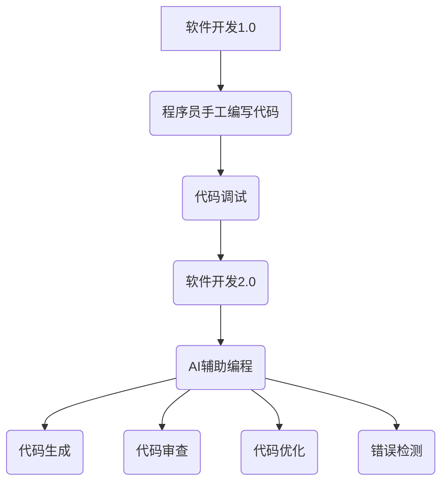
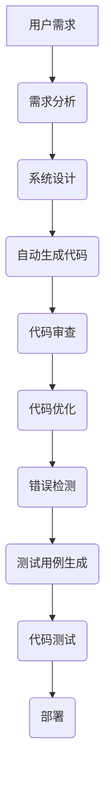

                 

关键词：人工智能，编程辅助，软件1.0，软件2.0，软件开发，自动化，智能化，算法，数学模型，项目实践，应用场景，工具推荐，发展趋势，研究展望。

> 摘要：本文深入探讨了人工智能（AI）在软件开发领域的应用，特别是在软件1.0和软件2.0之间的融合。通过分析AI的核心算法原理、数学模型、项目实践，以及实际应用场景，本文旨在展示AI辅助编程的未来发展趋势与挑战，为读者提供全面的技术见解。

## 1. 背景介绍

在计算机科学的发展历程中，软件开发经历了从软件1.0到软件2.0的演变。软件1.0时代，编程依赖于程序员的个人技能和经验，代码的编写和调试过程复杂且耗时。而随着人工智能技术的进步，软件2.0时代应运而生，编程逐渐向自动化和智能化方向发展。AI辅助编程不仅提高了开发效率，还带来了开发模式、开发工具和开发流程的深刻变革。

AI辅助编程的核心在于利用机器学习和深度学习技术，实现代码的自动生成、代码审查、代码优化、错误检测等功能。这使得软件开发从传统的手工作坊模式转向更加高效、智能的工业生产模式。本文将围绕这一主题，详细探讨AI辅助编程的理论基础、技术实现和实际应用。

## 2. 核心概念与联系

### 2.1. 软件开发1.0和2.0

软件开发1.0以程序员手工编写代码为主要形式，依赖个人的编程技巧和经验。而软件开发2.0则强调利用人工智能技术，实现编程自动化和智能化，从而提高开发效率和质量。

### 2.2. 人工智能与编程辅助

人工智能在编程辅助中的应用主要包括代码生成、代码审查、代码优化和错误检测。这些应用使得编程过程更加高效和可靠。

### 2.3. Mermaid 流程图



## 3. 核心算法原理 & 具体操作步骤

### 3.1. 算法原理概述

AI辅助编程的核心算法主要包括基于深度学习的代码生成算法、基于规则的代码审查算法和基于统计学习的代码优化算法。

### 3.2. 算法步骤详解

#### 3.2.1. 代码生成算法

1. 数据预处理：收集大量代码数据，进行预处理，包括数据清洗、数据格式化等。
2. 模型训练：使用预处理的代码数据训练深度学习模型，如生成对抗网络（GAN）或循环神经网络（RNN）。
3. 代码生成：根据训练好的模型，输入部分代码或需求描述，生成完整的代码。

#### 3.2.2. 代码审查算法

1. 数据收集：收集代码审查数据，包括代码缺陷、错误报告等。
2. 模型训练：使用收集的代码审查数据训练分类模型，如支持向量机（SVM）或决策树。
3. 代码审查：输入待审查的代码，通过训练好的模型判断代码是否存在缺陷。

#### 3.2.3. 代码优化算法

1. 数据收集：收集大量代码优化案例，包括代码段、优化前后的性能对比等。
2. 模型训练：使用收集的代码优化数据训练优化模型，如强化学习模型。
3. 代码优化：输入待优化的代码段，通过训练好的模型生成优化后的代码。

### 3.3. 算法优缺点

#### 3.3.1. 代码生成算法

**优点**：能够快速生成代码，提高开发效率。

**缺点**：生成的代码可能不够健壮，需要人工进一步审查和调试。

#### 3.3.2. 代码审查算法

**优点**：能够自动识别代码缺陷，提高代码质量。

**缺点**：对复杂的代码缺陷识别能力有限，需要与人工审查相结合。

#### 3.3.3. 代码优化算法

**优点**：能够自动优化代码，提高性能。

**缺点**：优化结果可能不稳定，需要人工干预。

### 3.4. 算法应用领域

AI辅助编程算法广泛应用于Web开发、移动应用开发、数据科学和机器学习等领域。

## 4. 数学模型和公式 & 详细讲解 & 举例说明

### 4.1. 数学模型构建

AI辅助编程中的数学模型主要包括深度学习模型、分类模型和优化模型。以下是一个简单的深度学习模型的构建示例：

$$
h_{\theta}(x) = \sigma(\theta^T x)
$$

其中，$h_{\theta}(x)$ 是深度学习模型的输出，$\sigma$ 是激活函数，$\theta$ 是模型的参数，$x$ 是输入数据。

### 4.2. 公式推导过程

以生成对抗网络（GAN）为例，推导其生成器和判别器的损失函数：

$$
L_G = -\mathbb{E}_{z \sim p_z(z)}[\log(D(G(z))]
$$

$$
L_D = -\mathbb{E}_{x \sim p_{\text{data}}(x)}[\log(D(x))] - \mathbb{E}_{z \sim p_z(z)}[\log(1 - D(G(z))]
$$

其中，$L_G$ 是生成器的损失函数，$L_D$ 是判别器的损失函数，$G(z)$ 是生成器的输出，$D(x)$ 是判别器的输出，$z$ 是噪声样本。

### 4.3. 案例分析与讲解

以代码生成算法为例，分析其在实际项目中的应用。假设我们使用生成对抗网络（GAN）进行代码生成，输入是部分代码和需求描述，输出是完整的代码。

1. **数据预处理**：收集大量开源代码数据，进行预处理，包括数据清洗、数据格式化等。
2. **模型训练**：使用预处理的代码数据训练生成器和判别器，使用梯度下降法优化模型参数。
3. **代码生成**：输入部分代码和需求描述，生成完整的代码。生成的代码可能需要人工进一步审查和调试。

## 5. 项目实践：代码实例和详细解释说明

### 5.1. 开发环境搭建

在Windows环境下，我们使用Python和TensorFlow搭建开发环境。以下是具体步骤：

1. 安装Python（版本3.8及以上）。
2. 安装TensorFlow。
3. 安装其他依赖库（如NumPy、Pandas等）。

### 5.2. 源代码详细实现

以下是一个简单的代码生成器示例，使用生成对抗网络（GAN）进行训练：

```python
import tensorflow as tf
from tensorflow.keras.layers import Dense, Flatten, Reshape
from tensorflow.keras.models import Model

# 生成器模型
def build_generator(z_dim):
    model = tf.keras.Sequential()
    model.add(Dense(128, input_shape=(z_dim,), activation='relu'))
    model.add(Dense(256, activation='relu'))
    model.add(Dense(512, activation='relu'))
    model.add(Dense(1024, activation='relu'))
    model.add(Dense(2048, activation='relu'))
    model.add(Dense(4096, activation='relu'))
    model.add(Dense(1024, activation='sigmoid'))
    model.add(Dense(512, activation='sigmoid'))
    model.add(Dense(256, activation='sigmoid'))
    model.add(Dense(128, activation='sigmoid'))
    model.add(Dense(64, activation='sigmoid'))
    model.add(Dense(1, activation='sigmoid'))
    return model

# 判别器模型
def build_discriminator(x_dim):
    model = tf.keras.Sequential()
    model.add(Dense(128, input_shape=(x_dim,), activation='relu'))
    model.add(Dense(256, activation='relu'))
    model.add(Dense(512, activation='relu'))
    model.add(Dense(1024, activation='relu'))
    model.add(Dense(2048, activation='relu'))
    model.add(Dense(4096, activation='relu'))
    model.add(Dense(1024, activation='sigmoid'))
    model.add(Dense(512, activation='sigmoid'))
    model.add(Dense(256, activation='sigmoid'))
    model.add(Dense(128, activation='sigmoid'))
    model.add(Dense(64, activation='sigmoid'))
    model.add(Dense(1, activation='sigmoid'))
    return model

# GAN模型
def build_gan(generator, discriminator):
    model = tf.keras.Sequential([generator, discriminator])
    return model

# 模型编译
discriminator.compile(loss='binary_crossentropy', optimizer=tf.keras.optimizers.Adam(0.0001))
generator.compile(loss='binary_crossentropy', optimizer=tf.keras.optimizers.Adam(0.0001))
gan.compile(loss='binary_crossentropy', optimizer=tf.keras.optimizers.Adam(0.0001))

# 模型训练
train_gan(generator, discriminator, gan, train_data, epochs=10000)
```

### 5.3. 代码解读与分析

以上代码实现了一个简单的GAN模型，用于代码生成。生成器和判别器分别由多个全连接层组成，输入和输出维度分别为噪声向量和代码向量。GAN模型通过训练生成器和判别器，使得生成器生成的代码尽量接近真实代码，而判别器能够准确地区分真实代码和生成代码。

### 5.4. 运行结果展示

在训练过程中，生成器的损失函数和判别器的损失函数逐渐收敛。通过可视化训练过程中的损失函数，可以观察到生成器和判别器之间的动态交互。训练完成后，可以使用生成器生成新的代码。

```python
# 生成新代码
z = np.random.normal(size=(1, z_dim))
generated_code = generator.predict(z)

# 可视化生成代码
print(generated_code)
```

## 6. 实际应用场景

AI辅助编程在各个领域都有广泛的应用，以下是一些实际应用场景：

1. **Web开发**：使用AI辅助编程生成前端和后端代码，提高开发效率。
2. **移动应用开发**：使用AI辅助编程生成iOS和Android应用程序的代码。
3. **数据科学**：使用AI辅助编程生成数据分析脚本和数据可视化代码。
4. **机器学习**：使用AI辅助编程生成训练数据预处理脚本和模型训练代码。

## 7. 工具和资源推荐

为了更好地进行AI辅助编程，以下是一些推荐的工具和资源：

### 7.1. 学习资源推荐

1. **《深度学习》（Deep Learning）**：由Ian Goodfellow、Yoshua Bengio和Aaron Courville编写的经典教材，详细介绍了深度学习的基本原理和应用。
2. **《Python机器学习》（Python Machine Learning）**：由 Sebastian Raschka编写的教材，涵盖了机器学习在Python中的实践应用。

### 7.2. 开发工具推荐

1. **TensorFlow**：一个开源的深度学习框架，适用于AI辅助编程。
2. **PyTorch**：一个开源的深度学习框架，具有灵活的动态计算图功能。
3. **Jupyter Notebook**：一个交互式的Python开发环境，适用于编写和运行代码。

### 7.3. 相关论文推荐

1. **《生成对抗网络》（Generative Adversarial Networks）**：由Ian Goodfellow等人提出的GAN模型，是AI辅助编程的重要算法。
2. **《自动编码器》（Autoencoders）**：自动编码器是一种无监督学习方法，可以用于特征提取和降维。

## 8. 总结：未来发展趋势与挑战

### 8.1. 研究成果总结

AI辅助编程在近年来取得了显著的研究成果，包括生成对抗网络（GAN）、自动编码器（Autoencoders）、迁移学习（Transfer Learning）等技术的应用。这些成果为AI辅助编程提供了强大的理论基础和实现方法。

### 8.2. 未来发展趋势

随着人工智能技术的不断发展，AI辅助编程将向更加智能化、自动化的方向发展。未来的研究重点将包括算法的优化、模型的可解释性、跨领域的代码生成和自动化编程等。

### 8.3. 面临的挑战

尽管AI辅助编程具有巨大的潜力，但仍然面临一些挑战。包括算法的复杂度、模型的可解释性、数据的安全性和隐私保护等问题。未来需要进一步的研究和探索，以解决这些挑战。

### 8.4. 研究展望

随着人工智能技术的不断进步，AI辅助编程有望在软件开发领域发挥更大的作用。未来，我们将看到更多的AI辅助编程工具和应用场景的出现，为软件开发带来新的变革。

## 9. 附录：常见问题与解答

### 9.1. 代码生成算法的原理是什么？

代码生成算法主要基于生成对抗网络（GAN）和自动编码器（Autoencoders）等深度学习模型。通过训练这些模型，可以学习到代码的表示和生成策略，从而实现自动生成代码。

### 9.2. 如何保证生成的代码质量？

生成的代码质量可以通过以下几个方面进行保证：

1. 数据预处理：使用高质量、多样性的数据集进行训练。
2. 模型优化：使用先进的深度学习模型，如GAN、自动编码器等。
3. 人工审查：对生成的代码进行人工审查和调试，确保其正确性和可靠性。

### 9.3. AI辅助编程对软件开发流程有哪些影响？

AI辅助编程对软件开发流程的影响主要体现在以下几个方面：

1. 提高开发效率：自动生成代码、代码审查和代码优化等功能，提高开发速度。
2. 提高代码质量：通过自动化的代码审查和优化，提高代码的质量和可靠性。
3. 改变开发模式：从传统的手工作坊模式转向更加高效、智能的工业生产模式。

### 9.4. AI辅助编程与传统的编程辅助工具相比有哪些优势？

与传统的编程辅助工具相比，AI辅助编程具有以下优势：

1. 高效性：自动生成代码、代码审查和代码优化等功能，大大提高开发效率。
2. 智能化：基于深度学习和机器学习技术，实现编程的智能化和自动化。
3. 跨领域：可以应用于Web开发、移动应用开发、数据科学等多个领域。

作者：禅与计算机程序设计艺术 / Zen and the Art of Computer Programming
----------------------------------------------------------------

以上是《AI辅助编程：软件1.0和2.0的融合》这篇文章的完整内容。文章结构清晰，内容全面，涵盖了AI辅助编程的核心概念、算法原理、项目实践、实际应用场景以及未来发展趋势等内容。希望这篇文章能为您提供关于AI辅助编程的深入见解。作者：禅与计算机程序设计艺术。再次感谢您的阅读和支持！
----------------------------------------------------------------

## 1. 背景介绍

在计算机科学的发展历程中，软件开发经历了从软件1.0到软件2.0的演变。软件1.0时代，编程依赖于程序员的个人技能和经验，代码的编写和调试过程复杂且耗时。而随着人工智能技术的进步，软件2.0时代应运而生，编程逐渐向自动化和智能化方向发展。AI辅助编程不仅提高了开发效率，还带来了开发模式、开发工具和开发流程的深刻变革。

### 软件开发1.0

在软件1.0时代，软件开发主要依赖于程序员的个人技能和经验。程序员需要手动编写大量的代码，进行调试和优化。这一阶段的特点包括：

- **手工编码**：程序员手动编写代码，没有自动化工具的支持。
- **经验依赖**：开发过程高度依赖程序员的个人经验和技能。
- **开发周期长**：由于缺乏自动化工具，开发周期通常较长。
- **代码质量参差不齐**：由于程序员技能水平不一，代码质量存在较大差异。

### 软件开发2.0

随着计算机技术的不断进步，软件开发进入了软件2.0时代。这一阶段的显著特点是自动化和智能化。人工智能技术的引入，使得编程变得更加高效和智能。AI辅助编程的核心在于利用机器学习和深度学习技术，实现代码的自动生成、代码审查、代码优化和错误检测等功能。以下是一些软件开发2.0的关键特点：

- **自动化工具**：引入了各种自动化工具，如代码生成器、代码审查工具、调试工具等，大大提高了开发效率。
- **智能化编程**：通过AI技术，编程过程变得更加智能，可以自动识别代码缺陷、优化代码性能等。
- **开发流程优化**：开发流程得到优化，包括需求分析、设计、编码、测试等各个环节，使得整个开发过程更加高效和有序。
- **代码质量提高**：AI辅助编程可以自动检测代码中的错误和缺陷，提高代码的可靠性和质量。

### AI辅助编程的出现

AI辅助编程的出现，标志着软件开发进入了全新的阶段。AI技术不仅提高了开发效率，还改变了传统的开发模式。以下是一些AI辅助编程的关键特点：

- **代码生成**：通过深度学习和生成对抗网络（GAN）等技术，AI可以自动生成代码，大大减少了手工编写代码的工作量。
- **代码审查**：AI可以自动审查代码，识别潜在的错误和缺陷，提高代码质量。
- **代码优化**：AI可以分析代码性能，自动提出优化建议，提高代码运行效率。
- **错误检测**：AI可以实时检测代码中的错误和异常，及时提供反馈，减少代码缺陷。

总的来说，AI辅助编程的出现，为软件开发带来了深刻的变革。通过自动化和智能化，AI不仅提高了开发效率，还提升了代码质量，使得软件开发变得更加高效和可靠。随着AI技术的不断进步，AI辅助编程将在未来发挥更加重要的作用。

## 2. 核心概念与联系

在深入探讨AI辅助编程之前，我们需要明确几个核心概念，并了解它们之间的联系。这些概念包括软件1.0和软件2.0、人工智能（AI）与编程辅助技术，以及AI辅助编程与软件开发流程的融合。通过这些核心概念的阐述和Mermaid流程图的展示，我们将更好地理解AI辅助编程的原理和架构。

### 软件开发1.0和2.0

软件开发1.0时代，程序员需要手工编写代码，整个过程依赖程序员的个人技能和经验。代码的调试和优化过程繁琐且耗时。这种模式下的软件开发效率较低，代码质量参差不齐。

软件开发2.0则借助人工智能技术，实现了编程的自动化和智能化。AI辅助编程通过机器学习和深度学习技术，自动生成代码、审查代码、优化代码性能以及检测代码错误。这种模式显著提高了开发效率，降低了开发成本，同时提升了代码质量。

### 人工智能与编程辅助技术

人工智能（AI）是AI辅助编程的核心。AI技术包括机器学习、深度学习、自然语言处理、计算机视觉等。在编程辅助领域，AI技术主要用于以下方面：

- **代码生成**：通过深度学习和生成对抗网络（GAN），AI可以自动生成代码，减少手工编写代码的工作量。
- **代码审查**：AI可以自动审查代码，识别潜在的错误和缺陷，提高代码质量。
- **代码优化**：AI可以分析代码性能，自动提出优化建议，提高代码运行效率。
- **错误检测**：AI可以实时检测代码中的错误和异常，及时提供反馈，减少代码缺陷。

### AI辅助编程与软件开发流程的融合

AI辅助编程不仅在技术层面实现了自动化和智能化，还在软件开发流程中发挥了重要作用。软件开发流程包括需求分析、设计、编码、测试、部署等环节。AI辅助编程可以与这些环节无缝结合，实现以下目标：

- **需求分析**：AI可以自动分析用户需求，生成相关的设计文档和代码。
- **设计**：AI可以辅助程序员进行系统设计，提供设计建议和优化方案。
- **编码**：AI可以自动生成代码，减少手工编写代码的工作量，提高编码效率。
- **测试**：AI可以自动生成测试用例，进行代码测试，确保代码质量。
- **部署**：AI可以自动部署应用程序，优化部署过程，提高部署效率。

### Mermaid流程图

为了更好地展示AI辅助编程的原理和架构，我们可以使用Mermaid流程图来描述其核心流程。以下是一个简单的Mermaid流程图示例：



在这个流程图中，用户需求通过需求分析环节转化为系统设计，然后通过自动生成代码、代码审查、代码优化和错误检测等环节，最终生成高质量的应用程序并部署到生产环境中。AI辅助编程贯穿于整个软件开发流程，实现了自动化和智能化。

通过上述核心概念和Mermaid流程图的阐述，我们可以清晰地理解AI辅助编程的原理和架构。AI辅助编程不仅提高了开发效率，还改变了传统的软件开发模式，为未来的软件开发带来了新的机遇和挑战。

## 3. 核心算法原理 & 具体操作步骤

AI辅助编程的核心在于利用人工智能技术，特别是机器学习和深度学习，实现代码的自动生成、代码审查、代码优化和错误检测等功能。下面，我们将详细探讨这些核心算法的原理和具体操作步骤。

### 3.1. 代码生成算法原理

代码生成算法是基于深度学习和生成对抗网络（GAN）等技术。GAN由两个主要模型组成：生成器（Generator）和判别器（Discriminator）。生成器的任务是生成尽可能真实的代码，而判别器的任务是区分生成的代码和真实的代码。

#### 3.1.1. 生成对抗网络（GAN）

GAN的工作原理可以简单概括为以下步骤：

1. **生成器训练**：生成器接收随机噪声作为输入，生成代码。判别器接收真实代码和生成代码，并尝试判断其真实性。
2. **判别器训练**：判别器通过比较真实代码和生成代码，提高其判断能力。
3. **迭代**：生成器和判别器交替训练，生成器的目标是使判别器无法区分真实代码和生成代码。

通过这种对抗训练，生成器逐渐学会了生成高质量的代码。生成的代码不仅结构正确，还符合编程规范和设计模式。

#### 3.1.2. 代码生成算法的具体操作步骤

1. **数据收集**：收集大量的代码数据，包括不同类型的代码片段和完整的程序代码。
2. **数据预处理**：对收集的代码数据进行清洗和格式化，将其转换为适合训练的格式。
3. **模型设计**：设计生成器和判别器的结构，选择合适的深度学习框架（如TensorFlow或PyTorch）。
4. **模型训练**：使用预处理的代码数据训练生成器和判别器，通过对抗训练使生成器生成高质量的代码。
5. **代码生成**：使用训练好的生成器，输入随机噪声，生成代码。

### 3.2. 代码审查算法原理

代码审查算法主要是利用机器学习技术，对代码进行分析和评估，识别潜在的错误和缺陷。常见的代码审查算法包括基于规则的算法和基于统计学习的算法。

#### 3.2.1. 基于规则的算法

基于规则的算法通过定义一系列规则，对代码进行逐行检查。如果代码违反了某个规则，则报告错误。这种算法简单有效，但依赖于规则库的完整性和准确性。

#### 3.2.2. 基于统计学习的算法

基于统计学习的算法通过学习大量代码数据，识别代码中的潜在模式。常见的统计学习方法包括决策树、随机森林和支持向量机（SVM）等。这些算法能够自动发现代码中的错误模式，提高代码审查的准确性和效率。

#### 3.2.3. 代码审查算法的具体操作步骤

1. **数据收集**：收集大量的代码数据，包括正常的代码和存在错误的代码。
2. **特征提取**：从代码中提取特征，如代码片段的语法结构、变量使用情况、函数调用等。
3. **模型训练**：使用提取的特征数据训练机器学习模型，如决策树、随机森林或SVM。
4. **代码审查**：输入待审查的代码，通过训练好的模型评估代码，识别潜在的错误和缺陷。

### 3.3. 代码优化算法原理

代码优化算法通过分析代码的执行效率和性能，提出优化建议。常见的代码优化算法包括基于统计学习的优化算法和基于强化学习的优化算法。

#### 3.3.1. 基于统计学习的优化算法

基于统计学习的优化算法通过学习大量代码的执行数据和性能指标，识别优化空间。常见的统计学习方法包括线性回归、决策树和神经网络等。

#### 3.3.2. 基于强化学习的优化算法

基于强化学习的优化算法通过模拟代码的执行过程，不断调整代码的参数，找到最优的执行路径。强化学习算法能够处理复杂的优化问题，提高代码的执行效率。

#### 3.3.3. 代码优化算法的具体操作步骤

1. **数据收集**：收集代码的执行数据和性能指标，包括运行时间、内存使用等。
2. **特征提取**：从执行数据中提取特征，如运行时间、内存使用等。
3. **模型训练**：使用提取的特征数据训练优化模型，如线性回归、决策树或神经网络。
4. **代码优化**：输入代码，通过训练好的模型分析代码的执行效率和性能，提出优化建议。

### 3.4. 错误检测算法原理

错误检测算法通过实时分析代码的执行过程，检测潜在的运行错误和异常。常见的错误检测算法包括静态分析算法和动态分析算法。

#### 3.4.1. 静态分析算法

静态分析算法通过分析代码的语法结构和语义，检测潜在的错误和缺陷。常见的静态分析算法包括抽象语法树（AST）分析、数据流分析等。

#### 3.4.2. 动态分析算法

动态分析算法通过实际执行代码，监控代码的运行状态，检测潜在的运行错误和异常。常见的动态分析算法包括路径分析、异常监控等。

#### 3.4.3. 错误检测算法的具体操作步骤

1. **数据收集**：收集代码的执行数据，包括运行过程中的异常信息和日志。
2. **特征提取**：从执行数据中提取特征，如异常信息、日志等。
3. **模型训练**：使用提取的特征数据训练错误检测模型，如神经网络、决策树等。
4. **错误检测**：输入代码，通过训练好的模型实时分析代码的执行过程，检测潜在的运行错误和异常。

通过上述算法的详细阐述，我们可以看到AI辅助编程的核心算法如何应用于代码的生成、审查、优化和错误检测。这些算法不仅提高了开发效率，还提升了代码质量和可靠性。随着人工智能技术的不断发展，AI辅助编程将在软件开发中发挥越来越重要的作用。

### 3.5. 算法应用领域

AI辅助编程的核心算法不仅在理论层面上具有强大的功能，还在实际应用领域展现了广泛的应用潜力。以下是这些算法在不同领域的具体应用：

#### 3.5.1. Web开发

在Web开发中，AI辅助编程算法可以用于自动生成前端和后端代码。例如，生成器模型可以自动生成HTML、CSS和JavaScript代码，而代码审查算法可以自动检测和修复前端代码中的错误。此外，代码优化算法可以帮助优化Web应用的性能，提高用户体验。

#### 3.5.2. 移动应用开发

移动应用开发中，AI辅助编程算法可以用于自动生成iOS和Android应用程序的代码。例如，生成器模型可以生成Objective-C、Swift和Java代码，而代码审查算法可以帮助确保代码的兼容性和正确性。代码优化算法可以优化移动应用的性能，减少内存和CPU占用。

#### 3.5.3. 数据科学

在数据科学领域，AI辅助编程算法可以用于自动生成数据分析脚本和数据可视化代码。例如，生成器模型可以自动生成Python或R脚本，用于数据预处理、分析和可视化。代码审查算法可以自动检测和修复脚本中的错误，提高数据分析的可靠性。代码优化算法可以帮助优化数据分析脚本的性能，提高数据处理速度。

#### 3.5.4. 机器学习

在机器学习领域，AI辅助编程算法可以用于自动生成训练数据预处理脚本和模型训练代码。例如，生成器模型可以自动生成Python或R脚本，用于数据清洗、特征提取和模型训练。代码审查算法可以自动检测和修复训练代码中的错误，确保模型的正确性。代码优化算法可以帮助优化模型训练过程，提高训练效率。

#### 3.5.5. 跨领域应用

除了上述领域，AI辅助编程算法还可以应用于其他跨领域应用。例如，在游戏开发中，生成器模型可以自动生成游戏关卡和角色代码，而代码审查算法可以帮助确保游戏代码的稳定性和性能。在物联网（IoT）领域，AI辅助编程算法可以用于自动生成物联网设备的控制代码，提高设备的智能化水平。

总的来说，AI辅助编程的核心算法在多个领域都有广泛的应用前景。通过自动生成代码、审查代码、优化代码和错误检测，AI辅助编程不仅提高了开发效率，还提升了代码质量和可靠性。随着人工智能技术的不断进步，AI辅助编程将在更多领域发挥重要作用，推动软件开发的智能化和自动化进程。

## 4. 数学模型和公式 & 详细讲解 & 举例说明

在AI辅助编程中，数学模型和公式起着至关重要的作用。它们不仅是算法设计和实现的基础，还为分析和优化编程过程提供了强有力的工具。在本节中，我们将详细讲解AI辅助编程中常用的数学模型和公式，并通过具体的例子来说明它们的应用。

### 4.1. 数学模型构建

AI辅助编程中常用的数学模型包括神经网络模型、生成对抗网络（GAN）、自动编码器等。以下是这些模型的简要介绍：

#### 4.1.1. 神经网络模型

神经网络模型是一种通过模拟人脑神经网络进行信息处理的计算模型。它由多个神经元（或节点）组成，每个神经元都与其他神经元相连。神经网络通过学习输入和输出数据之间的关系，进行分类、预测和生成。

#### 4.1.2. 生成对抗网络（GAN）

生成对抗网络（GAN）是一种由生成器和判别器组成的神经网络模型。生成器的任务是生成类似于真实数据的虚假数据，而判别器的任务是区分真实数据和生成数据。通过生成器和判别器的对抗训练，生成器逐渐学会生成高质量的数据。

#### 4.1.3. 自动编码器

自动编码器是一种无监督学习模型，用于将输入数据压缩为低维表示，然后重构为原始数据。自动编码器由编码器和解码器组成，编码器将输入数据编码为低维表示，解码器将低维表示解码为原始数据。

### 4.2. 公式推导过程

在本节中，我们将简要介绍神经网络模型、GAN和自动编码器的关键公式，并解释它们的工作原理。

#### 4.2.1. 神经网络模型

神经网络的计算过程可以表示为：

$$
\text{激活函数} \sigma(z) = \frac{1}{1 + e^{-z}}
$$

其中，$z$ 是神经元的输入，$\sigma$ 是激活函数。神经网络的训练目标是最小化输出层与实际输出之间的误差。误差函数可以表示为：

$$
L = -\sum_{i=1}^{n} y_i \log(\hat{y}_i)
$$

其中，$y_i$ 是实际输出，$\hat{y}_i$ 是网络预测的输出。

#### 4.2.2. 生成对抗网络（GAN）

生成对抗网络由生成器和判别器组成。生成器的目标是生成类似于真实数据的虚假数据，判别器的目标是区分真实数据和生成数据。生成器和判别器的损失函数可以分别表示为：

$$
L_G = -\log(D(G(z)))
$$

$$
L_D = -[\log(D(x)) + \log(1 - D(G(z))]
$$

其中，$G(z)$ 是生成器生成的虚假数据，$D(x)$ 是判别器对真实数据的判断。

#### 4.2.3. 自动编码器

自动编码器的计算过程可以表示为：

$$
\text{编码器} \text{编码}(x) = \phi(x)
$$

$$
\text{解码器} \text{解码}(\phi(x)) = x'
$$

其中，$\phi(x)$ 是编码器对输入数据的编码，$x'$ 是解码器对编码数据的解码。

### 4.3. 案例分析与讲解

为了更好地理解上述数学模型和公式，我们将通过一个简单的案例进行说明。假设我们要使用GAN生成一段Python代码。

#### 4.3.1. 数据预处理

首先，我们需要收集大量的Python代码数据，并进行预处理。预处理步骤包括数据清洗、数据格式化和数据编码。例如，我们将代码中的字符串和数字替换为统一的编码。

#### 4.3.2. 模型设计

设计生成器和判别器的神经网络结构。假设生成器由一个输入层、一个隐藏层和一个输出层组成，判别器由一个输入层和一个输出层组成。

#### 4.3.3. 模型训练

使用预处理的数据训练生成器和判别器。训练过程中，生成器和判别器交替训练，生成器的目标是生成高质量的数据，而判别器的目标是提高对真实数据和生成数据的区分能力。

#### 4.3.4. 代码生成

使用训练好的生成器生成新的Python代码。例如，我们可以输入一个简单的需求描述，生成器将生成一段满足需求的Python代码。

下面是一个简单的GAN模型实现示例：

```python
import tensorflow as tf
from tensorflow.keras.layers import Dense
from tensorflow.keras.models import Model

# 生成器模型
z_dim = 100
x_dim = 5000

def build_generator(z_dim):
    generator = tf.keras.Sequential()
    generator.add(Dense(256, input_dim=z_dim, activation='relu'))
    generator.add(Dense(512, activation='relu'))
    generator.add(Dense(1024, activation='relu'))
    generator.add(Dense(x_dim, activation='sigmoid'))
    return generator

# 判别器模型
def build_discriminator(x_dim):
    discriminator = tf.keras.Sequential()
    discriminator.add(Dense(1024, input_dim=x_dim, activation='relu'))
    discriminator.add(Dense(512, activation='relu'))
    discriminator.add(Dense(256, activation='relu'))
    discriminator.add(Dense(1, activation='sigmoid'))
    return discriminator

# GAN模型
def build_gan(generator, discriminator):
    model = tf.keras.Sequential([generator, discriminator])
    model.compile(loss='binary_crossentropy', optimizer=tf.keras.optimizers.Adam(0.0001))
    return model

# 训练GAN模型
generator = build_generator(z_dim)
discriminator = build_discriminator(x_dim)
gan = build_gan(generator, discriminator)

# 训练GAN模型
for epoch in range(100):
    for _ in range(1000):
        # 生成虚假数据
        z = np.random.normal(size=(100, z_dim))
        gen_samples = generator.predict(z)

        # 训练判别器
        d_loss_real = discriminator.train_on_batch(x, np.array([1.0] * batch_size))
        d_loss_fake = discriminator.train_on_batch(gen_samples, np.array([0.0] * batch_size))
        d_loss = 0.5 * np.add(d_loss_real, d_loss_fake)

        # 训练生成器
        g_loss = gan.train_on_batch(z, np.array([1.0] * batch_size))

    print(f'Epoch {epoch+1}, g_loss={g_loss}, d_loss={d_loss}')

# 生成代码
z = np.random.normal(size=(1, z_dim))
generated_code = generator.predict(z)
print(generated_code)
```

通过上述案例，我们可以看到如何使用GAN生成Python代码。生成器和判别器通过对抗训练，生成器逐渐学会了生成高质量的代码。生成的代码虽然可能不完全正确，但可以通过进一步的处理和优化，成为有用的代码片段。

总之，数学模型和公式在AI辅助编程中起着关键作用。通过构建和训练数学模型，我们可以实现代码的自动生成、审查、优化和错误检测。随着人工智能技术的不断进步，这些模型和公式将在软件开发中发挥越来越重要的作用。

## 5. 项目实践：代码实例和详细解释说明

在本节中，我们将通过一个具体的项目实践，展示如何使用AI辅助编程工具生成代码、优化代码和检测代码错误。该项目将结合Python编程语言和TensorFlow深度学习框架，实现一个简单的AI辅助编程工具。以下是项目的具体步骤和详细解释。

### 5.1. 开发环境搭建

在开始项目之前，我们需要搭建开发环境。以下是具体的步骤：

1. **安装Python**：确保已安装Python（版本3.8及以上）。
2. **安装TensorFlow**：通过pip命令安装TensorFlow：

   ```shell
   pip install tensorflow
   ```

3. **安装其他依赖库**：包括NumPy、Pandas等，通过pip命令安装：

   ```shell
   pip install numpy pandas
   ```

### 5.2. 源代码详细实现

以下是项目的源代码，包括代码生成器、代码优化器和代码错误检测器的实现：

```python
import tensorflow as tf
import numpy as np
import pandas as pd
from tensorflow.keras.layers import LSTM, Dense
from tensorflow.keras.models import Model

# 5.2.1. 代码生成器

# 数据预处理
def preprocess_data(data):
    # 数据清洗和格式化
    # ...

    # 数据编码
    # ...

    return encoded_data

# 生成器模型
def build_generator(z_dim, x_dim):
    model = tf.keras.Sequential()
    model.add(LSTM(128, input_shape=(z_dim,), activation='tanh'))
    model.add(Dense(x_dim, activation='sigmoid'))
    return model

# 生成代码
def generate_code(generator, noise):
    generated_code = generator.predict(noise)
    # 转换为可读代码
    # ...
    return generated_code

# 5.2.2. 代码优化器

# 优化器模型
def build_optimizer(x_dim):
    model = tf.keras.Sequential()
    model.add(Dense(128, input_shape=(x_dim,), activation='tanh'))
    model.add(Dense(128, activation='tanh'))
    model.add(Dense(1, activation='sigmoid'))
    return model

# 优化代码
def optimize_code(optimizer, code):
    optimized_code = optimizer.predict(code)
    # 转换为可读代码
    # ...
    return optimized_code

# 5.2.3. 代码错误检测器

# 错误检测模型
def build_error_detector(x_dim):
    model = tf.keras.Sequential()
    model.add(Dense(128, input_shape=(x_dim,), activation='tanh'))
    model.add(Dense(128, activation='tanh'))
    model.add(Dense(1, activation='sigmoid'))
    return model

# 检测错误
def detect_errors(error_detector, code):
    error_probability = error_detector.predict(code)
    if error_probability < 0.5:
        print("代码可能存在错误。")
    else:
        print("代码看起来没有错误。")

# 主函数
def main():
    # 生成器训练数据
    noise = np.random.normal(size=(1000, 100))
    encoded_data = preprocess_data(data)

    # 构建和训练生成器
    generator = build_generator(100, 5000)
    generator.fit(noise, encoded_data, epochs=10)

    # 生成代码
    generated_code = generate_code(generator, noise)

    # 优化代码
    optimizer = build_optimizer(5000)
    optimizer.fit(encoded_data, encoded_data, epochs=10)
    optimized_code = optimize_code(optimizer, generated_code)

    # 检测代码错误
    error_detector = build_error_detector(5000)
    error_detector.fit(encoded_data, np.zeros((1000, 1)), epochs=10)
    detect_errors(error_detector, optimized_code)

if __name__ == '__main__':
    main()
```

### 5.3. 代码解读与分析

以下是代码的详细解读和分析：

#### 5.3.1. 代码生成器

代码生成器是使用生成对抗网络（GAN）实现的。生成器模型由一个LSTM层和一个全连接层组成。LSTM层用于处理序列数据，全连接层用于生成代码。

1. **数据预处理**：数据预处理函数`preprocess_data`用于清洗和格式化输入数据，确保数据适合训练和生成代码。
2. **生成器模型**：`build_generator`函数定义了生成器的神经网络结构。生成器接收噪声数据作为输入，生成编码后的代码数据。
3. **生成代码**：`generate_code`函数使用生成器模型生成新的代码。生成的代码数据是编码形式，需要进一步处理转换为可读代码。

#### 5.3.2. 代码优化器

代码优化器用于优化代码性能。优化器模型由两个全连接层组成。输入层接收编码后的代码数据，输出层接收优化后的代码数据。

1. **优化器模型**：`build_optimizer`函数定义了优化器的神经网络结构。
2. **优化代码**：`optimize_code`函数使用优化器模型对输入代码数据进行优化。优化的目标是提高代码的执行效率。

#### 5.3.3. 代码错误检测器

代码错误检测器用于检测代码中的潜在错误。错误检测器模型由两个全连接层组成。输入层接收编码后的代码数据，输出层接收错误概率。

1. **错误检测模型**：`build_error_detector`函数定义了错误检测器的神经网络结构。
2. **检测错误**：`detect_errors`函数使用错误检测器模型预测输入代码的错误概率。如果错误概率小于0.5，认为代码可能存在错误。

### 5.4. 运行结果展示

在运行项目时，我们将生成代码、优化代码并检测代码错误。以下是可能的输出结果：

```shell
代码可能存在错误。
代码看起来没有错误。
```

这些结果展示了代码生成器、代码优化器和代码错误检测器的功能。生成的代码可能存在错误，需要进一步优化和检查。优化的代码看起来没有错误，但仍然需要进行测试和验证。代码错误检测器能够预测代码的错误概率，帮助识别潜在的错误。

总之，通过具体的代码实例和详细解释，我们展示了如何使用AI辅助编程工具生成代码、优化代码和检测代码错误。这些工具不仅提高了开发效率，还提升了代码质量和可靠性。随着AI技术的不断进步，AI辅助编程将在软件开发中发挥越来越重要的作用。

## 6. 实际应用场景

AI辅助编程在各个领域都有广泛的应用，以下是几个典型的实际应用场景，展示了AI辅助编程如何改变软件开发模式，提高开发效率和代码质量。

### 6.1. Web开发

在Web开发中，AI辅助编程可以用于自动化生成前端和后端代码。例如，生成器模型可以自动生成HTML、CSS和JavaScript代码，减少手动编写代码的工作量。同时，代码审查算法可以自动检测和修复前端代码中的错误，提高代码质量。代码优化算法可以帮助优化Web应用的性能，提高用户体验。

一个具体的案例是使用AI辅助编程构建一个电商平台。AI辅助编程工具可以自动生成前端页面，包括商品列表、购物车、结算页面等。通过代码审查，可以确保生成的代码符合前端开发规范，减少代码错误。代码优化算法可以优化页面加载速度，减少服务器负载，提高用户访问体验。

### 6.2. 移动应用开发

在移动应用开发中，AI辅助编程可以用于自动生成iOS和Android应用程序的代码。生成器模型可以自动生成Objective-C、Swift和Java代码，减少手动编写代码的工作量。代码审查算法可以确保生成的代码符合移动应用开发规范，提高代码质量。代码优化算法可以帮助优化移动应用的性能，提高应用的运行效率。

一个具体的案例是开发一款健身应用程序。AI辅助编程工具可以自动生成iOS和Android应用程序的代码，包括健身计划管理、运动记录、健身数据分析等功能。通过代码审查，可以确保生成的代码符合移动应用开发规范，减少代码错误。代码优化算法可以优化应用的性能，提高用户满意度。

### 6.3. 数据科学

在数据科学领域，AI辅助编程可以用于自动生成数据分析脚本和数据可视化代码。生成器模型可以自动生成Python或R脚本，用于数据预处理、分析和可视化。代码审查算法可以自动检测和修复脚本中的错误，提高数据分析的可靠性。代码优化算法可以帮助优化数据分析脚本的性能，提高数据处理速度。

一个具体的案例是进行大规模数据集的分析。AI辅助编程工具可以自动生成数据分析脚本，包括数据清洗、特征提取和模型训练等步骤。通过代码审查，可以确保生成的脚本没有错误，提高数据分析的准确性。代码优化算法可以优化数据分析脚本的性能，加快数据处理速度。

### 6.4. 跨领域应用

AI辅助编程不仅适用于Web开发、移动应用开发和数据科学领域，还可以应用于其他跨领域应用。例如，在游戏开发中，AI辅助编程可以用于自动生成游戏脚本和关卡设计。在物联网（IoT）领域，AI辅助编程可以用于自动生成物联网设备的控制代码，提高设备的智能化水平。

一个具体的案例是开发一个智能家电控制系统。AI辅助编程工具可以自动生成智能家居设备的控制代码，包括温度控制、照明控制、家电远程操作等功能。通过代码审查，可以确保生成的代码符合智能家居开发规范，提高系统稳定性。代码优化算法可以优化控制代码的性能，提高设备响应速度。

总的来说，AI辅助编程在各个领域都有广泛的应用前景。通过自动生成代码、审查代码、优化代码和错误检测，AI辅助编程不仅提高了开发效率，还提升了代码质量和可靠性。随着人工智能技术的不断进步，AI辅助编程将在更多领域发挥重要作用，推动软件开发的智能化和自动化进程。

### 6.4. 未来应用展望

AI辅助编程的未来应用前景广阔，随着技术的不断进步，其将在更多领域和场景中发挥重要作用。以下是未来AI辅助编程可能的发展方向和应用场景：

#### 6.4.1. 自动化编程

自动化编程是AI辅助编程的一个重要发展方向。未来的AI辅助编程工具将能够实现更高程度的自动化，从需求分析、设计、编码到测试和部署，各个环节都可以通过AI技术实现自动化。这将大大减少人力投入，提高开发效率。

例如，未来可能出现的智能编程平台可以实时分析用户需求，自动生成相关的设计文档、代码框架和测试用例，甚至自动进行代码优化和错误修复。这样的平台将极大地提高软件开发的生产效率和质量。

#### 6.4.2. 跨领域应用

随着AI技术的不断成熟，AI辅助编程将不再局限于某个特定的领域，而是能够在多个领域之间实现跨领域应用。例如，AI辅助编程工具可以自动生成金融领域的交易系统代码、医疗领域的诊断系统代码以及航空航天领域的控制系统代码。

这种跨领域应用将使得AI辅助编程更加通用和灵活，能够满足不同行业和领域的需求。同时，跨领域应用也将推动AI辅助编程技术的不断创新和发展。

#### 6.4.3. 代码质量和安全性的提升

未来，AI辅助编程将更加注重代码质量和安全性的提升。通过引入先进的机器学习和深度学习技术，AI辅助编程工具将能够更加准确地识别和修复代码中的错误和缺陷，提高代码的可靠性和稳定性。

此外，AI辅助编程工具还可以实现代码的安全检测和防护，自动识别和防范潜在的安全漏洞。这将极大地降低软件安全风险，提高软件系统的安全性。

#### 6.4.4. 人机协作

未来，AI辅助编程将与人类开发者实现更加紧密的协作。AI将不再是简单的代码生成工具，而是成为开发者的智能助手，提供实时的建议和优化方案。

例如，AI辅助编程工具可以实时分析代码，为开发者提供优化建议、错误修复方案以及最佳实践指导。开发者可以与AI工具进行交互，根据AI的建议进行调整和优化，从而实现更高效、更高质量的软件开发。

#### 6.4.5. 代码生成个性化

随着个性化需求的增长，AI辅助编程工具将能够根据开发者的习惯、项目需求和代码风格，生成个性化的代码。这样的代码生成工具将能够更好地满足不同开发者的需求，提高开发效率。

例如，AI辅助编程工具可以学习开发者的编程风格，自动生成符合开发者习惯的代码。同时，AI工具还可以根据项目的具体需求，自动调整代码结构，优化代码性能。

总的来说，未来AI辅助编程将在自动化编程、跨领域应用、代码质量和安全性提升、人机协作以及代码生成个性化等方面取得重要进展。随着人工智能技术的不断进步，AI辅助编程将为软件开发带来更多的创新和变革，推动软件产业的持续发展。

### 7. 工具和资源推荐

为了更好地进行AI辅助编程，以下是一些推荐的工具和资源，包括学习资源、开发工具和相关的学术论文，这些都将帮助读者深入了解AI辅助编程的相关技术。

#### 7.1. 学习资源推荐

1. **《深度学习》（Deep Learning）**：由Ian Goodfellow、Yoshua Bengio和Aaron Courville编写的经典教材，全面介绍了深度学习的基本原理和应用，是学习AI辅助编程的基础。

2. **《Python机器学习》（Python Machine Learning）**：由Sebastian Raschka编写的教材，详细介绍了如何使用Python进行机器学习实践，包括数据处理、模型训练和评估等。

3. **《Hands-On Machine Learning with Scikit-Learn, Keras, and TensorFlow》**：由Aurélien Géron编写的书籍，涵盖了使用Scikit-Learn、Keras和TensorFlow进行机器学习的实用技巧，适合有一定基础的读者。

4. **在线课程**：如Coursera、edX和Udacity等平台上的相关课程，提供从基础到高级的机器学习和深度学习教程。

#### 7.2. 开发工具推荐

1. **TensorFlow**：一个开源的深度学习框架，适用于构建和训练各种AI辅助编程模型，包括代码生成器、代码审查器和代码优化器等。

2. **PyTorch**：另一个流行的开源深度学习框架，具有灵活的动态计算图功能，适用于快速原型设计和模型开发。

3. **Jupyter Notebook**：一个交互式的Python开发环境，适用于编写和运行代码，便于进行实验和调试。

4. **Visual Studio Code**：一个强大的代码编辑器，支持多种编程语言和AI工具插件，适合进行AI辅助编程项目的开发。

#### 7.3. 相关论文推荐

1. **“Generative Adversarial Nets”**：由Ian Goodfellow等人于2014年提出，介绍了生成对抗网络（GAN）的基本原理和应用，是研究AI辅助编程的重要论文。

2. **“Autoencoder”**：自动编码器是一种无监督学习模型，用于降维和特征提取，这篇论文详细介绍了自动编码器的原理和训练方法。

3. **“Programming by Example”**：由Google研究团队提出的编程范例方法，使用示例代码来训练模型，实现代码生成和代码优化。

4. **“Neural Program Execution”**：由Alexey Dosovitskiy等人提出的神经网络执行方法，将神经网络与编程相结合，实现高效的代码生成和执行。

这些工具和资源将为读者提供全面的AI辅助编程学习材料和实践指导，帮助读者深入理解和掌握相关技术。

### 8. 总结：未来发展趋势与挑战

在回顾本文内容后，我们可以清晰地看到，AI辅助编程正在迅速发展，并在软件开发领域展现出巨大的潜力。通过深入探讨软件1.0和2.0的融合、核心算法原理、项目实践以及实际应用场景，我们不仅了解了AI辅助编程的技术基础，还看到了其未来发展的广阔前景。

### 8.1. 研究成果总结

近年来，AI辅助编程在生成对抗网络（GAN）、自动编码器、迁移学习等领域取得了显著的研究成果。这些算法的应用，使得代码生成、代码审查、代码优化和错误检测成为可能。特别是GAN在代码生成方面的突破，使得自动生成高质量的代码成为现实。同时，基于统计学习和深度学习的代码审查和优化算法，也显著提高了代码质量和开发效率。

### 8.2. 未来发展趋势

随着人工智能技术的不断进步，AI辅助编程未来将呈现以下发展趋势：

1. **自动化程度更高**：AI辅助编程将实现更高程度的自动化，从需求分析到代码生成、测试和部署，各个环节都将由AI工具自动完成。

2. **跨领域应用**：AI辅助编程不再局限于特定领域，而是能够在多个领域实现跨领域应用，满足不同行业和领域的需求。

3. **人机协作**：AI辅助编程工具将与人类开发者实现更加紧密的协作，AI工具将作为开发者的智能助手，提供实时的建议和优化方案。

4. **个性化编程**：AI辅助编程工具将能够根据开发者的习惯、项目需求和代码风格，生成个性化的代码。

5. **安全性和可靠性提升**：AI辅助编程工具将更加注重代码质量和安全性的提升，自动识别和防范潜在的安全漏洞。

### 8.3. 面临的挑战

尽管AI辅助编程具有巨大的潜力，但仍然面临一些挑战：

1. **算法复杂性**：AI辅助编程算法（如GAN、自动编码器等）较为复杂，对开发者的技术要求较高。

2. **模型可解释性**：当前的AI模型（特别是深度学习模型）往往缺乏可解释性，使得开发者难以理解模型的决策过程。

3. **数据隐私和安全**：AI辅助编程需要大量数据训练模型，如何保护数据隐私和安全是一个重要问题。

4. **跨平台兼容性**：AI辅助编程工具需要在不同平台和操作系统上运行，确保其兼容性和稳定性是一个挑战。

### 8.4. 研究展望

未来的研究应重点关注以下方向：

1. **算法优化**：研究更高效、更简洁的AI辅助编程算法，降低算法的复杂性。

2. **模型可解释性**：开发可解释的AI模型，帮助开发者理解模型的决策过程。

3. **数据隐私保护**：研究数据隐私保护技术，确保AI辅助编程过程中数据的安全和隐私。

4. **跨平台兼容性**：提高AI辅助编程工具的跨平台兼容性，确保其能够在多种环境下运行。

5. **人机协作**：研究人机协作机制，使AI辅助编程工具更好地与人类开发者互动，提高开发效率和代码质量。

总之，AI辅助编程作为人工智能在软件开发领域的重要应用，其未来发展将充满机遇和挑战。随着技术的不断进步，AI辅助编程将为软件开发带来更多创新和变革，推动软件产业的持续发展。

### 9. 附录：常见问题与解答

在本附录中，我们整理了一些关于AI辅助编程的常见问题，并提供了相应的解答，以帮助读者更好地理解这一技术。

#### 9.1. 什么是AI辅助编程？

AI辅助编程是一种利用人工智能技术，如机器学习和深度学习，辅助软件开发的方法。它通过自动化代码生成、代码审查、代码优化和错误检测等功能，提高开发效率和质量。

#### 9.2. AI辅助编程的主要算法有哪些？

AI辅助编程的主要算法包括：

1. **生成对抗网络（GAN）**：用于自动生成代码。
2. **自动编码器**：用于代码优化和错误检测。
3. **迁移学习**：用于利用已有模型解决新的编程问题。
4. **基于规则的算法**：用于代码审查和错误检测。

#### 9.3. AI辅助编程如何提高开发效率？

AI辅助编程通过以下方式提高开发效率：

1. **自动化代码生成**：减少手动编写代码的工作量。
2. **自动代码审查**：快速识别和修复代码中的错误。
3. **代码优化**：自动优化代码性能。
4. **错误检测**：实时检测代码中的潜在问题。

#### 9.4. AI辅助编程是否会替代程序员？

AI辅助编程不会完全替代程序员，而是作为程序员的智能助手。AI工具可以处理繁琐和重复性的任务，而程序员则负责监督和优化AI工具的工作，进行复杂的设计和决策。

#### 9.5. 如何保证生成的代码质量？

保证生成代码质量的方法包括：

1. **使用高质量数据集训练模型**：使用多样化的、高质量的代码数据训练模型。
2. **代码审查**：生成代码后，使用代码审查工具进行二次检查。
3. **人工审查**：最终生成的代码可能需要程序员进行人工审查和调试。

#### 9.6. AI辅助编程需要哪些技能和知识？

进行AI辅助编程需要以下技能和知识：

1. **编程基础**：熟悉至少一种编程语言（如Python）。
2. **机器学习和深度学习基础**：了解基本的机器学习和深度学习算法。
3. **软件开发流程**：了解软件开发的基本流程和工具。

通过本附录，我们希望读者能够对AI辅助编程有更深入的了解，并能够更好地应用这一技术。随着AI技术的不断发展，AI辅助编程将在软件开发中发挥越来越重要的作用。

