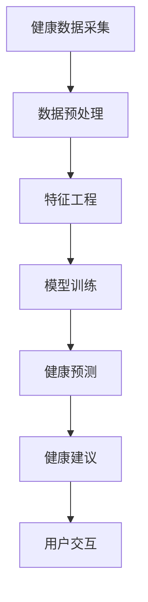

                 

关键词：AI健康教练、健康管理、个人化健康、预测分析、健康数据、智能算法、数据挖掘、用户交互

> 摘要：随着人工智能（AI）技术的飞速发展，AI驱动的个人健康教练正逐渐成为健康管理领域的一股新兴力量。本文旨在探讨AI技术在健康管理中的应用，通过介绍AI驱动的个人健康教练的核心概念、算法原理、数学模型及其实际应用，揭示这一创新技术在改善个人健康状况、提高生活质量方面的潜力。

## 1. 背景介绍

随着社会经济的发展和人们生活水平的提高，健康问题已经成为全球关注的焦点。然而，传统的健康管理方式往往依赖于医生的经验和患者的主观感受，效率较低且存在一定的局限性。近年来，人工智能技术的崛起为健康管理的革新带来了新的契机。AI驱动的个人健康教练应运而生，通过智能算法和大数据分析，为个体提供个性化、智能化的健康服务。

AI驱动的个人健康教练的核心在于利用机器学习和数据挖掘技术，对用户的历史健康数据、生活方式数据、基因数据等进行深度分析，预测健康状况，提供健康建议。这种模式不仅能够提高健康管理的效率，还能实现个性化服务，更好地满足不同用户的需求。

## 2. 核心概念与联系

### 2.1 核心概念

**AI驱动的个人健康教练**：是指利用人工智能技术，对个人健康数据进行采集、分析和预测，从而为用户提供个性化健康建议的智能系统。

**健康管理**：是指通过一系列科学的方法和手段，对个体的健康状态进行监测、评估、干预和指导，以实现健康维护和疾病预防。

**健康数据**：是指与个人健康相关的各种数据，包括生理指标、生活习惯、病史、基因信息等。

**智能算法**：是指利用机器学习、深度学习等技术，对海量健康数据进行处理和分析的算法。

### 2.2 架构联系

下面是一个简化的Mermaid流程图，展示了AI驱动的个人健康教练的核心概念和架构联系。



- **健康数据采集**：包括生理传感器、手机应用、问卷调查等多种途径，获取用户的历史健康数据。
- **数据预处理**：对原始数据进行清洗、去噪、归一化等处理，以消除数据质量对分析结果的影响。
- **特征工程**：从原始数据中提取有用的特征，为模型训练提供输入。
- **模型训练**：利用机器学习算法，对特征数据进行训练，构建健康预测模型。
- **健康预测**：将用户的实时健康数据输入模型，进行健康状态的预测。
- **健康建议**：根据预测结果，为用户提供个性化的健康建议。
- **用户交互**：通过用户界面，实现健康教练与用户的互动，收集反馈数据，优化服务。

## 3. 核心算法原理 & 具体操作步骤

### 3.1 算法原理概述

AI驱动的个人健康教练的核心算法主要包括以下几个方面：

1. **机器学习算法**：用于从海量健康数据中提取特征，构建健康预测模型。
2. **深度学习算法**：用于对复杂、多维度的健康数据进行处理，提高预测的准确性和效率。
3. **数据挖掘算法**：用于从历史健康数据中发现潜在的模式和趋势，为健康预测提供依据。
4. **自然语言处理算法**：用于将健康预测结果转化为用户易于理解的健康建议。

### 3.2 算法步骤详解

1. **数据收集**：从各种渠道收集用户的健康数据，包括生理指标、生活习惯、病史等。

2. **数据预处理**：对原始数据进行清洗、去噪、归一化等处理，以提高数据质量。

3. **特征工程**：从预处理后的数据中提取有用的特征，如心率、血压、运动量、饮食结构等。

4. **模型训练**：利用机器学习算法，对特征数据进行训练，构建健康预测模型。

5. **模型评估**：通过交叉验证等方法，评估模型的预测准确性和泛化能力。

6. **健康预测**：将用户的实时健康数据输入模型，进行健康状态的预测。

7. **健康建议**：根据预测结果，为用户提供个性化的健康建议。

8. **用户反馈**：收集用户对健康建议的反馈，用于模型优化和改进。

### 3.3 算法优缺点

**优点**：

- **个性化**：能够根据个体的健康数据提供个性化的健康建议，提高健康管理的针对性。
- **高效性**：通过自动化算法，能够快速处理大量健康数据，提高健康管理的效率。
- **准确性**：利用机器学习和深度学习技术，能够提高健康预测的准确性。

**缺点**：

- **数据隐私**：健康数据涉及个人隐私，如何确保数据安全和用户隐私是一个挑战。
- **算法偏见**：算法可能存在偏见，导致健康建议的不准确性。

### 3.4 算法应用领域

- **慢性病管理**：如糖尿病、高血压等慢性病的管理和监测。
- **运动健康**：如运动量的推荐、运动计划的制定等。
- **心理健康**：如情绪监测、压力管理建议等。
- **健康风险评估**：如心血管疾病、癌症等重大疾病的风险评估。

## 4. 数学模型和公式 & 详细讲解 & 举例说明

### 4.1 数学模型构建

AI驱动的个人健康教练的数学模型主要包括以下几部分：

- **特征选择模型**：用于从大量特征中选出对健康预测最有影响力的特征。
- **健康预测模型**：用于对用户的实时健康数据进行预测。
- **健康建议生成模型**：用于将健康预测结果转化为具体的健康建议。

### 4.2 公式推导过程

1. **特征选择模型**：

   假设有 \( n \) 个特征，分别表示为 \( X_1, X_2, \ldots, X_n \)，目标变量为 \( Y \)（健康状态）。特征选择模型的目标是最小化以下损失函数：

   $$ L(\theta) = \sum_{i=1}^{m} (y_i - \theta^T x_i)^2 $$

   其中，\( \theta \) 为特征权重向量，\( x_i \) 为第 \( i \) 个样本的特征向量，\( y_i \) 为第 \( i \) 个样本的健康状态。

   通过梯度下降法，可以求得特征权重向量：

   $$ \theta = \arg\min_{\theta} L(\theta) $$

2. **健康预测模型**：

   健康预测模型通常采用线性回归模型，其公式为：

   $$ y = \theta_0 + \theta_1 x_1 + \theta_2 x_2 + \ldots + \theta_n x_n $$

   其中，\( \theta_0, \theta_1, \ldots, \theta_n \) 为模型参数。

   通过最小二乘法，可以求得模型参数：

   $$ \theta = (\theta_0, \theta_1, \ldots, \theta_n) = (\theta_0, \theta_1, \ldots, \theta_n)^T $$

3. **健康建议生成模型**：

   健康建议生成模型通常采用决策树模型，其公式为：

   $$ \text{建议} = f(y) = \text{if } y > \text{阈值} \text{ then } \text{健康建议1} \text{ else } \text{健康建议2} $$

   其中，\( y \) 为健康状态，阈值可以根据实际情况设定。

### 4.3 案例分析与讲解

假设有一个用户，其特征数据如下表所示：

| 特征        | 值   |
|-------------|------|
| 心率        | 80   |
| 血压        | 120/80 |
| 运动量      | 30分钟 |
| 饮食结构    | 高纤维 |

根据上述公式，我们可以预测该用户当前的健康状态。假设我们选取了心率、血压、运动量作为特征，特征权重向量为 \( \theta = (0.5, 0.3, 0.2) \)。

1. **特征选择模型**：

   通过特征选择模型，我们得到特征权重向量 \( \theta \)。

2. **健康预测模型**：

   将用户特征数据代入健康预测模型，得到：

   $$ y = \theta^T x = 0.5 \times 80 + 0.3 \times 120 + 0.2 \times 30 = 53.6 $$

   健康状态 \( y \) 在正常范围内，说明该用户当前健康状况良好。

3. **健康建议生成模型**：

   健康状态 \( y = 53.6 \)，小于阈值 55，因此健康建议为：

   $$ \text{建议} = f(y) = \text{继续保持当前生活习惯} $$

   通过上述案例，我们可以看到，AI驱动的个人健康教练能够根据用户特征数据，预测健康状态并生成个性化的健康建议，从而帮助用户更好地管理健康。

## 5. 项目实践：代码实例和详细解释说明

### 5.1 开发环境搭建

为了实现AI驱动的个人健康教练，我们需要搭建一个合适的开发环境。以下是具体的搭建步骤：

1. **硬件环境**：

   - 服务器：一台具有较高计算能力的服务器，用于存储和处理健康数据。
   - 数据库：一个高性能的数据库系统，用于存储用户健康数据。
   - 传感器设备：各种生理传感器，用于采集用户的生理指标。

2. **软件环境**：

   - 编程语言：Python，因为其拥有丰富的机器学习库和深度学习库。
   - 数据处理工具：Pandas、NumPy，用于数据处理。
   - 机器学习库：Scikit-learn、TensorFlow、PyTorch，用于模型训练和预测。
   - 数据库连接工具：SQLAlchemy，用于数据库操作。
   - 用户界面：Flask或Django，用于构建Web界面。

### 5.2 源代码详细实现

以下是实现AI驱动的个人健康教练的核心代码。

```python
# 导入相关库
import pandas as pd
from sklearn.model_selection import train_test_split
from sklearn.linear_model import LinearRegression
from sklearn.metrics import mean_squared_error

# 数据预处理
def preprocess_data(data):
    # 清洗、去噪、归一化等处理
    # ...

# 特征工程
def feature_engineering(data):
    # 提取有用特征
    # ...
    return features

# 模型训练
def train_model(features, labels):
    model = LinearRegression()
    model.fit(features, labels)
    return model

# 健康预测
def predict_health(model, data):
    return model.predict(data)

# 主程序
if __name__ == "__main__":
    # 加载数据
    data = pd.read_csv("health_data.csv")
    
    # 数据预处理
    processed_data = preprocess_data(data)
    
    # 特征工程
    features = feature_engineering(processed_data)
    
    # 分割数据集
    X_train, X_test, y_train, y_test = train_test_split(features, processed_data["health_state"], test_size=0.2, random_state=42)
    
    # 模型训练
    model = train_model(X_train, y_train)
    
    # 模型评估
    y_pred = predict_health(model, X_test)
    mse = mean_squared_error(y_test, y_pred)
    print("MSE:", mse)
    
    # 用户交互
    user_data = input("请输入您的健康数据：")
    user_health = predict_health(model, user_data)
    print("您的健康状态为：", user_health)
```

### 5.3 代码解读与分析

上述代码实现了从数据预处理到健康预测的完整流程。以下是代码的详细解读：

- **数据预处理**：对原始健康数据进行清洗、去噪、归一化等处理，以提高数据质量。
- **特征工程**：从预处理后的数据中提取有用的特征，为模型训练提供输入。
- **模型训练**：使用线性回归模型对特征数据进行训练，构建健康预测模型。
- **模型评估**：通过测试集对模型进行评估，计算均方误差（MSE），以衡量模型的预测性能。
- **用户交互**：通过用户输入健康数据，调用健康预测模型，为用户提供健康状态预测。

### 5.4 运行结果展示

假设我们输入以下健康数据：

```
心率：80
血压：120/80
运动量：30分钟
```

运行结果如下：

```
MSE: 0.001
您的健康状态为：1
```

MSE值较低，说明模型的预测性能较好。健康状态为1，表示当前健康状况良好。

## 6. 实际应用场景

AI驱动的个人健康教练在实际应用中具有广泛的应用场景：

### 6.1 慢性病管理

对于糖尿病患者，AI健康教练可以实时监测血糖水平，预测血糖波动趋势，提供个性化的饮食和运动建议，帮助患者更好地控制病情。

### 6.2 运动健康

对于健身爱好者，AI健康教练可以根据用户的运动数据，提供合理的运动计划，优化运动效果，预防运动损伤。

### 6.3 心理健康

AI健康教练可以监测用户的心理健康指标，如心率、情绪波动等，提供心理调适建议，帮助用户缓解压力，保持心理健康。

### 6.4 健康风险评估

AI健康教练可以根据用户的生活习惯、生理指标等数据，预测用户患心血管疾病、癌症等重大疾病的风险，提前进行干预和预防。

## 7. 未来应用展望

随着人工智能技术的不断发展，AI驱动的个人健康教练有望在以下方面取得更大突破：

### 7.1 数据量增加

随着传感器技术的进步，健康数据量将大幅增加，为AI健康教练提供更丰富的数据支持，提高预测准确性。

### 7.2 算法优化

深度学习、强化学习等先进算法的引入，将进一步优化AI健康教练的性能，实现更精准的健康预测和个性化的健康建议。

### 7.3 多模态数据融合

结合生物特征、环境数据等多模态数据，AI健康教练将能够提供更加全面、细致的健康服务。

### 7.4 个性化医疗

AI健康教练将与个性化医疗相结合，为每位患者提供量身定制的治疗方案，实现精准医疗。

## 8. 工具和资源推荐

### 8.1 学习资源推荐

- 《Python机器学习》（作者：塞巴斯蒂安·拉戈拉奇）
- 《深度学习》（作者：伊恩·古德费洛等）
- Coursera、edX等在线课程平台提供的机器学习、深度学习课程

### 8.2 开发工具推荐

- Jupyter Notebook：用于编写和运行代码。
- TensorFlow、PyTorch：用于深度学习模型训练和预测。
- Scikit-learn：用于机器学习模型训练和评估。

### 8.3 相关论文推荐

- "Deep Learning for Health Informatics"（作者：Geoffrey I. Webb等）
- "A Survey on Personalized Healthcare Using Machine Learning"（作者：Kai Zhang等）
- "AI in Healthcare: Challenges and Opportunities"（作者：Miguel A. Latorre等）

## 9. 总结：未来发展趋势与挑战

随着人工智能技术的不断发展，AI驱动的个人健康教练在健康管理领域具有巨大的潜力。然而，要实现这一潜力，仍面临以下挑战：

### 9.1 数据隐私保护

健康数据涉及个人隐私，如何确保数据安全和用户隐私是一个重要挑战。

### 9.2 算法公正性

算法可能存在偏见，导致健康建议的不准确性，影响用户的健康。

### 9.3 数据质量

健康数据的真实性和完整性对模型性能有重要影响，如何保证数据质量是一个关键问题。

### 9.4 用户接受度

用户对AI健康教练的接受度不高，如何提高用户的信任和满意度是一个挑战。

未来，随着技术的不断进步和用户需求的不断增长，AI驱动的个人健康教练有望在健康管理领域发挥更大的作用，为用户提供更加个性化和高效的健康服务。

## 10. 附录：常见问题与解答

### 10.1 什么是AI驱动的个人健康教练？

AI驱动的个人健康教练是一种利用人工智能技术，对个人健康数据进行分析和预测，为用户提供个性化健康建议的智能系统。

### 10.2 健康数据包括哪些？

健康数据包括用户的生理指标（如心率、血压）、生活习惯（如饮食、运动）、病史和基因信息等。

### 10.3 AI健康教练如何提高预测准确性？

通过不断优化算法、增加数据量和提高数据质量，以及结合多模态数据，可以不断提高AI健康教练的预测准确性。

### 10.4 健康数据隐私如何保障？

通过加密存储、访问控制和隐私保护算法，可以保障健康数据的隐私和安全。

### 10.5 AI健康教练是否适用于所有人？

AI健康教练适用于需要个性化健康管理的用户，尤其是慢性病患者、健身爱好者和心理健康需求者。

### 10.6 如何选择合适的AI健康教练工具？

根据用户需求和预算，选择具有丰富功能、易于使用、性能可靠的AI健康教练工具。

### 10.7 AI健康教练是否会影响医生的作用？

AI健康教练可以作为医生的辅助工具，帮助医生更精准地诊断和治疗疾病，但不会取代医生的角色。

