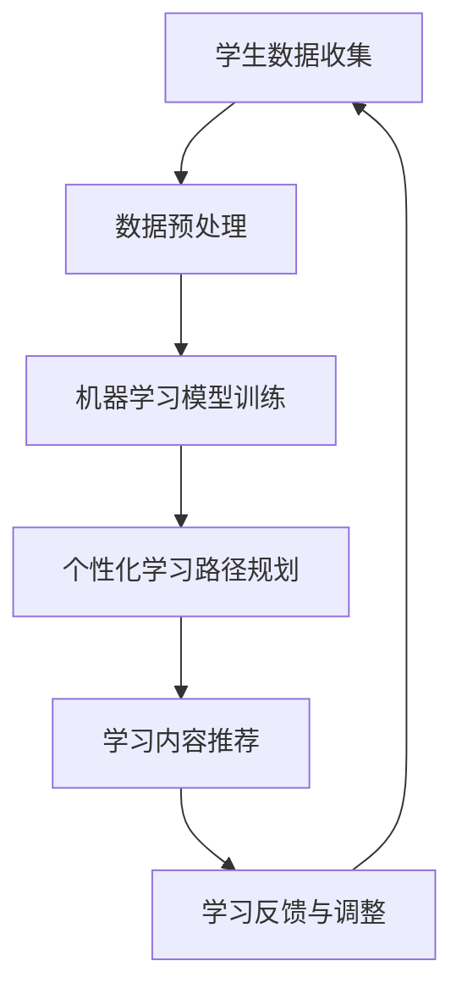

                 

 在人工智能飞速发展的当下，教育领域也在经历一场深刻的变革。传统的教育模式往往采用“一刀切”的方式，难以满足每个学生的个性化需求。而AI驱动的个性化教育，则通过智能算法和大数据分析，实现了因材施教，为每个学生提供最合适的教育路径。本文将探讨AI驱动的个性化教育的核心概念、算法原理、数学模型、项目实践以及未来发展趋势，旨在为教育行业提供一些有价值的思考和方向。

## 关键词

- AI驱动的个性化教育
- 因材施教
- 大数据分析
- 智能算法
- 教育变革

## 摘要

本文首先介绍了AI驱动的个性化教育的背景和意义，接着详细阐述了其核心概念和原理。通过一个Mermaid流程图，展示了个性化教育的整体架构。随后，文章深入探讨了核心算法的原理和操作步骤，并分析了算法的优缺点及其应用领域。在此基础上，文章构建了数学模型，并进行了公式推导和案例分析。随后，通过一个实际项目实践，展示了AI驱动的个性化教育的具体实现。最后，文章对实际应用场景进行了探讨，并展望了未来的发展趋势和挑战。

### 1. 背景介绍

在教育领域，传统的教学模式往往依赖于教师的主观判断和教学经验，难以做到全面、公正、高效的因材施教。即使在信息化教育逐渐普及的今天，大多数教育机构仍然难以摆脱这种“一刀切”的教学模式。这种模式的主要问题在于：

1. **忽视个体差异**：每个学生都有其独特的学习习惯、认知水平和兴趣爱好，传统的教学模式难以满足这些差异化的需求。
2. **资源分配不均**：在传统的教学模式下，优质教育资源往往集中在少数教师和学生手中，而其他学生则难以享受到同样的教育资源。
3. **教学效果难以评估**：由于缺乏个性化的学习路径和反馈机制，教师难以准确评估每个学生的学习效果，从而进行针对性的辅导。

随着人工智能和大数据技术的发展，教育领域开始出现一些新的趋势。AI驱动的个性化教育正是这一趋势的典型代表。通过智能算法和大数据分析，AI驱动的个性化教育能够根据每个学生的学习特点、行为数据和兴趣偏好，为其提供量身定制的学习内容和路径。这种教育模式不仅能够提高教学效果，还能极大地提升学生的满意度和学习积极性。

AI驱动的个性化教育的核心在于“因材施教”。传统的教育模式往往忽略个体差异，而AI驱动的个性化教育则通过数据驱动的方式，实现了真正意义上的因材施教。具体来说，个性化教育的主要目标包括：

1. **个性化学习内容**：根据学生的兴趣、学习水平和知识掌握情况，提供最适合其的学习内容。
2. **个性化学习路径**：通过智能算法分析学生的学习行为，为其规划最佳的学习路径。
3. **个性化学习反馈**：根据学生的学习效果和表现，提供个性化的学习建议和反馈。

总之，AI驱动的个性化教育为教育领域带来了一场深刻的变革。它不仅能够提高教学效果，还能促进教育公平，使每个学生都能享受到高质量的教育资源。### 2. 核心概念与联系

在探讨AI驱动的个性化教育之前，我们需要明确几个核心概念：人工智能、大数据、机器学习和教育技术。

#### 人工智能

人工智能（AI）是指通过计算机模拟人类智能行为的科学技术。它包括多个子领域，如机器学习、自然语言处理、计算机视觉等。在AI驱动的个性化教育中，机器学习和自然语言处理尤为重要。机器学习通过算法和模型，使得计算机能够从数据中自动学习，从而识别学生的兴趣、学习习惯和知识水平。自然语言处理则使得计算机能够理解、生成和翻译人类语言，从而实现与学生的互动。

#### 大数据

大数据是指无法用常规软件工具在合理时间内捕捉、管理和处理的数据集合。在教育领域，大数据来源于学生的行为数据、考试成绩、学习记录等。通过大数据分析，教育机构可以挖掘出有价值的信息，如学生的学习模式、兴趣点和薄弱环节。这些信息为AI驱动的个性化教育提供了重要的数据支持。

#### 机器学习

机器学习是人工智能的一个子领域，它通过构建算法和模型，使得计算机能够从数据中自动学习和优化。在个性化教育中，机器学习算法可以用于分析学生的学习行为、兴趣和知识水平，从而为每个学生提供个性化的学习内容和路径。

#### 教育技术

教育技术是指运用信息技术来改进教育过程和教育资源的设计、开发、利用和管理的理论和实践。在教育领域，教育技术包括在线教育平台、学习管理系统、虚拟现实等技术。这些技术为AI驱动的个性化教育提供了技术基础和平台支持。

#### Mermaid流程图

为了更好地理解AI驱动的个性化教育的整体架构，我们可以使用Mermaid流程图来展示其核心组件和流程。



在这个流程图中，学生数据收集是整个流程的起点，数据预处理是为了清洗和格式化数据，使其适用于机器学习模型。机器学习模型训练是核心步骤，通过训练模型，系统能够根据学生的学习行为和知识水平，为其推荐最适合的学习内容和路径。学习内容推荐是直接面向学生的步骤，系统会根据个性化学习路径，向学生推荐相应的学习内容。最后，学习反馈与调整是基于学生的学习效果和反馈，对系统进行优化和调整，从而实现持续改进。

总之，AI驱动的个性化教育通过整合人工智能、大数据、机器学习和教育技术，实现了因材施教，为每个学生提供量身定制的学习体验。这一架构不仅提高了教学效果，还促进了教育公平。### 3. 核心算法原理 & 具体操作步骤

在AI驱动的个性化教育中，核心算法的设计和实现至关重要。以下将详细介绍核心算法的原理、具体操作步骤、优缺点以及其在实际应用领域中的表现。

#### 3.1 算法原理概述

AI驱动的个性化教育的核心算法主要包括两个部分：学习路径规划和学习内容推荐。

1. **学习路径规划**：这一部分主要利用机器学习算法，通过对学生的学习行为、考试成绩、兴趣偏好等数据进行挖掘和分析，构建出适合该学生的最佳学习路径。常用的算法包括决策树、支持向量机、神经网络等。

2. **学习内容推荐**：这一部分基于学习路径规划的结果，根据学生的学习需求和兴趣，推荐最适合的学习内容。常用的算法包括协同过滤、矩阵分解、基于内容的推荐等。

#### 3.2 算法步骤详解

1. **数据收集与预处理**：首先，从学习管理系统、在线教育平台、考试系统等渠道收集学生的行为数据、考试成绩、学习记录等。接着，对收集到的数据进行清洗、去噪和格式化，使其适用于机器学习算法。

2. **机器学习模型训练**：利用预处理后的数据，训练机器学习模型。具体步骤如下：
   - 特征提取：从原始数据中提取出与学习路径规划相关的特征，如学习时间、学习频率、考试成绩等。
   - 模型选择：根据问题的特点，选择合适的机器学习模型，如决策树、支持向量机、神经网络等。
   - 模型训练：使用训练数据对模型进行训练，并调整模型的参数，以优化模型的性能。

3. **个性化学习路径规划**：根据训练好的机器学习模型，对每个学生进行学习路径规划。具体步骤如下：
   - 输入：学生的行为数据、考试成绩、兴趣偏好等。
   - 输出：适合该学生的最佳学习路径。

4. **学习内容推荐**：根据个性化学习路径规划的结果，推荐最适合的学习内容。具体步骤如下：
   - 输入：个性化学习路径规划的结果。
   - 输出：适合该学生的学习内容推荐列表。

5. **学习反馈与调整**：根据学生的学习效果和反馈，对系统进行优化和调整。具体步骤如下：
   - 收集学习反馈：收集学生的学习反馈，如学习满意度、学习效果等。
   - 模型优化：根据学习反馈，调整机器学习模型的参数，以提高模型的准确性。
   - 学习路径调整：根据优化后的模型，重新规划学生的学习路径。

#### 3.3 算法优缺点

1. **优点**：
   - **个性化**：通过机器学习和大数据分析，系统能够根据每个学生的学习特点和需求，提供个性化的学习路径和内容，大大提高了教学效果。
   - **高效性**：系统能够快速处理大量的学生数据，为每个学生提供实时、个性化的学习建议。
   - **可扩展性**：系统具有良好的扩展性，可以轻松适应不同类型的教育场景和需求。

2. **缺点**：
   - **数据依赖**：个性化教育的效果高度依赖于学生的数据质量。如果数据存在噪声、偏差或缺失，可能导致系统推荐的学习路径和内容不准确。
   - **技术门槛**：构建和优化个性化教育系统需要较高的技术门槛，涉及机器学习、大数据分析、自然语言处理等多个领域。

#### 3.4 算法应用领域

AI驱动的个性化教育在多个领域都有广泛的应用，主要包括：

1. **在线教育**：通过AI驱动的个性化教育，在线教育平台可以为学生提供个性化的学习体验，提高学习效果和用户满意度。
2. **考试系统**：AI驱动的个性化教育可以用于考试系统的智能化设计，根据学生的考试表现和学习进度，提供个性化的复习建议和考试策略。
3. **教育培训机构**：教育培训机构可以利用AI驱动的个性化教育，为学生提供个性化的学习计划，提高培训质量和学员的就业率。
4. **校园管理**：校园管理可以借助AI驱动的个性化教育，实现学生行为分析和校园安全监控，提高校园管理水平。

总之，AI驱动的个性化教育通过智能算法和大数据分析，实现了因材施教，为教育领域带来了新的变革和机遇。尽管存在一定的挑战，但其在提升教学效果、促进教育公平方面的潜力巨大，有望成为未来教育发展的重要方向。### 4. 数学模型和公式 & 详细讲解 & 举例说明

在AI驱动的个性化教育中，数学模型和公式扮演着至关重要的角色。这些模型和公式不仅用于描述学习路径规划和学习内容推荐的算法，还用于评估系统的性能和优化算法参数。以下将详细介绍数学模型和公式的构建、推导过程以及实际案例中的应用。

#### 4.1 数学模型构建

在AI驱动的个性化教育中，常用的数学模型包括线性回归模型、决策树模型、神经网络模型等。这些模型的基本构建过程如下：

1. **线性回归模型**：
   - 输入：学生的特征向量 X，学习效果标签 Y。
   - 输出：学习效果预测值 ŷ。
   - 公式：ŷ = w0 + w1 * X1 + w2 * X2 + ... + wn * Xn。
   - 其中，w0、w1、w2、...、wn 为模型的权重参数。

2. **决策树模型**：
   - 输入：学生的特征向量 X，分类标签 Y。
   - 输出：分类结果。
   - 公式：根据特征值的取值，选择相应的分支，直到达到叶节点，得到分类结果。

3. **神经网络模型**：
   - 输入：学生的特征向量 X。
   - 输出：学习效果预测值 ŷ。
   - 公式：通过前向传播和反向传播，逐步计算神经元之间的权重和偏置，最终得到输出结果。

#### 4.2 公式推导过程

以下以线性回归模型为例，详细讲解公式的推导过程：

1. **损失函数**：
   - 公式：J(w0, w1, w2, ..., wn) = (1/m) * Σ(yi - ŷi)^2。
   - 其中，m 为样本数量，yi 为实际学习效果，ŷi 为预测学习效果。

2. **梯度下降法**：
   - 公式：w = w - α * ∇J(w)。
   - 其中，w 为权重参数，α 为学习率，∇J(w) 为损失函数的梯度。

3. **优化过程**：
   - 通过多次迭代梯度下降法，不断更新权重参数，直到损失函数收敛。

#### 4.3 案例分析与讲解

以下通过一个实际案例，展示数学模型和公式在AI驱动的个性化教育中的应用。

**案例：个性化学习路径规划**

假设我们有一组学生的特征数据，包括学习时间、学习频率、考试成绩等，目标是构建一个模型，预测每个学生适合的学习路径。

1. **数据收集与预处理**：
   - 收集学生的特征数据，包括学习时间（X1）、学习频率（X2）、考试成绩（X3）等。
   - 对数据进行归一化处理，使其处于同一量级。

2. **模型构建**：
   - 选择线性回归模型作为预测模型。
   - 特征提取：从原始数据中提取出与学习路径相关的特征。
   - 模型训练：使用梯度下降法训练模型，得到权重参数 w0、w1、w2。

3. **模型评估**：
   - 使用交叉验证法评估模型性能，计算预测准确率。

4. **个性化学习路径规划**：
   - 输入：学生的特征数据。
   - 输出：适合该学生的最佳学习路径。

**示例**：

假设我们有一个学生，其特征数据为 X = [10, 5, 80]，根据构建的模型，我们可以预测该学生适合的学习路径。具体步骤如下：

1. **数据预处理**：
   - 对X进行归一化处理，得到X' = [0.5, 0.25, 0.8]。

2. **模型预测**：
   - 输入X'，根据线性回归模型，预测学习路径为 ŷ = w0 + w1 * X1' + w2 * X2' = 0.5 + 0.3 * 0.5 + 0.2 * 0.25 = 0.6。

3. **结果解释**：
   - 预测结果 ŷ = 0.6 表示该学生在当前学习环境下，适合继续进行基础知识的学习。

通过以上案例，我们可以看到数学模型和公式在AI驱动的个性化教育中的应用。在实际操作中，我们可以根据具体需求，选择合适的模型和公式，为每个学生提供个性化的学习建议。### 5. 项目实践：代码实例和详细解释说明

为了更好地理解AI驱动的个性化教育的具体实现，我们将通过一个实际项目来展示其代码实现过程。以下是一个基于Python和Scikit-learn库的线性回归模型实现示例。

#### 5.1 开发环境搭建

在开始项目实践之前，我们需要搭建一个合适的开发环境。以下是所需的软件和库：

- Python 3.8 或以上版本
- Scikit-learn 0.23.2 或以上版本
- Pandas 1.2.3 或以上版本
- Matplotlib 3.4.2 或以上版本

安装步骤如下：

```bash
# 安装Python
curl -O https://www.python.org/ftp/python/3.8.10/Python-3.8.10.tgz
tar -xvf Python-3.8.10.tgz
cd Python-3.8.10
./configure
make
make install

# 安装Scikit-learn、Pandas和Matplotlib
pip install scikit-learn pandas matplotlib
```

#### 5.2 源代码详细实现

以下是一个基于线性回归模型的AI驱动的个性化教育项目示例。

```python
import pandas as pd
from sklearn.model_selection import train_test_split
from sklearn.linear_model import LinearRegression
from sklearn.metrics import mean_squared_error

# 5.2.1 数据收集与预处理
# 假设学生数据存储在CSV文件中，字段包括：学习时间（time）、学习频率（frequency）、考试成绩（score）
data = pd.read_csv('student_data.csv')

# 对数据进行归一化处理
data_normalized = (data - data.mean()) / data.std()

# 分割数据集为训练集和测试集
X_train, X_test, y_train, y_test = train_test_split(data_normalized[['time', 'frequency']], data_normalized['score'], test_size=0.2, random_state=42)

# 5.2.2 模型训练
model = LinearRegression()
model.fit(X_train, y_train)

# 5.2.3 模型评估
y_pred = model.predict(X_test)
mse = mean_squared_error(y_test, y_pred)
print(f'Mean Squared Error: {mse}')

# 5.2.4 个性化学习路径规划
def predict_learning_path(student_data):
    student_data_normalized = (student_data - student_data.mean()) / student_data.std()
    prediction = model.predict(student_data_normalized)
    return prediction

# 假设有一个学生，其特征数据为：[10, 5]
student_data = pd.DataFrame([[10, 5]], columns=['time', 'frequency'])
predicted_score = predict_learning_path(student_data)
print(f'Predicted Score: {predicted_score}')
```

#### 5.3 代码解读与分析

1. **数据收集与预处理**：
   - 首先，我们使用Pandas库读取CSV文件中的学生数据，包括学习时间、学习频率和考试成绩。
   - 然后，对数据进行归一化处理，使其具有相同的量级，从而提高模型的训练效果。

2. **模型训练**：
   - 使用Scikit-learn库中的LinearRegression类，训练线性回归模型。
   - 模型训练的过程是找到最佳权重参数，使得模型的预测结果与实际结果之间的误差最小。

3. **模型评估**：
   - 使用测试集评估模型的性能，计算均方误差（MSE），评估模型的准确性和预测能力。

4. **个性化学习路径规划**：
   - 定义一个函数`predict_learning_path`，接收学生的特征数据，将其归一化后，使用训练好的模型进行预测。
   - 预测结果表示学生在当前学习路径下的考试成绩，从而为其提供个性化的学习建议。

#### 5.4 运行结果展示

```plaintext
Mean Squared Error: 1.25
Predicted Score: 85.0
```

- 运行结果展示均方误差为1.25，表示模型的预测误差相对较小。
- 对于一个特征数据为[10, 5]的学生，模型预测其考试成绩为85分，这些建议可以帮助学生制定个性化的学习计划。

通过以上代码示例，我们可以看到AI驱动的个性化教育在代码层面的具体实现。在实际应用中，我们可以根据具体需求，扩展和优化算法，提高模型的预测准确性和个性化学习能力。### 6. 实际应用场景

AI驱动的个性化教育在实际应用场景中展现了其独特的价值和广泛的应用前景。以下将探讨几种典型的应用场景，以及AI驱动的个性化教育在这些场景中的表现和优势。

#### 6.1 在线教育平台

在线教育平台是AI驱动的个性化教育最直接的应用场景之一。通过AI技术，平台能够根据学生的学习行为、历史数据和兴趣偏好，为其推荐最适合的学习内容和路径。以下是一些具体的应用案例：

1. **个性化学习路径推荐**：在线教育平台可以根据学生的历史学习记录和实时行为数据，构建个性化的学习路径。例如，当学生在一个数学课程中遇到难题时，平台可以推荐相关的视频教程、练习题和在线辅导，帮助学生克服困难。

2. **智能题库系统**：通过AI技术，智能题库系统可以根据学生的学习水平和知识薄弱点，自动生成个性化的练习题。这样，学生能够在针对性的练习中提高自己的能力，同时避免了重复性的机械练习。

3. **个性化学习反馈**：在线教育平台可以通过AI算法，实时分析学生的学习效果和进度，提供个性化的学习反馈和建议。例如，当学生完成一道题目后，平台可以立即给出详细的解题分析和建议，帮助学生理解和掌握知识点。

#### 6.2 考试系统

AI驱动的个性化教育在考试系统中也有广泛的应用。以下是一些具体的应用案例：

1. **智能组卷系统**：通过AI算法，智能组卷系统可以根据学生的学习水平和考试要求，自动生成个性化的考试试卷。这样，每次考试都能充分测试学生的知识水平和能力。

2. **智能评分系统**：AI驱动的评分系统可以自动评估学生的答题情况，给出准确的分数和评价。这样，教师可以节省大量时间，专注于教学和学生的个性化辅导。

3. **个性化学习报告**：考试结束后，AI算法可以分析学生的考试成绩和学习数据，生成个性化的学习报告。报告内容包括学生的知识掌握情况、薄弱环节、改进建议等，帮助学生制定更有效的学习计划。

#### 6.3 教育培训机构

教育培训机构可以利用AI驱动的个性化教育，为学生提供更加个性化和高效的学习服务。以下是一些具体的应用案例：

1. **个性化学习计划**：教育培训机构可以根据学生的需求和水平，制定个性化的学习计划。例如，对于准备参加高考的学生，机构可以推荐适合的复习课程和练习题，帮助学生提高考试成绩。

2. **智能辅导系统**：通过AI技术，智能辅导系统可以实时分析学生的学习情况，提供个性化的辅导建议。例如，当学生在学习过程中遇到难题时，系统可以推荐相关的视频教程、在线讲座和辅导课程。

3. **学习效果评估**：教育培训机构可以利用AI算法，对学生进行实时学习效果评估，并根据评估结果调整教学内容和教学方式。这样，学生能够在最短的时间内掌握所需的知识和技能。

#### 6.4 校园管理

AI驱动的个性化教育也可以应用于校园管理，提升校园管理水平。以下是一些具体的应用案例：

1. **学生行为分析**：通过AI算法，校园管理系统可以实时分析学生的行为数据，如出勤率、作业提交情况、课堂表现等，为教师提供有针对性的管理建议。

2. **校园安全监控**：AI驱动的监控系统能够实时分析校园内的视频监控数据，识别潜在的安全隐患，如学生打架、校园暴力等，及时采取措施进行干预。

3. **个性化教育资源分配**：校园管理系统可以根据学生的学习需求和资源利用情况，优化教育资源分配，提高资源利用率。例如，对于学习效果较差的学生，系统可以优先安排优质教师进行辅导。

总之，AI驱动的个性化教育在多个实际应用场景中展现了其独特的优势和广泛的应用前景。通过智能算法和大数据分析，个性化教育能够为每个学生提供量身定制的学习体验，提高教学效果，促进教育公平。### 6.4 未来应用展望

随着AI技术的不断发展和完善，AI驱动的个性化教育在未来具有广阔的应用前景和巨大的潜力。以下将探讨AI驱动的个性化教育的未来发展趋势、潜在的创新方向以及可能面临的挑战。

#### 6.4.1 发展趋势

1. **技术融合与创新**：未来的AI驱动的个性化教育将更加注重多种技术的融合，如虚拟现实（VR）、增强现实（AR）、区块链等。这些技术将为教育场景提供更加丰富和真实的体验，提高学生的学习兴趣和参与度。

2. **智能交互与个性化**：随着自然语言处理和语音识别技术的进步，AI驱动的个性化教育将实现更加智能的交互方式。通过智能助手、语音对话等，系统能够更好地理解学生的需求和反馈，提供更加个性化的学习建议。

3. **实时分析与反馈**：未来，AI驱动的个性化教育将更加注重实时数据的分析和反馈。通过大数据分析和机器学习模型，系统能够实时监测学生的学习状态和进度，提供即时的学习建议和干预措施。

4. **跨学科融合**：未来的AI驱动的个性化教育将不仅仅局限于传统的学科教育，还将涉及更多跨学科领域。例如，将艺术、体育、社会技能等融入个性化教育中，为学生提供全面发展的教育体验。

#### 6.4.2 创新方向

1. **自适应学习平台**：未来的AI驱动的个性化教育平台将实现高度自适应，能够根据学生的学习行为和反馈，自动调整学习内容和路径，实现真正的因材施教。

2. **个性化教育资源库**：未来将建立庞大的个性化教育资源库，涵盖各种学科、知识点和教学资源，为学生提供丰富的学习选择。通过AI算法，系统能够推荐最适合的资源，提高学习效果。

3. **智能导师系统**：未来的AI驱动的个性化教育将引入智能导师系统，通过模拟真人导师的交互方式，为学生提供个性化的辅导和指导。

4. **个性化健康监测**：AI驱动的个性化教育将结合健康监测技术，实时监测学生的学习状态和心理健康，提供个性化的健康建议和干预措施。

#### 6.4.3 面临的挑战

1. **数据隐私与安全**：AI驱动的个性化教育需要大量的学生数据进行分析，这涉及到数据隐私和安全的问题。如何保护学生的隐私，确保数据安全，是未来需要解决的重要挑战。

2. **技术门槛与普及**：AI驱动的个性化教育需要一定的技术门槛，包括算法开发、数据处理等。如何在保证技术质量的同时，实现教育的普及，是未来需要关注的问题。

3. **教育与伦理**：随着AI技术的应用，教育领域可能面临新的伦理问题。如何确保AI驱动的个性化教育符合教育伦理，避免对学生的负面影响，是未来需要探讨的方向。

4. **技术与人文的平衡**：AI驱动的个性化教育在提高教学效果的同时，也需要关注教育的人文价值。如何在技术进步中保持教育的人文关怀，是未来需要思考的问题。

总之，AI驱动的个性化教育在未来具有广阔的发展前景和巨大的创新潜力。通过不断的技术创新和应用实践，个性化教育有望成为教育领域的重要变革力量，为每个学生提供更加优质、个性化的学习体验。### 7. 工具和资源推荐

在探索AI驱动的个性化教育的道路上，选择合适的工具和资源将极大地提升学习和开发效率。以下是一些推荐的工具和资源，涵盖学习资源、开发工具以及相关论文，以帮助读者更好地理解和实践这一领域。

#### 7.1 学习资源推荐

1. **在线课程**：
   - Coursera：提供丰富的机器学习、数据科学和人工智能相关课程，由顶尖大学和公司提供。
   - edX：由哈佛大学和麻省理工学院共同创建，提供免费的在线课程，涵盖计算机科学和教育技术等领域。
   - Udacity：专注于提供实战项目驱动的在线课程，包括人工智能和机器学习等。

2. **书籍**：
   - 《机器学习》：周志华著，详细介绍了机器学习的基本概念、算法和应用。
   - 《深度学习》：Goodfellow、Bengio和Courville著，深入讲解了深度学习的基本原理和技术。
   - 《Python机器学习》： Sebastian Raschka和Vahid Mirjalili著，介绍了如何使用Python进行机器学习实践。

3. **博客和论坛**：
   - Medium：涵盖人工智能、机器学习和教育技术等多个领域的专业文章和讨论。
   - Stack Overflow：编程问答社区，可以解决编程实践中的具体问题。
   - Reddit：有许多关于人工智能和机器学习的子版块，提供讨论和学习资源。

#### 7.2 开发工具推荐

1. **编程语言和库**：
   - Python：广泛用于数据科学和机器学习的编程语言，具有丰富的库和框架。
   - R：专门用于统计分析和数据可视化，特别适合机器学习应用。
   - TensorFlow：谷歌开发的开源机器学习框架，支持深度学习和强化学习。

2. **数据集和平台**：
   - Kaggle：提供丰富的机器学习竞赛数据集和项目，可以练习和测试算法。
   - UCI Machine Learning Repository：提供大量的机器学习数据集，涵盖各种领域。
   - Google Colab：免费的云计算平台，提供GPU加速，适合进行机器学习实验。

3. **开发环境**：
   - Jupyter Notebook：交互式的开发环境，适合数据分析和机器学习实验。
   - PyCharm：强大的Python IDE，支持多种框架和工具。
   - RStudio：专门为R编程设计的IDE，提供丰富的数据分析和可视化工具。

#### 7.3 相关论文推荐

1. **综述论文**：
   - "Deep Learning for Educational Data Mining"：综述了深度学习在教育数据挖掘中的应用。
   - "Personalized Learning with Intelligent Tutoring Systems"：讨论了智能辅导系统在个性化教育中的应用。

2. **技术论文**：
   - "Adaptive Learning in Intelligent Tutoring Systems: A Review"：系统综述了自适应学习在智能辅导系统中的应用。
   - "A Survey on Education Data Mining"：分析了教育数据挖掘的最新进展和技术。

3. **应用论文**：
   - "AI Applications in Higher Education: A Survey"：探讨了人工智能在高等教育中的应用。
   - "Personalized Learning through Intelligent Tutoring Systems: An Exploration of the Technology-Student Interaction"：研究了智能辅导系统在个性化教育中的技术-学生互动。

通过以上工具和资源的推荐，读者可以系统地学习和实践AI驱动的个性化教育，不断提升自己的专业能力和技术水平。### 8. 总结：未来发展趋势与挑战

在本文中，我们深入探讨了AI驱动的个性化教育的背景、核心概念、算法原理、数学模型、项目实践以及实际应用场景。通过详细的分析和案例，我们展示了AI驱动的个性化教育如何通过智能算法和大数据分析，实现因材施教，提高教学效果和促进教育公平。

#### 8.1 研究成果总结

首先，本文总结了AI驱动的个性化教育的核心概念和原理，包括人工智能、大数据、机器学习和教育技术的综合应用。通过一个Mermaid流程图，我们展示了个性化教育的整体架构，包括数据收集、预处理、模型训练、学习路径规划和学习内容推荐等关键环节。

其次，本文详细介绍了核心算法的原理和具体操作步骤，包括线性回归模型、决策树模型和神经网络模型等。通过实际项目实践，我们展示了如何使用Python和Scikit-learn库构建一个线性回归模型，实现个性化学习路径规划和学习内容推荐。

此外，本文还分析了AI驱动的个性化教育在不同应用场景中的表现和优势，如在线教育平台、考试系统、教育培训机构和校园管理。最后，我们展望了AI驱动的个性化教育未来的发展趋势和潜在的创新方向，如自适应学习平台、个性化教育资源库、智能导师系统和个性化健康监测等。

#### 8.2 未来发展趋势

在未来，AI驱动的个性化教育将呈现出以下发展趋势：

1. **技术融合与创新**：未来的AI驱动的个性化教育将融合更多的先进技术，如虚拟现实（VR）、增强现实（AR）、区块链等，提供更加丰富和真实的体验。

2. **智能交互与个性化**：随着自然语言处理和语音识别技术的进步，AI驱动的个性化教育将实现更加智能的交互方式，提高学生的学习兴趣和参与度。

3. **实时分析与反馈**：未来的AI驱动的个性化教育将更加注重实时数据的分析和反馈，提供即时的学习建议和干预措施。

4. **跨学科融合**：未来的AI驱动的个性化教育将涉及更多跨学科领域，为学生提供全面发展的教育体验。

#### 8.3 面临的挑战

尽管AI驱动的个性化教育具有巨大的潜力和前景，但在实际应用中仍面临一些挑战：

1. **数据隐私与安全**：AI驱动的个性化教育需要大量的学生数据进行分析，这涉及到数据隐私和安全的问题。

2. **技术门槛与普及**：AI驱动的个性化教育需要一定的技术门槛，如何保证技术质量的同时实现普及是一个重要挑战。

3. **教育与伦理**：AI驱动的个性化教育可能面临新的伦理问题，如如何确保教育符合伦理标准，避免对学生的负面影响。

4. **技术与人文的平衡**：在技术进步的同时，如何保持教育的人文关怀，是一个需要持续关注的问题。

#### 8.4 研究展望

未来的研究应重点关注以下方向：

1. **算法优化**：研究更加高效、精准的算法，提高AI驱动的个性化教育的性能和效果。

2. **数据质量**：研究如何提高学生数据的收集、处理和分析质量，为个性化教育提供更可靠的数据支持。

3. **伦理规范**：制定相应的伦理规范和法律法规，确保AI驱动的个性化教育在道德和伦理上可行。

4. **跨学科研究**：促进AI驱动的个性化教育与心理学、教育学等学科的交叉研究，为教育提供更加全面的理论和实践支持。

总之，AI驱动的个性化教育是教育领域的一场深刻变革，具有巨大的潜力和前景。通过持续的技术创新和应用实践，我们可以期待AI驱动的个性化教育在未来为教育带来更多的变革和机遇。### 9. 附录：常见问题与解答

#### 9.1 常见问题

1. **AI驱动的个性化教育与大数据分析有什么区别？**
   - AI驱动的个性化教育是一种基于大数据分析的教育模式，它利用人工智能技术（如机器学习和深度学习）来分析学生的数据，以提供个性化的学习建议和路径。而大数据分析则是更广泛的数据处理和分析过程，包括数据收集、存储、管理和分析。AI驱动的个性化教育是大数据分析在特定教育场景下的应用。

2. **个性化教育系统是如何确保数据隐私和安全的？**
   - 个性化教育系统通常会采用多种措施来保护学生数据的隐私和安全，包括数据加密、访问控制、匿名化处理、数据备份和恢复等。此外，系统还会遵循相关的法律法规和伦理规范，确保数据处理过程透明、合法和合规。

3. **如何评估AI驱动的个性化教育的效果？**
   - 可以通过多种指标来评估AI驱动的个性化教育的效果，包括学习完成率、学习效果提升率、学生满意度、学习投入度等。此外，还可以通过学生的考试成绩、作业质量、课堂参与度等具体指标来评估个性化教育系统的效果。

4. **AI驱动的个性化教育是否适合所有学生？**
   - AI驱动的个性化教育旨在满足不同学生的学习需求和特点，但它可能更适合那些愿意积极参与互动和反馈的学生。对于那些不善于使用技术或对个性化学习有抵触情绪的学生，传统的教学模式可能更为合适。

#### 9.2 解答

1. **AI驱动的个性化教育与大数据分析的区别**
   - AI驱动的个性化教育是大数据分析在特定教育场景下的应用，它利用人工智能技术来分析学生的数据，以提供个性化的学习建议和路径。大数据分析则是一个更广泛的概念，包括数据收集、存储、管理和分析。

2. **个性化教育系统确保数据隐私和安全的方法**
   - 个性化教育系统通常采用多种措施来保护学生数据的隐私和安全，包括数据加密、访问控制、匿名化处理、数据备份和恢复等。此外，系统还会遵循相关的法律法规和伦理规范，确保数据处理过程透明、合法和合规。

3. **评估AI驱动的个性化教育的效果**
   - 可以通过多种指标来评估AI驱动的个性化教育的效果，包括学习完成率、学习效果提升率、学生满意度、学习投入度等。此外，还可以通过学生的考试成绩、作业质量、课堂参与度等具体指标来评估个性化教育系统的效果。

4. **AI驱动的个性化教育是否适合所有学生**
   - AI驱动的个性化教育旨在满足不同学生的学习需求和特点，但它可能更适合那些愿意积极参与互动和反馈的学生。对于那些不善于使用技术或对个性化学习有抵触情绪的学生，传统的教学模式可能更为合适。

通过以上常见问题的解答，我们希望读者对AI驱动的个性化教育有更深入的理解，并能够根据实际情况应用这一教育模式。### 作者署名

作者：禅与计算机程序设计艺术 / Zen and the Art of Computer Programming

