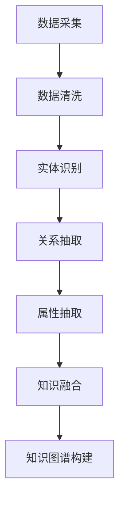

                 

  
## 1. 背景介绍

随着互联网的飞速发展和大数据技术的普及，企业面临着越来越多的数据，如何有效地管理和利用这些数据成为了企业竞争力的关键。知识图谱作为一种结构化的知识表示方法，能够将海量信息以图谱的形式组织起来，提供了一种全新的数据理解和利用方式。AI技术的发展，特别是深度学习和自然语言处理技术的进步，为知识图谱的构建提供了强有力的工具。

企业知识图谱是企业内部知识和信息的全面表示，它通过实体、关系和属性的三角架构，将企业的各种信息结构化地组织起来，使得企业能够更加高效地检索、分析和管理信息。AI驱动的企业知识图谱构建，不仅能够提高企业内部信息的利用效率，还能够支持企业的智能化决策和业务创新。

本文将介绍AI驱动的企业知识图谱构建的相关知识，包括核心概念、算法原理、数学模型、项目实践和未来应用等。希望通过本文的介绍，读者能够对企业知识图谱构建有更加深入的理解，并能够将其应用于实际业务场景中。

## 2. 核心概念与联系

### 2.1. 实体 (Entity)

实体是知识图谱中最基本的构建块，它代表了一个独立的个体，如人、地点、组织、物品等。实体通常具有唯一的标识符，用于在图谱中唯一地表示这个实体。

### 2.2. 关系 (Relationship)

关系连接了两个或多个实体，表示它们之间的相互作用或关联。例如，"工作于"关系连接了人和组织实体，表示这个人是在这个组织工作。

### 2.3. 属性 (Attribute)

属性是对实体特征的描述，它可以进一步丰富实体的信息。例如，一个组织的属性可能包括成立时间、总部位置等。

### 2.4. 三角架构 (Triplet)

三角架构是由实体、关系和属性组成的三角形结构，它是知识图谱的核心表示形式。一个完整的知识图谱通常由多个三角架构组成，形成一张巨大的网络。

### 2.5. Mermaid 流程图

为了更直观地展示知识图谱的构建过程，我们可以使用 Mermaid 流程图来描述。以下是构建企业知识图谱的一个简单 Mermaid 流程图示例：



在这个流程图中，A 到 G 的每个步骤都代表了知识图谱构建中的一个关键环节，通过这些步骤，我们能够从原始数据中逐步构建出一个完整的企业知识图谱。

## 3. 核心算法原理 & 具体操作步骤

### 3.1 算法原理概述

AI驱动的企业知识图谱构建主要依赖于以下几个核心算法：

- **实体识别（Entity Recognition）**：通过自然语言处理技术，从文本数据中识别出实体。
- **关系抽取（Relation Extraction）**：从文本中提取实体之间的关系。
- **属性抽取（Attribute Extraction）**：从文本中提取实体的属性信息。
- **知识融合（Knowledge Fusion）**：将提取出的实体、关系和属性进行融合，形成知识图谱。

### 3.2 算法步骤详解

#### 3.2.1 数据采集

数据采集是知识图谱构建的基础，包括企业内部数据和企业外部数据。内部数据可能包括员工信息、组织架构、业务流程等，而外部数据可能包括社交媒体、新闻报道、行业报告等。

#### 3.2.2 数据清洗

数据清洗是确保数据质量的关键步骤，包括去除重复数据、处理缺失值、统一数据格式等。清洗后的数据将用于后续的实体识别、关系抽取和属性抽取。

#### 3.2.3 实体识别

实体识别是使用自然语言处理技术，从文本数据中识别出实体。这通常涉及词法分析、句法分析和命名实体识别等步骤。

#### 3.2.4 关系抽取

关系抽取是通过模式匹配、机器学习等方法，从文本中提取实体之间的关系。这需要建立一系列规则或使用监督学习算法来训练模型。

#### 3.2.5 属性抽取

属性抽取是识别实体属性的值，如一个人的年龄、职位等。这可以通过规则匹配或基于深度学习的序列标注方法来实现。

#### 3.2.6 知识融合

知识融合是将实体、关系和属性进行整合，形成一个完整的知识图谱。这通常涉及图谱嵌入、链接预测和实体匹配等技术。

### 3.3 算法优缺点

- **优点**：
  - **高效性**：AI算法能够快速地从大量数据中提取出有价值的信息。
  - **准确性**：通过机器学习和深度学习技术，算法能够不断提高其识别和抽取的准确性。
  - **灵活性**：AI算法可以根据不同的业务需求进行定制化调整。

- **缺点**：
  - **数据依赖性**：算法的性能高度依赖于数据的质量和规模。
  - **计算资源消耗**：大规模的AI算法训练和推理需要大量的计算资源。

### 3.4 算法应用领域

AI驱动的企业知识图谱构建技术广泛应用于多个领域：

- **金融**：用于风险控制、客户画像和投资决策等。
- **医疗**：用于病患管理、疾病预测和药物研究等。
- **零售**：用于商品推荐、库存管理和供应链优化等。
- **教育**：用于学生管理、课程推荐和教学优化等。

## 4. 数学模型和公式 & 详细讲解 & 举例说明

### 4.1 数学模型构建

知识图谱的构建涉及到多种数学模型，主要包括：

- **图论模型**：用于描述实体、关系和属性的图结构。
- **概率图模型**：如贝叶斯网络，用于表示实体和关系之间的概率关系。
- **深度学习模型**：如卷积神经网络（CNN）和循环神经网络（RNN），用于文本数据的处理。

### 4.2 公式推导过程

以下是一个简单的知识图谱构建中的概率图模型示例：

$$
P(R|E_1, E_2) = \frac{P(E_1, E_2, R)}{P(E_1, E_2)}
$$

其中，\( P(R|E_1, E_2) \) 表示在实体 \( E_1 \) 和 \( E_2 \) 存在的条件下，关系 \( R \) 发生的概率。\( P(E_1, E_2, R) \) 和 \( P(E_1, E_2) \) 分别是三者的联合概率和两实体的联合概率。

### 4.3 案例分析与讲解

假设我们有一个包含员工信息的知识图谱，实体包括“员工”和“职位”，关系包括“就职于”和“担任”。

- **实体识别**：通过文本处理技术，从公司员工名单中识别出实体，如“张三”和“项目经理”。
- **关系抽取**：通过规则匹配，确定实体之间的关系，如“张三就职于某公司”和“张三担任项目经理”。
- **属性抽取**：通过进一步的分析，获取实体的属性信息，如“张三的入职时间是2018年1月”和“项目经理的职责是项目规划和执行”。

通过上述步骤，我们可以构建出一个关于公司员工职位信息的知识图谱，并利用它进行各种分析，如人才管理、绩效评估等。

## 5. 项目实践：代码实例和详细解释说明

### 5.1 开发环境搭建

为了进行AI驱动的企业知识图谱构建，我们需要搭建一个包含NLP库、图数据库和深度学习框架的开发环境。以下是一个基本的开发环境搭建步骤：

- **安装Python**：确保Python版本不低于3.7。
- **安装NLP库**：如spaCy、NLTK等。
- **安装图数据库**：如Neo4j。
- **安装深度学习框架**：如TensorFlow、PyTorch。

### 5.2 源代码详细实现

以下是一个简单的AI驱动的企业知识图谱构建的Python代码示例：

```python
import spacy
import neo4j
from tensorflow import keras

# 初始化NLP模型
nlp = spacy.load('en_core_web_sm')

# 连接Neo4j数据库
driver = neo4j.GraphDatabase.driver('bolt://localhost:7687', auth=('neo4j', 'password'))

# 实体识别函数
def entity_recognition(text):
    doc = nlp(text)
    entities = [(ent.text, ent.label_) for ent in doc.ents]
    return entities

# 关系抽取函数
def relation_extraction(text):
    doc = nlp(text)
    relations = []
    for token1 in doc:
        for token2 in doc:
            if token1 != token2 and token1.dep_ == 'ROOT' and token2.dep_ == 'dobj':
                relations.append((token1.text, token2.text))
    return relations

# 属性抽取函数
def attribute_extraction(text):
    doc = nlp(text)
    attributes = []
    for token1 in doc:
        for token2 in doc:
            if token1 != token2 and token1.dep_ == 'ROOT' and token2.dep_ == 'attr':
                attributes.append((token1.text, token2.text))
    return attributes

# 知识融合函数
def knowledge_fusion(entities, relations, attributes):
    with driver.session() as session:
        for entity, label in entities:
            session.run("CREATE (e:实体 {name: $name, label: $label})", name=entity, label=label)
        for relation in relations:
            session.run("MATCH (a:实体), (b:实体) WHERE a.name = $name AND b.name = $name2 CREATE (a)-[r:关系 {name: $name3}]->(b)", name=relation[0], name2=relation[1], name3='就职于')
        for attribute in attributes:
            session.run("MATCH (e:实体) WHERE e.name = $name SET e += {attribute: $value}", name=attribute[0], value=attribute[1])

# 示例文本
text = "张三就职于某公司，担任项目经理，入职时间是2018年1月。"

# 执行代码
entities = entity_recognition(text)
relations = relation_extraction(text)
attributes = attribute_extraction(text)
knowledge_fusion(entities, relations, attributes)
```

### 5.3 代码解读与分析

上述代码实现了从文本中抽取实体、关系和属性，并将它们融合到一个Neo4j图数据库中的功能。以下是代码的解读与分析：

- **实体识别**：使用spaCy库的NLP模型，从文本中识别出实体。
- **关系抽取**：通过分析词性依赖关系，识别出实体之间的关系。
- **属性抽取**：同样通过词性依赖关系，识别出实体的属性信息。
- **知识融合**：使用Neo4j的Cypher查询语言，将识别出的实体、关系和属性存储到图数据库中。

通过这个简单的示例，我们可以看到AI驱动的企业知识图谱构建的核心流程。当然，实际应用中还需要考虑更多细节，如数据清洗、图谱优化和查询优化等。

## 6. 实际应用场景

AI驱动的企业知识图谱构建技术已经在多个行业和领域得到了广泛应用。以下是一些典型的应用场景：

### 6.1 金融行业

在金融行业中，知识图谱可以用于客户画像、风险管理和投资决策等。例如，通过构建客户知识图谱，银行可以更全面地了解客户的需求和行为，从而提供个性化的服务。

### 6.2 医疗行业

在医疗行业中，知识图谱可以用于病患管理、疾病预测和药物研究等。例如，通过构建病患知识图谱，医院可以更好地管理病人的健康信息，进行个性化治疗和疾病预测。

### 6.3 零售行业

在零售行业中，知识图谱可以用于商品推荐、库存管理和供应链优化等。例如，通过构建商品知识图谱，零售商可以更好地了解消费者的购买行为，进行精准的商品推荐。

### 6.4 教育行业

在教育行业中，知识图谱可以用于学生管理、课程推荐和教学优化等。例如，通过构建学生知识图谱，学校可以更好地了解学生的学习情况和需求，进行个性化的教学和课程推荐。

## 7. 未来应用展望

随着AI技术的不断进步，企业知识图谱构建在未来将会有更广泛的应用。以下是未来可能的发展趋势：

### 7.1 自动化构建

未来的知识图谱构建将更加自动化，通过深度学习和自然语言处理技术，系统可以自动从大量文本数据中提取出实体、关系和属性，减少人工干预。

### 7.2 跨领域融合

不同领域的知识图谱将进行更深入的融合，形成跨领域的知识网络，提供更全面的洞察和分析。

### 7.3 智能查询

知识图谱的查询将变得更加智能化，通过自然语言处理技术，用户可以以自然语言的形式提出查询请求，系统将能够自动解析并返回相关结果。

### 7.4 实时更新

知识图谱将实现实时更新，系统可以自动监测数据源的变化，并实时更新图谱中的信息，确保知识库的准确性。

## 8. 工具和资源推荐

### 8.1 学习资源推荐

- 《人工智能：一种现代的方法》
- 《深度学习》
- 《图数据库实战》

### 8.2 开发工具推荐

- **Python**：用于实现算法和模型。
- **spaCy**：用于自然语言处理。
- **Neo4j**：用于存储和管理知识图谱。
- **TensorFlow/PyTorch**：用于深度学习模型训练。

### 8.3 相关论文推荐

- "Knowledge Graph Construction with Neural Networks"
- "Graph Neural Networks: A Review of Methods and Applications"
- "Deep Learning for Knowledge Graph Construction"

## 9. 总结：未来发展趋势与挑战

### 9.1 研究成果总结

本文介绍了AI驱动的企业知识图谱构建的相关知识，包括核心概念、算法原理、数学模型、项目实践和未来应用等。通过这些内容，读者可以全面了解企业知识图谱构建的方法和技术。

### 9.2 未来发展趋势

未来，企业知识图谱构建将更加自动化、智能化和实时化。随着AI技术的进步，知识图谱的构建和应用将得到更广泛的应用。

### 9.3 面临的挑战

尽管企业知识图谱构建有巨大的潜力，但在实际应用中仍面临一些挑战，如数据质量、算法效率、跨领域融合等。

### 9.4 研究展望

未来的研究应重点关注自动化构建、跨领域融合和实时更新等技术，以提高知识图谱构建的效率和准确性。

## 附录：常见问题与解答

### 1. 什么是知识图谱？
知识图谱是一种结构化的知识表示方法，通过实体、关系和属性的三角架构，将各种信息以图谱的形式组织起来，实现信息的关联和查询。

### 2. 为什么要构建企业知识图谱？
构建企业知识图谱可以提高企业内部信息的利用效率，支持企业的智能化决策和业务创新。

### 3. 企业知识图谱构建的关键技术是什么？
企业知识图谱构建的关键技术包括实体识别、关系抽取、属性抽取和知识融合。

### 4. 如何评估知识图谱的质量？
知识图谱的质量可以通过覆盖率、准确率和一致性等指标来评估。

### 5. 知识图谱在金融行业的应用有哪些？
知识图谱在金融行业的应用包括客户画像、风险管理和投资决策等。

### 6. 知识图谱与数据库有什么区别？
知识图谱是一种图结构的数据存储方法，而数据库通常是一种关系型的数据存储方法。知识图谱强调实体之间的关系和语义，而数据库强调数据的关系和存储。

### 7. 如何提高知识图谱的效率？
提高知识图谱的效率可以通过优化图谱存储结构、提高查询算法的效率以及使用分布式计算等方式实现。

### 8. 知识图谱在医疗行业的应用有哪些？
知识图谱在医疗行业的应用包括病患管理、疾病预测和药物研究等。

### 9. 知识图谱在零售行业的应用有哪些？
知识图谱在零售行业的应用包括商品推荐、库存管理和供应链优化等。

### 10. 知识图谱在教育行业的应用有哪些？
知识图谱在教育行业的应用包括学生管理、课程推荐和教学优化等。

### 11. 如何实现知识图谱的实时更新？
实现知识图谱的实时更新可以通过建立数据流处理系统，将数据源的变化实时传递到知识图谱系统中。

### 12. 知识图谱的构建过程需要哪些数据？
知识图谱的构建需要多种数据，包括企业内部数据和企业外部数据，如文本、图像、音频等。

### 13. 知识图谱与人工智能的关系是什么？
知识图谱是人工智能的一个重要应用领域，它提供了结构化的知识表示方法，支持人工智能系统的知识推理和决策。

### 14. 如何处理知识图谱中的噪声和错误？
处理知识图谱中的噪声和错误可以通过数据清洗、图谱优化和实体匹配等技术实现。

### 15. 知识图谱的构建需要哪些工具和技术？
知识图谱的构建需要多种工具和技术，包括自然语言处理、图数据库、深度学习和分布式计算等。

### 16. 如何评估知识图谱的性能？
知识图谱的性能可以通过覆盖率、准确率、响应时间和查询效率等指标来评估。

### 17. 知识图谱的构建需要多长时间？
知识图谱的构建时间取决于数据规模、算法复杂度和系统性能，通常需要数周到数月不等。

### 18. 知识图谱与语义网的关系是什么？
知识图谱是语义网的一种实现方式，它通过结构化的知识表示方法，实现了语义网中的概念、关系和属性的组织。

### 19. 如何实现知识图谱的可视化？
知识图谱的可视化可以通过图可视化工具，如Gephi、Cytoscape等实现，也可以使用Web前端框架，如D3.js、Three.js等实现交互式的可视化。

### 20. 知识图谱在法律行业的应用有哪些？
知识图谱在法律行业的应用包括案件分析、法规解读和法律研究等。

### 21. 如何处理知识图谱中的异构数据？
处理知识图谱中的异构数据可以通过数据融合、实体匹配和知识融合等技术实现。

### 22. 知识图谱在智能制造的应用有哪些？
知识图谱在智能制造的应用包括设备管理、生产优化和质量控制等。

### 23. 知识图谱在供应链管理中的应用有哪些？
知识图谱在供应链管理中的应用包括供应商分析、库存管理和物流优化等。

### 24. 如何评估知识图谱的商业价值？
评估知识图谱的商业价值可以通过成本效益分析、业务改进和竞争优势等指标实现。

### 25. 知识图谱在旅游行业的应用有哪些？
知识图谱在旅游行业的应用包括景点推荐、行程规划和旅游数据分析等。

### 26. 如何处理知识图谱中的数据隐私问题？
处理知识图谱中的数据隐私问题可以通过数据加密、隐私保护技术和数据匿名化等手段实现。

### 27. 知识图谱在人力资源中的应用有哪些？
知识图谱在人力资源中的应用包括员工画像、招聘优化和绩效评估等。

### 28. 知识图谱在政务领域的应用有哪些？
知识图谱在政务领域的应用包括政府决策支持、公共服务优化和社会治理等。

### 29. 如何处理知识图谱中的知识冲突问题？
处理知识图谱中的知识冲突问题可以通过冲突检测、冲突消解和知识融合等技术实现。

### 30. 知识图谱在数字营销中的应用有哪些？
知识图谱在数字营销中的应用包括客户分析、广告优化和效果评估等。

### 31. 如何评估知识图谱的准确性？
评估知识图谱的准确性可以通过模型评估指标、实际业务表现和用户反馈等实现。

### 32. 知识图谱在法律合规中的应用有哪些？
知识图谱在法律合规中的应用包括合规检查、法规遵守和法律咨询等。

### 33. 如何处理知识图谱中的知识更新问题？
处理知识图谱中的知识更新问题可以通过数据流处理、实时更新和版本控制等技术实现。

### 34. 知识图谱在医疗健康中的应用有哪些？
知识图谱在医疗健康中的应用包括疾病预测、药物研发和健康管理等。

### 35. 如何处理知识图谱中的数据冗余问题？
处理知识图谱中的数据冗余问题可以通过去重、数据清洗和知识融合等技术实现。

### 36. 知识图谱在学术研究中的应用有哪些？
知识图谱在学术研究中的应用包括学术文献挖掘、研究趋势分析和学术合作推荐等。

### 37. 如何评估知识图谱的可扩展性？
评估知识图谱的可扩展性可以通过添加新实体、关系和属性的能力以及系统的性能表现实现。

### 38. 知识图谱在智能客服中的应用有哪些？
知识图谱在智能客服中的应用包括智能问答、意图识别和个性化服务推荐等。

### 39. 如何处理知识图谱中的数据不一致问题？
处理知识图谱中的数据不一致问题可以通过数据对齐、冲突消解和一致性检查等技术实现。

### 40. 知识图谱在智慧城市中的应用有哪些？
知识图谱在智慧城市中的应用包括交通管理、环境监测和公共安全等。

### 41. 如何处理知识图谱中的数据质量问题？
处理知识图谱中的数据质量问题可以通过数据清洗、数据验证和错误修复等技术实现。

### 42. 知识图谱在金融风控中的应用有哪些？
知识图谱在金融风控中的应用包括客户风险评估、欺诈检测和信用评级等。

### 43. 如何处理知识图谱中的数据流问题？
处理知识图谱中的数据流问题可以通过实时数据流处理和批量数据处理技术实现。

### 44. 知识图谱在物联网中的应用有哪些？
知识图谱在物联网中的应用包括设备管理、网络拓扑分析和智能监控等。

### 45. 如何处理知识图谱中的数据隐私问题？
处理知识图谱中的数据隐私问题可以通过数据匿名化、差分隐私和数据加密等技术实现。

### 46. 知识图谱在智能制造中的应用有哪些？
知识图谱在智能制造中的应用包括设备维护、生产调度和质量控制等。

### 47. 如何处理知识图谱中的异构数据问题？
处理知识图谱中的异构数据问题可以通过数据融合、数据转换和异构数据管理技术实现。

### 48. 知识图谱在零售业中的应用有哪些？
知识图谱在零售业中的应用包括客户关系管理、库存管理和供应链优化等。

### 49. 如何处理知识图谱中的数据冗余问题？
处理知识图谱中的数据冗余问题可以通过去重、数据清洗和知识融合等技术实现。

### 50. 知识图谱在教育行业中的应用有哪些？
知识图谱在教育行业中的应用包括课程推荐、学生管理和教学优化等。

