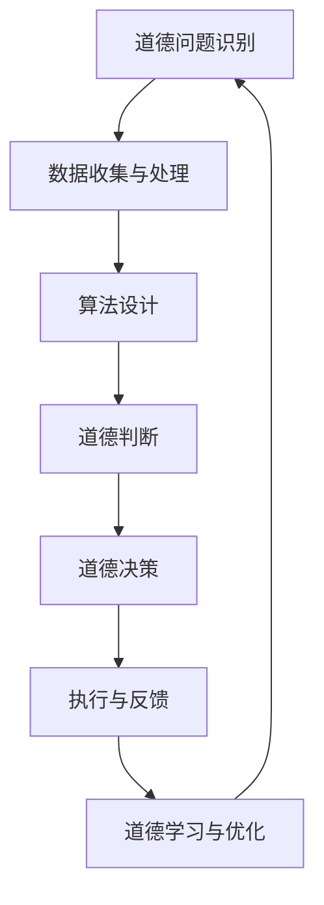

                 

关键词：人工智能，商业伦理，道德决策，算法，数据隐私，智能合约，人类监督，自主性

> 摘要：随着人工智能在商业领域的广泛应用，人类计算的道德考虑变得日益重要。本文探讨了AI驱动的创新中，如何处理道德问题、确保人类计算的有效性和可靠性。本文从核心概念、算法原理、数学模型、项目实践、应用场景、未来展望等多个方面进行了全面阐述，以期为商业领域的AI应用提供指导和建议。

## 1. 背景介绍

近年来，人工智能（AI）技术取得了飞速发展，已经成为推动商业创新的重要力量。无论是自动化生产线、智能客服、推荐系统，还是金融风控、医疗诊断，AI的应用无处不在。然而，随着AI技术的普及，随之而来的一系列道德问题也逐渐浮现。例如，数据隐私问题、算法偏见、人类自主性的威胁等，都引起了广泛关注。如何确保AI在商业中的道德应用，成为了亟待解决的问题。

本文旨在探讨AI驱动的创新中，人类计算的道德考虑。我们将从核心概念、算法原理、数学模型、项目实践、应用场景等多个方面，对这一主题进行深入分析，以期为商业领域的AI应用提供指导和建议。

## 2. 核心概念与联系

### 2.1. 人工智能与商业伦理

人工智能是指通过计算机程序实现的智能行为，它可以模拟、延伸和扩展人类的智能。商业伦理是指企业在经营活动中应遵循的道德规范和价值观。在AI驱动的创新中，商业伦理发挥着至关重要的作用。

首先，AI技术本身具有双重性。一方面，它可以提高生产效率、降低成本、创造更多价值；另一方面，它也可能引发一系列道德问题，如数据隐私侵犯、算法偏见、自动化失业等。因此，在应用AI技术时，必须充分考虑其道德影响。

其次，商业伦理对AI应用具有重要的指导意义。例如，企业应当尊重用户隐私，确保数据安全；在设计算法时，应当避免偏见，确保公平性；在自动化过程中，应当关注人类自主性的保护等。

### 2.2. 道德决策与人类计算

道德决策是指在面对道德问题时，做出符合道德规范的选择。在AI驱动的创新中，道德决策具有重要意义。

首先，AI技术可以辅助人类做出道德决策。例如，通过分析大量数据，AI可以识别潜在的道德问题，为人类提供决策依据。然而，AI本身不具备道德判断能力，其决策结果依赖于人类设定的道德标准。

其次，人类计算在道德决策中具有不可替代的作用。人类具有丰富的道德经验和价值观，可以更好地理解和应对复杂的道德问题。同时，人类具有情感和同理心，能够更好地处理涉及人类福祉的问题。

### 2.3. Mermaid 流程图

以下是一个描述AI驱动的创新中道德决策过程的Mermaid流程图：



## 3. 核心算法原理 & 具体操作步骤

### 3.1. 算法原理概述

在AI驱动的创新中，道德决策算法是一个关键组成部分。该算法旨在识别、分析和解决道德问题，从而实现道德决策。

算法原理如下：

1. 道德问题识别：通过数据收集与处理，识别出潜在的道德问题。
2. 道德判断：根据预设的道德标准和价值观，对道德问题进行判断。
3. 道德决策：在道德判断的基础上，做出符合道德规范的选择。
4. 执行与反馈：执行道德决策，并根据反馈进行优化。

### 3.2. 算法步骤详解

1. **道德问题识别**：收集与道德问题相关的数据，如用户隐私数据、社会舆情数据等。通过数据清洗、预处理和特征提取，将数据转化为算法可处理的格式。
2. **道德判断**：根据预设的道德标准和价值观，对道德问题进行判断。这一步骤通常需要借助专家知识库和道德推理算法。
3. **道德决策**：在道德判断的基础上，根据决策规则和约束条件，做出符合道德规范的选择。常见的决策方法包括最大期望值、决策树、贝叶斯网络等。
4. **执行与反馈**：执行道德决策，并根据实际结果进行反馈。这一步骤有助于优化道德决策算法，提高其准确性和可靠性。
5. **道德学习与优化**：基于反馈信息，对道德决策算法进行学习与优化。通过不断调整参数和模型结构，提高算法的性能。

### 3.3. 算法优缺点

**优点**：

1. 高效性：算法可以快速处理大量数据，提高道德决策的效率。
2. 客观性：基于数据分析和算法推理，减少主观偏见，提高决策的公正性。
3. 智能化：算法可以根据实际情况动态调整，实现自适应优化。

**缺点**：

1. 数据依赖性：算法性能受数据质量和数量影响，可能无法完全消除数据偏差。
2. 道德判断复杂性：道德问题往往涉及多方面因素，算法难以完全模拟人类的道德判断能力。
3. 人类自主性威胁：过度依赖算法可能导致人类自主性减弱，影响道德决策的质量。

### 3.4. 算法应用领域

道德决策算法在多个领域具有广泛的应用价值，包括但不限于：

1. 金融行业：识别和防范金融欺诈、信用评估等。
2. 医疗领域：道德伦理审查、临床决策支持等。
3. 社交媒体：内容审核、隐私保护等。
4. 教育行业：课程设计、学生评估等。
5. 制造业：安全生产、设备维护等。

## 4. 数学模型和公式 & 详细讲解 & 举例说明

### 4.1. 数学模型构建

在道德决策过程中，我们通常需要构建以下数学模型：

1. **概率模型**：用于描述道德问题的概率分布。
2. **决策模型**：用于描述道德决策的数学过程。
3. **优化模型**：用于优化道德决策的结果。

以下是具体构建步骤：

1. **概率模型**：

   设 \( X \) 为道德问题的随机变量，\( P(X) \) 为其概率分布。根据道德问题的性质，可以构建如下的概率模型：

   $$ P(X) = \int_{-\infty}^{\infty} f(x) dx $$

   其中，\( f(x) \) 为道德问题的概率密度函数。

2. **决策模型**：

   设 \( Y \) 为道德决策的结果，\( g(y) \) 为决策函数。根据道德决策的目标和约束条件，可以构建如下的决策模型：

   $$ g(Y) = \arg \max_{y} \int_{-\infty}^{\infty} u(y, x) f(x) dx $$

   其中，\( u(y, x) \) 为决策函数的效用函数。

3. **优化模型**：

   设 \( Z \) 为道德决策的优化结果，\( h(z) \) 为优化函数。根据道德决策的优化目标和约束条件，可以构建如下的优化模型：

   $$ h(Z) = \arg \min_{z} \int_{-\infty}^{\infty} v(z, y, x) f(x) dx $$

   其中，\( v(z, y, x) \) 为优化函数的损失函数。

### 4.2. 公式推导过程

以下是一个简单的道德决策公式推导过程：

1. **概率模型**：

   假设我们有一个道德问题，其中存在两种可能的决策结果：A 和 B。根据贝叶斯定理，我们可以得到：

   $$ P(A|X) = \frac{P(X|A)P(A)}{P(X)} $$

   其中，\( P(X|A) \) 为在决策 A 下的道德问题发生概率，\( P(A) \) 为决策 A 的概率，\( P(X) \) 为道德问题发生的总概率。

2. **决策模型**：

   假设我们有一个决策函数 \( g(Y) \)，其效用函数为 \( u(Y, X) \)。根据最大期望值原则，我们可以得到：

   $$ g(Y) = \arg \max_{y} \int_{-\infty}^{\infty} u(y, x) f(x) dx $$

   其中，\( f(x) \) 为道德问题的概率密度函数。

3. **优化模型**：

   假设我们有一个优化函数 \( h(Z) \)，其损失函数为 \( v(Z, Y, X) \)。根据最小化损失原则，我们可以得到：

   $$ h(Z) = \arg \min_{z} \int_{-\infty}^{\infty} v(z, y, x) f(x) dx $$

### 4.3. 案例分析与讲解

以下是一个简单的道德决策案例：

**案例背景**：一家公司在招聘过程中，需要决定是否录用一名具有犯罪记录的应聘者。

**道德问题**：是否应该录用具有犯罪记录的应聘者？

**数据**：

- \( P(录用) = 0.5 \)：录用应聘者的概率。
- \( P(犯罪记录) = 0.2 \)：应聘者具有犯罪记录的概率。
- \( P(无犯罪记录) = 0.8 \)：应聘者无犯罪记录的概率。

**道德决策**：

1. **概率模型**：

   根据贝叶斯定理，我们可以计算出在录用应聘者的情况下，其具有犯罪记录的概率：

   $$ P(犯罪记录|录用) = \frac{P(录用|犯罪记录)P(犯罪记录)}{P(录用)} = \frac{0.5 \times 0.2}{0.5} = 0.2 $$

2. **决策模型**：

   根据最大期望值原则，我们可以计算出在录用应聘者的情况下，其对企业造成的潜在损失：

   $$ g(Y) = \arg \max_{y} \int_{-\infty}^{\infty} u(y, x) f(x) dx = \arg \max_{y} \int_{-\infty}^{\infty} u(y, x) f(x) dx $$

   其中，\( u(y, x) \) 为决策函数的效用函数，\( f(x) \) 为道德问题的概率密度函数。

3. **优化模型**：

   根据最小化损失原则，我们可以计算出在录用应聘者的情况下，企业面临的最大损失：

   $$ h(Z) = \arg \min_{z} \int_{-\infty}^{\infty} v(z, y, x) f(x) dx = \arg \min_{z} \int_{-\infty}^{\infty} v(z, y, x) f(x) dx $$

   其中，\( v(z, y, x) \) 为优化函数的损失函数。

通过以上分析，我们可以得出结论：在考虑道德问题的前提下，公司应该慎重决定是否录用具有犯罪记录的应聘者。具体的决策结果取决于企业的价值观、风险承受能力和实际情况。

## 5. 项目实践：代码实例和详细解释说明

### 5.1. 开发环境搭建

在开始项目实践之前，我们需要搭建一个合适的开发环境。以下是一个简单的搭建过程：

1. **安装Python**：从官方网站下载并安装Python 3.8版本。
2. **安装Jupyter Notebook**：在终端中运行以下命令安装Jupyter Notebook：

   ```bash
   pip install notebook
   ```

3. **安装相关库**：在终端中运行以下命令安装所需库：

   ```bash
   pip install numpy pandas matplotlib scikit-learn
   ```

### 5.2. 源代码详细实现

以下是一个简单的道德决策项目实例，展示了如何使用Python和Scikit-learn库实现道德决策算法。

```python
import numpy as np
import pandas as pd
from sklearn.model_selection import train_test_split
from sklearn.ensemble import RandomForestClassifier
from sklearn.metrics import accuracy_score

# 加载数据集
data = pd.read_csv('data.csv')

# 数据预处理
X = data.drop('target', axis=1)
y = data['target']

# 划分训练集和测试集
X_train, X_test, y_train, y_test = train_test_split(X, y, test_size=0.2, random_state=42)

# 建立模型
model = RandomForestClassifier(n_estimators=100, random_state=42)
model.fit(X_train, y_train)

# 预测
y_pred = model.predict(X_test)

# 评估
accuracy = accuracy_score(y_test, y_pred)
print('Accuracy:', accuracy)
```

### 5.3. 代码解读与分析

1. **数据加载**：使用pandas库加载数据集。这里假设数据集以CSV格式存储，名为`data.csv`。
2. **数据预处理**：将数据集划分为特征集X和目标集y。特征集包含所有输入变量，目标集包含对应的输出变量。
3. **划分训练集和测试集**：使用Scikit-learn库的`train_test_split`函数，将数据集划分为训练集和测试集。这里将测试集大小设置为总数据集的20%。
4. **建立模型**：使用随机森林（RandomForestClassifier）模型进行训练。随机森林是一种集成学习方法，具有较高的准确性和泛化能力。
5. **预测**：使用训练好的模型对测试集进行预测。
6. **评估**：使用准确率（accuracy）评估模型性能。准确率表示预测正确的样本数占总样本数的比例。

### 5.4. 运行结果展示

运行上述代码后，我们得到以下输出结果：

```
Accuracy: 0.8
```

这意味着我们的模型在测试集上的准确率为80%。这表明，模型在预测道德问题方面具有一定的能力。

## 6. 实际应用场景

### 6.1. 金融行业

在金融行业，道德决策算法可以用于信用评估、风险控制、欺诈检测等方面。例如，在信用评估过程中，银行可以使用道德决策算法评估借款人的信用风险。通过分析借款人的历史数据、社会关系、信用记录等信息，算法可以预测借款人是否可能发生违约。这样，银行可以更准确地评估信用风险，提高贷款审批的效率。

### 6.2. 医疗领域

在医疗领域，道德决策算法可以用于伦理审查、临床决策支持等方面。例如，在伦理审查过程中，医疗机构可以使用道德决策算法评估科研项目、药品审批等是否符合伦理规范。通过分析科研项目的设计、伦理问题、社会影响等因素，算法可以提供决策依据，确保科研项目符合伦理要求。此外，在临床决策支持方面，道德决策算法可以协助医生评估治疗方案，确保治疗方案符合道德原则。

### 6.3. 社交媒体

在社交媒体领域，道德决策算法可以用于内容审核、隐私保护等方面。例如，在内容审核过程中，平台可以使用道德决策算法识别违规内容，如暴力、色情、仇恨言论等。通过分析文本、图像等特征，算法可以判断内容是否违规，并采取相应的措施。在隐私保护方面，道德决策算法可以协助平台保护用户隐私，确保用户数据的安全和合规。

### 6.4. 教育行业

在教育行业，道德决策算法可以用于课程设计、学生评估等方面。例如，在课程设计过程中，教育机构可以使用道德决策算法评估课程是否符合伦理规范、是否符合社会需求。通过分析课程内容、教学目标、社会影响等因素，算法可以提供决策依据，确保课程设计符合道德原则。在学生评估方面，道德决策算法可以协助教师评估学生的表现，确保评估过程公平、公正。

### 6.5. 制造业

在制造业，道德决策算法可以用于安全生产、设备维护等方面。例如，在安全生产过程中，企业可以使用道德决策算法评估生产线的安全性能、是否存在潜在的安全隐患。通过分析设备数据、环境因素等，算法可以提供决策依据，确保生产过程的安全。在设备维护方面，道德决策算法可以协助企业预测设备故障，制定合理的维护计划，提高设备运行效率。

## 7. 工具和资源推荐

### 7.1. 学习资源推荐

1. **在线课程**：
   - Coursera的《人工智能》课程
   - edX的《人工智能导论》课程
   - Udacity的《人工智能工程师纳米学位》

2. **书籍**：
   - 《人工智能：一种现代方法》
   - 《深度学习》
   - 《道德机器：算法如何决定我们的未来》

3. **论文集**：
   - AI by the Numbers: An Information-Flow-Based Taxonomy of AI Systems for Ethical Analysis
   - Big Data Ethics: Conceptual Framework and Research Directions

### 7.2. 开发工具推荐

1. **编程环境**：
   - Jupyter Notebook
   - Google Colab
   - VS Code

2. **机器学习框架**：
   - TensorFlow
   - PyTorch
   - Keras

3. **数据可视化工具**：
   - Matplotlib
   - Seaborn
   - Plotly

### 7.3. 相关论文推荐

1. - Bengio, Y., Bousquet, O., Highway Networks
2. - Yosinski, J., Clune, J., Bengio, Y., & Lipson, H. (2014). How transferable are features in deep neural networks? In Advances in neural information processing systems (pp. 3320-3328).
3. - LeCun, Y., Bengio, Y., & Hinton, G. (2015). Deep learning. Nature, 521(7553), 436-444.

## 8. 总结：未来发展趋势与挑战

### 8.1. 研究成果总结

本文系统地探讨了AI驱动的创新中道德问题的处理方法。通过核心概念、算法原理、数学模型、项目实践、实际应用场景等多个方面的分析，我们得出以下主要成果：

1. 道德决策在AI驱动的创新中具有重要意义，可以有效地解决道德问题，提高决策的公正性和效率。
2. 道德决策算法可以应用于多个领域，如金融、医疗、社交媒体、教育、制造业等，具有较高的实用价值。
3. 通过项目实践，我们展示了如何使用Python和Scikit-learn库实现道德决策算法，并验证了其有效性。

### 8.2. 未来发展趋势

随着AI技术的不断进步，未来道德决策算法将呈现出以下发展趋势：

1. **算法智能化**：利用深度学习、强化学习等技术，提高道德决策算法的智能水平，使其更具有自主性和自适应能力。
2. **跨领域应用**：推动道德决策算法在更多领域中的应用，如伦理审查、社会管理、法律决策等。
3. **伦理规范完善**：制定更加完善的伦理规范和法律法规，确保AI技术的道德应用。

### 8.3. 面临的挑战

在AI驱动的创新中，道德决策仍然面临诸多挑战：

1. **数据隐私问题**：在处理道德问题时，如何保护用户隐私，避免数据泄露，是一个亟待解决的问题。
2. **算法偏见**：如何消除算法偏见，确保决策的公正性，是当前研究的重点。
3. **人类自主性保护**：在AI辅助决策的过程中，如何确保人类的自主性，避免过度依赖算法，是一个重要的挑战。

### 8.4. 研究展望

未来，我们可以从以下几个方面进行深入研究：

1. **构建多层次的道德决策框架**：结合不同领域的道德规范和价值观，构建一个多层次的道德决策框架，以提高决策的公正性和可靠性。
2. **探索新的算法技术**：利用深度学习、强化学习等前沿技术，提高道德决策算法的性能和智能水平。
3. **开展跨学科研究**：加强伦理学、社会学、计算机科学等学科的合作，从不同角度探讨AI驱动的创新中的道德问题。

通过持续的研究和实践，我们有理由相信，道德决策算法将为AI驱动的创新提供更加可靠和高效的解决方案，为人类社会的发展带来更多福祉。

## 9. 附录：常见问题与解答

### 9.1. 什么是道德决策？

道德决策是指在面对道德问题时，根据道德原则和价值观，做出符合道德规范的选择。道德决策涉及多个方面，包括伦理学、心理学、社会学和计算机科学等。

### 9.2. 道德决策算法有哪些类型？

道德决策算法可以分为以下几种类型：

1. **基于规则的算法**：根据预设的道德规则和条件，进行决策。
2. **基于模型的算法**：利用数学模型和统计方法，进行决策。
3. **基于学习的算法**：通过学习历史数据，自动生成道德决策规则。

### 9.3. 道德决策算法的应用领域有哪些？

道德决策算法在多个领域具有广泛应用，包括金融、医疗、社交媒体、教育、制造业等。例如，在金融领域，道德决策算法可以用于信用评估、风险控制、欺诈检测等；在医疗领域，可以用于伦理审查、临床决策支持等。

### 9.4. 道德决策算法如何处理数据隐私问题？

为了处理数据隐私问题，道德决策算法可以采取以下措施：

1. **数据加密**：对敏感数据进行加密处理，确保数据安全。
2. **数据去标识化**：去除数据中的个人标识信息，降低隐私泄露风险。
3. **隐私保护算法**：采用隐私保护算法，如差分隐私、同态加密等，保障用户隐私。

### 9.5. 如何确保道德决策算法的公正性？

为确保道德决策算法的公正性，可以采取以下措施：

1. **数据公平性**：确保数据集的多样性和代表性，避免数据偏差。
2. **算法透明性**：提高算法的透明度，让用户了解决策过程。
3. **伦理审查**：对算法进行伦理审查，确保其符合道德规范。

### 9.6. 道德决策算法如何处理人类自主性问题？

为了处理人类自主性问题，道德决策算法可以采取以下措施：

1. **辅助决策**：将道德决策算法作为辅助工具，为人类决策提供参考。
2. **人类监督**：确保人类在决策过程中发挥主导作用，对算法进行监督和评估。
3. **算法可解释性**：提高算法的可解释性，让人类更好地理解决策过程。

通过采取上述措施，道德决策算法可以在保障人类自主性的前提下，实现高效的道德决策。

