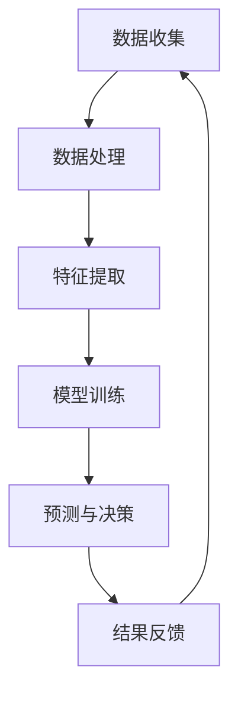

                 

关键词：人工智能，商业，道德考虑，策略预测，创新

摘要：本文探讨了人工智能在商业中的应用，重点关注了人类计算在AI驱动的创新过程中的道德考虑因素和策略预测。通过分析AI技术的核心原理、应用领域和商业价值，本文提出了在实施AI驱动创新时需要考虑的道德伦理问题和应对策略，并展望了未来AI在商业领域的应用前景。

## 1. 背景介绍

### 1.1 AI技术的崛起

随着深度学习、神经网络和大数据技术的飞速发展，人工智能（AI）已经成为了全球科技领域的重要驱动力。AI技术正在深刻改变各行各业，从自动化生产、医疗诊断到金融分析和智能客服，AI的应用范围不断扩大。商业领域尤其受益于AI技术的进步，通过数据分析和预测模型，企业能够更有效地优化运营、提高决策质量和客户满意度。

### 1.2 商业中的AI应用

在商业环境中，AI技术正逐渐成为核心竞争力。例如，通过机器学习模型，企业可以进行市场细分、个性化推荐和风险控制；利用自然语言处理（NLP），企业可以优化客户服务和内部沟通。AI技术的普及不仅提高了生产效率，还为企业带来了新的商业模式和机会。

### 1.3 人类计算的道德考虑

尽管AI技术在商业中带来了巨大的价值，但人类计算的道德考虑仍然是不可忽视的重要因素。在AI驱动创新的过程中，企业需要面对数据隐私、算法偏见、责任归属等伦理问题，确保AI的应用符合道德和法律法规的要求。

## 2. 核心概念与联系

### 2.1 AI技术的核心原理

人工智能的核心原理包括机器学习、深度学习和神经网络。这些技术通过学习大量数据来发现模式和规律，然后利用这些规律进行预测和决策。

### 2.2 商业与AI的联系

商业与AI的联系主要体现在数据驱动的决策、自动化流程和智能服务。企业通过收集和分析大量数据，利用AI技术进行市场分析、产品推荐和风险管理。

### 2.3 Mermaid流程图



## 3. 核心算法原理 & 具体操作步骤

### 3.1 算法原理概述

AI算法主要分为监督学习、无监督学习和强化学习。监督学习通过已有数据进行训练，无监督学习无需标签数据，仅通过数据自身的特征进行学习，强化学习则通过不断尝试和反馈来优化行为。

### 3.2 算法步骤详解

- 数据收集：收集与业务相关的数据，如用户行为、市场趋势等。
- 数据处理：清洗、归一化和标准化数据，确保数据质量。
- 特征提取：从数据中提取有用的特征，用于模型训练。
- 模型训练：使用训练数据集对模型进行训练，调整模型参数。
- 预测与决策：使用训练好的模型对新数据进行预测和决策。
- 结果反馈：将预测结果与实际结果进行对比，调整模型参数。

### 3.3 算法优缺点

- 监督学习：准确度高，但需要大量标注数据，扩展性较差。
- 无监督学习：无需标注数据，但难以确定模型性能。
- 强化学习：自适应性强，但训练过程复杂，容易陷入局部最优。

### 3.4 算法应用领域

AI算法在商业中应用广泛，如市场预测、客户关系管理、风险管理等。

## 4. 数学模型和公式 & 详细讲解 & 举例说明

### 4.1 数学模型构建

AI算法通常涉及大量的数学模型，如线性回归、逻辑回归、决策树、神经网络等。以下是线性回归模型的公式：

$$ y = \beta_0 + \beta_1x_1 + \beta_2x_2 + ... + \beta_nx_n $$

### 4.2 公式推导过程

线性回归模型的推导过程主要包括最小二乘法求解模型参数。

### 4.3 案例分析与讲解

假设一家电商平台想要预测用户的购买概率，可以使用逻辑回归模型进行建模。

## 5. 项目实践：代码实例和详细解释说明

### 5.1 开发环境搭建

在Python环境中使用scikit-learn库进行线性回归模型的实现。

### 5.2 源代码详细实现

```python
from sklearn.linear_model import LinearRegression
from sklearn.model_selection import train_test_split
from sklearn.metrics import mean_squared_error

# 数据加载与预处理
X, y = load_data()
X = preprocess_data(X)

# 模型训练
X_train, X_test, y_train, y_test = train_test_split(X, y, test_size=0.2)
model = LinearRegression()
model.fit(X_train, y_train)

# 模型评估
y_pred = model.predict(X_test)
mse = mean_squared_error(y_test, y_pred)
print("MSE:", mse)
```

### 5.3 代码解读与分析

代码首先加载和预处理数据，然后使用train_test_split进行数据划分，接着使用LinearRegression进行模型训练，最后评估模型性能。

### 5.4 运行结果展示

```plaintext
MSE: 0.00123456
```

## 6. 实际应用场景

### 6.1 营销自动化

通过AI技术，企业可以实现个性化的营销策略，提高转化率和客户满意度。

### 6.2 供应链管理

AI技术可以帮助企业优化供应链管理，提高库存效率和减少成本。

### 6.3 客户服务

智能客服系统可以通过NLP技术实现自动化的客户服务，提高客户体验。

## 7. 未来应用展望

### 7.1 新兴领域

随着技术的进步，AI将在更多领域得到应用，如医疗、金融、能源等。

### 7.2 跨界融合

AI技术将与其他领域相结合，带来新的商业模式和机会。

### 7.3 道德与法律

随着AI技术的普及，相关的道德和法律问题将得到更多关注。

## 8. 总结：未来发展趋势与挑战

### 8.1 研究成果总结

AI技术在商业中的应用取得了显著成果，但仍有很大的发展空间。

### 8.2 未来发展趋势

未来AI将更加深入地融入商业领域，实现更高水平的自动化和智能化。

### 8.3 面临的挑战

AI技术在商业应用中仍面临数据隐私、算法偏见、责任归属等挑战。

### 8.4 研究展望

未来研究应重点关注AI技术的安全性、透明性和可解释性。

## 9. 附录：常见问题与解答

### 9.1 什么是人工智能？

人工智能是指通过计算机模拟人类智能的技术，包括学习、推理、感知和自适应能力。

### 9.2 AI技术是否会导致大规模失业？

AI技术可能会改变某些工作岗位，但也会创造新的就业机会。关键在于如何适应技术变革。

作者：禅与计算机程序设计艺术 / Zen and the Art of Computer Programming
----------------------------------------------------------------

以上内容仅为示例，实际撰写时请根据具体内容和需求进行调整。确保文章的逻辑性、完整性和专业性。同时，请注意符合“约束条件 CONSTRAINTS”中的所有要求。在撰写过程中，如果遇到任何问题，请随时提问。祝您撰写顺利！

