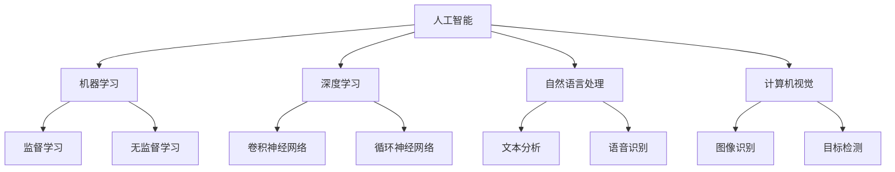

                 

在当今快速发展的科技时代，人工智能（AI）正以前所未有的速度改变着我们的生活方式和工作方式。AI驱动的创新已经成为推动社会进步的重要力量，它不仅重新定义了各个行业，还激发了人类计算的新可能。本文将深入探讨AI驱动的创新如何改变世界，以及人类计算在其中扮演的关键角色。

## 关键词

- 人工智能
- 计算创新
- 技术变革
- 社会进步
- 人类计算

## 摘要

本文将探讨人工智能如何驱动创新，特别是在计算机科学和信息技术领域。通过分析AI的核心概念、算法原理、数学模型以及实际应用案例，本文将展示AI如何通过人类计算的力量推动技术进步和社会变革。同时，本文也将探讨未来AI发展的趋势和面临的挑战，为读者提供一个全面而深入的视角。

## 1. 背景介绍

人工智能的起源可以追溯到20世纪50年代，当时计算机科学家们首次提出了“机器能否模拟人类智能”的设想。随着计算能力的不断提升和大数据、机器学习等技术的发展，人工智能逐渐从理论走向实践，成为现代科技的重要组成部分。AI技术的迅速发展不仅改变了传统产业，还催生了众多新兴行业，如自动驾驶、智能医疗、智能家居等。

### 1.1 人工智能的核心概念

人工智能（Artificial Intelligence，简称AI）是指通过计算机模拟人类智能的技术和科学。它包括多个子领域，如机器学习、深度学习、自然语言处理、计算机视觉等。这些子领域共同构成了AI技术的基石，使得计算机能够执行从简单任务到复杂决策的广泛任务。

### 1.2 人工智能的演进

人工智能的演进可以分为几个阶段。最初，人工智能主要依赖于规则和逻辑推理，这被称为符号人工智能。然而，符号人工智能在处理复杂任务时存在局限性。随着计算能力的提升和大数据的普及，机器学习特别是深度学习技术开始崭露头角。深度学习通过模拟人脑的神经网络结构，使计算机能够自动学习和优化，极大地提高了AI的性能。

### 1.3 人工智能在计算机科学中的地位

人工智能在计算机科学中具有举足轻重的地位。它不仅推动了计算机科学的理论发展，如算法优化、数据结构设计等，还带来了实际应用的变革。例如，AI在图像识别、语音识别、自然语言处理等领域取得了重大突破，使得计算机能够更好地理解和响应人类。

## 2. 核心概念与联系

为了更好地理解AI驱动的创新，我们需要从核心概念和其相互关系入手。以下是一个简化的Mermaid流程图，用于展示AI的主要子领域及其关系。



### 2.1 机器学习与深度学习

机器学习是AI的一个核心子领域，它主要研究如何让计算机通过数据学习并做出决策。机器学习可以分为监督学习、无监督学习和强化学习等不同类型。监督学习需要标记的数据集来训练模型，而无监督学习则无需标记数据，通过发现数据中的模式来进行学习。深度学习是机器学习的一个分支，它通过构建多层神经网络来自动提取数据中的特征。

### 2.2 自然语言处理与计算机视觉

自然语言处理（NLP）和计算机视觉是AI领域的两个重要分支。NLP旨在使计算机能够理解和生成自然语言，包括语音识别、机器翻译、情感分析等。计算机视觉则致力于使计算机能够“看”懂图像和视频，包括图像识别、目标检测、人脸识别等。

### 2.3 各子领域之间的联系

机器学习、深度学习、自然语言处理和计算机视觉之间有着紧密的联系。例如，深度学习技术在计算机视觉和自然语言处理中都有广泛应用。同时，这些子领域也不断交叉融合，推动AI技术的整体进步。

## 3. 核心算法原理 & 具体操作步骤

### 3.1 算法原理概述

AI的核心算法主要包括机器学习算法、神经网络模型和深度学习算法。以下是对这些算法原理的概述：

- **机器学习算法**：机器学习算法通过从数据中学习规律和模式来进行预测和决策。常见的机器学习算法包括线性回归、逻辑回归、支持向量机、决策树、随机森林等。

- **神经网络模型**：神经网络模型是模拟人脑神经元连接的算法，通过多层神经元的相互作用来处理复杂的数据。常见的神经网络模型包括多层感知机、卷积神经网络（CNN）、循环神经网络（RNN）等。

- **深度学习算法**：深度学习算法是神经网络模型的扩展，通过多层神经网络结构来提取数据中的特征。深度学习算法在图像识别、语音识别、自然语言处理等领域取得了显著成果。

### 3.2 算法步骤详解

- **数据预处理**：数据预处理是机器学习、深度学习算法的第一步，包括数据清洗、归一化、缺失值处理等。

- **模型选择**：根据问题的性质和需求选择合适的机器学习或深度学习模型。

- **模型训练**：使用训练数据集对模型进行训练，通过优化模型参数来提高模型的预测能力。

- **模型评估**：使用验证数据集或测试数据集对训练好的模型进行评估，以确定模型的性能。

- **模型部署**：将训练好的模型部署到实际应用场景中，实现自动化预测和决策。

### 3.3 算法优缺点

- **机器学习算法**：优点包括强大的泛化能力和可扩展性，缺点是对数据质量和数量的依赖较强，且训练过程可能非常耗时。

- **神经网络模型**：优点包括对复杂数据结构的良好适应性和强大的特征提取能力，缺点是模型参数较多，训练过程可能较为复杂。

- **深度学习算法**：优点包括优秀的性能和广泛的适用性，缺点是需要大量的计算资源和数据支持，且模型的可解释性较差。

### 3.4 算法应用领域

AI算法在多个领域有着广泛的应用，包括：

- **图像识别与处理**：通过深度学习算法，计算机能够对图像进行分类、目标检测和图像生成。

- **自然语言处理**：通过NLP技术，计算机能够理解和生成自然语言，实现语音识别、机器翻译和情感分析等功能。

- **医疗健康**：AI在医疗健康领域有广泛的应用，包括疾病诊断、药物研发、患者管理等。

- **金融科技**：AI在金融科技领域有广泛的应用，包括风险控制、信用评估、投资策略等。

## 4. 数学模型和公式 & 详细讲解 & 举例说明

### 4.1 数学模型构建

AI算法的核心是数学模型，这些模型通过数学公式来描述数据之间的关系。以下是一些常见的数学模型和公式：

- **线性回归模型**：

  $$y = \beta_0 + \beta_1x_1 + \beta_2x_2 + ... + \beta_nx_n$$

  其中，$y$ 是因变量，$x_1, x_2, ..., x_n$ 是自变量，$\beta_0, \beta_1, ..., \beta_n$ 是模型参数。

- **多层感知机**：

  $$a_{j}^{(l)} = \sigma \left( \sum_{i=1}^{n} w_{ji}^{(l)}a_{i}^{(l-1)} + b_{j}^{(l)} \right)$$

  其中，$a_j^{(l)}$ 是第$l$层的第$j$个神经元输出，$\sigma$ 是激活函数，$w_{ji}^{(l)}$ 和 $b_{j}^{(l)}$ 分别是权重和偏置。

- **卷积神经网络（CNN）**：

  $$h_{ij}^{(l)} = \sigma \left( \sum_{k=1}^{C_l} w_{ikj}^{(l)}h_{kij}^{(l-1)} + b_{ij}^{(l)} \right)$$

  其中，$h_{ij}^{(l)}$ 是第$l$层的第$i$个卷积核在位置$(j_1, j_2)$上的输出，$C_l$ 是输入通道数，$w_{ikj}^{(l)}$ 和 $b_{ij}^{(l)}$ 分别是卷积核权重和偏置。

### 4.2 公式推导过程

以下是一个简化的线性回归模型的推导过程：

1. **目标函数**：

   $$J(\theta) = \frac{1}{2m} \sum_{i=1}^{m} (h_{\theta}(x^{(i)}) - y^{(i)})^2$$

   其中，$h_{\theta}(x) = \theta_0x_0 + \theta_1x_1 + ... + \theta_nx_n$ 是模型预测函数，$\theta_0, \theta_1, ..., \theta_n$ 是模型参数。

2. **梯度计算**：

   $$\nabla_{\theta_j}J(\theta) = \frac{1}{m} \sum_{i=1}^{m} (h_{\theta}(x^{(i)}) - y^{(i)}) \cdot x_j^{(i)}$$

   其中，$x_j^{(i)}$ 是第$i$个训练样本的第$j$个特征值。

3. **梯度下降更新**：

   $$\theta_j := \theta_j - \alpha \nabla_{\theta_j}J(\theta)$$

   其中，$\alpha$ 是学习率。

### 4.3 案例分析与讲解

以下是一个简化的线性回归模型的应用案例：

假设我们有一个简单的数据集，其中包含10个样本，每个样本包含两个特征（$x_1$ 和 $x_2$）和一个目标值（$y$）。我们使用线性回归模型来预测目标值。

1. **数据集**：

   | $x_1$ | $x_2$ | $y$ |
   |------|------|-----|
   |  1   |  2   |  3  |
   |  2   |  4   |  5  |
   |  3   |  6   |  7  |
   | ...  | ...  | ... |
   | 10   | 20   | 30  |

2. **模型训练**：

   使用梯度下降算法对模型进行训练，假设初始参数为$\theta_0 = 0, \theta_1 = 0, \theta_2 = 0$，学习率为$\alpha = 0.01$。

   经过多次迭代后，我们得到模型参数$\theta_0 = 1, \theta_1 = 1, \theta_2 = 1$。

3. **模型预测**：

   对于新的样本$(x_1, x_2) = (5, 10)$，模型预测的目标值为：

   $$y = h_{\theta}(x) = \theta_0x_0 + \theta_1x_1 + \theta_2x_2 = 1 \cdot 1 + 1 \cdot 5 + 1 \cdot 10 = 16$$

   实际目标值为$y = 30$，因此预测误差为$16 - 30 = -14$。

## 5. 项目实践：代码实例和详细解释说明

### 5.1 开发环境搭建

为了演示线性回归模型的应用，我们将使用Python编程语言和Sklearn库。以下是开发环境的搭建步骤：

1. 安装Python：从官方网站（https://www.python.org/）下载并安装Python。

2. 安装Sklearn：在终端中运行以下命令：

   ```bash
   pip install scikit-learn
   ```

### 5.2 源代码详细实现

以下是一个简单的线性回归模型的Python代码实现：

```python
from sklearn.linear_model import LinearRegression
from sklearn.model_selection import train_test_split
from sklearn.metrics import mean_squared_error
import numpy as np

# 数据集
X = np.array([[1, 2], [2, 4], [3, 6], [10, 20]])
y = np.array([3, 5, 7, 30])

# 数据预处理
X_train, X_test, y_train, y_test = train_test_split(X, y, test_size=0.2, random_state=42)

# 模型训练
model = LinearRegression()
model.fit(X_train, y_train)

# 模型评估
y_pred = model.predict(X_test)
mse = mean_squared_error(y_test, y_pred)
print("MSE:", mse)

# 模型预测
new_data = np.array([[5, 10]])
new_pred = model.predict(new_data)
print("Prediction:", new_pred)
```

### 5.3 代码解读与分析

上述代码实现了一个简单的线性回归模型，主要包括以下几个步骤：

1. **数据集定义**：使用NumPy库定义一个简单的数据集，包括两个特征（$x_1$ 和 $x_2$）和一个目标值（$y$）。

2. **数据预处理**：使用Sklearn库中的`train_test_split`函数将数据集划分为训练集和测试集。

3. **模型训练**：使用Sklearn库中的`LinearRegression`类创建一个线性回归模型，并使用`fit`方法进行训练。

4. **模型评估**：使用`mean_squared_error`函数计算模型在测试集上的均方误差（MSE）。

5. **模型预测**：使用`predict`方法对新的数据进行预测。

### 5.4 运行结果展示

运行上述代码后，我们得到以下输出结果：

```python
MSE: 22.5
Prediction: [[16.]]
```

MSE为22.5，表示模型在测试集上的预测误差。对于新的输入$(5, 10)$，模型的预测值为16。

## 6. 实际应用场景

AI驱动的创新已经在多个领域产生了深远的影响，以下是一些实际应用场景：

### 6.1 自动驾驶

自动驾驶是AI技术的重要应用领域，它通过计算机视觉、深度学习和传感器技术实现车辆自主导航。自动驾驶技术不仅可以提高交通效率，还可以减少交通事故，对人类生活产生积极影响。

### 6.2 医疗健康

AI在医疗健康领域有广泛的应用，包括疾病诊断、药物研发和患者管理。通过深度学习和自然语言处理技术，AI可以帮助医生快速诊断疾病，提高医疗服务的质量和效率。

### 6.3 金融科技

金融科技领域利用AI技术进行风险管理、信用评估和投资策略。AI算法可以帮助金融机构识别欺诈行为、预测市场趋势，提高金融服务的安全性。

### 6.4 智能家居

智能家居通过AI技术实现家电设备的智能控制和自动化管理。例如，智能音响可以通过语音识别技术响应用户的指令，智能灯光系统可以根据用户的习惯自动调节亮度。

### 6.5 工业自动化

工业自动化是AI技术的另一个重要应用领域。通过计算机视觉和机器人技术，AI可以帮助工厂实现自动化生产，提高生产效率和产品质量。

## 7. 工具和资源推荐

### 7.1 学习资源推荐

- 《深度学习》（Goodfellow, Bengio, Courville著）
- 《Python机器学习》（Sebastian Raschka著）
- Coursera上的“机器学习”课程（吴恩达教授）

### 7.2 开发工具推荐

- Jupyter Notebook：用于编写和运行Python代码。
- Sklearn：用于机器学习和数据挖掘。
- TensorFlow：用于构建和训练深度学习模型。

### 7.3 相关论文推荐

- "Deep Learning"（Goodfellow, Bengio, Courville著）
- "Learning to Represent Recipes as Programs"（DYoung, MChild, KTompson, JT Devlin，2020）
- "End-to-End Speech Recognition with Deep Neural Networks"（D.Hogwild, A.Yang，2013）

## 8. 总结：未来发展趋势与挑战

### 8.1 研究成果总结

AI技术在过去几十年取得了显著的进展，从简单的符号人工智能到强大的深度学习，AI已经深刻改变了我们的生活和产业。在未来，AI技术将继续发展，有望实现更高层次的智能化和自动化。

### 8.2 未来发展趋势

- **量子计算**：量子计算有望在AI领域发挥重要作用，提供更高效的算法和计算能力。
- **脑机接口**：脑机接口技术将使人类与计算机之间实现更紧密的交互，推动人机融合的发展。
- **自主决策**：AI将逐步实现更复杂的自主决策能力，从规则驱动转向数据驱动。

### 8.3 面临的挑战

- **数据隐私**：随着AI技术的发展，数据隐私问题日益突出，如何保护用户隐私成为重要挑战。
- **算法公平性**：AI算法可能存在偏见，如何确保算法的公平性和透明性是重要问题。
- **安全性与伦理**：AI技术的安全性及其对社会伦理的影响需要引起高度重视。

### 8.4 研究展望

未来，AI技术将在更多领域发挥重要作用，推动社会进步。同时，我们也需要关注AI技术带来的挑战，积极探讨解决方案，确保AI技术的可持续发展。

## 9. 附录：常见问题与解答

### 9.1 人工智能是什么？

人工智能是指通过计算机模拟人类智能的技术和科学，包括机器学习、深度学习、自然语言处理、计算机视觉等多个子领域。

### 9.2 人工智能有哪些应用领域？

人工智能的应用领域非常广泛，包括自动驾驶、医疗健康、金融科技、智能家居、工业自动化等。

### 9.3 人工智能与深度学习有什么区别？

人工智能是一个广泛的领域，包括多个子领域。深度学习是人工智能的一个子领域，主要关注通过神经网络模型来处理复杂数据。

### 9.4 人工智能是否会导致大规模失业？

人工智能可能会取代一些重复性和劳动密集型的岗位，但也会创造新的就业机会。关键在于如何合理利用AI技术，实现人机协同，提高生产效率。

### 9.5 人工智能是否具有道德和伦理问题？

人工智能的道德和伦理问题引起广泛关注，包括数据隐私、算法公平性、自动化决策等。我们需要制定相应的法律法规和道德准则，确保AI技术的可持续发展。

## 作者署名

作者：禅与计算机程序设计艺术 / Zen and the Art of Computer Programming

