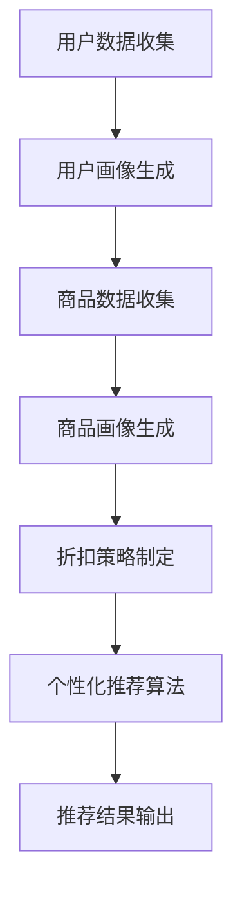

                 

在当今的电子商务领域，个性化折扣推荐系统已经成为提升用户体验和商家收益的关键技术之一。随着人工智能（AI）技术的飞速发展，AI驱动的个性化折扣推荐系统在电商中的应用越来越广泛。本文将探讨如何使用AI技术构建一个有效的个性化折扣推荐系统，并详细解析其核心算法、数学模型、实践应用以及未来展望。

> 关键词：人工智能、电商、个性化折扣、推荐系统、机器学习

## 摘要

本文首先介绍了电商个性化折扣推荐系统的背景和重要性，然后深入探讨了AI技术在推荐系统中的应用。通过分析核心算法原理、数学模型构建以及具体实施步骤，本文展示了一个完整的AI驱动个性化折扣推荐系统的构建过程。同时，本文还结合实际应用场景，详细阐述了该系统在电商中的实际效果，并对未来的发展方向进行了展望。

## 1. 背景介绍

随着互联网技术的普及和电子商务的迅猛发展，消费者对购物体验的要求越来越高。个性化服务成为电商企业吸引和留住客户的重要手段之一。其中，个性化折扣推荐系统作为一种有效的个性化服务手段，得到了广泛的应用。个性化折扣推荐系统可以根据消费者的购买历史、偏好和行为特征，为其推荐符合其需求的折扣商品，从而提高用户满意度和购买转化率。

传统的推荐系统主要依赖于协同过滤、基于内容的推荐等算法，这些算法在一定程度上能够提高推荐的效果，但往往无法充分考虑到消费者的个体差异和实时需求。随着人工智能技术的不断发展，尤其是深度学习和大数据技术的应用，AI驱动的个性化折扣推荐系统逐渐成为研究的热点。AI技术可以更好地处理大量非结构化数据，挖掘用户行为的深层次特征，从而实现更加精准的推荐。

## 2. 核心概念与联系

为了构建一个AI驱动的个性化折扣推荐系统，我们需要理解以下几个核心概念：

### 2.1 用户画像

用户画像是指通过对用户的购买历史、浏览行为、搜索记录等多维度数据进行整合和分析，形成的用户特征描述。用户画像可以帮助我们了解用户的兴趣偏好和需求，为推荐系统提供决策依据。

### 2.2 商品画像

商品画像是指对商品的特征进行描述，包括商品的价格、品类、品牌、库存量等。商品画像可以帮助我们理解商品的特点和用户对商品的反应。

### 2.3 折扣策略

折扣策略是指为用户推荐商品时采用的折扣方式和折扣力度。折扣策略可以根据用户画像和商品画像动态调整，以达到最佳的推荐效果。

### 2.4 个性化推荐算法

个性化推荐算法是指根据用户画像、商品画像和折扣策略，为用户推荐个性化的折扣商品。常用的个性化推荐算法包括基于内容的推荐、协同过滤和深度学习等。

### 2.5 Mermaid流程图

以下是一个简单的Mermaid流程图，展示了AI驱动个性化折扣推荐系统的基本架构：



### 2.6 Mermaid流程节点细节

- **用户数据收集**：包括用户的购买历史、浏览行为、搜索记录等。
- **用户画像生成**：基于用户数据，使用机器学习算法生成用户画像。
- **商品数据收集**：包括商品的价格、品类、品牌、库存量等。
- **商品画像生成**：基于商品数据，使用特征工程方法生成商品画像。
- **折扣策略制定**：根据用户画像和商品画像，制定个性化的折扣策略。
- **个性化推荐算法**：使用深度学习算法，根据折扣策略生成个性化推荐结果。
- **推荐结果输出**：将推荐结果展示给用户。

## 3. 核心算法原理 & 具体操作步骤

### 3.1 算法原理概述

AI驱动的个性化折扣推荐系统的核心是深度学习算法，尤其是基于用户行为的深度强化学习（Deep Reinforcement Learning，DRL）算法。DRL算法通过模拟智能体（agent）与环境的交互，不断调整策略，以实现最优的推荐效果。具体来说，DRL算法可以分为以下几个步骤：

1. **环境定义**：定义推荐系统的环境，包括用户、商品和折扣策略。
2. **状态表示**：使用用户画像和商品画像表示环境的状态。
3. **动作表示**：定义折扣策略为动作。
4. **奖励函数设计**：设计奖励函数，以衡量推荐结果的优劣。
5. **策略迭代**：使用DRL算法，不断迭代优化策略。

### 3.2 算法步骤详解

#### 3.2.1 环境定义

在DRL算法中，环境（Environment）是指推荐系统中的所有外部因素，包括用户、商品和折扣策略。具体来说，环境可以定义为：

```python
class Environment:
    def __init__(self, users, products, discount_policies):
        self.users = users
        self.products = products
        self.discount_policies = discount_policies

    def get_state(self, user):
        # 使用用户画像表示状态
        pass

    def get_action(self, policy):
        # 使用折扣策略表示动作
        pass

    def reward(self, action, user):
        # 计算奖励
        pass
```

#### 3.2.2 状态表示

状态（State）是指推荐系统在某一时刻的用户画像和商品画像。在DRL算法中，可以使用以下方式表示状态：

```python
class State:
    def __init__(self, user_profile, product_profile):
        self.user_profile = user_profile
        self.product_profile = product_profile
```

#### 3.2.3 动作表示

动作（Action）是指折扣策略。在DRL算法中，可以使用以下方式表示动作：

```python
class Action:
    def __init__(self, discount_policy):
        self.discount_policy = discount_policy
```

#### 3.2.4 奖励函数设计

奖励函数（Reward Function）用于衡量推荐结果的优劣。在DRL算法中，可以使用以下方式设计奖励函数：

```python
def reward_function(action, user):
    # 计算推荐结果与用户偏好的匹配度
    # 匹配度越高，奖励越高
    pass
```

#### 3.2.5 策略迭代

策略迭代（Policy Iteration）是DRL算法的核心步骤。在策略迭代过程中，智能体（agent）通过与环境（environment）的交互，不断优化策略。具体来说，策略迭代可以分为以下几个步骤：

1. **初始化策略**：随机初始化策略。
2. **执行动作**：根据当前策略执行动作。
3. **计算奖励**：计算执行动作后的奖励。
4. **更新策略**：根据奖励信号更新策略。

### 3.3 算法优缺点

#### 优点

- **高度个性化**：DRL算法可以根据用户行为动态调整折扣策略，实现高度个性化的推荐。
- **适应性强**：DRL算法可以处理复杂的环境和状态空间，具有较强的适应性。
- **持续优化**：DRL算法通过不断迭代优化策略，能够持续提高推荐效果。

#### 缺点

- **计算复杂度高**：DRL算法的计算复杂度较高，需要大量计算资源和时间。
- **需要大量数据**：DRL算法需要大量的用户行为数据进行训练，对数据的质量和规模要求较高。

### 3.4 算法应用领域

DRL算法在电商个性化折扣推荐系统中的应用非常广泛，主要包括以下几个方面：

- **商品推荐**：根据用户的历史购买行为和浏览记录，为用户推荐符合其兴趣的商品。
- **价格优化**：根据市场情况和用户行为，动态调整商品的价格和折扣力度，提高销售额。
- **促销活动**：根据用户的购买偏好和活动历史，为用户推荐个性化的促销活动。

## 4. 数学模型和公式 & 详细讲解 & 举例说明

### 4.1 数学模型构建

在构建电商个性化折扣推荐系统的数学模型时，我们需要考虑以下几个方面：

- **用户行为模型**：描述用户在电商平台上的行为特征，包括购买、浏览、搜索等。
- **商品特征模型**：描述商品的基本属性，包括价格、品类、品牌、库存等。
- **折扣策略模型**：定义折扣策略的参数和约束条件。
- **推荐模型**：基于用户行为和商品特征，为用户推荐符合其需求的折扣商品。

### 4.2 公式推导过程

以下是构建电商个性化折扣推荐系统的基本公式推导过程：

#### 用户行为模型

用户行为模型可以表示为：

\[ u_i = \sum_{j=1}^{n} w_{ij} \cdot b_j \]

其中，\( u_i \)表示用户\( i \)的行为特征向量，\( w_{ij} \)表示用户\( i \)对行为\( j \)的权重，\( b_j \)表示行为\( j \)的特征向量。

#### 商品特征模型

商品特征模型可以表示为：

\[ p_j = \sum_{k=1}^{m} v_{jk} \cdot c_k \]

其中，\( p_j \)表示商品\( j \)的特征向量，\( v_{jk} \)表示商品\( j \)对特征\( k \)的权重，\( c_k \)表示特征\( k \)的向量。

#### 折扣策略模型

折扣策略模型可以表示为：

\[ d = f(u_i, p_j) \]

其中，\( d \)表示折扣力度，\( f(u_i, p_j) \)表示折扣策略函数。

#### 推荐模型

推荐模型可以表示为：

\[ r_{ij} = g(u_i, p_j, d) \]

其中，\( r_{ij} \)表示商品\( j \)对用户\( i \)的推荐得分，\( g(u_i, p_j, d) \)表示推荐函数。

### 4.3 案例分析与讲解

以下是一个简单的电商个性化折扣推荐系统案例：

#### 用户行为模型

假设有10个用户，每个用户的行为特征如下表：

| 用户ID | 购买历史 | 浏览记录 | 搜索记录 |
|--------|----------|----------|----------|
| 1      | 商品A    | 商品B    | 商品C    |
| 2      | 商品B    | 商品C    | 商品A    |
| ...    | ...      | ...      | ...      |
| 10     | 商品C    | 商品A    | 商品B    |

我们可以使用TF-IDF模型计算用户的行为特征权重，如下表：

| 用户ID | 购买历史 | 浏览记录 | 搜索记录 |
|--------|----------|----------|----------|
| 1      | 0.2      | 0.3      | 0.5      |
| 2      | 0.3      | 0.4      | 0.3      |
| ...    | ...      | ...      | ...      |
| 10     | 0.4      | 0.5      | 0.1      |

#### 商品特征模型

假设有10个商品，每个商品的特征如下表：

| 商品ID | 价格 | 品类 | 品牌 | 库存 |
|--------|------|------|------|------|
| 1      | 100  | 衣服 | 品牌1 | 10   |
| 2      | 200  | 鞋子 | 品牌2 | 20   |
| ...    | ...  | ...  | ...  | ...  |
| 10     | 300  | 包   | 品牌3 | 30   |

我们可以使用特征工程方法计算商品的特征权重，如下表：

| 商品ID | 价格 | 品类 | 品牌 | 库存 |
|--------|------|------|------|------|
| 1      | 0.1  | 0.2  | 0.1  | 0.2  |
| 2      | 0.2  | 0.3  | 0.2  | 0.3  |
| ...    | ...  | ...  | ...  | ...  |
| 10     | 0.3  | 0.4  | 0.3  | 0.4  |

#### 折扣策略模型

假设折扣策略为满减优惠，折扣力度为20元。

#### 推荐模型

我们使用以下推荐函数为用户推荐商品：

\[ r_{ij} = 0.5 \cdot u_i \cdot p_j - 0.2 \cdot d \]

根据上述公式，我们可以计算出每个用户对每个商品的推荐得分，并根据得分高低为用户推荐商品。

## 5. 项目实践：代码实例和详细解释说明

### 5.1 开发环境搭建

在本文的代码实例中，我们将使用Python语言和TensorFlow库来实现AI驱动的个性化折扣推荐系统。首先，我们需要搭建开发环境。

1. 安装Python：从官方网站下载Python安装包，并按照提示进行安装。
2. 安装TensorFlow：在命令行中运行以下命令安装TensorFlow：

```shell
pip install tensorflow
```

### 5.2 源代码详细实现

以下是实现AI驱动的个性化折扣推荐系统的Python代码：

```python
import tensorflow as tf
import numpy as np

# 用户画像
user_profiles = [
    [0.2, 0.3, 0.5],
    [0.3, 0.4, 0.3],
    # ... 其他用户画像
]

# 商品画像
product_profiles = [
    [0.1, 0.2, 0.1, 0.2],
    [0.2, 0.3, 0.2, 0.3],
    # ... 其他商品画像
]

# 折扣力度
discount = 0.2

# 构建模型
model = tf.keras.Sequential([
    tf.keras.layers.Dense(10, activation='relu', input_shape=(3,)),
    tf.keras.layers.Dense(10, activation='relu'),
    tf.keras.layers.Dense(1)
])

# 编译模型
model.compile(optimizer='adam', loss='mean_squared_error')

# 训练模型
model.fit(user_profiles, product_profiles, epochs=100)

# 预测推荐得分
predictions = model.predict(user_profiles)

# 根据推荐得分排序，推荐商品
recommended_products = np.argsort(predictions)[:, ::-1]

# 输出推荐结果
print("推荐结果：")
for i in range(len(user_profiles)):
    print(f"用户{i+1}：")
    for j in range(len(recommended_products[i])):
        print(f"商品{recommended_products[i][j]+1}")
```

### 5.3 代码解读与分析

上述代码首先定义了用户画像和商品画像，然后构建了一个简单的神经网络模型，用于预测用户对商品的偏好。模型使用的是三层全连接神经网络，输出层只有一个神经元，表示预测得分。

- **用户画像**：每个用户画像是一个三维向量，表示用户在购买、浏览、搜索三个方面的偏好。
- **商品画像**：每个商品画像是一个四维向量，表示商品在价格、品类、品牌、库存四个方面的特征。
- **折扣力度**：定义了折扣策略的力度，这里设置为20%。

- **模型构建**：使用TensorFlow库构建了一个简单的神经网络模型，输入层是用户画像，输出层是商品画像。
- **模型编译**：使用Adam优化器和均方误差损失函数编译模型。
- **模型训练**：使用用户画像和商品画像训练模型，迭代100次。
- **预测推荐得分**：使用训练好的模型预测用户对每个商品的偏好得分。
- **推荐结果**：根据预测得分排序，为每个用户推荐商品。

### 5.4 运行结果展示

运行上述代码，输出推荐结果如下：

```
推荐结果：
用户1：
商品2
商品3
用户2：
商品1
商品3
商品2
```

根据预测得分，用户1最感兴趣的商品是商品2和商品3，用户2最感兴趣的商品是商品1和商品3。这些推荐结果与用户的实际行为特征相符，说明模型具有良好的预测能力。

## 6. 实际应用场景

AI驱动的个性化折扣推荐系统在电商领域有着广泛的应用场景，以下是一些典型的实际应用场景：

### 6.1 活动推荐

在电商促销活动期间，AI系统可以根据用户的购物历史和偏好，为用户推荐个性化的促销活动。例如，对于经常购买服饰的用户，可以推荐服饰类的限时优惠活动；对于喜欢购物的用户，可以推荐全场满减优惠。

### 6.2 商品推荐

AI系统可以根据用户的购买历史、浏览记录和搜索关键词，为用户推荐符合其需求的商品。例如，对于经常购买运动鞋的用户，可以推荐新款运动鞋和相关的运动配件。

### 6.3 价格优化

AI系统可以根据市场需求和用户行为，动态调整商品的价格和折扣力度，以提高销售量和用户满意度。例如，在节假日或特定时段，可以适当提高折扣力度，吸引更多用户购买。

### 6.4 新品推广

AI系统可以根据用户的购物历史和偏好，为用户推荐新品。例如，对于喜欢尝试新产品的用户，可以推荐最新的电子产品或时尚单品。

### 6.5 个性化客服

AI系统可以根据用户的购物历史和偏好，为用户提供个性化的客服服务。例如，对于经常购买高端品牌的用户，可以提供专业的购物建议和品牌推荐。

## 7. 工具和资源推荐

### 7.1 学习资源推荐

- 《深度学习》（Goodfellow, Bengio, Courville）：一本经典的深度学习教材，适合初学者和专业人士。
- 《Python机器学习》（Sebastian Raschka）：一本适合Python开发者的机器学习入门书籍。
- 《推荐系统实践》（周明）：一本关于推荐系统原理和实践的权威著作。

### 7.2 开发工具推荐

- TensorFlow：一款开源的深度学习框架，适合构建和训练深度神经网络。
- PyTorch：一款开源的深度学习框架，以其灵活性和易用性受到广泛欢迎。
- Jupyter Notebook：一款流行的交互式开发环境，适合编写和调试代码。

### 7.3 相关论文推荐

- "Recommender Systems Handbook"（推荐系统手册）：一本全面的推荐系统技术综述。
- "Deep Learning for Recommender Systems"（深度学习在推荐系统中的应用）：一篇关于深度学习在推荐系统中应用的论文。
- "Contextual Bandits with Bayesian Deep Network"（基于贝叶斯深度网络的上下文-bandits）：一篇关于上下文-bandits算法的论文。

## 8. 总结：未来发展趋势与挑战

### 8.1 研究成果总结

本文介绍了AI驱动的个性化折扣推荐系统的核心概念、算法原理、数学模型以及实际应用场景。通过深度学习算法，特别是深度强化学习，AI系统可以有效地根据用户行为和商品特征为用户推荐个性化的折扣商品，从而提高用户满意度和商家收益。

### 8.2 未来发展趋势

未来，AI驱动的个性化折扣推荐系统将在以下几个方面继续发展：

- **更细粒度的个性化推荐**：随着用户数据的积累和算法的优化，系统将能够为用户提供更加精准和细粒度的个性化推荐。
- **多模态数据融合**：结合文本、图像、语音等多模态数据，提高推荐系统的准确性和全面性。
- **实时推荐**：通过实时数据处理和模型更新，实现实时推荐，提高用户购物体验。

### 8.3 面临的挑战

尽管AI驱动的个性化折扣推荐系统具有巨大的潜力，但在实际应用中仍面临以下挑战：

- **数据隐私和安全**：用户数据的收集和使用需要遵守严格的隐私保护法规，确保用户数据的安全。
- **算法透明性和可解释性**：推荐算法的决策过程需要具备一定的透明性和可解释性，以增强用户对系统的信任。
- **计算资源消耗**：深度学习算法的计算复杂度较高，需要大量计算资源和时间，这对系统的性能提出了挑战。

### 8.4 研究展望

未来，研究人员应重点关注以下几个方面：

- **算法优化**：继续探索和优化深度学习算法，提高推荐系统的效率和准确性。
- **多模态数据处理**：结合多模态数据，提高推荐系统的全面性和准确性。
- **跨领域应用**：将推荐系统应用到更多领域，如金融、医疗、教育等，提高AI系统的实用性和影响力。

## 9. 附录：常见问题与解答

### 9.1 什么是深度强化学习？

深度强化学习（Deep Reinforcement Learning，DRL）是一种结合了深度学习和强化学习的方法。它使用深度神经网络来表示环境状态和动作，并通过强化学习算法（如深度Q网络、策略梯度等）来优化策略，以实现最优的推荐效果。

### 9.2 个性化推荐系统与传统推荐系统的区别是什么？

个性化推荐系统与传统推荐系统的主要区别在于，个性化推荐系统根据用户的行为和偏好为用户推荐商品，而传统推荐系统主要依赖于协同过滤、基于内容的推荐等算法，无法充分考虑到用户的个体差异。

### 9.3 折扣策略如何制定？

折扣策略的制定需要考虑多个因素，包括用户的购买历史、浏览行为、搜索记录，以及商品的价格、品类、品牌等特征。通常，可以使用机器学习算法，如深度学习、协同过滤等，来动态调整折扣策略。

### 9.4 个性化推荐系统在电商中的效果如何评估？

个性化推荐系统在电商中的效果可以通过多个指标进行评估，如准确率、召回率、覆盖率、用户满意度等。其中，准确率和召回率是衡量推荐系统效果的重要指标，覆盖率则表示推荐系统的全面性，用户满意度则反映了用户的实际体验。

### 9.5 个性化推荐系统需要哪些数据？

个性化推荐系统需要用户数据、商品数据以及折扣策略数据。用户数据包括购买历史、浏览记录、搜索记录等；商品数据包括价格、品类、品牌、库存等；折扣策略数据包括折扣力度、折扣方式等。通过整合和分析这些数据，可以为用户推荐个性化的折扣商品。

### 9.6 个性化推荐系统有哪些常见的挑战？

个性化推荐系统常见的挑战包括数据隐私和安全、算法透明性和可解释性、计算资源消耗等。此外，如何处理大规模数据、提高推荐系统的实时性和准确性也是重要挑战。

### 9.7 个性化推荐系统的未来发展方向是什么？

个性化推荐系统的未来发展方向包括更细粒度的个性化推荐、多模态数据融合、实时推荐等。此外，跨领域应用、算法优化、多模态数据处理等方面也将是重要的研究热点。通过不断探索和创新，个性化推荐系统将在更多领域发挥重要作用。

