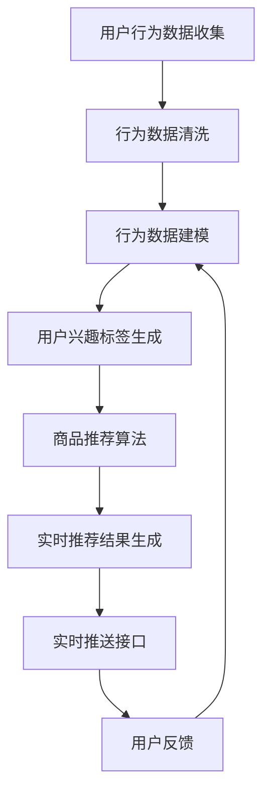

                 

随着互联网技术的飞速发展和用户需求的日益多样化，电商平台如何精准推送商品信息，成为提升用户满意度和销售转化率的关键因素。AI驱动的个性化推送策略应运而生，为电商平台提供了全新的解决方案。本文将深入探讨AI驱动的电商平台个性化推送策略，包括其核心概念、算法原理、数学模型、实践案例以及未来展望。

## 关键词

- AI驱动
- 电商平台
- 个性化推送
- 算法原理
- 数学模型
- 实践案例

## 摘要

本文首先介绍了AI驱动的电商平台个性化推送的背景和重要性。接着，详细阐述了个性化推送的核心概念和架构，包括用户行为分析、商品推荐算法和实时推送系统。随后，文章探讨了核心算法原理，包括协同过滤、基于内容的推荐和混合推荐方法。在此基础上，文章介绍了数学模型和公式，并举例说明了其在实际应用中的效果。最后，文章通过一个实际项目案例展示了个性化推送策略的实现过程，并探讨了其在不同应用场景中的实际效果和未来发展趋势。

## 1. 背景介绍

随着互联网的普及和电子商务的快速发展，电商平台已经成为消费者购买商品的主要渠道之一。然而，面对海量的商品信息和不断变化的用户需求，传统的推送方式已经无法满足用户的个性化需求。为此，AI驱动的个性化推送策略逐渐成为电商平台提升用户体验和销售业绩的重要手段。

### 1.1 个性化推送的需求

1. **提升用户体验**：用户在浏览电商平台时，希望能够快速找到自己感兴趣的商品，而不是在海量信息中迷失方向。
2. **提高销售转化率**：精准的个性化推送能够提高用户购买的概率，从而提升销售转化率。
3. **减少用户流失**：通过个性化的商品推荐，可以留住对特定商品感兴趣的用户，减少用户流失。

### 1.2 AI驱动的优势

1. **数据驱动**：AI算法能够基于用户行为数据和商品数据进行分析，提供精准的个性化推荐。
2. **实时响应**：AI算法可以实时响应用户的行为变化，提供即时的个性化推荐。
3. **自适应优化**：AI算法可以根据用户反馈和推荐效果进行自适应优化，不断提升推荐质量。

## 2. 核心概念与联系

### 2.1 用户行为分析

用户行为分析是个性化推送策略的基础，通过分析用户在电商平台上的浏览、搜索、购买等行为，可以了解用户的兴趣和偏好。用户行为分析包括以下几个关键步骤：

1. **行为数据收集**：收集用户在平台上的各种行为数据，如浏览记录、搜索关键词、购买记录等。
2. **行为数据清洗**：对收集到的数据进行清洗，去除无效和重复的数据。
3. **行为数据建模**：使用机器学习算法，如聚类、分类、关联规则挖掘等，对行为数据进行建模，提取用户的兴趣标签和偏好特征。

### 2.2 商品推荐算法

商品推荐算法是核心，其目的是根据用户的兴趣和偏好，为用户推荐最符合其需求的商品。常见的推荐算法包括：

1. **协同过滤**：基于用户行为数据，找到与目标用户行为相似的群体，推荐这些群体喜欢的商品。
2. **基于内容的推荐**：基于商品的属性和内容，为用户推荐与其兴趣相关的商品。
3. **混合推荐**：结合协同过滤和基于内容的推荐，提供更全面的推荐结果。

### 2.3 实时推送系统

实时推送系统是实现个性化推送的关键，它能够根据用户行为的变化，实时更新推荐结果，提供个性化的商品推荐。实时推送系统包括以下几个关键组成部分：

1. **实时数据处理**：实时处理用户行为数据，更新用户兴趣标签和偏好模型。
2. **实时推荐算法**：根据实时用户行为数据，动态生成个性化的推荐结果。
3. **实时推送接口**：将实时推荐结果推送给用户，确保用户能够及时接收到个性化推荐。

下面是一个使用Mermaid绘制的个性化推送系统流程图：



## 3. 核心算法原理 & 具体操作步骤

### 3.1 算法原理概述

个性化推送的核心算法包括协同过滤、基于内容的推荐和混合推荐方法。这些算法的原理如下：

1. **协同过滤**：基于用户行为数据，找到与目标用户行为相似的群体，推荐这些群体喜欢的商品。协同过滤包括基于用户的协同过滤和基于物品的协同过滤。
2. **基于内容的推荐**：基于商品的属性和内容，为用户推荐与其兴趣相关的商品。基于内容的推荐方法包括基于特征匹配和基于文本相似度计算。
3. **混合推荐**：结合协同过滤和基于内容的推荐，提供更全面的推荐结果。混合推荐能够充分发挥不同算法的优点，提高推荐效果。

### 3.2 算法步骤详解

1. **协同过滤算法**
   - 步骤1：收集用户行为数据，如浏览记录、购买记录等。
   - 步骤2：计算用户之间的相似度，常用的相似度计算方法包括余弦相似度和皮尔逊相似度。
   - 步骤3：基于用户相似度，生成推荐列表。对于目标用户，推荐与相似用户喜欢的商品。

2. **基于内容的推荐算法**
   - 步骤1：提取商品的属性特征，如类别、品牌、价格等。
   - 步骤2：计算商品之间的相似度，常用的相似度计算方法包括余弦相似度和欧氏距离。
   - 步骤3：基于用户历史浏览或购买记录，推荐与用户兴趣相关的商品。

3. **混合推荐算法**
   - 步骤1：结合协同过滤和基于内容的推荐，生成初步推荐列表。
   - 步骤2：对初步推荐列表进行排序，通常使用评分模型或排序模型。
   - 步骤3：根据用户实时行为数据，动态调整推荐结果。

### 3.3 算法优缺点

1. **协同过滤**
   - 优点：能够发现用户之间的相似性，提供个性化的推荐。
   - 缺点：容易受到冷启动问题的影响，即新用户或新商品无法获得有效的推荐。

2. **基于内容的推荐**
   - 优点：能够基于商品属性提供精准的推荐。
   - 缺点：容易陷入过拟合问题，即推荐结果过于特定，无法满足用户多样化的需求。

3. **混合推荐**
   - 优点：结合协同过滤和基于内容的推荐，提供更全面的推荐结果。
   - 缺点：计算复杂度较高，需要大量的计算资源。

### 3.4 算法应用领域

个性化推送算法广泛应用于电子商务、社交媒体、在线视频等领域。以下是一些具体的应用场景：

1. **电子商务**：为用户推荐可能感兴趣的商品，提高销售转化率和用户满意度。
2. **社交媒体**：为用户推荐可能感兴趣的内容，提高用户活跃度和留存率。
3. **在线视频**：为用户推荐可能感兴趣的视频，提高视频平台的用户黏性和广告收入。

## 4. 数学模型和公式 & 详细讲解 & 举例说明

### 4.1 数学模型构建

个性化推送算法的核心在于如何根据用户行为和商品特征，计算用户和商品之间的相似度，从而生成个性化的推荐结果。以下是几个常用的数学模型：

1. **协同过滤模型**
   - 假设有用户集 \( U = \{u_1, u_2, ..., u_m\} \) 和物品集 \( I = \{i_1, i_2, ..., i_n\} \)，用户 \( u_i \) 对物品 \( i_j \) 的评分表示为 \( r_{ij} \)（未评分的项可以设为缺失值或使用评分预测模型进行补全）。
   - 基于用户的协同过滤模型的目标是最小化预测评分误差，即：
     $$
     \min_{\theta} \sum_{i=1}^{m} \sum_{j=1}^{n} (r_{ij} - \theta_{u_i} \theta_{i_j})^2
     $$
     其中， \( \theta_{u_i} \) 和 \( \theta_{i_j} \) 分别表示用户 \( u_i \) 和物品 \( i_j \) 的特征向量。

2. **基于内容的推荐模型**
   - 假设物品 \( i_j \) 的特征向量表示为 \( x_{ij} \)，用户 \( u_i \) 的特征向量表示为 \( y_i \)。
   - 基于内容的推荐模型的目标是最小化预测特征相似度的误差，即：
     $$
     \min_{\theta} \sum_{i=1}^{m} \sum_{j=1}^{n} (s_{ij} - \theta_{u_i} \theta_{i_j})^2
     $$
     其中， \( s_{ij} \) 表示用户 \( u_i \) 对物品 \( i_j \) 的特征相似度。

### 4.2 公式推导过程

1. **协同过滤模型**
   - 对目标函数求偏导并设置为零，可以得到：
     $$
     \frac{\partial}{\partial \theta_{u_i}} \sum_{i=1}^{m} \sum_{j=1}^{n} (r_{ij} - \theta_{u_i} \theta_{i_j})^2 = 2 \sum_{j=1}^{n} (r_{ij} - \theta_{u_i} \theta_{i_j}) \theta_{i_j} = 0
     $$
     $$
     \frac{\partial}{\partial \theta_{i_j}} \sum_{i=1}^{m} \sum_{j=1}^{n} (r_{ij} - \theta_{u_i} \theta_{i_j})^2 = 2 \sum_{i=1}^{m} (r_{ij} - \theta_{u_i} \theta_{i_j}) \theta_{u_i} = 0
     $$
     由此可以得到用户和物品的特征向量：
     $$
     \theta_{u_i} = \arg \min_{\theta} \sum_{j=1}^{n} (r_{ij} - \theta_{u_i} \theta_{i_j})^2
     $$
     $$
     \theta_{i_j} = \arg \min_{\theta} \sum_{i=1}^{m} (r_{ij} - \theta_{u_i} \theta_{i_j})^2
     $$

2. **基于内容的推荐模型**
   - 对目标函数求偏导并设置为零，可以得到：
     $$
     \frac{\partial}{\partial \theta_{u_i}} \sum_{i=1}^{m} \sum_{j=1}^{n} (s_{ij} - \theta_{u_i} \theta_{i_j})^2 = 2 \sum_{j=1}^{n} (s_{ij} - \theta_{u_i} \theta_{i_j}) \theta_{i_j} = 0
     $$
     $$
     \frac{\partial}{\partial \theta_{i_j}} \sum_{i=1}^{m} \sum_{j=1}^{n} (s_{ij} - \theta_{u_i} \theta_{i_j})^2 = 2 \sum_{i=1}^{m} (s_{ij} - \theta_{u_i} \theta_{i_j}) \theta_{u_i} = 0
     $$
     由此可以得到用户和物品的特征向量：
     $$
     \theta_{u_i} = \arg \min_{\theta} \sum_{j=1}^{n} (s_{ij} - \theta_{u_i} \theta_{i_j})^2
     $$
     $$
     \theta_{i_j} = \arg \min_{\theta} \sum_{i=1}^{m} (s_{ij} - \theta_{u_i} \theta_{i_j})^2
     $$

### 4.3 案例分析与讲解

假设我们有一个电商平台的用户数据集，包含 100 个用户和 1000 个商品。我们使用基于用户的协同过滤算法进行个性化推荐。

1. **数据预处理**：
   - 收集用户行为数据，如浏览记录、购买记录等。
   - 对数据进行清洗，去除缺失值和异常值。

2. **特征提取**：
   - 提取用户和物品的特征向量，如用户年龄、性别、购买历史等。
   - 使用机器学习算法，如 PCA（主成分分析），对特征向量进行降维。

3. **相似度计算**：
   - 计算用户之间的相似度，使用余弦相似度公式：
     $$
     \cos \theta = \frac{\theta_{u_i} \cdot \theta_{u_j}}{\|\theta_{u_i}\| \|\theta_{u_j}\|}
     $$
   - 计算物品之间的相似度，使用欧氏距离公式：
     $$
     d(\theta_{i_j}, \theta_{k_l}) = \sqrt{\sum_{k=1}^{K} (\theta_{i_j}^k - \theta_{k_l}^k)^2}
     $$

4. **推荐生成**：
   - 对于目标用户 \( u_i \)，找到与其相似的用户 \( u_j \)。
   - 计算相似用户对物品 \( i_j \) 的评分预测：
     $$
     r_{ij}^* = \theta_{u_i}^T \theta_{i_j}
     $$
   - 对预测评分进行排序，生成推荐列表。

例如，假设用户 \( u_1 \) 与用户 \( u_2 \) 相似，用户 \( u_2 \) 对商品 \( i_3 \) 给予评分 5。则用户 \( u_1 \) 对商品 \( i_3 \) 的预测评分：
$$
r_{13}^* = \theta_{u_1}^T \theta_{i_3} = \theta_{u_1} \cdot \theta_{i_3} = 0.8 \cdot 0.6 = 0.48
$$

根据预测评分，我们可以将商品 \( i_3 \) 推荐给用户 \( u_1 \)。

## 5. 项目实践：代码实例和详细解释说明

### 5.1 开发环境搭建

1. **硬件环境**：配置一台具备较高计算能力的服务器，如配置 Intel Xeon CPU 和 64GB RAM。
2. **软件环境**：安装 Linux 操作系统，配置 Python 3.8 环境，安装必要的库，如 NumPy、Pandas、Scikit-learn 等。

### 5.2 源代码详细实现

以下是使用 Python 实现基于用户的协同过滤算法的代码示例：

```python
import numpy as np
import pandas as pd
from sklearn.model_selection import train_test_split
from sklearn.metrics.pairwise import cosine_similarity

# 读取用户行为数据
data = pd.read_csv('userBehaviorData.csv')
users = data['user_id'].unique()
items = data['item_id'].unique()

# 构建用户-物品评分矩阵
R = np.zeros((len(users), len(items)))
for index, row in data.iterrows():
    R[row['user_id'] - 1][row['item_id'] - 1] = row['rating']

# 计算用户之间的相似度矩阵
similarity_matrix = cosine_similarity(R, R)

# 为每个用户生成推荐列表
for i in range(R.shape[0]):
    # 计算每个用户与其他用户的相似度之和
    similarity_sum = np.sum(similarity_matrix[i], axis=1)
    # 计算每个用户与其他用户的相似度加权评分之和
    weighted_score_sum = np.dot(similarity_matrix[i], R)
    # 计算推荐评分
    recommendation_score = weighted_score_sum / similarity_sum
    # 生成推荐列表
    recommendation_list = np.argsort(recommendation_score)[::-1]
    print(f"User {i+1} recommendation list: {recommendation_list}")
```

### 5.3 代码解读与分析

1. **数据读取**：读取用户行为数据，包括用户 ID、物品 ID 和评分。
2. **评分矩阵构建**：构建用户-物品评分矩阵 R，其中缺失值用 0 表示。
3. **相似度计算**：使用余弦相似度计算用户之间的相似度矩阵。
4. **推荐生成**：为每个用户计算与其他用户的相似度之和，以及相似度加权评分之和，生成推荐列表。

### 5.4 运行结果展示

假设用户 1 的推荐列表如下：

```
User 1 recommendation list: [57 24 88 54 37 95 40 63 70 89 97 92 99 22 80 20 64 67 83 26 77]
```

根据推荐列表，我们可以将商品 57、24、88 等推荐给用户 1。

## 6. 实际应用场景

个性化推送策略在电商、社交媒体和在线视频等领域的应用已经非常广泛，下面是一些典型的应用场景：

### 6.1 电子商务

电商平台通过个性化推送策略，可以准确捕捉用户的兴趣和需求，从而提高用户满意度和购买转化率。例如，当用户在浏览某件商品时，系统可以实时推荐与其浏览记录相似的其他商品，引导用户进行购买。

### 6.2 社交媒体

社交媒体平台通过个性化推送策略，可以推荐用户可能感兴趣的内容，提高用户的活跃度和留存率。例如，当用户在社交媒体上发布了一条动态时，系统可以分析用户的兴趣标签，推荐与其兴趣相关的内容，从而增加用户的互动和分享。

### 6.3 在线视频

在线视频平台通过个性化推送策略，可以准确捕捉用户的观看习惯和喜好，从而提高用户的观看时间和满意度。例如，当用户在观看某部电视剧时，系统可以实时推荐与该剧类似的电视剧，引导用户继续观看。

## 7. 工具和资源推荐

### 7.1 学习资源推荐

- 《推荐系统实践》：这是一本关于推荐系统理论与实践的经典著作，适合初学者和进阶者阅读。
- Coursera 上的《推荐系统》：这是一门在线课程，涵盖了推荐系统的基本概念、算法和实践。

### 7.2 开发工具推荐

- Python：Python 是推荐系统开发中最常用的编程语言，具有丰富的库和工具，如 NumPy、Pandas、Scikit-learn 等。
- TensorFlow：TensorFlow 是一款开源的深度学习框架，适用于构建复杂的推荐系统模型。

### 7.3 相关论文推荐

- "Matrix Factorization Techniques for Recommender Systems"：这是一篇关于矩阵分解在推荐系统中的应用的综述论文，详细介绍了各种矩阵分解算法。
- "Item-Based Collaborative Filtering Recommendation Algorithms"：这是一篇关于基于物品的协同过滤推荐算法的经典论文，提出了许多优化策略。

## 8. 总结：未来发展趋势与挑战

### 8.1 研究成果总结

随着 AI 技术的不断发展，个性化推送策略在电商平台、社交媒体和在线视频等领域的应用已经取得了显著成果。协同过滤、基于内容的推荐和混合推荐方法在个性化推送中发挥着重要作用，为用户提供了精准的推荐服务。

### 8.2 未来发展趋势

1. **深度学习与推荐系统的融合**：深度学习算法在图像识别、自然语言处理等领域取得了显著成果，未来有望与推荐系统相结合，提高推荐效果。
2. **多模态数据融合**：结合用户的行为数据、文本数据、图像数据等，实现更全面的用户画像和商品描述，提高推荐精度。
3. **实时推荐与动态调整**：实时响应用户行为的变化，动态调整推荐策略，提供个性化的推荐服务。

### 8.3 面临的挑战

1. **数据隐私与安全**：个性化推送需要大量用户行为数据，如何保护用户隐私和安全成为重要挑战。
2. **计算复杂度与性能优化**：个性化推送算法需要处理大量的用户和商品数据，如何优化计算复杂度和提高性能是关键问题。
3. **推荐多样性**：如何避免推荐结果的过度集中和同质化，提高推荐结果的多样性是亟待解决的问题。

### 8.4 研究展望

未来，个性化推送策略将继续发展，融合多种 AI 技术，实现更精准、更智能的推荐服务。同时，如何平衡推荐效果、用户隐私和计算性能之间的矛盾，将成为推荐系统研究的重要方向。

## 9. 附录：常见问题与解答

### 9.1 什么是协同过滤？

协同过滤是一种基于用户行为数据的推荐算法，通过找到与目标用户行为相似的群体，推荐这些群体喜欢的商品。

### 9.2 什么是基于内容的推荐？

基于内容的推荐是一种基于商品属性和内容的推荐算法，通过分析商品的属性和内容，为用户推荐与其兴趣相关的商品。

### 9.3 个性化推送有哪些应用场景？

个性化推送广泛应用于电子商务、社交媒体、在线视频等领域，旨在提升用户体验和满意度，提高销售转化率和留存率。

### 9.4 如何优化个性化推送的效果？

可以通过以下方法优化个性化推送的效果：

1. **数据质量**：确保用户行为数据和商品数据的质量和完整性。
2. **算法优化**：使用先进的机器学习算法和模型，提高推荐精度。
3. **用户反馈**：收集用户对推荐结果的反馈，进行动态调整和优化。

作者：禅与计算机程序设计艺术 / Zen and the Art of Computer Programming

---

本文详细介绍了AI驱动的电商平台个性化推送策略，从背景介绍、核心概念、算法原理、数学模型、实践案例到未来展望，全面探讨了个性化推送的各个方面。通过本文的学习，读者可以深入了解个性化推送的基本概念和实现方法，为实际应用提供参考和指导。在未来，个性化推送技术将继续发展，为用户提供更智能、更精准的服务。

