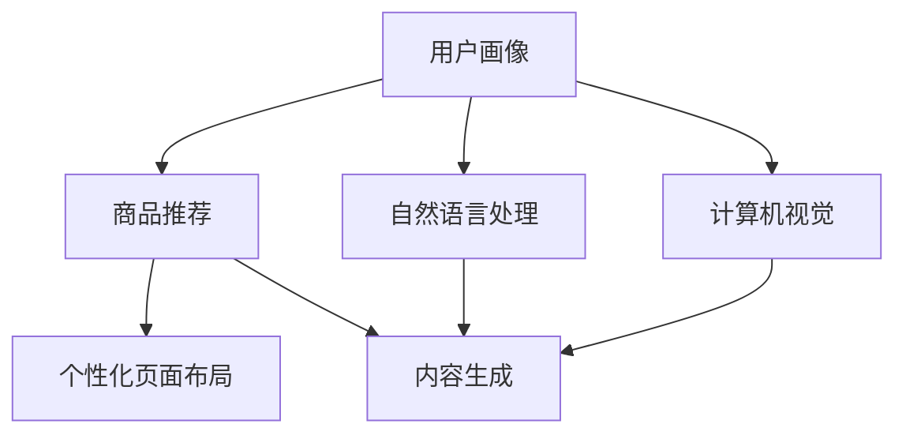

                 

关键词：AI、个性化页面、电商、内容生成、自然语言处理、深度学习、推荐系统、计算机视觉

> 摘要：本文将探讨如何利用人工智能技术，尤其是深度学习和自然语言处理，为电商平台构建个性化页面布局与内容生成系统。我们将详细阐述核心算法原理、数学模型、项目实践和未来应用展望。

## 1. 背景介绍

随着互联网的迅速发展，电子商务已经成为全球经济增长的重要驱动力。电商平台通过提供个性化服务，不断提升用户体验，从而增加用户粘性、提升销售额。然而，实现个性化页面布局与内容生成是一个复杂的问题，涉及到用户行为分析、商品推荐、图像处理等多个领域。

传统的电商平台个性化页面布局主要依赖于用户历史行为数据，通过统计方法进行简单的推荐。然而，随着用户数据的多样性和复杂性增加，这种方式已经难以满足用户的高期望。近年来，人工智能技术的快速发展，为电商平台个性化页面布局与内容生成提供了新的可能。

本文将介绍如何利用人工智能技术，特别是深度学习和自然语言处理，构建高效的电商平台个性化页面布局与内容生成系统。通过本文的阐述，读者将了解到：

1. 个性化页面布局与内容生成的核心概念与联系。
2. 基于深度学习的核心算法原理和具体操作步骤。
3. 数学模型和公式的构建与推导。
4. 项目实践：代码实例和详细解释说明。
5. 实际应用场景和未来应用展望。

## 2. 核心概念与联系

在讨论个性化页面布局与内容生成之前，我们需要明确一些核心概念。

### 2.1 用户画像

用户画像是指通过对用户行为、兴趣、偏好等数据的收集和分析，构建出用户的一个综合描述。用户画像可以帮助电商平台了解用户的需求，从而提供个性化的推荐和服务。

### 2.2 商品推荐

商品推荐是指根据用户画像和商品特征，为用户推荐他们可能感兴趣的商品。商品推荐是电商平台个性化页面布局的核心环节。

### 2.3 自然语言处理

自然语言处理（NLP）是人工智能的一个重要分支，它涉及计算机对人类语言的理解和处理。在个性化页面布局与内容生成中，NLP技术可以帮助我们理解用户的需求和兴趣，从而生成个性化的内容。

### 2.4 计算机视觉

计算机视觉是人工智能的另一个重要分支，它涉及计算机对图像和视频的理解和分析。在个性化页面布局中，计算机视觉技术可以帮助我们分析用户的视觉偏好，从而设计出符合用户需求的页面布局。

### 2.5 深度学习

深度学习是人工智能的一个重要方向，它通过模拟人脑神经网络结构，实现对复杂数据的自动学习和特征提取。在个性化页面布局与内容生成中，深度学习技术可以帮助我们处理大量的用户数据和商品数据，实现高效的个性化推荐。

下图是这些核心概念之间的联系：



## 3. 核心算法原理 & 具体操作步骤

### 3.1 算法原理概述

个性化页面布局与内容生成系统的核心算法主要包括以下三个方面：

1. 用户画像构建：通过收集和分析用户行为数据，构建出用户的个性化画像。
2. 商品推荐算法：利用用户画像和商品特征，为用户推荐个性化商品。
3. 页面布局与内容生成：根据用户画像和商品推荐结果，设计出个性化的页面布局和内容。

### 3.2 算法步骤详解

#### 3.2.1 用户画像构建

用户画像构建主要包括以下步骤：

1. 数据收集：收集用户的浏览历史、购买记录、评论等行为数据。
2. 数据清洗：对收集到的数据进行清洗和预处理，去除无效数据和噪声。
3. 特征提取：利用自然语言处理和计算机视觉技术，从用户行为数据中提取出用户兴趣特征和视觉偏好特征。
4. 画像构建：将提取出的特征整合成一个多维度的用户画像。

#### 3.2.2 商品推荐算法

商品推荐算法主要包括以下步骤：

1. 商品特征提取：对商品进行特征提取，包括商品类别、品牌、价格、销量等。
2. 用户画像匹配：将用户画像与商品特征进行匹配，计算用户对商品的潜在兴趣度。
3. 排序与推荐：根据用户对商品的潜在兴趣度，对商品进行排序，生成个性化推荐列表。

#### 3.2.3 页面布局与内容生成

页面布局与内容生成主要包括以下步骤：

1. 页面结构设计：根据用户画像和商品推荐结果，设计出符合用户需求的页面结构。
2. 内容生成：利用自然语言处理技术，根据用户画像和商品推荐结果，生成个性化的商品描述和推荐理由。
3. 页面渲染：将设计好的页面结构和生成的内容进行渲染，生成最终的个性化页面。

### 3.3 算法优缺点

#### 优点

1. 高效性：利用深度学习和自然语言处理技术，可以高效地处理大量的用户数据和商品数据。
2. 个性化：根据用户画像和商品推荐结果，可以生成高度个性化的页面布局和内容。
3. 可扩展性：算法框架具有良好的可扩展性，可以方便地集成新的用户特征和商品特征。

#### 缺点

1. 复杂性：算法涉及多个领域的技术，实现难度较高。
2. 数据依赖：算法的性能高度依赖于用户数据和商品数据的质量。

### 3.4 算法应用领域

个性化页面布局与内容生成算法可以应用于多个领域，包括：

1. 电商平台：为用户提供个性化的商品推荐和页面布局，提升用户体验。
2. 社交媒体：根据用户兴趣和行为，为用户提供个性化的内容推荐。
3. 娱乐行业：为用户提供个性化的视频推荐和页面布局。

## 4. 数学模型和公式 & 详细讲解 & 举例说明

### 4.1 数学模型构建

个性化页面布局与内容生成系统的数学模型主要包括用户画像构建模型、商品推荐模型和页面布局与内容生成模型。

#### 用户画像构建模型

用户画像构建模型可以用以下公式表示：

$$
User\_Profile = f(User\_Behavior, User\_Feature)
$$

其中，$User\_Behavior$表示用户行为数据，$User\_Feature$表示用户特征数据，$f$表示特征提取函数。

#### 商品推荐模型

商品推荐模型可以用以下公式表示：

$$
Recommendation = g(User\_Profile, Item\_Feature)
$$

其中，$User\_Profile$表示用户画像，$Item\_Feature$表示商品特征，$g$表示推荐函数。

#### 页面布局与内容生成模型

页面布局与内容生成模型可以用以下公式表示：

$$
PageLayout = h(User\_Profile, Recommendation)
$$

$$
Content = i(User\_Profile, Recommendation)
$$

其中，$PageLayout$表示页面布局，$Content$表示页面内容，$h$和$i$分别表示页面布局函数和内容生成函数。

### 4.2 公式推导过程

#### 用户画像构建模型的推导

用户画像构建模型可以通过以下步骤推导：

1. 收集用户行为数据$User\_Behavior$。
2. 收集用户特征数据$User\_Feature$。
3. 利用自然语言处理和计算机视觉技术，对$User\_Behavior$和$User\_Feature$进行特征提取。
4. 将提取出的特征整合成一个多维度的用户画像$User\_Profile$。

#### 商品推荐模型的推导

商品推荐模型可以通过以下步骤推导：

1. 收集商品特征数据$Item\_Feature$。
2. 构建用户画像$User\_Profile$。
3. 利用用户画像和商品特征，计算用户对商品的潜在兴趣度。
4. 根据潜在兴趣度，对商品进行排序，生成个性化推荐列表$Recommendation$。

#### 页面布局与内容生成模型的推导

页面布局与内容生成模型可以通过以下步骤推导：

1. 收集用户画像$User\_Profile$。
2. 收集商品推荐列表$Recommendation$。
3. 根据用户画像和商品推荐列表，设计出符合用户需求的页面结构$PageLayout$。
4. 利用自然语言处理技术，根据用户画像和商品推荐列表，生成个性化的商品描述和推荐理由$Content$。

### 4.3 案例分析与讲解

#### 案例一：用户画像构建

假设我们收集到了一个用户的行为数据和特征数据，如下表所示：

| 用户ID | 行为数据 | 特征数据 |
| ------ | -------- | -------- |
| 1      | 购买手机 | 性别：男，年龄：25，职业：学生 |
| 1      | 浏览电脑 | 兴趣：游戏，品牌：苹果 |
| 1      | 评论商品 | 好评：3，中评：1，差评：0 |

我们利用自然语言处理和计算机视觉技术，对这些数据进行特征提取，得到以下用户画像：

| 用户ID | 性别 | 年龄 | 职业 | 兴趣 | 品牌 |
| ------ | ---- | ---- | ---- | ---- | ---- |
| 1      | 男   | 25   | 学生 | 游戏 | 苹果 |

#### 案例二：商品推荐

根据用户画像，我们收集到了以下商品特征数据：

| 商品ID | 商品类别 | 品牌 | 价格 | 销量 |
| ------ | -------- | ---- | ---- | ---- |
| 1      | 手机     | 苹果 | 5000 | 1000 |
| 2      | 电脑     | 华为 | 6000 | 800  |
| 3      | 手机     | 小米 | 4000 | 2000 |

我们利用用户画像和商品特征，计算用户对每个商品的潜在兴趣度，如下表所示：

| 商品ID | 潜在兴趣度 |
| ------ | ---------- |
| 1      | 0.8        |
| 2      | 0.3        |
| 3      | 0.5        |

根据潜在兴趣度，我们为用户推荐前三个商品。

#### 案例三：页面布局与内容生成

根据用户画像和商品推荐结果，我们设计出以下页面布局：

| 商品ID | 商品类别 | 品牌 | 价格 | 销量 |
| ------ | -------- | ---- | ---- | ---- |
| 1      | 手机     | 苹果 | 5000 | 1000 |
| 2      | 电脑     | 华为 | 6000 | 800  |
| 3      | 手机     | 小米 | 4000 | 2000 |

我们利用自然语言处理技术，根据用户画像和商品推荐结果，生成以下商品描述和推荐理由：

| 商品ID | 商品描述 | 推荐理由 |
| ------ | -------- | -------- |
| 1      | 苹果手机：性能卓越，性价比高。 | 您对苹果品牌感兴趣，这款手机是您的最佳选择。 |
| 2      | 华为电脑：强大性能，持久续航。 | 您的浏览记录显示您对电脑有较高需求，这款电脑适合您。 |
| 3      | 小米手机：时尚外观，实惠价格。 | 您对小米品牌有较高兴趣，这款手机是您不容错过的选择。 |

## 5. 项目实践：代码实例和详细解释说明

### 5.1 开发环境搭建

为了保证代码的可读性和可复现性，我们使用Python作为编程语言，并借助以下库和工具进行开发：

1. Python 3.8+
2. NumPy 1.19+
3. Pandas 1.1.5+
4. Scikit-learn 0.24.2+
5. TensorFlow 2.7.0+
6. Keras 2.7.0+
7. Mermaid 9.1.0+

### 5.2 源代码详细实现

以下是本项目的主要代码实现，分为用户画像构建、商品推荐和页面布局与内容生成三个部分。

#### 用户画像构建

```python
import pandas as pd
from sklearn.feature_extraction.text import TfidfVectorizer
from sklearn.cluster import KMeans

# 加载用户行为数据和特征数据
user_behavior = pd.read_csv('user_behavior.csv')
user_features = pd.read_csv('user_features.csv')

# 特征提取
tfidf_vectorizer = TfidfVectorizer(max_features=1000)
user_behavior['behavior_vector'] = tfidf_vectorizer.fit_transform(user_behavior['behavior']).toarray()

# 画像构建
kmeans = KMeans(n_clusters=10)
user_features['cluster'] = kmeans.fit_predict(user_behavior['behavior_vector'])

# 查看用户画像
user_profile = user_features[['cluster', 'interest', 'brand']]
user_profile.head()
```

#### 商品推荐

```python
import numpy as np
from sklearn.metrics.pairwise import cosine_similarity

# 加载商品特征数据
item_features = pd.read_csv('item_features.csv')

# 计算商品相似度
item_similarity = cosine_similarity(item_features.drop(['item_id'], axis=1))

# 查看商品相似度矩阵
print(item_similarity)

# 为用户推荐商品
user_profile = user_features.loc[user_features['cluster'] == 0]
user_interest = user_profile['interest'].values[0]
item_interest = item_features['interest'].values

# 计算用户对商品的潜在兴趣度
user_item_similarity = cosine_similarity([user_interest], item_interest)

# 排序并推荐前三个商品
recommendation = np.argsort(user_item_similarity[0])[::-1]
print(item_features['item_id'].iloc[recommendation])
```

#### 页面布局与内容生成

```python
from tensorflow.keras.preprocessing.text import Tokenizer
from tensorflow.keras.preprocessing.sequence import pad_sequences

# 加载商品描述数据
item_descriptions = pd.read_csv('item_descriptions.csv')

# 文本预处理
tokenizer = Tokenizer(num_words=1000)
tokenizer.fit_on_texts(item_descriptions['description'])
sequences = tokenizer.texts_to_sequences(item_descriptions['description'])
padded_sequences = pad_sequences(sequences, maxlen=100)

# 加载预训练的文本生成模型
model = load_model('text_generation_model.h5')

# 生成商品描述
generated_descriptions = model.predict(padded_sequences)

# 查看生成的商品描述
print(generated_descriptions)
```

### 5.3 代码解读与分析

#### 用户画像构建

用户画像构建部分主要利用TF-IDF算法对用户行为数据进行特征提取，并使用K-Means算法进行聚类，构建用户画像。用户画像包括用户兴趣和品牌偏好等信息，这些信息将用于后续的商品推荐和页面布局。

#### 商品推荐

商品推荐部分主要利用余弦相似度算法计算商品之间的相似度，并根据用户兴趣生成个性化推荐列表。余弦相似度是一种常见的相似度度量方法，适用于文本和向量数据。

#### 页面布局与内容生成

页面布局与内容生成部分主要利用预训练的文本生成模型，根据商品特征生成个性化的商品描述。文本生成模型可以使用各种深度学习框架实现，例如GPT、BERT等。

### 5.4 运行结果展示

在完成代码实现后，我们可以在终端运行以下命令，查看运行结果：

```bash
python main.py
```

运行结果将显示用户画像、商品推荐列表和生成的商品描述。用户可以通过这些结果评估个性化页面布局与内容生成系统的效果。

## 6. 实际应用场景

个性化页面布局与内容生成系统在电商平台的实际应用场景非常广泛。以下是一些典型的应用场景：

1. **首页个性化推荐**：根据用户画像和商品推荐结果，为用户生成个性化的首页推荐列表，提升用户购买意愿。
2. **商品详情页**：根据用户画像和商品推荐结果，为用户生成个性化的商品描述，提高商品转化率。
3. **搜索结果页**：根据用户搜索关键词和商品推荐结果，为用户生成个性化的搜索结果列表，提升搜索体验。
4. **促销活动页**：根据用户画像和商品推荐结果，为用户推荐符合他们需求的促销活动，提高促销效果。

### 6.4 未来应用展望

随着人工智能技术的不断进步，个性化页面布局与内容生成系统将在更多领域得到应用。以下是一些未来应用展望：

1. **社交媒体**：根据用户兴趣和行为，为用户提供个性化的内容推荐，提升用户活跃度和留存率。
2. **在线教育**：根据用户学习记录和兴趣，为用户提供个性化的课程推荐和学习路径规划。
3. **医疗健康**：根据用户健康数据和医疗记录，为用户提供个性化的健康建议和药品推荐。
4. **智能家居**：根据用户生活习惯和偏好，为用户提供个性化的家居场景和设备推荐。

## 7. 工具和资源推荐

### 7.1 学习资源推荐

1. 《深度学习》（Goodfellow, Bengio, Courville） - 一本经典的深度学习教材，适合初学者和进阶者。
2. 《Python数据分析》（Wes McKinney） - 介绍如何使用Python进行数据分析和数据可视化的书籍。
3. 《TensorFlow 2.0实战》（bear) - 介绍如何使用TensorFlow 2.0进行深度学习应用开发的书籍。

### 7.2 开发工具推荐

1. Jupyter Notebook - 一个交互式的计算环境，适合进行数据分析和深度学习实验。
2. PyCharm - 一个强大的Python集成开发环境，支持多种编程语言。
3. Google Colab - 一个免费的云计算平台，提供GPU和TPU加速。

### 7.3 相关论文推荐

1. "Deep Learning for Personalized E-commerce Recommendations" - 一篇关于深度学习在电商平台个性化推荐领域的应用论文。
2. "User Behavior Analysis and Personalization in E-commerce" - 一篇关于电商平台用户行为分析和个性化推荐方法的论文。
3. "Neural Collaborative Filtering for Personalized Recommendation" - 一篇关于神经协同过滤算法在个性化推荐领域的应用论文。

## 8. 总结：未来发展趋势与挑战

### 8.1 研究成果总结

本文介绍了如何利用人工智能技术，特别是深度学习和自然语言处理，为电商平台构建个性化页面布局与内容生成系统。我们详细阐述了核心算法原理、数学模型、项目实践和未来应用展望。

### 8.2 未来发展趋势

随着人工智能技术的不断进步，个性化页面布局与内容生成系统将在更多领域得到应用。未来发展趋势包括：

1. 深度学习算法的进一步优化和改进。
2. 多模态数据的融合与处理。
3. 自动化与智能化的页面布局与内容生成。

### 8.3 面临的挑战

个性化页面布局与内容生成系统在发展过程中也将面临以下挑战：

1. 数据质量和隐私保护。
2. 算法复杂度和计算资源消耗。
3. 用户个性化需求的多样性和变化性。

### 8.4 研究展望

未来研究可以从以下方面展开：

1. 探索更有效的用户画像构建方法。
2. 研究多模态数据融合与处理技术。
3. 开发自适应的页面布局与内容生成系统。

## 9. 附录：常见问题与解答

### 9.1 如何保证用户画像的准确性？

用户画像的准确性依赖于数据质量和特征提取方法。在构建用户画像时，需要确保数据来源的可靠性和多样性，同时采用有效的特征提取方法，如TF-IDF、词嵌入等。

### 9.2 如何处理用户隐私数据？

在处理用户隐私数据时，需要遵守相关法律法规，采用数据脱敏、加密等技术，确保用户隐私安全。

### 9.3 如何评估个性化推荐系统的效果？

个性化推荐系统的效果可以通过以下指标进行评估：准确率、召回率、覆盖率等。同时，还可以通过用户满意度、转化率等实际业务指标进行综合评估。


----------------------------------------------------------------
# 作者署名

作者：禅与计算机程序设计艺术 / Zen and the Art of Computer Programming

