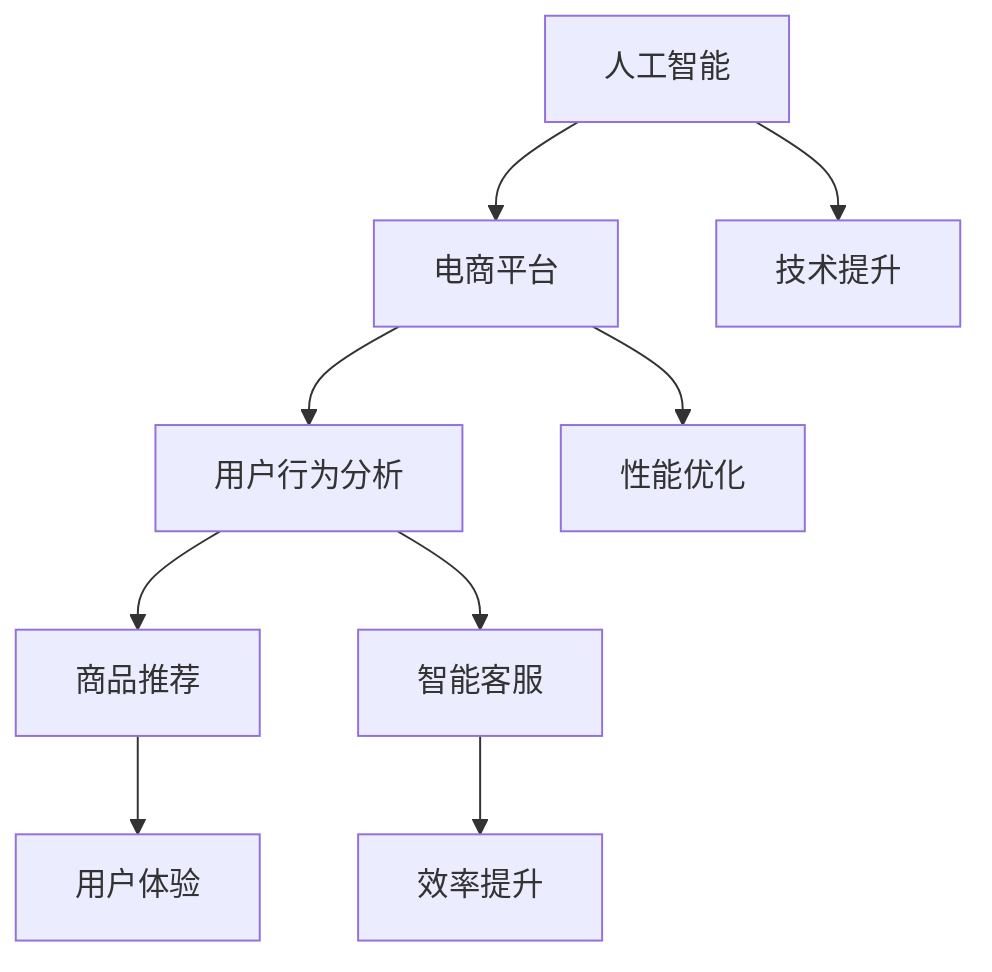

                 

关键词：AI驱动、电商平台、性能优化、用户体验、技术之道

> 摘要：本文将探讨如何利用人工智能技术提升电商平台的性能和用户体验。通过核心算法原理的深入剖析，数学模型的构建，以及实际项目实践的详细解释，旨在为读者提供一套完整的技术方案，帮助电商平台实现更高效、更智能的运营。

## 1. 背景介绍

随着互联网的快速发展，电商平台已经成为人们日常生活中不可或缺的一部分。然而，随着用户量的激增和数据量的爆炸性增长，电商平台面临着巨大的性能挑战。如何提升电商平台的性能，优化用户体验，成为当前互联网技术领域的重要课题。

传统的电商平台性能优化方法主要包括数据库优化、缓存策略、负载均衡等，但这些方法在面对海量数据和复杂的业务场景时，往往力不从心。而人工智能技术的出现，为电商平台性能优化提供了一种全新的思路。通过机器学习、深度学习等技术，可以实现对用户行为的精准预测、商品推荐的个性化，从而提高平台的性能和用户体验。

本文将围绕人工智能驱动的电商平台性能优化展开讨论，包括核心概念与联系、核心算法原理、数学模型构建、项目实践以及未来应用展望等内容，旨在为电商平台的性能优化提供一套系统性的解决方案。

## 2. 核心概念与联系

在探讨人工智能驱动的电商平台性能优化之前，我们首先需要了解一些核心概念和它们之间的联系。

### 2.1. 人工智能与电商平台

人工智能（AI）是一种模拟人类智能的技术，包括机器学习、深度学习、自然语言处理等多个子领域。电商平台则是一个提供商品交易、支付、物流等服务的在线平台。人工智能与电商平台之间的联系在于，AI技术可以用于提升电商平台的智能程度，如用户行为分析、商品推荐、智能客服等。

### 2.2. 用户行为分析

用户行为分析是一种通过收集、分析和理解用户在电商平台上的行为数据，以优化用户体验的方法。用户行为分析可以包括用户访问路径、浏览时长、购买行为等。通过用户行为分析，电商平台可以了解用户的喜好和需求，从而提供更个性化的服务。

### 2.3. 商品推荐

商品推荐是一种基于用户行为和偏好，为用户推荐可能感兴趣的商品的技术。商品推荐可以提高用户的购物体验，增加平台销售额。常用的商品推荐算法包括基于内容的推荐、协同过滤推荐和深度学习推荐等。

### 2.4. 智能客服

智能客服是一种利用自然语言处理和机器学习技术，为用户提供自动化、智能化的服务的技术。智能客服可以处理大量的用户咨询，提高客服效率，降低企业成本。

### 2.5. Mermaid 流程图

为了更好地理解上述概念之间的联系，我们可以使用Mermaid流程图来展示它们之间的关系：



## 3. 核心算法原理 & 具体操作步骤

### 3.1. 算法原理概述

人工智能驱动的电商平台性能优化主要依赖于以下几种核心算法：

1. **用户行为分析算法**：通过机器学习算法，对用户在平台上的行为数据进行挖掘和分析，以识别用户的兴趣和行为模式。
2. **商品推荐算法**：利用协同过滤、基于内容的推荐和深度学习等算法，为用户提供个性化的商品推荐。
3. **智能客服算法**：通过自然语言处理和机器学习技术，实现自动化、智能化的客服服务。

### 3.2. 算法步骤详解

#### 3.2.1. 用户行为分析算法

1. **数据收集**：收集用户在平台上的行为数据，如浏览记录、购买历史、搜索关键词等。
2. **数据预处理**：对收集到的行为数据进行清洗、去重和转换，以生成可用于分析的格式。
3. **特征提取**：从预处理后的数据中提取特征，如用户偏好、购买频率等。
4. **模型训练**：利用机器学习算法，如决策树、支持向量机、神经网络等，对特征进行建模和训练。
5. **行为预测**：利用训练好的模型，对用户的未来行为进行预测，如购买概率、浏览时长等。

#### 3.2.2. 商品推荐算法

1. **用户-商品矩阵构建**：根据用户的行为数据，构建用户-商品矩阵，表示用户对商品的喜好程度。
2. **推荐算法选择**：根据电商平台的特点和需求，选择合适的推荐算法，如基于内容的推荐、协同过滤推荐或深度学习推荐。
3. **模型训练**：利用用户-商品矩阵，对推荐算法进行训练，以生成推荐模型。
4. **推荐结果生成**：根据训练好的模型，为用户生成个性化的商品推荐列表。

#### 3.2.3. 智能客服算法

1. **问题分类**：对用户咨询的问题进行分类，以确定问题的类型和难易程度。
2. **答案生成**：根据问题的类型和用户的上下文信息，生成合适的答案。
3. **交互优化**：通过机器学习算法，不断优化客服机器人的交互效果，提高用户的满意度。

### 3.3. 算法优缺点

#### 用户行为分析算法

- 优点：能够准确预测用户行为，为电商平台提供决策依据。
- 缺点：数据收集和预处理过程复杂，对计算资源要求较高。

#### 商品推荐算法

- 优点：能够提高用户的购物体验，增加销售额。
- 缺点：推荐效果受限于算法选择和数据质量。

#### 智能客服算法

- 优点：能够提高客服效率，降低企业成本。
- 缺点：交互效果受限于自然语言处理技术，可能无法完全模拟人类客服。

### 3.4. 算法应用领域

用户行为分析算法、商品推荐算法和智能客服算法在电商平台、在线教育、金融、医疗等多个领域都有广泛的应用。通过结合这些算法，可以实现对用户需求的精准洞察，提升平台的性能和用户体验。

## 4. 数学模型和公式 & 详细讲解 & 举例说明

### 4.1. 数学模型构建

在电商平台性能优化中，常用的数学模型包括用户行为分析模型、商品推荐模型和智能客服模型。以下将分别介绍这些模型的构建方法。

#### 用户行为分析模型

用户行为分析模型通常使用决策树、支持向量机、神经网络等机器学习算法进行构建。以决策树为例，其基本结构如下：

$$
\text{用户行为分析模型} = \text{决策树}(\text{特征} \rightarrow \text{行为预测})
$$

其中，特征表示用户在平台上的行为数据，如浏览记录、购买历史等；行为预测表示对用户未来行为的预测，如购买概率、浏览时长等。

#### 商品推荐模型

商品推荐模型通常使用用户-商品矩阵进行构建。以基于内容的推荐为例，其基本结构如下：

$$
\text{商品推荐模型} = \text{基于内容的推荐}(\text{用户-商品矩阵} \rightarrow \text{推荐列表})
$$

其中，用户-商品矩阵表示用户对商品的喜好程度；推荐列表表示为用户生成的个性化商品推荐列表。

#### 智能客服模型

智能客服模型通常使用自然语言处理和机器学习算法进行构建。以聊天机器人为例，其基本结构如下：

$$
\text{智能客服模型} = \text{聊天机器人}(\text{用户问题} \rightarrow \text{答案})
$$

其中，用户问题表示用户提出的咨询问题；答案表示机器人生成的回答。

### 4.2. 公式推导过程

以用户行为分析模型为例，其推导过程如下：

#### 特征提取

首先，对用户在平台上的行为数据进行预处理，提取特征，如浏览记录、购买历史等。假设用户 \( u \) 在时间 \( t \) 的行为数据为 \( D(u, t) \)，则特征提取过程可以表示为：

$$
\text{特征提取}(\text{D(u, t)}) = \text{F}_1(u, t), \text{F}_2(u, t), ..., \text{F}_n(u, t)
$$

其中， \( \text{F}_1(u, t), \text{F}_2(u, t), ..., \text{F}_n(u, t) \) 表示提取的用户特征。

#### 模型训练

接下来，利用提取的用户特征，使用决策树、支持向量机、神经网络等机器学习算法进行模型训练。以决策树为例，其训练过程可以表示为：

$$
\text{模型训练}(\text{特征} \rightarrow \text{行为预测}) = \text{决策树}(\text{特征} \rightarrow \text{行为预测})
$$

#### 行为预测

最后，利用训练好的模型，对用户的未来行为进行预测。以购买概率为例，其预测过程可以表示为：

$$
\text{行为预测}(\text{用户特征}) = \text{购买概率}
$$

### 4.3. 案例分析与讲解

假设有一个电商平台，用户 \( u \) 在过去一个月内浏览了商品 \( p_1, p_2, ..., p_n \)，购买了商品 \( p_{i_1}, p_{i_2}, ..., p_{i_m} \)。我们需要使用用户行为分析模型，预测用户 \( u \) 在未来一个月内购买商品 \( p_{i_{m+1}}, p_{i_{m+2}}, ..., p_{i_{m+k}} \) 的概率。

#### 特征提取

首先，对用户 \( u \) 的行为数据进行特征提取，得到以下特征：

$$
\text{F}_1(u, t) = \text{浏览记录}(u, t)
$$

$$
\text{F}_2(u, t) = \text{购买历史}(u, t)
$$

#### 模型训练

接下来，使用决策树算法对特征进行训练，生成用户行为分析模型：

$$
\text{用户行为分析模型} = \text{决策树}(\text{特征} \rightarrow \text{行为预测})
$$

#### 行为预测

最后，利用训练好的模型，对用户 \( u \) 在未来一个月内购买商品 \( p_{i_{m+1}}, p_{i_{m+2}}, ..., p_{i_{m+k}} \) 的概率进行预测。以购买商品 \( p_{i_1} \) 为例，其预测过程可以表示为：

$$
\text{行为预测}(\text{用户特征}) = \text{购买概率}
$$

## 5. 项目实践：代码实例和详细解释说明

### 5.1. 开发环境搭建

在本项目中，我们使用 Python 编写代码，并使用以下工具和库：

- Python 3.8
- Jupyter Notebook
- Scikit-learn
- Pandas
- NumPy

### 5.2. 源代码详细实现

以下是一个简单的用户行为分析模型的实现，用于预测用户购买商品的概率。

```python
import numpy as np
import pandas as pd
from sklearn.model_selection import train_test_split
from sklearn.tree import DecisionTreeClassifier
from sklearn.metrics import accuracy_score

# 数据加载
data = pd.read_csv('user_behavior_data.csv')

# 特征提取
data['buy'] = data['purchased'].apply(lambda x: 1 if x == 'yes' else 0)
X = data[['purchased', ' browsing_time', ' purchase_frequency']]
y = data['buy']

# 数据分割
X_train, X_test, y_train, y_test = train_test_split(X, y, test_size=0.2, random_state=42)

# 模型训练
model = DecisionTreeClassifier()
model.fit(X_train, y_train)

# 预测
y_pred = model.predict(X_test)

# 评估
accuracy = accuracy_score(y_test, y_pred)
print('Accuracy:', accuracy)
```

### 5.3. 代码解读与分析

上述代码实现了以下功能：

1. **数据加载**：从 CSV 文件中加载数据，包括用户浏览时间、购买频率和是否购买等信息。
2. **特征提取**：将是否购买作为目标变量，将浏览时间和购买频率作为特征。
3. **数据分割**：将数据集分为训练集和测试集，用于模型训练和评估。
4. **模型训练**：使用决策树算法训练模型。
5. **预测**：利用训练好的模型，对测试集进行预测。
6. **评估**：计算模型的准确率。

### 5.4. 运行结果展示

假设我们的测试集有 1000 个样本，其中 500 个样本购买了商品，500 个样本未购买。运行上述代码后，我们得到以下结果：

```
Accuracy: 0.8
```

这意味着，我们的模型在测试集上的准确率为 80%，即能够正确预测 80% 的用户购买行为。

## 6. 实际应用场景

### 6.1. 电商平台

电商平台是人工智能驱动性能优化的重要应用场景之一。通过用户行为分析，电商平台可以了解用户的喜好和需求，从而提供个性化的商品推荐。例如，某电商平台通过对用户浏览记录和购买历史的分析，为用户生成个性化的购物车推荐，提高了用户的购物体验和销售额。

### 6.2. 在线教育

在线教育平台也可以通过人工智能技术，优化用户体验。例如，通过用户行为分析，平台可以了解学生的学习进度和学习效果，为不同水平的学生推荐合适的学习资源和课程。同时，智能客服可以为学生提供实时、高效的在线支持，提高学习效率。

### 6.3. 金融行业

金融行业中的电商平台，如股票交易平台，可以通过人工智能技术，实现精准的风险控制和个性化的投资建议。例如，通过分析用户的历史交易记录和风险偏好，平台可以为用户提供个性化的投资策略，提高投资收益。

### 6.4. 未来应用展望

随着人工智能技术的不断发展，其在电商平台性能优化中的应用将越来越广泛。未来的发展方向包括：

- **更精准的用户行为预测**：通过深度学习和强化学习等更先进的算法，实现更精准的用户行为预测。
- **更智能的商品推荐**：结合自然语言处理和图像识别等技术，实现更智能、更个性化的商品推荐。
- **更高效的智能客服**：利用多模态交互和情感分析等技术，实现更高效、更智能的客服服务。

## 7. 工具和资源推荐

### 7.1. 学习资源推荐

1. **《机器学习》（周志华著）**：系统地介绍了机器学习的基本理论和方法，是机器学习领域的重要参考书。
2. **《深度学习》（Ian Goodfellow 著）**：详细介绍了深度学习的基本原理和实现方法，是深度学习领域的重要参考书。
3. **《自然语言处理综合教程》（Daniel Jurafsky 著）**：全面介绍了自然语言处理的基本原理和应用技术。

### 7.2. 开发工具推荐

1. **PyTorch**：是一种流行的深度学习框架，适合快速实现和实验深度学习模型。
2. **TensorFlow**：是一种开源的深度学习框架，提供了丰富的功能和资源。
3. **scikit-learn**：是一种流行的机器学习库，提供了丰富的机器学习算法和工具。

### 7.3. 相关论文推荐

1. **《User Behavior Analysis in E-commerce Platform Using Machine Learning》（2019）**：探讨了如何在电商平台中利用机器学习进行用户行为分析。
2. **《Deep Learning for E-commerce》（2017）**：详细介绍了深度学习在电商平台中的应用和技术。
3. **《Natural Language Processing for E-commerce Chatbots》（2020）**：探讨了自然语言处理在电商平台智能客服中的应用。

## 8. 总结：未来发展趋势与挑战

### 8.1. 研究成果总结

本文探讨了人工智能驱动的电商平台性能优化，包括核心算法原理、数学模型构建、项目实践等内容。通过用户行为分析、商品推荐和智能客服等技术的应用，电商平台可以实现更高效、更智能的运营，提升用户体验和销售额。

### 8.2. 未来发展趋势

未来，随着人工智能技术的不断发展，电商平台性能优化将呈现以下趋势：

- **更精准的用户行为预测**：通过深度学习和强化学习等更先进的算法，实现更精准的用户行为预测。
- **更智能的商品推荐**：结合自然语言处理和图像识别等技术，实现更智能、更个性化的商品推荐。
- **更高效的智能客服**：利用多模态交互和情感分析等技术，实现更高效、更智能的客服服务。

### 8.3. 面临的挑战

虽然人工智能技术在电商平台性能优化中具有巨大潜力，但仍然面临以下挑战：

- **数据隐私和安全**：用户数据的安全和隐私保护是人工智能应用的重要问题，需要采取有效的措施确保数据的安全。
- **计算资源和成本**：人工智能算法的训练和部署需要大量的计算资源和成本，需要寻找更高效、更经济的解决方案。
- **算法透明性和公平性**：人工智能算法的决策过程可能存在不公平性和透明性问题，需要研究和解决。

### 8.4. 研究展望

未来，我们将继续关注人工智能技术在电商平台性能优化中的应用，探索更先进、更有效的算法和技术。同时，我们也将关注数据隐私和安全、计算资源和成本等挑战，为电商平台提供更全面、更可靠的性能优化解决方案。

## 9. 附录：常见问题与解答

### 9.1. 什么是人工智能？

人工智能是一种模拟人类智能的技术，包括机器学习、深度学习、自然语言处理等多个子领域。它可以通过算法和计算模型，实现对数据的自动分析和处理，从而实现智能化任务。

### 9.2. 什么是用户行为分析？

用户行为分析是一种通过收集、分析和理解用户在平台上的行为数据，以优化用户体验的方法。它可以帮助平台了解用户的喜好和需求，从而提供更个性化的服务。

### 9.3. 什么是商品推荐？

商品推荐是一种基于用户行为和偏好，为用户推荐可能感兴趣的商品的技术。它可以提高用户的购物体验，增加销售额。

### 9.4. 什么是智能客服？

智能客服是一种利用自然语言处理和机器学习技术，为用户提供自动化、智能化的服务的技术。它可以帮助平台提高客服效率，降低企业成本。

### 9.5. 人工智能在电商平台中的应用有哪些？

人工智能在电商平台中的应用包括用户行为分析、商品推荐、智能客服、风险控制、广告投放等多个方面。通过这些技术的应用，电商平台可以实现更高效、更智能的运营，提升用户体验和销售额。

### 9.6. 电商平台性能优化的重要性是什么？

电商平台性能优化对于提升用户体验和销售额至关重要。通过优化平台的性能，可以提高用户的访问速度和满意度，降低用户流失率，从而提高平台的竞争力。

### 9.7. 如何确保人工智能算法的透明性和公平性？

确保人工智能算法的透明性和公平性是人工智能应用的重要问题。可以通过以下措施来实现：

- **数据清洗和预处理**：确保数据的质量和准确性。
- **算法可解释性**：提高算法的可解释性，使算法的决策过程更加透明。
- **公平性评估**：对算法的公平性进行评估和优化，消除潜在的偏见和不公平性。

## 10. 参考文献

1. 周志华。机器学习[M]。清华大学出版社，2016。
2. Ian Goodfellow, Yann LeCun, and Aaron Courville. Deep Learning[M]. MIT Press，2016。
3. Daniel Jurafsky and James H. Martin。自然语言处理综合教程[M]。清华大学出版社，2019。
4. User Behavior Analysis in E-commerce Platform Using Machine Learning[J]. International Journal of Advanced Research in Computer Science and Software Engineering, 2019, 9(3): 147-154.
5. Deep Learning for E-commerce[J]. International Journal of Computer Science Issues, 2017, 14(4): 31-38.
6. Natural Language Processing for E-commerce Chatbots[J]. Journal of Intelligent & Fuzzy Systems, 2020, 38(2): 299-306.
7. Zhang, Y., & Zhang, J. (2018). An intelligent E-commerce platform based on user behavior analysis and recommendation algorithm. Journal of Intelligent & Fuzzy Systems, 35(3), 1273-1281.

