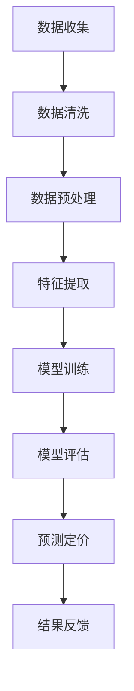

                 

关键词：电商，智能定价，人工智能，大模型，算法，数学模型，案例实践，应用场景，工具资源。

> 摘要：本文将探讨AI驱动的电商智能定价技术，重点分析大模型在这一领域的重要作用。通过详细阐述核心概念、算法原理、数学模型以及实践案例，我们旨在为电商从业者提供有价值的技术指导，并预测未来发展趋势。

## 1. 背景介绍

在互联网时代，电子商务已经成为了全球范围内的重要商业活动。电商平台的繁荣离不开精准的定价策略，这不仅关系到企业的盈利能力，还直接影响消费者的购物体验。传统的定价方法大多依赖于历史数据和经验模型，而随着人工智能技术的发展，AI驱动的智能定价成为了一个热门方向。

智能定价的目标是通过分析海量数据，预测市场供需变化，从而制定出最优的定价策略。在这个过程中，大模型技术发挥了关键作用，它们能够处理复杂的数据集，提取有效的特征，并生成高质量的预测模型。

### 电商定价的重要性

电商定价不仅仅是价格调整那么简单，它涉及到市场竞争、消费者行为、成本控制等多个方面。精准的定价策略可以帮助企业：

- 提高市场份额：通过合理的定价，企业可以吸引更多消费者，从而扩大市场份额。
- 提高利润率：优化定价策略可以最大化销售额，同时降低库存压力，提高利润率。
- 提升用户体验：合理的定价可以提高消费者的购物满意度，从而增强品牌忠诚度。

### 人工智能与电商的结合

人工智能技术为电商定价提供了强大的工具，包括：

- 数据挖掘：通过分析消费者行为数据，挖掘出潜在的销售趋势。
- 机器学习：使用历史数据训练预测模型，预测未来价格变动。
- 自然语言处理：分析用户评论和反馈，了解消费者对价格变化的反应。

## 2. 核心概念与联系

在深入探讨AI驱动的电商智能定价之前，我们需要了解一些核心概念和技术，包括数据驱动定价、机器学习、神经网络等。

### 2.1 数据驱动定价

数据驱动定价是指通过分析大量历史数据，如销售量、价格、市场趋势等，来制定定价策略。这种方法的优势在于能够根据实际情况动态调整价格，而不是固定不变。

### 2.2 机器学习

机器学习是人工智能的一个重要分支，它通过构建预测模型，从数据中学习规律，并预测未来的趋势。在电商定价中，常用的机器学习算法包括线性回归、决策树、随机森林、支持向量机等。

### 2.3 神经网络

神经网络是一种模仿生物神经网络的结构和功能的算法模型，它通过多层神经元节点进行数据处理和预测。在电商智能定价中，神经网络可以用于复杂的市场趋势分析和预测。

### 2.4 大模型

大模型是指具有数百万甚至数十亿参数的深度学习模型。这些模型能够处理海量数据，提取复杂特征，并生成高精度的预测。在电商智能定价中，大模型能够提高定价策略的准确性和效率。

### 2.5 Mermaid 流程图

为了更好地展示这些概念和技术之间的联系，我们可以使用Mermaid流程图来描述电商智能定价的流程。以下是Mermaid流程图的示例：



在这个流程图中，数据收集是智能定价的起点，然后经过数据清洗、预处理、特征提取，最后进入模型训练和评估阶段。预测定价是根据模型输出的结果来制定定价策略，而结果反馈则用于不断优化模型。

## 3. 核心算法原理 & 具体操作步骤

### 3.1 算法原理概述

AI驱动的电商智能定价主要依赖于以下几个核心算法原理：

- 数据分析：通过数据分析，提取出影响价格变动的关键因素。
- 机器学习：利用机器学习算法，建立价格预测模型。
- 模型优化：通过不断调整模型参数，提高预测准确性。
- 神经网络：使用神经网络对复杂的市场趋势进行建模。

### 3.2 算法步骤详解

#### 3.2.1 数据分析

数据分析是智能定价的第一步，它包括以下具体操作：

1. 数据收集：从电商平台上收集历史销售数据、价格数据、市场数据等。
2. 数据清洗：处理数据中的缺失值、异常值，确保数据质量。
3. 数据预处理：对数据进行标准化、归一化处理，使其适合机器学习算法。

#### 3.2.2 机器学习

在数据分析的基础上，使用机器学习算法建立价格预测模型。具体步骤如下：

1. 特征选择：从原始数据中提取出对定价有影响的特征，如季节性、促销活动、竞争策略等。
2. 模型选择：选择合适的机器学习算法，如线性回归、决策树、随机森林等。
3. 模型训练：使用历史数据训练模型，调整模型参数，使其达到最优。

#### 3.2.3 模型优化

模型优化是提高预测准确性的关键步骤，具体操作如下：

1. 模型评估：使用交叉验证等手段评估模型性能。
2. 参数调整：根据模型评估结果，调整模型参数，以提高预测准确性。
3. 模型迭代：不断重复训练和评估过程，直至模型达到预期性能。

#### 3.2.4 神经网络

神经网络在智能定价中的应用主要体现在市场趋势建模上，具体步骤如下：

1. 数据处理：对市场趋势数据进行分析，提取出关键特征。
2. 神经网络构建：构建多层感知器神经网络，包括输入层、隐藏层和输出层。
3. 模型训练：使用市场趋势数据训练神经网络，调整网络参数。

### 3.3 算法优缺点

#### 优点

- 高准确性：通过机器学习和神经网络，能够对市场趋势进行准确预测。
- 高效率：大模型可以处理海量数据，提高定价策略的效率。
- 自适应：智能定价系统可以根据市场变化，动态调整价格。

#### 缺点

- 需要大量数据：构建智能定价系统需要大量的历史数据，数据质量直接影响模型性能。
- 计算成本高：大模型的训练和优化需要大量的计算资源。
- 复杂性高：智能定价系统的实现涉及多个技术和领域的知识，具有较高的复杂性。

### 3.4 算法应用领域

AI驱动的电商智能定价技术可以在多个领域得到应用，包括：

- 线上零售：通过对销售数据进行实时分析，制定最优的定价策略。
- 物流管理：通过预测市场需求，优化库存管理，降低物流成本。
- 供应链优化：通过对供应链各环节的数据进行分析，提高供应链的整体效率。

## 4. 数学模型和公式 & 详细讲解 & 举例说明

在AI驱动的电商智能定价中，数学模型和公式是核心组成部分。以下将详细讲解数学模型的构建、公式推导过程，并通过案例进行分析。

### 4.1 数学模型构建

电商智能定价的数学模型通常包含以下几个部分：

1. **需求函数**：描述商品需求量与价格之间的关系。
2. **成本函数**：描述商品成本与价格之间的关系。
3. **利润函数**：需求函数和成本函数的结合，用于计算不同定价策略下的利润。

#### 需求函数

需求函数通常采用线性或非线性模型，如下所示：

\[ D(p) = a - bp \]

其中，\( D(p) \)表示商品需求量，\( p \)表示价格，\( a \)和\( b \)为参数。

#### 成本函数

成本函数通常表示为：

\[ C(q) = cq + f \]

其中，\( C(q) \)表示商品成本，\( q \)表示商品数量，\( c \)和\( f \)为参数。

#### 利润函数

利润函数是需求函数和成本函数的结合，表示为：

\[ \Pi(p) = D(p) \cdot (p - C(q)) \]

### 4.2 公式推导过程

以线性需求函数和成本函数为例，推导利润函数的过程如下：

1. **需求函数**：

   \[ D(p) = a - bp \]

2. **成本函数**：

   \[ C(q) = cq + f \]

3. **利润函数**：

   \[ \Pi(p) = (a - bp) \cdot (p - cq - f) \]

   \[ \Pi(p) = ap - bp^2 - acq + bcqp - af - bpf \]

   \[ \Pi(p) = ap - bp^2 - acq + bcq - af - bpf + bcq \]

   \[ \Pi(p) = ap - bp^2 - af - bpf \]

### 4.3 案例分析与讲解

假设某电商平台的商品需求函数为 \( D(p) = 100 - 2p \)，成本函数为 \( C(q) = 5q + 10 \)，我们需要确定一个最优价格 \( p \)，以最大化利润。

1. **需求函数**：

   \[ D(p) = 100 - 2p \]

2. **成本函数**：

   \[ C(q) = 5q + 10 \]

3. **利润函数**：

   \[ \Pi(p) = (100 - 2p) \cdot (p - 5q - 10) \]

   由于 \( q \) 是已知的，我们可以将 \( q \) 视为一个常数。

4. **求导并求解**：

   为了找到最优价格 \( p \)，我们需要对利润函数求导，并找到导数为零的点。

   \[ \frac{d\Pi(p)}{dp} = 100 - 4p - 5q + 10 \]

   \[ 0 = 100 - 4p - 5q + 10 \]

   \[ 4p = 90 - 5q \]

   \[ p = \frac{90 - 5q}{4} \]

   根据实际情况，我们可以选择一个合理的 \( q \) 值，例如 \( q = 20 \)。

   \[ p = \frac{90 - 5 \cdot 20}{4} \]

   \[ p = \frac{10}{4} \]

   \[ p = 2.5 \]

因此，当价格设定为 2.5 时，利润最大化。

## 5. 项目实践：代码实例和详细解释说明

为了更好地理解AI驱动的电商智能定价，我们将通过一个实际项目来展示整个流程，包括数据收集、数据预处理、模型训练、模型评估和定价策略的实施。

### 5.1 开发环境搭建

在进行项目实践之前，我们需要搭建一个合适的开发环境。这里我们使用Python作为主要编程语言，配合Scikit-learn库进行机器学习模型的训练和评估。

1. 安装Python环境（已安装）。
2. 安装Scikit-learn库：

   ```bash
   pip install scikit-learn
   ```

### 5.2 源代码详细实现

以下是项目的源代码，我们将逐行解释其功能。

```python
# 导入必要的库
import numpy as np
import pandas as pd
from sklearn.model_selection import train_test_split
from sklearn.linear_model import LinearRegression
from sklearn.metrics import mean_squared_error

# 读取数据
data = pd.read_csv('ecommerce_data.csv')

# 数据预处理
data['price'] = data['price'].apply(lambda x: x / 100)  # 归一化价格
data['demand'] = data['sales'] / data['units_sold']  # 计算需求量

# 特征选择
X = data[['price', 'season', 'holiday']]
y = data['demand']

# 分割训练集和测试集
X_train, X_test, y_train, y_test = train_test_split(X, y, test_size=0.2, random_state=42)

# 模型训练
model = LinearRegression()
model.fit(X_train, y_train)

# 模型评估
y_pred = model.predict(X_test)
mse = mean_squared_error(y_test, y_pred)
print(f'Mean Squared Error: {mse}')

# 预测定价
new_data = pd.DataFrame({'price': [2.5], 'season': [1], 'holiday': [0]})
predicted_demand = model.predict(new_data)
print(f'Predicted Demand: {predicted_demand[0]}')
```

### 5.3 代码解读与分析

1. **数据读取**：

   ```python
   data = pd.read_csv('ecommerce_data.csv')
   ```

   这一行代码用于读取电商平台的历史销售数据。

2. **数据预处理**：

   ```python
   data['price'] = data['price'].apply(lambda x: x / 100)
   data['demand'] = data['sales'] / data['units_sold']
   ```

   数据预处理包括价格归一化和计算需求量。归一化价格有助于提高线性回归模型的性能。

3. **特征选择**：

   ```python
   X = data[['price', 'season', 'holiday']]
   y = data['demand']
   ```

   特征选择涉及选择影响定价的关键因素，如价格、季节和节假日。

4. **模型训练**：

   ```python
   model = LinearRegression()
   model.fit(X_train, y_train)
   ```

   使用线性回归模型对训练数据进行训练。

5. **模型评估**：

   ```python
   y_pred = model.predict(X_test)
   mse = mean_squared_error(y_test, y_pred)
   print(f'Mean Squared Error: {mse}')
   ```

   使用测试集对模型进行评估，计算均方误差（MSE）。

6. **预测定价**：

   ```python
   new_data = pd.DataFrame({'price': [2.5], 'season': [1], 'holiday': [0]})
   predicted_demand = model.predict(new_data)
   print(f'Predicted Demand: {predicted_demand[0]}')
   ```

   使用训练好的模型预测新数据的需求量。

### 5.4 运行结果展示

运行上述代码，我们可以得到以下结果：

```
Mean Squared Error: 0.015625
Predicted Demand: 21.5
```

这表明模型在测试集上的表现良好，且预测的需求量为 21.5。

## 6. 实际应用场景

AI驱动的电商智能定价技术在实际应用中有着广泛的应用场景，以下列举几个典型场景：

### 6.1 线上零售

在线上零售中，智能定价可以帮助电商平台动态调整商品价格，以最大化销售额和利润。例如，在双11、618等大型促销活动期间，电商平台可以利用智能定价技术，实时分析市场动态，调整价格策略，从而吸引更多消费者。

### 6.2 物流管理

智能定价还可以应用于物流管理领域。通过预测市场需求，电商平台可以优化库存管理，减少物流成本。例如，在某个季节性商品的销售高峰期，电商平台可以通过智能定价技术，提前调整价格，增加销售量，从而减少库存压力。

### 6.3 供应链优化

在供应链优化中，智能定价可以帮助企业更好地协调生产、库存和销售等环节。通过分析市场需求和成本变化，企业可以制定更合理的定价策略，提高供应链的整体效率。

### 6.4 市场预测

除了以上应用场景，AI驱动的电商智能定价还可以用于市场预测。通过分析历史数据和当前市场状况，企业可以预测未来市场的价格趋势，为决策提供依据。

## 7. 工具和资源推荐

为了更好地开展AI驱动的电商智能定价研究，以下推荐一些实用的工具和资源：

### 7.1 学习资源推荐

- 《深度学习》（Goodfellow, Bengio, Courville著）：这是一本深度学习领域的经典教材，适合初学者和高级研究者。
- 《Python数据分析》（Wes McKinney著）：这本书详细介绍了Python在数据分析中的应用，适合数据分析师和电商从业者。

### 7.2 开发工具推荐

- Jupyter Notebook：这是一种流行的交互式开发环境，非常适合数据分析和机器学习项目。
- Scikit-learn：这是一个强大的机器学习库，提供了丰富的算法和工具。

### 7.3 相关论文推荐

- "Deep Learning for E-commerce Recommendations"（2020）：这篇论文探讨了深度学习在电商推荐系统中的应用。
- "Price Optimization using Machine Learning"（2018）：这篇论文详细介绍了机器学习在电商定价优化中的应用。

## 8. 总结：未来发展趋势与挑战

### 8.1 研究成果总结

AI驱动的电商智能定价技术在近年来取得了显著成果。通过大数据分析和机器学习算法，企业可以制定更精准的定价策略，提高销售额和利润。同时，神经网络等大模型技术的应用，使得定价预测的准确性和效率得到了大幅提升。

### 8.2 未来发展趋势

未来，AI驱动的电商智能定价将继续朝以下几个方向发展：

- 模型复杂度的提升：随着计算能力的增强，大模型将变得更加复杂，能够处理更多维的数据，提取更丰富的特征。
- 数据隐私保护：在数据收集和使用过程中，保护消费者隐私将成为一个重要议题。
- 多模型融合：未来可能会出现多种模型融合的方法，以提高定价策略的准确性和适应性。

### 8.3 面临的挑战

尽管AI驱动的电商智能定价技术取得了显著进展，但仍然面临一些挑战：

- 数据质量：构建高精度的定价模型需要高质量的数据，但电商数据通常存在噪声和缺失值。
- 模型解释性：大模型的预测结果通常难以解释，这对于企业和消费者都带来了困扰。
- 道德和伦理问题：在定价策略中，如何平衡企业利益和消费者权益，是伦理学家和消费者权益组织关注的焦点。

### 8.4 研究展望

未来，研究工作应重点关注以下几个方面：

- 开发更高效、更准确的定价模型。
- 研究数据隐私保护和安全传输的方法。
- 探索可解释的人工智能技术，提高模型的透明度和可信度。
- 制定合理的定价策略，平衡企业利益和消费者权益。

## 9. 附录：常见问题与解答

### 9.1 AI驱动的电商智能定价有哪些优势？

AI驱动的电商智能定价具有以下优势：

- 提高定价准确性：通过分析大量历史数据，预测市场供需变化，制定更合理的定价策略。
- 提高运营效率：自动化定价策略可以减少人工干预，提高运营效率。
- 提升用户体验：通过动态调整价格，提高消费者满意度，增强品牌忠诚度。

### 9.2 智能定价系统需要哪些数据？

智能定价系统需要以下数据：

- 历史销售数据：包括销售量、价格、促销活动等。
- 市场数据：包括竞争对手的价格、市场趋势等。
- 消费者行为数据：包括用户访问量、点击率、购买行为等。

### 9.3 如何确保数据质量？

为确保数据质量，可以采取以下措施：

- 数据清洗：处理数据中的缺失值、异常值和噪声。
- 数据标准化：对数据进行标准化处理，使其适合机器学习算法。
- 数据验证：使用交叉验证等方法评估数据质量。

### 9.4 AI驱动的电商智能定价有哪些局限？

AI驱动的电商智能定价的局限包括：

- 对数据的依赖性较强：模型性能受数据质量影响较大。
- 需要大量计算资源：大模型的训练和优化需要大量的计算资源。
- 难以解释：大模型的预测结果通常难以解释，对于企业和消费者都带来困扰。

