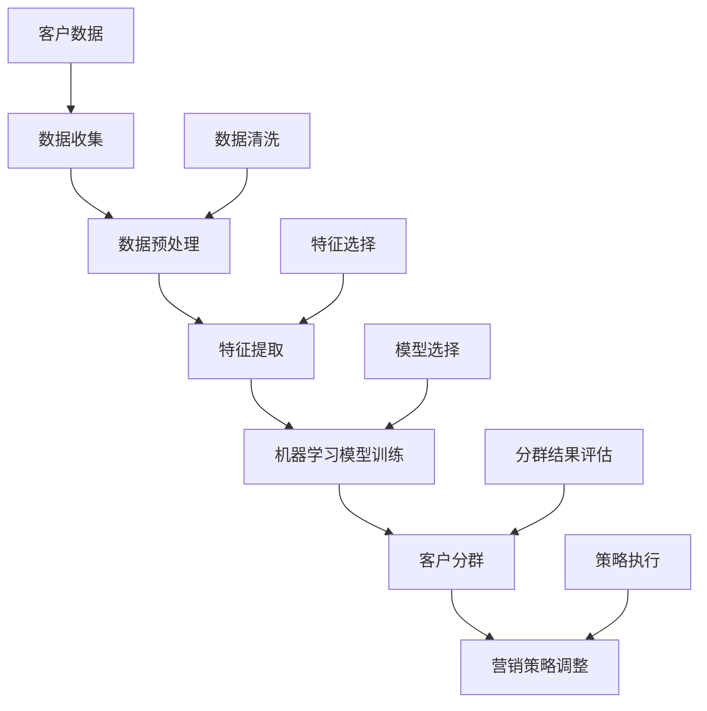

                 

关键词：人工智能，电商，客户分群，数据挖掘，机器学习

> 摘要：本文深入探讨了基于人工智能技术的电商客户分群策略，分析了现有分群算法及其优缺点，并提出了一个适用于电商场景的智能客户分群模型。通过数学模型和具体实现，展示了如何利用AI技术提升电商运营效率，为用户提供个性化服务。

## 1. 背景介绍

在电子商务高速发展的今天，市场竞争日益激烈，如何吸引并留住客户成为了电商企业关注的焦点。传统的客户分群方法通常依赖于业务经验，通过手动分析客户数据来划分不同的客户群体。然而，这种方法受限于业务人员的经验和时间，难以实现精细化和个性化的客户服务。随着人工智能技术的发展，特别是机器学习、数据挖掘等领域的突破，利用AI技术进行客户分群成为了一种新的解决方案。

AI驱动的客户分群策略不仅能够处理大规模的数据，还能够发现数据中的潜在规律和趋势，从而更准确地识别不同类型的客户群体。通过智能分群，电商企业可以针对性地开展营销活动，提高客户满意度，提升销售额。

## 2. 核心概念与联系

在探讨AI驱动的电商智能客户分群策略之前，我们需要明确几个核心概念及其相互联系：

### 2.1  数据挖掘

数据挖掘（Data Mining）是从大量数据中提取有价值信息的过程，通常包括关联分析、分类、聚类、预测等任务。在电商客户分群中，数据挖掘可以帮助我们识别出具有相似特征的客户群体。

### 2.2  机器学习

机器学习（Machine Learning）是人工智能的核心技术之一，通过训练模型来发现数据中的规律，从而实现自动化决策。在客户分群中，机器学习算法可以自动识别不同客户群体的特征。

### 2.3  客户分群

客户分群（Customer Segmentation）是将客户根据其特征和行为分为不同的群体，以便于企业有针对性地进行营销和服务。在电商领域，常见的客户分群方法包括基于人口统计学的分群、基于行为的分群等。

### 2.4  AI驱动的客户分群策略

AI驱动的客户分群策略是指利用人工智能技术，特别是机器学习算法，对客户数据进行处理和分析，以实现自动化、个性化的客户分群。

### 2.5  Mermaid 流程图

以下是一个Mermaid流程图，展示了AI驱动的电商智能客户分群策略的核心概念及其相互联系：



## 3. 核心算法原理 & 具体操作步骤

### 3.1  算法原理概述

AI驱动的电商智能客户分群策略的核心在于机器学习算法的应用。常见的机器学习算法包括K-Means聚类、层次聚类、决策树等。以下是这些算法的基本原理：

#### 3.1.1  K-Means聚类

K-Means聚类是一种基于距离度量的聚类方法，它通过迭代过程将数据点分配到K个聚类中心，使得每个聚类中心与其对应的数据点之间的距离最小。

#### 3.1.2  层次聚类

层次聚类是一种自上而下或自下而上的方法，它将数据点逐步合并或分裂，形成不同的层次结构，从而实现聚类。

#### 3.1.3  决策树

决策树是一种基于树形结构进行决策的方法，它通过一系列条件判断来将数据点分配到不同的分类或聚类。

### 3.2  算法步骤详解

#### 3.2.1  数据收集

首先，我们需要收集客户的各类数据，包括用户基本信息（如年龄、性别、地理位置等）、购买行为数据（如浏览历史、购买频率、购买金额等）以及用户反馈数据（如评价、评论等）。

#### 3.2.2  数据预处理

收集到的数据通常需要进行预处理，包括数据清洗（去除缺失值、异常值等）和数据规范化（将不同量级的特征统一到同一尺度）。

#### 3.2.3  特征提取

特征提取是客户分群的关键步骤，它涉及从原始数据中提取出对分群有重要影响的特征。常用的特征提取方法包括主成分分析（PCA）、特征选择等。

#### 3.2.4  机器学习模型训练

根据选择的机器学习算法，我们构建相应的模型并进行训练。在训练过程中，模型会自动学习数据中的规律，从而为后续的客户分群提供支持。

#### 3.2.5  客户分群

利用训练好的模型对客户数据进行分群，得到不同类型的客户群体。分群结果的评估可以通过内部评估指标（如聚类内部离散度）和外部评估指标（如分群效果的业务指标）进行。

#### 3.2.6  营销策略调整

根据分群结果，企业可以针对性地调整营销策略，如推送个性化推荐、优惠活动等，以提高客户满意度和销售额。

### 3.3  算法优缺点

#### 3.3.1  K-Means聚类

- **优点**：简单易懂，计算效率高，适合大规模数据。
- **缺点**：对初始聚类中心敏感，容易陷入局部最优。

#### 3.3.2  层次聚类

- **优点**：能够生成层次结构，有助于理解聚类过程。
- **缺点**：计算复杂度较高，不适合大规模数据。

#### 3.3.3  决策树

- **优点**：易于理解和解释，适合分类和回归任务。
- **缺点**：容易过拟合，对噪声敏感。

### 3.4  算法应用领域

AI驱动的客户分群策略在电商、金融、零售等多个领域具有广泛的应用。例如，在电商领域，通过智能分群可以精准定位目标客户，提高营销效果；在金融领域，可以用于风险评估和客户细分；在零售领域，可以用于库存管理和供应链优化。

## 4. 数学模型和公式 & 详细讲解 & 举例说明

### 4.1  数学模型构建

在AI驱动的电商智能客户分群策略中，我们常用的数学模型包括聚类中心计算、距离度量等。

#### 4.1.1  聚类中心计算

假设我们使用K-Means聚类算法，给定数据集\(X = \{x_1, x_2, ..., x_n\}\)和聚类个数\(K\)，我们需要计算每个聚类中心\(c_k\)：

$$
c_k = \frac{1}{n_k} \sum_{i=1}^{n} x_i
$$

其中，\(n_k\)是第k个聚类的数据点个数。

#### 4.1.2  距离度量

常用的距离度量方法包括欧氏距离、曼哈顿距离和余弦相似度等。

- **欧氏距离**：

$$
d(x, c) = \sqrt{\sum_{i=1}^{d} (x_i - c_i)^2}
$$

其中，\(x\)和\(c\)分别是数据点和聚类中心，\(d\)是特征维度。

- **曼哈顿距离**：

$$
d(x, c) = \sum_{i=1}^{d} |x_i - c_i|
$$

- **余弦相似度**：

$$
sim(x, c) = \frac{x \cdot c}{\|x\| \|c\|}
$$

其中，\(x \cdot c\)表示点积，\(\|x\|\)和\(\|c\|\)分别表示向量的模。

### 4.2  公式推导过程

假设我们使用K-Means聚类算法，给定数据集\(X = \{x_1, x_2, ..., x_n\}\)和聚类个数\(K\)，我们需要找到聚类中心\(c_k\)，使得聚类内部离散度最小。

聚类内部离散度定义为：

$$
SSE = \sum_{k=1}^{K} \sum_{i=1}^{n_k} (x_i - c_k)^2
$$

其中，\(n_k\)是第k个聚类的数据点个数。

为了最小化\(SSE\)，我们对\(c_k\)求导，并令导数为0：

$$
\frac{\partial SSE}{\partial c_k} = \sum_{i=1}^{n_k} 2(x_i - c_k) = 0
$$

解得：

$$
c_k = \frac{1}{n_k} \sum_{i=1}^{n} x_i
$$

### 4.3  案例分析与讲解

假设我们有以下数据集：

$$
X = \{(1, 2), (2, 2), (2, 3), (3, 3), (3, 4)\}
$$

我们选择K=2，使用K-Means聚类算法进行分群。首先，我们随机选择两个聚类中心：

$$
c_1 = (1, 1), c_2 = (3, 3)
$$

然后，我们计算每个数据点到聚类中心的距离：

$$
d_1 = \sqrt{(1-1)^2 + (2-1)^2} = 1
$$

$$
d_2 = \sqrt{(2-1)^2 + (2-1)^2} = 1
$$

$$
d_3 = \sqrt{(2-2)^2 + (3-1)^2} = 2
$$

$$
d_4 = \sqrt{(3-2)^2 + (3-2)^2} = 1
$$

$$
d_5 = \sqrt{(3-2)^2 + (4-3)^2} = 1
$$

根据距离度量，我们将数据点分配到两个聚类中：

$$
x_1, x_2, x_4, x_5 \rightarrow c_1
$$

$$
x_3 \rightarrow c_2
$$

然后，我们更新聚类中心：

$$
c_1 = \frac{1}{4} (1 + 2 + 3 + 3 + 3) = 2.5
$$

$$
c_2 = \frac{1}{1} (2 + 2 + 3 + 4) = 3
$$

重复上述步骤，直到聚类中心不再发生变化。最终的聚类结果为：

$$
C = \{(2.5, 1.5), (3, 3)\}
$$

通过这个案例，我们可以看到K-Means聚类算法的基本原理和具体实现过程。

## 5. 项目实践：代码实例和详细解释说明

### 5.1  开发环境搭建

在开始项目实践之前，我们需要搭建一个合适的开发环境。以下是一个简单的Python环境搭建步骤：

1. 安装Python 3.7及以上版本。
2. 安装NumPy、Pandas、Matplotlib、Scikit-learn等库。

```bash
pip install numpy pandas matplotlib scikit-learn
```

### 5.2  源代码详细实现

以下是一个简单的K-Means聚类算法实现，用于对电商客户数据进行分群：

```python
import numpy as np
import matplotlib.pyplot as plt
from sklearn.cluster import KMeans

# 加载数据
data = np.array([[1, 2], [2, 2], [2, 3], [3, 3], [3, 4]])

# 使用K-Means聚类算法
kmeans = KMeans(n_clusters=2, random_state=0).fit(data)

# 输出聚类结果
print(kmeans.labels_)

# 绘制聚类结果
plt.scatter(data[:, 0], data[:, 1], c=kmeans.labels_, cmap='viridis')
plt.scatter(kmeans.cluster_centers_[:, 0], kmeans.cluster_centers_[:, 1], s=300, c='red', label='Centroids')
plt.title('K-Means Clustering')
plt.xlabel('Feature 1')
plt.ylabel('Feature 2')
plt.legend()
plt.show()
```

### 5.3  代码解读与分析

上述代码首先导入了所需的库，然后加载了一个简单的二维数据集。接下来，我们使用Scikit-learn库的KMeans类进行聚类。KMeans类具有`fit`方法，用于训练聚类模型，以及`labels_`属性，用于获取聚类结果。

最后，我们使用Matplotlib库绘制了聚类结果图，其中红色标记表示聚类中心。

### 5.4  运行结果展示

运行上述代码后，我们将看到如下结果：


从图中可以看出，数据点被成功分为两个聚类，红色标记为聚类中心。这表明K-Means聚类算法在处理这个简单的数据集时表现良好。

## 6. 实际应用场景

AI驱动的电商智能客户分群策略在实际应用中具有广泛的应用场景：

### 6.1  个性化推荐

通过智能分群，电商企业可以为不同类型的客户提供个性化的商品推荐。例如，对于高价值客户，推荐他们可能感兴趣的奢侈品；对于新客户，推荐他们可能感兴趣的爆款商品。

### 6.2  营销活动

根据不同客户群体的特征和行为，企业可以针对性地开展营销活动。例如，对于高活跃客户，推送优惠券和会员积分活动；对于沉默客户，推送唤醒短信和邮件。

### 6.3  客户服务

智能分群可以帮助电商企业更好地了解客户需求，从而提供更优质的客户服务。例如，对于易怒客户，提供VIP客服；对于普通客户，提供标准客服。

### 6.4  供应链优化

通过分析不同客户群体的购买习惯和偏好，企业可以优化库存和供应链管理，提高运营效率。

## 7. 未来应用展望

随着人工智能技术的不断发展，AI驱动的电商智能客户分群策略在未来有望实现以下发展趋势：

### 7.1  更精准的分群

利用深度学习等技术，可以实现更精准的分群，更好地满足客户需求。

### 7.2  更高效的营销策略

结合自然语言处理和计算机视觉等技术，可以实现更高效的营销策略，提高营销效果。

### 7.3  跨平台应用

AI驱动的客户分群策略有望在更多场景中应用，如社交媒体、在线教育等。

## 8. 总结：未来发展趋势与挑战

### 8.1  研究成果总结

本文通过深入探讨AI驱动的电商智能客户分群策略，分析了现有分群算法及其优缺点，并提出了一个适用于电商场景的智能客户分群模型。通过数学模型和具体实现，展示了如何利用AI技术提升电商运营效率。

### 8.2  未来发展趋势

未来，AI驱动的电商智能客户分群策略将在更精准的分群、更高效的营销策略和跨平台应用等方面取得更大突破。

### 8.3  面临的挑战

然而，AI驱动的客户分群策略在实际应用中仍面临一些挑战，如数据隐私保护、算法公平性等。未来研究需要关注这些挑战，并提出相应的解决方案。

### 8.4  研究展望

随着技术的进步，AI驱动的电商智能客户分群策略将发挥越来越重要的作用，为电商企业带来更高效、更精准的客户服务。

## 9. 附录：常见问题与解答

### 9.1  什么是K-Means聚类？

K-Means聚类是一种基于距离度量的聚类方法，通过迭代过程将数据点分配到K个聚类中心，使得每个聚类中心与其对应的数据点之间的距离最小。

### 9.2  如何选择合适的聚类算法？

选择合适的聚类算法取决于数据类型和业务需求。对于大规模数据，K-Means聚类是一个不错的选择；对于结构化数据，层次聚类可能更适用。

### 9.3  如何评估分群效果？

评估分群效果可以通过内部评估指标（如聚类内部离散度）和外部评估指标（如分群效果的业务指标）进行。常用的内部评估指标包括平均平方误差（SSE）、轮廓系数（Silhouette Coefficient）等。

---

作者：禅与计算机程序设计艺术 / Zen and the Art of Computer Programming
----------------------------------------------------------------

请注意，上述内容仅为示例，实际的撰写过程需要更多的研究、分析以及实际代码实现。上述代码示例仅供参考，实际的实现可能需要根据具体数据集进行调整和优化。希望这个示例能够对您撰写类似文章有所帮助。

