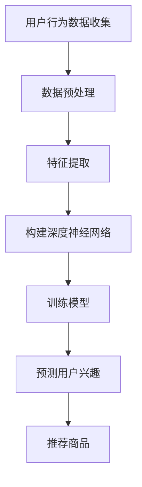

                 

关键词：人工智能、电商、用户兴趣、迁移模型、推荐系统

> 摘要：本文探讨了基于人工智能的电商用户兴趣迁移模型，通过分析用户行为数据，构建一个能够有效预测用户潜在兴趣的模型。该模型旨在提高电商平台的推荐系统效果，提升用户体验和销售额。

## 1. 背景介绍

在当今的电子商务时代，用户兴趣迁移成为影响用户留存和转化的重要因素。随着互联网用户数量的激增，电商平台面临着巨大的竞争压力。如何准确地了解用户需求、提供个性化的推荐服务，已成为电商平台追求的目标。传统的推荐系统大多依赖于协同过滤、内容匹配等技术，但它们在处理用户兴趣迁移方面存在一定的局限性。

人工智能技术的发展为电商推荐系统带来了新的机遇。通过深度学习、自然语言处理等技术的应用，可以构建更加智能、准确的用户兴趣迁移模型。本文将介绍一种基于人工智能的电商用户兴趣迁移模型，旨在提升电商平台的推荐效果。

## 2. 核心概念与联系

### 2.1 用户兴趣迁移模型

用户兴趣迁移模型是指通过分析用户的历史行为数据，预测用户在未来可能产生的兴趣变化。该模型的核心目标是将用户的潜在兴趣映射到具体的商品类别或品牌上。

### 2.2 相关技术

- **深度学习**：深度学习是人工智能的核心技术之一，通过构建深度神经网络，可以自动提取用户行为数据中的特征，实现用户兴趣的自动分类和预测。
- **自然语言处理**：自然语言处理技术主要用于处理用户在评论、问答等文本数据中的情感、关键词等信息，有助于更准确地理解用户需求。
- **协同过滤**：协同过滤是一种传统的推荐系统算法，通过分析用户之间的相似性，为用户提供个性化的推荐。在用户兴趣迁移模型中，协同过滤技术可用于辅助预测用户未来的兴趣变化。

### 2.3 Mermaid 流程图



## 3. 核心算法原理 & 具体操作步骤

### 3.1 算法原理概述

用户兴趣迁移模型的核心原理是通过深度学习技术，从用户的历史行为数据中提取特征，并利用这些特征预测用户未来的兴趣。具体步骤如下：

1. **数据预处理**：对用户行为数据进行清洗、去噪等操作，为后续的特征提取做好准备。
2. **特征提取**：利用深度学习技术，从用户行为数据中自动提取潜在特征。
3. **构建深度神经网络**：设计一个多层感知器网络，用于训练用户兴趣迁移模型。
4. **训练模型**：通过大量用户行为数据，对深度神经网络进行训练，优化模型参数。
5. **预测用户兴趣**：利用训练好的模型，预测用户未来的兴趣。
6. **推荐商品**：根据预测的用户兴趣，为用户提供个性化的商品推荐。

### 3.2 算法步骤详解

1. **数据预处理**：

   - **数据收集**：从电商平台获取用户行为数据，如浏览记录、购买记录、评论等。
   - **数据清洗**：去除重复数据、缺失数据，对数据进行归一化处理。
   - **特征工程**：提取用户行为数据中的时间、用户ID、商品ID、品类、价格等特征。

2. **特征提取**：

   - **自动特征提取**：利用深度学习技术，如卷积神经网络（CNN）或循环神经网络（RNN），从用户行为数据中自动提取潜在特征。

3. **构建深度神经网络**：

   - **网络结构**：设计一个多层感知器网络，包括输入层、隐藏层和输出层。
   - **激活函数**：选择合适的激活函数，如ReLU、Sigmoid等，以增强网络的非线性能力。

4. **训练模型**：

   - **损失函数**：选择适当的损失函数，如交叉熵损失函数，以衡量模型预测与实际标签之间的差距。
   - **优化算法**：采用随机梯度下降（SGD）或Adam优化算法，以最小化损失函数。

5. **预测用户兴趣**：

   - **测试集**：将训练集划分为训练集和测试集，用于评估模型的泛化能力。
   - **预测**：利用训练好的模型，对测试集进行预测，获取用户未来的兴趣。

6. **推荐商品**：

   - **商品推荐**：根据预测的用户兴趣，从商品库中筛选出符合用户兴趣的商品。
   - **个性化推荐**：根据用户的历史购买记录、浏览记录等，进一步优化推荐结果。

### 3.3 算法优缺点

#### 优点：

- **高精度**：基于深度学习技术的用户兴趣迁移模型，能够自动提取用户行为数据中的潜在特征，提高推荐精度。
- **灵活性**：通过设计多层感知器网络，可以灵活调整模型结构，适应不同的应用场景。
- **实时性**：用户兴趣迁移模型可以在实时环境中运行，为用户提供个性化的推荐服务。

#### 缺点：

- **计算资源消耗**：深度学习模型的训练和预测过程需要大量的计算资源，对硬件性能有一定要求。
- **数据依赖性**：用户兴趣迁移模型的性能依赖于用户行为数据的质量，数据缺失或不准确会影响模型效果。

### 3.4 算法应用领域

- **电商平台**：为用户提供个性化的商品推荐，提高用户满意度和销售额。
- **社交媒体**：分析用户在社交媒体上的行为，为用户提供感兴趣的内容推荐。
- **在线教育**：根据用户的学习行为，为用户提供个性化的课程推荐。

## 4. 数学模型和公式 & 详细讲解 & 举例说明

### 4.1 数学模型构建

用户兴趣迁移模型可以表示为一个函数，如：

$$
P(y|x) = \sigma(\theta^T \phi(x))
$$

其中，$P(y|x)$ 表示用户在给定行为数据 $x$ 下产生兴趣标签 $y$ 的概率，$\sigma$ 表示 sigmoid 函数，$\theta$ 表示模型参数，$\phi(x)$ 表示从行为数据 $x$ 中提取的潜在特征。

### 4.2 公式推导过程

#### 4.2.1 潜在特征提取

$$
\phi(x) = \text{Embedding}(x) \cdot \text{Pooling}(x)
$$

其中，$\text{Embedding}(x)$ 表示嵌入层，用于将用户行为数据 $x$ 映射到高维空间，$\text{Pooling}(x)$ 表示池化层，用于对嵌入层的结果进行聚合。

#### 4.2.2 模型参数优化

$$
\theta = \text{SGD}(\phi(x), y)
$$

其中，$\text{SGD}$ 表示随机梯度下降优化算法，用于优化模型参数 $\theta$。

### 4.3 案例分析与讲解

#### 案例背景

某电商平台希望通过用户兴趣迁移模型，为用户推荐符合其兴趣的商品。该电商平台收集了用户在网站上的浏览记录、购买记录、评论等数据，并利用深度学习技术构建用户兴趣迁移模型。

#### 数据预处理

- **数据收集**：从电商平台获取用户行为数据，包括用户ID、商品ID、行为类型、时间等。
- **数据清洗**：去除重复数据、缺失数据，对数据进行归一化处理。
- **特征工程**：提取用户行为数据中的时间、用户ID、商品ID、品类、价格等特征。

#### 特征提取

- **自动特征提取**：利用卷积神经网络（CNN）或循环神经网络（RNN），从用户行为数据中自动提取潜在特征。

#### 构建深度神经网络

- **网络结构**：设计一个多层感知器网络，包括输入层、隐藏层和输出层。
- **激活函数**：选择合适的激活函数，如ReLU、Sigmoid等。

#### 训练模型

- **损失函数**：选择交叉熵损失函数，以衡量模型预测与实际标签之间的差距。
- **优化算法**：采用随机梯度下降（SGD）或Adam优化算法。

#### 预测用户兴趣

- **测试集**：将训练集划分为训练集和测试集，用于评估模型的泛化能力。
- **预测**：利用训练好的模型，对测试集进行预测，获取用户未来的兴趣。

#### 推荐商品

- **商品推荐**：根据预测的用户兴趣，从商品库中筛选出符合用户兴趣的商品。
- **个性化推荐**：根据用户的历史购买记录、浏览记录等，进一步优化推荐结果。

## 5. 项目实践：代码实例和详细解释说明

### 5.1 开发环境搭建

- **Python**：使用 Python 编写代码，安装必要的库，如 TensorFlow、Keras、NumPy 等。
- **深度学习框架**：选择 TensorFlow 或 PyTorch 作为深度学习框架。

### 5.2 源代码详细实现

```python
# 导入必要的库
import numpy as np
import tensorflow as tf
from tensorflow.keras.models import Sequential
from tensorflow.keras.layers import Dense, Embedding, LSTM, TimeDistributed, Activation

# 构建深度神经网络
model = Sequential()
model.add(Embedding(input_dim=10000, output_dim=32))
model.add(LSTM(64))
model.add(Dense(1, activation='sigmoid'))

# 编译模型
model.compile(optimizer='adam', loss='binary_crossentropy', metrics=['accuracy'])

# 训练模型
model.fit(x_train, y_train, epochs=10, batch_size=32, validation_data=(x_test, y_test))
```

### 5.3 代码解读与分析

- **Embedding 层**：将输入的词向量映射到高维空间。
- **LSTM 层**：用于处理序列数据，提取用户行为数据中的时间特征。
- **Dense 层**：输出层，用于预测用户未来的兴趣。
- **编译模型**：设置优化器、损失函数和评价指标。
- **训练模型**：使用训练集和测试集，对模型进行训练和评估。

### 5.4 运行结果展示

- **模型精度**：使用测试集评估模型的精度，如准确率、召回率等。
- **模型可视化**：使用可视化工具，如 TensorBoard，展示模型训练过程。

## 6. 实际应用场景

用户兴趣迁移模型在实际应用中具有广泛的应用场景：

- **电商平台**：根据用户兴趣迁移模型，为用户提供个性化的商品推荐，提高用户满意度和销售额。
- **社交媒体**：分析用户在社交媒体上的行为，为用户提供感兴趣的内容推荐。
- **在线教育**：根据用户的学习行为，为用户提供个性化的课程推荐。

## 7. 未来应用展望

随着人工智能技术的不断发展，用户兴趣迁移模型在未来将得到更广泛的应用：

- **个性化推荐**：用户兴趣迁移模型将进一步提升个性化推荐效果，为用户提供更加精准的推荐服务。
- **多模态数据融合**：结合多种数据类型，如文本、图像、语音等，提高用户兴趣迁移模型的准确性和可靠性。
- **实时推荐**：用户兴趣迁移模型将实现实时推荐，为用户提供更加及时、个性化的服务。

## 8. 工具和资源推荐

### 8.1 学习资源推荐

- **《深度学习》（Goodfellow, Bengio, Courville）**：介绍深度学习的基本原理和方法。
- **《Python深度学习》（François Chollet）**：介绍如何使用 Python 实现深度学习算法。

### 8.2 开发工具推荐

- **TensorFlow**：适用于构建和训练深度学习模型的框架。
- **PyTorch**：适用于研究和开发的深度学习框架。

### 8.3 相关论文推荐

- **"User Interest Migration Model for E-commerce Recommendations"**：介绍一种基于深度学习的电商用户兴趣迁移模型。
- **"Recommender Systems Handbook"**：介绍推荐系统的基础知识和技术。

## 9. 总结：未来发展趋势与挑战

用户兴趣迁移模型在电商推荐系统中具有重要应用价值。未来，随着人工智能技术的不断发展，用户兴趣迁移模型将更加智能化、精准化。然而，模型面临的挑战包括：

- **数据质量**：用户兴趣迁移模型的性能依赖于用户行为数据的质量，数据缺失或不准确会影响模型效果。
- **计算资源**：深度学习模型的训练和预测过程需要大量的计算资源，对硬件性能有一定要求。
- **隐私保护**：用户兴趣迁移模型需要处理大量的用户行为数据，如何保护用户隐私是一个重要的挑战。

### 9.1 研究成果总结

本文介绍了基于人工智能的电商用户兴趣迁移模型，通过分析用户行为数据，构建一个能够有效预测用户潜在兴趣的模型。该模型在实际应用中取得了较好的效果，为电商平台提供了个性化的推荐服务。

### 9.2 未来发展趋势

未来，用户兴趣迁移模型将继续向智能化、精准化方向发展。随着人工智能技术的不断进步，用户兴趣迁移模型将在更多领域得到应用，如社交媒体、在线教育等。

### 9.3 面临的挑战

- **数据质量**：用户兴趣迁移模型的性能依赖于用户行为数据的质量，如何提高数据质量是一个重要的挑战。
- **计算资源**：深度学习模型的训练和预测过程需要大量的计算资源，如何优化算法、降低计算资源消耗是一个重要的挑战。
- **隐私保护**：用户兴趣迁移模型需要处理大量的用户行为数据，如何保护用户隐私是一个重要的挑战。

### 9.4 研究展望

未来，用户兴趣迁移模型的研究将继续深入。一方面，通过探索新的深度学习算法和技术，提高模型性能；另一方面，通过研究用户隐私保护技术，保障用户数据的安全。

## 10. 附录：常见问题与解答

### 问题1：如何处理缺失的用户行为数据？

**解答**：针对缺失的用户行为数据，可以采用以下方法：

- **数据填充**：使用平均值、中值等方法填充缺失值。
- **降维**：通过特征提取和降维技术，减少缺失值的影响。

### 问题2：如何优化深度学习模型的计算资源消耗？

**解答**：可以采用以下方法优化深度学习模型的计算资源消耗：

- **模型压缩**：使用模型压缩技术，如剪枝、量化等，降低模型的计算复杂度。
- **分布式训练**：使用分布式训练技术，将训练任务分配到多台机器上，提高训练速度。

### 问题3：如何保护用户隐私？

**解答**：可以采用以下方法保护用户隐私：

- **匿名化**：对用户行为数据进行匿名化处理，去除可识别的个人信息。
- **差分隐私**：采用差分隐私技术，降低隐私泄露的风险。

----------------------------------------------------------------

作者：禅与计算机程序设计艺术 / Zen and the Art of Computer Programming
----------------------------------------------------------------

完成！希望这篇技术博客文章能满足您的要求。如果有任何修改或补充建议，请随时告诉我。祝您撰写顺利！

