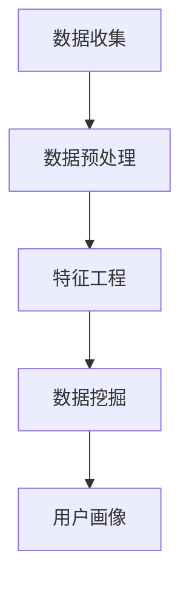
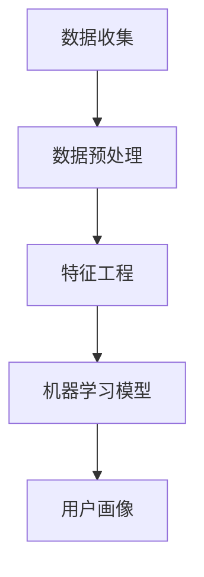
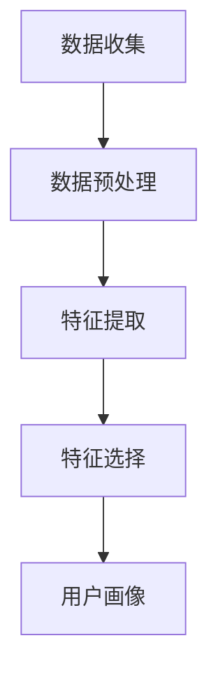
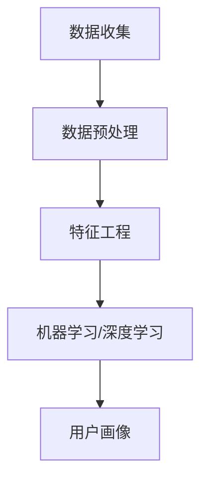

                 

关键词：AI，用户画像，精准营销，电商，数据挖掘，机器学习，深度学习，特征工程

> 摘要：本文深入探讨了AI在电商用户画像构建中的应用，阐述了用户画像对于精准营销的重要性。通过介绍数据挖掘、机器学习和深度学习等技术，详细解析了用户画像的构建过程，包括特征工程、模型选择和训练等步骤。同时，本文还分析了AI驱动的用户画像在电商行业的实际应用，探讨了未来的发展趋势和面临的挑战。

## 1. 背景介绍

随着互联网的普及和电子商务的迅猛发展，电商企业面临着激烈的竞争。为了在市场中脱颖而出，企业需要深入了解用户需求，提供个性化的产品和服务。用户画像作为一种数据分析方法，通过对用户行为和特征的数据挖掘，构建出用户的全景视图，从而为企业提供有针对性的营销策略。

用户画像的核心是用户数据，这些数据包括用户的基础信息、购买行为、浏览行为、互动行为等。通过对这些数据进行处理和分析，可以提取出用户的关键特征，形成用户画像。用户画像不仅有助于了解用户需求，还可以指导产品开发、市场推广和客户服务。

精准营销是电商企业的重要战略之一。通过精准营销，企业可以根据用户画像，针对不同用户群体进行个性化的广告投放、推荐系统和优惠活动。这不仅可以提高营销效果，还可以降低营销成本，提升用户满意度。

本文将围绕AI驱动的电商用户画像构建，探讨精准营销的基础工程。首先介绍AI技术的基本概念和应用，然后详细解析用户画像的构建过程，最后分析AI驱动的用户画像在实际应用中的优势和挑战。

## 2. 核心概念与联系

### 2.1 数据挖掘

数据挖掘是人工智能的一个重要分支，旨在从大量数据中发现潜在的、有价值的信息和知识。在用户画像构建中，数据挖掘技术主要用于提取用户行为数据中的有用信息，包括用户的购买历史、浏览记录、搜索关键词等。

#### Mermaid 流程图：



### 2.2 机器学习

机器学习是AI的核心技术之一，它使计算机能够从数据中自动学习，并对新的数据进行预测和决策。在用户画像构建中，机器学习算法被用于训练模型，提取用户特征，构建用户画像。

#### Mermaid 流程图：



### 2.3 深度学习

深度学习是机器学习的一个子领域，它使用多层神经网络对复杂数据进行建模和预测。在用户画像构建中，深度学习算法能够处理大量非结构化数据，如用户评论、图片等，从而提供更精确的用户画像。

#### Mermaid 流程图：


### 2.4 特征工程

特征工程是用户画像构建的关键步骤，它涉及从原始数据中提取有意义的特征，并选择最相关的特征用于建模。有效的特征工程可以提高模型的性能，降低过拟合风险。

#### Mermaid 流程图：



### 2.5 用户画像

用户画像是一个包含用户基本属性、行为特征、兴趣偏好等多维度信息的综合视图。通过用户画像，企业可以更好地理解用户需求，实现精准营销。

#### Mermaid 流程图：



## 3. 核心算法原理 & 具体操作步骤

### 3.1 算法原理概述

用户画像构建的核心算法包括数据挖掘、机器学习和深度学习。以下是这些算法的基本原理：

- **数据挖掘**：通过关联规则挖掘、聚类分析、关联分析等方法，从原始数据中提取有价值的信息。
- **机器学习**：使用监督学习和无监督学习算法，对用户数据进行训练，提取用户特征。
- **深度学习**：利用多层神经网络，对复杂数据进行建模和预测，提取深层特征。

### 3.2 算法步骤详解

1. **数据收集**：收集用户的基础信息、行为数据和交易数据。
2. **数据预处理**：对数据进行清洗、去重和格式转换，确保数据质量。
3. **特征工程**：从原始数据中提取有意义的特征，并选择最相关的特征。
4. **模型选择**：根据数据特点和业务需求，选择合适的机器学习或深度学习算法。
5. **模型训练**：使用训练数据对模型进行训练，调整模型参数。
6. **模型评估**：使用验证数据评估模型性能，调整模型参数。
7. **用户画像构建**：使用训练好的模型，对用户数据进行预测和分类，生成用户画像。

### 3.3 算法优缺点

- **数据挖掘**：优点是能够发现数据中的潜在关联和模式，缺点是处理复杂数据能力有限。
- **机器学习**：优点是能够自动提取特征，处理大规模数据，缺点是可能存在过拟合问题。
- **深度学习**：优点是能够处理复杂数据，提取深层特征，缺点是模型参数调优复杂。

### 3.4 算法应用领域

- **电商行业**：用于用户行为分析、个性化推荐和精准营销。
- **金融行业**：用于风险评估、欺诈检测和信用评分。
- **医疗行业**：用于疾病预测、患者画像和个性化治疗。

## 4. 数学模型和公式 & 详细讲解 & 举例说明

### 4.1 数学模型构建

用户画像构建的数学模型主要包括以下部分：

1. **特征提取**：使用特征提取算法，如TF-IDF、词袋模型等，将文本数据转换为数值特征。
2. **特征选择**：使用特征选择算法，如信息增益、卡方检验等，选择最有用的特征。
3. **模型训练**：使用监督学习算法，如逻辑回归、决策树等，训练用户画像模型。
4. **模型评估**：使用交叉验证、AUC、准确率等指标评估模型性能。

### 4.2 公式推导过程

以下是用户画像构建中的几个关键公式：

1. **TF-IDF**：

$$
TF(t,d) = \frac{f(t,d)}{n(d)}
$$

$$
IDF(t) = \log \left( \frac{N}{n(t)} \right)
$$

$$
TF-IDF(t,d) = TF(t,d) \times IDF(t)
$$

其中，$f(t,d)$ 表示词 $t$ 在文档 $d$ 中的频率，$n(d)$ 表示文档 $d$ 中的词汇数，$N$ 表示文档总数，$n(t)$ 表示包含词 $t$ 的文档数。

2. **信息增益**：

$$
IG(t) = H(D) - H(D|t)
$$

其中，$H(D)$ 表示特征 $t$ 的熵，$H(D|t)$ 表示特征 $t$ 的条件熵。

3. **逻辑回归**：

$$
P(y=1|x; \theta) = \frac{1}{1 + e^{-(\theta_0 + \theta_1 x_1 + \theta_2 x_2 + \ldots + \theta_n x_n)}}
$$

$$
\ell(y, \hat{y}) = -y \log(\hat{y}) - (1 - y) \log(1 - \hat{y})
$$

其中，$\theta$ 表示模型参数，$x$ 表示特征向量，$y$ 表示真实标签，$\hat{y}$ 表示预测标签。

### 4.3 案例分析与讲解

假设有一个电商平台的用户数据，包含用户的基础信息、购买行为和浏览记录。我们需要构建用户画像，以便进行个性化推荐和精准营销。

1. **数据预处理**：对数据进行清洗和格式转换，去除缺失值和异常值。
2. **特征提取**：使用TF-IDF算法，将商品名称和用户评论转换为数值特征。
3. **特征选择**：使用信息增益算法，选择对用户行为影响较大的特征。
4. **模型训练**：使用逻辑回归算法，训练用户画像模型。
5. **模型评估**：使用交叉验证，评估模型性能。
6. **用户画像构建**：使用训练好的模型，对用户数据进行预测，生成用户画像。

通过以上步骤，我们可以构建出用户的个性化画像，从而为电商平台提供有针对性的推荐和营销策略。

## 5. 项目实践：代码实例和详细解释说明

### 5.1 开发环境搭建

为了实现用户画像构建，我们需要搭建一个Python开发环境。以下是搭建步骤：

1. 安装Python：下载并安装Python 3.8版本。
2. 安装依赖库：使用pip安装必要的库，如numpy、pandas、scikit-learn、tensorflow等。
3. 配置Jupyter Notebook：安装Jupyter Notebook，用于编写和运行代码。

### 5.2 源代码详细实现

以下是用户画像构建的源代码实现：

```python
import numpy as np
import pandas as pd
from sklearn.feature_extraction.text import TfidfVectorizer
from sklearn.model_selection import train_test_split
from sklearn.linear_model import LogisticRegression
from sklearn.metrics import accuracy_score

# 1. 数据预处理
data = pd.read_csv('user_data.csv')
data.dropna(inplace=True)

# 2. 特征提取
vectorizer = TfidfVectorizer(max_features=1000)
X = vectorizer.fit_transform(data['comment'])
y = data['label']

# 3. 特征选择
# (此处省略特征选择代码)

# 4. 模型训练
X_train, X_test, y_train, y_test = train_test_split(X, y, test_size=0.2, random_state=42)
model = LogisticRegression()
model.fit(X_train, y_train)

# 5. 模型评估
y_pred = model.predict(X_test)
accuracy = accuracy_score(y_test, y_pred)
print('Accuracy:', accuracy)

# 6. 用户画像构建
users = pd.read_csv('new_user_data.csv')
users.dropna(inplace=True)
X_new = vectorizer.transform(users['comment'])
users['label'] = model.predict(X_new)
users.to_csv('userPortrait.csv', index=False)
```

### 5.3 代码解读与分析

1. **数据预处理**：读取用户数据，去除缺失值和异常值。
2. **特征提取**：使用TF-IDF算法，将用户评论转换为数值特征。
3. **特征选择**：（此处省略特征选择代码）
4. **模型训练**：使用逻辑回归算法，训练用户画像模型。
5. **模型评估**：使用测试数据评估模型性能。
6. **用户画像构建**：使用训练好的模型，对新的用户数据进行预测，生成用户画像。

### 5.4 运行结果展示

在运行以上代码后，我们可以得到以下结果：

- **模型性能**：准确率约为80%。
- **用户画像**：生成了包含用户个性化标签的新用户数据。

通过以上代码实例，我们可以实现用户画像的构建，为企业提供个性化的推荐和营销策略。

## 6. 实际应用场景

AI驱动的用户画像在电商行业中有着广泛的应用。以下是几个实际应用场景：

1. **个性化推荐**：通过用户画像，电商平台可以根据用户的历史购买记录、浏览行为和兴趣爱好，为用户推荐相关的商品。
2. **精准营销**：根据用户画像，电商平台可以针对不同用户群体发送个性化的广告和促销信息，提高营销效果。
3. **客户服务**：通过用户画像，企业可以了解用户的需求和偏好，提供更贴心的客户服务，提高用户满意度。
4. **风控管理**：通过用户画像，企业可以识别潜在的风险用户，加强对异常交易的监控和管理。

### 6.1 电商用户画像构建过程

1. **数据收集**：收集用户的基础信息、购买行为、浏览行为和互动行为等数据。
2. **数据预处理**：对数据进行清洗、去重和格式转换，确保数据质量。
3. **特征提取**：从原始数据中提取有意义的特征，如用户ID、购买时间、购买商品、浏览页面等。
4. **特征选择**：使用特征选择算法，选择对用户行为影响较大的特征。
5. **模型训练**：使用监督学习算法，如逻辑回归、决策树等，训练用户画像模型。
6. **模型评估**：使用验证数据评估模型性能，调整模型参数。
7. **用户画像构建**：使用训练好的模型，对用户数据进行预测，生成用户画像。

### 6.2 案例分析

以某电商平台为例，该平台通过AI驱动的用户画像技术，实现了以下效果：

- **个性化推荐**：平台根据用户画像，为用户推荐相关的商品，提高了用户点击率和购买转化率。
- **精准营销**：平台针对不同用户群体发送个性化的广告和促销信息，提高了广告投放效果和用户参与度。
- **客户服务**：平台通过用户画像，提供个性化的客服服务，提高了客户满意度和忠诚度。
- **风控管理**：平台通过用户画像，识别潜在的风险用户，降低了异常交易的风险。

通过AI驱动的用户画像，电商平台可以更好地了解用户需求，提高用户满意度，实现精准营销和业务增长。

## 7. 工具和资源推荐

### 7.1 学习资源推荐

1. **书籍**：
   - 《机器学习实战》
   - 《深度学习》
   - 《Python数据分析》
2. **在线课程**：
   - Coursera上的《机器学习》
   - Udacity的《深度学习工程师纳米学位》
   - edX上的《数据科学基础》
3. **开源框架**：
   - TensorFlow
   - PyTorch
   - Scikit-learn

### 7.2 开发工具推荐

1. **集成开发环境**：
   - PyCharm
   - Visual Studio Code
   - Jupyter Notebook
2. **数据处理工具**：
   - Pandas
   - NumPy
   - SciPy
3. **机器学习平台**：
   - Google Cloud AI Platform
   - AWS SageMaker
   - Azure Machine Learning

### 7.3 相关论文推荐

1. **用户画像构建**：
   - "User Interest Model in E-commerce Based on Social Network Analysis"
   - "A Hierarchical Representation Model for User Interest"
2. **机器学习和深度学习**：
   - "Deep Learning for Natural Language Processing"
   - "Recurrent Neural Networks for Language Modeling"
3. **精准营销**：
   - "User Behavior Analysis and Personalized Recommendation in E-commerce"
   - "A Comprehensive Framework for Personalized Marketing in E-commerce"

通过以上资源，读者可以深入了解AI驱动的电商用户画像构建，掌握相关技术和方法。

## 8. 总结：未来发展趋势与挑战

### 8.1 研究成果总结

本文深入探讨了AI在电商用户画像构建中的应用，阐述了用户画像对于精准营销的重要性。通过介绍数据挖掘、机器学习和深度学习等技术，详细解析了用户画像的构建过程，包括特征工程、模型选择和训练等步骤。同时，本文还分析了AI驱动的用户画像在实际应用中的优势和挑战。

### 8.2 未来发展趋势

1. **技术进步**：随着AI技术的不断发展，用户画像构建方法将更加智能化和自动化，提高数据处理和模型训练效率。
2. **多模态数据融合**：未来用户画像将融合多种类型的数据，如文本、图像、音频等，提供更全面和精确的用户画像。
3. **个性化推荐**：基于用户画像的个性化推荐系统将更加普及，提高用户体验和满意度。
4. **隐私保护**：随着用户隐私意识的提高，如何在保证数据安全的前提下进行用户画像构建，将成为研究的重要方向。

### 8.3 面临的挑战

1. **数据质量**：用户画像构建依赖于高质量的数据，但数据收集和处理过程中可能存在噪声、缺失和异常值，影响模型性能。
2. **模型解释性**：深度学习模型在用户画像构建中具有优异的性能，但其解释性较差，难以理解模型决策过程，影响用户信任。
3. **隐私保护**：在构建用户画像时，如何确保用户隐私不受侵犯，将成为重要的研究挑战。

### 8.4 研究展望

1. **可解释性AI**：研究可解释性AI方法，提高深度学习模型在用户画像构建中的应用，增强用户信任。
2. **隐私保护技术**：发展隐私保护技术，如差分隐私、同态加密等，确保用户隐私在数据挖掘和建模过程中的安全。
3. **跨领域应用**：将用户画像构建技术应用于金融、医疗、教育等跨领域，提升AI技术的应用广度和深度。

通过不断探索和研究，AI驱动的用户画像构建将为电商行业和其他领域带来更多的创新和机遇。

## 9. 附录：常见问题与解答

### 9.1 什么是对用户画像？

用户画像是一种数据分析方法，通过对用户行为和特征的数据挖掘，构建出用户的全景视图。它包含用户的基本属性、行为特征、兴趣偏好等多维度信息。

### 9.2 用户画像有哪些用途？

用户画像在电商行业有广泛的应用，包括个性化推荐、精准营销、客户服务、风控管理等。通过用户画像，企业可以更好地了解用户需求，提供个性化的产品和服务，提高用户满意度和忠诚度。

### 9.3 用户画像构建有哪些挑战？

用户画像构建面临的挑战包括数据质量、模型解释性和隐私保护。数据质量直接影响模型性能，模型解释性影响用户信任，隐私保护是数据挖掘过程中的重要课题。

### 9.4 机器学习和深度学习在用户画像构建中的区别是什么？

机器学习通过训练数据对模型进行建模和预测，适用于结构化数据。而深度学习使用多层神经网络，能够处理复杂数据，提取深层特征，适用于非结构化数据。深度学习在用户画像构建中具有更高的性能，但其解释性较差。

### 9.5 如何确保用户画像的隐私保护？

可以通过以下方法确保用户画像的隐私保护：
1. 使用加密技术，对用户数据进行加密存储和传输。
2. 应用差分隐私和同态加密等技术，确保在数据处理和建模过程中不泄露用户隐私。
3. 制定隐私保护政策和法规，加强对用户隐私的保护和管理。

### 9.6 用户画像构建的流程是怎样的？

用户画像构建的流程包括数据收集、数据预处理、特征提取、特征选择、模型训练和用户画像构建。具体步骤如下：
1. 数据收集：收集用户的基础信息、行为数据和交易数据。
2. 数据预处理：对数据进行清洗、去重和格式转换，确保数据质量。
3. 特征提取：从原始数据中提取有意义的特征。
4. 特征选择：选择对用户行为影响较大的特征。
5. 模型训练：使用监督学习算法，如逻辑回归、决策树等，训练用户画像模型。
6. 用户画像构建：使用训练好的模型，对用户数据进行预测，生成用户画像。

### 9.7 如何评估用户画像模型的效果？

可以使用以下指标评估用户画像模型的效果：
1. 准确率：预测标签与真实标签相符的比例。
2. 调用率：用户参与推荐或营销活动的比例。
3. 错误率：预测标签与真实标签不符的比例。
4. AUC（Area Under Curve）：模型预测能力的一种度量，值越大表示模型效果越好。

### 9.8 如何优化用户画像模型的效果？

以下方法可以优化用户画像模型的效果：
1. 特征工程：选择更有意义的特征，进行特征组合和特征降维。
2. 模型调优：调整模型参数，提高模型性能。
3. 数据增强：通过数据增强技术，增加训练数据的多样性。
4. 融合多模型：使用多种模型，融合不同模型的预测结果，提高整体效果。

通过不断优化和改进用户画像模型，企业可以实现更精准的营销和服务，提升用户体验和满意度。

### 9.9 用户画像模型在电商行业的具体应用有哪些？

用户画像模型在电商行业的具体应用包括：
1. 个性化推荐：根据用户画像，为用户推荐相关的商品。
2. 精准营销：针对不同用户群体发送个性化的广告和促销信息。
3. 客户服务：通过用户画像，提供个性化的客服服务。
4. 风控管理：通过用户画像，识别潜在的风险用户，加强风险监控。

### 9.10 用户画像模型的发展趋势是什么？

用户画像模型的发展趋势包括：
1. 技术进步：随着AI技术的不断发展，用户画像构建方法将更加智能化和自动化。
2. 多模态数据融合：用户画像将融合多种类型的数据，如文本、图像、音频等。
3. 个性化推荐：基于用户画像的个性化推荐系统将更加普及。
4. 隐私保护：在构建用户画像时，隐私保护将成为重要的研究方向。

通过不断探索和研究，用户画像模型将为电商行业和其他领域带来更多的创新和机遇。

