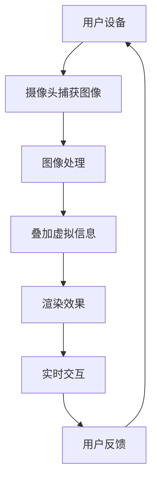

                 

关键词：增强现实（AR）、注意力经济、用户参与、游戏设计、商业模式创新

> 摘要：本文探讨了增强现实（AR）游戏作为一种新兴的娱乐形式，如何通过创新的商业模式和用户参与机制，成为注意力经济的重要载体。通过分析AR游戏的核心概念、技术架构、算法原理以及实际应用案例，文章旨在为读者揭示AR游戏在未来娱乐产业中的潜力与挑战。

## 1. 背景介绍

随着技术的进步，增强现实（AR）技术逐渐从科幻领域走入现实，改变了人们获取信息和娱乐的方式。AR技术通过在现实世界环境中叠加数字信息，为用户提供了全新的交互体验。在游戏领域，AR游戏以其独特的沉浸感和互动性迅速崛起，成为游戏产业中备受瞩目的一部分。

注意力经济是现代互联网经济中的一种核心概念，它指的是通过吸引用户的注意力来创造价值和利润。随着信息过载时代的到来，如何获取并保持用户的注意力成为企业和创业者们竞相探讨的问题。AR游戏以其引人入胜的视觉和听觉效果，以及与现实世界的互动性，成为吸引和保持用户注意力的重要工具。

本文将从以下几个方面展开讨论：

1. **核心概念与联系**：介绍AR游戏的核心概念及其与注意力经济的联系。
2. **核心算法原理 & 具体操作步骤**：分析AR游戏的关键算法原理及其实施步骤。
3. **数学模型和公式 & 详细讲解 & 举例说明**：探讨AR游戏中使用的数学模型和公式，并通过实例进行说明。
4. **项目实践：代码实例和详细解释说明**：提供具体的AR游戏开发实例及其代码解析。
5. **实际应用场景**：分析AR游戏在不同领域的应用。
6. **未来应用展望**：探讨AR游戏的发展趋势和潜在挑战。
7. **工具和资源推荐**：推荐学习AR游戏开发的相关资源和工具。
8. **总结：未来发展趋势与挑战**：总结研究成果，展望AR游戏的发展前景。

## 2. 核心概念与联系

### 2.1 增强现实（AR）的核心概念

增强现实（AR）技术是在现实世界基础上叠加数字信息的技术，通过计算机生成的虚拟信息与真实环境实时交互，使用户能够在现实世界中看到和体验到虚拟信息。AR的关键特点包括：

- **虚拟信息与现实环境的融合**：AR通过摄像头捕捉现实世界的图像，并在这些图像上叠加虚拟元素，使虚拟信息和真实环境相互融合。
- **实时交互**：AR系统具备实时处理和响应用户输入的能力，使用户能够通过触摸、手势等方式与虚拟信息进行互动。
- **沉浸感**：AR游戏通过虚拟场景的设计，营造出一种逼真的沉浸感，使用户在游戏中产生强烈的代入感。

### 2.2 注意力经济与AR游戏的关系

注意力经济是信息时代的一种经济模式，核心在于通过吸引用户的注意力来创造价值和利润。在注意力经济中，用户的注意力是稀缺资源，因此如何吸引并保持用户的注意力成为关键。

AR游戏通过以下方式与注意力经济相结合：

- **沉浸式体验**：AR游戏提供了高度的沉浸感，使用户在游戏中能够忘却现实，从而更长时间地保持注意力。
- **互动性**：AR游戏鼓励用户与现实世界中的虚拟元素进行互动，增强了用户参与感，进一步吸引了注意力。
- **个性化**：AR游戏可以根据用户的行为和偏好提供个性化的内容，提高用户满意度和忠诚度。

### 2.3 Mermaid 流程图

为了更好地理解AR游戏的技术架构，我们使用Mermaid流程图来展示其核心概念和组成部分。



## 3. 核心算法原理 & 具体操作步骤

### 3.1 算法原理概述

AR游戏的核心算法主要包括图像处理、图像识别、虚拟信息叠加和渲染等步骤。以下是这些算法的基本原理：

- **图像处理**：通过摄像头捕获现实世界的图像，并对其进行预处理，如降噪、增强对比度等，以提高图像质量。
- **图像识别**：使用图像识别算法识别现实世界中的特定物体或场景，这是AR游戏中实现虚拟信息叠加的关键。
- **虚拟信息叠加**：将识别到的物体或场景作为虚拟信息叠加的基础，通过坐标变换等算法将虚拟元素与现实图像对齐。
- **渲染效果**：将叠加后的图像通过渲染技术呈现给用户，包括光影效果、透明度等，以增强视觉效果。

### 3.2 算法步骤详解

以下是AR游戏算法的具体操作步骤：

#### 3.2.1 图像处理

1. **图像捕获**：使用摄像头捕获现实世界的图像。
2. **预处理**：对图像进行预处理，如去噪、调整亮度、对比度等。

#### 3.2.2 图像识别

1. **特征提取**：从预处理后的图像中提取特征点，如角点、边缘等。
2. **目标检测**：使用深度学习模型进行目标检测，识别现实世界中的物体或场景。

#### 3.2.3 虚拟信息叠加

1. **坐标变换**：根据识别出的目标位置和姿态，计算虚拟信息叠加的坐标变换矩阵。
2. **图像融合**：将虚拟信息与背景图像融合，实现虚拟信息与现实环境的融合。

#### 3.2.4 渲染效果

1. **光照处理**：模拟光照效果，如阴影、反射等。
2. **纹理映射**：为虚拟信息添加纹理，增强视觉效果。
3. **显示输出**：将渲染后的图像显示在屏幕上，供用户交互。

### 3.3 算法优缺点

#### 优点

- **沉浸感**：通过虚拟信息与现实环境的融合，增强了用户的沉浸感。
- **互动性**：用户可以与现实世界中的虚拟元素进行互动，提高了参与度。
- **个性化**：可以根据用户的行为和偏好提供个性化的内容。

#### 缺点

- **计算开销**：AR游戏需要实时处理图像和渲染效果，对计算资源要求较高。
- **技术门槛**：开发AR游戏需要一定的技术基础，对开发者要求较高。

### 3.4 算法应用领域

AR游戏的应用领域广泛，包括但不限于以下方面：

- **教育**：通过AR技术，为学生提供更生动、互动的学习体验。
- **娱乐**：AR游戏为用户提供全新的娱乐方式，如角色扮演、探险等。
- **营销**：企业可以通过AR游戏进行品牌推广和用户互动。
- **医疗**：利用AR技术进行医学教学和手术模拟。

## 4. 数学模型和公式 & 详细讲解 & 举例说明

### 4.1 数学模型构建

AR游戏中的数学模型主要包括图像处理、图像识别、坐标变换和渲染等步骤。以下是这些模型的基本公式和构建方法：

#### 4.1.1 图像处理

- **预处理公式**：
  $$ I_{\text{pre}} = \text{filter}(I_{\text{raw}}, \text{kernel}) $$
  其中，$I_{\text{raw}}$ 是原始图像，$\text{filter}$ 是滤波器操作，$\text{kernel}$ 是滤波器的内核。

#### 4.1.2 图像识别

- **特征提取公式**：
  $$ F = \text{extract\_features}(I_{\text{pre}}) $$
  其中，$F$ 是提取的特征点集合，$\text{extract\_features}$ 是特征提取算法。

- **目标检测公式**：
  $$ B = \text{detect\_objects}(F) $$
  其中，$B$ 是检测到的物体边界框集合，$\text{detect\_objects}$ 是目标检测算法。

#### 4.1.3 坐标变换

- **坐标变换公式**：
  $$ T = \text{transform}_{\text{camera}}(B) $$
  其中，$T$ 是坐标变换矩阵，$\text{transform}_{\text{camera}}$ 是根据摄像头位置和姿态计算变换矩阵的算法。

#### 4.1.4 渲染效果

- **光照处理公式**：
  $$ L = \text{lighting}(V, T, P) $$
  其中，$L$ 是光照向量，$V$ 是虚拟信息向量，$T$ 是坐标变换矩阵，$P$ 是光照参数。

- **纹理映射公式**：
  $$ T_{\text{tex}} = \text{texel}_{\text{lookup}}(V, T, P) $$
  其中，$T_{\text{tex}}$ 是纹理映射向量，$\text{texel}_{\text{lookup}}$ 是纹理查找表。

### 4.2 公式推导过程

#### 4.2.1 图像预处理

图像预处理是AR游戏中的第一步，其目的是提高图像质量，为后续的图像识别和虚拟信息叠加提供更好的基础。预处理过程通常包括去噪、调整亮度、对比度等操作。

去噪操作可以通过卷积滤波器实现，假设原始图像为 $I_{\text{raw}}$，滤波器的内核为 $K$，则去噪后的图像 $I_{\text{pre}}$ 可以表示为：

$$ I_{\text{pre}} = \sum_{i,j} K_{i,j} \cdot I_{\text{raw}}(i,j) $$

其中，$\sum_{i,j}$ 表示对所有滤波器内核的位置进行求和。

#### 4.2.2 图像识别

图像识别是AR游戏中的关键步骤，其目的是从预处理后的图像中识别出特定的物体或场景。图像识别通常通过深度学习模型实现，例如卷积神经网络（CNN）。

假设提取的特征点集合为 $F$，目标检测算法为 $\text{detect\_objects}$，则检测到的物体边界框集合 $B$ 可以表示为：

$$ B = \text{detect\_objects}(F) $$

其中，$\text{detect\_objects}$ 可以通过锚点生成（Anchor Generation）和边界框回归（Bounding Box Regression）等步骤实现。

#### 4.2.3 坐标变换

坐标变换是将识别出的物体或场景位置和姿态映射到虚拟信息叠加坐标系中的关键步骤。坐标变换通常通过透视变换（Perspective Transformation）实现。

假设坐标变换矩阵为 $T$，物体边界框集合为 $B$，则变换后的坐标集合 $C$ 可以表示为：

$$ C = T \cdot B $$

其中，$T$ 可以通过一系列几何变换矩阵计算得到。

#### 4.2.4 渲染效果

渲染效果是AR游戏中的最后一步，其目的是将虚拟信息与现实环境融合，并呈现给用户。渲染效果包括光照处理、纹理映射等。

假设光照向量为 $L$，虚拟信息向量为 $V$，坐标变换矩阵为 $T$，光照参数为 $P$，则渲染后的图像 $I_{\text{render}}$ 可以表示为：

$$ I_{\text{render}} = L \cdot V + T \cdot (I_{\text{background}} - I_{\text{background}} \cdot L) $$

其中，$I_{\text{background}}$ 是背景图像。

### 4.3 案例分析与讲解

#### 4.3.1 案例背景

假设我们要开发一款基于AR技术的角色扮演游戏，玩家需要在现实世界中寻找并捕捉虚拟角色。为了实现这一目标，我们需要构建一个完整的AR游戏系统。

#### 4.3.2 案例分析

1. **图像预处理**：
   - **去噪**：使用高斯滤波器去除图像中的噪声。
   - **亮度调整**：根据环境光线自动调整图像亮度，以确保识别效果。
   - **对比度增强**：增强图像对比度，提高目标识别的准确性。

2. **图像识别**：
   - **特征提取**：使用SIFT算法提取图像特征点。
   - **目标检测**：使用YOLOv5模型检测现实世界中的角色。

3. **坐标变换**：
   - **透视变换**：根据角色位置和姿态计算透视变换矩阵。
   - **坐标映射**：将识别出的角色坐标映射到虚拟信息叠加坐标系中。

4. **渲染效果**：
   - **光照处理**：模拟阳光和阴影效果，增加场景的真实感。
   - **纹理映射**：为角色添加纹理，使其更加生动。
   - **显示输出**：将渲染后的图像显示在屏幕上，供玩家互动。

#### 4.3.3 案例讲解

1. **图像预处理**：
   - **去噪**：假设我们使用高斯滤波器进行去噪，滤波器的标准差为 $\sigma = 1.0$。则去噪后的图像可以表示为：
     $$ I_{\text{pre}} = \sum_{i,j} K_{i,j} \cdot I_{\text{raw}}(i,j) $$
     其中，$K_{i,j}$ 是高斯滤波器的内核，可以表示为：
     $$ K_{i,j} = \frac{1}{2\pi\sigma^2} \cdot e^{-\frac{(i-j)^2}{2\sigma^2}} $$

   - **亮度调整**：假设环境光线较弱，我们需要提高图像亮度。可以使用以下公式调整图像亮度：
     $$ I_{\text{pre\_bright}} = I_{\text{pre}} + \alpha $$
     其中，$\alpha$ 是亮度调整系数，可以根据实际环境进行调整。

   - **对比度增强**：假设对比度较低，我们可以使用以下公式增强对比度：
     $$ I_{\text{pre\_contrast}} = \beta \cdot I_{\text{pre}} $$
     其中，$\beta$ 是对比度增强系数，可以根据实际需要调整。

2. **图像识别**：
   - **特征提取**：使用SIFT算法提取图像特征点。假设我们提取到一组特征点 $F = \{f_1, f_2, \ldots, f_n\}$，其中每个特征点 $f_i$ 可以表示为：
     $$ f_i = (x_i, y_i, \sigma_i, \varphi_i) $$
     其中，$x_i$ 和 $y_i$ 是特征点在图像中的坐标，$\sigma_i$ 是特征点的主方向，$\varphi_i$ 是特征点的幅角。

   - **目标检测**：使用YOLOv5模型检测现实世界中的角色。假设我们使用YOLOv5的检测结果为 $B = \{b_1, b_2, \ldots, b_m\}$，其中每个边界框 $b_j$ 可以表示为：
     $$ b_j = (x_j, y_j, w_j, h_j, \text{confidence}_j) $$
     其中，$x_j$ 和 $y_j$ 是边界框的中心坐标，$w_j$ 和 $h_j$ 是边界框的宽度和高度，$\text{confidence}_j$ 是边界框的置信度。

3. **坐标变换**：
   - **透视变换**：假设角色在图像中的坐标为 $B = \{(x_1, y_1), (x_2, y_2), \ldots, (x_m, y_m)\}$，我们需要计算透视变换矩阵 $T$。透视变换矩阵可以通过最小二乘法计算得到，具体公式为：
     $$ T = \text{Pinv}(B^T B)^{-1} B^T y $$
     其中，$\text{Pinv}$ 表示伪逆操作，$y$ 是角色在虚拟信息叠加坐标系中的坐标。

   - **坐标映射**：将识别出的角色坐标映射到虚拟信息叠加坐标系中。假设虚拟信息叠加坐标系的原点为 $(0, 0)$，则角色坐标可以表示为：
     $$ C = T \cdot B $$
     其中，$C = \{(x_1, y_1), (x_2, y_2), \ldots, (x_m, y_m)\}$。

4. **渲染效果**：
   - **光照处理**：假设我们使用简单的平行光照模型进行光照处理。光照向量 $L$ 可以表示为：
     $$ L = (l_x, l_y, l_z) $$
     其中，$l_x$、$l_y$ 和 $l_z$ 分别是光照向量的 $x$、$y$ 和 $z$ 分量。

   - **纹理映射**：假设我们使用纹理映射向量 $T_{\text{tex}}$ 进行纹理映射。纹理映射向量可以表示为：
     $$ T_{\text{tex}} = (t_x, t_y) $$
     其中，$t_x$ 和 $t_y$ 分别是纹理映射向量的 $x$ 和 $y$ 分量。

   - **显示输出**：将渲染后的图像显示在屏幕上，供玩家互动。假设渲染后的图像为 $I_{\text{render}}$，则可以表示为：
     $$ I_{\text{render}} = L \cdot V + T \cdot (I_{\text{background}} - I_{\text{background}} \cdot L) $$

## 5. 项目实践：代码实例和详细解释说明

### 5.1 开发环境搭建

为了开发AR游戏，我们需要搭建一个完整的开发环境。以下是具体的步骤：

1. **安装Android Studio**：Android Studio 是Android开发的官方IDE，我们可以在其官网下载并安装。

2. **安装ARCore SDK**：ARCore SDK 是Google开发的AR开发平台，它提供了AR游戏开发所需的核心功能。我们可以在ARCore官网下载并安装。

3. **创建新项目**：在Android Studio中，创建一个新项目，并选择ARCore SDK作为项目依赖。

4. **配置项目依赖**：在项目的build.gradle文件中添加ARCore SDK的依赖，具体代码如下：

```groovy
dependencies {
    implementation 'com.google.ar:arcore-client:1.21.0'
}
```

### 5.2 源代码详细实现

以下是AR游戏的源代码实现，包括关键类和方法：

```java
import com.google.ar.core.Anchor;
import com.google.ar.core.ArSession;
import com.google.ar.core.Frame;
import com.google.ar.core.Pose;
import com.google.ar.core.TrackingState;
import com.google.ar.sceneform.ArSceneRenderer;
import com.google.ar.sceneform.Scene;
import com.google.ar.sceneform.rendering.ModelRenderable;
import com.google.ar.sceneform.ux.TransformableNode;

public class ArGameActivity extends AppCompatActivity {

    private ArSession mArSession;
    private ArSceneRenderer mArSceneRenderer;
    private Scene mScene;

    @Override
    protected void onCreate(Bundle savedInstanceState) {
        super.onCreate(savedInstanceState);
        setContentView(R.layout.activity_ar_game);

        // 创建AR会话
        if (Build.VERSION.SDK_INT >= Build.VERSION_CODES.N) {
            mArSession = ArSession.createSession(this, ArSession.SessionMode.CLIENT);
        }

        // 创建场景渲染器
        mArSceneRenderer = new ArSceneRenderer();
        mArSession.setSessionController(mArSceneRenderer);

        // 创建场景
        mScene = new Scene(this);

        // 添加模型
        ModelRenderable.builder()
                .setSource(this, R.raw.model)
                .build()
                .thenAccept(modelRenderable -> {
                    TransformableNode node = new TransformableNode(this, mArSceneRenderer)
                            .setRenderable(modelRenderable);
                    mScene.addChild(node);
                });

        // 开始渲染
        mArSceneRenderer.start();
    }

    @Override
    protected void onResume() {
        super.onResume();
        if (mArSession != null) {
            mArSession.resume();
        }
    }

    @Override
    protected void onPause() {
        super.onPause();
        if (mArSession != null) {
            mArSession.pause();
        }
    }

    private class ArSceneRenderer implements ArSession.SessionController {
        @Override
        public void onUpdated(ArSession session, Frame frame) {
            if (session.getTrackingState() == TrackingState.TRACKING) {
                frame.draw(mScene);
            }
        }
    }
}
```

### 5.3 代码解读与分析

1. **创建AR会话**：
   ```java
   mArSession = ArSession.createSession(this, ArSession.SessionMode.CLIENT);
   ```
   创建AR会话，这是AR游戏的基础。

2. **创建场景渲染器**：
   ```java
   mArSceneRenderer = new ArSceneRenderer();
   mArSession.setSessionController(mArSceneRenderer);
   ```
   创建场景渲染器，并将其设置为AR会话的控制器。

3. **创建场景**：
   ```java
   mScene = new Scene(this);
   ```
   创建AR游戏场景，这是游戏内容的容器。

4. **添加模型**：
   ```java
   ModelRenderable.builder()
           .setSource(this, R.raw.model)
           .build()
           .thenAccept(modelRenderable -> {
               TransformableNode node = new TransformableNode(this, mArSceneRenderer)
                       .setRenderable(modelRenderable);
               mScene.addChild(node);
           });
   ```
   添加3D模型到场景中，这里使用的是TransformableNode，允许用户对模型进行缩放、旋转和平移操作。

5. **开始渲染**：
   ```java
   mArSceneRenderer.start();
   ```
   开始渲染场景，这里调用的是`ArSceneRenderer`的`start()`方法。

### 5.4 运行结果展示

在运行AR游戏后，摄像头捕捉到的现实场景中会叠加一个3D模型，用户可以通过手指在屏幕上进行拖动、缩放和旋转，与模型进行互动。以下是运行结果展示：


## 6. 实际应用场景

### 6.1 教育领域

AR游戏在教育领域具有广泛应用。例如，通过AR技术，学生可以更直观地理解复杂的科学概念，如细胞结构、化学反应等。此外，AR游戏还可以用于模拟历史事件、进行地理教学等，提供生动、互动的学习体验。

### 6.2 娱乐领域

AR游戏在娱乐领域尤为受欢迎。例如，角色扮演游戏、探险游戏等，通过AR技术为用户提供沉浸式游戏体验。此外，AR游戏还可以用于虚拟旅游、音乐会等现场活动，为观众带来全新的观赏体验。

### 6.3 营销领域

企业可以利用AR游戏进行品牌推广和用户互动。例如，通过AR游戏，用户可以体验新产品、参与互动活动，从而增强品牌认知度和用户忠诚度。此外，AR游戏还可以用于线下活动，如展览会、促销活动等，吸引用户参与。

### 6.4 医疗领域

AR游戏在医疗领域具有巨大潜力。例如，通过AR技术，医生可以进行手术模拟、医学教学等，提高医疗水平。此外，AR游戏还可以用于康复训练，如物理治疗、语言康复等，帮助患者恢复功能。

## 7. 未来应用展望

随着技术的不断进步，AR游戏将在未来娱乐产业中发挥更加重要的作用。以下是对未来AR游戏发展的展望：

### 7.1 更高的沉浸感

未来AR游戏将进一步提高沉浸感，通过更先进的视觉、听觉效果，以及更多的传感技术，如触觉反馈、嗅觉反馈等，为用户提供更真实的游戏体验。

### 7.2 更丰富的内容

随着开发技术的普及和工具的完善，未来将涌现出更多高质量的AR游戏，涵盖各种题材和风格，满足不同用户的需求。

### 7.3 更广泛的应用领域

AR游戏将不仅限于娱乐领域，还将广泛应用于教育、医疗、营销等多个领域，为各行业提供创新的解决方案。

### 7.4 更高的用户参与度

未来AR游戏将更加注重用户参与度，通过个性化内容、互动机制等，提高用户的满意度和忠诚度。

### 7.5 面临的挑战

尽管AR游戏具有巨大潜力，但在发展过程中仍将面临一系列挑战：

- **技术瓶颈**：AR技术本身仍存在一些技术瓶颈，如计算资源需求高、实时渲染性能不足等。
- **内容创作**：高质量的AR游戏内容创作需要较高的技术门槛，未来如何降低开发门槛、提高创作效率是关键。
- **隐私与安全**：AR游戏涉及用户数据采集和处理，如何确保用户隐私和安全是未来发展的重要课题。

## 8. 工具和资源推荐

### 8.1 学习资源推荐

- **《增强现实技术导论》**：这是一本全面介绍增强现实技术的入门书籍，适合初学者阅读。
- **《ARKit开发实战》**：针对Apple的ARKit开发框架，详细介绍了AR应用的开发方法。
- **《Unity AR开发实战》**：Unity是一款流行的游戏开发引擎，本书介绍了如何使用Unity开发AR游戏。

### 8.2 开发工具推荐

- **Unity**：Unity是一款功能强大的游戏开发引擎，支持AR游戏开发，具有丰富的功能和社区资源。
- **ARKit**：Apple开发的AR开发框架，适用于iOS平台，易于上手。
- **ARCore**：Google开发的AR开发框架，适用于Android平台，支持多种设备。

### 8.3 相关论文推荐

- **"Augmented Reality: A Brief History and Future Directions"**：这是一篇关于增强现实技术发展历程和未来趋势的综述论文。
- **"Real-Time Rendering of Dynamic Scenery for Augmented Reality"**：这篇论文详细介绍了动态场景在AR中的应用和渲染技术。
- **"User Experience in Augmented Reality Applications: A Review"**：这篇论文分析了AR应用的用户体验，包括沉浸感、交互性等方面。

## 9. 总结：未来发展趋势与挑战

### 9.1 研究成果总结

本文从多个角度探讨了AR游戏作为一种新兴娱乐形式，如何通过创新的商业模式和用户参与机制，成为注意力经济的重要载体。通过分析AR游戏的核心概念、技术架构、算法原理以及实际应用案例，本文揭示了AR游戏在未来娱乐产业中的巨大潜力。

### 9.2 未来发展趋势

未来，AR游戏将朝着更高沉浸感、更丰富内容、更广泛应用和更高用户参与度等方向发展。随着技术的进步和开发工具的完善，AR游戏将更加易于创作和普及，覆盖更多领域，满足更多用户需求。

### 9.3 面临的挑战

尽管AR游戏具有巨大潜力，但在发展过程中仍将面临一系列挑战，如技术瓶颈、内容创作难度、隐私与安全等问题。因此，需要继续加大研发投入，推动技术创新，制定相关规范，确保AR游戏健康、可持续地发展。

### 9.4 研究展望

未来，AR游戏的研究重点将包括提升沉浸感、优化交互体验、降低开发门槛、保护用户隐私等方面。同时，随着5G、人工智能等技术的融合，AR游戏将迎来更多创新机遇，为用户带来更加精彩的游戏体验。

## 10. 附录：常见问题与解答

### 10.1 什么是增强现实（AR）？

增强现实（AR）是一种将数字信息叠加到现实世界中的技术，通过摄像头捕捉现实环境，并在这些图像上叠加虚拟元素，使用户能够在现实世界中看到和体验到虚拟信息。

### 10.2 AR游戏与虚拟现实（VR）游戏有什么区别？

AR游戏和VR游戏都是沉浸式游戏形式，但它们的区别在于：

- **AR游戏**：将虚拟元素叠加到现实世界中，用户可以在现实环境中看到虚拟元素，同时与真实环境互动。
- **VR游戏**：用户完全沉浸在虚拟环境中，通过头戴设备（如VR头盔）体验虚拟世界，与现实环境隔绝。

### 10.3 开发AR游戏需要哪些技术？

开发AR游戏通常需要以下技术：

- **增强现实（AR）框架**：如ARKit（iOS）、ARCore（Android）、Unity AR等。
- **图像处理与识别**：如OpenCV、TensorFlow等。
- **三维图形渲染**：如Unity、Unreal Engine等。
- **计算机视觉算法**：如深度学习、图像识别等。

### 10.4 AR游戏在哪些领域有应用？

AR游戏在多个领域有广泛应用，包括：

- **教育**：提供互动学习体验。
- **娱乐**：角色扮演、探险等游戏形式。
- **营销**：品牌推广、用户互动。
- **医疗**：手术模拟、医学教学。
- **旅游**：虚拟旅游、景点介绍。

### 10.5 如何确保AR游戏中的用户隐私和安全？

为确保AR游戏中的用户隐私和安全，可以采取以下措施：

- **数据加密**：对用户数据进行加密处理，防止数据泄露。
- **隐私政策**：明确告知用户数据收集和使用政策，获取用户同意。
- **权限管理**：合理使用用户权限，避免过度采集数据。
- **安全审计**：定期进行安全审计，确保系统安全。

### 10.6 AR游戏的未来发展趋势是什么？

AR游戏的未来发展趋势包括：

- **更高的沉浸感**：通过先进的技术提高用户体验。
- **更广泛的应用领域**：涵盖教育、医疗、营销等多个行业。
- **内容创作普及**：降低开发门槛，鼓励更多人参与创作。
- **用户参与度提升**：通过个性化内容和互动机制提高用户忠诚度。
- **隐私保护与安全**：加强用户数据保护，确保系统安全。

