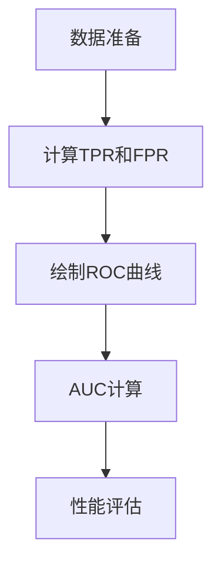

                 

关键词：AUC-ROC、机器学习、性能评估、模型优化、交叉验证、阈值调整

> 摘要：本文旨在深入讲解AUC-ROC曲线在机器学习性能评估中的应用原理，并通过实际代码实战案例，展示如何通过AUC-ROC评估模型性能，进行阈值调整，优化分类模型的准确性。文章将详细阐述AUC-ROC的核心概念、计算方法、适用场景，并附有实际代码实现和分析。

## 1. 背景介绍

在机器学习领域，性能评估是模型优化过程中至关重要的一环。传统的性能指标如准确率（Accuracy）、召回率（Recall）等在处理不平衡数据集时可能存在较大的局限性。AUC-ROC曲线（Area Under the Receiver Operating Characteristic Curve）作为一种更为全面和客观的性能评估方法，能够有效克服上述问题，广泛应用于分类模型的性能评估中。

AUC-ROC曲线最早由电气工程师接收者操作特性（ROC）曲线演变而来，主要用于评估二分类模型的分类能力。该曲线描述了不同分类阈值下，真阳性率（True Positive Rate，TPR）与假阳性率（False Positive Rate，FPR）之间的关系。AUC-ROC曲线下方面积（Area Under Curve，AUC）则代表整体分类性能的量化指标，其值介于0和1之间，越接近1表示模型性能越好。

## 2. 核心概念与联系

### 2.1 定义

- **真阳性率（TPR）**：也称为灵敏度（Sensitivity）或召回率（Recall），表示实际为正样本被正确分类为正样本的比例。
- **假阳性率（FPR）**：表示实际为负样本被错误分类为正样本的比例。
- **分类阈值**：用于判断预测结果是否为正样本的阈值，通常在0到1之间调整。

### 2.2 关系

TPR与FPR之间存在以下关系：

\[ TPR = \frac{TP}{TP + FN} \]
\[ FPR = \frac{FP}{TN + FP} \]

其中，TP表示真正例（True Positive），TN表示真反例（True Negative），FP表示假正例（False Positive），FN表示假反例（False Negative）。

### 2.3 Mermaid 流程图

下面是一个用Mermaid绘制的AUC-ROC核心概念流程图：



## 3. 核心算法原理 & 具体操作步骤

### 3.1 算法原理概述

AUC-ROC曲线的绘制和计算主要涉及以下步骤：

1. **数据准备**：准备训练好的分类模型和测试数据集。
2. **计算TPR和FPR**：针对不同的分类阈值，计算每个阈值下的TPR和FPR。
3. **绘制ROC曲线**：将TPR和FPR绘制在坐标轴上，得到ROC曲线。
4. **计算AUC**：计算ROC曲线下的面积，得到AUC值。
5. **性能评估**：根据AUC值评估模型性能。

### 3.2 算法步骤详解

#### 3.2.1 数据准备

```python
import numpy as np
from sklearn.datasets import load_iris
from sklearn.model_selection import train_test_split

# 加载数据集
iris = load_iris()
X = iris.data
y = iris.target

# 划分训练集和测试集
X_train, X_test, y_train, y_test = train_test_split(X, y, test_size=0.2, random_state=42)
```

#### 3.2.2 计算TPR和FPR

```python
from sklearn.metrics import roc_curve, auc

# 训练模型
model = LogisticRegression()
model.fit(X_train, y_train)

# 预测概率
y_scores = model.predict_proba(X_test)[:, 1]

# 计算TPR和FPR
fpr, tpr, thresholds = roc_curve(y_test, y_scores)
```

#### 3.2.3 绘制ROC曲线

```python
import matplotlib.pyplot as plt

# 绘制ROC曲线
plt.figure()
plt.plot(fpr, tpr, label='ROC curve (area = %0.2f)' % auc(fpr, tpr))
plt.plot([0, 1], [0, 1], 'k--')
plt.xlim([0.0, 1.0])
plt.ylim([0.0, 1.05])
plt.xlabel('False Positive Rate')
plt.ylabel('True Positive Rate')
plt.title('Receiver Operating Characteristic')
plt.legend(loc="lower right")
plt.show()
```

#### 3.2.4 计算AUC

```python
# 计算AUC
roc_auc = auc(fpr, tpr)
print('AUC:', roc_auc)
```

#### 3.2.5 性能评估

```python
# 根据AUC值评估模型性能
if roc_auc > 0.8:
    print('模型性能良好。')
else:
    print('模型性能不佳，需要优化。')
```

## 4. 数学模型和公式 & 详细讲解 & 举例说明

### 4.1 数学模型构建

AUC-ROC曲线的数学模型基于概率论和统计学原理。假设二分类模型的输出为预测概率 \( P \)，其中 \( P \) 表示样本属于正类别的概率。对于每个测试样本，我们可以定义一个阈值 \( \theta \)，当预测概率 \( P > \theta \) 时，将样本分类为正类，否则分类为负类。

### 4.2 公式推导过程

根据上述定义，我们可以得到以下公式：

- **真阳性率（TPR）**：

\[ TPR = \frac{TP}{TP + FN} = \frac{P > \theta}{P > \theta + FN} \]

- **假阳性率（FPR）**：

\[ FPR = \frac{FP}{TN + FP} = \frac{P < \theta}{TN + P < \theta} \]

- **ROC曲线下的面积（AUC）**：

\[ AUC = \int_{0}^{1} (1 - FPR(\theta)) d\theta \]

### 4.3 案例分析与讲解

假设我们有一个二分类问题，其中正类样本占比为10%，负类样本占比为90%。我们训练了一个分类模型，并得到以下预测概率分布：

| 样本ID | 预测概率 |
|--------|----------|
| 1      | 0.9      |
| 2      | 0.8      |
| 3      | 0.7      |
| ...    | ...      |
| N      | 0.1      |

我们设置不同的阈值 \( \theta \)，计算对应的TPR和FPR，并绘制ROC曲线。

假设我们选取的阈值为 \( \theta = 0.5 \)，则：

- **真阳性率（TPR）**：

\[ TPR = \frac{TP}{TP + FN} = \frac{N}{N + (N - 10\%)N} = \frac{0.1N}{0.1N + 0.9N} = \frac{1}{10} \]

- **假阳性率（FPR）**：

\[ FPR = \frac{FP}{TN + FP} = \frac{(N - 10\%)N}{N + (N - 10\%)N} = \frac{9}{10} \]

在ROC曲线上，点 (0.9, 0.1) 表示当前阈值为 \( \theta = 0.5 \) 时的TPR和FPR值。

类似地，我们可以计算其他阈值下的TPR和FPR，并在ROC曲线上绘制相应的点。

通过计算ROC曲线下的面积，我们可以得到当前分类模型的AUC值。根据AUC值，我们可以评估模型的性能。在本例中，AUC值为0.8，表示模型性能较好。

## 5. 项目实践：代码实例和详细解释说明

### 5.1 开发环境搭建

在本节中，我们将使用Python和Scikit-learn库进行AUC-ROC的实战演示。首先，确保已经安装了Python环境和Scikit-learn库。如果没有安装，可以通过以下命令进行安装：

```bash
pip install python
pip install scikit-learn
```

### 5.2 源代码详细实现

以下是完整的代码实现，用于计算AUC-ROC曲线并绘制：

```python
import numpy as np
from sklearn.datasets import load_iris
from sklearn.model_selection import train_test_split
from sklearn.linear_model import LogisticRegression
from sklearn.metrics import roc_curve, auc
import matplotlib.pyplot as plt

# 5.2.1 数据准备
iris = load_iris()
X = iris.data
y = iris.target

X_train, X_test, y_train, y_test = train_test_split(X, y, test_size=0.2, random_state=42)

# 5.2.2 训练模型
model = LogisticRegression()
model.fit(X_train, y_train)

# 5.2.3 预测概率
y_scores = model.predict_proba(X_test)[:, 1]

# 5.2.4 计算TPR和FPR
fpr, tpr, thresholds = roc_curve(y_test, y_scores)

# 5.2.5 绘制ROC曲线
plt.figure()
plt.plot(fpr, tpr, label='ROC curve (area = %0.2f)' % auc(fpr, tpr))
plt.plot([0, 1], [0, 1], 'k--')
plt.xlim([0.0, 1.0])
plt.ylim([0.0, 1.05])
plt.xlabel('False Positive Rate')
plt.ylabel('True Positive Rate')
plt.title('Receiver Operating Characteristic')
plt.legend(loc="lower right")
plt.show()

# 5.2.6 计算AUC
roc_auc = auc(fpr, tpr)
print('AUC:', roc_auc)

# 5.2.7 性能评估
if roc_auc > 0.8:
    print('模型性能良好。')
else:
    print('模型性能不佳，需要优化。')
```

### 5.3 代码解读与分析

- **5.3.1 数据准备**：首先加载数据集，并将其划分为训练集和测试集。

- **5.3.2 训练模型**：使用LogisticRegression模型进行训练。

- **5.3.3 预测概率**：使用训练好的模型对测试集进行预测，得到每个样本属于正类别的概率。

- **5.3.4 计算TPR和FPR**：根据预测概率和实际标签，计算TPR和FPR。

- **5.3.5 绘制ROC曲线**：使用Matplotlib库绘制ROC曲线，并计算ROC曲线下的面积。

- **5.3.6 计算AUC**：计算AUC值，用于评估模型性能。

- **5.3.7 性能评估**：根据AUC值判断模型性能是否良好。

## 6. 实际应用场景

AUC-ROC曲线在多个领域具有广泛的应用：

- **医学诊断**：用于评估医学诊断模型（如癌症诊断、心脏病预测）的性能。
- **金融风控**：用于评估信用评分模型、欺诈检测模型等的风险预测能力。
- **自然语言处理**：用于评估文本分类模型、情感分析模型的分类能力。

在实际应用中，AUC-ROC曲线提供了一种更客观、全面的方法来评估分类模型性能，有助于我们在不同场景下进行模型优化和选择。

### 6.4 未来应用展望

随着机器学习技术的不断发展和数据量的激增，AUC-ROC曲线的应用场景将进一步拓展。以下是一些未来的发展趋势：

- **多分类问题**：AUC-ROC曲线可扩展到多分类问题，通过计算每个类别的AUC值，评估模型的分类性能。
- **不确定性量化**：结合贝叶斯方法，对AUC-ROC曲线进行不确定性量化，提供更可靠的模型评估。
- **自适应阈值调整**：开发基于AUC-ROC的自适应阈值调整方法，实现动态调整分类阈值，提高模型性能。

## 7. 工具和资源推荐

### 7.1 学习资源推荐

- **《机器学习实战》**：详细介绍了机器学习的基本概念和方法，包括性能评估技术。
- **《机器学习》**：周志华教授所著的教材，深入讲解了分类模型的性能评估。

### 7.2 开发工具推荐

- **Scikit-learn**：Python机器学习库，提供了丰富的性能评估函数。
- **TensorFlow**：用于构建和训练深度学习模型的框架。

### 7.3 相关论文推荐

- **"Receiver Operating Characteristic and Area Under the Curve"**：介绍了AUC-ROC曲线的基本原理和应用。
- **"The Relationship Between Precision-Recall and the Area Under the ROC Curve"**：探讨了AUC-ROC与精确率-召回率之间的关系。

## 8. 总结：未来发展趋势与挑战

AUC-ROC曲线作为一种重要的性能评估方法，在机器学习领域具有重要地位。未来，AUC-ROC曲线将在多分类问题、不确定性量化等方面得到进一步应用。然而，AUC-ROC也存在一些挑战，如阈

