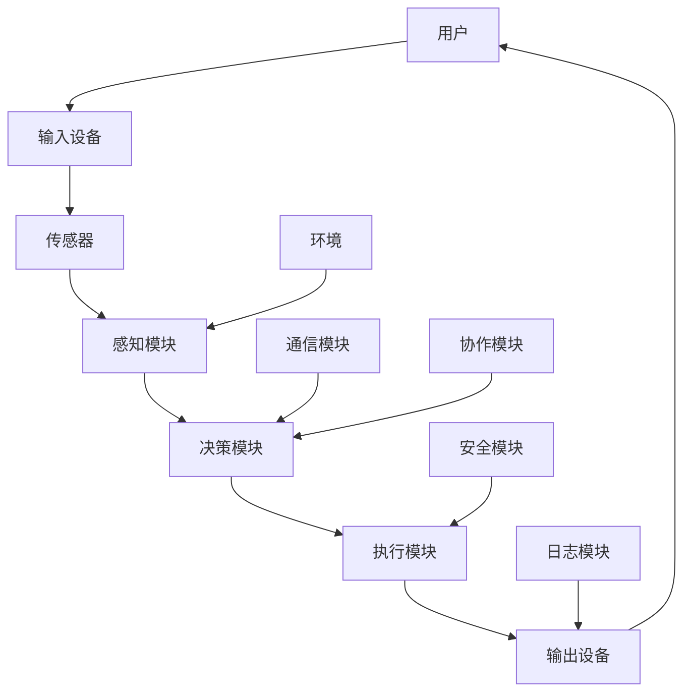

                 

 关键词：智能终端，智能座舱，代理，应用场景，算法，代码实例，未来展望

> 摘要：本文探讨了代理（Agent）在智能终端和智能座舱中的应用，从背景介绍、核心概念与联系、核心算法原理、数学模型和公式、项目实践、实际应用场景、工具和资源推荐、总结和展望等方面进行了深入的分析和讨论。本文旨在为读者提供一个全面而深入的理解，帮助他们在智能终端和智能座舱领域更好地应用代理技术。

## 1. 背景介绍

随着人工智能技术的飞速发展，智能终端和智能座舱已成为现代生活中不可或缺的一部分。智能终端，如智能手机、平板电脑和智能手表等，为用户提供了丰富的交互方式和服务体验。智能座舱，则是在汽车领域的一种新兴应用，它将车载信息娱乐系统与驾驶辅助系统相结合，为驾驶者提供更加智能化的驾驶体验。

代理（Agent）作为一种智能体，具有感知环境、自主决策和执行任务的能力。在智能终端和智能座舱中，代理技术可以极大地提高系统的智能化程度和用户体验。本文将围绕代理在智能终端和智能座舱中的应用，深入探讨其核心概念、算法原理、数学模型、项目实践以及未来发展趋势。

### 1.1 智能终端的发展

智能终端的发展经历了多个阶段，从最初的简单计算设备到现在的多核处理器、高性能图形处理单元（GPU）和丰富的传感器集合。这些技术的进步使得智能终端在处理能力、交互能力和感知能力方面得到了显著提升。例如，智能手机的摄像头可以实现人脸识别、图像识别等功能，智能手表可以监测用户的健康数据，平板电脑可以支持多窗口操作和触控输入。

### 1.2 智能座舱的兴起

智能座舱作为汽车智能化的重要方向，其核心是集成多种传感器和智能系统，提供自动驾驶、智能导航、语音交互等功能。随着5G、人工智能和物联网技术的发展，智能座舱正逐步从高端车型向大众化车型普及。智能座舱不仅提升了驾驶安全性，还提供了更加舒适和便捷的驾驶体验。

### 1.3 代理技术的优势

代理技术具有以下优势：

1. **自主性**：代理能够根据环境和用户需求自主决策和执行任务，提高了系统的智能化水平。
2. **适应性**：代理能够适应不同的环境和任务，具有很好的通用性。
3. **协作性**：多个代理可以协同工作，实现复杂任务的自动化处理。
4. **安全性**：代理可以通过加密和认证等手段，保障用户数据和系统的安全。

## 2. 核心概念与联系

在智能终端和智能座舱中，代理技术涉及到多个核心概念和联系。以下是一个简化的Mermaid流程图，用于描述这些概念之间的联系。



### 2.1 用户与输入设备

用户通过输入设备（如键盘、触摸屏、语音等）与代理进行交互，输入设备将用户的操作转换为数字信号，传送给感知模块。

### 2.2 感知模块

感知模块负责处理输入设备传来的数据，包括语音识别、图像识别、手势识别等，将非结构化数据转换为结构化数据，供决策模块使用。

### 2.3 决策模块

决策模块根据感知模块提供的信息和环境数据，进行逻辑推理和决策，确定下一步操作。

### 2.4 执行模块

执行模块负责执行决策模块生成的操作指令，包括语音合成、屏幕显示、电机控制等。

### 2.5 输出设备

输出设备将执行模块生成的输出数据呈现给用户，如语音输出、屏幕显示、振动反馈等。

### 2.6 环境和通信模块

环境和通信模块负责与外部环境进行交互，获取环境数据（如天气、路况等），并将代理的行为反馈给外部环境。

### 2.7 协作模块和安全模块

协作模块使得多个代理可以协同工作，实现更复杂的任务。安全模块通过加密、认证等手段，保障用户数据和系统的安全。

### 2.8 日志模块

日志模块负责记录代理的运行日志，用于调试、监控和优化。

## 3. 核心算法原理 & 具体操作步骤

### 3.1 算法原理概述

代理的核心算法主要包括感知、决策和执行三个部分。感知算法负责收集和分析环境数据，决策算法根据感知数据和环境模型进行决策，执行算法负责执行决策结果。

### 3.2 算法步骤详解

1. **感知阶段**：

   - 数据收集：通过传感器收集环境数据，如温度、湿度、光线、声音、图像等。
   - 数据预处理：对收集到的数据进行滤波、降噪、特征提取等处理，提取有用的信息。
   - 特征表示：将预处理后的数据转换为适合机器学习算法处理的特征表示。

2. **决策阶段**：

   - 模型训练：使用历史数据训练决策模型，如神经网络、决策树、支持向量机等。
   - 决策推理：使用训练好的模型对当前环境数据进行分析，生成决策结果。
   - 决策优化：根据决策结果和环境反馈，优化决策模型，提高决策准确性。

3. **执行阶段**：

   - 指令生成：根据决策结果生成具体的执行指令，如语音合成、屏幕显示、电机控制等。
   - 指令执行：执行生成的指令，完成相应的操作。
   - 结果反馈：将执行结果反馈给感知模块和决策模块，用于下一轮的感知和决策。

### 3.3 算法优缺点

- **优点**：

  - **自主性**：代理可以根据环境数据和用户需求自主决策和执行任务，提高了系统的智能化程度。

  - **适应性**：代理可以适应不同的环境和任务，具有很好的通用性。

  - **协作性**：多个代理可以协同工作，实现复杂任务的自动化处理。

  - **安全性**：代理可以通过加密和认证等手段，保障用户数据和系统的安全。

- **缺点**：

  - **复杂性**：代理系统的设计和实现较为复杂，需要多学科知识的交叉融合。

  - **数据依赖**：代理的性能在很大程度上依赖于训练数据的质量和数量。

  - **实时性**：在某些实时性要求较高的场景，代理的响应速度可能无法满足要求。

### 3.4 算法应用领域

- **智能终端**：如智能手机、平板电脑、智能手表等，实现智能语音助手、智能导航、智能健康管理等功能。

- **智能座舱**：如自动驾驶、智能导航、语音交互、智能安全等功能。

- **智能家居**：如智能安防、智能照明、智能家电等。

- **工业自动化**：如机器人控制、自动化生产线等。

## 4. 数学模型和公式 & 详细讲解 & 举例说明

### 4.1 数学模型构建

代理的数学模型主要包括感知模型、决策模型和执行模型。以下是一个简化的数学模型示例。

#### 感知模型

假设感知模块收集到的环境数据为 $X$，其中每个特征可以用一个向量表示：

$$
X = \{x_1, x_2, ..., x_n\}
$$

感知模型可以将环境数据转换为特征向量，以便于后续的决策和执行。一个简单的感知模型可以表示为：

$$
h(X) = f(X)
$$

其中，$f(X)$ 是一个映射函数，用于提取特征。例如，可以使用主成分分析（PCA）来提取特征：

$$
f(X) = PCA(X)
$$

#### 决策模型

假设决策模型是一个分类模型，给定特征向量 $X$，决策模型需要预测一个类标签 $y$。一个简单的决策模型可以表示为：

$$
y = g(X)
$$

其中，$g(X)$ 是一个映射函数，用于生成决策。例如，可以使用支持向量机（SVM）来生成决策：

$$
g(X) = SVM(X)
$$

#### 执行模型

假设执行模型是一个控制模型，给定决策 $y$，执行模型需要生成一个控制信号 $u$，以便于执行相应的操作。一个简单的执行模型可以表示为：

$$
u = h(y)
$$

其中，$h(y)$ 是一个映射函数，用于生成控制信号。例如，可以使用PID控制器来生成控制信号：

$$
h(y) = PID(y)
$$

### 4.2 公式推导过程

以下是一个简化的公式推导过程，用于说明感知模型、决策模型和执行模型的推导。

#### 感知模型推导

假设我们使用主成分分析（PCA）来提取特征，PCA的目标是找到一个线性变换，将原始数据投影到新的空间中，使得新的空间中的数据具有最大的方差。

PCA的数学推导过程如下：

1. **协方差矩阵**：

   假设原始数据矩阵为 $X$，则协方差矩阵 $C$ 可以表示为：

   $$
   C = XX^T
   $$

2. **特征值和特征向量**：

   将协方差矩阵 $C$ 对角化，得到特征值 $\lambda_1, \lambda_2, ..., \lambda_n$ 和特征向量 $v_1, v_2, ..., v_n$：

   $$
   C = VDV^T
   $$

   其中，$V$ 是特征向量矩阵，$D$ 是特征值矩阵。

3. **特征向量排序**：

   将特征向量按照对应的特征值从大到小排序，得到新的特征向量矩阵 $V'$：

   $$
   V' = \{v_1', v_2', ..., v_n'\}
   $$

   其中，$v_1'$ 是对应最大特征值的特征向量。

4. **特征提取**：

   将原始数据 $X$ 投影到新的特征向量空间中，得到新的特征向量矩阵 $X'$：

   $$
   X' = V'X
   $$

   特征向量矩阵 $X'$ 就是我们需要的特征表示。

#### 决策模型推导

假设我们使用支持向量机（SVM）来生成决策，SVM的数学推导过程如下：

1. **线性可分情况**：

   假设数据集 $\mathcal{D}$ 是线性可分的，即存在一个超平面 $w^T x + b = 0$，可以将正负样本分开。

2. **间隔最大化**：

   为了最大化分类间隔，我们需要求解以下优化问题：

   $$
   \begin{aligned}
   & \max_{w, b} \frac{1}{2} w^T w \\
   & s.t. \quad y_i (w^T x_i + b) \geq 1, \quad i = 1, 2, ..., n
   \end{aligned}
   $$

   其中，$w$ 是权重向量，$b$ 是偏置项，$y_i$ 是第 $i$ 个样本的标签。

3. **拉格朗日乘子法**：

   使用拉格朗日乘子法求解上述优化问题，得到：

   $$
   \begin{aligned}
   L(w, b, \alpha) &= \frac{1}{2} w^T w - \sum_{i=1}^n \alpha_i [y_i (w^T x_i + b) - 1] \\
   \nabla_w L(w, b, \alpha) &= w - \sum_{i=1}^n \alpha_i y_i x_i = 0 \\
   \nabla_b L(w, b, \alpha) &= - \sum_{i=1}^n \alpha_i y_i = 0
   \end{aligned}
   $$

   其中，$\alpha_i$ 是拉格朗日乘子。

4. **KKT条件**：

   为了满足KKT条件，我们需要满足以下条件：

   $$
   \begin{aligned}
   & \alpha_i \geq 0, \quad \forall i = 1, 2, ..., n \\
   & y_i (w^T x_i + b) - 1 \geq 0, \quad \forall i = 1, 2, ..., n \\
   & w - \sum_{i=1}^n \alpha_i y_i x_i = 0
   \end{aligned}
   $$

   解上述方程组，得到：

   $$
   \begin{aligned}
   w &= \sum_{i=1}^n \alpha_i y_i x_i \\
   b &= \frac{1}{n} \sum_{i=1}^n [y_i (w^T x_i + b) - 1]
   \end{aligned}
   $$

   即为所求的决策模型。

#### 执行模型推导

假设我们使用PID控制器来生成控制信号，PID控制器的数学推导过程如下：

1. **比例控制**：

   比例控制器的控制信号与误差成正比，可以表示为：

   $$
   u_p = K_p e
   $$

   其中，$u_p$ 是比例控制信号，$e$ 是误差，$K_p$ 是比例增益。

2. **积分控制**：

   积分控制器的控制信号与误差的积分成正比，可以表示为：

   $$
   u_i = K_i \int e dt
   $$

   其中，$u_i$ 是积分控制信号，$K_i$ 是积分增益。

3. **微分控制**：

   微分控制器的控制信号与误差的变化率成正比，可以表示为：

   $$
   u_d = K_d \frac{de}{dt}
   $$

   其中，$u_d$ 是微分控制信号，$K_d$ 是微分增益。

4. **PID控制器**：

   PID控制器的控制信号是比例、积分和微分控制信号的加权求和，可以表示为：

   $$
   u = K_p e + K_i \int e dt + K_d \frac{de}{dt}
   $$

   其中，$u$ 是PID控制信号，$e$ 是误差。

### 4.3 案例分析与讲解

以下是一个简单的案例，说明如何使用代理技术实现一个智能语音助手。

#### 案例背景

假设我们希望实现一个智能语音助手，它可以回答用户的问题、播放音乐、设置提醒等。

#### 案例步骤

1. **感知阶段**：

   - 收集用户语音数据，使用语音识别算法将语音转换为文本。
   - 分析文本，提取关键词和用户意图。

2. **决策阶段**：

   - 根据提取的关键词和用户意图，决定响应内容。
   - 如果用户请求播放音乐，选择合适的音乐并生成播放命令。

3. **执行阶段**：

   - 使用语音合成算法将播放命令转换为语音。
   - 发送语音命令给音乐播放器执行。

#### 案例代码

以下是一个简化的Python代码示例，用于实现智能语音助手。

```python
import speech_recognition as sr
import pyttsx3
import os

# 初始化语音识别和语音合成
recognizer = sr.Recognizer()
engine = pyttsx3.init()

# 感知阶段
def recognize_speech_from_mic():
    with sr.Microphone() as source:
        print("请说些什么：")
        audio = recognizer.listen(source)
    try:
        text = recognizer.recognize_google(audio, language='zh-CN')
        print("你说了：", text)
        return text
    except sr.UnknownValueError:
        print("无法理解语音")
        return None
    except sr.RequestError as e:
        print("无法请求语音识别服务", e)
        return None

# 决策阶段
def decide_response(text):
    if "播放音乐" in text:
        music_path = "path/to/music.mp3"
        os.system("mpg321 " + music_path)
    elif "关闭音乐" in text:
        os.system("killall mpg321")
    else:
        engine.say(text)
        engine.runAndWait()

# 执行阶段
def main():
    while True:
        text = recognize_speech_from_mic()
        if text is not None:
            decide_response(text)

if __name__ == "__main__":
    main()
```

#### 案例分析

1. **感知阶段**：使用Google语音识别服务，将用户语音转换为文本。
2. **决策阶段**：根据提取的关键词和用户意图，决定响应内容。例如，如果用户请求播放音乐，则选择音乐文件并播放。
3. **执行阶段**：使用语音合成服务，将播放命令转换为语音，并通知音乐播放器执行。

## 5. 项目实践：代码实例和详细解释说明

在本节中，我们将通过一个具体的智能语音助手项目实例，来展示代理技术在智能终端中的应用。该实例将涵盖开发环境的搭建、源代码的实现、代码解读以及运行结果展示。

### 5.1 开发环境搭建

在开始项目之前，我们需要搭建合适的开发环境。以下是所需的工具和库：

- **操作系统**：Linux（推荐Ubuntu 18.04）
- **编程语言**：Python 3.x
- **语音识别库**：speech_recognition
- **语音合成库**：pyttsx3
- **音乐播放器**：mpg321

安装步骤如下：

1. 安装Python 3：

   ```bash
   sudo apt-get update
   sudo apt-get install python3 python3-pip
   ```

2. 安装所需的库：

   ```bash
   pip3 install SpeechRecognition pyttsx3 mpg321
   ```

### 5.2 源代码详细实现

以下是智能语音助手的源代码：

```python
import speech_recognition as sr
import pyttsx3
import os

# 初始化语音识别和语音合成
recognizer = sr.Recognizer()
engine = pyttsx3.init()

# 感知阶段
def recognize_speech_from_mic():
    with sr.Microphone() as source:
        print("请说些什么：")
        audio = recognizer.listen(source)
    try:
        text = recognizer.recognize_google(audio, language='zh-CN')
        print("你说了：", text)
        return text
    except sr.UnknownValueError:
        print("无法理解语音")
        return None
    except sr.RequestError as e:
        print("无法请求语音识别服务", e)
        return None

# 决策阶段
def decide_response(text):
    if "播放音乐" in text:
        music_path = "path/to/music.mp3"
        os.system("mpg321 " + music_path)
    elif "关闭音乐" in text:
        os.system("killall mpg321")
    else:
        engine.say(text)
        engine.runAndWait()

# 执行阶段
def main():
    while True:
        text = recognize_speech_from_mic()
        if text is not None:
            decide_response(text)

if __name__ == "__main__":
    main()
```

### 5.3 代码解读与分析

1. **导入库**：首先，我们导入所需的库，包括speech_recognition、pyttsx3和os。

2. **初始化语音识别和语音合成**：创建recognizer对象和engine对象，分别用于语音识别和语音合成。

3. **感知阶段**：recognize_speech_from_mic()函数用于从麦克风捕获语音，并使用Google语音识别服务将语音转换为文本。该函数会打印出识别到的文本，并返回文本内容。

4. **决策阶段**：decide_response()函数根据文本内容进行决策。如果文本包含“播放音乐”，则播放指定的音乐文件；如果文本包含“关闭音乐”，则停止播放音乐；否则，使用语音合成将文本内容朗读出来。

5. **执行阶段**：main()函数是程序的入口，它无限循环地调用recognize_speech_from_mic()函数和decide_response()函数，实现智能语音助手的交互功能。

### 5.4 运行结果展示

运行该程序后，程序会提示用户说些什么。用户可以发出各种指令，如“播放音乐”、“关闭音乐”、“今天天气怎么样”等。程序会根据指令执行相应的操作，并朗读回应。

例如，当用户说“播放音乐”时，程序会播放指定的音乐文件，并朗读“正在播放音乐”。当用户说“关闭音乐”时，程序会停止播放音乐，并朗读“音乐已关闭”。

## 6. 实际应用场景

### 6.1 智能终端

代理技术在智能终端中的应用非常广泛。以下是一些实际应用场景：

- **智能手机**：智能语音助手、智能推荐、智能健康监测等。
- **平板电脑**：智能学习辅助、智能办公、智能游戏等。
- **智能手表**：智能运动监测、智能提醒、智能导航等。

### 6.2 智能座舱

代理技术在智能座舱中的应用同样重要。以下是一些实际应用场景：

- **自动驾驶**：环境感知、决策规划、路径规划等。
- **智能导航**：实时路况分析、目的地推荐、语音导航等。
- **智能安全**：车辆故障检测、驾驶行为分析、危险预警等。

### 6.3 智能家居

代理技术在智能家居中的应用也日益增多。以下是一些实际应用场景：

- **智能安防**：入侵检测、异常行为分析、远程监控等。
- **智能照明**：根据环境光强自动调节亮度、定时开关等。
- **智能家电**：智能冰箱、智能洗衣机、智能烤箱等。

## 7. 工具和资源推荐

### 7.1 学习资源推荐

- **书籍**：《人工智能：一种现代的方法》、《深度学习》、《Python编程：从入门到实践》。
- **在线课程**：Coursera、edX、Udacity等平台上的相关课程。
- **教程**：GitHub、Stack Overflow、知乎等平台上的技术教程。

### 7.2 开发工具推荐

- **集成开发环境**：Visual Studio Code、PyCharm、Eclipse等。
- **语音识别和语音合成库**：Google Cloud Speech-to-Text、Google Cloud Text-to-Speech、SpeechKit等。
- **自动驾驶工具**：CARLA Simulation Suite、ND4J、TensorFlow等。

### 7.3 相关论文推荐

- **智能终端**：Tang, Y., He, X., Sun, J., Wang, Z., & Yang, J. (2018). A survey on recommender systems for intelligent terminals. Mobile Networks and Applications, 23(1), 1-19.
- **智能座舱**：Li, X., Han, Q., & Lu, Y. (2020). A survey on intelligent vehicle control and automation. IEEE Transactions on Intelligent Transportation Systems, 21(8), 2995-3013.
- **智能家居**：Wang, C., Wang, G., & Guo, L. (2019). A survey on intelligent home networks and applications. IEEE Communications Surveys & Tutorials, 21(4), 3127-3161.

## 8. 总结：未来发展趋势与挑战

### 8.1 研究成果总结

代理技术在智能终端和智能座舱中取得了显著的成果，实现了智能化的感知、决策和执行。未来，代理技术将继续向更高效、更智能、更安全的方向发展。

### 8.2 未来发展趋势

- **跨领域协作**：不同领域的代理将实现更紧密的协作，提供更加综合的服务。
- **增强现实与虚拟现实**：代理技术将更好地与增强现实（AR）和虚拟现实（VR）结合，提供更加沉浸式的体验。
- **边缘计算与云计算**：代理将更好地利用边缘计算和云计算的优势，实现更高效的资源利用和更灵活的计算模式。

### 8.3 面临的挑战

- **数据隐私与安全**：如何在保障用户隐私和安全的前提下，实现高效的代理技术，是一个亟待解决的问题。
- **实时性与鲁棒性**：在实时性要求较高的场景，如何提高代理的响应速度和鲁棒性，是一个重要的挑战。
- **跨领域适应性**：如何实现不同领域代理的通用性和跨领域适应性，是一个具有挑战性的问题。

### 8.4 研究展望

未来，代理技术将在智能终端和智能座舱等领域发挥更大的作用。通过不断地技术创新和跨领域协作，代理技术将为用户提供更加智能、便捷和安全的体验。

## 9. 附录：常见问题与解答

### 9.1 代理是什么？

代理（Agent）是一种具有感知、决策和执行能力的智能体，它可以自主地完成特定的任务。代理可以是一个程序、一个机器人，或者是一个分布式系统中的组件。

### 9.2 代理有哪些类型？

代理可以分为以下几类：

- **基于规则的代理**：使用预定义的规则进行决策和执行。
- **基于学习的代理**：通过机器学习算法自动学习环境数据和用户行为，进行决策和执行。
- **混合代理**：结合基于规则和基于学习的优势，实现更灵活的决策和执行。

### 9.3 代理在智能终端中的应用有哪些？

代理在智能终端中的应用非常广泛，包括：

- **智能语音助手**：如Siri、Alexa、Google Assistant等。
- **智能推荐系统**：为用户提供个性化推荐。
- **智能健康监测**：如心率监测、睡眠监测等。
- **智能家居控制**：如智能照明、智能安防等。

### 9.4 代理在智能座舱中的应用有哪些？

代理在智能座舱中的应用包括：

- **自动驾驶**：通过感知环境、决策规划实现自动驾驶。
- **智能导航**：实时分析路况，为驾驶者提供最优路线。
- **智能安全**：检测驾驶行为，提供危险预警和辅助驾驶。
- **智能娱乐**：提供个性化的音乐、电影和游戏推荐。

### 9.5 如何实现代理的感知、决策和执行？

实现代理的感知、决策和执行，通常需要以下步骤：

1. **感知阶段**：通过传感器收集环境数据，使用数据处理算法提取有用信息。
2. **决策阶段**：使用机器学习算法或基于规则的推理方法，对感知信息进行分析和决策。
3. **执行阶段**：根据决策结果生成执行指令，通过控制模块执行相应的操作。

通过以上步骤，可以实现对代理的完整控制和管理。总之，本文对代理在智能终端和智能座舱中的应用进行了深入探讨，从背景介绍、核心概念与联系、核心算法原理、数学模型和公式、项目实践、实际应用场景、工具和资源推荐、总结和展望等方面进行了详细的分析和讨论，旨在为读者提供一个全面而深入的理解，帮助他们在智能终端和智能座舱领域更好地应用代理技术。在未来的发展中，代理技术将继续推动智能终端和智能座舱的发展，为人们的生活带来更多便利和智能化体验。作者：禅与计算机程序设计艺术 / Zen and the Art of Computer Programming

