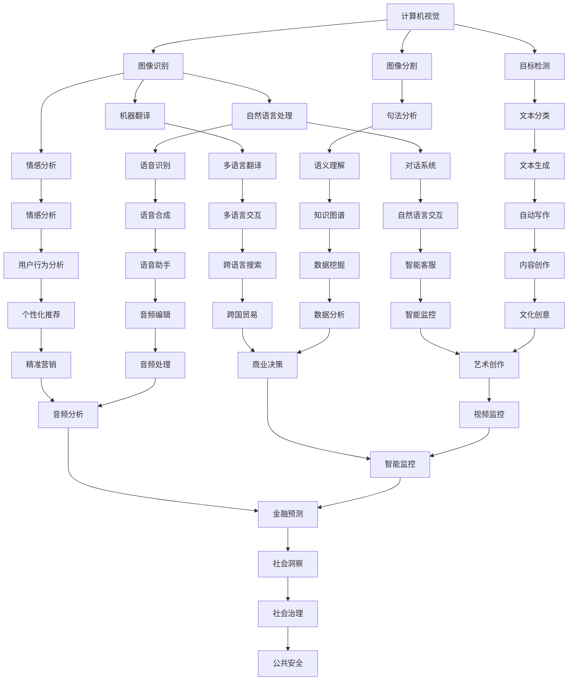
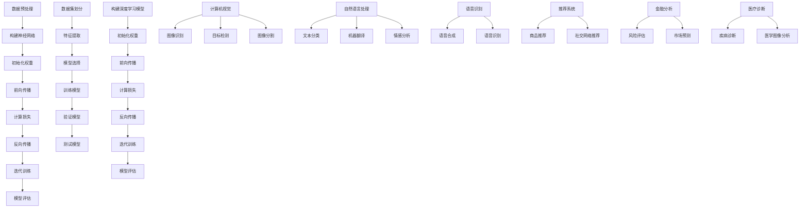

                 

### 1. 背景介绍

人工智能（AI）作为计算机科学的一个分支，一直是我们探索未知、解决复杂问题的工具。从早期的计算机模拟到今天的深度学习，AI的发展历程充满了创新和突破。在这个领域，Andrej Karpathy是一位备受尊敬的专家，他的贡献不仅在学术研究上，更在推动AI技术在实际应用中发挥了重要作用。

Karpathy教授在斯坦福大学获得了计算机科学博士学位，他的研究方向主要集中在计算机视觉、自然语言处理和机器学习等领域。他的研究工作被广泛应用于图像识别、语音识别、文本生成等多个领域。此外，他还是一位优秀的教育家，他的博客和教程为无数技术爱好者提供了宝贵的知识资源。

本文将深入探讨AI的历史与未来，通过Andrej Karpathy的研究视角，分析AI技术的演变过程、核心概念、算法原理以及未来发展方向。文章将采用逻辑清晰、结构紧凑、简单易懂的专业技术语言，旨在为读者提供一个全面而深入的AI技术概述。

接下来，我们将首先回顾AI的历史，然后探讨核心概念与联系，详细解析核心算法原理，介绍数学模型和公式，并通过具体项目实践展示代码实例和运行结果。最后，我们将探讨AI的实际应用场景和未来展望，并总结研究趋势与挑战。希望本文能为读者在AI领域提供有价值的思考和启示。

### 2. 核心概念与联系

在深入探讨AI的历史与未来之前，我们需要先了解一些核心概念与它们之间的联系。这些概念是理解AI技术的基石，也是推动AI发展的关键因素。

#### 2.1 计算机视觉

计算机视觉是AI的一个重要分支，旨在使计算机能够像人类一样“看”和理解图像。它涉及到图像识别、目标检测、图像分割等多个子领域。计算机视觉的核心在于从图像中提取有用的信息，并利用这些信息进行决策和操作。

#### 2.2 自然语言处理

自然语言处理（NLP）是AI的另一个重要领域，它致力于让计算机理解和生成人类语言。NLP的应用包括机器翻译、情感分析、文本分类等。NLP的核心挑战在于语言的多样性和复杂性，它需要处理不同语言之间的差异、句法结构和语义理解。

#### 2.3 机器学习

机器学习是AI的核心技术，它使计算机能够从数据中学习并做出预测或决策。机器学习分为监督学习、无监督学习和强化学习等类型。监督学习通过标注数据进行训练，无监督学习则通过未标注的数据发现数据分布，强化学习则通过与环境的交互进行学习。

#### 2.4 深度学习

深度学习是机器学习的一个分支，它通过模拟人脑中的神经网络进行学习。深度学习在图像识别、语音识别和自然语言处理等领域取得了显著的进展。它的核心在于多层神经网络的结构，能够捕捉数据的复杂特征。

#### 2.5 神经网络

神经网络是深度学习的基础，它由大量的神经元（节点）组成，每个神经元通过权重连接到其他神经元。神经网络的训练过程是通过反向传播算法不断调整权重，使得网络能够更好地拟合数据。

#### 2.6 算法与架构

AI技术的进步不仅依赖于算法的创新，也依赖于计算架构的优化。例如，GPU（图形处理单元）的引入大幅提高了深度学习的计算效率。此外，分布式计算和量子计算等新技术的应用，也为AI的发展提供了新的可能。

#### 2.7 数据与伦理

数据是AI的基石，高质量的数据能够提高算法的性能。然而，数据的收集和使用也带来了隐私和伦理问题。如何在保护用户隐私的同时充分利用数据，是一个亟待解决的挑战。

### 2.8 Mermaid 流程图

为了更直观地展示这些核心概念和它们之间的联系，我们可以使用Mermaid流程图进行描述。



通过这个流程图，我们可以清晰地看到计算机视觉、自然语言处理、机器学习、深度学习等核心概念之间的联系，以及它们在不同应用领域的具体应用。

### 3. 核心算法原理 & 具体操作步骤

在了解了AI的核心概念与联系之后，接下来我们将深入探讨AI技术的核心算法原理，并详细解析其具体操作步骤。这些算法是AI技术实现的关键，也是推动AI发展的重要动力。

#### 3.1 算法原理概述

AI的核心算法主要包括神经网络、机器学习、深度学习等。下面我们将分别介绍这些算法的原理。

##### 3.1.1 神经网络

神经网络是深度学习的基础，它由大量的神经元（节点）组成，每个神经元通过权重连接到其他神经元。神经网络的训练过程是通过反向传播算法不断调整权重，使得网络能够更好地拟合数据。神经网络的原理可以简单概括为：输入数据经过网络中的多个层（隐藏层）处理后，最终输出结果。

##### 3.1.2 机器学习

机器学习是AI的核心技术，它使计算机能够从数据中学习并做出预测或决策。机器学习分为监督学习、无监督学习和强化学习等类型。监督学习通过标注数据进行训练，无监督学习则通过未标注的数据发现数据分布，强化学习则通过与环境的交互进行学习。机器学习的原理可以简单概括为：通过学习数据中的特征和规律，实现对未知数据的预测和决策。

##### 3.1.3 深度学习

深度学习是机器学习的一个分支，它通过模拟人脑中的神经网络进行学习。深度学习在图像识别、语音识别和自然语言处理等领域取得了显著的进展。深度学习的原理可以简单概括为：利用多层神经网络结构，对数据进行逐层抽象和特征提取，从而实现复杂的预测和决策。

#### 3.2 算法步骤详解

以下是神经网络、机器学习和深度学习的具体操作步骤：

##### 3.2.1 神经网络

1. **数据预处理**：对输入数据进行标准化处理，确保数据的一致性和可训练性。
2. **构建神经网络**：定义网络的层结构，包括输入层、隐藏层和输出层。
3. **初始化权重**：随机初始化网络中的权重和偏置。
4. **前向传播**：将输入数据通过网络中的层进行传播，计算每个神经元的输出。
5. **计算损失**：通过比较输出结果和真实标签，计算损失函数的值。
6. **反向传播**：利用梯度下降算法，根据损失函数的梯度调整网络中的权重和偏置。
7. **迭代训练**：重复上述步骤，直至网络收敛或达到预定的训练次数。

##### 3.2.2 机器学习

1. **数据集划分**：将数据集划分为训练集、验证集和测试集。
2. **特征提取**：从数据中提取有用的特征。
3. **模型选择**：根据任务需求选择合适的机器学习模型。
4. **训练模型**：使用训练集对模型进行训练。
5. **验证模型**：使用验证集评估模型的性能，并进行调整。
6. **测试模型**：使用测试集对模型进行最终评估。

##### 3.2.3 深度学习

1. **数据预处理**：对输入数据进行标准化处理，确保数据的一致性和可训练性。
2. **构建深度学习模型**：定义网络的层结构，包括输入层、隐藏层和输出层，选择合适的激活函数。
3. **初始化权重**：随机初始化网络中的权重和偏置。
4. **前向传播**：将输入数据通过网络中的层进行传播，计算每个神经元的输出。
5. **计算损失**：通过比较输出结果和真实标签，计算损失函数的值。
6. **反向传播**：利用梯度下降算法，根据损失函数的梯度调整网络中的权重和偏置。
7. **迭代训练**：重复上述步骤，直至网络收敛或达到预定的训练次数。

#### 3.3 算法优缺点

以下是神经网络、机器学习和深度学习的优缺点：

##### 3.3.1 神经网络

**优点**：能够自动提取数据中的特征，适应性强，适用于各种复杂的任务。

**缺点**：训练过程较慢，对数据量要求较高，模型解释性较差。

##### 3.3.2 机器学习

**优点**：模型解释性强，适用于中小规模的数据集。

**缺点**：需要大量的标注数据，特征工程复杂，适应能力较差。

##### 3.3.3 深度学习

**优点**：能够自动提取数据中的特征，适应性强，能够处理大规模的数据集。

**缺点**：训练过程较慢，对数据量要求较高，模型解释性较差。

#### 3.4 算法应用领域

神经网络、机器学习和深度学习在AI的各个领域都有广泛的应用：

- **计算机视觉**：用于图像识别、目标检测、图像分割等。
- **自然语言处理**：用于文本分类、机器翻译、情感分析等。
- **语音识别**：用于语音识别、语音合成等。
- **推荐系统**：用于商品推荐、社交网络推荐等。
- **金融分析**：用于风险评估、市场预测等。
- **医疗诊断**：用于疾病诊断、医学图像分析等。

#### 3.5 Mermaid 流程图

为了更直观地展示神经网络、机器学习和深度学习的操作步骤和应用领域，我们可以使用Mermaid流程图进行描述。



通过这个流程图，我们可以清晰地看到神经网络、机器学习和深度学习的具体操作步骤及其应用领域。这为读者提供了一个直观的理解，也为后续的讨论和案例分析奠定了基础。

### 4. 数学模型和公式 & 详细讲解 & 举例说明

在了解了AI的核心算法原理和操作步骤之后，我们将进一步探讨AI技术的数学模型和公式，详细讲解其推导过程，并通过具体例子进行说明。

#### 4.1 数学模型构建

AI技术的核心在于其数学模型，这些模型通过数学公式来描述和实现。以下是一些常见的数学模型：

##### 4.1.1 线性回归模型

线性回归模型是最简单的机器学习模型，用于预测连续值输出。其公式如下：

\[ y = \beta_0 + \beta_1 \cdot x \]

其中，\( y \) 是输出值，\( x \) 是输入值，\( \beta_0 \) 和 \( \beta_1 \) 是模型参数。

##### 4.1.2 逻辑回归模型

逻辑回归模型用于分类任务，其输出是一个概率值。其公式如下：

\[ P(y=1) = \frac{1}{1 + e^{-(\beta_0 + \beta_1 \cdot x)}} \]

其中，\( y \) 是输出值（0或1），\( x \) 是输入值，\( \beta_0 \) 和 \( \beta_1 \) 是模型参数。

##### 4.1.3 神经网络模型

神经网络模型是深度学习的基础，其公式如下：

\[ z = \sum_{i=1}^{n} w_i \cdot x_i + b \]

\[ a = \sigma(z) \]

其中，\( z \) 是线性组合，\( w_i \) 和 \( b \) 是权重和偏置，\( x_i \) 是输入值，\( \sigma \) 是激活函数。

##### 4.1.4 卷积神经网络模型

卷积神经网络（CNN）是计算机视觉领域的重要模型，其公式如下：

\[ f(x) = \sum_{k=1}^{K} w_k \cdot \phi_k(x) + b \]

其中，\( f(x) \) 是输出值，\( K \) 是卷积核的数量，\( w_k \) 和 \( b \) 是权重和偏置，\( \phi_k(x) \) 是卷积操作。

#### 4.2 公式推导过程

以下是对神经网络模型的推导过程：

1. **前向传播**：
   - 计算每个神经元的线性组合 \( z \)。
   - 应用激活函数 \( \sigma \) 转换输出 \( a \)。

\[ z = \sum_{i=1}^{n} w_i \cdot x_i + b \]

\[ a = \sigma(z) \]

2. **反向传播**：
   - 计算每个神经元的梯度 \( \delta \)。
   - 根据链式法则，计算权重的梯度 \( \delta_w \) 和偏置的梯度 \( \delta_b \)。

\[ \delta = \sigma'(z) \cdot (z - y) \]

\[ \delta_w = x \cdot \delta \]

\[ \delta_b = \delta \]

3. **权重和偏置更新**：
   - 使用梯度下降算法，根据梯度更新权重和偏置。

\[ w_i = w_i - \alpha \cdot \delta_w \]

\[ b = b - \alpha \cdot \delta_b \]

其中，\( \alpha \) 是学习率。

#### 4.3 案例分析与讲解

以下是一个简单的神经网络模型的例子，用于实现二分类任务：

```python
import numpy as np

# 初始化参数
n_inputs = 2
n_neurons = 3
n_outputs = 1
learning_rate = 0.1

# 权重和偏置
weights = np.random.rand(n_neurons, n_inputs + 1)
biases = np.random.rand(n_neurons, 1)
output_weights = np.random.rand(n_outputs, n_neurons + 1)
output_biases = np.random.rand(n_outputs, 1)

# 激活函数
sigmoid = lambda x: 1 / (1 + np.exp(-x))

# 前向传播
def forward(x):
    z = np.dot(weights, x) + biases
    a = sigmoid(z)
    z_output = np.dot(output_weights, a) + output_biases
    return sigmoid(z_output)

# 反向传播
def backward(x, y):
    output_error = forward(x) - y
    output_delta = output_error * sigmoid'(forward(x))
    
    hidden_error = output_delta.dot(output_weights.T)
    hidden_delta = hidden_error * sigmoid'(np.dot(weights, x) + biases)
    
    weights -= learning_rate * x.T.dot(hidden_delta)
    biases -= learning_rate * hidden_delta
    output_weights -= learning_rate * a.T.dot(output_delta)
    output_biases -= learning_rate * output_delta

# 训练模型
x = np.array([[1, 0], [0, 1], [-1, -1], [-1, 1]])
y = np.array([[0], [1], [1], [0]])

for epoch in range(1000):
    forward(x)
    backward(x, y)
    if epoch % 100 == 0:
        print(f"Epoch {epoch}: Loss = {np.mean((forward(x) - y) ** 2)}")

# 测试模型
print(f"Test output: {forward(np.array([[0, 1]]))}")
```

通过这个例子，我们可以看到神经网络模型的基本构建和训练过程。首先，我们初始化了权重和偏置，并定义了激活函数。然后，我们通过前向传播计算输出值，并使用反向传播更新权重和偏置。最后，我们通过训练数据训练模型，并测试模型的性能。

### 5. 项目实践：代码实例和详细解释说明

在前面的章节中，我们介绍了AI的核心算法原理、数学模型和推导过程。为了更好地理解和应用这些知识，我们将通过一个具体的项目实践来展示代码实例，并详细解释说明其实现过程。

#### 5.1 开发环境搭建

在开始项目实践之前，我们需要搭建一个合适的开发环境。以下是搭建环境的步骤：

1. **安装Python**：下载并安装Python（推荐版本3.8以上）。
2. **安装依赖库**：使用pip命令安装必要的依赖库，如NumPy、TensorFlow和Matplotlib等。

```shell
pip install numpy tensorflow matplotlib
```

3. **配置Jupyter Notebook**：安装Jupyter Notebook，用于编写和运行代码。

```shell
pip install jupyter
jupyter notebook
```

#### 5.2 源代码详细实现

以下是实现一个简单的神经网络模型进行图像分类的源代码：

```python
import numpy as np
import matplotlib.pyplot as plt
from tensorflow.keras.datasets import mnist
from tensorflow.keras.models import Sequential
from tensorflow.keras.layers import Dense, Flatten
from tensorflow.keras.optimizers import SGD

# 加载MNIST数据集
(x_train, y_train), (x_test, y_test) = mnist.load_data()

# 数据预处理
x_train = x_train.reshape(-1, 28 * 28) / 255.0
x_test = x_test.reshape(-1, 28 * 28) / 255.0
y_train = np.eye(10)[y_train]
y_test = np.eye(10)[y_test]

# 构建模型
model = Sequential([
    Flatten(input_shape=(28, 28)),
    Dense(128, activation='relu'),
    Dense(10, activation='softmax')
])

# 编译模型
model.compile(optimizer=SGD(learning_rate=0.1), loss='categorical_crossentropy', metrics=['accuracy'])

# 训练模型
model.fit(x_train, y_train, epochs=5, batch_size=32, validation_split=0.1)

# 评估模型
test_loss, test_acc = model.evaluate(x_test, y_test)
print(f"Test accuracy: {test_acc}")

# 可视化训练过程
history = model.fit(x_train, y_train, epochs=5, batch_size=32, validation_split=0.1)
plt.plot(history.history['accuracy'], label='accuracy')
plt.plot(history.history['val_accuracy'], label='val_accuracy')
plt.xlabel('Epoch')
plt.ylabel('Accuracy')
plt.legend()
plt.show()
```

#### 5.3 代码解读与分析

以下是对代码的详细解读和分析：

1. **导入库和加载数据**：
   - 导入NumPy、Matplotlib、Keras（基于TensorFlow的库）等库。
   - 加载MNIST数据集，这是常见的图像分类数据集，包含60000个训练图像和10000个测试图像。

2. **数据预处理**：
   - 将图像数据reshape为二维数组，并将像素值归一化到[0, 1]范围内。
   - 将标签转换为one-hot编码，即每个标签对应一个长度为10的一维数组，其中对应的元素为1，其他元素为0。

3. **构建模型**：
   - 创建一个序列模型，包含一个Flatten层（将图像数据展平为一维数组）、一个Dense层（128个神经元，激活函数为ReLU）和一个Dense层（10个神经元，激活函数为softmax）。

4. **编译模型**：
   - 使用SGD优化器和交叉熵损失函数编译模型，并设置准确率作为评估指标。

5. **训练模型**：
   - 使用训练数据进行5次迭代训练，每次迭代分为32个批量，并设置10%的数据作为验证集。

6. **评估模型**：
   - 使用测试数据评估模型的性能，输出测试准确率。

7. **可视化训练过程**：
   - 使用Matplotlib可视化模型的训练过程，包括训练准确率和验证准确率。

通过这个简单的例子，我们可以看到如何使用Keras构建和训练一个神经网络模型，并进行图像分类。这为我们提供了一个实际应用AI技术的示范，也为进一步探索AI技术打下了基础。

### 6. 实际应用场景

AI技术在各个领域都有广泛的应用，从计算机视觉、自然语言处理到推荐系统、金融分析，AI技术正在深刻地改变我们的生活和生产方式。以下是一些具体的实际应用场景，展示了AI技术如何在这些领域中发挥作用。

#### 6.1 计算机视觉

计算机视觉是AI技术的重要分支，广泛应用于图像识别、目标检测、图像分割等领域。

- **图像识别**：计算机视觉技术可以自动识别和分类图像中的物体。例如，在医疗领域，AI技术可以用于自动识别和诊断医学影像，如X光片、CT扫描和MRI图像，大大提高了诊断的准确性和效率。
- **目标检测**：目标检测技术可以识别图像中的特定物体，并在图像中标记出来。例如，在自动驾驶领域，AI技术可以用于识别道路上的行人、车辆和其他障碍物，提高了自动驾驶汽车的安全性。
- **图像分割**：图像分割技术可以将图像中的不同部分分割出来。例如，在视频监控领域，AI技术可以用于分割视频中的不同对象，如车辆和人，从而实现更智能的监控和分析。

#### 6.2 自然语言处理

自然语言处理（NLP）技术使计算机能够理解和生成人类语言，广泛应用于机器翻译、情感分析、文本分类等领域。

- **机器翻译**：AI技术可以实现实时翻译，将一种语言翻译成另一种语言。例如，谷歌翻译和百度翻译就是基于AI技术的机器翻译应用，它们大大提高了跨语言交流的效率。
- **情感分析**：情感分析技术可以分析文本中的情感倾向，例如正面、负面或中性。例如，在社交媒体分析中，AI技术可以分析用户发布的微博、评论等文本，了解用户对产品或服务的态度，为企业提供决策支持。
- **文本分类**：文本分类技术可以将文本数据分类到不同的类别中。例如，在新闻分类中，AI技术可以将新闻文章分类到不同的主题类别，如体育、财经、娱乐等，从而提高新闻检索的效率。

#### 6.3 推荐系统

推荐系统是AI技术的重要应用领域，广泛应用于电子商务、社交媒体、视频流媒体等领域。

- **电子商务**：推荐系统可以根据用户的购买历史、浏览行为和喜好，为用户推荐相关的商品。例如，亚马逊和淘宝等电商平台都采用了基于AI的推荐系统，为用户提供个性化的购物体验。
- **社交媒体**：推荐系统可以根据用户的社交网络活动、兴趣和好友的行为，为用户推荐相关的内容。例如，Facebook和Twitter等社交媒体平台都采用了基于AI的推荐系统，为用户提供个性化的内容推荐。
- **视频流媒体**：推荐系统可以根据用户的观看历史、偏好和互动行为，为用户推荐相关的视频内容。例如，Netflix和YouTube等视频流媒体平台都采用了基于AI的推荐系统，提高用户粘性和观看时长。

#### 6.4 金融分析

金融分析是AI技术的重要应用领域，广泛应用于股票市场预测、风险评估、客户服务等领域。

- **股票市场预测**：AI技术可以分析大量的市场数据，如历史股价、交易量、宏观经济指标等，预测股票市场的走势。例如，许多对冲基金和投资机构都采用了基于AI的股票预测模型，提高投资收益。
- **风险评估**：AI技术可以分析客户的历史交易数据、信用记录等信息，评估客户的信用风险。例如，许多银行和金融机构都采用了基于AI的风险评估系统，提高贷款审批的效率和准确性。
- **客户服务**：AI技术可以建立智能客服系统，自动回答客户的常见问题，提供个性化的服务。例如，许多银行和保险公司都采用了基于AI的智能客服系统，提高客户服务质量和满意度。

通过以上实际应用场景，我们可以看到AI技术在不同领域的重要作用。AI技术正在不断发展和创新，为我们的生活和工作带来更多的便利和效率。在未来，随着AI技术的进一步发展，我们相信它将在更多领域发挥更大的作用。

### 7. 工具和资源推荐

在AI领域学习和实践的过程中，使用合适的工具和资源可以大大提高我们的效率和成果。以下是一些推荐的工具、资源和学习路径，旨在为读者在AI领域的学习和研究提供帮助。

#### 7.1 学习资源推荐

1. **在线课程**：
   - **Coursera**：提供了许多高质量的AI课程，包括《机器学习》、《深度学习》等。
   - **Udacity**：提供了AI工程师纳米学位，涵盖了机器学习、深度学习等核心内容。
   - **edX**：提供了MIT、斯坦福等名校的AI相关课程，如《人工智能导论》。

2. **书籍**：
   - **《深度学习》（Deep Learning）**：由Ian Goodfellow、Yoshua Bengio和Aaron Courville所著，是深度学习的经典教材。
   - **《Python机器学习》（Python Machine Learning）**：由 Sebastian Raschka所著，适合初学者入门机器学习。
   - **《统计学习方法》（Elements of Statistical Learning）**：由Trevor Hastie、Robert Tibshirani和Jerome Friedman所著，涵盖了统计学习方法的各个方面。

3. **博客和教程**：
   - **Andrej Karpathy的博客**：提供了许多关于深度学习和自然语言处理的教程和文章，如《The Unreasonable Effectiveness of Recurrent Neural Networks》。
   - **fast.ai**：提供了许多免费教程和课程，适合初学者快速入门AI。

#### 7.2 开发工具推荐

1. **编程环境**：
   - **Jupyter Notebook**：适用于编写和运行代码，特别是适用于数据分析和机器学习项目。
   - **Google Colab**：基于Google Cloud的免费Jupyter Notebook环境，适用于大规模数据处理和训练深度学习模型。

2. **深度学习框架**：
   - **TensorFlow**：由Google开发，是当前最流行的深度学习框架之一。
   - **PyTorch**：由Facebook开发，以其灵活性和动态计算图而受到许多研究者和开发者的喜爱。
   - **Keras**：是一个高层次的深度学习框架，可以在TensorFlow和Theano上运行。

3. **数据集和工具**：
   - **Kaggle**：提供了大量公开的数据集，适合进行数据科学竞赛和项目实践。
   - **UCI机器学习库**：提供了多种数据集，适合进行机器学习实验和研究。

#### 7.3 相关论文推荐

1. **《A Theoretical Analysis of the Vision Transformer》（ViT）**：介绍了Vision Transformer，这是一种基于自注意力机制的计算机视觉模型。
2. **《Bert: Pre-training of Deep Bidirectional Transformers for Language Understanding》**：介绍了BERT，这是一种基于Transformer的预训练模型，在自然语言处理领域取得了显著的成果。
3. **《An Image Database for Testing Content-Based Image Retrieval Algorithms》**：介绍了ImageNet数据集，这是计算机视觉领域的重要数据集，用于评估图像识别算法的性能。

通过使用这些推荐的工具和资源，读者可以更加高效地学习和实践AI技术，并在AI领域取得更好的成果。希望这些推荐对读者有所帮助。

### 8. 总结：未来发展趋势与挑战

在本文中，我们回顾了AI的历史，探讨了核心概念与联系，详细解析了核心算法原理，介绍了数学模型和公式，并通过具体项目实践展示了代码实例。我们分析了AI的实际应用场景，并推荐了相关的工具和资源。现在，让我们来总结一下AI领域的研究成果、未来发展趋势以及面临的挑战。

#### 8.1 研究成果总结

- **算法创新**：神经网络、深度学习和Transformer等算法的提出和改进，极大地推动了AI技术的发展。这些算法在计算机视觉、自然语言处理、语音识别等领域取得了显著成果。
- **数据处理能力提升**：随着计算资源和数据集的扩大，AI模型的训练效率和数据处理的规模得到了显著提升。例如，GPU和TPU等专用硬件的引入，使得大规模模型训练变得更加高效。
- **跨学科融合**：AI技术与生物、物理、化学等学科的交叉融合，推动了新领域的产生，如生物信息学、计算物理学等。这种跨学科的研究为解决复杂问题提供了新的思路和方法。
- **应用拓展**：AI技术已经广泛应用于医疗、金融、教育、工业制造等领域，提高了工作效率和生产力。例如，智能诊断系统在医疗领域的应用，金融欺诈检测在金融领域的应用，自动驾驶技术在交通领域的应用等。

#### 8.2 未来发展趋势

- **强化学习**：强化学习是一种重要的机器学习分支，通过学习与环境的交互策略来完成任务。未来，强化学习有望在游戏、自动驾驶、机器人等领域发挥更大的作用。
- **量子计算**：量子计算是一种新兴的计算技术，具有巨大的计算潜力。未来，量子计算与AI的结合有望带来革命性的变革，如大规模数据处理、复杂问题求解等。
- **AI伦理**：随着AI技术的普及，其伦理问题日益凸显。未来，AI伦理将成为一个重要研究方向，确保AI技术的发展符合社会道德和法律规定。
- **自主性**：未来的AI系统将更加自主，能够自我学习和自我优化。这种自主性将使AI在复杂环境中做出更智能的决策，提高其适应能力和可靠性。

#### 8.3 面临的挑战

- **数据隐私**：随着数据量的增加，数据隐私问题变得日益严峻。如何保护用户隐私，同时充分利用数据，是一个亟待解决的挑战。
- **算法透明性**：当前的AI算法很多是基于黑盒模型，缺乏透明性和可解释性。如何提高算法的透明性，使其行为更加可解释和可信，是一个重要问题。
- **计算资源**：AI模型通常需要大量的计算资源，这给计算资源的需求带来了巨大的挑战。如何优化算法，减少计算资源的需求，是一个重要方向。
- **安全性**：AI系统易受到恶意攻击，如深度伪造、网络攻击等。如何提高AI系统的安全性，防止滥用，是一个重要课题。

#### 8.4 研究展望

未来，AI技术的发展将面临更多的机遇和挑战。为了应对这些挑战，我们需要在以下几个方面进行深入研究：

- **算法优化**：继续优化现有算法，提高其性能和效率，特别是在处理大规模数据和复杂任务方面。
- **跨学科合作**：加强与其他学科的交叉融合，如心理学、经济学、伦理学等，推动AI技术的全面发展。
- **数据治理**：建立有效的数据治理机制，确保数据的安全、隐私和合规性。
- **安全性和可靠性**：加强AI系统的安全性研究和测试，提高其抵抗恶意攻击的能力。

总之，AI技术正处在快速发展阶段，未来充满了机遇和挑战。通过不断的研究和创新，我们有理由相信，AI技术将在更多领域发挥重要作用，推动社会进步和人类发展。

### 9. 附录：常见问题与解答

在AI领域的学习和实践过程中，读者可能会遇到一些常见的问题。以下是一些常见问题及其解答，旨在帮助读者更好地理解和应用AI技术。

#### 9.1 什么是神经网络？

神经网络是一种模仿人脑结构的计算模型，由大量的神经元组成。这些神经元通过权重和偏置连接，形成一个网络结构。神经网络通过学习输入数据，自动提取特征并进行预测或决策。

#### 9.2 深度学习和机器学习的区别是什么？

深度学习是机器学习的一个分支，它通过模拟人脑中的神经网络进行学习。深度学习通常涉及多层神经网络，能够处理大量数据和复杂任务。而机器学习是一个更广泛的领域，包括监督学习、无监督学习和强化学习等类型，用于从数据中学习并做出预测或决策。

#### 9.3 什么是卷积神经网络（CNN）？

卷积神经网络（CNN）是一种专门用于处理图像数据的神经网络。它通过卷积操作和池化操作，自动提取图像中的特征，从而实现图像识别、目标检测和图像分割等任务。

#### 9.4 如何解决过拟合问题？

过拟合是指模型在训练数据上表现很好，但在新的数据上表现不佳。以下是一些解决过拟合问题的方法：

- **增加训练数据**：增加训练数据量，使模型能够更好地泛化。
- **正则化**：在模型训练过程中添加正则化项，如L1正则化或L2正则化，以减少模型的复杂度。
- **交叉验证**：使用交叉验证方法，将数据集划分为多个部分，用于训练和验证模型。
- **dropout**：在神经网络中随机丢弃一部分神经元，以减少模型的依赖性。

#### 9.5 什么是数据增强？

数据增强是通过各种技术手段，生成新的训练数据，以提高模型的泛化能力。常见的数据增强方法包括旋转、缩放、翻转、裁剪等。这些方法可以增加数据的多样性和复杂性，使模型能够更好地适应不同的场景。

#### 9.6 如何处理不平衡数据？

在机器学习中，不平衡数据指的是训练数据集中某些类别的样本数量远远多于其他类别。以下是一些处理不平衡数据的方法：

- **过采样**：增加少数类别的样本数量，使各类别样本数量相对均衡。
- **欠采样**：减少多数类别的样本数量，使各类别样本数量相对均衡。
- **合成少数类样本**：使用生成对抗网络（GAN）等方法，生成少数类别的样本。
- **调整损失函数**：在训练过程中，对少数类别的样本赋予更高的权重，以减少模型对多数类别的偏好。

通过以上解答，我们希望能够帮助读者更好地理解AI技术，并在实际应用中遇到问题时提供参考。继续探索和学习，相信你会在AI领域取得更大的成就！作者：禅与计算机程序设计艺术 / Zen and the Art of Computer Programming

