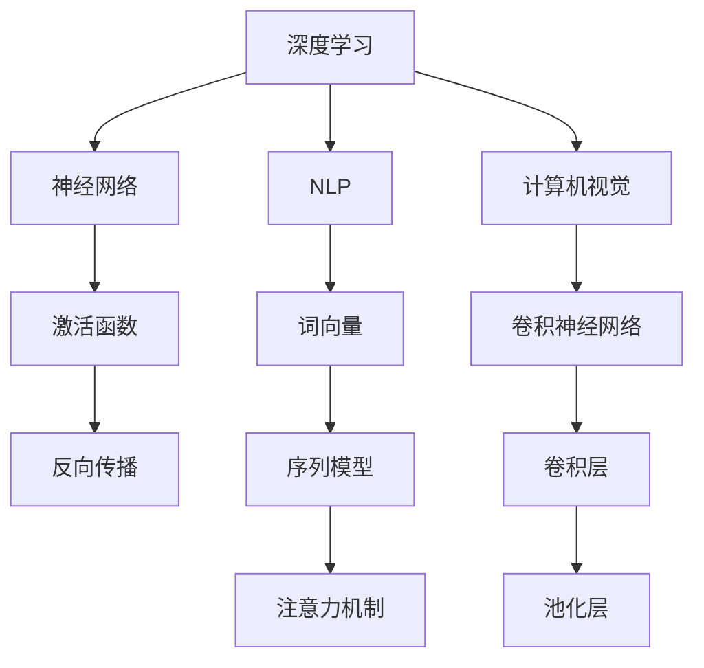

                 

### 1. 背景介绍

在当今这个快速发展的信息技术时代，专业知识的重要性不言而喻。无论是在学术界还是工业界，对于专业知识的需求都日益增长。无论是在计算机科学、人工智能、数据科学还是其他技术领域，不断积累和更新专业知识都显得尤为关键。本文将以Andrej Karpathy为例，探讨他如何通过专业知识的积累，在人工智能领域取得了卓越的成就。

Andrej Karpathy是一位世界知名的人工智能专家，他的研究涉及深度学习、自然语言处理和计算机视觉等多个领域。他在学术和工业界都取得了显著的成绩，发表了大量的高水平论文，并在多个重要的技术会议和研讨会上发表演讲。他的工作不仅推动了人工智能技术的发展，也为其他人提供了宝贵的学习和实践经验。

本文旨在通过分析Andrej Karpathy的专业知识积累过程，为读者提供一些有益的启示。首先，我们将介绍Andrej Karpathy的背景和学术生涯，然后探讨他如何通过系统的学习和实践，逐步积累专业知识。接着，我们将分析他在人工智能领域取得的一些重要成果，并总结他成功的关键因素。最后，我们将讨论专业知识积累对个人和行业的重要性，并展望未来人工智能领域的发展趋势。

### 2. 核心概念与联系

在人工智能领域，核心概念和理论是理解和应用技术的基石。以下将详细阐述几个关键概念，并绘制Mermaid流程图，展示这些概念之间的联系。

#### 2.1. 深度学习

深度学习是一种基于人工神经网络的学习方法，通过模拟人脑神经元之间的连接结构，实现复杂数据的自动特征提取和学习。深度学习的关键概念包括：

- **神经网络**：由大量神经元组成的计算模型，每个神经元接受多个输入，通过激活函数产生输出。
- **激活函数**：用于确定神经元是否被激活的函数，常见的有Sigmoid、ReLU和Tanh等。
- **反向传播**：一种训练神经网络的方法，通过计算输出误差，反向传播误差到每个神经元，更新权重和偏置。

#### 2.2. 自然语言处理

自然语言处理（NLP）是人工智能的一个重要分支，旨在使计算机能够理解和处理人类语言。核心概念包括：

- **词向量**：将单词映射到高维空间中的向量表示，常见的有Word2Vec和GloVe等。
- **序列模型**：用于处理序列数据的模型，如循环神经网络（RNN）和长短期记忆网络（LSTM）。
- **注意力机制**：在处理序列数据时，使模型能够关注到序列中特定的部分，如Transformer中的自注意力机制。

#### 2.3. 计算机视觉

计算机视觉是人工智能的另一个重要分支，涉及让计算机理解和解释图像和视频。核心概念包括：

- **卷积神经网络**（CNN）：通过卷积操作提取图像特征，常用于图像分类和目标检测。
- **卷积层**：用于提取图像局部特征的层，通过滤波器滑动图像进行特征提取。
- **池化层**：用于下采样特征图，减少参数和计算量，常见的有最大池化和平均池化。

#### 2.4. Mermaid流程图

以下是几个核心概念之间的Mermaid流程图：



通过这个流程图，我们可以清晰地看到深度学习、NLP和计算机视觉之间的联系。例如，神经网络是深度学习的基础，同时也是NLP和计算机视觉中的重要组成部分。词向量和序列模型在NLP中起着核心作用，而卷积神经网络和卷积层在计算机视觉中具有重要作用。

#### 2.5. 关键性

这些核心概念不仅在人工智能的不同分支中起到关键作用，还在跨领域的应用中发挥着重要作用。例如，深度学习技术被广泛应用于图像识别、语音识别和自然语言处理；自然语言处理技术被广泛应用于机器翻译、情感分析和文本生成；计算机视觉技术被广泛应用于自动驾驶、人脸识别和医疗影像分析。因此，理解这些核心概念和它们之间的联系，对于掌握人工智能的各个方面具有重要意义。

### 3. 核心算法原理 & 具体操作步骤

在人工智能领域，深度学习、自然语言处理和计算机视觉是三个重要的分支，每个分支都有其核心算法。以下是这些算法的原理以及具体的操作步骤。

#### 3.1 算法原理概述

1. **深度学习**

   深度学习是一种基于多层神经网络的学习方法，通过多层非线性变换提取数据中的特征。核心算法包括：

   - **前向传播**：从输入层开始，将数据通过网络传递到输出层，计算每个神经元的输出。
   - **反向传播**：计算输出层的误差，反向传播到输入层，更新网络的权重和偏置。

2. **自然语言处理**

   自然语言处理旨在使计算机理解和处理人类语言，其核心算法包括：

   - **词嵌入**：将单词映射到高维空间中的向量表示。
   - **循环神经网络（RNN）**：通过递归结构处理序列数据。
   - **长短时记忆网络（LSTM）**：对长序列数据具有更好的记忆能力。

3. **计算机视觉**

   计算机视觉旨在使计算机理解和解释图像和视频，其核心算法包括：

   - **卷积神经网络（CNN）**：通过卷积操作提取图像特征。
   - **目标检测**：识别图像中的多个对象及其位置。
   - **图像分类**：将图像分类到预定义的类别中。

#### 3.2 算法步骤详解

1. **深度学习**

   - **前向传播**：

     将输入数据通过网络传递，计算每个神经元的输出。具体步骤如下：

     1. 初始化网络权重和偏置。
     2. 对于每个神经元，计算输入和权重的乘积，加上偏置。
     3. 通过激活函数计算输出。

   - **反向传播**：

     计算输出误差，反向传播到输入层，更新网络的权重和偏置。具体步骤如下：

     1. 计算输出误差。
     2. 对于每个神经元，计算误差对权重的偏导数。
     3. 更新权重和偏置。

2. **自然语言处理**

   - **词嵌入**：

     将单词映射到高维空间中的向量表示。具体步骤如下：

     1. 初始化词嵌入矩阵。
     2. 对于每个单词，计算其在词嵌入矩阵中的对应向量。

   - **循环神经网络（RNN）**：

     通过递归结构处理序列数据。具体步骤如下：

     1. 初始化隐藏状态。
     2. 对于每个时间步，计算隐藏状态。
     3. 使用隐藏状态生成输出。

   - **长短时记忆网络（LSTM）**：

     对长序列数据具有更好的记忆能力。具体步骤如下：

     1. 初始化隐藏状态和细胞状态。
     2. 对于每个时间步，更新隐藏状态和细胞状态。
     3. 使用隐藏状态生成输出。

3. **计算机视觉**

   - **卷积神经网络（CNN）**：

     通过卷积操作提取图像特征。具体步骤如下：

     1. 初始化卷积核。
     2. 对于每个卷积层，计算卷积操作。
     3. 应用激活函数。

   - **目标检测**：

     识别图像中的多个对象及其位置。具体步骤如下：

     1. 对图像进行特征提取。
     2. 使用分类器预测对象类别。
     3. 计算对象的位置。

   - **图像分类**：

     将图像分类到预定义的类别中。具体步骤如下：

     1. 对图像进行特征提取。
     2. 使用分类器预测类别。
     3. 输出分类结果。

#### 3.3 算法优缺点

1. **深度学习**

   - 优点：能够自动提取复杂的数据特征，适应性强。
   - 缺点：训练过程复杂，对数据量和计算资源要求较高。

2. **自然语言处理**

   - 优点：能够处理自然语言数据，应用广泛。
   - 缺点：对数据质量要求较高，处理长文本效果较差。

3. **计算机视觉**

   - 优点：能够处理图像和视频数据，应用广泛。
   - 缺点：对计算资源要求较高，训练过程复杂。

#### 3.4 算法应用领域

1. **深度学习**

   - 应用领域：图像识别、语音识别、自然语言处理等。
   - 代表性算法：卷积神经网络（CNN）、循环神经网络（RNN）、长短时记忆网络（LSTM）。

2. **自然语言处理**

   - 应用领域：机器翻译、情感分析、文本生成等。
   - 代表性算法：词嵌入、循环神经网络（RNN）、长短时记忆网络（LSTM）。

3. **计算机视觉**

   - 应用领域：目标检测、图像分类、自动驾驶等。
   - 代表性算法：卷积神经网络（CNN）、目标检测算法（如Faster R-CNN）、图像分类算法（如AlexNet）。

通过以上对核心算法原理和具体操作步骤的详细阐述，我们可以更好地理解这些算法在人工智能领域中的应用和重要性。

### 4. 数学模型和公式 & 详细讲解 & 举例说明

在人工智能领域中，数学模型和公式是理解和应用技术的基础。以下将详细讲解几个关键数学模型和公式，并通过具体例子进行说明。

#### 4.1 数学模型构建

在人工智能领域，常见的数学模型包括神经网络、决策树、支持向量机等。以下是神经网络中常用的数学模型：

1. **神经网络模型**

   神经网络由多个神经元组成，每个神经元都是一个简单的函数。以下是神经网络的数学模型：

   $$  
   Z = \sigma(W \cdot X + b)  
   $$

   其中，$Z$ 是神经元的输出，$\sigma$ 是激活函数，$W$ 是权重矩阵，$X$ 是输入向量，$b$ 是偏置向量。

2. **损失函数**

   损失函数用于衡量模型预测值和真实值之间的差异。以下是常用的损失函数：

   - **均方误差（MSE）**

     $$  
     J = \frac{1}{m} \sum_{i=1}^{m} (h_{\theta}(x^{(i)}) - y^{(i)})^2  
     $$

     其中，$h_{\theta}(x^{(i)})$ 是模型的预测值，$y^{(i)}$ 是真实值，$m$ 是样本数量。

   - **交叉熵损失（Cross-Entropy Loss）**

     $$  
     J = -\frac{1}{m} \sum_{i=1}^{m} \sum_{j=1}^{n} y^{(i)}_{j} \log(h_{\theta}(x^{(i)})_{j})  
     $$

     其中，$y^{(i)}_{j}$ 是第 $i$ 个样本中第 $j$ 个类别的真实概率，$h_{\theta}(x^{(i)})_{j}$ 是模型预测的第 $j$ 个类别的概率。

3. **优化算法**

   优化算法用于更新模型的权重和偏置，以最小化损失函数。以下是常用的优化算法：

   - **梯度下降（Gradient Descent）**

     $$  
     \theta = \theta - \alpha \cdot \nabla_{\theta} J(\theta)  
     $$

     其中，$\theta$ 是模型参数，$\alpha$ 是学习率，$\nabla_{\theta} J(\theta)$ 是损失函数关于参数 $\theta$ 的梯度。

   - **随机梯度下降（Stochastic Gradient Descent，SGD）**

     $$  
     \theta = \theta - \alpha \cdot \nabla_{\theta} J(\theta^{(i)})  
     $$

     其中，$\theta^{(i)}$ 是第 $i$ 个样本的模型参数。

#### 4.2 公式推导过程

以下将介绍神经网络中激活函数的推导过程：

1. **Sigmoid函数**

   Sigmoid函数是一种常用的激活函数，其定义如下：

   $$  
   \sigma(z) = \frac{1}{1 + e^{-z}}  
   $$

   推导过程如下：

   - 设 $z = W \cdot x + b$，其中 $W$ 是权重矩阵，$x$ 是输入向量，$b$ 是偏置向量。
   - 要使 $z$ 的值在 $0$ 到 $1$ 之间，对 $z$ 进行指数运算，得到 $e^{-z}$。
   - 将 $e^{-z}$ 的值加 $1$，得到 $1 + e^{-z}$。
   - 对 $1 + e^{-z}$ 取倒数，得到 $\frac{1}{1 + e^{-z}}$，即 Sigmoid函数。

2. **ReLU函数**

   ReLU函数是一种常用的激活函数，其定义如下：

   $$  
   \text{ReLU}(z) = \max(0, z)  
   $$

   推导过程如下：

   - 设 $z = W \cdot x + b$，其中 $W$ 是权重矩阵，$x$ 是输入向量，$b$ 是偏置向量。
   - 当 $z \geq 0$ 时，ReLU函数的输出为 $z$。
   - 当 $z < 0$ 时，ReLU函数的输出为 $0$。
   - 因此，ReLU函数可以表示为 $\max(0, z)$。

#### 4.3 案例分析与讲解

以下将结合一个具体例子，分析神经网络中的数学模型和公式。

**例子：二分类问题**

假设我们有一个二分类问题，其中每个样本有两个特征 $x_1$ 和 $x_2$，我们需要预测每个样本属于正类还是负类。

1. **模型构建**

   我们使用一个单层神经网络，其中每个神经元对应一个特征。神经网络模型如下：

   $$  
   z = \text{ReLU}(W_1 \cdot x_1 + b_1) + \text{ReLU}(W_2 \cdot x_2 + b_2)  
   $$

   其中，$W_1$ 和 $W_2$ 是权重矩阵，$b_1$ 和 $b_2$ 是偏置向量。

2. **损失函数**

   我们使用交叉熵损失函数：

   $$  
   J = -\frac{1}{m} \sum_{i=1}^{m} \sum_{j=1}^{2} y^{(i)}_{j} \log(h_{\theta}(x^{(i)})_{j})  
   $$

   其中，$y^{(i)}_{j}$ 是第 $i$ 个样本中第 $j$ 个类别的真实概率，$h_{\theta}(x^{(i)})_{j}$ 是模型预测的第 $j$ 个类别的概率。

3. **优化算法**

   我们使用梯度下降算法更新模型参数：

   $$  
   \theta = \theta - \alpha \cdot \nabla_{\theta} J(\theta)  
   $$

通过以上例子，我们可以看到如何构建神经网络模型，选择合适的损失函数和优化算法，以及如何推导激活函数。这些数学模型和公式在人工智能领域中具有广泛的应用，对于理解和使用神经网络等模型具有重要意义。

### 5. 项目实践：代码实例和详细解释说明

在了解了核心算法原理和数学模型之后，通过实际代码实现来加深理解是非常有必要的。以下我们将通过一个简单的深度学习项目来展示代码实现的过程，并对代码进行详细解释。

#### 5.1 开发环境搭建

在开始编写代码之前，我们需要搭建一个合适的开发环境。以下是开发环境的要求：

- **操作系统**：Windows、Linux或macOS
- **编程语言**：Python 3.7及以上版本
- **库和框架**：NumPy、Pandas、Matplotlib、TensorFlow或PyTorch

确保已安装上述库和框架，可以使用以下命令进行安装：

```bash
pip install numpy pandas matplotlib tensorflow
# 或
pip install numpy pandas matplotlib torch
```

#### 5.2 源代码详细实现

以下是一个简单的深度学习项目，使用TensorFlow实现一个线性回归模型，预测房价。

```python
import numpy as np
import pandas as pd
import tensorflow as tf
import matplotlib.pyplot as plt

# 加载数据集
data = pd.read_csv('house_data.csv')
X = data[['area', 'bedrooms']].values
y = data['price'].values

# 划分训练集和测试集
split = int(0.8 * len(X))
X_train, X_test = X[:split], X[split:]
y_train, y_test = y[:split], y[split:]

# 构建线性回归模型
model = tf.keras.Sequential([
    tf.keras.layers.Dense(units=1, input_shape=(2,))
])

# 编译模型
model.compile(optimizer='sgd', loss='mean_squared_error')

# 训练模型
model.fit(X_train, y_train, epochs=100, batch_size=32)

# 评估模型
loss = model.evaluate(X_test, y_test)
print(f"Test Loss: {loss}")

# 预测房价
predictions = model.predict(X_test)

# 可视化结果
plt.scatter(X_test[:, 0], y_test, color='blue', label='真实值')
plt.plot(X_test[:, 0], predictions, color='red', label='预测值')
plt.xlabel('房屋面积')
plt.ylabel('房价')
plt.legend()
plt.show()
```

#### 5.3 代码解读与分析

1. **数据加载**：

   我们使用Pandas库加载CSV格式的数据集。数据集包含房屋面积、卧室数量和房价三个特征。

   ```python
   data = pd.read_csv('house_data.csv')
   ```

2. **数据预处理**：

   将数据集划分为训练集和测试集，分别为70%和30%的数据。

   ```python
   split = int(0.8 * len(X))
   X_train, X_test = X[:split], X[split:]
   y_train, y_test = y[:split], y[split:]
   ```

3. **构建模型**：

   使用TensorFlow的Keras API构建一个线性回归模型。模型只有一个全连接层，输入形状为(2,)，表示有两个输入特征。

   ```python
   model = tf.keras.Sequential([
       tf.keras.layers.Dense(units=1, input_shape=(2,))
   ])
   ```

4. **编译模型**：

   选择随机梯度下降（SGD）作为优化器，均方误差（MSE）作为损失函数。

   ```python
   model.compile(optimizer='sgd', loss='mean_squared_error')
   ```

5. **训练模型**：

   使用训练数据进行100次迭代训练，批量大小为32。

   ```python
   model.fit(X_train, y_train, epochs=100, batch_size=32)
   ```

6. **评估模型**：

   在测试集上评估模型的损失。

   ```python
   loss = model.evaluate(X_test, y_test)
   print(f"Test Loss: {loss}")
   ```

7. **预测房价**：

   使用训练好的模型对测试集进行预测。

   ```python
   predictions = model.predict(X_test)
   ```

8. **可视化结果**：

   将真实房价和预测房价绘制在同一张图上，进行可视化。

   ```python
   plt.scatter(X_test[:, 0], y_test, color='blue', label='真实值')
   plt.plot(X_test[:, 0], predictions, color='red', label='预测值')
   plt.xlabel('房屋面积')
   plt.ylabel('房价')
   plt.legend()
   plt.show()
   ```

通过以上步骤，我们实现了一个简单的线性回归模型，用于预测房价。这个过程展示了如何使用深度学习框架TensorFlow构建、训练和评估模型，并通过可视化结果来验证模型的性能。

### 6. 实际应用场景

在人工智能领域，深度学习、自然语言处理和计算机视觉技术已经广泛应用于各个行业，带来了巨大的变革和创新。以下将探讨这些技术的实际应用场景，并展示其带来的价值。

#### 6.1 深度学习

深度学习技术在图像识别、语音识别和自然语言处理等领域取得了显著的成果。在实际应用中，深度学习技术已经成功应用于以下场景：

- **图像识别**：深度学习模型可以用于人脸识别、车辆识别、医学影像分析等。例如，在安防监控领域，使用深度学习模型进行人脸识别，可以实时监控并识别进入特定区域的人员。
- **语音识别**：深度学习模型可以用于语音识别和语音合成。例如，智能语音助手（如苹果的Siri、谷歌的Google Assistant）通过深度学习模型实现自然语言理解和语音合成功能。
- **自然语言处理**：深度学习模型可以用于机器翻译、文本分类、情感分析等。例如，在电子商务领域，使用深度学习模型进行商品评价的情感分析，可以帮助商家了解消费者的需求，优化产品和服务。

#### 6.2 自然语言处理

自然语言处理技术广泛应用于机器翻译、文本分类、对话系统等领域。以下是一些实际应用场景：

- **机器翻译**：自然语言处理技术可以实现高效、准确的机器翻译。例如，谷歌翻译使用深度学习模型实现高质量的机器翻译，大大提高了跨语言沟通的效率。
- **文本分类**：自然语言处理模型可以用于垃圾邮件过滤、新闻分类、情感分析等。例如，在社交媒体平台上，使用自然语言处理模型对用户发布的文本进行分类，可以帮助平台管理员识别和过滤垃圾信息。
- **对话系统**：自然语言处理技术可以用于构建智能客服系统、聊天机器人等。例如，智能客服系统通过自然语言处理技术理解用户的提问，并给出相应的回答，提高了客户服务的效率和质量。

#### 6.3 计算机视觉

计算机视觉技术在目标检测、图像分类、医疗影像分析等领域发挥了重要作用。以下是一些实际应用场景：

- **目标检测**：计算机视觉技术可以用于自动驾驶、安防监控、无人机等领域。例如，自动驾驶汽车使用计算机视觉技术进行目标检测，实时识别道路上的车辆、行人等，提高了行驶的安全性和效率。
- **图像分类**：计算机视觉模型可以用于图像分类、图像检索等。例如，在电子商务领域，使用计算机视觉模型对用户上传的商品图片进行分类，可以帮助商家快速识别和推荐相关商品。
- **医疗影像分析**：计算机视觉技术在医疗影像分析中具有广泛应用。例如，通过计算机视觉模型对医学影像进行分析，可以辅助医生进行疾病诊断和治疗方案制定，提高了医疗诊断的准确性和效率。

#### 6.4 未来应用展望

随着人工智能技术的不断发展和应用，未来这些技术将在更多领域发挥重要作用。以下是一些未来应用展望：

- **智能城市**：人工智能技术可以用于智慧城市建设，实现交通管理、环境监测、公共安全等方面的智能化。例如，通过计算机视觉技术对城市交通进行实时监控，可以实现智能交通管理和拥堵预测。
- **智能制造**：人工智能技术可以用于智能制造领域，实现生产过程的自动化和智能化。例如，使用计算机视觉技术对生产线上的产品进行质量检测，可以提高生产效率和产品质量。
- **医疗健康**：人工智能技术可以用于医疗健康领域，实现疾病诊断、健康监测等方面的智能化。例如，通过自然语言处理技术对病历进行自动分析，可以帮助医生快速识别和诊断疾病。
- **教育**：人工智能技术可以用于教育领域，实现个性化教学和智能评估。例如，通过自然语言处理技术对学生的作业进行分析，可以为教师提供个性化的教学建议。

总之，人工智能技术在各个领域的应用已经带来了巨大的变革和创新，未来随着技术的不断进步，人工智能将在更多领域发挥更大的作用。

### 7. 工具和资源推荐

在人工智能领域，掌握相关的工具和资源对于学习和实践具有重要意义。以下推荐一些常用的学习资源、开发工具和相关的论文，帮助读者深入理解和应用人工智能技术。

#### 7.1 学习资源推荐

1. **在线课程和教程**

   - [Coursera](https://www.coursera.org/)：提供丰富的在线课程，涵盖深度学习、自然语言处理、计算机视觉等。
   - [edX](https://www.edx.org/)：由哈佛大学和麻省理工学院共同创立，提供高质量的课程资源。
   - [Kaggle](https://www.kaggle.com/)：提供数据科学和机器学习的竞赛和教程，适合实战学习。

2. **书籍推荐**

   - 《深度学习》（Goodfellow, Bengio, Courville）：深度学习的经典教材，全面介绍深度学习的理论基础和实践技巧。
   - 《Python深度学习》（François Chollet）：针对Python编程语言和深度学习框架TensorFlow的教程，适合初学者。
   - 《自然语言处理实战》（Saharia, DeBoer, Burges）：详细介绍自然语言处理的理论和实践，涵盖词嵌入、序列模型等。

#### 7.2 开发工具推荐

1. **深度学习框架**

   - **TensorFlow**：由Google开发的开源深度学习框架，适用于各种深度学习任务。
   - **PyTorch**：由Facebook开发的开源深度学习框架，以其灵活性和动态计算图而闻名。
   - **Keras**：一个高层神经网络API，可以在TensorFlow和Theano上运行，提供简洁、高效的深度学习开发体验。

2. **自然语言处理工具**

   - **NLTK**：一个强大的自然语言处理库，提供多种文本处理工具和算法。
   - **spaCy**：一个快速易用的自然语言处理库，适用于文本解析和实体识别。
   - **gensim**：一个用于主题建模和文档相似性分析的库，提供多种文本向量表示方法。

3. **计算机视觉工具**

   - **OpenCV**：一个开源的计算机视觉库，提供丰富的图像处理和目标检测功能。
   - **Pillow**：Python的一个图像处理库，用于处理常见的图像格式。
   - **TensorFlow Object Detection API**：TensorFlow提供的一个用于目标检测的API，支持多种预训练模型。

#### 7.3 相关论文推荐

1. **深度学习**

   - **“A Theoretical Exploration of the Neural Network Capacity”**：研究了神经网络的容量和泛化性能。
   - **“Unsupervised Learning of Visual Representations by Solving Jigsaw Puzzles”**：使用Jigsaw Puzzle游戏进行自监督学习，实现无监督的视觉表征学习。
   - **“Efficient Neural Compression Models”**：提出了一种高效的神经网络压缩模型，用于图像和视频的压缩。

2. **自然语言处理**

   - **“Attention Is All You Need”**：提出了Transformer模型，在机器翻译任务上取得了突破性成果。
   - **“BERT: Pre-training of Deep Bidirectional Transformers for Language Understanding”**：BERT模型为预训练语言模型设定了新标准。
   - **“GPT-3: Language Models are Few-Shot Learners”**：展示了大型语言模型在少样本学习任务中的强大能力。

3. **计算机视觉**

   - **“You Only Look Once: Unified, Real-Time Object Detection”**：提出了YOLO（You Only Look Once）目标检测框架，实现了实时目标检测。
   - **“EfficientDet: Scalable and Efficient Object Detection”**：提出了一种高效的端到端目标检测框架。
   - **“Generative Adversarial Nets”**：GAN（Generative Adversarial Networks）的开创性论文，展示了生成模型在图像生成方面的潜力。

通过这些工具和资源的推荐，读者可以更好地掌握人工智能技术，并在实际项目中应用这些知识。不断学习和实践，将有助于在人工智能领域取得更多的成就。

### 8. 总结：未来发展趋势与挑战

在本文中，我们详细探讨了Andrej Karpathy在人工智能领域的专业知识积累过程，以及他在深度学习、自然语言处理和计算机视觉等方向取得的重要成果。通过对核心算法原理、数学模型、项目实践以及实际应用场景的讨论，我们可以看到专业知识在人工智能研究中的关键作用。

首先，深度学习、自然语言处理和计算机视觉作为人工智能的核心分支，它们的发展不仅推动了技术的进步，也带来了各行业的巨大变革。深度学习通过自动特征提取和模型优化，实现了图像识别、语音识别等领域的突破；自然语言处理在机器翻译、文本生成和对话系统等应用中取得了显著进展；计算机视觉在目标检测、图像分类和自动驾驶等领域发挥着重要作用。

其次，我们分析了人工智能领域面临的主要挑战，包括数据质量、计算资源、算法解释性和可解释性等。这些挑战不仅影响了人工智能技术的应用和发展，也限制了其进一步创新。解决这些挑战需要多学科的合作和持续的技术创新。

展望未来，人工智能领域将继续快速发展，主要趋势包括：

1. **模型复杂度和效率的提升**：随着计算资源和算法优化的发展，深度学习模型将变得更加复杂和高效，推动更多实际应用。
2. **跨领域融合**：深度学习、自然语言处理和计算机视觉之间的融合将带来新的研究机会和应用场景。
3. **边缘计算和智能硬件**：边缘计算和智能硬件的发展将使人工智能技术更加贴近实际应用，提高实时性和响应速度。
4. **隐私保护和伦理问题**：随着人工智能应用的广泛普及，隐私保护和伦理问题将越来越受到关注，需要制定相应的法规和标准。

总的来说，人工智能领域具有巨大的发展潜力，但也面临诸多挑战。持续的专业知识积累、技术创新和跨领域合作将是推动人工智能进一步发展的关键因素。通过本文的分析，我们希望读者能够更好地理解人工智能的核心技术和应用场景，激发对这一领域的热情和探索精神。

### 附录：常见问题与解答

在本文中，我们探讨了人工智能领域的专业知识积累、核心算法、数学模型、项目实践、应用场景以及未来发展趋势。以下是一些常见问题与解答，帮助读者更好地理解和应用这些知识。

**Q1：深度学习和机器学习的区别是什么？**

A1：深度学习是机器学习的一个子领域，它通过多层神经网络自动提取数据中的特征。机器学习则包括更广泛的方法，如监督学习、无监督学习和半监督学习等。深度学习在处理复杂数据和大规模数据时表现尤为出色，但不是所有机器学习问题都适合使用深度学习。

**Q2：什么是自然语言处理（NLP）？它主要解决哪些问题？**

A2：自然语言处理是人工智能的一个分支，旨在使计算机理解和处理人类语言。NLP主要解决以下问题：文本分类、情感分析、机器翻译、命名实体识别、问答系统等。通过NLP技术，计算机可以更好地理解用户的意图和需求，实现人机交互。

**Q3：计算机视觉的核心算法有哪些？**

A3：计算机视觉的核心算法包括卷积神经网络（CNN）、目标检测算法（如Faster R-CNN、YOLO）、图像分类算法（如AlexNet、VGG、ResNet）等。这些算法可以用于图像识别、图像分类、目标检测、图像分割等任务。

**Q4：什么是神经网络中的反向传播算法？**

A4：反向传播算法是一种训练神经网络的优化算法。它通过计算输出层的误差，反向传播到输入层，更新每个神经元的权重和偏置。这个过程重复多次，直到网络的损失函数达到最小值。

**Q5：如何评估机器学习模型的性能？**

A5：评估机器学习模型的性能常用的指标包括准确率、精确率、召回率、F1分数等。对于分类问题，可以使用交叉验证、混淆矩阵、ROC曲线和AUC值等方法进行评估。对于回归问题，可以使用均方误差（MSE）、均方根误差（RMSE）等指标进行评估。

**Q6：什么是边缘计算？它有哪些应用场景？**

A6：边缘计算是将计算和数据存储资源从中心数据中心移动到网络边缘，即靠近数据源的地方。边缘计算的应用场景包括物联网、智能家居、智能城市、工业自动化等。通过边缘计算，可以实现实时数据处理和智能决策，提高系统的响应速度和效率。

**Q7：未来人工智能的发展趋势是什么？**

A7：未来人工智能的发展趋势包括：1）模型复杂度和效率的提升；2）跨领域融合，如深度学习与自然语言处理、计算机视觉的结合；3）边缘计算和智能硬件的发展；4）隐私保护和伦理问题的关注。

通过这些常见问题的解答，读者可以更好地理解人工智能领域的关键概念和技术，为未来的学习和研究提供指导。

