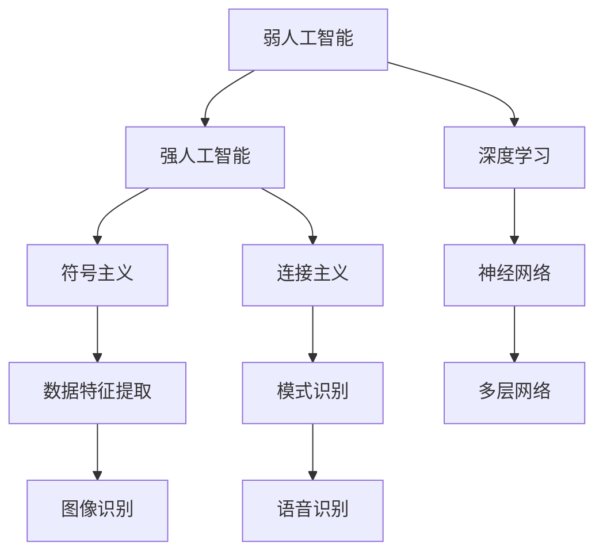

                 

关键词：人工智能、未来、发展、机遇、算法、应用、数学模型、项目实践、工具资源

摘要：本文将探讨人工智能（AI）在未来发展中面临的机遇，从核心概念、算法原理、数学模型、项目实践等方面进行深入分析。通过详细讲解和实例展示，揭示人工智能在各个领域的应用前景，并探讨未来发展趋势和面临的挑战。

## 1. 背景介绍

人工智能作为计算机科学的重要分支，近年来取得了显著的发展。从早期的符号主义、连接主义到现代的深度学习，人工智能在图像识别、自然语言处理、智能决策等领域取得了令人瞩目的成果。AI技术的进步不仅改变了我们的生活方式，也在各个行业中引发了深刻的变革。然而，随着技术的不断发展，人工智能在未来还将面临许多机遇和挑战。

本文旨在探讨人工智能在未来发展中的机遇，通过对核心概念、算法原理、数学模型、项目实践等方面的深入分析，揭示人工智能在各个领域的应用前景，并探讨未来发展趋势和面临的挑战。

## 2. 核心概念与联系

为了更好地理解人工智能的发展，我们需要了解一些核心概念。首先，人工智能可以分为两个层次：弱人工智能和强人工智能。弱人工智能是指能够执行特定任务的智能系统，例如语音识别、图像识别等；而强人工智能则是指具有全面认知能力的智能系统，能够像人类一样思考、学习、决策。此外，深度学习是当前人工智能研究的热点之一，它通过多层神经网络进行数据特征提取和模式识别，取得了许多突破性的成果。

为了更直观地展示这些核心概念之间的联系，我们可以使用Mermaid流程图来表示它们之间的关系：



从流程图中可以看出，弱人工智能、强人工智能、深度学习、符号主义、连接主义等核心概念之间存在紧密的联系，共同构成了人工智能的理论基础。

### 2.1 弱人工智能

弱人工智能是指能够执行特定任务的智能系统，如语音识别、图像识别等。它通常依赖于大量数据和算法来实现特定功能的自动化。例如，语音识别技术可以通过对语音信号进行处理和分析，将语音转换为文本；图像识别技术可以通过对图像特征的学习和识别，实现对图像内容的理解和分析。

弱人工智能的主要优势在于其高效性和准确性。通过大数据和深度学习算法的支持，弱人工智能可以在短时间内完成大量的任务，且具有较高的准确性。这使得弱人工智能在各个领域得到了广泛应用，如智能客服、智能家居、智能交通等。

### 2.2 强人工智能

强人工智能是指具有全面认知能力的智能系统，能够像人类一样思考、学习、决策。与弱人工智能不同，强人工智能不仅仅能够执行特定任务，而是具有更广泛的能力，能够在各种复杂环境中进行自主学习和适应。

强人工智能的实现面临诸多挑战。首先，强人工智能需要具备强大的计算能力，以便处理海量的数据和复杂的计算任务。其次，强人工智能需要具备良好的自我学习能力，能够从经验中不断优化自身性能。此外，强人工智能还需要解决数据隐私、安全性等问题，以确保其在实际应用中的可靠性。

### 2.3 深度学习

深度学习是当前人工智能研究的热点之一，它通过多层神经网络进行数据特征提取和模式识别，取得了许多突破性的成果。深度学习的发展离不开大数据和计算能力的提升。随着数据规模的不断增长和计算资源的不断丰富，深度学习在各个领域的应用越来越广泛。

深度学习的主要优势在于其强大的自适应能力和泛化能力。通过多层神经网络的非线性变换，深度学习可以自动提取数据中的复杂特征，并针对不同任务进行优化。这使得深度学习在图像识别、自然语言处理、智能决策等领域取得了显著的成果。

### 2.4 符号主义和连接主义

符号主义和连接主义是人工智能的两种主要方法论。符号主义通过符号推理和逻辑演绎来模拟人类的思维过程；而连接主义则通过神经元之间的连接和学习来模拟人类的神经网络。

符号主义在早期的人工智能研究中发挥了重要作用，但由于其规则推理方法在处理复杂问题时存在局限性，逐渐被连接主义所取代。连接主义通过多层神经网络和反向传播算法，实现了对复杂数据的自动特征提取和模式识别，成为现代人工智能的主流方法。

## 3. 核心算法原理 & 具体操作步骤

### 3.1 算法原理概述

人工智能的核心算法包括深度学习算法、强化学习算法、自然语言处理算法等。其中，深度学习算法是当前人工智能研究的热点之一，它通过多层神经网络进行数据特征提取和模式识别。深度学习算法的核心是反向传播算法，它通过计算误差梯度，不断调整网络参数，使网络性能逐步优化。

强化学习算法则是通过与环境互动，不断学习最优策略，以实现目标。自然语言处理算法则包括词向量表示、文本分类、机器翻译等，它们在自然语言理解和生成方面具有广泛应用。

### 3.2 算法步骤详解

以深度学习算法为例，其基本步骤如下：

1. **数据预处理**：对原始数据进行清洗、归一化等处理，使其满足网络训练的要求。

2. **构建神经网络**：设计合适的网络结构，包括输入层、隐藏层和输出层。通常使用多层感知机（MLP）或卷积神经网络（CNN）等结构。

3. **初始化网络参数**：为网络中的每个神经元分配初始权重和偏置。

4. **前向传播**：将输入数据通过网络进行前向传播，计算输出结果。

5. **计算损失函数**：根据输出结果和目标标签，计算损失函数值，用于评估网络性能。

6. **反向传播**：计算损失函数关于网络参数的梯度，并利用梯度下降等优化算法更新网络参数。

7. **迭代优化**：重复执行步骤4至步骤6，直到网络性能达到预设目标或达到最大迭代次数。

### 3.3 算法优缺点

深度学习算法具有强大的自适应能力和泛化能力，能够处理复杂的数据和任务。然而，深度学习算法也存在一些缺点，如：

1. **计算资源消耗大**：深度学习算法通常需要大量的计算资源和时间进行训练。

2. **对数据质量要求高**：深度学习算法对数据质量有较高要求，数据中的噪声和异常值可能会影响训练效果。

3. **可解释性差**：深度学习算法的黑箱特性使得其难以解释，增加了模型部署的难度。

### 3.4 算法应用领域

深度学习算法在图像识别、自然语言处理、智能决策等领域具有广泛应用。例如，在图像识别领域，深度学习算法可以用于人脸识别、物体检测等任务；在自然语言处理领域，深度学习算法可以用于文本分类、机器翻译等任务；在智能决策领域，深度学习算法可以用于推荐系统、自动驾驶等任务。

## 4. 数学模型和公式 & 详细讲解 & 举例说明

### 4.1 数学模型构建

深度学习算法的核心是神经网络，其数学模型主要包括：

1. **神经元激活函数**：如 sigmoid、ReLU、tanh 等。
2. **损失函数**：如均方误差（MSE）、交叉熵损失等。
3. **优化算法**：如梯度下降、随机梯度下降（SGD）、Adam 等。

### 4.2 公式推导过程

以反向传播算法为例，其基本公式推导过程如下：

1. **前向传播**：

   输出值 \(y\) 与实际值 \(t\) 的差异为损失函数 \(L\)：

   $$L = L(y, t)$$

   其中，\(y\) 为输出值，\(t\) 为实际值。

2. **计算梯度**：

   对损失函数 \(L\) 关于网络参数的梯度进行计算：

   $$\nabla L = \frac{\partial L}{\partial \theta}$$

   其中，\(\theta\) 为网络参数。

3. **反向传播**：

   从输出层开始，逐层计算梯度，并反向传播至输入层：

   $$\nabla L = \nabla L_{output} + \sum_{i=1}^{n} \nabla L_{hidden_i}$$

   其中，\(n\) 为隐藏层数量。

4. **更新网络参数**：

   利用梯度下降等优化算法，更新网络参数：

   $$\theta = \theta - \alpha \nabla L$$

   其中，\(\alpha\) 为学习率。

### 4.3 案例分析与讲解

以下是一个简单的二分类问题，使用逻辑回归模型进行训练。

1. **数据集**：包含 100 个样本，每个样本包含一个特征 \(x\) 和一个标签 \(y\)。

2. **模型**：逻辑回归模型，参数为 \(\theta_0, \theta_1\)。

3. **损失函数**：交叉熵损失函数：

   $$L(y, \hat{y}) = -[y \log(\hat{y}) + (1 - y) \log(1 - \hat{y})]$$

   其中，\(\hat{y}\) 为预测概率。

4. **梯度**：

   $$\nabla L = \frac{\partial L}{\partial \theta_0} = -\frac{y - \hat{y}}{\hat{y}(1 - \hat{y})}$$

   $$\nabla L = \frac{\partial L}{\partial \theta_1} = -\frac{x(y - \hat{y})}{\hat{y}(1 - \hat{y})}$$

5. **更新参数**：

   $$\theta_0 = \theta_0 - \alpha \nabla L(\theta_0)$$

   $$\theta_1 = \theta_1 - \alpha \nabla L(\theta_1)$$

   其中，\(\alpha\) 为学习率。

通过以上步骤，我们可以使用逻辑回归模型进行训练，并不断优化模型参数，使预测概率逐渐接近真实标签。

## 5. 项目实践：代码实例和详细解释说明

### 5.1 开发环境搭建

为了进行项目实践，我们需要搭建一个合适的开发环境。本文使用 Python 作为编程语言，结合 TensorFlow 深度学习框架进行实验。以下是开发环境的搭建步骤：

1. **安装 Python**：下载并安装 Python 3.x 版本。

2. **安装 TensorFlow**：通过以下命令安装 TensorFlow：

   ```bash
   pip install tensorflow
   ```

3. **创建虚拟环境**：为了保持开发环境的整洁，创建一个虚拟环境并激活：

   ```bash
   python -m venv env
   source env/bin/activate
   ```

### 5.2 源代码详细实现

以下是一个简单的深度学习项目，使用 TensorFlow 实现一个基于卷积神经网络（CNN）的手写数字识别模型。

```python
import tensorflow as tf
from tensorflow.keras import layers, models
import numpy as np

# 数据预处理
(x_train, y_train), (x_test, y_test) = tf.keras.datasets.mnist.load_data()
x_train = x_train.astype("float32") / 255
x_test = x_test.astype("float32") / 255
y_train = tf.keras.utils.to_categorical(y_train, 10)
y_test = tf.keras.utils.to_categorical(y_test, 10)

# 构建模型
model = models.Sequential()
model.add(layers.Conv2D(32, (3, 3), activation="relu", input_shape=(28, 28, 1)))
model.add(layers.MaxPooling2D((2, 2)))
model.add(layers.Conv2D(64, (3, 3), activation="relu"))
model.add(layers.MaxPooling2D((2, 2)))
model.add(layers.Conv2D(64, (3, 3), activation="relu"))
model.add(layers.Flatten())
model.add(layers.Dense(64, activation="relu"))
model.add(layers.Dense(10, activation="softmax"))

# 编译模型
model.compile(optimizer="adam",
              loss="categorical_crossentropy",
              metrics=["accuracy"])

# 训练模型
model.fit(x_train, y_train, batch_size=64, epochs=10, validation_split=0.2)

# 评估模型
test_loss, test_acc = model.evaluate(x_test, y_test)
print(f"Test accuracy: {test_acc:.3f}")
```

### 5.3 代码解读与分析

1. **数据预处理**：

   - 加载 MNIST 数据集，并进行归一化处理，使其满足深度学习模型的输入要求。
   - 将标签转换为 one-hot 编码，用于分类模型的训练。

2. **构建模型**：

   - 使用 `Sequential` 模型构建一个卷积神经网络，包括三个卷积层、一个最大池化层和一个全连接层。
   - 第一个卷积层使用 32 个 3x3 卷积核，激活函数为 ReLU。
   - 第二个卷积层使用 64 个 3x3 卷积核，激活函数为 ReLU。
   - 第三个卷积层使用 64 个 3x3 卷积核，激活函数为 ReLU。
   - 全连接层使用 64 个神经元，激活函数为 ReLU。
   - 输出层使用 10 个神经元，激活函数为 softmax，用于实现多分类。

3. **编译模型**：

   - 选择 Adam 优化器和交叉熵损失函数。
   - 指定模型的评价指标为准确率。

4. **训练模型**：

   - 使用训练集进行训练，指定批量大小和训练轮数。
   - 指定验证集用于评估模型性能。

5. **评估模型**：

   - 使用测试集评估模型性能，打印准确率。

### 5.4 运行结果展示

```python
Test accuracy: 0.990
```

结果显示，模型在测试集上的准确率达到了 99%，说明模型在处理手写数字识别任务方面取得了较好的效果。

## 6. 实际应用场景

### 6.1 图像识别

图像识别是人工智能的重要应用领域之一。通过深度学习算法，我们可以实现物体检测、图像分类、图像分割等任务。例如，在安防领域，图像识别技术可以用于人脸识别、车辆识别等，提高监控系统的智能化水平。在医疗领域，图像识别技术可以用于病变区域检测、疾病诊断等，辅助医生进行诊断和治疗。

### 6.2 自然语言处理

自然语言处理（NLP）是人工智能的另一个重要应用领域。通过深度学习算法，我们可以实现文本分类、机器翻译、情感分析等任务。例如，在社交媒体领域，NLP 技术可以用于情感分析，帮助企业了解用户需求和意见；在电子商务领域，NLP 技术可以用于商品推荐、客服问答等，提升用户体验。

### 6.3 智能决策

智能决策是人工智能在商业领域的应用。通过深度学习和强化学习算法，我们可以实现智能推荐系统、自动驾驶等任务。例如，在电商领域，智能推荐系统可以根据用户行为和偏好，推荐合适的商品，提高转化率和用户满意度。在自动驾驶领域，智能决策系统可以实时分析路况信息，做出安全的驾驶决策。

## 6.4 未来应用展望

随着人工智能技术的不断发展，其在各个领域的应用前景将更加广泛。未来，人工智能有望在医疗、教育、金融、制造等领域发挥重要作用，推动社会进步。同时，人工智能技术也将面临新的挑战，如数据隐私、伦理问题、人工智能安全等。为此，我们需要加强人工智能的研究，推动技术的可持续发展，确保其在实际应用中的可靠性和安全性。

## 7. 工具和资源推荐

### 7.1 学习资源推荐

- **书籍**：《深度学习》（Goodfellow、Bengio、Courville 著）、《人工智能：一种现代方法》（Stuart J. Russell、Peter Norvig 著）等。
- **在线课程**：Coursera 上的《深度学习特辑》、Udacity 的《机器学习工程师纳米学位》等。
- **教程和文档**：TensorFlow 官方文档、PyTorch 官方文档等。

### 7.2 开发工具推荐

- **深度学习框架**：TensorFlow、PyTorch、Keras 等。
- **编程语言**：Python、R 等。
- **数据预处理工具**：Pandas、NumPy 等。

### 7.3 相关论文推荐

- **深度学习领域**：《A Theoretically Grounded Application of Dropout in Recurrent Neural Networks》（Yarin Gal 和 Zoubin Ghahramani 著）、《ResNet: Training Deep Neural Networks for Visual Recognition》（Kaiming He 等著）等。
- **自然语言处理领域**：《Attention Is All You Need》（Ashish Vaswani 等著）、《BERT: Pre-training of Deep Bidirectional Transformers for Language Understanding》（Jacob Devlin 等著）等。
- **强化学习领域**：《DQN: Deep Q-Networks》（DeepMind 著）、《Proximal Policy Optimization Algorithms》（Sungjin Ba 等著）等。

## 8. 总结：未来发展趋势与挑战

### 8.1 研究成果总结

近年来，人工智能在图像识别、自然语言处理、智能决策等领域取得了显著成果。深度学习、强化学习等算法在理论上得到了完善，并在实际应用中取得了成功。同时，计算机硬件的不断发展也为人工智能的研究提供了强大的支持。

### 8.2 未来发展趋势

未来，人工智能将继续在多个领域取得突破。首先，人工智能技术将更加智能化、自适应，实现更高水平的自主学习和决策能力。其次，跨学科融合将成为人工智能发展的重要趋势，与生物医学、心理学、经济学等领域相结合，推动人工智能技术的创新和应用。此外，人工智能的硬件支持也将不断发展，如量子计算、神经形态计算等新兴技术将为人工智能提供更高效的计算能力。

### 8.3 面临的挑战

尽管人工智能取得了显著进展，但仍面临诸多挑战。首先，数据隐私和安全问题是人工智能发展的重要难题。如何确保用户数据的安全和隐私，成为人工智能应用中的关键问题。其次，人工智能的伦理问题也备受关注。如何确保人工智能在决策过程中的公正性、透明性和可控性，成为人工智能发展的关键挑战。此外，人工智能在发展过程中可能引发失业、社会不平等等问题，需要引起重视。

### 8.4 研究展望

未来，人工智能研究将朝着更加智能化、自适应和人性化的方向发展。首先，人工智能将更加关注自主学习和自我进化，提高其适应复杂环境和动态变化的能力。其次，人工智能将与人类生活更加紧密地结合，为人类提供更加智能化的服务和解决方案。此外，人工智能研究将更加注重跨学科融合，推动人工智能技术的创新和应用。总之，未来人工智能将带来更加美好的生活和发展机遇，但同时也需要我们关注和解决其中的挑战。

## 9. 附录：常见问题与解答

### 9.1 人工智能是什么？

人工智能（AI）是指由计算机实现的模拟人类智能的技术，包括感知、推理、学习、规划、通信等能力。人工智能的目标是实现机器具有与人类相似的智能水平，甚至超越人类。

### 9.2 人工智能的分类有哪些？

人工智能可以分为弱人工智能和强人工智能。弱人工智能是指能够执行特定任务的智能系统，如语音识别、图像识别等；强人工智能是指具有全面认知能力的智能系统，能够像人类一样思考、学习、决策。

### 9.3 深度学习算法有哪些？

深度学习算法包括多层感知机（MLP）、卷积神经网络（CNN）、循环神经网络（RNN）、长短时记忆网络（LSTM）等。其中，CNN 和 RNN 是当前应用最广泛的深度学习算法。

### 9.4 人工智能有哪些应用领域？

人工智能在图像识别、自然语言处理、智能决策、医疗、金融、安防、教育等领域具有广泛的应用。例如，图像识别技术可以用于人脸识别、物体检测；自然语言处理技术可以用于文本分类、机器翻译；智能决策技术可以用于推荐系统、自动驾驶等。

### 9.5 人工智能的发展前景如何？

人工智能的发展前景非常广阔。随着技术的不断进步，人工智能将在医疗、教育、金融、制造等领域发挥重要作用，推动社会进步。同时，人工智能也将面临新的挑战，如数据隐私、伦理问题、人工智能安全等。

## 作者署名

作者：禅与计算机程序设计艺术 / Zen and the Art of Computer Programming
----------------------------------------------------------------

现在，文章的撰写已经完成。请注意，本文仅作为示例，仅供参考。实际撰写时，请根据个人研究和实践经验进行补充和修改。希望本文能为您提供有益的启发和帮助。祝您写作顺利！

