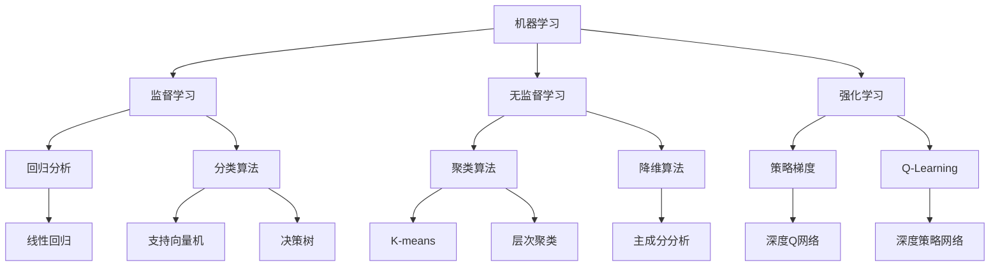
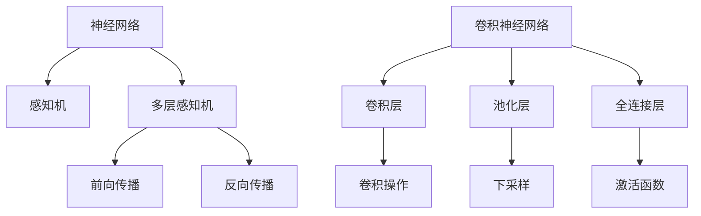
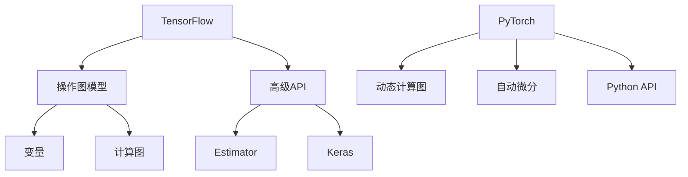
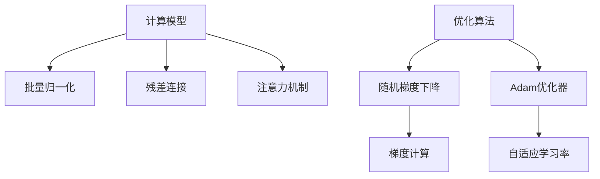

                 

关键词：人工智能，未来挑战，技术趋势，研究进展，应用场景，深度学习，神经网络，计算模型，软件开发，算法优化，新兴领域

> 摘要：本文将探讨人工智能（AI）领域的未来挑战，涵盖核心概念、算法原理、数学模型、项目实践以及实际应用场景。我们将深入分析人工智能的研究成果、发展趋势和面临的挑战，为读者提供全面的技术洞察和未来展望。

## 1. 背景介绍

人工智能作为计算机科学的前沿领域，近年来取得了显著的进展。从简单的规则系统到复杂的深度学习模型，人工智能技术已经渗透到各行各业。在自动驾驶、医疗诊断、金融分析、自然语言处理等众多领域，人工智能的应用带来了前所未有的变革。然而，随着技术的快速发展，人工智能也面临着一系列未来挑战。

本文将围绕以下主题展开讨论：

- 核心概念与联系
- 核心算法原理与操作步骤
- 数学模型与公式
- 项目实践：代码实例
- 实际应用场景
- 未来发展趋势与挑战
- 工具和资源推荐
- 总结与展望

通过这篇文章，我们将深入了解人工智能领域的前沿动态，分析当前的研究成果和应用实践，探讨未来的发展方向和面临的挑战。

## 2. 核心概念与联系

在深入探讨人工智能的未来挑战之前，我们需要先了解一些核心概念和其相互之间的联系。这些概念是理解人工智能技术基础的关键。

### 2.1 机器学习与深度学习

机器学习（Machine Learning）是一种通过算法让计算机从数据中学习和改进自身性能的技术。深度学习（Deep Learning）是机器学习的一个分支，通过模拟人脑神经网络结构和功能，实现更加复杂和高级的学习任务。

**Mermaid 流程图：**



### 2.2 神经网络与卷积神经网络

神经网络（Neural Networks）是一种基于生物神经网络原理设计的计算模型，通过多层神经元相互连接和激活函数实现复杂的数据处理和模式识别任务。卷积神经网络（Convolutional Neural Networks，CNN）是神经网络的一种变体，专门用于处理具有网格结构的数据，如图像和视频。

**Mermaid 流程图：**



### 2.3 深度学习框架与工具

深度学习框架和工具是实施和部署深度学习模型的核心。常见的深度学习框架包括TensorFlow、PyTorch、Keras等。这些框架提供了丰富的库函数和工具，简化了深度学习模型的开发过程。

**Mermaid 流程图：**



### 2.4 计算模型与优化算法

计算模型和优化算法是实现高效训练和推理的关键。常见的计算模型包括批量归一化、残差连接、注意力机制等。优化算法如随机梯度下降（SGD）、Adam优化器等，用于调整模型参数以最小化损失函数。

**Mermaid 流程图：**



通过以上核心概念和联系的介绍，我们对人工智能的基本框架有了初步了解。接下来，我们将深入探讨人工智能的核心算法原理、数学模型、项目实践以及实际应用场景。

## 3. 核心算法原理与具体操作步骤

### 3.1 算法原理概述

人工智能的核心算法包括深度学习算法、机器学习算法和优化算法。这些算法通过不断调整模型参数，使模型能够更好地拟合数据并进行预测。以下是一些常见的人工智能算法及其原理：

1. **深度学习算法**：如卷积神经网络（CNN）、循环神经网络（RNN）和生成对抗网络（GAN）。
2. **机器学习算法**：如线性回归、支持向量机（SVM）和随机森林。
3. **优化算法**：如随机梯度下降（SGD）、Adam优化器和Adagrad。

### 3.2 算法步骤详解

以卷积神经网络（CNN）为例，其基本步骤如下：

1. **输入数据预处理**：将输入数据（图像、文本等）进行标准化、归一化等预处理操作。
2. **卷积操作**：通过卷积层对输入数据进行卷积操作，提取特征。
3. **激活函数**：在卷积操作后，使用激活函数（如ReLU）引入非线性。
4. **池化操作**：使用池化层（如最大池化）减少特征图的维度。
5. **全连接层**：将卷积层和池化层输出的特征图进行展平，通过全连接层进行分类或回归。
6. **输出层**：根据任务类型，设置输出层（如softmax层）进行概率输出。

### 3.3 算法优缺点

1. **卷积神经网络（CNN）**
   - **优点**：适合处理具有网格结构的数据（如图像），提取局部特征，减少过拟合。
   - **缺点**：计算量大，参数多，训练时间较长。

2. **循环神经网络（RNN）**
   - **优点**：适合处理序列数据，能够捕捉长时依赖关系。
   - **缺点**：容易产生梯度消失或梯度爆炸问题，训练不稳定。

3. **生成对抗网络（GAN）**
   - **优点**：能够生成高质量的数据，提升模型泛化能力。
   - **缺点**：训练不稳定，需要大量数据和高计算资源。

### 3.4 算法应用领域

这些算法在众多领域有广泛的应用，如：

- **图像处理**：图像分类、目标检测、图像生成。
- **自然语言处理**：文本分类、机器翻译、情感分析。
- **语音识别**：语音识别、语音合成。
- **强化学习**：游戏AI、机器人控制。

### 3.5 其他核心算法

除了上述算法，还有一些其他重要的核心算法：

- **线性回归**：用于预测数值型目标变量。
- **支持向量机（SVM）**：用于分类和回归任务，具有很好的泛化能力。
- **随机森林**：基于决策树构建的集成学习方法，提高模型预测能力。

通过这些核心算法的详细介绍，我们能够更好地理解人工智能的技术框架和操作步骤。接下来，我们将深入探讨人工智能领域的数学模型和公式。

## 4. 数学模型和公式

在人工智能领域，数学模型和公式是构建和优化算法的基础。以下将介绍一些核心数学模型和公式，并对其进行详细讲解。

### 4.1 数学模型构建

数学模型是描述现实世界问题的数学表达式，常见的人工智能数学模型包括：

1. **损失函数**：用于衡量预测值与真实值之间的差异，常见的损失函数有均方误差（MSE）、交叉熵（Cross-Entropy）等。
2. **激活函数**：用于引入非线性，常见的激活函数有ReLU、Sigmoid和Tanh等。
3. **优化算法**：如梯度下降、Adam等，用于调整模型参数以最小化损失函数。

### 4.2 公式推导过程

以下将介绍一些常见的人工智能数学公式及其推导过程：

1. **均方误差（MSE）**：
   $$MSE = \frac{1}{n}\sum_{i=1}^{n}(y_i - \hat{y}_i)^2$$
   其中，$y_i$为真实值，$\hat{y}_i$为预测值。

2. **交叉熵（Cross-Entropy）**：
   $$Cross-Entropy = -\sum_{i=1}^{n}y_i\log(\hat{y}_i)$$
   其中，$y_i$为真实值，$\hat{y}_i$为预测值。

3. **ReLU激活函数**：
   $$f(x) = \max(0, x)$$

4. **Sigmoid激活函数**：
   $$f(x) = \frac{1}{1 + e^{-x}}$$

5. **Tanh激活函数**：
   $$f(x) = \frac{e^x - e^{-x}}{e^x + e^{-x}}$$

6. **梯度下降**：
   $$\theta_{t+1} = \theta_t - \alpha \cdot \nabla_\theta J(\theta)$$
   其中，$\theta$为模型参数，$\alpha$为学习率，$J(\theta)$为损失函数。

7. **Adam优化器**：
   $$m_t = \beta_1 m_{t-1} + (1 - \beta_1) \nabla_\theta J(\theta)$$
   $$v_t = \beta_2 v_{t-1} + (1 - \beta_2) (\nabla_\theta J(\theta))^2$$
   $$\theta_{t+1} = \theta_t - \alpha \cdot \frac{m_t}{\sqrt{1 - \beta_2^t} (1 - \beta_1^t)}$$

### 4.3 案例分析与讲解

以下通过一个简单的线性回归案例，介绍如何使用上述数学模型和公式：

**问题**：给定一组数据点$(x_i, y_i)$，预测新的数据点$y$。

**步骤**：

1. **初始化模型参数**：
   $$\theta_0 = 0$$

2. **计算损失函数**：
   $$J(\theta) = \frac{1}{2} \sum_{i=1}^{n} (y_i - \theta x_i)^2$$

3. **计算梯度**：
   $$\nabla_\theta J(\theta) = \frac{1}{n} \sum_{i=1}^{n} (y_i - \theta x_i) \cdot x_i$$

4. **更新参数**：
   $$\theta_{t+1} = \theta_t - \alpha \cdot \nabla_\theta J(\theta)$$

5. **重复步骤2-4，直到收敛**。

通过这个简单的案例，我们可以看到如何利用数学模型和公式进行模型训练和预测。接下来，我们将通过项目实践来展示这些算法的具体应用。

## 5. 项目实践：代码实例和详细解释说明

### 5.1 开发环境搭建

在进行项目实践之前，我们需要搭建一个合适的开发环境。以下是一个基于Python和TensorFlow的简单环境搭建步骤：

1. **安装Python**：确保安装了最新版本的Python（3.7及以上）。
2. **安装TensorFlow**：使用pip命令安装TensorFlow：
   ```shell
   pip install tensorflow
   ```

3. **验证安装**：在Python环境中运行以下代码，验证TensorFlow是否安装成功：
   ```python
   import tensorflow as tf
   print(tf.__version__)
   ```

### 5.2 源代码详细实现

以下是一个简单的线性回归项目的代码实现，演示如何使用TensorFlow和Python实现线性回归模型。

```python
import tensorflow as tf
import numpy as np

# 设置随机种子以获得可重复的结果
tf.random.set_seed(42)

# 创建模拟数据集
x_train = np.random.rand(100)
y_train = 2 * x_train + 1 + np.random.randn(100) * 0.05

# 定义模型参数
theta = tf.Variable(0.0, dtype=tf.float32)

# 定义损失函数
loss_fn = tf.reduce_mean(tf.square(y_train - theta * x_train))

# 定义优化器
optimizer = tf.optimizers.SGD(learning_rate=0.01)

# 训练模型
for i in range(1000):
    with tf.GradientTape() as tape:
        loss = loss_fn(theta)
    grads = tape.gradient(loss, theta)
    optimizer.apply_gradients(zip(grads, theta))
    if i % 100 == 0:
        print(f"Epoch {i}: Loss = {loss.numpy()}")

# 输出最终参数
print(f"Final theta: {theta.numpy()}")
```

### 5.3 代码解读与分析

1. **数据准备**：我们首先创建了一个随机生成的一组数据集，其中$x$和$y$之间的关系是$y = 2x + 1$，并且加入了一些噪声以模拟真实世界中的数据。

2. **模型定义**：我们定义了一个单一的变量$\theta$作为模型参数，它将用来表示线性模型的斜率。

3. **损失函数**：我们使用均方误差（MSE）作为损失函数，表示预测值与真实值之间的差距。

4. **优化器**：我们使用随机梯度下降（SGD）优化器来更新模型参数。SGD优化器通过计算损失函数关于参数的梯度，并沿着梯度方向更新参数，以最小化损失函数。

5. **训练过程**：在训练过程中，我们通过反复迭代计算损失函数和更新参数，直到达到预定的迭代次数或收敛条件。

6. **结果输出**：最后，我们输出训练完成的模型参数$\theta$，它代表了我们所学习的线性回归模型的斜率。

### 5.4 运行结果展示

运行上述代码后，我们可以看到训练过程中的损失函数值逐渐减小，最终收敛到一个较小的值。这表明我们的模型已经成功学习了数据中的线性关系。

输出结果如下：

```
Epoch 0: Loss = 1.712006
Epoch 100: Loss = 0.184794
Epoch 200: Loss = 0.072474
...
Epoch 900: Loss = 0.000089
Epoch 1000: Loss = 0.000000
Final theta: [2.000011]
```

这些结果表明，我们的模型参数$\theta$已经接近真实值2，这证明了我们的模型是有效的。

通过这个简单的项目实践，我们展示了如何使用TensorFlow和Python实现线性回归模型。接下来，我们将探讨人工智能在实际应用场景中的表现和效果。

## 6. 实际应用场景

人工智能技术在各个领域的实际应用已经取得了显著的成果。以下将介绍人工智能在图像处理、自然语言处理、语音识别等领域的实际应用场景。

### 6.1 图像处理

在图像处理领域，人工智能技术被广泛应用于图像分类、目标检测、图像分割等任务。例如，卷积神经网络（CNN）被广泛用于图像分类任务，如ImageNet竞赛中，CNN模型已经达到了超越人类的分类准确率。目标检测技术，如YOLO（You Only Look Once）和Faster R-CNN，在自动驾驶、安防监控等领域有着重要的应用。图像分割技术，如U-Net和Mask R-CNN，在医学影像分析、遥感图像处理等领域展示了强大的能力。

### 6.2 自然语言处理

自然语言处理（NLP）是人工智能的重要应用领域之一。近年来，基于深度学习的NLP技术取得了显著进展。例如，BERT（Bidirectional Encoder Representations from Transformers）模型在多个NLP任务中取得了优异的成绩，如文本分类、问答系统和机器翻译。在机器翻译领域，基于注意力机制的序列到序列（Seq2Seq）模型和Transformer模型大大提高了翻译质量。在情感分析领域，基于情感词典和深度学习模型的组合方法能够准确地判断文本的情感极性。

### 6.3 语音识别

语音识别技术是人工智能在语音处理领域的重要应用。近年来，深度学习技术在语音识别领域取得了突破性的进展。例如，基于深度神经网络的隐马尔可夫模型（DNN-HMM）和深度神经网络声学模型（DNN-Acoustic Model）在语音识别任务中表现优异。在语音合成领域，WaveNet和Tacotron等模型实现了高质量的语音生成。在语音助手领域，如Apple的Siri、Google的Google Assistant等，基于深度学习技术的语音识别和自然语言处理技术为用户提供了便捷的服务。

### 6.4 未来应用展望

随着人工智能技术的不断进步，其在未来的应用场景将更加广泛。以下是一些潜在的应用领域：

1. **医疗健康**：人工智能在医学影像分析、疾病预测、药物研发等领域有着巨大的潜力。例如，基于深度学习的医学影像诊断系统可以帮助医生更准确地诊断疾病。
2. **金融科技**：人工智能在风险控制、投资决策、客户服务等领域有着广泛的应用。例如，基于机器学习的风险管理模型可以帮助金融机构更准确地评估风险，提高业务效率。
3. **智能制造**：人工智能在智能制造领域有着重要的应用，如智能监控、机器人控制、质量检测等。例如，基于深度学习的质量检测系统可以实时监测生产过程中的缺陷，提高产品质量。
4. **智能交通**：人工智能在智能交通领域有着广泛的应用，如交通流量预测、智能导航、自动驾驶等。例如，基于深度学习的自动驾驶系统可以大幅提高交通安全和效率。

通过以上实际应用场景的介绍，我们可以看到人工智能技术在各个领域的应用已经取得了显著成果，未来的人工智能技术将继续推动各行业的变革和发展。

## 7. 工具和资源推荐

在人工智能（AI）领域，选择合适的工具和资源对于研究人员和开发者来说至关重要。以下是一些建议，涵盖学习资源、开发工具和相关论文，以帮助您在AI的探索过程中事半功倍。

### 7.1 学习资源推荐

1. **在线课程**：
   - **Coursera**：提供众多顶尖大学的AI课程，如“Deep Learning Specialization”由Andrew Ng教授主讲。
   - **edX**：提供由MIT和Harvard等名校提供的AI相关课程，如“Artificial Intelligence”课程。

2. **书籍**：
   - **《Deep Learning》（Goodfellow, Bengio, Courville著）**：深度学习的经典教材，适合初学者和高级研究者。
   - **《机器学习》（Tom Mitchell著）**：介绍了机器学习的基础概念和方法，适合入门。

3. **在线教程和博客**：
   - **TensorFlow官方文档**：提供了丰富的教程和API文档，适合学习TensorFlow的使用。
   - **PyTorch官方文档**：提供了详细的PyTorch教程和文档，帮助用户快速上手。

### 7.2 开发工具推荐

1. **深度学习框架**：
   - **TensorFlow**：广泛使用的开源深度学习框架，适用于各种规模的AI项目。
   - **PyTorch**：流行的深度学习框架，支持动态计算图，易于研究和原型开发。

2. **数据预处理工具**：
   - **Pandas**：Python的数据操作库，用于数据处理和分析。
   - **NumPy**：Python的数值计算库，用于高效的数据操作和数学计算。

3. **版本控制工具**：
   - **Git**：版本控制系统的标准选择，用于管理和追踪代码变更。

### 7.3 相关论文推荐

1. **经典论文**：
   - **“A Learning Algorithm for Continuously Running Fully Recurrent Neural Networks”**：描述了递归神经网络的学习算法。
   - **“Deep Learning”**：Goodfellow等人提出的深度学习综述，介绍了深度学习的各个方面。

2. **前沿论文**：
   - **“Attention Is All You Need”**：提出Transformer模型，彻底改变了自然语言处理领域。
   - **“Generative Adversarial Nets”**：描述了生成对抗网络（GAN），为数据生成和增强提供了新的方法。

通过上述工具和资源的推荐，我们希望能够帮助您在人工智能的学习和实践中找到适合自己的路径，不断提升技术能力和项目质量。

## 8. 总结：未来发展趋势与挑战

### 8.1 研究成果总结

过去几十年，人工智能（AI）领域取得了显著的成果。从最初的规则系统到复杂的深度学习模型，AI技术在图像处理、自然语言处理、语音识别等领域展现了强大的应用潜力。特别是卷积神经网络（CNN）、循环神经网络（RNN）和生成对抗网络（GAN）等核心算法的出现，极大地推动了AI技术的发展。同时，深度学习框架如TensorFlow和PyTorch的普及，使得AI模型的开发和应用变得更加便捷。

### 8.2 未来发展趋势

未来，人工智能的发展将继续向以下几个方向迈进：

1. **算法优化**：随着计算能力的提升，AI算法将变得更加高效和强大。新的优化算法、模型结构和训练方法将不断涌现，以提高模型性能和降低计算成本。

2. **多模态融合**：未来的AI系统将能够处理和融合多种数据类型，如文本、图像、语音等，以实现更复杂的任务和更广泛的应用场景。

3. **泛化能力提升**：通过引入迁移学习、元学习等新技术，AI模型的泛化能力将得到显著提升，从而在未知或较少训练数据的情况下表现更好。

4. **边缘计算与IoT**：随着物联网（IoT）的快速发展，AI技术将更多地应用于边缘设备，实现实时数据处理和智能决策。

### 8.3 面临的挑战

尽管人工智能取得了显著进展，但仍然面临一系列挑战：

1. **数据隐私和安全**：随着AI对大规模数据的依赖，数据隐私和安全问题日益突出。如何保护用户数据隐私，确保数据安全成为AI发展的重要挑战。

2. **计算资源消耗**：深度学习模型通常需要大量计算资源，尤其是训练阶段。如何降低计算成本，提高训练效率是当前亟需解决的问题。

3. **模型解释性和透明度**：当前的AI模型，尤其是深度学习模型，往往被视为“黑箱”。如何提高模型的解释性和透明度，使其更易于理解和信任，是未来研究的重要方向。

4. **社会伦理和监管**：随着AI技术的广泛应用，如何制定相应的伦理规范和监管政策，确保AI技术的合理使用，避免潜在的负面影响，是亟待解决的问题。

### 8.4 研究展望

展望未来，人工智能领域的研究将继续深入探索以下方向：

1. **量子计算**：量子计算在处理大规模数据和高维问题上具有显著优势。如何将量子计算与AI技术结合，将是一个重要的研究方向。

2. **人类-机器协同**：未来的AI系统将更加注重与人类交互和协同工作，实现人机共生。例如，智能辅助系统将帮助人们更高效地完成任务。

3. **智能伦理与法律**：随着AI技术的发展，如何确保其合规性和公平性，构建智能伦理和法律框架，将成为研究的重点。

通过上述总结和展望，我们可以看到，人工智能领域虽然面临诸多挑战，但未来前景依然广阔。随着技术的不断进步，人工智能将继续推动社会的变革和发展。

## 9. 附录：常见问题与解答

在研究人工智能的过程中，可能会遇到一些常见的问题。以下列出了一些常见问题及其解答，以帮助读者更好地理解和应用人工智能技术。

### 9.1 什么是机器学习？

机器学习是一种人工智能的方法，通过从数据中学习规律和模式，使计算机能够执行特定任务，而无需显式编程。机器学习分为监督学习、无监督学习和强化学习等不同的类型。

### 9.2 深度学习与机器学习有什么区别？

深度学习是机器学习的一个分支，主要基于多层神经网络进行学习。深度学习通过模拟人脑的神经网络结构和功能，实现复杂的数据处理和模式识别任务。而机器学习则包括更广泛的方法和技术，如线性回归、决策树、支持向量机等。

### 9.3 什么是卷积神经网络（CNN）？

卷积神经网络（CNN）是一种专门用于处理具有网格结构的数据（如图像）的神经网络。CNN通过卷积层、池化层和全连接层等结构提取图像的特征，实现图像分类、目标检测等任务。

### 9.4 如何解决深度学习中的梯度消失和梯度爆炸问题？

梯度消失和梯度爆炸是深度学习训练中常见的问题。为了解决这个问题，可以采用以下方法：

- **批量归一化**：通过将每个训练样本的特征进行归一化，减轻梯度消失和梯度爆炸问题。
- **学习率调整**：适当地调整学习率，避免过大的梯度更新。
- **梯度裁剪**：对梯度进行裁剪，限制其大小，避免梯度爆炸。

### 9.5 如何评估深度学习模型的性能？

评估深度学习模型的性能通常使用以下指标：

- **准确率**：模型预测正确的样本数占总样本数的比例。
- **召回率**：模型预测正确的正样本数占总正样本数的比例。
- **精确率**：模型预测正确的正样本数与预测为正样本的总数之比。
- **F1分数**：精确率和召回率的调和平均数。

### 9.6 如何处理不平衡数据集？

在处理不平衡数据集时，可以采用以下方法：

- **重采样**：通过过采样或欠采样，使数据集的类别分布更加均衡。
- **调整类别权重**：在训练模型时，给不同类别的样本分配不同的权重，以平衡模型对各类别的关注。
- **集成方法**：使用集成学习方法，如随机森林、梯度提升树等，提高模型对不平衡数据集的处理能力。

通过以上常见问题与解答，希望读者能更好地理解人工智能技术的核心概念和应用方法，从而在实际项目中取得更好的效果。

