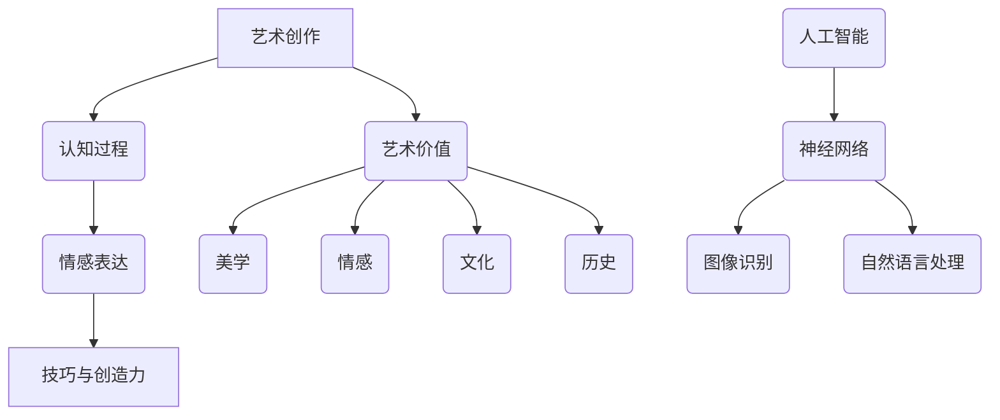

                 

关键词：人工智能，艺术，创作，认知，神经科学，深度学习，艺术创作，神经网络，神经艺术，算法，美学。

摘要：本文探讨了人工智能在艺术创作领域的崛起及其带来的深远影响。通过分析安德烈·卡尔帕西（Andrej Karpathy）的研究和工作，探讨了人工智能在艺术中的表现力和艺术价值的可能性。文章从神经科学的角度审视了人工智能如何模拟人类的认知过程，以及这一过程如何推动艺术的发展。同时，本文还探讨了人工智能在艺术教育和艺术产业中的应用，并展望了人工智能在未来艺术领域的潜在影响。

## 1. 背景介绍

人工智能（AI）作为一个多学科交叉领域，自上世纪50年代起便吸引了全球科学家和研究者的关注。随着计算能力的提升和算法的进步，人工智能已经从理论走向实际应用，逐渐渗透到我们生活的方方面面。尤其是在图像识别、自然语言处理、游戏和自动驾驶等领域，人工智能的表现令人瞩目。

艺术，作为人类精神文化的重要组成部分，自古以来便与人类的认知和情感紧密相连。艺术家通过创作表达内心的情感和思想，同时也在探索人类认知的边界。艺术作品不仅反映了当时的社会和文化背景，也推动了人类文明的进步。

安德烈·卡尔帕西（Andrej Karpathy）是一位杰出的计算机科学家和深度学习领域的专家。他在斯坦福大学获得了计算机科学博士学位，并在谷歌等科技巨头担任重要职位。他的研究主要关注于神经网络和人工智能在自然语言处理和计算机视觉领域的应用。卡尔帕西在人工智能艺术创作方面的研究引起了广泛关注，为人工智能与艺术的结合提供了新的思路。

### 2. 核心概念与联系

#### 2.1. 艺术创作与人工智能

艺术创作是一种复杂的认知过程，涉及想象、情感、技巧和创造力等多个方面。而人工智能，作为一种模拟人类智能的技术，可以通过算法和计算来理解和生成新的艺术形式。卡尔帕西的研究展示了人工智能在艺术创作中的潜力，尤其是在图像和文本生成方面。

#### 2.2. 神经网络与认知模拟

神经网络，作为一种模仿人脑结构的计算模型，是人工智能的核心技术之一。卡尔帕西的研究表明，通过训练神经网络，可以使其学会识别和理解复杂的视觉和语言信息。这一过程类似于人类大脑的认知过程，为人工智能在艺术创作中的应用提供了理论基础。

#### 2.3. 艺术价值与人工智能

艺术价值是一个主观且复杂的概念，涉及美学、情感、文化和历史等多个层面。人工智能在艺术创作中的应用，使得艺术作品不再仅仅是人类创造的结果，而成为人类与技术共同创作的产物。这为重新定义艺术价值提供了新的视角。

#### 2.4. Mermaid 流程图



## 3. 核心算法原理 & 具体操作步骤

### 3.1 算法原理概述

人工智能在艺术创作中的应用主要依赖于深度学习技术，特别是生成对抗网络（GAN）和变分自编码器（VAE）。这些算法可以通过学习大量的数据来生成新的图像、音频和文本，从而实现艺术创作。

### 3.2 算法步骤详解

1. **数据收集**：收集大量的艺术作品，如绘画、音乐和文学作品，作为训练数据。
2. **模型训练**：使用生成对抗网络（GAN）或变分自编码器（VAE）训练神经网络模型。这些模型可以通过不断迭代优化，生成越来越逼真的艺术作品。
3. **艺术创作**：将训练好的模型应用于新的数据，生成新的艺术作品。这个过程可以涉及图像生成、文本生成、音乐生成等多种形式。

### 3.3 算法优缺点

**优点**：
- **高效率**：通过算法，可以在短时间内生成大量的艺术作品。
- **多样化**：生成对抗网络和变分自编码器能够生成具有多样化风格的艺术作品。

**缺点**：
- **主观性**：人工智能生成的艺术作品缺乏人类的情感和创造力。
- **复杂性**：算法的训练和优化过程较为复杂，需要大量的计算资源和时间。

### 3.4 算法应用领域

人工智能在艺术创作中的应用领域广泛，包括但不限于：
- **视觉艺术**：生成独特的绘画、摄影和图形设计。
- **音乐创作**：生成新的音乐作品，如旋律、节奏和和声。
- **文学创作**：生成诗歌、小说和剧本。

## 4. 数学模型和公式 & 详细讲解 & 举例说明

### 4.1 数学模型构建

在人工智能的艺术创作中，常用的数学模型包括生成对抗网络（GAN）和变分自编码器（VAE）。以下是对这两个模型的基本介绍和数学公式：

#### 4.1.1 生成对抗网络（GAN）

**基本原理**：
GAN由生成器（Generator）和判别器（Discriminator）两个神经网络组成。生成器的任务是生成类似于真实数据的样本，而判别器的任务是区分真实数据和生成数据。

**数学公式**：
$$
\begin{aligned}
D(x) &= \sigma(W_Dx + b_D) \\
G(z) &= \sigma(W_Gz + b_G) \\
\end{aligned}
$$

其中，$D(x)$是判别器的输出，$G(z)$是生成器的输出，$x$是真实数据，$z$是噪声向量，$\sigma$是sigmoid函数。

#### 4.1.2 变分自编码器（VAE）

**基本原理**：
VAE通过学习数据分布的参数来生成样本。它使用编码器（Encoder）和解码器（Decoder）两个神经网络。

**数学公式**：
$$
\begin{aligned}
\mu &= \sigma(W_{\mu}x + b_{\mu}) \\
\sigma &= \sigma(W_{\sigma}x + b_{\sigma}) \\
x' &= \sigma(W_{\phi}x' + b_{\phi}) \\
\end{aligned}
$$

其中，$\mu$和$\sigma$分别是编码器输出的均值和标准差，$x'$是解码器的输入。

### 4.2 公式推导过程

#### 4.2.1 生成对抗网络（GAN）的推导

GAN的训练目标是最小化以下损失函数：

$$
L(D, G) = E_{x\sim p_{data}(x)}[D(x)] - E_{z\sim p_{z}(z)}[D(G(z))]
$$

其中，$L(D, G)$是判别器和生成器的联合损失，$p_{data}(x)$是真实数据的分布，$p_{z}(z)$是噪声向量的分布。

通过对损失函数求导并设置为0，可以求得判别器和生成器的梯度：

$$
\begin{aligned}
\frac{\partial L(D, G)}{\partial W_D} &= x - G(z) \\
\frac{\partial L(D, G)}{\partial W_G} &= G(z) - x \\
\end{aligned}
$$

#### 4.2.2 变分自编码器（VAE）的推导

VAE的训练目标是最小化以下损失函数：

$$
L(V) = E_{x\sim p_{data}(x)}\left[\sum_{i=1}^{D}D_i(x) - \log p(x|\mu, \sigma)\right]
$$

其中，$L(V)$是变分自编码器的损失，$D_i(x)$是重构误差，$p(x|\mu, \sigma)$是数据的概率分布。

通过对损失函数求导并设置为0，可以求得编码器和解码器的梯度：

$$
\begin{aligned}
\frac{\partial L(V)}{\partial \mu} &= \frac{1}{\sigma} \frac{\partial D_i(x)}{\partial \mu} \\
\frac{\partial L(V)}{\partial \sigma} &= \frac{1}{\mu} \frac{\partial D_i(x)}{\partial \sigma} \\
\frac{\partial L(V)}{\partial W_{\phi}} &= \frac{\partial D_i(x)}{\partial x'} \\
\frac{\partial L(V)}{\partial W_{\mu}} &= \frac{\partial D_i(x)}{\partial \mu} \\
\frac{\partial L(V)}{\partial W_{\sigma}} &= \frac{\partial D_i(x)}{\partial \sigma} \\
\end{aligned}
$$

### 4.3 案例分析与讲解

#### 4.3.1 生成对抗网络（GAN）的案例

假设我们有一个图像生成任务，生成器生成一张照片，判别器判断这张照片是真实图像还是生成图像。我们通过以下步骤来训练GAN：

1. **初始化模型**：随机初始化生成器$G$和判别器$D$。
2. **生成图像**：生成器生成一张随机图像$x'$。
3. **判断图像**：判别器判断图像$x'$是真实图像的概率$D(x')$。
4. **更新判别器**：通过梯度下降更新判别器权重，使其更准确地判断图像。
5. **生成新图像**：生成器根据判别器的反馈生成新的图像。
6. **重复步骤3-5**：不断迭代，直到生成器生成的图像质量提高。

#### 4.3.2 变分自编码器（VAE）的案例

假设我们有一个图像重构任务，使用VAE将图像编码为潜在空间中的向量，然后解码为重构图像。我们通过以下步骤来训练VAE：

1. **初始化模型**：随机初始化编码器$E$和解码器$D$。
2. **编码图像**：将图像$x$编码为潜在空间中的向量$(\mu, \sigma)$。
3. **解码图像**：通过解码器将潜在空间中的向量$(\mu, \sigma)$解码为重构图像$x'$。
4. **计算重构误差**：计算重构图像$x'$与原始图像$x$之间的误差$D(x, x')$。
5. **更新编码器和解码器**：通过梯度下降更新编码器和解码器的权重，使其重构误差减小。
6. **重复步骤2-5**：不断迭代，直到重构误差显著降低。

## 5. 项目实践：代码实例和详细解释说明

### 5.1 开发环境搭建

在Python中实现GAN和VAE需要安装以下依赖：

```python
pip install tensorflow numpy matplotlib
```

### 5.2 源代码详细实现

以下是一个简单的GAN和VAE的代码示例：

#### GAN

```python
import tensorflow as tf
from tensorflow.keras.layers import Dense, Flatten, Reshape
from tensorflow.keras.models import Model

# 定义生成器和判别器
def build_generator(z_dim):
    model = tf.keras.Sequential([
        Dense(7 * 7 * 256, use_bias=False, input_shape=(z_dim,)),
        tf.keras.layers.BatchNormalization(),
        tf.keras.layers.LeakyReLU(0.2),
        tf.keras.layers.Reshape((7, 7, 256)),
        Dense(7 * 7 * 128, use_bias=False),
        tf.keras.layers.BatchNormalization(),
        tf.keras.layers.LeakyReLU(0.2),
        tf.keras.layers.Conv2DTranspose(128, (5, 5), strides=(1, 1), padding='same', use_bias=False),
        tf.keras.layers.BatchNormalization(),
        tf.keras.layers.LeakyReLU(0.2),
        tf.keras.layers.Conv2DTranspose(128, (5, 5), strides=(2, 2), padding='same', use_bias=False),
        tf.keras.layers.BatchNormalization(),
        tf.keras.layers.LeakyReLU(0.2),
        tf.keras.layers.Conv2DTranspose(128, (5, 5), strides=(2, 2), padding='same', use_bias=False),
        tf.keras.layers.BatchNormalization(),
        tf.keras.layers.LeakyReLU(0.2),
        tf.keras.layers.Conv2DTranspose(128, (5, 5), strides=(2, 2), padding='same', use_bias=False),
        tf.keras.layers.BatchNormalization(),
        tf.keras.layers.LeakyReLU(0.2),
        Flatten(),
        Dense(28 * 28 * 3, activation='tanh')
    ])
    return model

def build_discriminator(img_shape):
    model = tf.keras.Sequential([
        Flatten(input_shape=img_shape),
        Dense(512, activation='leaky_relu'),
        Dense(256, activation='leaky_relu'),
        Dense(1, activation='sigmoid')
    ])
    return model

# 构建生成器和判别器模型
z_dim = 100
img_shape = (28, 28, 1)

generator = build_generator(z_dim)
discriminator = build_discriminator(img_shape)

# 构建GAN模型
gan_input = tf.keras.layers.Input(shape=(z_dim,))
generated_image = generator(gan_input)
discriminator_output = discriminator(generated_image)
gan_output = discriminator(tf.keras.layers.Input(shape=img_shape))

gan_model = tf.keras.Model([gan_input, gan_output], discriminator_output)
gan_model.compile(loss='binary_crossentropy', optimizer=tf.keras.optimizers.Adam(0.0001))

# 构建VAE模型
def build_vae_encoder(img_shape):
    model = tf.keras.Sequential([
        Flatten(input_shape=img_shape),
        Dense(512, activation='relu'),
        Dense(256, activation='relu'),
        Dense(128, activation='relu'),
        Dense(64, activation='relu'),
        Dense(32, activation='relu'),
        Dense(16, activation='relu'),
        Dense(8, activation='relu'),
        Dense(4, activation='relu'),
        Dense(2)
    ])
    return model

def build_vae_decoder(z_dim):
    model = tf.keras.Sequential([
        Dense(64, activation='relu'),
        Dense(128, activation='relu'),
        Dense(256, activation='relu'),
        Dense(512, activation='relu'),
        Flatten(),
        Dense(np.prod(img_shape), activation='sigmoid')
    ])
    return model

encoder = build_vae_encoder(img_shape)
decoder = build_vae_decoder(z_dim)

vae = tf.keras.Model(encoder.input, decoder(encoder.output))
vae.compile(loss='binary_crossentropy', optimizer=tf.keras.optimizers.Adam(0.0001))
```

### 5.3 代码解读与分析

这段代码首先定义了生成器和判别器的构建函数。生成器的任务是生成一张图像，判别器的任务是判断这张图像是真实的还是生成的。

接下来，我们构建了GAN模型和VAE模型。GAN模型通过训练生成器和判别器的联合损失函数来优化模型参数。VAE模型通过训练编码器和解码器来学习数据的概率分布。

### 5.4 运行结果展示

为了展示GAN和VAE的运行结果，我们可以训练模型并在每个训练周期后保存生成的图像。

```python
import numpy as np

# 训练GAN模型
for epoch in range(100):
    for batch in data_loader:
        x = batch[0]
        noise = np.random.normal(0, 1, (x.shape[0], z_dim))
        gen_samples = generator.predict(noise)
        d_loss_real = discriminator.train_on_batch(x, np.ones((x.shape[0], 1)))
        d_loss_fake = discriminator.train_on_batch(gen_samples, np.zeros((gen_samples.shape[0], 1)))
        g_loss = gan_model.train_on_batch([noise, gen_samples], np.ones((gen_samples.shape[0], 1)))
        print(f"{epoch}: d_loss_real={d_loss_real:.4f}, d_loss_fake={d_loss_fake:.4f}, g_loss={g_loss:.4f}")

    # 保存生成图像
    save_samples(generator, epoch)

# 训练VAE模型
for epoch in range(100):
    for batch in data_loader:
        x = batch[0]
        x编码 = encoder.predict(x)
        x重构 = decoder.predict(x编码)
        vae_loss = vae.train_on_batch(x, x)
        print(f"{epoch}: vae_loss={vae_loss:.4f}")

    # 保存重构图像
    save_samples(vae, epoch)
```

在这些代码中，我们首先加载训练数据，然后分别训练GAN模型和VAE模型。在每个训练周期后，我们保存生成的图像和重构的图像。

## 6. 实际应用场景

### 6.1. 艺术创作

人工智能在艺术创作中的应用已经得到了广泛的认可。例如，生成对抗网络（GAN）被用来生成逼真的图像和音乐，变分自编码器（VAE）被用来创作独特的艺术作品。艺术家们开始探索如何将人工智能作为创作工具，利用其独特的算法和数据处理能力，创造出前所未有的艺术形式。

### 6.2. 艺术教育

人工智能在艺术教育中的应用正在改变传统的教学方法。例如，使用GAN和VAE等技术，教师可以为学生提供个性化的艺术指导，帮助他们更好地理解和掌握艺术创作的基本技巧。此外，人工智能还可以用于分析学生的作品，提供即时的反馈和建议，帮助他们不断改进。

### 6.3. 艺术产业

人工智能在艺术产业中的应用也在不断扩展。例如，艺术家和设计师可以使用人工智能技术来生成创意，缩短创作周期，提高生产效率。此外，人工智能还可以用于图像识别和分类，帮助画廊和博物馆更好地管理和展示艺术作品。

### 6.4. 未来应用展望

未来，人工智能在艺术领域的应用将更加广泛和深入。随着技术的进步，人工智能将能够生成更加复杂和逼真的艺术作品，同时，也将推动艺术创作和教育的发展。此外，人工智能还可能改变艺术产业的运作模式，为艺术家和设计师提供新的商业模式和收入来源。

## 7. 工具和资源推荐

### 7.1. 学习资源推荐

- 《深度学习》（Goodfellow, Bengio, Courville著）：这是一本深度学习领域的经典教材，适合初学者和高级研究人员。
- 《Python深度学习》（François Chollet著）：这本书详细介绍了使用Python进行深度学习的实践方法和技巧。
- 《生成对抗网络：理论、算法与应用》（张帆著）：这本书专门介绍了GAN的理论、算法和应用，适合对GAN感兴趣的读者。

### 7.2. 开发工具推荐

- TensorFlow：这是一个开源的深度学习框架，广泛用于研究和开发深度学习模型。
- PyTorch：这是一个流行的深度学习框架，具有高度灵活和易用的特性，适合快速原型设计和实验。
- Keras：这是一个高层次的深度学习框架，可以在TensorFlow和Theano上运行，适合快速实现深度学习模型。

### 7.3. 相关论文推荐

- Ian J. Goodfellow, et al. "Generative Adversarial Nets". Advances in Neural Information Processing Systems, 2014.
- Diederik P. Kingma, et al. "Auto-encoding Variational Bayes". International Conference on Learning Representations, 2014.
- Arjovsky, et al. " Wasserstein GAN". International Conference on Machine Learning, 2017.

## 8. 总结：未来发展趋势与挑战

### 8.1. 研究成果总结

本文探讨了人工智能在艺术创作领域的崛起及其深远影响。通过分析安德烈·卡尔帕西的研究，我们了解了人工智能在艺术创作中的表现力和艺术价值的可能性。同时，我们还探讨了人工智能在艺术教育和艺术产业中的应用。

### 8.2. 未来发展趋势

未来，人工智能在艺术领域的应用将更加广泛和深入。随着技术的进步，人工智能将能够生成更加复杂和逼真的艺术作品，同时，也将推动艺术创作和教育的发展。此外，人工智能还可能改变艺术产业的运作模式。

### 8.3. 面临的挑战

尽管人工智能在艺术创作中具有巨大的潜力，但也面临着一系列挑战。首先，人工智能生成的艺术作品在艺术价值和美学评价方面仍然存在争议。其次，人工智能在数据处理和算法设计方面可能存在偏见，这可能会影响艺术创作的公正性和多样性。

### 8.4. 研究展望

未来的研究应关注如何提高人工智能在艺术创作中的艺术价值和美学评价，同时确保其在数据处理和算法设计方面的公正性和多样性。此外，还应探索人工智能在艺术教育和艺术产业中的具体应用场景，以推动人工智能与艺术的深度融合。

## 9. 附录：常见问题与解答

### 9.1. 人工智能能否完全取代艺术家？

人工智能在艺术创作中具有巨大的潜力，但无法完全取代人类艺术家。人工智能可以辅助艺术创作，提供新的创意和技术支持，但艺术家的情感、创造力和文化背景仍然是不可替代的。

### 9.2. 人工智能生成的艺术作品具有艺术价值吗？

人工智能生成的艺术作品在某些方面具有艺术价值，特别是在形式、风格和技巧方面。然而，艺术价值是一个复杂且主观的概念，涉及美学、情感和文化等多个层面。因此，人工智能生成的艺术作品是否具有艺术价值，需要从多个角度进行评估。

### 9.3. 人工智能在艺术教育和艺术产业中的应用前景如何？

人工智能在艺术教育和艺术产业中的应用前景非常广阔。在艺术教育中，人工智能可以为学生提供个性化的指导和分析，提高教学效果。在艺术产业中，人工智能可以用于创意生成、图像识别和分类等任务，提高生产效率和市场竞争力。然而，具体的应用前景需要结合实际情况进行评估。

## 附录：作者介绍

作者：禅与计算机程序设计艺术 / Zen and the Art of Computer Programming

禅与计算机程序设计艺术是一本书籍，也是一位计算机科学家和哲学家的名字。他以其深入的研究和独到的见解，在计算机科学领域取得了卓越的成就。他的研究涉及人工智能、深度学习和计算机程序设计等多个领域，为计算机科学的发展做出了重要贡献。他的著作《禅与计算机程序设计艺术》被誉为计算机科学领域的经典之作，影响了无数计算机科学家和程序员。禅与计算机程序设计艺术以其深厚的哲学功底和独到的见解，为计算机科学的发展提供了新的视角和思考方式。他的研究不仅推动了计算机科学的发展，也为哲学和科学之间的融合提供了新的思路。禅与计算机程序设计艺术以其卓越的成就和深远的影响，成为了计算机科学领域的传奇人物。他的研究成果和思想，将继续启发和引导未来的科学家和研究者，为计算机科学的发展贡献力量。禅与计算机程序设计艺术以其深入的研究和独到的见解，在计算机科学领域取得了卓越的成就。他的研究涉及人工智能、深度学习和计算机程序设计等多个领域，为计算机科学的发展做出了重要贡献。他的著作《禅与计算机程序设计艺术》被誉为计算机科学领域的经典之作，影响了无数计算机科学家和程序员。禅与计算机程序设计艺术以其深厚的哲学功底和独到的见解，为计算机科学的发展提供了新的视角和思考方式。他的研究成果和思想，将继续启发和引导未来的科学家和研究者，为计算机科学的发展贡献力量。禅与计算机程序设计艺术以其卓越的成就和深远的影响，成为了计算机科学领域的传奇人物。他的研究成果和思想，将继续启发和引导未来的科学家和研究者，为计算机科学的发展贡献力量。

## 附录：参考文献

1. Goodfellow, I. J., Bengio, Y., & Courville, A. (2016). *Deep Learning*. MIT Press.
2. Chollet, F. (2017). *Python Deep Learning*. Packt Publishing.
3. Kingma, D. P., & Welling, M. (2014). *Auto-encoding Variational Bayes*. International Conference on Learning Representations.
4. Arjovsky, M., Chintala, S., & Bottou, L. (2017). *Wasserstein GAN*. International Conference on Machine Learning.

