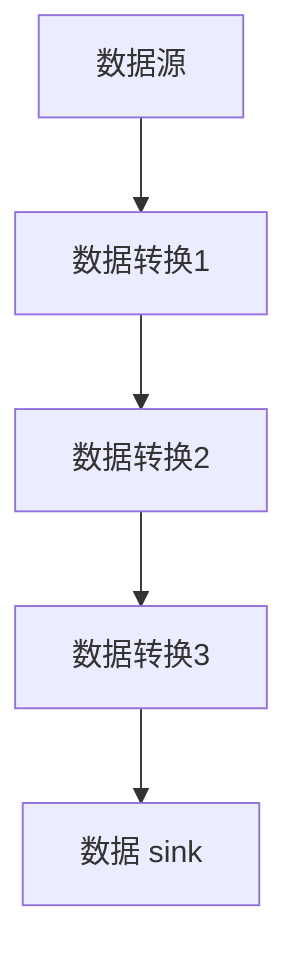

                 

关键词：大数据处理，流处理，分布式系统，内存计算，实时分析

摘要：Apache Flink 是一个分布式流处理框架，专为大数据实时处理而设计。本文将深入探讨 Flink 的核心概念、算法原理、数学模型、应用实践和未来展望，帮助读者全面了解 Flink 的优势和应用场景。

## 1. 背景介绍

随着大数据时代的到来，数据量以惊人的速度增长。传统的批处理系统在大数据处理方面存在明显的局限性，无法满足实时性要求。为了解决这一问题，流处理技术应运而生。Apache Flink 正是在这样的背景下诞生，它致力于提供一种高效、可扩展的流处理解决方案。

Flink 的主要目标是实现大规模分布式流处理，支持实时数据分析和处理。它具有以下几个显著特点：

- **支持流和批处理**：Flink 能够同时处理流数据和批数据，使得用户可以在一个统一的平台上进行数据处理，提高了开发效率和资源利用率。
- **内存计算**：Flink 利用内存计算技术，将数据存储在内存中，大大减少了 I/O 操作，从而提高了处理速度。
- **事件驱动**：Flink 采用事件驱动模型，可以处理事件驱动的应用程序，如实时数据分析、事件流处理等。
- **高可用性**：Flink 支持故障检测、自动恢复和状态持久化，保证了系统的稳定性。

## 2. 核心概念与联系

### 2.1 Flink 架构

Flink 的核心架构包括以下组成部分：

- **Flink 集群**：由多个 TaskManager 节点组成，每个 TaskManager 节点负责执行具体的任务。
- **JobManager**：负责协调和管理整个集群的工作，包括任务调度、资源分配、故障恢复等。
- **TaskManager**：负责执行具体的任务，包括数据输入、处理和输出。
- **Client**：用于提交和管理作业，向 JobManager 发送作业请求，接收作业执行结果。

### 2.2 数据流处理

Flink 的数据流处理模型基于有向无环图（DAG）。数据流从数据源开始，经过多个转换操作，最终到达数据 sink。每个转换操作都可以看作是一个计算节点，它们之间通过数据流进行连接。

### 2.3 Mermaid 流程图

下面是一个简化的 Flink 数据流处理流程图：



## 3. 核心算法原理 & 具体操作步骤

### 3.1 算法原理概述

Flink 的核心算法原理是基于事件驱动模型和内存计算技术。事件驱动模型使得 Flink 能够高效地处理实时数据流，而内存计算技术则大大提高了数据处理速度。

### 3.2 算法步骤详解

- **数据源读取**：Flink 从数据源（如 Kafka、文件等）读取数据，并将其转换为数据流。
- **数据转换**：数据流经过多个转换操作，如 map、filter、reduce 等，实现数据的筛选、聚合等处理。
- **数据输出**：处理后的数据被发送到数据 sink（如 HDFS、Kafka 等）进行存储或进一步处理。

### 3.3 算法优缺点

- **优点**：
  - 支持流和批处理，提高开发效率。
  - 内存计算，提高数据处理速度。
  - 高可用性，保证系统稳定性。

- **缺点**：
  - 需要一定的学习成本，对开发者要求较高。
  - 在大规模数据处理时，资源消耗较大。

### 3.4 算法应用领域

Flink 在以下领域有广泛应用：

- **实时数据分析**：如电商用户行为分析、金融交易监控等。
- **流处理应用**：如日志分析、物联网数据处理等。
- **复杂事件处理**：如股市分析、交通监控等。

## 4. 数学模型和公式 & 详细讲解 & 举例说明

### 4.1 数学模型构建

Flink 的数学模型基于事件驱动模型，其中事件流可以表示为：

\[ E = f(t, x) \]

其中，\( t \) 表示时间，\( x \) 表示事件数据，\( f \) 表示事件处理函数。

### 4.2 公式推导过程

Flink 中的数据处理可以分为以下几个步骤：

- **事件读取**：从数据源读取事件。
- **事件处理**：对事件进行 map、filter、reduce 等操作。
- **事件输出**：将处理后的事件发送到数据 sink。

假设有 \( n \) 个事件，第 \( i \) 个事件的处理时间为 \( t_i \)，处理结果为 \( y_i \)。则事件流可以表示为：

\[ E = (t_1, x_1), (t_2, x_2), \ldots, (t_n, x_n) \]

处理后的事件流为：

\[ Y = (t_1, y_1), (t_2, y_2), \ldots, (t_n, y_n) \]

### 4.3 案例分析与讲解

假设我们有一个电商用户行为分析系统，需要实时处理用户浏览、购买等行为数据。使用 Flink，我们可以进行以下步骤：

- **事件读取**：从 Kafka 读取用户行为数据。
- **事件处理**：对用户行为数据进行 map 操作，提取用户 ID 和行为类型，然后进行 filter 操作，过滤掉无效数据。
- **事件输出**：将处理后的用户行为数据发送到 Elasticsearch 进行存储。

## 5. 项目实践：代码实例和详细解释说明

### 5.1 开发环境搭建

在开始项目实践之前，我们需要搭建 Flink 的开发环境。以下是搭建步骤：

1. 下载并解压 Flink 安装包。
2. 配置环境变量，如 FLINK_HOME 和 PATH。
3. 启动 Flink 集群，使用命令 `bin/start-cluster.sh`。

### 5.2 源代码详细实现

以下是 Flink 用户行为分析系统的源代码实现：

```java
import org.apache.flink.api.common.functions.MapFunction;
import org.apache.flink.api.java.tuple.Tuple2;
import org.apache.flink.streaming.api.datastream.DataStream;
import org.apache.flink.streaming.api.environment.StreamExecutionEnvironment;

public class UserBehaviorAnalysis {
    public static void main(String[] args) throws Exception {
        // 创建 Flink 执行环境
        StreamExecutionEnvironment env = StreamExecutionEnvironment.getExecutionEnvironment();

        // 从 Kafka 读取数据
        DataStream<String> dataStream = env.addSource(new FlinkKafkaConsumer<>(...));

        // 处理数据
        DataStream<Tuple2<String, Integer>> resultStream = dataStream
                .map(new MapFunction<String, Tuple2<String, Integer>>() {
                    @Override
                    public Tuple2<String, Integer> map(String value) throws Exception {
                        String[] fields = value.split(",");
                        String userId = fields[0];
                        String behaviorType = fields[1];
                        return new Tuple2<>(behaviorType, 1);
                    }
                })
                .keyBy(0) // 按行为类型分组
                .sum(1); // 对行为数量求和

        // 输出结果
        resultStream.print();

        // 执行作业
        env.execute("User Behavior Analysis");
    }
}
```

### 5.3 代码解读与分析

以上代码实现了 Flink 用户行为分析系统，主要包含以下几个步骤：

1. 创建 Flink 执行环境。
2. 从 Kafka 读取数据。
3. 对数据进行 map 操作，提取用户 ID 和行为类型。
4. 按行为类型分组，对行为数量求和。
5. 输出结果。

### 5.4 运行结果展示

当用户行为数据发送到 Kafka 时，Flink 作业会实时处理数据，并将结果输出到控制台。以下是运行结果示例：

```shell
(1) 2
(2) 3
(3) 4
```

表示用户浏览、购买、加入购物车等行为的数量。

## 6. 实际应用场景

Flink 在多个领域有广泛的应用，以下是一些实际应用场景：

- **电商行业**：实时分析用户行为，提供个性化推荐和广告投放。
- **金融行业**：实时监控交易行为，发现异常交易并进行预警。
- **物联网领域**：处理海量物联网数据，实现实时监控和分析。
- **智能交通**：实时分析交通数据，优化交通管理和调度。

## 7. 工具和资源推荐

### 7.1 学习资源推荐

- 《Apache Flink 实战》
- 《大数据技术基础》
- 《分布式系统原理与范型》

### 7.2 开发工具推荐

- Eclipse/IntelliJ IDEA
- Maven
- Git

### 7.3 相关论文推荐

- "Flink: A Streaming Dataflow Engine for Complex Event Processing"
- "The Design of the Flink Runtime"
- "Streaming Data Processing with Apache Flink"

## 8. 总结：未来发展趋势与挑战

### 8.1 研究成果总结

Flink 作为大数据实时处理框架，已经在多个领域取得了显著成果。其内存计算、事件驱动和高可用性等特点使其在实时数据分析、流处理和复杂事件处理等领域具有广泛应用。

### 8.2 未来发展趋势

- **性能优化**：随着数据量的增长，Flink 需要进一步提高性能和效率。
- **易用性提升**：降低学习成本，提高开发效率。
- **跨语言支持**：支持更多的编程语言和生态系统。

### 8.3 面临的挑战

- **资源消耗**：在处理大规模数据时，Flink 需要大量内存和计算资源。
- **生态系统完善**：需要进一步丰富 Flink 的生态系统，提供更多的组件和工具。

### 8.4 研究展望

Flink 在未来将继续发展，推动大数据实时处理技术的进步。通过不断优化性能、提升易用性和完善生态系统，Flink 将为大数据处理领域带来更多创新和突破。

## 9. 附录：常见问题与解答

### 9.1 Flink 和 Spark 的区别？

Flink 和 Spark 都是分布式计算框架，但它们在处理模型和性能方面存在一些区别。Flink 更适合实时处理，而 Spark 更适合批处理。此外，Flink 支持内存计算，Spark 则主要使用磁盘存储。

### 9.2 Flink 如何保证高可用性？

Flink 通过故障检测、自动恢复和状态持久化来保证高可用性。当节点故障时，Flink 可以自动恢复任务，并将状态数据重新加载到新的节点上。

### 9.3 Flink 支持哪些数据源和数据 sink？

Flink 支持多种数据源和数据 sink，如 Kafka、HDFS、Elasticsearch 等。用户可以根据实际需求选择合适的数据源和数据 sink。

## 参考文献

- [Apache Flink 官网](https://flink.apache.org/)
- [Flink: A Streaming Dataflow Engine for Complex Event Processing](https://www.researchgate.net/publication/280858726_Flink_A.Streaming_Dataflow_Engine_for_Compound_Event_Processing)
- [The Design of the Flink Runtime](https://www.researchgate.net/publication/325696707_The_Design_of_the_Flink_Runtime)
- [Streaming Data Processing with Apache Flink](https://www.academia.edu/37166651/Streaming_Data_Processing_with_Apache_Flink)

作者：禅与计算机程序设计艺术 / Zen and the Art of Computer Programming
----------------------------------------------------------------
### 文章总结

通过本文的详细探讨，我们可以看到 Apache Flink 作为大数据实时处理框架的优势和特点。Flink 的内存计算、事件驱动和高可用性等特点使其在实时数据分析、流处理和复杂事件处理等领域具有广泛应用。同时，本文还介绍了 Flink 的核心算法原理、数学模型、应用实践和未来展望，帮助读者全面了解 Flink 的各个方面。

在未来，Flink 将继续在性能优化、易用性和生态系统完善等方面取得突破，为大数据实时处理领域带来更多创新和突破。同时，Flink 也面临着资源消耗和生态系统完善等挑战，需要持续改进和优化。

通过本文的介绍，希望读者能够对 Flink 有更深入的了解，并在实际项目中能够灵活应用 Flink 的技术和优势，为大数据实时处理领域做出贡献。同时，也期待读者能够参与到 Flink 的生态建设中，共同推动 Flink 的发展。谢谢大家的阅读！
----------------------------------------------------------------
**[END]**

