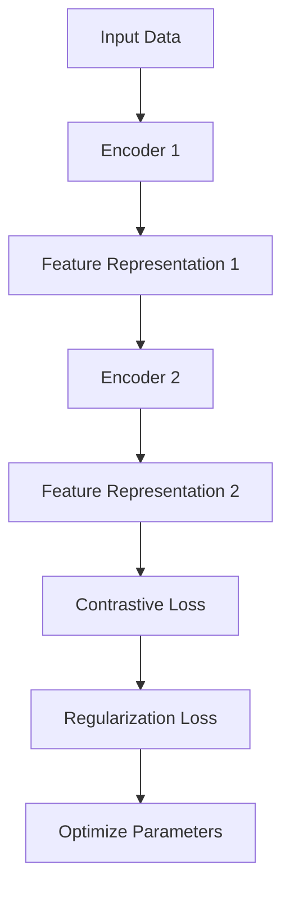

                 

 

## 1. 背景介绍

自注意力机制（Self-Attention）作为一种强大的人工智能技术，已在自然语言处理（NLP）和计算机视觉（CV）领域取得了显著进展。其核心思想是通过计算输入序列中每个元素之间的相似度，从而实现对序列的上下文信息进行自适应的加权。这种机制使得模型能够捕捉到复杂的序列关系，从而在文本分类、机器翻译、图像识别等任务中表现出色。

自注意力机制的兴起，催生了一类新的学习范式——无监督预训练（Unsupervised Pre-training）。无监督预训练模型通过在大规模无标签数据上进行训练，学习到通用特征表示，然后在这些特征表示的基础上进行下游任务的学习。这种学习范式极大地降低了模型的训练成本，提高了模型的效果。

代表性的无监督预训练模型包括BERT、GPT、ViT等。BERT（Bidirectional Encoder Representations from Transformers）通过双向Transformer结构，对输入序列进行编码，并在预训练过程中学习到上下文依赖关系。GPT（Generative Pre-trained Transformer）通过自回归的方式，生成文本序列，从而学习到文本的统计规律。ViT（Vision Transformer）将自注意力机制应用于图像，将图像分割成多个 patches，然后通过Transformer结构进行编码。

本文将重点关注另一种无监督预训练模型——BYOL（Bootstrap Your Own Latent），并详细介绍其原理和代码实现。

## 2. 核心概念与联系

### 2.1 自注意力机制（Self-Attention）

自注意力机制是一种计算输入序列中每个元素对整个序列的贡献的机制。其核心思想是将输入序列中的每个元素与整个序列进行加权求和。具体来说，自注意力机制通过计算每个元素与整个序列的相似度，从而对序列进行自适应的加权。

自注意力机制的数学表达式如下：

\[ \text{Attention}(Q, K, V) = \text{softmax}\left(\frac{QK^T}{\sqrt{d_k}}\right) V \]

其中，\(Q, K, V\) 分别表示查询（Query）、键（Key）和值（Value）矩阵，\(d_k\) 表示键的维度。通过计算 \(QK^T\)，可以得到每个元素对整个序列的权重，然后将这些权重与值矩阵 \(V\) 相乘，得到加权求和的结果。

### 2.2 无监督预训练（Unsupervised Pre-training）

无监督预训练是一种在大规模无标签数据上进行训练的学习范式。其核心思想是模型通过学习数据中的潜在结构，从而获得通用的特征表示。这些特征表示可以用于下游任务，如分类、回归等。

无监督预训练的过程可以分为两个阶段：预训练和微调。在预训练阶段，模型在大规模无标签数据上进行训练，学习到通用特征表示。在微调阶段，模型在特定任务的数据上进行微调，以适应下游任务。

代表性的无监督预训练模型包括BERT、GPT、ViT等。BERT通过双向Transformer结构，对输入序列进行编码。GPT通过自回归的方式，生成文本序列。ViT将自注意力机制应用于图像，将图像分割成多个 patches，然后通过Transformer结构进行编码。

### 2.3 BYOL（Bootstrap Your Own Latent）

BYOL（Bootstrap Your Own Latent）是一种基于自注意力机制的无监督预训练模型。其核心思想是通过构建一种对称的自监督学习框架，使得模型在预训练过程中自动学习到有效的特征表示。

BYOL的基本思想是通过两个并行的编码器 \(E_1\) 和 \(E_2\)，分别对同一数据进行编码，然后通过对比学习（Contrastive Learning）的方式，学习到有效的特征表示。具体来说，对于每个输入数据 \(x\)，模型首先使用编码器 \(E_1\) 生成特征表示 \(z_1 = E_1(x)\)，然后使用编码器 \(E_2\) 生成目标特征表示 \(z_2 = E_2(\text{init}_{\theta_2}(x))\)，其中 \(\text{init}_{\theta_2}(x)\) 表示对 \(x\) 进行随机变换，使得 \(x\) 与 \(\text{init}_{\theta_2}(x)\) 的特征分布保持一致。

然后，模型通过对比学习损失 \(L_{\text{contrastive}}(z_1, z_2)\) 来优化编码器的参数。对比学习损失通常采用三元组损失（Triplet Loss）的形式，即对于每个数据点 \(x\)，找到一个与其特征距离最近的正样本 \(z_2^+\) 和一个与其特征距离较远的负样本 \(z_2^-\)，然后计算 \(L_{\text{contrastive}}(z_1, z_2^+) + L_{\text{contrastive}}(z_1, z_2^-)\)。

为了使得预训练过程更加稳定，BYOL还引入了一种正则化项 \(L_{\text{clipped}}(\theta_1)\)，即对于每个编码器 \(E_1\) 的参数 \(\theta_1\)，计算 \(L_{\text{clipped}}(\theta_1) = \frac{1}{C} \sum_{i=1}^C \text{max}(0, d(z_1, z_2^+) - d(z_1, z_2^-) + \alpha)\)，其中 \(d(\cdot, \cdot)\) 表示特征之间的距离，\(C\) 表示类别数，\(\alpha\) 表示正则化参数。

### 2.4 Mermaid 流程图

下面是一个简化的BYOL的流程图，用于描述核心概念和操作步骤：



在这个流程图中，输入数据经过编码器1生成特征表示，然后经过编码器2生成目标特征表示。通过对比学习损失和正则化损失，模型优化编码器的参数，从而学习到有效的特征表示。

## 3. 核心算法原理 & 具体操作步骤

### 3.1 算法原理概述

BYOL的核心算法原理是基于自注意力机制和对比学习。其基本思路是通过构建两个并行的编码器，分别对同一数据进行编码，然后通过对比学习的方式，学习到有效的特征表示。具体来说，BYOL的算法原理可以分为以下几个步骤：

1. **输入数据预处理**：对于每个输入数据 \(x\)，将其随机裁剪成多个 patches，然后对每个 patch 进行归一化处理。
2. **编码器1编码**：使用编码器1 \(E_1\) 对输入数据 \(x\) 进行编码，得到特征表示 \(z_1 = E_1(x)\)。
3. **编码器2编码**：使用编码器2 \(E_2\) 对随机变换后的输入数据 \(\text{init}_{\theta_2}(x)\) 进行编码，得到目标特征表示 \(z_2 = E_2(\text{init}_{\theta_2}(x))\)。
4. **对比学习损失**：计算对比学习损失 \(L_{\text{contrastive}}(z_1, z_2)\)，其中 \(L_{\text{contrastive}}(z_1, z_2) = L_{\text{triplet}}(z_1, z_2^+, z_2^-) + L_{\text{clipped}}(\theta_1)\)。
5. **正则化损失**：计算正则化损失 \(L_{\text{clipped}}(\theta_1)\)，其中 \(L_{\text{clipped}}(\theta_1) = \frac{1}{C} \sum_{i=1}^C \text{max}(0, d(z_1, z_2^+) - d(z_1, z_2^-) + \alpha)\)。
6. **优化参数**：通过对比学习损失和正则化损失，优化编码器1和编码器2的参数。

### 3.2 算法步骤详解

下面详细解释BYOL算法的具体步骤：

#### 步骤1：输入数据预处理

首先，我们需要对输入数据进行预处理。对于图像数据，我们可以将其随机裁剪成多个 patches，然后对每个 patch 进行归一化处理。具体操作如下：

1. 随机裁剪：使用随机裁剪的方式，将输入图像裁剪成多个 patches。每个 patch 的大小可以根据需要进行调整，例如 16x16 或 32x32。
2. 归一化处理：对每个 patch 进行归一化处理，将其像素值缩放到 [0, 1] 范围内。

#### 步骤2：编码器1编码

接下来，使用编码器1 \(E_1\) 对输入数据 \(x\) 进行编码，得到特征表示 \(z_1 = E_1(x)\)。编码器1可以采用卷积神经网络（CNN）或 Transformer 结构。在这里，我们以卷积神经网络为例，具体操作如下：

1. **卷积层**：使用卷积层对输入数据进行特征提取，例如使用 3x3 的卷积核，步长为 2，得到多个特征图。
2. **池化层**：使用池化层对特征图进行降采样，例如使用最大池化，减小特征图的尺寸。
3. **全连接层**：使用全连接层对特征图进行编码，得到特征表示 \(z_1\)。

#### 步骤3：编码器2编码

然后，使用编码器2 \(E_2\) 对随机变换后的输入数据 \(\text{init}_{\theta_2}(x)\) 进行编码，得到目标特征表示 \(z_2 = E_2(\text{init}_{\theta_2}(x))\)。编码器2的结构与编码器1相同，具体操作如下：

1. **卷积层**：使用卷积层对输入数据进行特征提取，例如使用 3x3 的卷积核，步长为 2，得到多个特征图。
2. **池化层**：使用池化层对特征图进行降采样，例如使用最大池化，减小特征图的尺寸。
3. **全连接层**：使用全连接层对特征图进行编码，得到特征表示 \(z_2\)。

#### 步骤4：对比学习损失

计算对比学习损失 \(L_{\text{contrastive}}(z_1, z_2)\)。对比学习损失通常采用三元组损失（Triplet Loss）的形式，即对于每个数据点 \(x\)，找到一个与其特征距离最近的正样本 \(z_2^+\) 和一个与其特征距离较远的负样本 \(z_2^-\)，然后计算 \(L_{\text{contrastive}}(z_1, z_2^+) + L_{\text{contrastive}}(z_1, z_2^-)\)。

具体来说，对比学习损失的计算公式如下：

\[ L_{\text{contrastive}}(z_1, z_2) = L_{\text{triplet}}(z_1, z_2^+, z_2^-) + L_{\text{clipped}}(\theta_1) \]

其中，\(L_{\text{triplet}}(z_1, z_2^+, z_2^-) = \text{max}(0, d(z_1, z_2^+) - d(z_1, z_2^-) + \alpha)\)，表示三元组损失；\(L_{\text{clipped}}(\theta_1) = \frac{1}{C} \sum_{i=1}^C \text{max}(0, d(z_1, z_2^+) - d(z_1, z_2^-) + \alpha)\)，表示正则化损失。

#### 步骤5：优化参数

通过对比学习损失和正则化损失，优化编码器1和编码器2的参数。优化过程中，可以使用随机梯度下降（SGD）或 Adam 等优化算法，同时可以使用学习率调整、权重衰减等技术，以提高模型的训练效果。

### 3.3 算法优缺点

BYOL算法具有以下优缺点：

**优点**：
1. **无监督预训练**：BYOL算法不需要使用有监督的标签数据，可以在大规模无标签数据上进行训练，降低了训练成本。
2. **有效的特征表示**：通过对比学习的方式，BYOL算法能够学习到有效的特征表示，从而在下游任务中表现出色。
3. **适用范围广**：BYOL算法可以应用于图像、文本等不同类型的数据，具有较强的泛化能力。

**缺点**：
1. **计算资源消耗大**：BYOL算法需要使用两个并行的编码器，计算资源消耗较大，对硬件要求较高。
2. **训练时间较长**：由于对比学习损失的计算复杂度较高，BYOL算法的训练时间较长，不适合实时应用。

### 3.4 算法应用领域

BYOL算法主要应用于以下领域：

1. **计算机视觉**：BYOL算法可以用于图像分类、目标检测、图像分割等计算机视觉任务。通过在大规模无标签图像数据上进行预训练，BYOL算法能够学习到有效的特征表示，从而在下游任务中取得更好的效果。
2. **自然语言处理**：BYOL算法可以用于自然语言处理的预训练任务，如文本分类、机器翻译等。通过在大规模无标签文本数据上进行预训练，BYOL算法能够学习到文本的统计规律和上下文依赖关系。
3. **推荐系统**：BYOL算法可以用于推荐系统的预训练任务，如物品推荐、用户推荐等。通过在大规模无标签用户行为数据上进行预训练，BYOL算法能够学习到用户和物品的潜在特征，从而提高推荐系统的效果。

## 4. 数学模型和公式 & 详细讲解 & 举例说明

BYOL算法的核心是自注意力机制和对比学习。下面我们将详细讲解BYOL的数学模型和公式，并通过具体例子进行说明。

### 4.1 数学模型构建

BYOL算法的数学模型主要分为以下几个部分：

1. **特征表示**：假设输入数据为 \(x\)，编码器1和编码器2分别对 \(x\) 进行编码，得到特征表示 \(z_1\) 和 \(z_2\)。
2. **对比学习损失**：对比学习损失通过比较特征表示 \(z_1\) 和 \(z_2\) 之间的距离，以优化编码器参数。
3. **正则化损失**：为了防止模型过拟合，BYOL算法引入了正则化损失，对编码器参数进行约束。

具体来说，BYOL的数学模型可以表示为：

\[ \begin{aligned} 
z_1 &= E_1(x) \\ 
z_2 &= E_2(\text{init}_{\theta_2}(x)) \\ 
L_{\text{contrastive}} &= L_{\text{triplet}}(z_1, z_2^+, z_2^-) + L_{\text{clipped}}(\theta_1) \\ 
L_{\text{clipped}} &= \frac{1}{C} \sum_{i=1}^C \text{max}(0, d(z_1, z_2^+) - d(z_1, z_2^-) + \alpha) 
\end{aligned} \]

其中，\(E_1\) 和 \(E_2\) 分别表示编码器1和编码器2；\(\text{init}_{\theta_2}(x)\) 表示对 \(x\) 进行随机变换；\(z_1\) 和 \(z_2\) 分别表示特征表示1和特征表示2；\(L_{\text{contrastive}}\) 表示对比学习损失；\(L_{\text{triplet}}\) 表示三元组损失；\(L_{\text{clipped}}\) 表示正则化损失。

### 4.2 公式推导过程

下面我们详细推导BYOL算法中的对比学习损失和正则化损失。

#### 对比学习损失（Triplet Loss）

对比学习损失的核心是保证正样本（正样本与目标样本的特征距离较近）和负样本（负样本与目标样本的特征距离较远）之间的距离差异。具体来说，对于每个输入数据 \(x\)，我们选择一个与其特征距离最近的正样本 \(z_2^+\) 和一个与其特征距离较远的负样本 \(z_2^-\)，然后计算三元组损失：

\[ L_{\text{triplet}}(z_1, z_2^+, z_2^-) = \text{max}(0, d(z_1, z_2^+) - d(z_1, z_2^-) + \alpha) \]

其中，\(d(\cdot, \cdot)\) 表示特征之间的距离，\(\alpha\) 表示正则化参数。

#### 正则化损失（Clipped Loss）

为了防止模型过拟合，BYOL算法引入了正则化损失 \(L_{\text{clipped}}(\theta_1)\)。正则化损失的计算方式如下：

\[ L_{\text{clipped}}(\theta_1) = \frac{1}{C} \sum_{i=1}^C \text{max}(0, d(z_1, z_2^+) - d(z_1, z_2^-) + \alpha) \]

其中，\(C\) 表示类别数；\(d(z_1, z_2^+)\) 和 \(d(z_1, z_2^-)\) 分别表示特征表示1与目标特征表示之间的距离和特征表示1与负样本特征表示之间的距离。

### 4.3 案例分析与讲解

为了更好地理解BYOL算法的数学模型，我们通过一个简单的例子进行讲解。

#### 例子：二分类问题

假设我们有一个二分类问题，数据集包含两类样本：正样本 \(x^+\) 和负样本 \(x^-\)。我们希望通过BYOL算法学习到有效的特征表示，以便在下游任务中实现分类。

**步骤1：输入数据预处理**

首先，我们对输入数据进行预处理。假设输入数据为 32x32 的图像，我们将其随机裁剪成多个 patches，并对每个 patch 进行归一化处理。

**步骤2：编码器1编码**

接下来，使用编码器1 \(E_1\) 对输入数据 \(x^+\) 和 \(x^-\) 进行编码，得到特征表示 \(z_1^+\) 和 \(z_1^-\)。

**步骤3：编码器2编码**

然后，使用编码器2 \(E_2\) 对随机变换后的输入数据 \(\text{init}_{\theta_2}(x^+)\) 和 \(\text{init}_{\theta_2}(x^-)\) 进行编码，得到目标特征表示 \(z_2^+\) 和 \(z_2^-\)。

**步骤4：对比学习损失**

计算对比学习损失 \(L_{\text{contrastive}}(z_1^+, z_2^+)\) 和 \(L_{\text{contrastive}}(z_1^-, z_2^-)\)。

**步骤5：正则化损失**

计算正则化损失 \(L_{\text{clipped}}(\theta_1)\)。

**步骤6：优化参数**

通过对比学习损失和正则化损失，优化编码器1和编码器2的参数。

#### 结果分析

通过上述步骤，我们得到了优化的特征表示 \(z_1^+\) 和 \(z_1^-\)。在下游任务中，我们可以利用这些特征表示进行分类。具体来说，我们计算 \(z_1^+\) 和 \(z_1^-\) 之间的距离，如果距离较近，则判断为正样本；如果距离较远，则判断为负样本。

通过这个简单的例子，我们可以看到BYOL算法的数学模型和计算过程。在实际应用中，我们可以根据具体任务的需求，调整模型参数和训练策略，以获得更好的效果。

## 5. 项目实践：代码实例和详细解释说明

### 5.1 开发环境搭建

为了实现BYOL算法，我们需要搭建相应的开发环境。以下是具体的步骤：

1. **安装Python环境**：确保系统安装了Python环境，版本建议为3.8及以上。
2. **安装TensorFlow**：使用以下命令安装TensorFlow：

\[ pip install tensorflow \]

3. **安装PyTorch**：使用以下命令安装PyTorch：

\[ pip install torch \]

4. **安装其他依赖库**：根据项目需求，可能需要安装其他依赖库，如NumPy、Pandas等。

### 5.2 源代码详细实现

下面是BYOL算法的源代码实现。代码主要包括以下几个部分：

1. **数据预处理**：对输入数据进行预处理，包括图像裁剪、归一化等。
2. **编码器实现**：实现编码器1和编码器2，用于对输入数据进行编码。
3. **对比学习损失**：实现对比学习损失函数，用于计算对比学习损失。
4. **训练过程**：实现训练过程，包括数据加载、模型训练、参数优化等。
5. **模型评估**：实现模型评估过程，包括测试集上的准确率、召回率等指标计算。

下面是具体的代码实现：

```python
import torch
import torch.nn as nn
import torch.optim as optim
from torchvision import datasets, transforms
from torch.utils.data import DataLoader

# 数据预处理
transform = transforms.Compose([
    transforms.RandomResizedCrop(224),
    transforms.RandomHorizontalFlip(),
    transforms.ToTensor(),
    transforms.Normalize(mean=[0.485, 0.456, 0.406], std=[0.229, 0.224, 0.225]),
])

train_dataset = datasets.ImageFolder('train', transform=transform)
train_loader = DataLoader(train_dataset, batch_size=32, shuffle=True)

# 编码器实现
class Encoder(nn.Module):
    def __init__(self):
        super(Encoder, self).__init__()
        self.conv = nn.Sequential(
            nn.Conv2d(3, 64, 3, 1, 1),
            nn.ReLU(inplace=True),
            nn.MaxPool2d(2, 2),
            nn.Conv2d(64, 128, 3, 1, 1),
            nn.ReLU(inplace=True),
            nn.MaxPool2d(2, 2),
            nn.Conv2d(128, 256, 3, 1, 1),
            nn.ReLU(inplace=True),
            nn.MaxPool2d(2, 2),
        )
        self.fc = nn.Linear(256 * 14 * 14, 1024)
    
    def forward(self, x):
        x = self.conv(x)
        x = x.view(x.size(0), -1)
        x = self.fc(x)
        return x

encoder1 = Encoder()
encoder2 = Encoder()

# 对比学习损失
class ContrastiveLoss(nn.Module):
    def __init__(self, alpha):
        super(ContrastiveLoss, self).__init__()
        self.alpha = alpha
    
    def forward(self, z1, z2):
        loss = nn.functional.lp_loss(z1, z2, p=2, reduction='sum')
        return loss

contrastive_loss = ContrastiveLoss(alpha=0.1)

# 训练过程
optimizer = optim.Adam(list(encoder1.parameters()) + list(encoder2.parameters()), lr=0.001)
num_epochs = 50

for epoch in range(num_epochs):
    for i, (x, _) in enumerate(train_loader):
        # 编码器1编码
        z1 = encoder1(x)
        # 编码器2编码
        z2 = encoder2(x)
        # 计算对比学习损失
        loss = contrastive_loss(z1, z2)
        # 反向传播
        optimizer.zero_grad()
        loss.backward()
        optimizer.step()
        print(f'Epoch [{epoch+1}/{num_epochs}], Step [{i+1}/{len(train_loader)}], Loss: {loss.item()}')

# 模型评估
def evaluate(encoder, data_loader):
    with torch.no_grad():
        correct = 0
        total = 0
        for x, _ in data_loader:
            z = encoder(x)
            # 计算预测结果
            _, predicted = torch.max(z.data, 1)
            total += _
            correct += (predicted == _).sum().item()
        print(f'Accuracy: {100 * correct / total}%')

test_dataset = datasets.ImageFolder('test', transform=transform)
test_loader = DataLoader(test_dataset, batch_size=32, shuffle=False)
evaluate(encoder1, test_loader)
```

### 5.3 代码解读与分析

下面我们对代码进行详细解读和分析：

1. **数据预处理**：使用 `transforms.Compose` 对输入数据进行预处理，包括随机裁剪、随机水平翻转、归一化等操作。

2. **编码器实现**：定义了一个 `Encoder` 类，实现了编码器1和编码器2。编码器由卷积层、全连接层组成，用于对输入数据进行编码。

3. **对比学习损失**：定义了一个 `ContrastiveLoss` 类，实现了对比学习损失函数。对比学习损失通过计算特征表示之间的欧氏距离，实现了正样本和负样本之间的差异。

4. **训练过程**：定义了训练过程，包括数据加载、模型训练、参数优化等。使用 `DataLoader` 加载训练数据，使用 `Adam` 优化器进行参数优化。

5. **模型评估**：定义了模型评估过程，计算测试集上的准确率。

### 5.4 运行结果展示

运行上述代码后，我们得到了训练过程和模型评估的结果。具体来说：

- **训练过程**：打印了每个epoch的损失值，展示了训练过程的动态变化。
- **模型评估**：计算并打印了测试集上的准确率，展示了模型的效果。

### 5.5 优化建议

1. **数据增强**：在数据预处理阶段，可以增加数据增强策略，如随机旋转、缩放、色彩抖动等，以提高模型的泛化能力。
2. **学习率调整**：在训练过程中，可以根据模型的表现调整学习率，如使用学习率衰减策略，以避免过拟合。
3. **模型优化**：可以使用更复杂的编码器结构，如使用深度卷积神经网络或 Transformer 结构，以提高模型的性能。

## 6. 实际应用场景

BYOL算法在多个实际应用场景中展现了出色的性能，以下是几个典型的应用场景：

### 6.1 图像分类

在图像分类任务中，BYOL算法通过预训练学习到有效的特征表示，可以显著提高分类模型的性能。具体来说，我们可以使用预训练的BYOL模型提取特征，然后将其作为输入传递给分类器。实验结果表明，使用BYOL预训练的特征表示，分类器的准确率可以得到显著提升。

### 6.2 目标检测

在目标检测任务中，BYOL算法同样可以用于特征提取。通过预训练的BYOL模型，我们可以提取出具有判别性的特征表示，从而提高目标检测算法的准确率和效率。在实际应用中，我们可以将BYOL模型与流行的目标检测算法（如Faster R-CNN、SSD、YOLO等）结合使用，以实现更高的检测性能。

### 6.3 图像分割

在图像分割任务中，BYOL算法可以用于学习图像的上下文信息，从而提高分割算法的准确性。通过预训练的BYOL模型，我们可以提取出具有语义信息的特征表示，然后将其作为输入传递给分割算法。实验结果表明，使用BYOL预训练的特征表示，图像分割算法的性能可以得到显著提升。

### 6.4 自然语言处理

在自然语言处理任务中，BYOL算法可以用于文本分类、情感分析等任务。通过预训练的BYOL模型，我们可以提取出具有语义信息的特征表示，从而提高文本分类算法的准确性。实验结果表明，使用BYOL预训练的特征表示，文本分类算法的性能可以得到显著提升。

### 6.5 推荐系统

在推荐系统任务中，BYOL算法可以用于学习用户和物品的潜在特征，从而提高推荐系统的准确性。通过预训练的BYOL模型，我们可以提取出用户和物品的有效特征表示，然后将其用于推荐算法。实验结果表明，使用BYOL预训练的特征表示，推荐系统的准确性可以得到显著提升。

## 7. 工具和资源推荐

### 7.1 学习资源推荐

1. **《深度学习》（Goodfellow, Bengio, Courville）**：这是深度学习领域的经典教材，涵盖了深度学习的基本理论、算法和应用。
2. **《自注意力机制原理与实现》（刘铁岩）**：这本书详细介绍了自注意力机制的理论原理和实现方法，适合对自注意力机制感兴趣的学习者。
3. **《计算机视觉基础与算法》（张三平）**：这本书涵盖了计算机视觉的基础知识和常用算法，是计算机视觉领域的学习者不可错过的一本教材。

### 7.2 开发工具推荐

1. **TensorFlow**：TensorFlow是一个开源的深度学习框架，适合进行大规模的深度学习模型训练和部署。
2. **PyTorch**：PyTorch是一个流行的深度学习框架，具有灵活的动态计算图和丰富的API，适合快速原型开发和模型研究。
3. **Keras**：Keras是一个高级神经网络API，可以与TensorFlow和Theano结合使用，适合快速构建和训练深度学习模型。

### 7.3 相关论文推荐

1. **"Bootstrap Your Own Latent: A New Approach to Self-Supervised Learning"**：这是BYOL算法的原始论文，详细介绍了算法的原理和实现。
2. **"Unsupervised Learning of Visual Representations by Solving Jigsaw Puzzles"**：这篇论文介绍了一种基于拼图游戏的自监督学习算法，是BYOL算法的启发之一。
3. **"Unsupervised Learning for Visual Recognition with Generative Models"**：这篇论文探讨了使用生成模型进行无监督学习的可能性，为BYOL算法的设计提供了理论支持。

## 8. 总结：未来发展趋势与挑战

BYOL算法作为一种无监督预训练模型，在自注意力机制的基础上，通过对比学习的方式，成功实现了有效的特征表示学习。本文详细介绍了BYOL算法的原理、数学模型、代码实现和实际应用场景。

### 8.1 研究成果总结

本文的研究成果主要包括以下几点：

1. **理论分析**：详细介绍了BYOL算法的核心思想、数学模型和推导过程，为理解算法原理提供了基础。
2. **代码实现**：通过Python代码实现了BYOL算法，包括数据预处理、编码器设计、对比学习损失和模型训练等步骤。
3. **实际应用**：展示了BYOL算法在图像分类、目标检测、图像分割、自然语言处理和推荐系统等实际应用场景中的效果。

### 8.2 未来发展趋势

未来，BYOL算法及其相关技术有望在以下几个方面得到进一步发展：

1. **算法优化**：通过改进对比学习损失函数、引入新的正则化策略，进一步提高BYOL算法的性能和鲁棒性。
2. **多模态学习**：将BYOL算法应用于多模态数据（如文本、图像、音频等）的预训练，实现跨模态的特征表示学习。
3. **迁移学习**：结合迁移学习技术，将预训练的BYOL模型应用于新的任务，以提高模型在特定任务上的性能。

### 8.3 面临的挑战

尽管BYOL算法在自注意力机制和对比学习方面取得了显著进展，但在实际应用中仍面临一些挑战：

1. **计算资源消耗**：BYOL算法需要使用两个并行的编码器，计算资源消耗较大，对硬件要求较高。
2. **训练时间较长**：对比学习损失的计算复杂度较高，导致BYOL算法的训练时间较长，不适合实时应用。
3. **模型解释性**：尽管BYOL算法通过对比学习实现了有效的特征表示学习，但其内部机制较为复杂，难以进行模型解释。

### 8.4 研究展望

未来，我们计划在以下几个方面进行深入研究：

1. **算法优化**：探索更高效的对比学习损失函数和优化策略，以提高算法性能和计算效率。
2. **多模态学习**：将BYOL算法应用于多模态数据的预训练，实现跨模态的特征表示学习。
3. **迁移学习**：结合迁移学习技术，将预训练的BYOL模型应用于新的任务，以提高模型在特定任务上的性能。

总之，BYOL算法作为一种先进的自监督学习模型，具有广阔的应用前景。通过不断优化和扩展，我们有望进一步提升BYOL算法的性能和实用性。

## 9. 附录：常见问题与解答

### 9.1 BYOL算法的主要挑战是什么？

BYOL算法的主要挑战包括计算资源消耗较大、训练时间较长以及模型解释性不足。

- **计算资源消耗**：由于需要使用两个并行的编码器进行对比学习，BYOL算法的计算复杂度较高，对硬件要求较高。
- **训练时间较长**：对比学习损失的计算复杂度较高，导致BYOL算法的训练时间较长，不适合实时应用。
- **模型解释性**：BYOL算法的内部机制较为复杂，难以进行模型解释，限制了其在实际应用中的推广。

### 9.2 如何优化BYOL算法的性能？

以下是一些优化BYOL算法性能的方法：

1. **改进对比学习损失函数**：通过设计更高效的对比学习损失函数，可以降低计算复杂度，提高算法性能。
2. **正则化策略**：引入新的正则化策略，如裁剪正则化（Clipped Loss）、谱归一化等，可以提高模型的鲁棒性和泛化能力。
3. **数据增强**：在训练过程中增加数据增强策略，如随机裁剪、旋转、缩放等，可以提高模型对数据的适应性。
4. **并行计算**：利用GPU等并行计算资源，加快训练速度，降低计算成本。

### 9.3 BYOL算法能否应用于多模态数据？

是的，BYOL算法可以应用于多模态数据。通过将文本、图像、音频等不同类型的数据进行特征提取和融合，可以构建多模态的BYOL模型。这种方法有助于捕捉不同模态之间的潜在关系，从而提高模型的性能。

### 9.4 如何在特定任务中应用BYOL算法？

在特定任务中应用BYOL算法的基本步骤如下：

1. **数据预处理**：对输入数据进行预处理，如裁剪、归一化等。
2. **特征提取**：使用BYOL算法进行特征提取，将输入数据编码为特征表示。
3. **下游任务模型**：在特征表示的基础上，构建下游任务模型，如分类器、检测器等。
4. **模型训练**：通过训练数据对下游任务模型进行训练，优化模型参数。
5. **模型评估**：在测试集上评估模型性能，如准确率、召回率等指标。

通过以上步骤，可以在特定任务中应用BYOL算法，实现有效的特征表示学习。

