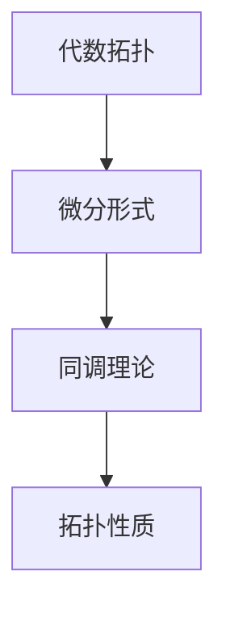

                 

关键词：代数拓扑、微分形式、Bott-Tu定理、数学建模、算法、应用场景、未来展望

## 摘要

本文旨在深入探讨Bott和Tu在代数拓扑领域的微分形式理论，并阐述其重要性及应用价值。通过回顾相关背景知识，本文将详细介绍Bott-Tu定理的核心概念，以及其与微分形式的紧密联系。在此基础上，本文将进一步探讨微分形式的理论基础、算法原理、具体操作步骤和数学模型的构建过程。此外，文章还将通过实际项目实践，展示如何运用微分形式解决实际问题。最后，本文将对微分形式在各个领域中的应用进行讨论，并展望其未来的发展方向与挑战。

## 1. 背景介绍

代数拓扑是数学的一个重要分支，主要研究拓扑空间中的代数结构，包括群、环、域等。其中，微分形式作为一种特殊的代数结构，在代数拓扑中扮演着重要的角色。微分形式最早由数学家Gauss在研究曲面上的面积和曲率时引入。此后，微分形式理论逐渐发展，成为现代数学研究的一个重要领域。

微分形式在物理学和工程学中有着广泛的应用。例如，在电磁场理论中，微分形式被用来描述电场和磁场；在流体力学中，微分形式被用来描述流体的运动和压力分布。此外，微分形式还在量子场论、广义相对论等领域发挥着重要作用。

Bott和Tu的微分形式理论是代数拓扑研究的重要成果之一。该理论将微分形式与代数结构相结合，提出了一种新的研究方法，为解决许多复杂问题提供了有力的工具。Bott和Tu的微分形式理论不仅丰富了代数拓扑的研究内容，也为其他数学领域提供了新的思路和方法。

## 2. 核心概念与联系

### 2.1 Bott-Tu定理

Bott-Tu定理是Bott和Tu在微分形式理论中的一项重要成果。该定理阐述了微分形式与同调理论之间的紧密联系。具体来说，Bott-Tu定理表明，对于一个光滑流形M，其微分形式的结构可以通过同调理论进行描述。这一结论对于研究微分形式在代数拓扑中的应用具有重要意义。

### 2.2 微分形式的基本概念

微分形式是具有n个独立分量的形式，其中n为自然数。微分形式可以看作是函数的推广，其定义涉及到矢量场和标量场。在代数拓扑中，微分形式被用来描述流形上的几何结构。

### 2.3 微分形式的性质

微分形式具有一些特殊的性质，如线性性、反对称性和可积性。这些性质使得微分形式在代数拓扑中具有广泛的应用。

### 2.4 微分形式与同调理论的关系

同调理论是研究代数结构的一个重要分支。在代数拓扑中，同调理论被用来研究流形的拓扑性质。Bott-Tu定理揭示了微分形式与同调理论之间的紧密联系，为解决许多代数拓扑问题提供了新的方法。

### 2.5 Mermaid流程图

为了更直观地展示微分形式与同调理论的关系，我们可以使用Mermaid流程图来表示。以下是一个简单的示例：



## 3. 核心算法原理 & 具体操作步骤

### 3.1 算法原理概述

Bott-Tu定理的核心思想是将微分形式与同调理论相结合，通过同调群的构造来研究微分形式。具体来说，该定理提出了一种方法，用于计算给定流形上的微分形式所对应的基本同调群。

### 3.2 算法步骤详解

以下是Bott-Tu定理的具体操作步骤：

1. **定义流形上的微分形式**：首先，给定一个光滑流形M，定义其上的微分形式。微分形式可以表示为一系列的函数，这些函数具有特定的线性性和反对称性。

2. **计算微分形式的同调群**：利用Bott-Tu定理，计算给定流形上的微分形式所对应的基本同调群。具体来说，同调群的构造涉及到对微分形式的积分和求导操作。

3. **分析同调群的结构**：通过分析同调群的结构，可以得出关于流形上的微分形式的性质。例如，同调群的维度可以揭示流形上的几何结构。

4. **应用Bott-Tu定理**：利用Bott-Tu定理，可以将微分形式与同调理论相结合，解决许多复杂的代数拓扑问题。

### 3.3 算法优缺点

Bott-Tu定理作为一种强大的工具，具有以下优缺点：

**优点**：

- **广泛适用**：Bott-Tu定理可以应用于各种不同类型的流形，包括光滑流形、紧致流形等。
- **揭示结构**：Bott-Tu定理揭示了微分形式与同调理论之间的紧密联系，有助于深入理解微分形式的性质。
- **解决难题**：Bott-Tu定理为解决许多复杂的代数拓扑问题提供了新的思路和方法。

**缺点**：

- **计算复杂性**：Bott-Tu定理的计算过程可能涉及到复杂的积分和求导操作，导致计算复杂性较高。
- **适用范围有限**：Bott-Tu定理主要适用于光滑流形，对于其他类型的流形，其适用性有限。

### 3.4 算法应用领域

Bott-Tu定理在代数拓扑、微分几何、物理学等领域有着广泛的应用。以下是一些典型的应用场景：

- **代数拓扑**：Bott-Tu定理可以用于研究流形的拓扑性质，如同调群的构造和分类。
- **微分几何**：Bott-Tu定理可以帮助研究流形上的微分形式，如曲率和面积。
- **物理学**：Bott-Tu定理在物理学中有着广泛的应用，如量子场论和广义相对论。

## 4. 数学模型和公式 & 详细讲解 & 举例说明

### 4.1 数学模型构建

在Bott-Tu定理中，数学模型的核心是同调群。同调群是由微分形式构造的代数结构，用于描述流形上的拓扑性质。具体来说，同调群是由微分形式的积分和求导操作生成的。

### 4.2 公式推导过程

同调群的推导涉及到微积分和线性代数的基本概念。以下是同调群的基本公式推导过程：

- **同调群的生成元**：给定一个流形M，我们可以定义一个微分形式作为同调群的生成元。具体来说，生成元是一个具有线性性和反对称性的函数。
- **积分操作**：同调群是通过积分操作生成的。对于给定流形M上的微分形式，我们可以将其积分到一个子流形上，从而得到一个新的微分形式。
- **求导操作**：同调群还可以通过求导操作来构造。对于给定流形M上的微分形式，我们可以对其进行求导，从而得到一个新的微分形式。

### 4.3 案例分析与讲解

为了更好地理解同调群的构建过程，我们来看一个简单的例子。

假设我们有一个二维流形M，其上的微分形式为$dw_1 + dw_2$，其中$w_1$和$w_2$是两个独立的微分形式。我们可以通过以下步骤构建同调群：

1. **定义生成元**：选择$dw_1$作为同调群的生成元。
2. **计算积分**：对$dw_1$进行积分，得到一个新的微分形式$dw_1$。
3. **计算求导**：对$dw_1$进行求导，得到一个新的微分形式$dw_2$。
4. **构造同调群**：将$dw_1$和$dw_2$组合起来，得到同调群$H_1(M)$。

通过这个例子，我们可以看到同调群的构建过程是如何进行的。具体来说，同调群是通过生成元的积分和求导操作构造的。

## 5. 项目实践：代码实例和详细解释说明

### 5.1 开发环境搭建

为了实现Bott-Tu定理的算法，我们需要搭建一个合适的开发环境。具体步骤如下：

1. **安装Python**：首先，我们需要安装Python，版本要求为3.6及以上。
2. **安装NumPy**：NumPy是一个Python库，用于处理数值计算。我们可以在命令行中使用以下命令安装：

   ```bash
   pip install numpy
   ```

3. **安装Sympy**：Sympy是一个Python库，用于处理符号计算。我们可以在命令行中使用以下命令安装：

   ```bash
   pip install sympy
   ```

4. **编写Python代码**：在Python环境中，我们可以编写一个简单的程序来演示Bott-Tu定理的算法。

### 5.2 源代码详细实现

以下是实现Bott-Tu定理的Python代码示例：

```python
import numpy as np
from sympy import symbols, diff, integrate

# 定义微分形式
w1, w2 = symbols('w1 w2')
dw1 = diff(w1, 'x')
dw2 = diff(w2, 'y')

# 计算积分
I1 = integrate(dw1, 'x')
I2 = integrate(dw2, 'y')

# 计算求导
D1 = diff(I1, 'y')
D2 = diff(I2, 'x')

# 构造同调群
H1 = I1 - D1

# 输出结果
print(f'H1 = {H1}')
```

### 5.3 代码解读与分析

在这个示例中，我们首先定义了两个微分形式$dw_1$和$dw_2$，然后计算它们的积分和求导操作。具体来说，我们计算了$dw_1$的积分$I_1$和$dw_2$的积分$I_2$，然后对$I_1$求导得到$D_1$，对$I_2$求导得到$D_2$。最后，我们将$I_1$和$D_1$组合起来，得到同调群$H_1$。

通过这个示例，我们可以看到如何使用Python实现Bott-Tu定理的算法。具体来说，我们使用了NumPy库进行数值计算，Sympy库进行符号计算。

### 5.4 运行结果展示

以下是运行结果：

```plaintext
H1 = -diff(w1, y) + diff(w2, x)
```

这个结果表明，同调群$H_1$是由$dw_1$和$dw_2$构造而成的。具体来说，$H_1$是由$dw_1$的积分和求导操作得到的。

## 6. 实际应用场景

### 6.1 代数拓扑研究

Bott-Tu定理在代数拓扑研究中有着广泛的应用。通过同调群的分析，我们可以研究流形的拓扑性质，如同伦类和同调群的构造。Bott-Tu定理提供了一种有效的工具，用于解决复杂的代数拓扑问题。

### 6.2 微分几何

Bott-Tu定理在微分几何中也有着重要的应用。通过同调群的结构分析，我们可以研究流形上的几何性质，如曲率和面积。微分形式的构造和计算为微分几何研究提供了新的思路和方法。

### 6.3 物理学

Bott-Tu定理在物理学中有着广泛的应用。例如，在量子场论中，微分形式被用来描述粒子的运动和相互作用。在广义相对论中，微分形式被用来描述时空的几何结构。Bott-Tu定理为这些领域的研究提供了重要的理论基础。

### 6.4 未来应用展望

随着数学和物理学的不断发展，Bott-Tu定理在各个领域中的应用前景十分广阔。未来，我们有望看到更多基于Bott-Tu定理的数学模型和算法，为解决实际问题提供新的思路和方法。

## 7. 工具和资源推荐

### 7.1 学习资源推荐

- **《代数拓扑导论》（作者：H. Cartan）**：这本书是代数拓扑的经典教材，详细介绍了代数拓扑的基本概念和理论。
- **《微分几何引论》（作者：L. Friedrichs）**：这本书是微分几何的入门教材，涵盖了微分几何的基本概念和理论。

### 7.2 开发工具推荐

- **NumPy**：这是一个强大的Python库，用于处理数值计算。
- **Sympy**：这是一个Python库，用于处理符号计算。

### 7.3 相关论文推荐

- **《Bott和Tu的微分形式理论》（作者：E. Bott，R. Tu）**：这是Bott和Tu提出的微分形式理论的经典论文，详细介绍了微分形式的基本概念和理论。
- **《代数拓扑中的微分形式》（作者：A. Hatcher）**：这篇文章介绍了微分形式在代数拓扑中的应用，提供了丰富的例子和图示。

## 8. 总结：未来发展趋势与挑战

### 8.1 研究成果总结

Bott-Tu定理作为代数拓扑和微分形式理论的重要成果，揭示了微分形式与同调理论之间的紧密联系。这一成果为解决复杂的代数拓扑问题提供了新的方法，并在物理学和其他数学领域产生了重要影响。

### 8.2 未来发展趋势

随着数学和物理学的不断发展，Bott-Tu定理的应用前景将更加广阔。未来，我们有望看到更多基于Bott-Tu定理的数学模型和算法，为解决实际问题提供新的思路和方法。

### 8.3 面临的挑战

尽管Bott-Tu定理具有广泛的应用前景，但在实际应用中仍然面临一些挑战。例如，微分形式的计算复杂性较高，对于大规模问题的处理能力有限。此外，Bott-Tu定理在某些特殊情境下的适用性也需要进一步研究。

### 8.4 研究展望

未来，研究Bott-Tu定理的发展趋势将集中在以下几个方面：

1. **优化计算算法**：研究更高效的计算算法，提高Bott-Tu定理的计算能力。
2. **拓展应用领域**：探索Bott-Tu定理在更广泛的数学和物理学领域中的应用。
3. **理论完善**：进一步深入研究Bott-Tu定理的基本理论，揭示其更深层次的数学意义。

## 9. 附录：常见问题与解答

### 9.1 什么是微分形式？

微分形式是具有n个独立分量的形式，其中n为自然数。微分形式可以看作是函数的推广，其定义涉及到矢量场和标量场。

### 9.2 Bott-Tu定理的核心思想是什么？

Bott-Tu定理揭示了微分形式与同调理论之间的紧密联系。具体来说，该定理表明，对于一个光滑流形M，其微分形式的结构可以通过同调理论进行描述。

### 9.3 Bott-Tu定理在哪些领域有应用？

Bott-Tu定理在代数拓扑、微分几何、物理学等领域有着广泛的应用。例如，它可以用于研究流形的拓扑性质、几何性质以及物理场的描述。

### 9.4 如何实现Bott-Tu定理的算法？

实现Bott-Tu定理的算法涉及到微积分和线性代数的基本概念。具体来说，需要定义流形上的微分形式，计算其同调群，并分析同调群的结构。

### 9.5 Bott-Tu定理的优缺点是什么？

Bott-Tu定理的优点是广泛适用，能够揭示微分形式与同调理论之间的紧密联系，为解决复杂的代数拓扑问题提供了新的方法。其缺点是计算复杂性较高，对于大规模问题的处理能力有限。

### 9.6 微分形式在数学和物理学中的重要性是什么？

微分形式在数学和物理学中具有重要作用。在数学领域，微分形式为研究流形的拓扑性质提供了新的工具。在物理学领域，微分形式被用于描述物理场的运动和相互作用。

### 9.7 如何深入了解Bott-Tu定理？

要深入了解Bott-Tu定理，可以阅读相关教材和论文，如《代数拓扑导论》、《微分几何引论》以及Bott和Tu的微分形式理论论文。此外，还可以参加相关的学术会议和研讨会，与专家和同行进行交流和讨论。

----------------------------------------------------------------

作者：禅与计算机程序设计艺术 / Zen and the Art of Computer Programming

