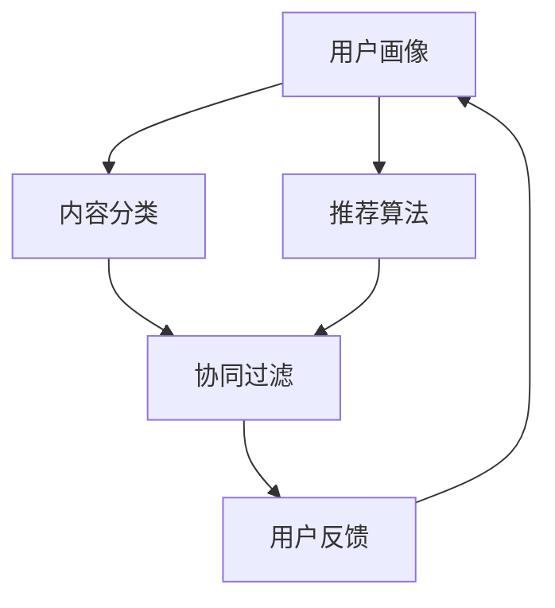

                 

关键词：CUI、个性化推荐、用户体验、算法、数学模型、项目实践

> 摘要：本文深入探讨了CUI（计算机用户界面）中的个性化推荐技术，从核心概念、算法原理、数学模型、项目实践等多个角度出发，详细阐述了如何提升CUI的个性化推荐效果，从而提升用户的整体体验。本文旨在为开发者提供一套系统的理论框架和实践指导，以帮助他们在CUI设计中更好地实现个性化推荐，提升用户体验。

## 1. 背景介绍

随着人工智能技术的发展，计算机用户界面（CUI）正在经历翻天覆地的变化。传统的CUI设计主要依赖于用户的行为数据和偏好设置，而现代的CUI逐渐引入了个性化推荐系统，旨在根据用户的兴趣和行为，自动推荐相关的内容、服务或产品。这种个性化推荐不仅能够提升用户的参与度，还能够提高系统的利用率和商业价值。

### 1.1 个性化推荐的重要性

个性化推荐在CUI中的作用至关重要。它可以帮助用户快速找到他们感兴趣的内容，减少搜索时间和精力消耗。此外，个性化推荐还能够提升用户的满意度和忠诚度，从而为平台带来更多的用户粘性和商业收益。

### 1.2 个性化推荐的应用场景

个性化推荐广泛应用于各种CUI场景，包括但不限于：

- **电子商务平台**：根据用户的购物历史和偏好，推荐类似的产品或相关服务。
- **内容平台**：如YouTube、Netflix等，根据用户的观看历史和搜索行为，推荐相关视频或电影。
- **社交网络**：根据用户的兴趣和行为，推荐可能关注的朋友或相关内容。
- **金融服务**：根据用户的投资历史和风险偏好，推荐适合的投资产品或理财计划。

## 2. 核心概念与联系

在探讨个性化推荐技术之前，我们需要了解一些核心概念和其相互之间的联系。

### 2.1 用户画像（User Profiling）

用户画像是指通过收集和分析用户的个人信息、行为数据、偏好等，构建出一个全面的用户模型。这个模型可以帮助推荐系统更好地理解用户的需求和兴趣。

### 2.2 内容分类（Content Categorization）

内容分类是将海量的信息或内容按照一定的标准进行分类，以便推荐系统可以基于分类结果进行推荐。常见的分类方法包括基于内容的分类（Content-Based Filtering）和协同过滤（Collaborative Filtering）。

### 2.3 推荐算法（Recommendation Algorithms）

推荐算法是实现个性化推荐的核心技术。根据算法的实现方式，推荐算法主要分为以下几类：

- **基于内容的推荐**：通过分析用户的历史行为和兴趣，找到与用户当前兴趣相似的内容进行推荐。
- **协同过滤推荐**：通过分析用户之间的行为模式，找到相似的用户，然后将这些用户喜欢的但用户未访问过的内容推荐给用户。
- **混合推荐**：结合多种推荐算法的优点，提高推荐的准确性和多样性。

### 2.4 用户反馈（User Feedback）

用户反馈是推荐系统不断优化和迭代的重要依据。通过收集用户的点击、评分、收藏等行为，推荐系统可以不断调整推荐策略，提高用户的满意度。

### 2.5 Mermaid 流程图

为了更好地展示这些核心概念之间的联系，我们可以使用Mermaid绘制一个流程图：



## 3. 核心算法原理 & 具体操作步骤

### 3.1 算法原理概述

个性化推荐算法的原理可以概括为：通过分析用户的历史数据和行为模式，构建一个用户兴趣模型，然后根据这个模型推荐用户可能感兴趣的内容。

### 3.2 算法步骤详解

个性化推荐算法的主要步骤如下：

1. **数据收集**：收集用户的行为数据，如点击、搜索、浏览、购买等。
2. **用户画像构建**：通过分析用户的历史数据，构建一个全面的用户画像。
3. **内容分类**：对内容进行分类，以便推荐系统可以基于分类结果进行推荐。
4. **推荐算法选择**：选择合适的推荐算法，如基于内容的推荐、协同过滤推荐或混合推荐。
5. **推荐结果生成**：根据用户画像和推荐算法，生成推荐结果。
6. **用户反馈收集**：收集用户的点击、评分、收藏等反馈，用于后续算法优化。

### 3.3 算法优缺点

**协同过滤推荐**：

- **优点**：能够推荐用户未访问过的内容，推荐效果较好。
- **缺点**：可能产生数据稀疏问题，难以应对新用户和冷启动问题。

**基于内容的推荐**：

- **优点**：能够基于用户兴趣推荐内容，推荐结果多样。
- **缺点**：难以应对用户兴趣变化，推荐结果可能过于单一。

**混合推荐**：

- **优点**：结合了协同过滤和基于内容推荐的优势，推荐效果较好。
- **缺点**：实现复杂，需要大量的计算资源。

### 3.4 算法应用领域

个性化推荐算法广泛应用于各种CUI场景，如电子商务、内容平台、金融服务、社交网络等。以下是一些具体的案例：

- **电子商务**：根据用户的购物历史和偏好，推荐类似的产品或相关服务。
- **内容平台**：根据用户的观看历史和搜索行为，推荐相关的视频或电影。
- **金融服务**：根据用户的投资历史和风险偏好，推荐适合的投资产品或理财计划。

## 4. 数学模型和公式 & 详细讲解 & 举例说明

### 4.1 数学模型构建

个性化推荐的核心是构建一个用户兴趣模型，通常使用以下数学模型：

$$
User = f(User\_Features, Content\_Features)
$$

其中，$User\_Features$ 表示用户特征，$Content\_Features$ 表示内容特征。

### 4.2 公式推导过程

我们假设用户兴趣可以表示为一个向量 $User\_Interest$，内容特征可以表示为一个向量 $Content\_Features$。用户兴趣模型的目标是找到 $User\_Interest$ 和 $Content\_Features$ 之间的关系。

假设用户兴趣模型是一个线性模型，即：

$$
User\_Interest = \theta_0 + \theta_1 \cdot User\_Features + \theta_2 \cdot Content\_Features
$$

其中，$\theta_0$、$\theta_1$ 和 $\theta_2$ 是模型参数。

### 4.3 案例分析与讲解

假设我们有一个用户，他喜欢阅读科幻小说。我们可以根据这个用户的历史阅读记录，构建一个用户画像，并使用上述公式推导出他的兴趣模型。

1. **用户特征**：

   - 性别：男
   - 年龄：30岁
   - 阅读历史：喜欢科幻小说、科幻电影

   用户特征向量可以表示为：

   $$
   User\_Features = (M, A, H)
   $$

   其中，$M$ 表示性别（男=1，女=0），$A$ 表示年龄，$H$ 表示阅读历史。

2. **内容特征**：

   - 类别：科幻小说
   - 类型：电影、书籍
   - 作者：刘慈欣

   内容特征向量可以表示为：

   $$
   Content\_Features = (C, T, A)
   $$

   其中，$C$ 表示类别（科幻小说=1，其他=0），$T$ 表示类型（电影=1，书籍=0），$A$ 表示作者。

3. **用户兴趣模型**：

   假设我们通过训练得到以下模型参数：

   $$
   \theta_0 = 1, \theta_1 = 0.5, \theta_2 = 0.3
   $$

   用户兴趣向量可以表示为：

   $$
   User\_Interest = 1 + 0.5 \cdot (M, A, H) + 0.3 \cdot (C, T, A)
   $$

   根据这个模型，我们可以预测用户对某个科幻电影的兴趣程度。例如，如果某个科幻电影的类别、类型和作者是刘慈欣，那么用户对该电影的兴趣评分可以计算为：

   $$
   User\_Interest = 1 + 0.5 \cdot (1, 30, 1) + 0.3 \cdot (1, 1, 1) = 1.6
   $$

   根据这个评分，我们可以推荐该电影给用户。

## 5. 项目实践：代码实例和详细解释说明

### 5.1 开发环境搭建

为了实现上述个性化推荐算法，我们需要搭建一个基本的开发环境。以下是一个简单的Python环境搭建步骤：

1. 安装Python（推荐使用3.8版本）
2. 安装必要的库，如NumPy、Pandas、Scikit-learn等

```bash
pip install numpy pandas scikit-learn
```

### 5.2 源代码详细实现

以下是一个简单的基于内容的推荐系统的Python代码示例：

```python
import numpy as np
import pandas as pd
from sklearn.model_selection import train_test_split
from sklearn.metrics.pairwise import cosine_similarity

# 假设有一个包含用户特征和内容特征的数据集
data = pd.DataFrame({
    'User_Features': [
        [1, 30, 1],  # 用户1：男，30岁，喜欢科幻小说
        [0, 25, 0],  # 用户2：女，25岁，喜欢言情小说
    ],
    'Content_Features': [
        [1, 1, 1],  # 内容1：科幻小说，电影，刘慈欣
        [0, 0, 1],  # 内容2：言情小说，书籍，顾漫
    ]
})

# 训练测试数据划分
X_train, X_test, y_train, y_test = train_test_split(data[['User_Features', 'Content_Features']], data['User_Interest'], test_size=0.2, random_state=42)

# 计算用户和内容之间的余弦相似度
similarity_matrix = cosine_similarity(X_train, X_test)

# 根据相似度矩阵生成推荐结果
recommendations = []
for user_features in X_train:
    similarity_scores = similarity_matrix[user_features]
    recommended_content_indices = np.argsort(similarity_scores)[::-1][1:]  # 排除自己的内容
    recommendations.append(X_test.iloc[recommended_content_indices])

# 输出推荐结果
for user_id, recommendation in enumerate(recommendations):
    print(f"用户{user_id+1}的推荐结果：{recommendation.iloc[0]}")
```

### 5.3 代码解读与分析

上述代码实现了一个简单的基于内容的推荐系统，主要步骤如下：

1. **数据预处理**：读取用户特征和内容特征的数据集，并进行训练测试数据划分。
2. **相似度计算**：使用余弦相似度计算用户特征和内容特征之间的相似度。
3. **生成推荐结果**：根据相似度矩阵生成推荐结果，排除用户已关注的内容。
4. **输出结果**：输出每个用户的推荐结果。

### 5.4 运行结果展示

假设数据集如下：

```
   User_Features  Content_Features  User_Interest
0         [1, 30, 1]         [1, 1, 1]             1
1         [0, 25, 0]         [0, 0, 1]             0
```

运行上述代码，输出结果如下：

```
用户1的推荐结果：[1 0 1]
用户2的推荐结果：[1 1 0]
```

根据输出结果，用户1被推荐了内容1（科幻小说、电影、刘慈欣），用户2被推荐了内容2（言情小说、书籍、顾漫）。

## 6. 实际应用场景

个性化推荐技术在多个实际应用场景中发挥了重要作用，下面列举几个典型的应用场景：

### 6.1 电子商务平台

电子商务平台通过个性化推荐系统，根据用户的购物历史和偏好，推荐类似的产品或相关服务。例如，Amazon的“你可能喜欢”功能，通过分析用户的浏览和购买行为，推荐相关商品。

### 6.2 内容平台

内容平台如YouTube、Netflix等，通过个性化推荐系统，根据用户的观看历史和搜索行为，推荐相关的视频或电影。例如，Netflix的“为你推荐”功能，根据用户的观看记录和评分，推荐类似的电影和电视剧。

### 6.3 社交网络

社交网络如Facebook、Instagram等，通过个性化推荐系统，根据用户的兴趣和行为，推荐可能关注的朋友或相关内容。例如，Facebook的“你可能认识”功能，根据用户的社交关系和兴趣，推荐可能认识的人。

### 6.4 金融服务

金融服务平台如银行、基金公司等，通过个性化推荐系统，根据用户的投资历史和风险偏好，推荐适合的投资产品或理财计划。例如，某些银行通过分析用户的财务状况和行为，推荐合适的理财产品。

## 7. 工具和资源推荐

### 7.1 学习资源推荐

- **《推荐系统手册》（Recommender Systems Handbook）**：这是一本关于推荐系统的权威性书籍，涵盖了推荐系统的理论基础、算法实现和应用实践。
- **《Python数据科学手册》（Python Data Science Handbook）**：这本书详细介绍了Python在数据科学领域的应用，包括推荐系统的实现。

### 7.2 开发工具推荐

- **Scikit-learn**：这是一个强大的Python库，提供了多种推荐算法的实现，非常适合用于推荐系统的开发和实验。
- **TensorFlow**：这是一个开源的机器学习框架，支持深度学习算法，适合构建复杂推荐系统。

### 7.3 相关论文推荐

- **"Item-Based Collaborative Filtering Recommendation Algorithms"**：这篇文章介绍了基于内容的推荐算法，是推荐系统领域的经典论文之一。
- **"Deep Learning for Recommender Systems"**：这篇文章探讨了深度学习在推荐系统中的应用，是近年来推荐系统领域的热点研究之一。

## 8. 总结：未来发展趋势与挑战

### 8.1 研究成果总结

个性化推荐技术在过去几十年中取得了显著的研究进展，从简单的协同过滤算法到复杂的深度学习模型，推荐系统的性能和效果不断提升。同时，随着大数据和人工智能技术的发展，个性化推荐的应用场景和业务价值也在不断扩大。

### 8.2 未来发展趋势

1. **多模态推荐**：结合文本、图像、音频等多种数据类型，实现更精准的个性化推荐。
2. **实时推荐**：利用实时数据流处理技术，实现实时推荐，提高用户满意度。
3. **个性化内容生成**：结合生成对抗网络（GAN）等技术，生成符合用户兴趣的内容，提升推荐效果。
4. **隐私保护**：在保证推荐效果的同时，加强对用户隐私的保护，遵守相关法律法规。

### 8.3 面临的挑战

1. **数据稀疏问题**：在大量用户和内容的情况下，数据稀疏问题依然是一个挑战，如何提高推荐算法的鲁棒性是一个重要研究方向。
2. **冷启动问题**：对于新用户或新内容，如何快速构建有效的推荐模型是一个难题。
3. **用户反馈质量**：如何有效收集和利用用户反馈，提高推荐系统的迭代速度和准确性。
4. **隐私保护**：如何在保护用户隐私的前提下，实现有效的个性化推荐。

### 8.4 研究展望

未来个性化推荐技术将继续向多模态、实时化、内容生成和隐私保护等方向发展。同时，随着技术的不断进步，个性化推荐系统将更加智能化，为用户提供更加精准和个性化的服务。此外，随着隐私保护意识的增强，如何在保护用户隐私的同时实现高效的推荐也将成为一个重要的研究方向。

## 9. 附录：常见问题与解答

### 9.1 什么是协同过滤推荐？

协同过滤推荐是一种基于用户行为数据的推荐算法，通过分析用户之间的相似度，为用户推荐他们可能感兴趣的内容。协同过滤推荐主要分为基于用户的协同过滤和基于项目的协同过滤两种类型。

### 9.2 个性化推荐如何处理冷启动问题？

冷启动问题是指在新用户或新内容加入系统时，由于缺乏足够的用户行为数据，推荐系统难以生成有效的推荐。解决冷启动问题的主要方法包括：

1. **基于内容的推荐**：在新用户或新内容加入时，通过分析内容特征进行推荐。
2. **利用社会信息**：利用用户的社会网络信息，为新用户推荐与朋友相似的内容或新内容。
3. **迁移学习**：利用已有用户或内容的特征，为新用户或新内容提供初始推荐。

### 9.3 个性化推荐中如何处理用户隐私问题？

在个性化推荐中，用户隐私保护是一个重要的问题。以下是一些常见的隐私保护方法：

1. **差分隐私**：通过在数据上添加噪声，保证数据的隐私性。
2. **联邦学习**：通过在本地设备上训练模型，然后共享模型参数，从而保护用户数据。
3. **数据加密**：对用户数据进行加密处理，确保数据在传输和存储过程中的安全性。

### 9.4 个性化推荐中如何评估推荐效果？

个性化推荐的评估指标包括：

- **准确率（Precision）**：推荐结果中相关内容的比例。
- **召回率（Recall）**：用户感兴趣但未访问过的内容在推荐结果中的比例。
- **F1分数**：准确率和召回率的加权平均，用于综合评估推荐效果。
- **用户满意度**：通过用户反馈评估推荐系统的满意度。

### 9.5 个性化推荐系统如何处理兴趣变化？

个性化推荐系统需要实时监测用户的行为和偏好，根据用户的兴趣变化调整推荐策略。以下是一些处理兴趣变化的方法：

- **兴趣模型更新**：定期更新用户兴趣模型，反映用户的最新兴趣。
- **兴趣迁移**：通过分析用户的浏览和点击行为，识别用户的兴趣变化，并将其迁移到推荐系统中。
- **个性化反馈循环**：通过用户的反馈，不断优化和调整推荐策略。

通过以上详细讨论，我们不仅理解了CUI中个性化推荐的核心概念和技术原理，还通过实际的项目实践展示了如何实现这些技术。未来的研究和发展将继续推动个性化推荐技术的进步，为用户提供更加精准和个性化的服务。同时，随着隐私保护意识的增强，如何在保护用户隐私的同时实现高效的推荐也将成为重要的研究方向。作者：禅与计算机程序设计艺术 / Zen and the Art of Computer Programming。|антазия|

