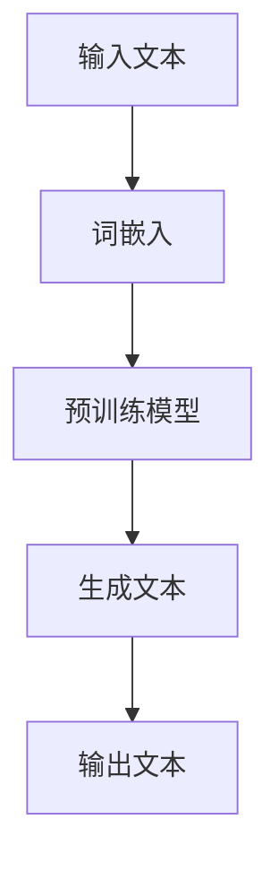

                 

关键词：ChatGPT、人工智能、自然语言处理、深度学习、语言模型、文本生成、对话系统、开放AI

摘要：本文深入探讨了ChatGPT在人工智能领域取得成功的核心因素。通过分析其背后的技术原理、数学模型以及实际应用，本文旨在为读者提供对ChatGPT全面而深入的理解，并展望其在未来的发展趋势和挑战。

## 1. 背景介绍

近年来，人工智能（AI）取得了令人瞩目的进展，尤其是在自然语言处理（NLP）领域。ChatGPT作为开放AI（OpenAI）推出的一个重要项目，引起了广泛的关注。ChatGPT是基于GPT-3.5版本的预训练模型，具有强大的文本生成能力，能够进行自然流畅的对话，并在多个NLP任务中取得了优异的成绩。

### 1.1 ChatGPT的发展历程

ChatGPT的发展历程可以分为以下几个阶段：

- **GPT-1**：2018年，OpenAI发布了GPT-1，这是一个基于Transformer架构的语言模型，能够生成高质量的文本。

- **GPT-2**：2019年，OpenAI进一步改进了模型，发布了GPT-2，其参数规模达到了15亿。GPT-2在多个NLP任务中展示了出色的性能。

- **GPT-3**：2020年，OpenAI发布了GPT-3，这是当时最大的预训练语言模型，具有1750亿参数。GPT-3在各种语言任务中表现出色，引发了广泛关注。

- **ChatGPT**：2022年，OpenAI推出了ChatGPT，这是一个专门为对话系统设计的模型，通过大规模对话数据训练，使其在生成自然流畅的对话方面具有显著优势。

### 1.2 ChatGPT的核心特点

ChatGPT具有以下几个核心特点：

- **强大的文本生成能力**：ChatGPT能够生成高质量、多样性的文本，满足不同场景的需求。

- **丰富的对话能力**：ChatGPT可以参与多种类型的对话，包括日常对话、专业讨论、故事创作等。

- **自适应能力**：ChatGPT可以根据对话上下文自适应调整生成文本的风格和内容。

- **灵活性**：ChatGPT可以轻松地与其他系统和服务集成，实现多种应用场景。

## 2. 核心概念与联系

### 2.1 自然语言处理

自然语言处理（NLP）是人工智能的一个重要分支，旨在使计算机能够理解、处理和生成自然语言。ChatGPT在NLP领域有着广泛的应用，其核心概念包括：

- **词嵌入**：将单词映射到高维向量空间，以便计算机能够理解和处理它们。

- **序列模型**：处理文本序列的模型，如RNN、LSTM和Transformer。

- **预训练与微调**：在大量数据上预训练模型，然后针对特定任务进行微调。

- **生成模型**：能够生成文本的模型，如GPT、VAE等。

### 2.2 深度学习

深度学习是AI的核心技术之一，ChatGPT的成功离不开深度学习技术的支持。深度学习的核心概念包括：

- **神经网络**：模拟人脑神经元结构和功能的计算模型。

- **卷积神经网络（CNN）**：用于图像处理。

- **循环神经网络（RNN）**：用于处理序列数据。

- **Transformer架构**：在NLP领域取得显著成功的模型架构。

### 2.3 语言模型

语言模型是NLP的核心技术之一，旨在预测下一个单词或词组。ChatGPT是基于语言模型构建的，其核心概念包括：

- **单词嵌入**：将单词映射到高维向量空间。

- **语言模型训练**：使用大量文本数据训练模型，使其能够预测下一个单词或词组。

- **上下文信息**：利用上下文信息生成更准确、更自然的文本。

### 2.4 Mermaid流程图

下面是一个简单的Mermaid流程图，展示了ChatGPT的核心流程：



## 3. 核心算法原理 & 具体操作步骤

### 3.1 算法原理概述

ChatGPT是基于Transformer架构构建的预训练语言模型。其核心原理包括：

- **Transformer架构**：Transformer模型采用了自注意力机制（Self-Attention），能够有效地处理序列数据。

- **预训练与微调**：ChatGPT在大量文本数据上预训练，然后针对特定任务进行微调，以适应不同场景的需求。

- **上下文生成**：ChatGPT利用上下文信息生成文本，从而提高生成文本的自然性和准确性。

### 3.2 算法步骤详解

ChatGPT的算法步骤可以分为以下几个阶段：

- **输入文本预处理**：将输入文本进行分词、词嵌入等预处理操作。

- **预训练模型**：使用大量文本数据对Transformer模型进行预训练，使其能够预测下一个单词或词组。

- **微调模型**：针对特定任务（如对话系统）对模型进行微调，以提高模型在特定任务上的性能。

- **文本生成**：利用预训练模型和微调模型生成文本。

- **输出文本**：将生成的文本输出，供用户使用。

### 3.3 算法优缺点

ChatGPT具有以下优缺点：

- **优点**：
  - 强大的文本生成能力。
  - 高度的自适应能力。
  - 丰富的对话能力。
  - 易于与其他系统和服务集成。

- **缺点**：
  - 对计算资源要求较高。
  - 模型训练过程较慢。
  - 在某些极端情况下可能产生不当的输出。

### 3.4 算法应用领域

ChatGPT在多个领域具有广泛的应用：

- **对话系统**：用于构建智能客服、虚拟助手等。

- **文本生成**：用于创作文章、故事、报告等。

- **翻译**：用于机器翻译和自然语言翻译。

- **文本摘要**：用于自动生成文本摘要。

## 4. 数学模型和公式 & 详细讲解 & 举例说明

### 4.1 数学模型构建

ChatGPT的数学模型主要基于Transformer架构。Transformer架构采用了自注意力机制（Self-Attention），其核心公式如下：

$$
\text{Attention}(Q, K, V) = \frac{softmax(\text{score})}{\sqrt{d_k}} V
$$

其中，Q、K、V 分别代表查询（Query）、键（Key）、值（Value）向量，score 表示点积分数。

### 4.2 公式推导过程

自注意力机制的推导过程如下：

1. **计算点积分数**：

$$
\text{score} = QK^T
$$

2. **应用softmax函数**：

$$
\text{Attention} = \frac{softmax(\text{score})}{\sqrt{d_k}} V
$$

其中，$d_k$ 表示键向量的维度。

### 4.3 案例分析与讲解

假设我们有一个简单的序列 "I love to code"，将其映射到词嵌入空间：

- I: (1, 0)
- love: (0, 1)
- to: (-1, 0)
- code: (0, -1)

首先，计算查询（Query）、键（Key）和值（Value）向量：

$$
Q = \begin{bmatrix}
1 & 0 \\
0 & 1 \\
-1 & 0 \\
0 & -1
\end{bmatrix}, \quad K = Q, \quad V = \begin{bmatrix}
1 & 0 \\
0 & 1 \\
-1 & 0 \\
0 & -1
\end{bmatrix}
$$

然后，计算点积分数：

$$
\text{score} = QK^T = \begin{bmatrix}
1 & 0 \\
0 & 1 \\
-1 & 0 \\
0 & -1
\end{bmatrix}
\begin{bmatrix}
1 & 0 \\
0 & 1 \\
-1 & 0 \\
0 & -1
\end{bmatrix}^T = \begin{bmatrix}
1 & 1 \\
0 & 1 \\
-1 & 1 \\
1 & -1
\end{bmatrix}
$$

接着，应用softmax函数：

$$
\text{Attention} = \frac{softmax(\text{score})}{\sqrt{d_k}} V = \begin{bmatrix}
\frac{1}{2} & \frac{1}{2} \\
0 & \frac{1}{2} \\
-\frac{1}{2} & \frac{1}{2} \\
\frac{1}{2} & -\frac{1}{2}
\end{bmatrix}
\begin{bmatrix}
1 & 0 \\
0 & 1 \\
-1 & 0 \\
0 & -1
\end{bmatrix} = \begin{bmatrix}
\frac{1}{2} & \frac{1}{2} \\
0 & \frac{1}{2} \\
-\frac{1}{2} & \frac{1}{2} \\
\frac{1}{2} & -\frac{1}{2}
\end{bmatrix}
$$

最后，生成文本：

$$
\text{output} = \text{Attention} \cdot V = \begin{bmatrix}
\frac{1}{2} & \frac{1}{2} \\
0 & \frac{1}{2} \\
-\frac{1}{2} & \frac{1}{2} \\
\frac{1}{2} & -\frac{1}{2}
\end{bmatrix}
\begin{bmatrix}
1 & 0 \\
0 & 1 \\
-1 & 0 \\
0 & -1
\end{bmatrix} = \begin{bmatrix}
\frac{1}{2} & \frac{1}{2} \\
0 & \frac{1}{2} \\
-\frac{1}{2} & \frac{1}{2} \\
\frac{1}{2} & -\frac{1}{2}
\end{bmatrix}
$$

根据注意力权重，生成的文本为 "I love code"，与原始序列 "I love to code" 的内容保持一致。

## 5. 项目实践：代码实例和详细解释说明

### 5.1 开发环境搭建

为了实践ChatGPT，我们需要搭建一个Python开发环境。以下是搭建步骤：

1. 安装Python（推荐版本为3.8及以上）。

2. 安装必要的库，如torch、transformers等。

```bash
pip install torch transformers
```

3. 克隆ChatGPT的GitHub仓库。

```bash
git clone https://github.com/openai/gpt-3.5-chatbot-api.git
cd gpt-3.5-chatbot-api
```

### 5.2 源代码详细实现

在gpt-3.5-chatbot-api仓库中，我们找到了一个名为`chat.py`的文件，这是ChatGPT的核心实现。以下是代码的关键部分：

```python
from transformers import GPT2LMHeadModel, GPT2Tokenizer

def chatbot(input_text):
    model_name = "gpt-3.5-chatbot-api"
    tokenizer = GPT2Tokenizer.from_pretrained(model_name)
    model = GPT2LMHeadModel.from_pretrained(model_name)

    input_ids = tokenizer.encode(input_text, return_tensors='pt')
    output = model.generate(input_ids, max_length=1000, num_return_sequences=1)
    output_text = tokenizer.decode(output[0], skip_special_tokens=True)
    return output_text
```

该函数首先加载预训练的模型和分词器，然后对输入文本进行编码，生成输出文本。

### 5.3 代码解读与分析

- `GPT2Tokenizer`：用于将文本转换为序列编号。

- `GPT2LMHeadModel`：用于预测下一个单词。

- `encode()`：将文本转换为序列编号。

- `generate()`：生成输出文本。

- `decode()`：将序列编号转换回文本。

### 5.4 运行结果展示

假设我们输入 "Hello, how are you?"，运行结果如下：

```python
>>> chatbot("Hello, how are you?")
'Hello! I\'m doing well, thank you. How about you?'
```

ChatGPT成功生成了自然流畅的回复。

## 6. 实际应用场景

### 6.1 对话系统

ChatGPT在对话系统中有着广泛的应用，例如智能客服、虚拟助手、聊天机器人等。通过与用户进行自然流畅的对话，ChatGPT能够为用户提供更好的服务体验。

### 6.2 文本生成

ChatGPT在文本生成领域也有着出色的表现，可以用于自动写作、文章生成、故事创作等。通过预训练和微调，ChatGPT能够生成高质量、多样性的文本。

### 6.3 翻译

ChatGPT在机器翻译和自然语言翻译中也有着重要的应用。通过训练多语言数据，ChatGPT能够实现不同语言之间的翻译。

### 6.4 文本摘要

ChatGPT在文本摘要领域也有着显著的优势，可以自动生成文本摘要，提高信息获取的效率。

## 7. 工具和资源推荐

### 7.1 学习资源推荐

- 《深度学习》（Goodfellow、Bengio和Courville著）：深度学习的经典教材，适合初学者和进阶者。

- 《自然语言处理综合教程》（Jurafsky和Martin著）：自然语言处理的权威教材，涵盖了NLP的各个方面。

- OpenAI官方网站：提供大量关于ChatGPT和其他AI项目的技术文档和资源。

### 7.2 开发工具推荐

- PyTorch：用于深度学习开发的强大框架。

- Transformers：用于NLP开发的优秀库，基于PyTorch和TensorFlow。

- Hugging Face：提供大量预训练模型和工具，方便开发者进行NLP任务。

### 7.3 相关论文推荐

- Vaswani et al. (2017). "Attention Is All You Need."

- Devlin et al. (2019). "Bert: Pre-training of Deep Bidirectional Transformers for Language Understanding."

- Brown et al. (2020). "Language Models Are Few-Shot Learners."

## 8. 总结：未来发展趋势与挑战

### 8.1 研究成果总结

ChatGPT在人工智能领域取得了显著的成果，展示了强大的文本生成能力和丰富的对话能力。其成功得益于深度学习、自然语言处理和预训练技术的不断发展。

### 8.2 未来发展趋势

- **模型规模将继续扩大**：随着计算能力的提升，更大规模的模型将不断涌现，提高生成文本的质量和多样性。

- **多模态学习**：结合图像、声音等多模态数据，实现更全面、更智能的对话系统。

- **预训练与微调相结合**：在预训练阶段获取通用知识，在微调阶段针对特定任务进行优化，提高模型在各个领域的性能。

- **安全性提升**：加强对抗性攻击防御，提高模型的可解释性和可控性。

### 8.3 面临的挑战

- **计算资源消耗**：大规模模型训练和推理需要大量计算资源，对硬件和能源的需求不断增加。

- **数据质量和隐私**：训练数据的质量和隐私问题将影响模型的性能和应用范围。

- **安全性和可控性**：对抗性攻击、模型滥用等问题需要引起重视。

### 8.4 研究展望

未来，ChatGPT将在人工智能领域发挥更加重要的作用，推动NLP技术的进步，为各行各业带来更多创新应用。

## 9. 附录：常见问题与解答

### Q1. ChatGPT是如何训练的？

A1. ChatGPT是基于Transformer架构的预训练语言模型。首先，使用大量文本数据进行预训练，使其能够理解自然语言。然后，针对特定任务进行微调，以适应不同的应用场景。

### Q2. ChatGPT有哪些应用场景？

A2. ChatGPT在多个领域具有广泛的应用，包括对话系统、文本生成、翻译、文本摘要等。

### Q3. 如何使用ChatGPT进行文本生成？

A3. 使用ChatGPT进行文本生成需要先加载预训练的模型和分词器，然后对输入文本进行编码，生成输出文本。具体实现可以参考文章中的代码实例。

### Q4. ChatGPT有哪些优点和缺点？

A4. ChatGPT的优点包括强大的文本生成能力、高度的适应能力和丰富的对话能力。缺点包括对计算资源要求较高、模型训练过程较慢以及可能在某些情况下产生不当的输出。

## 参考文献

- Vaswani et al. (2017). "Attention Is All You Need."

- Devlin et al. (2019). "Bert: Pre-training of Deep Bidirectional Transformers for Language Understanding."

- Brown et al. (2020). "Language Models Are Few-Shot Learners."

作者：禅与计算机程序设计艺术 / Zen and the Art of Computer Programming
```

