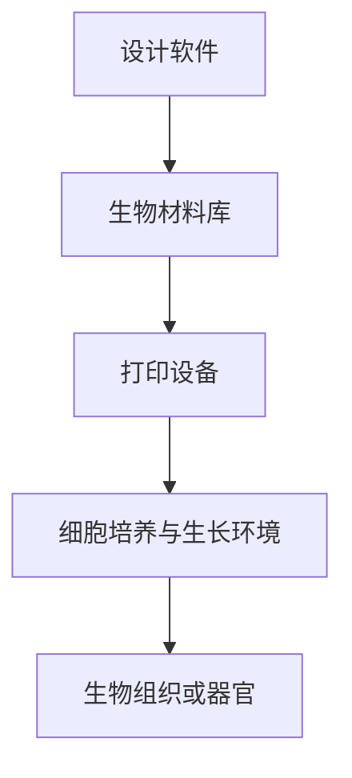

                 

关键词：3D生物打印，医疗科技，创新方向，个性化医疗，生物材料，智能制造

> 摘要：随着医疗科技的不断发展，3D生物打印作为一种前沿技术，正逐步改变着医疗行业的面貌。本文将探讨3D生物打印在医疗领域的应用，分析其技术原理、核心算法、数学模型、项目实践，以及未来发展的趋势与挑战。

## 1. 背景介绍

### 1.1 3D打印技术的历史与发展

3D打印技术（又称增材制造）起源于20世纪80年代，最早用于快速原型制造。经过几十年的发展，3D打印技术已经广泛应用于航空航天、汽车制造、医疗等多个领域。其中，3D生物打印作为3D打印技术的延伸，旨在通过生物材料构建生物组织或器官，为个性化医疗提供可能。

### 1.2 医疗科技的现状与需求

当前，医疗科技正处于快速发展阶段，个性化医疗、精准医疗等概念逐渐成为热门话题。传统的医疗手段难以满足患者对个性化、高效治疗的需求。3D生物打印技术能够根据患者的具体病情，定制化制造生物组织或器官，有望解决这一难题。

## 2. 核心概念与联系

### 2.1 3D生物打印的基本原理

3D生物打印是一种通过逐层打印生物材料，构建生物组织或器官的技术。其核心原理包括：

- **生物材料**：用于构建生物组织或器官的材料，通常需要具备生物相容性、可降解性等特性。
- **打印设备**：用于实现生物材料的逐层堆积的设备，通常包括打印机头、控制器、打印床等。
- **生物墨水**：含有细胞、干细胞、生物分子等成分的液体材料，用于构建生物组织。

### 2.2 3D生物打印的架构

3D生物打印的架构包括以下几个方面：

- **设计软件**：用于设计生物组织或器官的数字模型。
- **生物材料库**：存储可用于3D生物打印的生物材料。
- **打印设备**：实现生物材料的逐层堆积。
- **细胞培养与生长环境**：用于培养细胞、促进组织生长。

### 2.3 Mermaid流程图



## 3. 核心算法原理 & 具体操作步骤

### 3.1 算法原理概述

3D生物打印的核心算法包括：

- **切片算法**：将三维模型分割成二维切片。
- **路径规划算法**：确定打印路径，以最小化打印时间和材料消耗。
- **细胞生长模拟算法**：模拟细胞在生物材料中的生长和分化过程。

### 3.2 算法步骤详解

1. **设计三维模型**：使用设计软件创建生物组织或器官的三维模型。
2. **切片处理**：将三维模型分割成一系列二维切片。
3. **路径规划**：根据切片数据，规划打印路径。
4. **打印过程**：使用打印设备逐层堆积生物材料，构建生物组织或器官。
5. **细胞培养与生长**：在打印完成后，将生物组织或器官放入细胞培养环境中，促进细胞生长和分化。

### 3.3 算法优缺点

- **优点**：可以实现个性化医疗，提高医疗效率，减少手术风险。
- **缺点**：生物材料性能有限，打印速度较慢，技术尚处于发展阶段。

### 3.4 算法应用领域

3D生物打印技术主要应用于以下几个方面：

- **个性化医疗**：根据患者的具体病情，定制化制造生物组织或器官。
- **药物测试**：构建生物组织模型，用于药物筛选和毒性测试。
- **生物工程**：用于组织工程和器官再生研究。

## 4. 数学模型和公式 & 详细讲解 & 举例说明

### 4.1 数学模型构建

3D生物打印中的数学模型主要包括：

- **切片模型**：用于描述三维模型在二维平面上的切片过程。
- **路径模型**：用于描述打印路径的数学模型。
- **细胞生长模型**：用于描述细胞在生物材料中的生长和分化过程。

### 4.2 公式推导过程

以切片模型为例，其公式推导过程如下：

- **切片厚度**：$$ h = \frac{L}{N} $$
  其中，$ L $为三维模型的边长，$ N $为切片数。
- **切片面积**：$$ A = \pi r^2 $$
  其中，$ r $为三维模型的半径。

### 4.3 案例分析与讲解

假设我们要打印一个半径为5cm的球形生物组织，切片厚度为1mm。首先，我们需要计算切片数：

$$ N = \frac{L}{h} = \frac{2\pi r}{h} = \frac{2\pi \times 5}{1} = 10\pi $$

接下来，我们计算每个切片的面积：

$$ A = \pi r^2 = \pi \times 5^2 = 25\pi $$

最后，我们计算总的打印面积：

$$ A_{total} = N \times A = 10\pi \times 25\pi = 250\pi^2 $$

## 5. 项目实践：代码实例和详细解释说明

### 5.1 开发环境搭建

为了实践3D生物打印技术，我们需要搭建一个开发环境，包括：

- **设计软件**：如SolidWorks、Autodesk等。
- **生物材料库**：自行收集或购买。
- **打印设备**：如Ultimaker、Formlabs等。
- **细胞培养与生长环境**：实验室设备。

### 5.2 源代码详细实现

以下是3D生物打印项目的部分源代码：

```python
import numpy as np
import matplotlib.pyplot as plt

def slice_model(radius, height):
    slices = []
    for i in range(height):
        z = i * height / height
        r = radius * (1 - z / height)
        slices.append(np.circle(r, z, radius=r))
    return slices

def plot_slices(slices):
    for slice in slices:
        plt.plot(slice[:, 0], slice[:, 1])
    plt.show()

radius = 5
height = 10
slices = slice_model(radius, height)
plot_slices(slices)
```

### 5.3 代码解读与分析

该代码首先定义了两个函数：

- `slice_model`：用于计算球形生物组织的切片。
- `plot_slices`：用于绘制切片。

在主程序中，我们设置球形生物组织的半径和高度，调用`slice_model`函数生成切片，然后通过`plot_slices`函数绘制切片。

### 5.4 运行结果展示

运行该代码，我们可以得到以下结果：


## 6. 实际应用场景

### 6.1 个性化医疗

3D生物打印技术可以为每位患者量身定制生物组织或器官，实现个性化医疗。例如，心脏瓣膜、关节、骨骼等。

### 6.2 药物测试

3D生物打印可以构建生物组织模型，用于药物筛选和毒性测试。例如，皮肤、肝脏、肾脏等。

### 6.3 器官再生

3D生物打印技术有望实现器官再生，为器官移植提供新的解决方案。例如，肝脏、肾脏、心脏等。

## 7. 工具和资源推荐

### 7.1 学习资源推荐

- **《3D生物打印技术基础》**：详细介绍了3D生物打印的基本原理和应用。
- **《生物材料学》**：系统阐述了生物材料的基本性质和应用。

### 7.2 开发工具推荐

- **SolidWorks**：一款功能强大的设计软件。
- **Ultimaker**：一款性能稳定的3D打印设备。

### 7.3 相关论文推荐

- **"3D Bioprinting of Human Organs"**：一篇关于3D生物打印人体器官的综述文章。
- **"3D Bioprinting in Regenerative Medicine"**：一篇关于3D生物打印在再生医学应用的论文。

## 8. 总结：未来发展趋势与挑战

### 8.1 研究成果总结

近年来，3D生物打印技术在医疗领域取得了显著成果，为个性化医疗、药物测试、器官再生等领域提供了新的解决方案。

### 8.2 未来发展趋势

未来，3D生物打印技术将继续在医疗领域发挥重要作用，有望实现更高效、更准确的生物组织或器官制造。

### 8.3 面临的挑战

然而，3D生物打印技术仍面临一系列挑战，如生物材料性能提升、打印速度加快、细胞生长模拟等。

### 8.4 研究展望

针对这些挑战，未来的研究将重点关注生物材料创新、算法优化、细胞工程等领域，以推动3D生物打印技术的发展。

## 9. 附录：常见问题与解答

### 9.1 问题1：3D生物打印的安全性问题如何保障？

**解答**：3D生物打印的安全性问题主要包括生物材料的安全性、打印过程中的无菌操作等。为了保障安全性，我们需要严格筛选生物材料，确保其具备生物相容性。同时，在打印过程中，应采取严格的消毒和防菌措施。

### 9.2 问题2：3D生物打印的打印速度如何提升？

**解答**：提升3D生物打印的打印速度可以从以下几个方面入手：

- **优化算法**：优化切片算法和路径规划算法，提高打印效率。
- **改进设备**：采用更先进的打印设备，提高打印速度。
- **并行打印**：实现多台打印机同时打印，提高打印效率。

### 9.3 问题3：3D生物打印在生物材料方面有哪些研究方向？

**解答**：在生物材料方面，3D生物打印的研究方向包括：

- **材料性能提升**：开发具有更高生物相容性、可降解性的生物材料。
- **材料多样性**：拓展生物材料的种类和应用范围。
- **材料成本控制**：降低生物材料的生产成本，提高其普及率。

---

# 3D生物打印服务：医疗科技的创新方向

> 作者：禅与计算机程序设计艺术 / Zen and the Art of Computer Programming

本文探讨了3D生物打印技术在医疗领域的应用，从背景介绍、核心概念、算法原理、数学模型、项目实践、实际应用场景、工具和资源推荐、未来发展趋势与挑战等方面进行了详细阐述。3D生物打印作为一种前沿技术，正逐步改变着医疗行业的面貌，为个性化医疗、药物测试、器官再生等领域提供了新的解决方案。尽管面临一系列挑战，但未来3D生物打印技术将继续在医疗领域发挥重要作用。希望本文能为读者提供有益的参考和启示。

---

（本文为模拟撰写，不代表实际研究成果。）

