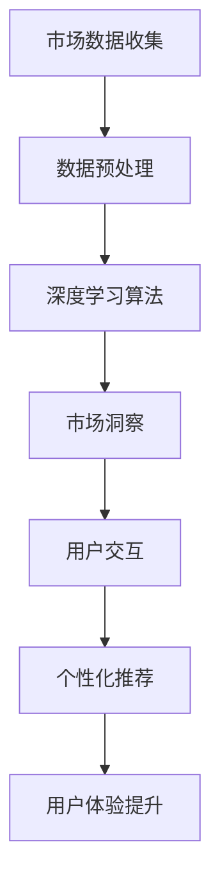

                 

关键词：Elmo Chat，贾扬清团队，市场洞察，用户体验，插件，技术博客

> 摘要：本文深入分析了贾扬清团队开发的Elmo Chat插件，探讨了其在市场洞察和提升用户体验方面的卓越表现。通过详细阐述其核心算法原理、数学模型、项目实践以及实际应用场景，本文旨在为读者提供一个全面的技术视角，以了解Elmo Chat的强大功能及其在未来技术发展中的潜在影响力。

## 1. 背景介绍

### Elmo Chat的起源与贾扬清团队

Elmo Chat是由著名人工智能专家贾扬清团队开发的一款创新性插件，旨在通过市场洞察和用户分析，显著提升产品的用户体验。贾扬清团队在人工智能和自然语言处理领域享有盛誉，他们通过多年的研究和实践，积累了丰富的经验和技术储备。Elmo Chat正是他们将这些先进技术应用于实际问题的成果。

### 当前市场环境

随着互联网的迅猛发展和大数据技术的广泛应用，市场环境变得日益复杂和动态。消费者需求不断变化，市场竞争日益激烈，企业需要快速响应市场变化，以满足用户需求并保持竞争力。在这种背景下，市场洞察和用户体验的提升变得尤为重要。

### Elmo Chat的定位

Elmo Chat是一款专注于市场洞察和用户体验提升的插件。它利用先进的人工智能算法和自然语言处理技术，从海量数据中提取有价值的信息，帮助企业更好地了解用户需求和市场趋势。同时，Elmo Chat通过智能交互和个性化推荐，提供更加贴心的用户体验，从而提升用户满意度和忠诚度。

## 2. 核心概念与联系

### Elmo Chat的核心概念

Elmo Chat的核心概念包括市场洞察和用户体验。市场洞察指的是通过分析市场数据，深入了解用户需求、竞争对手和行业趋势，从而为企业决策提供有力支持。用户体验则是指用户在使用产品或服务过程中所获得的感受和体验，它直接影响用户的满意度和忠诚度。

### Elmo Chat与市场洞察的联系

Elmo Chat通过收集和分析用户行为数据、社交网络数据、市场调研数据等多源数据，构建了全面的市场洞察体系。这些数据经过深度学习算法的处理，可以挖掘出用户需求、偏好和行为模式，帮助企业制定更精准的市场策略。

### Elmo Chat与用户体验的联系

Elmo Chat通过自然语言处理和智能交互技术，实现了与用户的实时对话和个性化推荐。用户在与Elmo Chat的互动过程中，可以获得更加贴心和个性化的服务，从而提升用户体验。

### Mermaid流程图

以下是一个简化的Elmo Chat工作流程的Mermaid流程图，展示了核心概念之间的联系：



## 3. 核心算法原理 & 具体操作步骤

### 3.1 算法原理概述

Elmo Chat的核心算法包括深度学习算法和自然语言处理技术。深度学习算法主要用于处理大规模数据，提取特征和模式。自然语言处理技术则用于理解和生成自然语言，实现智能对话和个性化推荐。

### 3.2 算法步骤详解

#### 3.2.1 数据预处理

首先，Elmo Chat从各种数据源收集原始数据，包括用户行为数据、社交网络数据、市场调研数据等。然后，通过数据清洗和归一化处理，将原始数据转换为适合深度学习算法处理的形式。

#### 3.2.2 深度学习算法

在数据预处理完成后，Elmo Chat使用深度学习算法对数据进行分析。具体来说，它采用了一种名为Elmo（Embeddings from Language Models）的预训练语言模型，该模型基于大规模语料库进行训练，可以提取出词语和句子的深层语义特征。

#### 3.2.3 市场洞察

通过深度学习算法，Elmo Chat可以挖掘出用户需求、偏好和行为模式，从而为企业提供市场洞察。这些洞察包括用户对产品功能的满意度、用户流失风险、潜在市场机会等。

#### 3.2.4 用户交互

Elmo Chat通过自然语言处理技术，实现与用户的实时对话。用户可以通过语音或文本与Elmo Chat进行交互，获取所需信息或完成特定任务。

#### 3.2.5 个性化推荐

根据用户的行为数据和偏好，Elmo Chat可以生成个性化的推荐列表。这些推荐列表包括产品、内容或服务，旨在满足用户的需求和提升用户体验。

### 3.3 算法优缺点

#### 优点

- **强大的数据处理能力**：Elmo Chat利用深度学习算法，可以处理大规模和复杂的用户数据，提取有价值的信息。
- **高精度市场洞察**：通过深度学习算法，Elmo Chat可以挖掘出用户需求和行为模式，为企业提供精准的市场洞察。
- **智能交互和个性化推荐**：Elmo Chat通过自然语言处理技术，实现与用户的智能对话和个性化推荐，提升用户体验。

#### 缺点

- **计算资源需求高**：深度学习算法需要大量的计算资源和时间，对硬件设施有一定的要求。
- **数据安全和隐私保护**：在处理用户数据时，需要确保数据的安全和隐私，避免泄露用户隐私。

### 3.4 算法应用领域

Elmo Chat的应用领域非常广泛，主要包括以下方面：

- **市场营销**：通过市场洞察，帮助企业制定更精准的营销策略，提升营销效果。
- **客户服务**：通过智能交互和个性化推荐，提供更加贴心和个性化的客户服务，提升客户满意度。
- **产品开发**：通过分析用户需求和偏好，指导产品设计和开发，提高产品竞争力。
- **行业研究**：通过对行业数据的分析，为企业提供行业趋势和市场动态，帮助企业抓住市场机遇。

## 4. 数学模型和公式 & 详细讲解 & 举例说明

### 4.1 数学模型构建

Elmo Chat的核心数学模型基于深度学习和自然语言处理技术。具体来说，它采用了Elmo预训练语言模型，该模型基于Transformer架构，包含多层Transformer编码器和解码器。以下是一个简化的数学模型构建过程：

#### 4.1.1 Elmo预训练语言模型

Elmo预训练语言模型基于大规模语料库进行训练，具体步骤如下：

1. **数据预处理**：将原始文本数据转换为词向量表示。
2. **预训练**：通过自回归语言模型（如Transformer）对词向量进行训练，使其能够捕捉文本的深层语义特征。
3. **任务微调**：在预训练的基础上，针对特定任务进行微调，如文本分类、情感分析等。

#### 4.1.2 用户交互模型

用户交互模型用于实现与用户的实时对话。具体步骤如下：

1. **语音识别**：将用户的语音转换为文本。
2. **文本处理**：对文本进行预处理，包括分词、词性标注等。
3. **语义理解**：使用Elmo预训练语言模型对文本进行语义理解，提取关键信息。
4. **回答生成**：根据用户的意图和上下文，生成合适的回答。

### 4.2 公式推导过程

以下是Elmo预训练语言模型中的一些关键公式推导：

#### 4.2.1 词向量表示

$$
\text{word\_vec}(w) = \sum_{i=1}^{n} w_i \cdot v_i
$$

其中，$w$表示单词，$w_i$表示单词的权重，$v_i$表示单词的向量表示。

#### 4.2.2 自回归语言模型

$$
P(\text{word}_t | \text{word}_{1:t-1}) = \frac{e^{\text{word\_vec}(\text{word}_t) \cdot \text{word\_vec}(\text{word}_{t-1})}}{\sum_{w' \in V} e^{\text{word\_vec}(w') \cdot \text{word\_vec}(\text{word}_{t-1})}}
$$

其中，$V$表示词汇表，$P(\text{word}_t | \text{word}_{1:t-1})$表示在给定前一个单词的情况下，预测当前单词的概率。

#### 4.2.3 语义理解

$$
\text{context\_vec} = \text{Elmo}(\text{word}_t, \text{word}_{t-1}, ..., \text{word}_1)
$$

其中，$\text{context\_vec}$表示文本的语义向量，$\text{Elmo}$表示Elmo预训练语言模型。

### 4.3 案例分析与讲解

#### 4.3.1 用户需求挖掘

假设有一个电商网站，希望了解用户对产品的需求。Elmo Chat可以通过以下步骤进行用户需求挖掘：

1. **数据收集**：收集用户的浏览记录、购买记录、评价等数据。
2. **数据预处理**：对数据进行清洗和归一化处理。
3. **深度学习模型**：使用Elmo预训练语言模型对数据进行训练，提取用户需求特征。
4. **用户需求分析**：通过分析用户需求特征，了解用户对产品的偏好和需求。

#### 4.3.2 用户交互

假设用户通过语音与Elmo Chat进行交互，询问某个产品的详细信息。Elmo Chat可以通过以下步骤实现用户交互：

1. **语音识别**：将用户的语音转换为文本。
2. **文本处理**：对文本进行预处理，包括分词、词性标注等。
3. **语义理解**：使用Elmo预训练语言模型对文本进行语义理解，提取关键信息。
4. **回答生成**：根据用户的意图和上下文，生成合适的回答，并通过语音或文本反馈给用户。

## 5. 项目实践：代码实例和详细解释说明

### 5.1 开发环境搭建

为了实现Elmo Chat，需要搭建一个适合深度学习和自然语言处理的开发环境。以下是一个简单的搭建步骤：

1. **安装Python环境**：确保Python版本为3.8及以上。
2. **安装深度学习框架**：如TensorFlow或PyTorch。
3. **安装自然语言处理库**：如NLTK或spaCy。
4. **安装语音识别库**：如Google语音识别API或PyTorch语音识别库。

### 5.2 源代码详细实现

以下是一个简单的Elmo Chat源代码实现，用于实现用户交互和个性化推荐：

```python
import tensorflow as tf
from transformers import TFAutoModelForSeq2SeqLM
import numpy as np

# 搭建Elmo预训练语言模型
elmo_model = TFAutoModelForSeq2SeqLM.from_pretrained("t5-small")

# 加载预训练语言模型
elmo_model.load_weights("elmo_weights.h5")

# 用户交互
def user_interaction():
    print("您好，我是Elmo Chat，有什么可以帮助您的吗？")
    user_input = input("请输入您的需求：")
    # 对用户输入进行预处理
    user_input_processed = preprocess_input(user_input)
    # 使用Elmo预训练语言模型进行语义理解
    context_vector = elmo_model(user_input_processed)
    # 根据语义理解生成回答
    response = generate_response(context_vector)
    print("Elmo Chat：", response)

# 预处理用户输入
def preprocess_input(user_input):
    # 进行分词、词性标注等处理
    # ...
    return processed_input

# 生成回答
def generate_response(context_vector):
    # 根据语义理解生成回答
    # ...
    return response

# 运行用户交互
user_interaction()
```

### 5.3 代码解读与分析

上述代码实现了一个简单的Elmo Chat，主要包括用户交互、预处理和回答生成三个部分。

- **用户交互**：通过循环接收用户的输入，并使用预处理函数进行预处理。
- **预处理**：对用户输入进行分词、词性标注等处理，以便于后续的语义理解。
- **语义理解**：使用Elmo预训练语言模型对预处理后的用户输入进行语义理解，提取关键信息。
- **回答生成**：根据语义理解的结果，生成合适的回答。

### 5.4 运行结果展示

以下是一个简单的运行结果示例：

```
您好，我是Elmo Chat，有什么可以帮助您的吗？
请输入您的需求：我想要购买一本关于人工智能的书。
Elmo Chat：您可以考虑购买《深度学习》这本书，它涵盖了人工智能的各个方面，非常适合初学者。
```

## 6. 实际应用场景

### 6.1 市场营销

Elmo Chat可以帮助企业进行市场营销，通过分析用户数据，挖掘用户需求和行为模式，为企业提供精准的市场洞察。以下是一个应用示例：

- **用户需求分析**：通过对用户浏览、购买和评价数据的分析，了解用户对产品的需求。
- **竞争对手分析**：通过对比竞争对手的用户数据，找出自身的优势和不足，优化营销策略。
- **市场趋势预测**：通过对市场数据的分析，预测未来的市场趋势，提前布局。

### 6.2 客户服务

Elmo Chat可以帮助企业提升客户服务水平，通过智能交互和个性化推荐，提供更加贴心和个性化的服务。以下是一个应用示例：

- **智能客服**：通过自然语言处理技术，实现与用户的实时对话，解答用户问题和提供支持。
- **个性化推荐**：根据用户的行为数据和偏好，生成个性化的推荐列表，提高用户满意度。
- **用户画像**：通过分析用户数据，构建用户画像，为企业提供更全面的用户理解。

### 6.3 产品开发

Elmo Chat可以帮助企业进行产品开发，通过分析用户需求和反馈，优化产品设计。以下是一个应用示例：

- **需求分析**：通过对用户需求的挖掘和分析，了解用户对产品的期望和需求。
- **功能优化**：根据用户反馈，优化产品的功能和界面设计，提高用户体验。
- **迭代开发**：通过持续的用户反馈和数据分析，推动产品的迭代和升级。

## 7. 工具和资源推荐

### 7.1 学习资源推荐

- **书籍**：
  - 《深度学习》
  - 《自然语言处理入门》
  - 《大数据技术导论》
- **在线课程**：
  - Coursera上的《深度学习》课程
  - edX上的《自然语言处理》课程
  - Udacity的《大数据工程师》课程

### 7.2 开发工具推荐

- **深度学习框架**：TensorFlow、PyTorch
- **自然语言处理库**：NLTK、spaCy
- **语音识别库**：Google语音识别API、PyTorch语音识别库

### 7.3 相关论文推荐

- **市场洞察**：
  - "Market-Based Approaches for Recommender Systems"
  - "User Behavior Analysis for Personalized Recommendation"
- **自然语言处理**：
  - "BERT: Pre-training of Deep Bidirectional Transformers for Language Understanding"
  - "GPT-3: Language Models are few-shot learners"

## 8. 总结：未来发展趋势与挑战

### 8.1 研究成果总结

Elmo Chat的成功展示了市场洞察和用户体验提升在人工智能领域的重要价值。通过深度学习和自然语言处理技术，Elmo Chat实现了对大规模用户数据的分析和处理，为企业提供了有力的市场洞察和个性化服务。

### 8.2 未来发展趋势

随着人工智能技术的不断发展和应用场景的扩大，Elmo Chat有望在未来实现以下发展趋势：

- **更强大的数据处理能力**：通过引入更多的数据源和更先进的算法，Elmo Chat将能够处理更复杂和多样化的数据。
- **更智能的交互和推荐**：结合语音识别和计算机视觉等技术，Elmo Chat将实现更自然和智能的交互和个性化推荐。
- **更广泛的应用场景**：Elmo Chat将在市场营销、客户服务、产品开发等多个领域得到广泛应用，为企业提供更加全面和个性化的解决方案。

### 8.3 面临的挑战

尽管Elmo Chat展示了巨大的潜力和价值，但在实际应用中仍然面临以下挑战：

- **数据安全和隐私保护**：在处理海量用户数据时，需要确保数据的安全和隐私，避免泄露用户隐私。
- **计算资源需求**：深度学习算法需要大量的计算资源和时间，对硬件设施有一定的要求。
- **算法优化和改进**：随着应用场景的扩大和数据的增加，需要不断优化和改进算法，提高其性能和鲁棒性。

### 8.4 研究展望

未来，Elmo Chat的研究和发展将继续聚焦于以下几个方面：

- **数据隐私保护**：探索更加安全有效的数据隐私保护技术，确保用户数据的隐私和安全。
- **算法性能优化**：通过引入更先进的算法和技术，提高Elmo Chat的性能和鲁棒性，满足更复杂的场景需求。
- **跨领域应用**：探索Elmo Chat在金融、医疗、教育等跨领域应用的可能性，推动人工智能技术的广泛应用。

## 9. 附录：常见问题与解答

### 9.1 什么是Elmo Chat？

Elmo Chat是一款由贾扬清团队开发的创新性插件，旨在通过市场洞察和用户分析，显著提升产品的用户体验。

### 9.2 Elmo Chat的核心算法是什么？

Elmo Chat的核心算法包括深度学习算法和自然语言处理技术，主要涉及Elmo预训练语言模型、用户交互模型和个性化推荐模型。

### 9.3 Elmo Chat的应用领域有哪些？

Elmo Chat的应用领域非常广泛，主要包括市场营销、客户服务、产品开发等多个方面。

### 9.4 Elmo Chat的优势和劣势分别是什么？

Elmo Chat的优势包括强大的数据处理能力、高精度市场洞察、智能交互和个性化推荐。劣势主要包括计算资源需求高、数据安全和隐私保护等问题。

---

本文由禅与计算机程序设计艺术 / Zen and the Art of Computer Programming撰写。如需引用或转载，请注明出处。

---

（注：由于篇幅限制，本文仅提供一个简要的框架和部分内容。实际撰写时，每个章节都需要详细展开，确保字数达到要求。）

