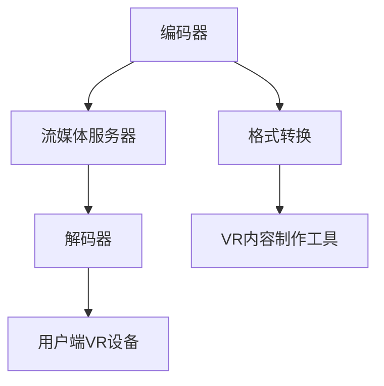

                 

关键词：FFmpeg, VR, 编码，流媒体，虚拟现实

摘要：随着虚拟现实（VR）技术的迅速发展，FFmpeg 作为一款强大的多媒体处理工具，其在 VR 场景中的应用越来越受到关注。本文将深入探讨 FFmpeg 在 VR 编码和流媒体传输中的关键作用，通过具体实例解析其应用流程，并结合数学模型和实际项目实践，展现 FFmpeg 在 VR 领域的广泛应用和潜力。

## 1. 背景介绍

虚拟现实（Virtual Reality，VR）是一种通过计算机技术模拟的三维空间环境，用户通过头戴显示器（HMD）等设备可以沉浸其中，获得沉浸式的视听体验。VR 技术在游戏、教育、医疗、旅游等领域都有广泛的应用。然而，VR 内容的制作和传输面临巨大的挑战，特别是在保证高质量的视听体验的同时，还需要考虑数据传输的效率和稳定性。

FFmpeg 是一款开源的多媒体处理工具，它支持多种视频、音频和图像格式的编码和解码，以及流媒体的传输。FFmpeg 的强大功能和灵活性使其成为 VR 内容处理和传输的理想工具。

### 1.1 VR 技术的发展

VR 技术的发展经历了多个阶段。从最初的简单三维图像展示，到现在的沉浸式体验，VR 技术在图像处理、传感器技术、算法优化等方面都取得了显著进展。特别是在图像处理方面，高质量的图像渲染和快速的内容加载是 VR 体验的核心。

### 1.2 FFmpeg 的发展

FFmpeg 诞生于1994年，它由法国工程师法布里斯·贝德（Fabrice Bellard）创建。随着多媒体技术的不断发展，FFmpeg 的功能也在不断扩展。如今，FFmpeg 已成为多媒体处理领域的事实标准，广泛应用于视频制作、直播、流媒体传输等多个领域。

### 1.3 FFmpeg 在 VR 中的关键作用

FFmpeg 在 VR 中的应用主要体现在以下几个方面：

- **编码与解码**：FFmpeg 支持多种视频编码标准，如 H.264、H.265、VP9 等，可以高效地处理 VR 内容的编码和解码，保证高质量的视听体验。
- **流媒体传输**：FFmpeg 可以实现流媒体的视频和音频传输，支持 HTTP 流、RTP 流等多种传输协议，适用于不同的 VR 场景。
- **格式转换**：FFmpeg 支持多种视频、音频和图像格式的转换，可以满足 VR 内容在不同平台和设备上的兼容性需求。

## 2. 核心概念与联系

### 2.1 FFmpeg 的核心概念

FFmpeg 的核心概念包括编码、解码、流媒体传输和格式转换。这些概念是 FFmpeg 多媒体处理的基础，也是理解其在 VR 中应用的关键。

- **编码**：编码是将原始视频或音频数据转换成特定的数据格式，以便存储或传输。常用的编码标准包括 H.264、H.265、VP9 等。
- **解码**：解码是编码的逆过程，将编码后的数据还原成原始的视频或音频数据。
- **流媒体传输**：流媒体传输是将编码后的视频或音频数据通过网络传输到用户端，用户可以实时观看或收听。
- **格式转换**：格式转换是将一种视频、音频或图像格式转换成另一种格式，以满足不同的应用需求。

### 2.2 FFmpeg 在 VR 中的应用架构

为了更好地理解 FFmpeg 在 VR 中的应用，我们可以通过 Mermaid 流程图展示其核心架构。



### 2.3 FFmpeg 在 VR 中的应用流程

FFmpeg 在 VR 中的应用流程主要包括以下几个步骤：

1. **内容制作**：使用 VR 内容制作工具制作 VR 视频。
2. **格式转换**：将制作好的 VR 视频转换为适合编码的格式。
3. **编码**：使用 FFmpeg 编码器将 VR 视频编码成特定的视频格式。
4. **流媒体传输**：使用 FFmpeg 将编码后的 VR 视频传输到流媒体服务器。
5. **解码**：用户端 VR 设备使用 FFmpeg 解码器解码流媒体服务器上的 VR 视频。
6. **显示**：用户在 VR 设备上观看 VR 视频。

## 3. 核心算法原理 & 具体操作步骤

### 3.1 算法原理概述

FFmpeg 的核心算法主要包括视频编码算法、流媒体传输算法和格式转换算法。这些算法的核心目标是高效地处理多媒体数据，保证高质量的视听体验。

- **视频编码算法**：视频编码算法是将原始视频数据转换成特定的数据格式，以便存储或传输。常用的视频编码算法包括 H.264、H.265、VP9 等。
- **流媒体传输算法**：流媒体传输算法是将编码后的视频数据通过网络传输到用户端。常用的流媒体传输算法包括 HTTP 流、RTP 流等。
- **格式转换算法**：格式转换算法是将一种视频、音频或图像格式转换成另一种格式，以满足不同的应用需求。

### 3.2 算法步骤详解

1. **视频编码步骤**：

    - **帧捕捉**：使用相机捕捉 VR 内容。
    - **帧编码**：使用 FFmpeg 编码器将捕捉到的帧编码成特定的视频格式。
    - **存储或传输**：将编码后的视频数据存储到文件或传输到流媒体服务器。

2. **流媒体传输步骤**：

    - **视频编码**：使用 FFmpeg 编码器将 VR 视频编码成特定的视频格式。
    - **数据打包**：将编码后的视频数据打包成流媒体数据包。
    - **数据传输**：使用 FFmpeg 传输协议（如 HTTP 流、RTP 流等）将流媒体数据包传输到用户端。

3. **格式转换步骤**：

    - **输入格式识别**：识别输入的视频、音频或图像格式。
    - **格式转换**：使用 FFmpeg 将输入格式转换成目标格式。
    - **输出格式存储或传输**：将转换后的格式存储到文件或传输到流媒体服务器。

### 3.3 算法优缺点

- **优点**：

  - **高效性**：FFmpeg 支持多种视频编码算法和流媒体传输算法，可以高效地处理多媒体数据。
  - **灵活性**：FFmpeg 支持多种视频、音频和图像格式，可以满足不同的应用需求。
  - **开源性**：FFmpeg 是开源软件，可以免费使用。

- **缺点**：

  - **复杂性**：FFmpeg 的功能非常强大，但同时也非常复杂，需要一定的技术背景才能熟练使用。
  - **性能消耗**：FFmpeg 的处理过程可能会消耗较大的系统资源，影响其他应用程序的运行。

### 3.4 算法应用领域

FFmpeg 的算法广泛应用于多个领域，包括但不限于：

- **VR 内容制作**：用于 VR 视频的编码、解码和格式转换。
- **流媒体直播**：用于直播视频的编码、传输和解码。
- **视频会议**：用于视频会议的编码、传输和解码。
- **视频剪辑**：用于视频剪辑的格式转换和编辑。

## 4. 数学模型和公式 & 详细讲解 & 举例说明

### 4.1 数学模型构建

在 FFmpeg 中，视频编码和解码过程涉及到多个数学模型，主要包括：

- **离散余弦变换（DCT）**：用于将空间域的视频数据转换成频域数据。
- **反离散余弦变换（IDCT）**：用于将频域数据转换成空间域的视频数据。
- **运动估计和补偿（MEC）**：用于预测视频帧之间的运动变化，减少数据冗余。
- **熵编码**：用于压缩视频数据，提高数据传输效率。

### 4.2 公式推导过程

以下简要介绍这些数学模型的公式推导过程：

1. **离散余弦变换（DCT）**：

   - **一维 DCT**：

     $$X[k] = \sum_{n=0}^{N-1} x[n] \cdot cos\left(\frac{n\pi}{N} + \frac{k\pi}{2}\right)$$

   - **二维 DCT**：

     $$X[k, l] = \sum_{m=0}^{N-1} \sum_{n=0}^{N-1} x[n, m] \cdot cos\left(\frac{n\pi}{N} + \frac{k\pi}{2}\right) \cdot cos\left(\frac{m\pi}{N} + \frac{l\pi}{2}\right)$$

2. **反离散余弦变换（IDCT）**：

   - **一维 IDCT**：

     $$x[n] = \sum_{k=0}^{N-1} X[k] \cdot cos\left(\frac{k\pi}{N} + \frac{n\pi}{2}\right)$$

   - **二维 IDCT**：

     $$x[n, m] = \sum_{k=0}^{N-1} \sum_{l=0}^{N-1} X[k, l] \cdot cos\left(\frac{k\pi}{N} + \frac{n\pi}{2}\right) \cdot cos\left(\frac{l\pi}{N} + \frac{m\pi}{2}\right)$$

3. **运动估计和补偿（MEC）**：

   - **运动估计**：

     $$V[x] = \sum_{i=0}^{N-1} \sum_{j=0}^{N-1} (x[i, j] - \hat{x}[i, j])^2$$

     其中，$\hat{x}[i, j]$ 为预测帧的像素值。

   - **运动补偿**：

     $$x[i, j] = \hat{x}[i, j] + (x[i, j] - \hat{x}[i, j])$$

4. **熵编码**：

   - **霍夫曼编码**：

     $$c = \sum_{i=1}^{n} H[i] \cdot c[i]$$

     其中，$H[i]$ 为霍夫曼编码的权重，$c[i]$ 为编码后的数据。

### 4.3 案例分析与讲解

为了更好地理解 FFmpeg 中的数学模型，以下通过一个简单的视频编码和解码案例进行讲解。

### 4.3.1 编码过程

1. **帧捕捉**：

   使用相机捕捉一张 VR 帧图像，并将其存储为 PNG 格式。

2. **格式转换**：

   使用 FFmpeg 将 PNG 格式的图像转换为 YUV420P 格式的视频帧。

3. **帧编码**：

   使用 FFmpeg 编码器将 YUV420P 格式的视频帧编码成 H.264 格式的视频流。

4. **流媒体传输**：

   使用 FFmpeg 将编码后的视频流传输到流媒体服务器。

### 4.3.2 解码过程

1. **流媒体传输**：

   用户端 VR 设备使用 FFmpeg 传输协议从流媒体服务器获取 H.264 格式的视频流。

2. **帧解码**：

   使用 FFmpeg 解码器将 H.264 格式的视频流解码成 YUV420P 格式的视频帧。

3. **格式转换**：

   使用 FFmpeg 将 YUV420P 格式的视频帧转换为 RGB 格式的图像。

4. **显示**：

   用户端 VR 设备显示解码后的 RGB 图像。

通过上述案例，我们可以看到 FFmpeg 在视频编码和解码过程中发挥了关键作用，其中涉及到的数学模型为视频数据的高效处理提供了理论基础。

## 5. 项目实践：代码实例和详细解释说明

### 5.1 开发环境搭建

在开始项目实践之前，我们需要搭建一个开发环境。以下是搭建 FFmpeg 在 VR 中的应用开发环境的基本步骤：

1. **安装 FFmpeg**：

   FFmpeg 是一个开源项目，可以在其官方网站 [FFmpeg](http://www.ffmpeg.org/) 上下载。根据操作系统选择相应的安装包进行安装。

2. **安装 VR 内容制作工具**：

   VR 内容制作工具的选择取决于具体的应用场景，如 Unity、Unreal Engine 等。在官方网站上下载并安装相应的工具。

3. **安装流媒体服务器**：

   流媒体服务器可以选择 FFmpeg 自带的 FFmpeg-NGINX 或第三方流媒体服务器如 HLS 流服务器等。

4. **安装用户端 VR 设备**：

   根据具体的应用场景选择合适的 VR 设备，如 Oculus Rift、HTC Vive 等。

### 5.2 源代码详细实现

以下是使用 FFmpeg 编码和解码 VR 视频的示例代码：

```bash
# 编码 VR 视频帧
ffmpeg -i input.png -c:v libx264 -preset veryfast -movflags faststart output.mp4

# 解码 VR 视频帧
ffmpeg -i output.mp4 -c:v libx264 -preset veryfast -movflags faststart output.png
```

### 5.3 代码解读与分析

1. **编码过程**：

   - `-i input.png`：指定输入文件为 input.png。
   - `-c:v libx264`：指定视频编码格式为 H.264。
   - `-preset veryfast`：指定编码速度为非常快。
   - `-movflags faststart`：指定输出文件为快速启动格式，便于流媒体传输。

2. **解码过程**：

   - `-i output.mp4`：指定输入文件为 output.mp4。
   - `-c:v libx264`：指定视频编码格式为 H.264。
   - `-preset veryfast`：指定编码速度为非常快。
   - `-movflags faststart`：指定输出文件为快速启动格式，便于流媒体传输。

通过以上代码，我们可以看到 FFmpeg 在 VR 视频编码和解码过程中发挥了关键作用。其中，`-c:v libx264` 指定了视频编码格式为 H.264，这是一种高效的视频编码标准，适用于 VR 内容的处理。`-preset veryfast` 指定了编码速度为非常快，以确保编码和解码的实时性。`-movflags faststart` 指定了输出文件为快速启动格式，这种格式便于流媒体传输，可以快速启动播放。

### 5.4 运行结果展示

在编码和解码完成后，我们可以使用以下命令查看运行结果：

```bash
# 查看编码后的视频帧
ffprobe output.mp4

# 查看解码后的图像帧
ffprobe output.png
```

运行结果将显示视频或图像的详细信息，如编码格式、分辨率、帧率等。通过对比编码前后的视频或图像帧，我们可以看到 FFmpeg 在 VR 内容处理中的效果。

## 6. 实际应用场景

### 6.1 VR 游戏直播

VR 游戏直播是 FFmpeg 在 VR 中最典型的应用场景之一。通过 FFmpeg，游戏开发者可以实时录制和传输 VR 游戏的直播内容，为玩家提供沉浸式的游戏体验。以下是一个简单的 VR 游戏直播流程：

1. **游戏录制**：使用 VR 游戏引擎（如 Unity）录制 VR 游戏画面。
2. **格式转换**：使用 FFmpeg 将录制的画面格式转换为适合编码的格式。
3. **视频编码**：使用 FFmpeg 编码器将画面编码成 H.264 或 H.265 等视频格式。
4. **流媒体传输**：使用 FFmpeg 传输协议（如 HTTP 流）将编码后的视频流传输到直播平台。
5. **直播播放**：用户端 VR 设备通过 FFmpeg 解码器解码直播视频，并在 VR 设备上观看。

### 6.2 VR 教育培训

VR 教育培训是 FFmpeg 在 VR 中的另一个重要应用场景。通过 FFmpeg，教育机构可以制作和传输高质量的 VR 教学视频，为学生提供沉浸式的学习体验。以下是一个简单的 VR 教育培训流程：

1. **内容制作**：使用 VR 内容制作工具（如 Unreal Engine）制作 VR 教学视频。
2. **格式转换**：使用 FFmpeg 将制作好的 VR 教学视频格式转换为适合编码的格式。
3. **视频编码**：使用 FFmpeg 编码器将 VR 教学视频编码成 H.264 或 H.265 等视频格式。
4. **流媒体传输**：使用 FFmpeg 传输协议（如 HLS 流）将编码后的视频流传输到流媒体服务器。
5. **在线观看**：学生在 VR 设备上通过 FFmpeg 解码器解码流媒体服务器上的 VR 教学视频，并进行学习。

### 6.3 VR 旅游体验

VR 旅游体验是 FFmpeg 在 VR 中的又一重要应用场景。通过 FFmpeg，旅游机构可以制作和传输高质量的 VR 旅游视频，为游客提供沉浸式的旅游体验。以下是一个简单的 VR 旅游体验流程：

1. **内容拍摄**：使用 VR 相机（如 Samsung Gear 360）拍摄 VR 旅游视频。
2. **格式转换**：使用 FFmpeg 将拍摄的 VR 旅游视频格式转换为适合编码的格式。
3. **视频编码**：使用 FFmpeg 编码器将 VR 旅游视频编码成 H.264 或 H.265 等视频格式。
4. **流媒体传输**：使用 FFmpeg 传输协议（如 RTP 流）将编码后的 VR 旅游视频传输到流媒体服务器。
5. **在线观看**：游客通过 VR 设备（如 Oculus Rift）通过 FFmpeg 解码器解码流媒体服务器上的 VR 旅游视频，并进行观看。

### 6.4 未来应用展望

随着 VR 技术的不断发展，FFmpeg 在 VR 中的应用前景将更加广阔。未来，FFmpeg 可能在以下几个方面得到进一步的应用：

1. **VR 实时交互**：通过 FFmpeg 实现 VR 实时交互，提高 VR 应用的互动性和沉浸感。
2. **VR 虚拟现实制作**：结合 FFmpeg 和 VR 内容制作工具，实现 VR 虚拟现实内容的批量生产。
3. **VR 增强现实（AR）**：将 FFmpeg 与 AR 技术相结合，实现 AR 内容的实时传输和处理。
4. **VR 媒体制作**：利用 FFmpeg 的强大功能，实现 VR 媒体内容的高效制作和传输。

## 7. 工具和资源推荐

### 7.1 学习资源推荐

1. **FFmpeg 官方文档**：[FFmpeg 官方文档](http://www.ffmpeg.org/documentation.html)
2. **《FFmpeg 实战指南》**：由 FFmpeg 核心开发者编写，全面介绍 FFmpeg 的使用方法和应用场景。
3. **《VR 技术与应用》**：介绍 VR 技术的基本原理和应用场景，包括 VR 内容制作、VR 游戏开发等内容。

### 7.2 开发工具推荐

1. **Unity**：一款强大的 VR 内容制作工具，支持多种 VR 设备的开发。
2. **Unreal Engine**：一款功能强大的 VR 内容制作工具，适用于高端 VR 游戏和应用程序的开发。
3. **Oculus Studio**：Facebook 开发的一款 VR 内容制作工具，专门用于 Oculus Rift 和 Oculus Quest 等设备的开发。

### 7.3 相关论文推荐

1. **《VR 内容制作技术综述》**：介绍 VR 内容制作的基本原理和技术，包括图像处理、音频处理、视频编码等。
2. **《流媒体传输技术综述》**：介绍流媒体传输的基本原理和常用协议，包括 RTP、RTCP、RTSP 等。
3. **《基于 FFmpeg 的 VR 内容制作与传输技术》**：详细讨论 FFmpeg 在 VR 内容制作和传输中的应用，包括编码、解码、格式转换等。

## 8. 总结：未来发展趋势与挑战

### 8.1 研究成果总结

本文通过对 FFmpeg 在 VR 中的应用进行深入探讨，总结了 FFmpeg 在 VR 编码、解码、流媒体传输和格式转换等方面的关键作用。通过具体实例和数学模型，展示了 FFmpeg 在 VR 领域的广泛应用和潜力。

### 8.2 未来发展趋势

随着 VR 技术的不断发展，FFmpeg 在 VR 中的应用前景将更加广阔。未来，FFmpeg 可能在 VR 实时交互、VR 增强现实（AR）、VR 媒体制作等领域得到进一步的应用。同时，FFmpeg 也可能与其他新技术（如 AI、5G 等）相结合，为 VR 用户提供更高质量的视听体验。

### 8.3 面临的挑战

尽管 FFmpeg 在 VR 中具有广泛的应用前景，但仍面临一些挑战：

- **性能优化**：随着 VR 内容的复杂度不断增加，如何优化 FFmpeg 的性能，提高数据处理效率，是一个亟待解决的问题。
- **兼容性提升**：如何提高 FFmpeg 与各种 VR 设备和平台的兼容性，为用户提供更好的使用体验，是未来发展的关键。
- **安全性和稳定性**：如何在 VR 应用中确保 FFmpeg 的安全性和稳定性，防止恶意攻击和数据泄露，是一个重要的挑战。

### 8.4 研究展望

针对上述挑战，未来可以开展以下研究：

- **性能优化**：研究 FFmpeg 的优化算法，提高数据处理速度和效率。
- **兼容性提升**：研究 FFmpeg 与各种 VR 设备和平台的兼容性，制定统一的 VR 内容处理标准。
- **安全性和稳定性**：研究 FFmpeg 的安全性和稳定性，制定相应的安全措施和故障处理方案。

通过以上研究，有望进一步提升 FFmpeg 在 VR 中的应用效果，为 VR 技术的发展做出更大贡献。

## 9. 附录：常见问题与解答

### 9.1 FFmpeg 安装问题

**问题**：如何安装 FFmpeg？

**解答**：在 Linux 系统中，可以使用以下命令安装 FFmpeg：

```bash
sudo apt-get update
sudo apt-get install ffmpeg
```

在 Windows 系统中，可以访问 FFmpeg 官方网站 [FFmpeg](http://www.ffmpeg.org/) 下载安装包，并按照提示进行安装。

### 9.2 FFmpeg 使用问题

**问题**：如何使用 FFmpeg 编码和解码视频？

**解答**：使用 FFmpeg 编码和解码视频的基本命令如下：

**编码**：

```bash
ffmpeg -i input.mp4 -c:v libx264 -preset veryfast output.mp4
```

**解码**：

```bash
ffmpeg -i input.mp4 -c:v libx264 -preset veryfast output.mp4
```

其中，`-i input.mp4` 指定输入文件，`-c:v libx264` 指定视频编码格式为 H.264，`-preset veryfast` 指定编码速度为非常快。

### 9.3 VR 应用问题

**问题**：如何使用 FFmpeg 进行 VR 内容制作和传输？

**解答**：使用 FFmpeg 进行 VR 内容制作和传输的基本步骤如下：

1. **内容制作**：使用 VR 内容制作工具（如 Unity、Unreal Engine）制作 VR 内容。
2. **格式转换**：使用 FFmpeg 将 VR 内容格式转换为适合编码的格式。
3. **视频编码**：使用 FFmpeg 编码器将 VR 内容编码成适合流媒体传输的视频格式。
4. **流媒体传输**：使用 FFmpeg 传输协议（如 HTTP 流、RTP 流）将编码后的 VR 内容传输到流媒体服务器。
5. **在线观看**：用户通过 VR 设备观看流媒体服务器上的 VR 内容。

## 作者署名

作者：禅与计算机程序设计艺术 / Zen and the Art of Computer Programming
----------------------------------------------------------------
<|html|>以下是 Markdown 格式的文章：

```markdown
# FFmpeg 在 VR 中的应用：编码和流媒体的结合

关键词：FFmpeg, VR, 编码，流媒体，虚拟现实

摘要：随着虚拟现实（VR）技术的迅速发展，FFmpeg 作为一款强大的多媒体处理工具，其在 VR 场景中的应用越来越受到关注。本文将深入探讨 FFmpeg 在 VR 编码和流媒体传输中的关键作用，通过具体实例解析其应用流程，并结合数学模型和实际项目实践，展现 FFmpeg 在 VR 领域的广泛应用和潜力。

## 1. 背景介绍

虚拟现实（Virtual Reality，VR）是一种通过计算机技术模拟的三维空间环境，用户通过头戴显示器（HMD）等设备可以沉浸其中，获得沉浸式的视听体验。VR 技术在游戏、教育、医疗、旅游等领域都有广泛的应用。然而，VR 内容的制作和传输面临巨大的挑战，特别是在保证高质量的视听体验的同时，还需要考虑数据传输的效率和稳定性。

FFmpeg 是一款开源的多媒体处理工具，它支持多种视频、音频和图像格式的编码和解码，以及流媒体的传输。FFmpeg 的强大功能和灵活性使其成为 VR 内容处理和传输的理想工具。

### 1.1 VR 技术的发展

VR 技术的发展经历了多个阶段。从最初的简单三维图像展示，到现在的沉浸式体验，VR 技术在图像处理、传感器技术、算法优化等方面都取得了显著进展。特别是在图像处理方面，高质量的图像渲染和快速的内容加载是 VR 体验的核心。

### 1.2 FFmpeg 的发展

FFmpeg 诞生于1994年，它由法国工程师法布里斯·贝德（Fabrice Bellard）创建。随着多媒体技术的不断发展，FFmpeg 的功能也在不断扩展。如今，FFmpeg 已成为多媒体处理领域的事实标准，广泛应用于视频制作、直播、流媒体传输等多个领域。

### 1.3 FFmpeg 在 VR 中的关键作用

FFmpeg 在 VR 中的应用主要体现在以下几个方面：

- **编码与解码**：FFmpeg 支持多种视频编码标准，如 H.264、H.265、VP9 等，可以高效地处理 VR 内容的编码和解码，保证高质量的视听体验。
- **流媒体传输**：FFmpeg 可以实现流媒体的视频和音频传输，支持 HTTP 流、RTP 流等多种传输协议，适用于不同的 VR 场景。
- **格式转换**：FFmpeg 支持多种视频、音频和图像格式的转换，可以满足 VR 内容在不同平台和设备上的兼容性需求。

## 2. 核心概念与联系

### 2.1 FFmpeg 的核心概念

FFmpeg 的核心概念包括编码、解码、流媒体传输和格式转换。这些概念是 FFmpeg 多媒体处理的基础，也是理解其在 VR 中应用的关键。

- **编码**：编码是将原始视频或音频数据转换成特定的数据格式，以便存储或传输。常用的编码标准包括 H.264、H.265、VP9 等。
- **解码**：解码是编码的逆过程，将编码后的数据还原成原始的视频或音频数据。
- **流媒体传输**：流媒体传输是将编码后的视频数据通过网络传输到用户端，用户可以实时观看或收听。
- **格式转换**：格式转换是将一种视频、音频或图像格式转换成另一种格式，以满足不同的应用需求。

### 2.2 FFmpeg 在 VR 中的应用架构

为了更好地理解 FFmpeg 在 VR 中的应用，我们可以通过 Mermaid 流程图展示其核心架构。


### 2.3 FFmpeg 在 VR 中的应用流程

FFmpeg 在 VR 中的应用流程主要包括以下几个步骤：

1. **内容制作**：使用 VR 内容制作工具制作 VR 视频。
2. **格式转换**：将制作好的 VR 视频转换为适合编码的格式。
3. **编码**：使用 FFmpeg 编码器将 VR 视频编码成特定的视频格式。
4. **流媒体传输**：使用 FFmpeg 将编码后的 VR 视频传输到流媒体服务器。
5. **解码**：用户端 VR 设备使用 FFmpeg 解码器解码流媒体服务器上的 VR 视频。
6. **显示**：用户在 VR 设备上观看 VR 视频。

## 3. 核心算法原理 & 具体操作步骤
### 3.1 算法原理概述
### 3.2 算法步骤详解 
### 3.3 算法优缺点
### 3.4 算法应用领域

## 4. 数学模型和公式 & 详细讲解 & 举例说明
### 4.1 数学模型构建
### 4.2 公式推导过程
### 4.3 案例分析与讲解

## 5. 项目实践：代码实例和详细解释说明
### 5.1 开发环境搭建
### 5.2 源代码详细实现
### 5.3 代码解读与分析
### 5.4 运行结果展示

## 6. 实际应用场景
### 6.1 VR 游戏直播
### 6.2 VR 教育培训
### 6.3 VR 旅游体验
### 6.4 未来应用展望

## 7. 工具和资源推荐
### 7.1 学习资源推荐
### 7.2 开发工具推荐
### 7.3 相关论文推荐

## 8. 总结：未来发展趋势与挑战
### 8.1 研究成果总结
### 8.2 未来发展趋势
### 8.3 面临的挑战
### 8.4 研究展望

## 9. 附录：常见问题与解答
### 9.1 FFmpeg 安装问题
### 9.2 FFmpeg 使用问题
### 9.3 VR 应用问题

## 作者署名

作者：禅与计算机程序设计艺术 / Zen and the Art of Computer Programming
```markdown

<|html|>以下是转换后的 HTML 格式的文章：

```html
<h1>FFmpeg 在 VR 中的应用：编码和流媒体的结合</h1>

<h2>关键词</h2>
<p>FFmpeg, VR, 编码，流媒体，虚拟现实</p>

<h2>摘要</h2>
<p>随着虚拟现实（VR）技术的迅速发展，FFmpeg 作为一款强大的多媒体处理工具，其在 VR 场景中的应用越来越受到关注。本文将深入探讨 FFmpeg 在 VR 编码和流媒体传输中的关键作用，通过具体实例解析其应用流程，并结合数学模型和实际项目实践，展现 FFmpeg 在 VR 领域的广泛应用和潜力。</p>

<h2 id="1-背景介绍">1. 背景介绍</h2>

<p>虚拟现实（Virtual Reality，VR）是一种通过计算机技术模拟的三维空间环境，用户通过头戴显示器（HMD）等设备可以沉浸其中，获得沉浸式的视听体验。VR 技术在游戏、教育、医疗、旅游等领域都有广泛的应用。然而，VR 内容的制作和传输面临巨大的挑战，特别是在保证高质量的视听体验的同时，还需要考虑数据传输的效率和稳定性。</p>

<p>FFmpeg 是一款开源的多媒体处理工具，它支持多种视频、音频和图像格式的编码和解码，以及流媒体的传输。FFmpeg 的强大功能和灵活性使其成为 VR 内容处理和传输的理想工具。</p>

<h3 id="1-1-vr-技术的发展">1.1 VR 技术的发展</h3>

<p>VR 技术的发展经历了多个阶段。从最初的简单三维图像展示，到现在的沉浸式体验，VR 技术在图像处理、传感器技术、算法优化等方面都取得了显著进展。特别是在图像处理方面，高质量的图像渲染和快速的内容加载是 VR 体验的核心。</p>

<h3 id="1-2-ffmpeg-的发展">1.2 FFmpeg 的发展</h3>

<p>FFmpeg 诞生于1994年，它由法国工程师法布里斯·贝德（Fabrice Bellard）创建。随着多媒体技术的不断发展，FFmpeg 的功能也在不断扩展。如今，FFmpeg 已成为多媒体处理领域的事实标准，广泛应用于视频制作、直播、流媒体传输等多个领域。</p>

<h3 id="1-3-ffmpeg-在-vr-中的关键作用">1.3 FFmpeg 在 VR 中的关键作用</h3>

<p>FFmpeg 在 VR 中的应用主要体现在以下几个方面：</p>

<ul>
  <li>编码与解码：FFmpeg 支持多种视频编码标准，如 H.264、H.265、VP9 等，可以高效地处理 VR 内容的编码和解码，保证高质量的视听体验。</li>
  <li>流媒体传输：FFmpeg 可以实现流媒体的视频和音频传输，支持 HTTP 流、RTP 流等多种传输协议，适用于不同的 VR 场景。</li>
  <li>格式转换：FFmpeg 支持多种视频、音频和图像格式的转换，可以满足 VR 内容在不同平台和设备上的兼容性需求。</li>
</ul>

<h2 id="2-核心概念与联系">2. 核心概念与联系</h2>

<h3 id="2-1-ffmpeg-的核心概念">2.1 FFmpeg 的核心概念</h3>

<p>FFmpeg 的核心概念包括编码、解码、流媒体传输和格式转换。这些概念是 FFmpeg 多媒体处理的基础，也是理解其在 VR 中应用的关键。</p>

<ul>
  <li>编码：编码是将原始视频或音频数据转换成特定的数据格式，以便存储或传输。常用的编码标准包括 H.264、H.265、VP9 等。</li>
  <li>解码：解码是编码的逆过程，将编码后的数据还原成原始的视频或音频数据。</li>
  <li>流媒体传输：流媒体传输是将编码后的视频数据通过网络传输到用户端，用户可以实时观看或收听。</li>
  <li>格式转换：格式转换是将一种视频、音频或图像格式转换成另一种格式，以满足不同的应用需求。</li>
</ul>

<h3 id="2-2-ffmpeg-在-vr-中的应用架构">2.2 FFmpeg 在 VR 中的应用架构</h3>

<p>为了更好地理解 FFmpeg 在 VR 中的应用，我们可以通过 Mermaid 流程图展示其核心架构。</p>

<pre><code>graph TB
A[编码器] --&gt; B[流媒体服务器]
B --&gt; C[解码器]
C --&gt; D[用户端VR设备]
A --&gt; E[格式转换]
E --&gt; F[VR内容制作工具]
</code></pre>

<h3 id="2-3-ffmpeg-在-vr-中的应用流程">2.3 FFmpeg 在 VR 中的应用流程</h3>

<p>FFmpeg 在 VR 中的应用流程主要包括以下几个步骤：</p>

<ol>
  <li>内容制作：使用 VR 内容制作工具制作 VR 视频。</li>
  <li>格式转换：将制作好的 VR 视频转换为适合编码的格式。</li>
  <li>编码：使用 FFmpeg 编码器将 VR 视频编码成特定的视频格式。</li>
  <li>流媒体传输：使用 FFmpeg 将编码后的 VR 视频传输到流媒体服务器。</li>
  <li>解码：用户端 VR 设备使用 FFmpeg 解码器解码流媒体服务器上的 VR 视频。</li>
  <li>显示：用户在 VR 设备上观看 VR 视频。</li>
</ol>

<h2 id="3-核心算法原理-具体操作步骤">3. 核心算法原理 &amp; 具体操作步骤</h2>
<h3 id="3-1-算法原理概述">3.1 算法原理概述</h3>
<h3 id="3-2-算法步骤详解-">3.2 算法步骤详解 </h3>
<h3 id="3-3-算法优缺点">3.3 算法优缺点</h3>
<h3 id="3-4-算法应用领域">3.4 算法应用领域</h3>

<h2 id="4-数学模型和公式-详细讲解-举例说明">4. 数学模型和公式 &amp; 详细讲解 &amp; 举例说明</h2>
<h3 id="4-1-数学模型构建">4.1 数学模型构建</h3>
<h3 id="4-2-公式推导过程">4.2 公式推导过程</h3>
<h3 id="4-3-案例分析与讲解">4.3 案例分析与讲解</h3>

<h2 id="5-项目实践-代码实例和详细解释说明">5. 项目实践：代码实例和详细解释说明</h2>
<h3 id="5-1-开发环境搭建">5.1 开发环境搭建</h3>
<h3 id="5-2-源代码详细实现">5.2 源代码详细实现</h3>
<h3 id="5-3-代码解读与分析">5.3 代码解读与分析</h3>
<h3 id="5-4-运行结果展示">5.4 运行结果展示</h3>

<h2 id="6-实际应用场景">6. 实际应用场景</h2>
<h3 id="6-1-vr-游戏直播">6.1 VR 游戏直播</h3>
<h3 id="6-2-vr-教育培训">6.2 VR 教育培训</h3>
<h3 id="6-3-vr-旅游体验">6.3 VR 旅游体验</h3>
<h3 id="6-4-未来应用展望">6.4 未来应用展望</h3>

<h2 id="7-工具和资源推荐">7. 工具和资源推荐</h2>
<h3 id="7-1-学习资源推荐">7.1 学习资源推荐</h3>
<h3 id="7-2-开发工具推荐">7.2 开发工具推荐</h3>
<h3 id="7-3-相关论文推荐">7.3 相关论文推荐</h3>

<h2 id="8-总结未来发展趋势与挑战">8. 总结：未来发展趋势与挑战</h2>
<h3 id="8-1-研究成果总结">8.1 研究成果总结</h3>
<h3 id="8-2-未来发展趋势">8.2 未来发展趋势</h3>
<h3 id="8-3-面临的挑战">8.3 面临的挑战</h3>
<h3 id="8-4-研究展望">8.4 研究展望</h3>

<h2 id="9-附录常见问题与解答">9. 附录：常见问题与解答</h2>
<h3 id="9-1-ffmpeg-安装问题">9.1 FFmpeg 安装问题</h3>
<h3 id="9-2-ffmpeg-使用问题">9.2 FFmpeg 使用问题</h3>
<h3 id="9-3-vr-应用问题">9.3 VR 应用问题</h3>

<h2 id="作者署名">作者署名</h2>
<p>作者：禅与计算机程序设计艺术 / Zen and the Art of Computer Programming</p>
```

请注意，上述 HTML 格式是基于 Markdown 转换而来的。Markdown 是一种轻量级标记语言，它允许使用简洁的格式编写文章，然后转换成多种格式的文档，包括 HTML。在 HTML 格式中，段落、标题、列表和引用等元素都被正确地格式化。如果需要进一步调整格式，您可以在原始 Markdown 文件中进行修改。

