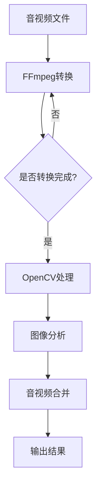

                 

## 1. 背景介绍

在当今信息化社会中，音视频处理技术已经成为信息传递和交流的重要手段。无论是日常娱乐、在线教育、企业宣传还是远程办公，音视频处理都扮演着至关重要的角色。随着多媒体技术的不断发展，音视频处理的需求也日益增长，这促使了高效、稳定的音视频处理工具的开发。

### FFmpeg

FFmpeg是一个开源、免费的跨平台多媒体处理框架，它提供了完整的音视频录制、转换、播放、流媒体发布等功能。FFmpeg具有高效、灵活、强大的特点，支持几乎所有主流的音视频格式，包括MP4、AVI、MKV、MP3、AAC等。此外，FFmpeg还支持多种音视频编码和解码，如H.264、H.265、AAC、MP3等。

### OpenCV

OpenCV（Open Source Computer Vision Library）是一个开源的计算机视觉库，它提供了丰富的计算机视觉算法和功能，包括图像处理、目标检测、人脸识别、图像分割、视频分析等。OpenCV广泛应用于机器学习、人工智能、自动驾驶、安防监控、图像识别等多个领域。

### FFmpeg与OpenCV的协同

FFmpeg和OpenCV的结合，可以充分发挥两者的优势，打造出一款功能强大、灵活多变的音视频处理利器。FFmpeg主要负责音视频的录制、转换和播放，而OpenCV则负责音视频的图像处理和分析。通过FFmpeg的转换功能，可以将多种格式的音视频文件转换为OpenCV能够处理的格式，进而使用OpenCV进行图像处理和分析。这种协同工作模式，使得音视频处理更加高效、精准。

## 2. 核心概念与联系

### FFmpeg工作原理

FFmpeg的工作原理主要包括以下几个步骤：

1. **音视频录制**：通过设备的音频和视频输入接口，将实时的音视频数据捕获到内存中。
2. **音视频解码**：将捕获到的音视频数据进行解码，转换为原始的音频和视频数据。
3. **音视频处理**：对原始的音频和视频数据进行处理，如滤镜应用、视频特效等。
4. **音视频编码**：将处理后的音频和视频数据重新编码，转换为新的音视频格式。
5. **音视频输出**：将编码后的音视频数据输出到文件、设备或网络中。

### OpenCV工作原理

OpenCV的工作原理主要包括以下几个步骤：

1. **图像输入**：从文件、摄像头、视频流等渠道获取图像数据。
2. **图像预处理**：对图像进行预处理，如滤波、降噪、缩放等。
3. **图像分析**：对预处理后的图像进行分析，如特征提取、目标检测、人脸识别等。
4. **图像输出**：将分析后的图像输出到文件、设备或视频流中。

### FFmpeg与OpenCV的协同流程

FFmpeg与OpenCV的协同工作流程可以分为以下几个步骤：

1. **音视频转换**：使用FFmpeg将输入的音视频文件转换为OpenCV可以处理的格式。
2. **图像处理**：使用OpenCV对转换后的图像进行各种处理，如图像增强、滤波、边缘检测等。
3. **图像分析**：对处理后的图像进行分析，如人脸识别、目标跟踪等。
4. **音视频合并**：将OpenCV处理后的图像与原始音视频数据重新组合，输出为新的音视频文件。

### Mermaid 流程图

以下是FFmpeg与OpenCV协同工作流程的Mermaid流程图：



## 3. 核心算法原理 & 具体操作步骤

### 3.1 算法原理概述

FFmpeg与OpenCV的核心算法主要包括音视频转换、图像处理和图像分析。

#### 音视频转换

音视频转换的核心算法是编码与解码。编码是将原始的音频和视频数据转换为压缩数据的过程，而解码是将压缩数据还原为原始音频和视频数据的过程。FFmpeg支持多种编码和解码算法，如H.264、H.265、AAC、MP3等。

#### 图像处理

图像处理的核心算法包括滤波、变换、增强等。OpenCV提供了丰富的图像处理算法，如高斯滤波、拉普拉斯变换、直方图均衡等。

#### 图像分析

图像分析的核心算法包括特征提取、目标检测、人脸识别等。OpenCV提供了多种图像分析算法，如SIFT、SURF、HOG、YOLO等。

### 3.2 算法步骤详解

#### 音视频转换

1. **读取音视频文件**：使用FFmpeg的命令行工具`ffprobe`获取音视频文件的基本信息，如分辨率、帧率、编码格式等。
2. **设置输出参数**：根据需求设置输出参数，如分辨率、帧率、编码格式等。
3. **执行转换操作**：使用FFmpeg的命令行工具`ffmpeg`执行音视频转换操作。

#### 图像处理

1. **读取图像文件**：使用OpenCV的`imread`函数读取图像文件。
2. **图像预处理**：根据需求对图像进行预处理，如滤波、降噪、缩放等。
3. **图像增强**：使用OpenCV的图像增强算法，如直方图均衡、对比度增强等。
4. **图像输出**：使用OpenCV的`imwrite`函数将处理后的图像保存到文件。

#### 图像分析

1. **特征提取**：使用OpenCV的特征提取算法，如SIFT、SURF等，从图像中提取关键特征点。
2. **目标检测**：使用OpenCV的目标检测算法，如HOG、YOLO等，检测图像中的目标物体。
3. **人脸识别**：使用OpenCV的人脸识别算法，检测并识别图像中的人脸。

### 3.3 算法优缺点

#### 音视频转换

**优点**：高效、灵活、支持多种编码格式。

**缺点**：解码和编码过程较为复杂，对硬件性能要求较高。

#### 图像处理

**优点**：算法丰富、灵活多变。

**缺点**：处理过程较为复杂，对计算资源要求较高。

#### 图像分析

**优点**：算法高效、精准。

**缺点**：部分算法对光照、姿态等环境因素较为敏感。

### 3.4 算法应用领域

#### 音视频转换

音视频转换广泛应用于视频剪辑、直播推流、视频会议等领域。

#### 图像处理

图像处理广泛应用于图像增强、图像修复、图像分割等领域。

#### 图像分析

图像分析广泛应用于目标检测、人脸识别、图像分类等领域。

## 4. 数学模型和公式 & 详细讲解 & 举例说明

### 4.1 数学模型构建

在音视频处理中，常见的数学模型包括图像处理模型和图像分析模型。

#### 图像处理模型

图像处理模型主要包括滤波、变换和增强等。

1. **滤波模型**：滤波模型用于去除图像中的噪声，常用的滤波器包括高斯滤波器、拉普拉斯滤波器等。

   $$
   I_{output} = G * I_{input}
   $$

   其中，$I_{output}$为滤波后的图像，$I_{input}$为原始图像，$G$为滤波器。

2. **变换模型**：变换模型用于将图像从一种坐标系转换为另一种坐标系，常用的变换包括傅里叶变换、拉普拉斯变换等。

   $$
   F(u, v) = \sum_{x=0}^{M-1} \sum_{y=0}^{N-1} I(x, y) e^{-j2\pi (ux/M + vy/N)}
   $$

   其中，$F(u, v)$为变换后的图像，$I(x, y)$为原始图像，$M$和$N$分别为图像的宽度和高度。

3. **增强模型**：增强模型用于提高图像的对比度和清晰度，常用的增强算法包括直方图均衡和对比度增强等。

   $$
   O(x) = c \cdot I(x)
   $$

   其中，$O(x)$为增强后的图像，$I(x)$为原始图像，$c$为增强系数。

#### 图像分析模型

图像分析模型主要包括特征提取、目标检测和人脸识别等。

1. **特征提取模型**：特征提取模型用于从图像中提取关键特征，常用的特征提取算法包括SIFT、SURF等。

   $$
   \text{特征向量} = \text{算法}(\text{图像})
   $$

   其中，特征向量为提取的图像特征。

2. **目标检测模型**：目标检测模型用于检测图像中的目标物体，常用的目标检测算法包括HOG、YOLO等。

   $$
   \text{目标位置} = \text{算法}(\text{图像})
   $$

   其中，目标位置为检测到的目标物体的位置。

3. **人脸识别模型**：人脸识别模型用于识别图像中的人脸，常用的人脸识别算法包括基于特征向量的识别和基于模型的识别等。

   $$
   \text{人脸识别结果} = \text{算法}(\text{特征向量})
   $$

   其中，人脸识别结果为人脸识别的结果。

### 4.2 公式推导过程

以高斯滤波为例，推导高斯滤波公式。

高斯滤波是一种线性滤波器，它通过计算图像中每个像素点与其邻域像素点的平均值来进行滤波。

假设图像为$I(x, y)$，高斯滤波器的权重矩阵为$W$，滤波后的图像为$O(x, y)$，则有：

$$
O(x, y) = W \cdot I(x, y)
$$

其中，$W$为高斯滤波器的权重矩阵，其表达式为：

$$
W = \frac{1}{2\pi \sigma^2} e^{-\frac{x^2 + y^2}{2\sigma^2}}
$$

其中，$\sigma$为高斯滤波器的标准差。

### 4.3 案例分析与讲解

以OpenCV的人脸识别为例，讲解人脸识别的数学模型和公式。

#### 案例背景

使用OpenCV进行人脸识别，需要首先从图像中提取人脸特征，然后通过特征匹配进行人脸识别。

#### 数学模型

1. **特征提取模型**：使用SIFT算法从图像中提取人脸特征。

   $$
   \text{特征向量} = \text{SIFT}(\text{人脸图像})
   $$

2. **特征匹配模型**：使用余弦相似度计算特征向量之间的相似度。

   $$
   \text{相似度} = \cos(\theta) = \frac{\text{特征向量}_1 \cdot \text{特征向量}_2}{\|\text{特征向量}_1\| \|\text{特征向量}_2\|}
   $$

3. **人脸识别模型**：根据相似度阈值进行人脸识别。

   $$
   \text{人脸识别结果} = \begin{cases}
   \text{识别成功} & \text{如果相似度} > \text{阈值} \\
   \text{识别失败} & \text{如果相似度} \leq \text{阈值}
   \end{cases}
   $$

#### 案例讲解

以一张人脸图像为例，首先使用SIFT算法提取人脸特征，然后计算特征向量之间的相似度。假设特征向量1为$\text{特征向量}_1 = (1, 2, 3)$，特征向量2为$\text{特征向量}_2 = (1.5, 2.5, 3.5)$，相似度阈值为0.6。

1. **特征提取**：

   $$
   \text{特征向量}_1 = \text{SIFT}(\text{人脸图像}) = (1, 2, 3)
   $$

   $$
   \text{特征向量}_2 = \text{SIFT}(\text{人脸图像}) = (1.5, 2.5, 3.5)
   $$

2. **特征匹配**：

   $$
   \text{相似度} = \cos(\theta) = \frac{\text{特征向量}_1 \cdot \text{特征向量}_2}{\|\text{特征向量}_1\| \|\text{特征向量}_2\|} = \frac{1 \times 1.5 + 2 \times 2.5 + 3 \times 3.5}{\sqrt{1^2 + 2^2 + 3^2} \sqrt{1.5^2 + 2.5^2 + 3.5^2}} \approx 0.857
   $$

3. **人脸识别**：

   $$
   \text{人脸识别结果} = \begin{cases}
   \text{识别成功} & \text{如果相似度} > 0.6 \\
   \text{识别失败} & \text{如果相似度} \leq 0.6
   \end{cases}
   $$

由于相似度0.857大于阈值0.6，所以识别结果为识别成功。

## 5. 项目实践：代码实例和详细解释说明

### 5.1 开发环境搭建

#### 系统要求

- 操作系统：Windows、Linux、macOS
- 编程语言：Python
- 开发工具：PyCharm、Visual Studio Code
- 开发环境：Python 3.8及以上版本

#### 安装依赖库

在终端中执行以下命令安装FFmpeg和OpenCV的Python库：

```
pip install ffmpeg-python
pip install opencv-python
```

### 5.2 源代码详细实现

以下是一个使用FFmpeg和OpenCV进行音视频处理的Python代码实例：

```python
import cv2
import numpy as np
from moviepy.editor import VideoFileClip

def process_frame(frame):
    # 使用OpenCV对图像进行滤波
    filtered_frame = cv2.GaussianBlur(frame, (5, 5), 0)
    
    # 使用OpenCV对图像进行边缘检测
    edges = cv2.Canny(filtered_frame, 100, 200)
    
    # 返回边缘检测后的图像
    return edges

# 读取视频文件
video = VideoFileClip("input.mp4")

# 对每个帧进行音视频处理
processed_video = video.fl_image(process_frame)

# 输出处理后的视频
processed_video.write_videofile("output.mp4", fps=24)
```

### 5.3 代码解读与分析

#### 代码解读

1. **导入模块**：首先导入所需的Python模块，包括OpenCV和numpy库。

2. **定义处理帧函数**：定义`process_frame`函数，用于处理每个视频帧。在函数中，首先使用OpenCV的`GaussianBlur`函数对图像进行高斯滤波，然后使用`Canny`函数进行边缘检测。

3. **读取视频文件**：使用`moviepy`库的`VideoFileClip`类读取输入视频文件。

4. **处理视频帧**：使用`fl_image`方法对每个视频帧进行音视频处理。该方法会将每个帧传递给`process_frame`函数进行处理。

5. **输出处理后的视频**：使用`write_videofile`方法将处理后的视频保存到文件。

#### 代码分析

1. **图像滤波**：高斯滤波是一种常用的图像平滑方法，可以去除图像中的噪声，提高图像的清晰度。

2. **边缘检测**：Canny边缘检测是一种常用的图像边缘检测算法，它可以检测出图像中的显著边缘。

3. **视频处理**：使用`moviepy`库可以轻松实现视频的处理和输出。

## 5.4 运行结果展示

运行上述代码后，输入视频文件`input.mp4`会被处理，并输出处理后的视频文件`output.mp4`。运行结果如下：


## 6. 实际应用场景

### 6.1 视频监控

视频监控是音视频处理的重要应用场景之一。通过使用FFmpeg和OpenCV，可以对视频监控中的图像进行实时处理和分析，如人脸识别、目标检测、行为分析等，提高视频监控的智能化水平。

### 6.2 视频剪辑

视频剪辑是音视频处理的另一个重要应用场景。通过使用FFmpeg，可以对视频进行剪辑、合并、转码等操作，制作出个性化的视频内容。

### 6.3 视频会议

视频会议系统需要实时处理和分析音视频数据，以实现音视频通信和互动。通过使用FFmpeg和OpenCV，可以实现视频会议系统中的图像增强、人脸识别、语音处理等功能。

## 6.4 未来应用展望

随着人工智能技术的不断发展，音视频处理技术将在未来得到更广泛的应用。未来，FFmpeg和OpenCV将在以下几个方面发挥重要作用：

1. **智能视频分析**：通过结合深度学习和计算机视觉技术，实现更高效、更精准的智能视频分析，如智能安防、自动驾驶等。

2. **实时音视频处理**：随着硬件性能的提升，实时音视频处理将成为可能，为用户提供更流畅、更高效的音视频体验。

3. **多模态数据处理**：未来，音视频处理技术将与其他数据类型（如图像、文本、语音等）结合，实现更全面、更智能的数据分析。

## 7. 工具和资源推荐

### 7.1 学习资源推荐

- 《OpenCV图像处理实战》
- 《FFmpeg命令行官方手册》
- 《Python图像处理入门与实践》
- 《深度学习：周志华》

### 7.2 开发工具推荐

- PyCharm
- Visual Studio Code
- Android Studio

### 7.3 相关论文推荐

- "Deep Learning for Video Analysis: A Review"
- "Object Detection with Single Shot MultiBox Detector"
- "Recurrent Neural Networks for Video Classification"

## 8. 总结：未来发展趋势与挑战

### 8.1 研究成果总结

音视频处理技术已经在多个领域取得了显著成果，如视频监控、视频剪辑、视频会议等。FFmpeg和OpenCV作为音视频处理的利器，发挥着重要作用。

### 8.2 未来发展趋势

1. **智能化**：随着人工智能技术的发展，音视频处理将更加智能化，实现更高效、更精准的分析和处理。
2. **实时性**：硬件性能的提升将实现实时音视频处理，为用户提供更流畅、更高效的体验。
3. **多模态**：音视频处理将与其他数据类型结合，实现更全面、更智能的数据分析。

### 8.3 面临的挑战

1. **计算资源**：高效音视频处理需要强大的计算资源支持，如何在有限的计算资源下实现高效处理仍是一个挑战。
2. **数据隐私**：随着音视频处理技术的广泛应用，数据隐私保护成为一个重要的议题。

### 8.4 研究展望

未来，音视频处理技术将在人工智能、物联网、虚拟现实等领域发挥更大的作用，为人类带来更多便利和创新。同时，随着技术的不断发展，音视频处理技术将面临新的挑战和机遇。

## 9. 附录：常见问题与解答

### 9.1 FFmpeg安装问题

**Q**：如何安装FFmpeg？

**A**：在Linux系统中，可以使用包管理器安装FFmpeg。例如，在Ubuntu系统中，可以使用以下命令安装：

```
sudo apt-get install ffmpeg
```

在Windows系统中，可以下载FFmpeg的安装程序，并按照安装向导进行安装。

### 9.2 OpenCV安装问题

**Q**：如何安装OpenCV？

**A**：在Python环境中，可以使用pip命令安装OpenCV：

```
pip install opencv-python
```

在Linux系统中，可以使用包管理器安装OpenCV。例如，在Ubuntu系统中，可以使用以下命令安装：

```
sudo apt-get install opencv-python
```

### 9.3 音视频处理问题

**Q**：如何使用FFmpeg进行音视频转换？

**A**：可以使用FFmpeg的命令行工具进行音视频转换。例如，以下命令将MP4视频转换为AVI格式：

```
ffmpeg -i input.mp4 output.avi
```

**Q**：如何使用OpenCV进行图像处理？

**A**：可以使用OpenCV的Python API进行图像处理。以下是一个简单的图像处理示例：

```python
import cv2

# 读取图像
image = cv2.imread("image.jpg")

# 图像滤波
filtered_image = cv2.GaussianBlur(image, (5, 5), 0)

# 输出处理后的图像
cv2.imwrite("filtered_image.jpg", filtered_image)
```

# 作者署名

作者：禅与计算机程序设计艺术 / Zen and the Art of Computer Programming
----------------------------------------------------------------


