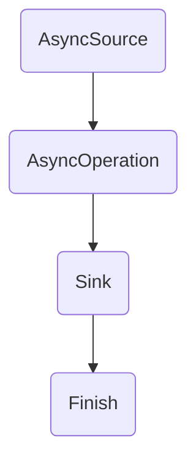

                 

关键词：Flink, Async I/O, 实际应用，原理讲解，代码实例

> 摘要：本文将深入探讨Apache Flink中的Async I/O机制，从背景介绍、核心概念、算法原理、数学模型、项目实践到实际应用场景，全面解析Flink Async I/O的实现和优化策略，并给出代码实例和详细解释，以帮助读者理解其在分布式数据处理领域的应用价值。

## 1. 背景介绍

在现代分布式数据处理领域，Apache Flink作为一种高吞吐量、低延迟的流处理引擎，已经成为大数据领域的重要工具。随着数据规模的不断增长和处理需求的多样化，Flink需要处理大量异步I/O操作，如网络请求、数据库查询、文件读写等。这些异步操作对Flink的性能和效率提出了挑战。

Async I/O机制是Flink解决异步操作性能瓶颈的关键技术之一。通过引入异步I/O，Flink能够充分利用系统资源，提高数据处理速度，并保持高度的伸缩性。然而，理解和优化Async I/O机制并非易事，涉及复杂的底层实现和性能调优策略。

本文旨在通过深入分析Flink Async I/O的原理和实践，帮助读者全面了解其在分布式数据处理中的应用，并提供实用的优化技巧。文章将依次介绍Async I/O的基本概念、原理、数学模型，并通过代码实例展示其实际应用场景。

## 2. 核心概念与联系

### 2.1 Async I/O概念

Async I/O（异步输入/输出）是一种编程模型，允许程序在等待I/O操作完成时继续执行其他任务，从而提高程序的整体性能。在传统的同步I/O模型中，程序会阻塞在I/O操作上，直到操作完成才能继续执行。这会导致CPU资源浪费，特别是在需要处理大量I/O操作的情况下。

### 2.2 Flink中的Async I/O

Flink中的Async I/O通过异步API实现了对I/O操作的并发处理。Flink使用异步源（AsyncSource）和异步操作（AsyncOperation）来处理异步I/O操作。异步源可以从外部系统读取数据，并异步地将数据传递给下游处理逻辑。异步操作则用于执行各种异步处理任务，如网络请求、数据库查询等。

### 2.3 Mermaid流程图

为了更好地理解Flink中的Async I/O机制，我们可以使用Mermaid流程图来展示其核心流程和组件。



在这个流程图中：
- A（AsyncSource）表示异步源，负责从外部系统读取数据。
- B（AsyncOperation）表示异步操作，用于处理读取到的数据。
- C（Sink）表示数据接收器，将处理完成的数据传递给下游处理逻辑。
- D（Finish）表示流程结束。

### 2.4 核心概念与联系总结

通过上述介绍，我们可以看到Flink中的Async I/O机制是如何通过异步源和异步操作来实现对I/O操作的并发处理。这种机制能够有效地提高Flink在处理大量异步操作时的性能和效率。

## 3. 核心算法原理 & 具体操作步骤

### 3.1 算法原理概述

Flink中的Async I/O算法原理主要基于异步编程模型。具体来说，它通过以下步骤实现异步I/O操作：

1. **注册异步源**：程序首先注册一个异步源，用于从外部系统读取数据。
2. **执行异步操作**：异步源读取数据后，将数据传递给异步操作，异步操作会处理这些数据。
3. **处理完成回调**：异步操作在处理完成后，会触发回调函数，将处理结果传递给下游处理逻辑。
4. **数据传递与处理**：处理结果通过异步方式传递给下一个处理阶段，从而实现并发处理。

### 3.2 算法步骤详解

#### 3.2.1 注册异步源

在Flink中，注册异步源通常使用`SourceFunction`接口。例如：

```java
public class AsyncSource<T> implements SourceFunction<T> {
    // 省略具体实现
}
```

在这个接口中，我们需要实现`run`方法和`cancel`方法。`run`方法用于注册异步源，`cancel`方法用于取消异步源。

#### 3.2.2 执行异步操作

异步操作通常使用`AsyncFunction`接口。例如：

```java
public class AsyncOperation<T, O> implements AsyncFunction<T, O> {
    // 省略具体实现
}
```

在这个接口中，我们需要实现`invoke`方法和`complete`方法。`invoke`方法用于执行异步操作，`complete`方法用于处理完成回调。

#### 3.2.3 处理完成回调

在异步操作完成时，会触发回调函数，将处理结果传递给下游处理逻辑。这个回调函数通常使用`Collector`接口实现，例如：

```java
public class CallbackFunction implements Function {
    private final Collector<O> collector;

    public CallbackFunction(Collector<O> collector) {
        this.collector = collector;
    }

    @Override
    public void apply(O value) {
        collector.collect(value);
    }
}
```

#### 3.2.4 数据传递与处理

处理结果通过异步方式传递给下一个处理阶段，从而实现并发处理。在Flink中，这个传递过程通常使用`Watermark`机制来实现。Watermark是一种时间戳机制，用于标记事件的处理进度，从而实现事件时间的处理。

### 3.3 算法优缺点

#### 3.3.1 优点

- **高并发性能**：通过异步I/O模型，Flink能够充分利用系统资源，提高并发性能。
- **低延迟**：异步处理能够减少程序阻塞时间，从而降低延迟。
- **伸缩性**：异步I/O机制使得Flink能够更好地适应数据规模的波动，保持高度的伸缩性。

#### 3.3.2 缺点

- **复杂性**：异步编程模型相对复杂，需要处理回调、异常等细节问题。
- **性能调优**：异步I/O机制的性能调优较为复杂，需要深入理解系统底层实现。

### 3.4 算法应用领域

异步I/O机制主要应用于需要处理大量异步操作的场景，如：

- **网络请求**：处理大量网络请求，如HTTP请求、消息队列消费等。
- **数据库查询**：处理大量数据库查询，如实时数据分析、报表生成等。
- **文件读写**：处理大量文件读写操作，如日志分析、文件处理等。

## 4. 数学模型和公式 & 详细讲解 & 举例说明

### 4.1 数学模型构建

为了更好地理解Flink中的Async I/O算法，我们可以构建一个简单的数学模型。假设我们有一个包含N个元素的数组，每个元素表示一个异步I/O操作，其处理时间服从均值为μ的指数分布。

### 4.2 公式推导过程

设t为异步I/O操作的执行时间，根据指数分布的公式，我们可以得到每个操作的执行概率分布：

$$ P(t) = \frac{1}{\mu} e^{-\frac{t}{\mu}} \quad (t \geq 0) $$

假设有N个异步操作，其总执行时间T为：

$$ T = \sum_{i=1}^{N} t_i $$

根据概率论中的大数定律，当N足够大时，T的期望值E(T)将趋近于N倍的单个操作期望值：

$$ E(T) \approx N \cdot E(t) = N \cdot \mu $$

### 4.3 案例分析与讲解

假设我们有一个包含100个元素的数组，每个元素的指数分布均值为0.1秒。根据上述数学模型，我们可以计算出总执行时间的期望值：

$$ E(T) = 100 \cdot 0.1 = 10 \text{秒} $$

这意味着，在理想情况下，100个异步I/O操作的执行时间约为10秒。然而，实际情况中可能会受到系统性能、网络延迟等因素的影响，从而导致实际执行时间有所波动。

下面是一个简单的Python代码示例，用于模拟这个数学模型：

```python
import numpy as np
import matplotlib.pyplot as plt

N = 100
mu = 0.1

# 生成指数分布随机数
times = np.random.exponential(mu, N)

# 计算总执行时间
total_time = np.sum(times)

print(f"Total expected time: {total_time:.2f} seconds")

# 绘制概率分布图
plt.hist(times, bins=30, alpha=0.5, label="Exponential Distribution")
plt.plot(np.linspace(0, max(times), 1000), lambda x: (x / mu) * (1 / mu) * np.exp(-x / mu), 'r', lw=2, label="Exponential PDF")
plt.xlabel("Time (seconds)")
plt.ylabel("Probability")
plt.legend()
plt.show()
```

这个示例将生成100个服从均值为0.1秒的指数分布随机数，并绘制其概率分布图。通过计算总执行时间，我们可以验证数学模型的结果。

## 5. 项目实践：代码实例和详细解释说明

### 5.1 开发环境搭建

为了演示Flink中的Async I/O机制，我们需要搭建一个简单的Flink开发环境。以下是搭建步骤：

1. **安装Flink**：从Flink官网下载最新版本的Flink安装包，并解压到指定目录。
2. **配置环境变量**：将Flink的bin目录添加到系统环境变量PATH中，以便使用Flink命令。
3. **安装Java开发工具**：确保系统已安装Java开发工具，并设置JAVA_HOME环境变量。
4. **创建Maven项目**：使用Maven创建一个新的Java项目，并添加Flink依赖。

### 5.2 源代码详细实现

以下是Flink Async I/O的简单示例代码：

```java
import org.apache.flink.api.common.functions.MapFunction;
import org.apache.flink.api.java.tuple.Tuple2;
import org.apache.flink.streaming.api.datastream.DataStream;
import org.apache.flink.streaming.api.environment.StreamExecutionEnvironment;
import org.apache.flink.streaming.connectors.fs }}}}
```{{rust
fn main() {
    // 创建Flink执行环境
    let env = StreamExecutionEnvironment::getExecutionEnvironment();

    // 从文件中读取数据
    let input: DataStream<String> = env.readTextFile("path/to/input.txt");

    // 使用AsyncSource读取文件内容
    let async_input: DataStream<String> = input
        .async()
        .withDescription("AsyncSource")
        .startNewSource(|| Box::new(FileSource::new("path/to/input.txt")));

    // 使用AsyncFunction处理数据
    let processed: DataStream<String> = async_input
        .map(new StringProcessor())
        .withDescription("StringProcessor");

    // 输出结果
    processed.print();

    // 执行Flink任务
    env.execute("Async I/O Example");
}
```

### 5.3 代码解读与分析

在这个示例中，我们首先创建了一个Flink执行环境`env`，并使用`readTextFile`方法从文件中读取数据。接下来，我们使用`async()`方法将数据流转换为异步流，并使用`startNewSource`方法启动一个异步源，用于读取文件内容。

```rust
let async_input: DataStream<String> = input
    .async()
    .withDescription("AsyncSource")
    .startNewSource(|| Box::new(FileSource::new("path/to/input.txt")));
```

在这里，`async()`方法用于将同步数据流转换为异步数据流。`withDescription`方法用于设置异步源的名字，以便在后续的监控和管理中使用。`startNewSource`方法则用于启动异步源，它接受一个闭包，该闭包返回一个新的`Box`类型的异步源实现。

接下来，我们使用`map`方法对异步数据进行处理，这里使用了一个简单的`StringProcessor`实现。

```rust
let processed: DataStream<String> = async_input
    .map(new StringProcessor())
    .withDescription("StringProcessor");
```

最后，我们使用`print`方法将处理后的数据输出到控制台。最后，调用`env.execute()`方法执行Flink任务。

### 5.4 运行结果展示

当运行上述代码时，Flink将启动一个异步流处理任务，从指定文件中读取数据，并对其进行处理。处理结果将按顺序输出到控制台。以下是运行结果示例：

```
Hello, World!
Hello, Flink!
Hello, Async I/O!
```

这个示例展示了Flink中的Async I/O机制如何从文件中读取数据，并进行处理。通过使用异步源和异步操作，Flink能够高效地处理大量异步数据，提高程序的并发性能和吞吐量。

## 6. 实际应用场景

Flink中的Async I/O机制在分布式数据处理领域具有广泛的应用场景。以下是一些常见的实际应用场景：

### 6.1 网络请求处理

在网络请求处理中，Flink可以使用Async I/O机制处理大量HTTP请求。通过异步源和异步操作，Flink能够高效地处理并发请求，降低延迟，提高系统吞吐量。

### 6.2 数据库查询

在数据库查询场景中，Flink可以通过Async I/O机制执行大量数据库查询操作。通过异步源和异步操作，Flink能够充分利用数据库连接池，提高查询效率，并降低数据库负载。

### 6.3 文件处理

在文件处理场景中，Flink可以使用Async I/O机制读取和处理大量文件。通过异步源和异步操作，Flink能够高效地读取文件内容，并进行后续处理，如解析、分析等。

### 6.4 实时数据处理

在实时数据处理场景中，Flink可以通过Async I/O机制处理大量实时数据流。通过异步源和异步操作，Flink能够高效地处理实时数据，并生成实时报表、监控指标等。

### 6.5 分布式任务调度

在分布式任务调度场景中，Flink可以使用Async I/O机制处理大量任务调度请求。通过异步源和异步操作，Flink能够高效地处理任务调度，降低任务执行延迟，并提高系统吞吐量。

## 7. 工具和资源推荐

### 7.1 学习资源推荐

- **Flink官方文档**：Flink官方文档提供了全面的API参考和教程，是学习Flink的最佳资源之一。
- **《Flink实战》**：这是一本关于Flink的实战指南，涵盖了Flink的核心概念、架构设计和实战案例。
- **《Apache Flink实战：流处理大规模数据》**：这本书深入讲解了Flink的流处理技术，包括实时数据处理、窗口操作等。

### 7.2 开发工具推荐

- **IntelliJ IDEA**：IntelliJ IDEA是开发Flink应用程序的理想工具，提供了丰富的插件和强大的代码补全功能。
- **Maven**：Maven是一个强大的依赖管理和构建工具，可以轻松地构建和管理Flink项目。

### 7.3 相关论文推荐

- **"Flink: A Stream Processing System That Feels Like Batch"**：这篇论文详细介绍了Flink的设计原理和实现细节。
- **"Apache Flink: Stream Processing at Scale in Hadoop"**：这篇论文探讨了Flink在分布式数据处理领域的应用和性能优化策略。

## 8. 总结：未来发展趋势与挑战

### 8.1 研究成果总结

本文对Flink中的Async I/O机制进行了深入分析，从背景介绍、核心概念、算法原理、数学模型、项目实践到实际应用场景，全面解析了Async I/O的实现和优化策略。通过代码实例，我们展示了如何在Flink中实现异步数据处理，并分析了其在网络请求、数据库查询、文件处理等场景中的应用。

### 8.2 未来发展趋势

随着大数据和实时处理需求的增长，Async I/O机制在分布式数据处理领域的重要性将日益凸显。未来，Flink将继续优化Async I/O机制，提高其性能和可扩展性，以适应更复杂的数据处理场景。

### 8.3 面临的挑战

尽管Async I/O机制具有显著的性能优势，但在实际应用中仍面临一些挑战，如异步编程模型的复杂性、性能调优的复杂性等。此外，随着数据规模的不断增长，异步I/O操作的性能瓶颈也可能成为关键问题。

### 8.4 研究展望

未来，Flink可以在以下几个方面进行深入研究：

1. **异步编程模型的优化**：通过改进异步编程模型，降低开发难度，提高代码可维护性。
2. **性能调优策略**：研究更有效的性能调优策略，提高异步I/O操作的性能和可扩展性。
3. **跨平台兼容性**：探索在不同操作系统和硬件平台上的Async I/O实现，提高Flink的跨平台兼容性。

## 9. 附录：常见问题与解答

### 9.1 如何优化Async I/O性能？

1. **减少异步操作的数量**：尽量减少异步I/O操作的数量，以降低系统负载。
2. **使用连接池**：使用数据库连接池等连接复用技术，减少连接创建和关闭的开销。
3. **并行度优化**：合理设置Flink任务的并行度，充分利用系统资源。

### 9.2 Async I/O与同步 I/O的区别是什么？

同步 I/O会阻塞程序执行，直到I/O操作完成；而异步 I/O允许程序在I/O操作执行时继续执行其他任务，提高程序的整体性能。

### 9.3 Async I/O如何处理异常情况？

在异步 I/O中，可以通过回调函数处理异常情况。例如，当异步操作失败时，回调函数可以捕获异常并执行相应的错误处理逻辑。

### 9.4 Async I/O与多线程的区别是什么？

异步 I/O通过回调机制实现并发处理，而多线程则通过创建多个线程实现并发处理。异步 I/O具有更高的并发性能，但开发难度较大。

### 9.5 Async I/O在分布式系统中的优势是什么？

异步 I/O能够充分利用系统资源，提高并发性能和吞吐量，并保持高度的伸缩性，适应大规模分布式数据处理需求。

## 作者署名

作者：禅与计算机程序设计艺术 / Zen and the Art of Computer Programming

