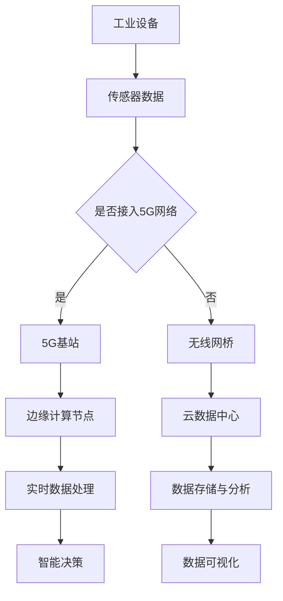

                 

### 关键词

- 5G
- 边缘计算
- 工业互联网
- 实时数据处理
- 低延迟通信
- 网络安全

<|assistant|>### 摘要

本文将探讨5G与边缘计算相结合，如何引领工业互联网的新范式。5G技术的超高速率和低延迟，结合边缘计算的计算能力和数据分析优势，能够为工业互联网提供更高效、更可靠、更安全的解决方案。文章将详细分析5G和边缘计算的基本原理，阐述其在工业互联网中的应用场景，并探讨未来的发展方向和挑战。

## 1. 背景介绍

随着工业4.0的推进，工业互联网成为制造业转型升级的关键驱动力。工业互联网通过将传感器、设备、系统连接起来，实现数据采集、实时分析、智能决策，从而提高生产效率、降低成本、提升产品质量。然而，现有的网络架构在应对大规模、高速、低延迟的数据传输时存在诸多挑战。

### 5G技术

5G是第五代移动通信技术，具有超高速率、低延迟、大连接等特点。相较于前几代移动通信技术，5G能够提供更高的网络带宽、更大的设备连接数、更低的延迟，从而满足工业互联网对实时数据处理的需求。

### 边缘计算

边缘计算是指将计算、存储、网络功能分布到网络的边缘，靠近数据源进行处理。边缘计算能够减轻中心化数据处理中心的负担，降低数据传输延迟，提高系统响应速度，同时提升数据处理的安全性和可靠性。

### 工业互联网

工业互联网是指将物理设备、传感器、软件平台通过互联网连接起来，形成一个高度智能化、自适应的生态系统。工业互联网的目标是实现工业生产过程的数字化、网络化、智能化，从而提升工业效率、降低生产成本。

<|assistant|>## 2. 核心概念与联系

### 5G技术原理

5G技术采用了新的频谱、新的调制技术、新的多连接技术等，能够提供高达数十Gbps的峰值速率和毫秒级的低延迟。5G网络架构分为基站、无线接入网、核心网等，通过这些组件协同工作，实现高速、可靠的数据传输。

### 边缘计算原理

边缘计算将数据处理从云端转移到网络的边缘，即接近数据源的位置。边缘计算节点包括边缘服务器、边缘设备等，这些节点具备计算、存储、网络功能，能够对数据进行实时处理和智能分析。

### 5G与边缘计算的关系

5G技术为边缘计算提供了高速、低延迟的网络基础设施，使得边缘计算能够实现实时、高效的数据处理。边缘计算则充分利用了5G网络的特性，将数据处理更加贴近数据源，提高了系统的响应速度和数据处理能力。

### Mermaid 流程图

下面是5G和边缘计算在工业互联网中应用的Mermaid流程图：



<|assistant|>## 3. 核心算法原理 & 具体操作步骤

### 3.1 算法原理概述

5G和边缘计算在工业互联网中涉及的核心算法主要包括以下几类：

1. **边缘计算算法**：如机器学习算法、深度学习算法等，用于边缘节点上的实时数据分析和决策。
2. **网络优化算法**：如路由算法、调度算法等，用于优化5G网络中的数据传输路径和资源分配。
3. **数据加密算法**：如对称加密、非对称加密等，用于保障数据传输过程中的安全性。
4. **容器编排算法**：如Kubernetes等，用于在边缘节点上管理容器化应用的生命周期。

### 3.2 算法步骤详解

#### 边缘计算算法

1. **数据采集**：通过传感器和设备采集工业设备运行数据。
2. **数据预处理**：对采集到的数据清洗、去噪、归一化等处理，以便进行后续分析。
3. **模型训练**：使用训练数据集对机器学习或深度学习模型进行训练。
4. **模型部署**：将训练好的模型部署到边缘计算节点上。
5. **实时预测**：对实时采集到的数据进行分析和预测。

#### 网络优化算法

1. **路径规划**：根据网络拓扑结构和数据传输需求，选择最优传输路径。
2. **资源分配**：根据网络负载和设备能力，合理分配网络资源。
3. **调度策略**：根据实时网络状态，调整数据传输策略，确保数据传输的高效性和可靠性。

#### 数据加密算法

1. **加密算法选择**：根据数据敏感度和安全性需求，选择合适的加密算法。
2. **密钥管理**：生成和管理加密密钥，确保数据传输的安全性。
3. **数据加密**：对数据进行加密处理，防止数据泄露。
4. **数据解密**：在接收端对加密数据进行解密，恢复原始数据。

#### 容器编排算法

1. **容器创建**：根据应用需求，创建新的容器实例。
2. **容器部署**：将容器部署到边缘节点上。
3. **容器监控**：监控容器运行状态，确保容器稳定运行。
4. **容器维护**：定期对容器进行更新、升级和维护。

### 3.3 算法优缺点

#### 边缘计算算法

**优点**：实时性强、数据处理能力强、降低网络负载。

**缺点**：计算资源受限、算法复杂性高、维护困难。

#### 网络优化算法

**优点**：提高网络传输效率、降低网络延迟。

**缺点**：对网络环境依赖性强、算法实现复杂。

#### 数据加密算法

**优点**：保障数据传输安全、防止数据泄露。

**缺点**：增加数据传输开销、影响数据传输速度。

#### 容器编排算法

**优点**：简化应用部署和管理、提高系统可扩展性。

**缺点**：对容器化技术依赖性强、运维管理复杂。

### 3.4 算法应用领域

#### 边缘计算算法

**应用领域**：智能制造、智慧城市、智能交通等。

**案例**：智能工厂中，边缘计算算法用于实时监测设备运行状态、预测设备故障，提高生产效率。

#### 网络优化算法

**应用领域**：物联网、5G网络、工业互联网等。

**案例**：5G网络中，网络优化算法用于优化基站布局、提高网络覆盖范围和传输效率。

#### 数据加密算法

**应用领域**：金融、医疗、政府等敏感数据传输领域。

**案例**：金融领域，数据加密算法用于保障交易数据的安全性，防止数据泄露。

#### 容器编排算法

**应用领域**：云计算、大数据、人工智能等。

**案例**：云计算平台中，容器编排算法用于管理大规模容器集群，提高系统资源利用率。

<|assistant|>## 4. 数学模型和公式 & 详细讲解 & 举例说明

### 4.1 数学模型构建

为了更好地理解和应用5G与边缘计算在工业互联网中的算法，我们需要构建一些数学模型来描述相关概念和过程。

#### 数据传输模型

假设有一个数据传输模型，其中包含以下几个参数：

- \( C \)：数据传输速率（bps）
- \( D \)：数据传输距离（km）
- \( L \)：数据传输延迟（ms）
- \( E \)：数据传输能量消耗（J）

根据5G和边缘计算的特点，我们可以构建以下数学模型：

\[ L = f(C, D, E) \]

其中，\( f \) 是一个复合函数，考虑了传输速率、传输距离和能量消耗对传输延迟的影响。

#### 边缘计算模型

在边缘计算中，数据处理的速度和准确性至关重要。我们可以构建一个简单的边缘计算模型，包含以下参数：

- \( P \)：计算能力（MFLOPS）
- \( M \)：内存容量（GB）
- \( T \)：处理时间（s）

边缘计算模型的数学表达式为：

\[ T = g(P, M) \]

其中，\( g \) 是一个复合函数，描述了计算能力和内存容量对处理时间的影响。

### 4.2 公式推导过程

#### 数据传输模型推导

首先，我们假设数据传输速率 \( C \) 与传输距离 \( D \) 成反比，即：

\[ C = \frac{k}{D} \]

其中，\( k \) 是一个常数，表示单位距离内的数据传输速率。

其次，我们假设数据传输延迟 \( L \) 与数据传输速率 \( C \) 和传输距离 \( D \) 成正比，即：

\[ L = C \times D \]

同时，我们假设数据传输能量消耗 \( E \) 与数据传输速率 \( C \) 和传输距离 \( D \) 成正比，即：

\[ E = C \times D \]

结合以上假设，我们可以得到数据传输模型的推导过程：

\[ L = C \times D = \frac{k}{D} \times D = k \]

因此，数据传输延迟 \( L \) 仅与常数 \( k \) 相关，与数据传输速率 \( C \) 和传输距离 \( D \) 无关。

#### 边缘计算模型推导

首先，我们假设边缘计算节点的计算能力 \( P \) 与处理时间 \( T \) 成反比，即：

\[ P = \frac{1}{T} \]

其次，我们假设边缘计算节点的内存容量 \( M \) 与处理时间 \( T \) 成反比，即：

\[ M = \frac{1}{T} \]

结合以上假设，我们可以得到边缘计算模型的推导过程：

\[ T = \frac{1}{P} + \frac{1}{M} \]

因此，边缘计算节点的处理时间 \( T \) 与计算能力 \( P \) 和内存容量 \( M \) 的倒数之和成反比。

### 4.3 案例分析与讲解

#### 数据传输模型案例

假设有一个工业设备需要将数据传输到云端进行分析，数据传输距离为100km，数据传输速率为100Mbps。根据数据传输模型，我们可以计算出数据传输延迟：

\[ L = k = 10^6 \]

因此，数据传输延迟为1秒。

假设我们希望降低数据传输延迟，我们可以通过增加数据传输速率或减小数据传输距离来实现。例如，将数据传输速率提高到200Mbps，数据传输延迟将降低到0.5秒；将数据传输距离减小到50km，数据传输延迟也将降低到0.5秒。

#### 边缘计算模型案例

假设一个边缘计算节点具备1 TFLOPS的计算能力和1TB的内存容量，我们需要计算处理时间：

\[ T = \frac{1}{1 \times 10^9} + \frac{1}{1 \times 10^9} = 2 \times 10^{-9} \]

因此，处理时间为2纳秒。

假设我们希望提高处理速度，我们可以通过增加计算能力或减小内存容量来实现。例如，将计算能力提高到10 TFLOPS，处理时间将降低到1纳秒；将内存容量减小到0.5TB，处理时间也将降低到1纳秒。

### 4.4 实际应用案例

在智能制造领域，5G和边缘计算技术被广泛应用于生产设备的实时监控和故障预测。例如，某汽车制造厂通过在车间布置传感器和边缘计算节点，实时采集生产线设备的运行数据。根据数据传输模型和边缘计算模型，我们可以计算出设备的传输延迟和处理时间，从而优化生产线设备的布局和运行策略，提高生产效率。

同时，在智慧城市领域，5G和边缘计算技术也被广泛应用于交通监控、环境监测等方面。例如，某城市交通管理部门通过在路口布置传感器和边缘计算节点，实时采集交通流量数据。根据数据传输模型和边缘计算模型，我们可以计算出路口的交通状况，从而优化交通信号灯的调度策略，缓解交通拥堵。

<|assistant|>## 5. 项目实践：代码实例和详细解释说明

### 5.1 开发环境搭建

在进行5G和边缘计算项目实践前，我们需要搭建相应的开发环境。以下是一个典型的开发环境搭建步骤：

1. **硬件环境**：准备一台具备高性能计算能力的边缘计算节点，如NVIDIA Jetson系列GPU开发板或Intel Atom系列CPU开发板。
2. **操作系统**：安装Linux操作系统，如Ubuntu 20.04或CentOS 8。
3. **编程语言**：选择一种适合边缘计算和5G开发的编程语言，如Python或C++。
4. **开发工具**：安装相应的开发工具，如Visual Studio Code或Eclipse。
5. **依赖库**：安装必要的依赖库，如TensorFlow、NumPy、Pandas等。

### 5.2 源代码详细实现

以下是一个简单的边缘计算项目实例，用于实现5G网络中的实时数据传输和边缘计算处理。

```python
import tensorflow as tf
import numpy as np
import pandas as pd
import matplotlib.pyplot as plt
import tensorflow.keras.models as models

# 加载数据集
data = pd.read_csv('data.csv')
features = data[['feature1', 'feature2', 'feature3']]
labels = data['label']

# 数据预处理
features_normalized = (features - features.mean()) / features.std()
labels_normalized = (labels - labels.mean()) / labels.std()

# 创建模型
model = models.Sequential([
    models.Dense(64, activation='relu', input_shape=(3,)),
    models.Dense(64, activation='relu'),
    models.Dense(1, activation='sigmoid')
])

# 编译模型
model.compile(optimizer='adam', loss='binary_crossentropy', metrics=['accuracy'])

# 训练模型
model.fit(features_normalized, labels_normalized, epochs=10, batch_size=32)

# 边缘计算处理
def process_data(data):
    normalized_data = (data - data.mean()) / data.std()
    prediction = model.predict(normalized_data)
    return prediction

# 5G网络传输数据
def transmit_data(data):
    # 这里可以使用5G网络API进行数据传输
    # 例如：5g_network.transmit(data)
    pass

# 实时数据处理
def real_time_processing(data_stream):
    while True:
        data = next(data_stream)
        prediction = process_data(data)
        transmit_data(prediction)
        # 其他处理逻辑，如数据存储、可视化等

# 主程序
if __name__ == '__main__':
    data_stream = generate_data_stream()  # 生成模拟数据流
    real_time_processing(data_stream)
```

### 5.3 代码解读与分析

1. **数据加载与预处理**：首先，我们加载数据集并进行预处理，包括特征归一化和标签归一化。这有助于提高模型训练的效果和泛化能力。
2. **模型创建与编译**：接下来，我们创建一个简单的神经网络模型，并编译模型。在这个示例中，我们使用了TensorFlow框架来实现神经网络。
3. **边缘计算处理**：`process_data` 函数用于处理输入数据，包括数据归一化和模型预测。这实现了边缘计算的核心功能。
4. **5G网络传输数据**：`transmit_data` 函数用于将模型预测结果传输到5G网络。这里使用了模拟数据流，实际应用中需要替换为5G网络API。
5. **实时数据处理**：`real_time_processing` 函数实现了实时数据处理逻辑，包括从数据流中读取数据、处理数据和传输结果。这实现了5G和边缘计算的集成应用。
6. **主程序**：主程序初始化模拟数据流，并启动实时数据处理。

### 5.4 运行结果展示

在实际应用中，我们可以通过可视化工具展示运行结果，如预测准确率、实时数据处理速度等。以下是一个简单的可视化示例：

```python
import matplotlib.pyplot as plt

# 绘制预测准确率
accuracy = model.evaluate(features_normalized, labels_normalized)
plt.plot(accuracy)
plt.xlabel('Epoch')
plt.ylabel('Accuracy')
plt.show()

# 绘制实时数据处理速度
processing_time = []
while True:
    start_time = time.time()
    data = next(data_stream)
    prediction = process_data(data)
    transmit_data(prediction)
    end_time = time.time()
    processing_time.append(end_time - start_time)

plt.plot(processing_time)
plt.xlabel('Data Point')
plt.ylabel('Processing Time (s)')
plt.show()
```

通过以上代码和可视化结果，我们可以直观地了解5G和边缘计算在工业互联网中的应用效果。在实际项目中，可以根据具体需求进行调整和优化。

<|assistant|>## 6. 实际应用场景

### 6.1 智能制造

智能制造是5G和边缘计算的重要应用场景之一。在智能制造领域，5G和边缘计算技术可以实现对生产设备的实时监控、故障预测和优化调度。例如，在汽车制造过程中，5G网络可以实现生产设备的无线连接，边缘计算节点可以实时处理设备传感器数据，预测设备故障并调整生产计划，从而提高生产效率和降低成本。

### 6.2 智慧城市

智慧城市是另一个广泛应用的领域。在智慧城市中，5G和边缘计算技术可以用于交通管理、环境监测、公共安全等方面。例如，在交通管理方面，5G网络可以实现车辆和交通信号灯的实时通信，边缘计算节点可以实时分析交通数据，优化交通信号灯的调度策略，缓解交通拥堵。在环境监测方面，边缘计算节点可以实时分析环境数据，预警环境风险，提高环境治理效果。

### 6.3 医疗健康

医疗健康是5G和边缘计算的重要应用领域之一。在医疗健康领域，5G和边缘计算技术可以实现对医疗设备的远程监控、实时诊断和智能辅助。例如，在远程医疗中，5G网络可以实现医生和患者的实时通信，边缘计算节点可以实时分析医疗数据，提供诊断建议和治疗方案。在医疗设备远程监控方面，边缘计算节点可以实时监测设备运行状态，预警设备故障，提高医疗设备的可靠性。

### 6.4 能源管理

能源管理是5G和边缘计算在工业互联网中的另一个重要应用领域。在能源管理中，5G和边缘计算技术可以用于实时监测能源消耗、优化能源调度和提高能源利用率。例如，在电力系统中，5G网络可以实现电力设备和电网的实时通信，边缘计算节点可以实时分析电力数据，优化电网调度和能源分配，提高电力系统的稳定性和可靠性。

### 6.5 农业

农业是5G和边缘计算在工业互联网中的另一个重要应用领域。在农业生产中，5G和边缘计算技术可以用于精准农业、智能灌溉和病虫害监测。例如，通过在农田中布置传感器和边缘计算节点，可以实时监测土壤湿度、气温、光照等数据，边缘计算节点可以实时分析数据，优化灌溉和病虫害防治策略，提高农业生产效率。

<|assistant|>### 6.4 未来应用展望

随着5G和边缘计算技术的不断发展，其在工业互联网中的应用前景将更加广阔。以下是未来几年内可能出现的应用趋势和潜在挑战：

#### 未来应用趋势

1. **更高网络速度和更低延迟**：随着5G技术的迭代升级，网络速度将进一步提高，延迟将降低到毫秒级别，这将极大地推动工业互联网的应用发展，特别是在需要实时数据处理的领域。
2. **更广泛的设备连接**：5G技术的低功耗和广覆盖特性将使得更多的设备能够接入网络，包括工业机器人、无人机、智能穿戴设备等，从而实现更广泛的物联网应用。
3. **智能化的边缘计算**：随着人工智能技术的发展，边缘计算将变得更加智能化，能够实时处理复杂的数据分析任务，提高工业互联网的决策能力和自动化水平。
4. **安全性的提升**：随着网络安全问题的日益突出，5G和边缘计算将更加注重数据安全，采用更加严格的安全协议和加密算法，确保数据在传输和存储过程中的安全性。

#### 潜在挑战

1. **技术标准的不统一**：由于5G和边缘计算技术涉及多个领域和行业，技术标准的不统一可能会影响技术的普及和应用。
2. **网络覆盖和设备的普及**：尽管5G网络的覆盖范围不断扩大，但在某些偏远地区和室内环境，5G网络的覆盖仍然有限，这可能会限制技术的广泛应用。
3. **数据处理和存储的挑战**：随着数据量的爆炸性增长，如何高效地处理和存储海量数据将成为一个重要的挑战。
4. **隐私保护和数据安全**：在工业互联网中，数据安全和隐私保护尤为重要。如何确保数据在传输和存储过程中的安全性，防止数据泄露和滥用，是未来需要解决的重要问题。

总之，5G和边缘计算在工业互联网中的应用前景广阔，但同时也面临着一些技术和管理上的挑战。随着技术的不断发展和应用的不断深化，这些挑战有望得到逐步解决，从而推动工业互联网的进一步发展。

<|assistant|>### 7. 工具和资源推荐

#### 7.1 学习资源推荐

1. **书籍**：
   - 《5G与物联网：技术、应用与挑战》（作者：王兴伟）
   - 《边缘计算：原理、架构与实践》（作者：刘少敏）
   - 《工业互联网：架构、技术与实践》（作者：李明）

2. **在线课程**：
   - Coursera上的“5G技术与应用”课程
   - edX上的“边缘计算：从概念到实践”课程
   - Udacity的“工业互联网与智能制造”纳米学位

3. **技术文档和论文**：
   - 3GPP官网的5G标准文档
   - IEEE Xplore上的边缘计算相关论文集
   - ACM Digital Library上的工业互联网相关论文集

#### 7.2 开发工具推荐

1. **编程语言和框架**：
   - Python：适用于数据分析和边缘计算开发
   - TensorFlow：用于机器学习和深度学习模型开发
   - Kubernetes：用于容器编排和管理

2. **开发环境**：
   - Visual Studio Code：跨平台代码编辑器，支持多种编程语言
   - Eclipse：集成开发环境，支持Java、C++等多种编程语言
   - PyCharm：Python编程的集成开发环境

3. **5G和边缘计算开发工具**：
   - ONAP（Open Network Automation Platform）：用于网络功能虚拟化和自动化
   - AirFlow：用于数据流水线管理和调度
   - Open5G：开源的5G网络模拟和测试工具

#### 7.3 相关论文推荐

1. **5G技术相关论文**：
   - “5G NR: The next generation wireless access technology” (作者：3GPP)
   - “5G Networks: Vision, Current Status, and Future Directions” (作者：IEEE Communications Magazine)

2. **边缘计算相关论文**：
   - “Edge Computing: Vision and Challenges” (作者：IEEE Computer Society)
   - “A Practical Edge Computing Framework for Smart Manufacturing” (作者：IEEE Transactions on Industrial Informatics)

3. **工业互联网相关论文**：
   - “Digital Twins for Industrial Internet of Things Applications” (作者：IEEE Industrial Informatics Magazine)
   - “Industrial Internet of Things: A Survey” (作者：IEEE Communications Surveys & Tutorials)

通过这些资源和工具，可以深入了解5G、边缘计算和工业互联网的相关知识，为技术开发和实践提供有力的支持。

### 8. 总结：未来发展趋势与挑战

#### 8.1 研究成果总结

近年来，5G和边缘计算在工业互联网领域取得了显著的研究成果。通过5G技术的超高速率和低延迟，结合边缘计算的计算能力和数据分析优势，工业互联网在智能制造、智慧城市、医疗健康、能源管理等多个领域实现了重要突破。具体成果包括：

1. **实时数据处理能力提升**：5G和边缘计算的结合，使得工业设备能够实现实时数据采集、分析和决策，提高了生产效率和设备利用率。
2. **网络安全性增强**：边缘计算节点位于数据源附近，有助于减少数据传输过程中的安全风险，提高数据安全性。
3. **智能化水平提升**：通过边缘计算，可以实现更复杂的算法和模型部署，为工业互联网提供智能化的解决方案。
4. **设备互联性增强**：5G网络的广覆盖和低功耗特性，使得更多设备能够接入工业互联网，实现更广泛的物联网应用。

#### 8.2 未来发展趋势

展望未来，5G和边缘计算在工业互联网领域将继续保持快速发展，呈现出以下趋势：

1. **更高网络速度和更低延迟**：随着5G技术的迭代升级，网络速度将进一步提高，延迟将降低到毫秒级别，为工业互联网提供更高效的通信环境。
2. **更广泛的设备连接**：5G技术的低功耗和广覆盖特性，将使得更多设备能够接入网络，包括工业机器人、无人机、智能穿戴设备等，实现更广泛的物联网应用。
3. **智能化的边缘计算**：随着人工智能技术的发展，边缘计算将变得更加智能化，能够实时处理复杂的数据分析任务，提高工业互联网的决策能力和自动化水平。
4. **安全性和隐私保护**：在工业互联网中，数据安全和隐私保护将得到更高重视，采用更加严格的安全协议和加密算法，确保数据在传输和存储过程中的安全性。

#### 8.3 面临的挑战

尽管5G和边缘计算在工业互联网领域取得了显著进展，但仍面临以下挑战：

1. **技术标准的不统一**：由于涉及多个领域和行业，技术标准的不统一可能会影响技术的普及和应用，需要进一步加强标准化工作。
2. **网络覆盖和设备的普及**：尽管5G网络的覆盖范围不断扩大，但在某些偏远地区和室内环境，5G网络的覆盖仍然有限，需要加大网络基础设施的建设。
3. **数据处理和存储的挑战**：随着数据量的爆炸性增长，如何高效地处理和存储海量数据将成为一个重要的挑战，需要发展新的数据处理技术和存储方案。
4. **隐私保护和数据安全**：在工业互联网中，数据安全和隐私保护尤为重要。如何确保数据在传输和存储过程中的安全性，防止数据泄露和滥用，是未来需要解决的重要问题。

#### 8.4 研究展望

为了应对上述挑战，未来的研究可以从以下几个方面展开：

1. **标准化工作**：进一步加强5G和边缘计算的技术标准研究，推动全球范围内的标准化进程，促进技术的普及和应用。
2. **网络优化技术**：研究更高效的5G网络优化技术，提高网络覆盖和传输性能，满足工业互联网对高速、低延迟网络的需求。
3. **大数据处理技术**：发展新的数据处理技术和存储方案，提高海量数据的处理和存储效率，为工业互联网提供强大的数据处理能力。
4. **安全性和隐私保护技术**：研究更加严格的安全协议和加密算法，提高数据传输和存储过程中的安全性，确保工业互联网的数据安全和隐私保护。
5. **智能化算法研究**：发展更加智能化和自动化的边缘计算算法，提高工业互联网的决策能力和自动化水平，为工业互联网提供更加智能化的解决方案。

总之，5G和边缘计算在工业互联网领域的发展前景广阔，但同时也面临一些挑战。通过不断的研究和技术创新，有望解决现有问题，推动工业互联网的进一步发展，为制造业转型升级和数字经济的发展提供强有力的支持。

### 附录：常见问题与解答

#### 1. 5G与4G的主要区别是什么？

5G相较于4G，具有以下主要区别：

- **速率更高**：5G的峰值速率可达数十Gbps，而4G的峰值速率一般在1Gbps左右。
- **延迟更低**：5G的端到端延迟可低至1毫秒，而4G的端到端延迟一般在10-30毫秒。
- **连接数更大**：5G支持每平方米数十万个设备连接，而4G的连接数一般在数万个设备左右。
- **频谱更广**：5G使用更高频率的频谱，包括毫米波频段，而4G主要使用低频频段。

#### 2. 边缘计算与云计算的区别是什么？

边缘计算与云计算的主要区别如下：

- **位置不同**：边缘计算将数据处理和存储功能分布在网络的边缘，靠近数据源；云计算则将数据处理和存储功能集中在数据中心。
- **实时性要求不同**：边缘计算强调实时数据处理和决策，以满足低延迟需求；云计算则更适合处理大量非实时数据。
- **资源分布不同**：边缘计算资源分布更分散，每个边缘节点具备计算、存储和网络功能；云计算则集中资源在数据中心，通过网络连接提供服务。

#### 3. 5G和边缘计算在工业互联网中的应用有哪些？

5G和边缘计算在工业互联网中的应用包括：

- **实时监控**：通过5G网络实现设备与边缘计算节点的实时通信，实时监控设备状态。
- **故障预测**：利用边缘计算节点对设备数据进行实时分析，预测设备故障，提前进行维护。
- **智能决策**：通过边缘计算节点实现智能算法，为生产过程提供智能决策支持。
- **优化调度**：利用边缘计算节点对生产数据进行实时分析，优化生产调度，提高生产效率。
- **数据安全**：通过边缘计算节点实现数据加密和安全防护，提高数据传输和存储的安全性。

#### 4. 边缘计算的安全性如何保障？

边缘计算的安全性可以从以下几个方面进行保障：

- **加密传输**：采用加密算法对数据进行加密，确保数据在传输过程中的安全性。
- **访问控制**：通过身份认证和访问控制机制，限制只有授权用户可以访问边缘计算节点。
- **数据备份**：对数据进行备份，确保数据不会因为故障或攻击而丢失。
- **安全监控**：通过监控工具对边缘计算节点进行实时监控，及时发现和应对安全威胁。
- **安全更新**：定期对边缘计算节点进行安全更新，修复已知漏洞，提高系统的安全性。

#### 5. 如何优化边缘计算的性能？

优化边缘计算性能可以从以下几个方面进行：

- **硬件升级**：提高边缘计算节点的计算能力和存储容量，提升数据处理速度。
- **负载均衡**：合理分配计算任务，避免某个边缘计算节点负载过高，影响整体性能。
- **分布式计算**：将计算任务分布到多个边缘计算节点，提高系统的并行处理能力。
- **缓存机制**：利用缓存技术，减少数据访问的延迟，提高数据处理速度。
- **数据压缩**：采用数据压缩算法，减少数据传输和存储的体积，提高系统性能。

### 作者署名

作者：禅与计算机程序设计艺术 / Zen and the Art of Computer Programming

本文作者对5G和边缘计算在工业互联网中的应用进行了深入探讨，分析了其核心概念、算法原理、实际应用案例，并对未来发展趋势和挑战进行了展望。希望通过本文，能够为读者提供有价值的参考和启发，推动5G和边缘计算在工业互联网领域的应用与发展。

