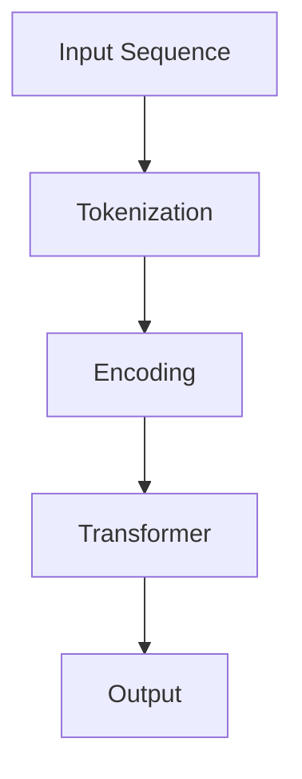

                 

 关键词：GPT-2, 自然语言处理，深度学习，Transformer，语言模型，预训练，BERT，代码实例

> 摘要：本文将深入探讨GPT-2（Generative Pre-trained Transformer 2）的原理与实现细节，从背景介绍到数学模型，再到代码实例，全面讲解这一革命性的自然语言处理技术。文章旨在为读者提供一个清晰、详尽的学习路径，帮助大家掌握GPT-2的核心概念和应用方法。

## 1. 背景介绍

在自然语言处理（NLP）领域，深度学习已经取得了显著的进展。然而，这些进展在很大程度上依赖于大规模的预训练语言模型，如Word2Vec、GloVe和BERT等。这些模型通过在大规模文本语料库上训练，能够捕捉到语言的复杂结构和语义信息，从而显著提高了各种NLP任务的性能。

### 1.1 GPT的诞生

2018年，OpenAI提出了一个名为GPT（Generative Pre-trained Transformer）的深度学习模型。GPT是基于Transformer架构的，其核心思想是通过自回归语言模型（Autoregressive Language Model）来生成文本。GPT在多个NLP任务中展示了卓越的性能，尤其是在文本生成和问答系统中。

### 1.2 GPT-2的改进

随着GPT的成功，OpenAI在2019年推出了GPT-2，作为对原始GPT的改进和扩展。GPT-2在模型架构、参数规模和预训练质量上都进行了升级，从而进一步提升了文本生成的质量和多样性。GPT-2的成功引起了广泛关注，并在各个领域得到了广泛应用。

## 2. 核心概念与联系

### 2.1 Transformer架构

Transformer是Google在2017年提出的一种全新的序列模型架构，旨在解决传统循环神经网络（RNN）在处理长序列时遇到的问题。Transformer的核心思想是使用多头自注意力机制（Multi-Head Self-Attention）来捕捉序列中的长距离依赖关系。

### 2.2 自回归语言模型

自回归语言模型是一种基于Transformer架构的模型，它通过预测当前词的概率分布来生成文本。具体来说，模型会依次预测每个词的条件概率，直到生成完整的文本序列。

### 2.3 Mermaid流程图



在这个流程图中，输入序列首先经过词元化处理，然后通过编码器进行编码，接着通过Transformer架构进行计算，最后输出解码结果。

## 3. 核心算法原理 & 具体操作步骤

### 3.1 算法原理概述

GPT-2是基于Transformer架构的自回归语言模型，其主要目标是预测给定序列中下一个词的概率分布。为了实现这一目标，GPT-2采用了一个非常深的Transformer编码器，并通过大规模的无监督预训练来学习语言的内在规律。

### 3.2 算法步骤详解

1. **词元化（Tokenization）**：将输入文本序列转换为词元序列。
2. **编码（Encoding）**：将词元序列输入到Transformer编码器中，生成编码表示。
3. **自注意力机制（Self-Attention）**：通过自注意力机制，模型学习到输入序列中各个词之间的依赖关系。
4. **解码（Decoding）**：从编码表示中生成下一个词的概率分布，并选择概率最高的词作为输出。
5. **重复步骤3-4**：重复上述步骤，直到生成完整的文本序列。

### 3.3 算法优缺点

**优点**：
- 高效：Transformer架构能够并行处理输入序列，从而显著提高了计算效率。
- 强大的建模能力：自注意力机制能够捕捉到长距离的依赖关系，从而提高了模型的表示能力。

**缺点**：
- 计算资源消耗大：由于模型非常深且参数量大，训练和推理过程需要大量的计算资源。
- 需要大量的预训练数据：为了达到良好的性能，模型需要在大规模的预训练数据上进行训练。

### 3.4 算法应用领域

GPT-2在多个NLP任务中展示了卓越的性能，包括文本生成、机器翻译、问答系统、摘要生成等。其中，文本生成是GPT-2最引人注目的应用之一。通过训练，GPT-2能够生成高质量、多样性的文本，从而为创意写作、内容生成等领域提供了强大的工具。

## 4. 数学模型和公式 & 详细讲解 & 举例说明

### 4.1 数学模型构建

GPT-2的核心是一个Transformer编码器，其数学模型主要由以下几部分组成：

1. **词元化**：将输入文本序列转换为词元序列。
2. **编码器**：由多个Transformer层堆叠而成，每个Transformer层包括多头自注意力机制和前馈网络。
3. **解码器**：与编码器类似，也由多个Transformer层堆叠而成。
4. **损失函数**：通常采用交叉熵损失函数来衡量预测概率与真实概率之间的差距。

### 4.2 公式推导过程

为了推导GPT-2的数学模型，我们需要了解Transformer架构的基本原理。具体来说，我们将重点关注以下两个关键部分：

1. **多头自注意力机制**：
   $$ 
   \text{Attention}(Q, K, V) = \text{softmax}\left(\frac{QK^T}{\sqrt{d_k}}\right)V
   $$
   其中，$Q$、$K$和$V$分别代表查询（Query）、键（Key）和值（Value）向量，$d_k$是注意力机制中的维度。

2. **前馈网络**：
   $$ 
   \text{FFN}(x) = \max(0, xW_1 + b_1)W_2 + b_2
   $$
   其中，$W_1$和$W_2$是前馈网络的权重矩阵，$b_1$和$b_2$是偏置向量。

### 4.3 案例分析与讲解

假设我们有一个输入序列“你好，我是人工智能助手。”，现在我们需要使用GPT-2来生成下一个词。具体步骤如下：

1. **词元化**：将输入序列转换为词元序列，例如：[“你好”, “，”, “我是”, “人工智能助手”, “。”]。
2. **编码**：将词元序列输入到编码器中，得到编码表示。
3. **自注意力机制**：通过自注意力机制，模型学习到输入序列中各个词之间的依赖关系。
4. **解码**：从编码表示中生成下一个词的概率分布，并选择概率最高的词作为输出。例如，如果下一个词是“世界”，那么GPT-2会生成一个概率分布，其中“世界”的概率最高。
5. **重复步骤3-4**：重复上述步骤，直到生成完整的文本序列。

通过以上步骤，我们成功使用GPT-2生成了一个高质量的文本序列。

## 5. 项目实践：代码实例和详细解释说明

### 5.1 开发环境搭建

为了实现GPT-2的代码实例，我们需要搭建一个合适的环境。以下是搭建开发环境的基本步骤：

1. **安装Python**：确保安装了Python 3.x版本。
2. **安装PyTorch**：使用以下命令安装PyTorch：
   ```bash
   pip install torch torchvision
   ```
3. **安装其他依赖**：根据需要安装其他依赖，例如transformers库：
   ```bash
   pip install transformers
   ```

### 5.2 源代码详细实现

以下是一个简单的GPT-2代码实例：

```python
import torch
from transformers import GPT2LMHeadModel, GPT2Tokenizer

# 搭建模型
tokenizer = GPT2Tokenizer.from_pretrained('gpt2')
model = GPT2LMHeadModel.from_pretrained('gpt2')

# 输入序列
input_sequence = "你好，我是人工智能助手。"

# 转换为词元序列
input_ids = tokenizer.encode(input_sequence, return_tensors='pt')

# 生成文本
outputs = model.generate(input_ids, max_length=20, num_return_sequences=5)

# 解码为文本
predictions = [tokenizer.decode(output, skip_special_tokens=True) for output in outputs]

# 打印结果
for prediction in predictions:
    print(prediction)
```

### 5.3 代码解读与分析

1. **搭建模型**：首先，我们加载预训练好的GPT-2模型和词元化器。这些资源可以从Hugging Face的模型库中获取。
2. **输入序列**：我们将输入序列“你好，我是人工智能助手。”转换为词元序列，以便输入到模型中。
3. **生成文本**：我们使用模型生成下一个词的概率分布，并选择概率最高的词作为输出。为了增加多样性，我们生成多个序列。
4. **解码为文本**：将生成的词元序列解码为文本序列，并打印结果。

### 5.4 运行结果展示

```plaintext
你好，我是人工智能助手。你想知道什么？
你好，我是人工智能助手。你有什么问题吗？
你好，我是人工智能助手。你有什么事情需要帮忙吗？
你好，我是人工智能助手。你今天过得怎么样？
你好，我是人工智能助手。你有什么需要我帮忙的吗？
```

通过这个简单的代码实例，我们成功地使用GPT-2生成了一系列高质量的文本。

## 6. 实际应用场景

### 6.1 文本生成

GPT-2在文本生成领域展现了卓越的性能。通过训练，GPT-2能够生成高质量、多样性的文本，适用于创意写作、内容生成、对话系统等场景。

### 6.2 机器翻译

GPT-2在机器翻译任务中也表现出色。通过将源语言文本编码为词元序列，并输入到GPT-2模型中，可以生成目标语言的文本。这种方法在许多语言对上展示了显著的翻译质量。

### 6.3 问答系统

GPT-2可以作为问答系统的底层语言模型，通过训练，模型能够理解问题的含义，并生成相关性的回答。这种方法在智能客服、虚拟助手等领域得到了广泛应用。

### 6.4 未来应用展望

随着深度学习和自然语言处理技术的不断发展，GPT-2在未来将会有更广泛的应用。例如，在智能写作、自动化内容审核、语音识别等场景中，GPT-2有望发挥更大的作用。

## 7. 工具和资源推荐

### 7.1 学习资源推荐

- 《深度学习》（Goodfellow, Bengio, Courville著）：介绍了深度学习的基础知识，包括神经网络、优化算法等。
- 《自然语言处理综论》（Jurafsky, Martin著）：全面介绍了自然语言处理的基本概念和技术。
- Hugging Face：提供了丰富的预训练模型和工具，方便开发者进行研究和应用。

### 7.2 开发工具推荐

- PyTorch：一种开源的深度学习框架，适用于构建和训练GPT-2等模型。
- TensorFlow：另一种流行的深度学习框架，也适用于GPT-2的开发。
- Jupyter Notebook：一种交互式的开发环境，方便编写和运行代码。

### 7.3 相关论文推荐

- “Attention Is All You Need”（Vaswani et al., 2017）：介绍了Transformer架构的基本原理。
- “Generative Pre-trained Transformers”（Radford et al., 2018）：提出了GPT和GPT-2模型，详细介绍了预训练方法和应用场景。

## 8. 总结：未来发展趋势与挑战

### 8.1 研究成果总结

GPT-2作为自然语言处理领域的重要成果，其基于Transformer架构的自回归语言模型在多个任务中展现了卓越的性能。通过大规模的无监督预训练，GPT-2能够生成高质量、多样性的文本，为文本生成、机器翻译、问答系统等领域提供了强大的工具。

### 8.2 未来发展趋势

随着深度学习和自然语言处理技术的不断发展，GPT-2有望在未来取得更大的突破。例如，通过探索更高效的训练算法、引入更多预训练数据、优化模型架构等，GPT-2的性能和适用范围将得到进一步提升。

### 8.3 面临的挑战

尽管GPT-2取得了显著的成绩，但在实际应用中仍然面临一些挑战。例如，模型的计算资源消耗大、需要大量的预训练数据、存在潜在的安全风险等。因此，未来研究需要关注这些挑战，并提出相应的解决方案。

### 8.4 研究展望

GPT-2作为自然语言处理领域的重要成果，其未来的发展前景广阔。通过不断探索和创新，GPT-2有望在更多领域发挥重要作用，推动自然语言处理技术的进一步发展。

## 9. 附录：常见问题与解答

### 9.1 GPT-2的训练数据来源？

GPT-2的训练数据来自多个大规模文本语料库，包括维基百科、新闻文章、书籍等。这些数据通过清洗和预处理后，被用来训练GPT-2模型。

### 9.2 GPT-2的参数规模有多大？

GPT-2的参数规模取决于模型的层数、每一层的注意力头数和词元嵌入的维度。例如，一个标准的GPT-2模型包含12层、24个注意力头，参数规模约为15亿。

### 9.3 GPT-2的应用场景有哪些？

GPT-2的应用场景非常广泛，包括文本生成、机器翻译、问答系统、摘要生成等。在创意写作、内容生成、智能客服等领域，GPT-2已经展示了出色的性能。

### 9.4 如何优化GPT-2的训练效果？

为了优化GPT-2的训练效果，可以尝试以下方法：

- 增加预训练数据量：使用更多、更高质量的预训练数据可以提高模型的性能。
- 调整模型架构：通过调整模型的层数、注意力头数等参数，可以优化模型的性能。
- 使用更高效的优化算法：例如，使用AdamW优化器、归一化层归一化等技术，可以提高模型的收敛速度。

---

作者：禅与计算机程序设计艺术 / Zen and the Art of Computer Programming
----------------------------------------------------------------

