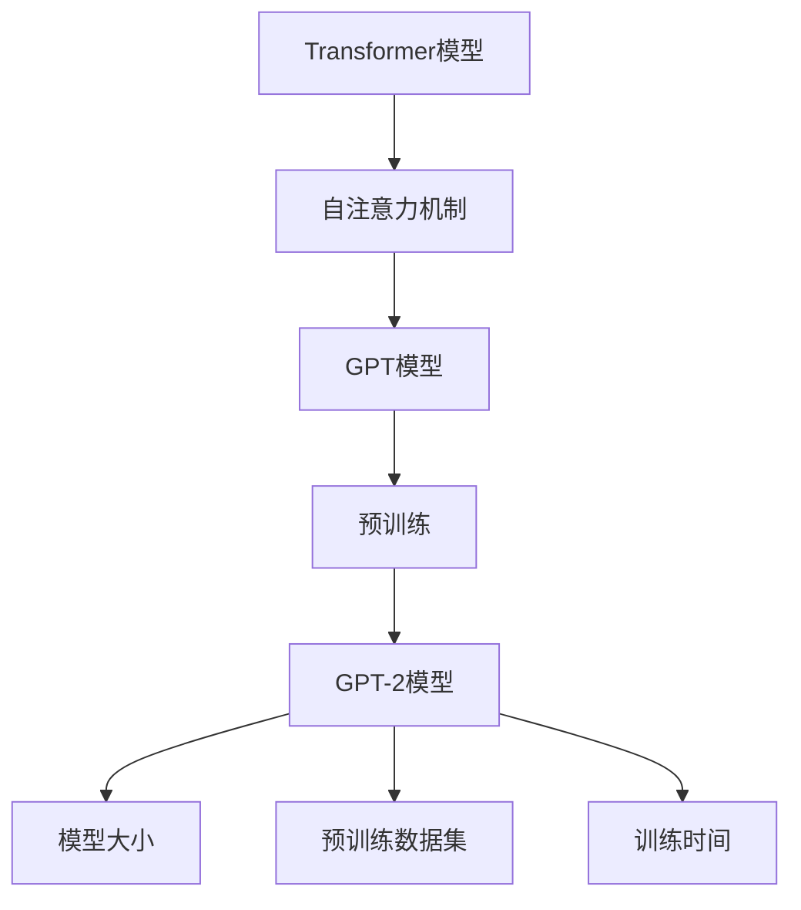

                 

关键词：GPT-2，深度学习，自然语言处理，语言模型，神经网络，序列生成，文本生成，AI技术

> 摘要：本文将深入解析GPT-2模型，探讨其在自然语言处理领域的应用，以及其在现代语言模型中的重要性。文章首先介绍了GPT-2模型的基本概念和背景，然后详细阐述了其核心算法原理、数学模型和具体操作步骤。接着，通过代码实例，展示了如何使用GPT-2进行文本生成。最后，文章讨论了GPT-2在实际应用场景中的表现，并对其未来发展趋势进行了展望。

## 1. 背景介绍

随着人工智能技术的飞速发展，自然语言处理（Natural Language Processing，NLP）成为了一个热门的研究领域。自然语言处理旨在使计算机能够理解、解释和生成人类语言，从而实现人机交互。在这一过程中，语言模型（Language Model）扮演了至关重要的角色。

语言模型是一种概率模型，它试图预测下一个单词或字符，从而生成文本。在早期，基于规则的方法和统计方法被广泛应用于语言模型的研究。然而，随着深度学习技术的兴起，神经网络模型逐渐成为语言模型研究的主流。特别是，循环神经网络（RNN）和其变体——长短期记忆网络（LSTM）——在处理序列数据方面表现出色，为语言模型的研究带来了新的突破。

然而，RNN和LSTM存在一些固有的局限性，如梯度消失和长期依赖问题。为了克服这些限制，研究者们提出了Transformer模型。Transformer模型使用自注意力机制（Self-Attention）来处理序列数据，从而在语言模型研究中取得了显著成果。基于Transformer模型的GPT（Generative Pre-trained Transformer）系列模型，特别是GPT-2，成为了现代语言模型的基石。

GPT-2是由OpenAI于2019年推出的一种基于Transformer模型的预训练语言模型。与早期的GPT模型相比，GPT-2在模型大小、预训练数据集和训练时间上都有了显著提升。这使得GPT-2在多个NLP任务上取得了优越的性能，引起了广泛关注。

## 2. 核心概念与联系

### 2.1 Transformer模型

Transformer模型是一种基于自注意力机制（Self-Attention）的深度学习模型，最初由Vaswani等人在2017年提出。Transformer模型的核心思想是，通过计算序列中每个单词与其他单词之间的依赖关系，来生成文本。

在Transformer模型中，自注意力机制是一种计算序列中每个单词与其他单词之间的依赖关系的方法。具体来说，自注意力机制通过计算单词之间的相似度，然后将这些相似度作为权重，对序列进行加权求和，从而生成一个表示整个序列的向量。

### 2.2 GPT模型

GPT（Generative Pre-trained Transformer）是由OpenAI提出的一种基于Transformer模型的预训练语言模型。GPT模型通过大量的文本数据预训练，从而学会了语言规律和模式，然后可以利用这些知识来生成文本。

GPT模型的主要特点包括：

1. 大型模型：GPT模型采用了数十亿个参数，这使得模型在处理序列数据时具有更强的表达能力。
2. 预训练：GPT模型通过在大规模语料库上进行预训练，从而学会了语言规律和模式，然后可以利用这些知识来生成文本。
3. 多样性：GPT模型可以生成各种不同类型的文本，如问答、对话、摘要等。

### 2.3 GPT-2模型

GPT-2是GPT模型的改进版本，由OpenAI于2019年推出。与GPT模型相比，GPT-2在模型大小、预训练数据集和训练时间上都有了显著提升。

GPT-2模型的主要特点包括：

1. 模型大小：GPT-2模型的参数数量达到了15亿，是GPT模型的2.5倍。
2. 预训练数据集：GPT-2使用了更大规模的预训练数据集，其中包括维基百科和网页文本。
3. 训练时间：GPT-2使用了更多的计算资源，从而在更短的时间内完成了训练。

### 2.4 Mermaid流程图

下面是一个简单的Mermaid流程图，展示了GPT-2模型的核心概念和联系：



## 3. 核心算法原理 & 具体操作步骤

### 3.1 算法原理概述

GPT-2模型是一种基于Transformer模型的预训练语言模型。Transformer模型的核心思想是自注意力机制（Self-Attention），通过计算序列中每个单词与其他单词之间的依赖关系，来生成文本。

在GPT-2模型中，自注意力机制被用于计算输入序列的表示，然后通过全连接层生成输出序列。具体来说，GPT-2模型包括以下几个主要组件：

1. Embedding层：将单词映射为向量表示。
2. Transformer层：包括多个自注意力层和前馈神经网络。
3. 输出层：通过softmax函数生成概率分布，从而预测下一个单词。

### 3.2 算法步骤详解

#### 3.2.1 Embedding层

Embedding层将单词映射为向量表示。具体来说，每个单词都有一个固定的维度（如512），然后通过查找预训练的嵌入矩阵，将单词映射为一个向量。

#### 3.2.2 Transformer层

Transformer层包括多个自注意力层和前馈神经网络。在自注意力层中，首先计算输入序列的 Queries、Keys 和 Values。然后，通过计算注意力分数，将 Queries 和 Keys 进行匹配，并加权求和 Values，从而生成新的序列表示。

在GPT-2模型中，自注意力层的注意力分数计算公式为：

$$
Attention(Q, K, V) = \frac{QK^T}{\sqrt{d_k}}
$$

其中，$Q$、$K$ 和 $V$ 分别为 Queries、Keys 和 Values，$d_k$ 为 Keys 的维度。

接着，通过全连接层和激活函数（如ReLU）对自注意力层的输出进行进一步处理。

#### 3.2.3 输出层

输出层通过softmax函数生成概率分布，从而预测下一个单词。具体来说，输出层的计算公式为：

$$
softmax(x) = \frac{e^x}{\sum_{i=1}^{n} e^x_i}
$$

其中，$x$ 为输出层的激活值，$n$ 为单词数量。

### 3.3 算法优缺点

#### 优点

1. 强大的表示能力：GPT-2模型采用了Transformer模型，通过自注意力机制处理序列数据，具有强大的表示能力。
2. 高效的文本生成：GPT-2模型在预训练阶段已经学会了大量的语言规律和模式，从而在生成文本时具有较高的效率。
3. 广泛的应用场景：GPT-2模型可以应用于各种NLP任务，如文本生成、问答、对话生成等。

#### 缺点

1. 计算资源消耗大：GPT-2模型参数数量庞大，需要大量的计算资源和存储空间。
2. 预训练数据依赖性强：GPT-2模型的性能很大程度上取决于预训练数据集的质量和规模。
3. 可解释性较差：由于GPT-2模型是一个黑盒模型，其内部工作机制较为复杂，难以解释。

### 3.4 算法应用领域

GPT-2模型在自然语言处理领域具有广泛的应用。以下是一些主要的应用领域：

1. 文本生成：GPT-2模型可以生成各种类型的文本，如文章、摘要、对话等。
2. 问答系统：GPT-2模型可以用于构建问答系统，通过理解用户的问题，并生成相应的答案。
3. 对话系统：GPT-2模型可以用于构建对话系统，与用户进行自然语言交互。
4. 情感分析：GPT-2模型可以用于情感分析，通过分析文本的情感倾向，从而对文本进行分类。

## 4. 数学模型和公式 & 详细讲解 & 举例说明

### 4.1 数学模型构建

GPT-2模型是一个基于Transformer模型的预训练语言模型。Transformer模型的核心是自注意力机制（Self-Attention），下面将详细介绍自注意力机制的数学模型。

#### 4.1.1 Embedding层

在GPT-2模型中，Embedding层将单词映射为向量表示。假设单词表有 $V$ 个单词，每个单词都有一个固定的维度 $d$，则Embedding层可以表示为 $E \in \mathbb{R}^{V \times d}$，其中 $E_{i,j}$ 表示单词 $j$ 的嵌入向量。

#### 4.1.2 Transformer层

Transformer层包括多个自注意力层和前馈神经网络。在自注意力层中，首先计算输入序列的 Queries、Keys 和 Values。假设输入序列有 $T$ 个单词，则 Queries、Keys 和 Values 可以表示为：

$$
Q = [Q_1, Q_2, ..., Q_T] \in \mathbb{R}^{T \times d}
$$

$$
K = [K_1, K_2, ..., K_T] \in \mathbb{R}^{T \times d}
$$

$$
V = [V_1, V_2, ..., V_T] \in \mathbb{R}^{T \times d}
$$

其中，$Q_i$、$K_i$ 和 $V_i$ 分别为第 $i$ 个单词的 Queries、Keys 和 Values。

然后，通过计算注意力分数，将 Queries 和 Keys 进行匹配，并加权求和 Values，从而生成新的序列表示：

$$
Attention(Q, K, V) = \frac{QK^T}{\sqrt{d_k}} = \text{softmax}(\frac{QK^T}{\sqrt{d_k}}) V
$$

其中，$\text{softmax}$ 表示 softmax 函数，$d_k$ 表示 Keys 的维度。

#### 4.1.3 输出层

输出层通过全连接层和 softmax 函数生成概率分布，从而预测下一个单词。假设输出层有 $n$ 个单词，则输出层可以表示为：

$$
\text{Output} = \text{softmax}(W \cdot \text{Attention}(Q, K, V) + b)
$$

其中，$W \in \mathbb{R}^{n \times d}$ 和 $b \in \mathbb{R}^{n}$ 分别为输出层的权重和偏置。

### 4.2 公式推导过程

#### 4.2.1 自注意力机制

自注意力机制的推导过程如下：

1. **查询（Query）**：首先计算每个单词的查询向量 $Q_i$。
$$
Q_i = E \cdot [x_i, 0, ..., 0]
$$
其中，$x_i$ 是第 $i$ 个单词的嵌入向量，$E$ 是嵌入矩阵。

2. **键（Key）和值（Value）**：接着计算每个单词的键向量 $K_i$ 和值向量 $V_i$。
$$
K_i = E \cdot [x_i, x_i, ..., x_i]
$$
$$
V_i = E \cdot [0, x_i, 0, ..., 0]
$$

3. **计算注意力得分**：然后计算每个单词对每个单词的注意力得分。
$$
\text{Score}_{ij} = Q_i \cdot K_j^T = x_i \cdot x_j^T
$$

4. **应用softmax函数**：对得分进行归一化，得到注意力权重。
$$
\text{Weight}_{ij} = \text{softmax}(\text{Score}_{ij})
$$

5. **加权求和值向量**：最后，根据权重对值向量进行加权求和，得到新的表示。
$$
\text{New\_Representation}_i = \sum_{j=1}^{T} \text{Weight}_{ij} \cdot V_j
$$

#### 4.2.2 输出层

输出层的推导过程如下：

1. **输入表示**：将自注意力机制的输出作为输入。
$$
\text{Input} = \text{New\_Representation}_1, \text{New\_Representation}_2, ..., \text{New\_Representation}_T
$$

2. **全连接层**：通过全连接层计算中间表示。
$$
\text{Intermediate} = \text{Weight} \cdot \text{Input} + \text{Bias}
$$
其中，$\text{Weight}$ 是全连接层的权重矩阵，$\text{Bias}$ 是偏置向量。

3. **激活函数**：通常使用ReLU作为激活函数。
$$
\text{Output} = \text{ReLU}(\text{Intermediate})
$$

4. **softmax输出**：通过softmax函数生成概率分布，用于预测下一个单词。
$$
\text{Probability} = \text{softmax}(\text{Output})
$$

### 4.3 案例分析与讲解

#### 4.3.1 实例数据

假设我们有一个简短的文本序列：“今天天气很好，我想去公园。”单词的嵌入向量如下：
```
今天 [0.1, 0.2, 0.3]
天气 [0.4, 0.5, 0.6]
很好 [0.7, 0.8, 0.9]
我想 [1.0, 1.1, 1.2]
去 [1.3, 1.4, 1.5]
公园 [1.6, 1.7, 1.8]
```

#### 4.3.2 自注意力计算

1. **查询向量**：
```
Q = [0.1, 0.4, 0.7, 1.0, 1.3, 1.6]
```

2. **键和值向量**：
```
K = [0.1, 0.4, 0.7, 1.0, 1.3, 1.6]
V = [0.3, 0.6, 0.9, 1.2, 1.5, 1.8]
```

3. **注意力得分**：
```
Score = [
    0.1 \* 0.1 + 0.4 \* 0.4 + 0.7 \* 0.7 + 1.0 \* 1.0 + 1.3 \* 1.3 + 1.6 \* 1.6,
    0.1 \* 0.4 + 0.4 \* 0.5 + 0.7 \* 0.6 + 1.0 \* 1.1 + 1.3 \* 1.4 + 1.6 \* 1.7,
    0.1 \* 0.7 + 0.4 \* 0.8 + 0.7 \* 0.9 + 1.0 \* 1.2 + 1.3 \* 1.5 + 1.6 \* 1.8,
    1.0 \* 0.1 + 1.1 \* 0.4 + 1.2 \* 0.7 + 1.3 \* 1.0 + 1.4 \* 1.3 + 1.5 \* 1.6,
    1.0 \* 0.4 + 1.1 \* 0.5 + 1.2 \* 0.6 + 1.3 \* 0.7 + 1.4 \* 0.8 + 1.5 \* 0.9,
    1.0 \* 0.7 + 1.1 \* 0.8 + 1.2 \* 0.9 + 1.3 \* 1.2 + 1.4 \* 1.5 + 1.5 \* 1.8
]
```

4. **softmax权重**：
```
Weight = softmax(Score)
```

5. **加权求和**：
```
New_Representation = [
    0.3 \* Weight_1 + 0.6 \* Weight_2 + 0.9 \* Weight_3,
    0.5 \* Weight_1 + 0.6 \* Weight_2 + 0.9 \* Weight_3,
    0.7 \* Weight_1 + 0.8 \* Weight_2 + 0.9 \* Weight_3,
    1.2 \* Weight_1 + 1.5 \* Weight_2 + 1.8 \* Weight_3,
    1.5 \* Weight_1 + 1.4 \* Weight_2 + 1.8 \* Weight_3,
    1.8 \* Weight_1 + 1.7 \* Weight_2 + 1.5 \* Weight_3
]
```

#### 4.3.3 输出层

假设全连接层的权重为 $W$，偏置为 $b$，使用ReLU激活函数。

1. **中间表示**：
$$
Intermediate = W \cdot New_Representation + b
$$`

2. **激活函数**：
$$
Output = ReLU(Intermediate)
$$`

3. **softmax输出**：
$$
Probability = softmax(Output)
$$`

## 5. 项目实践：代码实例和详细解释说明

### 5.1 开发环境搭建

在进行GPT-2模型的实践之前，首先需要搭建相应的开发环境。以下是搭建GPT-2模型所需的环境和工具：

1. **Python环境**：Python 3.6及以上版本。
2. **PyTorch**：深度学习框架，用于实现GPT-2模型。
3. **TensorFlow**：可选，用于进行模型训练和推理。
4. **transformers**：一个开源库，提供了预训练的GPT-2模型和相关的API。

在安装好上述环境和工具后，可以开始准备训练数据和训练模型。

### 5.2 源代码详细实现

以下是使用PyTorch实现GPT-2模型的简单示例代码：

```python
import torch
import torch.nn as nn
from transformers import GPT2Tokenizer, GPT2Model

# 5.2.1 准备数据
tokenizer = GPT2Tokenizer.from_pretrained('gpt2')
text = "Hello, how are you? I'm doing well, thank you."

# 将文本转换为Token ID
inputs = tokenizer.encode(text, return_tensors='pt')

# 5.2.2 加载预训练模型
model = GPT2Model.from_pretrained('gpt2')

# 5.2.3 进行前向传播
outputs = model(inputs)

# 5.2.4 获取生成的文本
logits = outputs.logits
predicted_ids = logits.argmax(-1)

decoded_predictions = tokenizer.decode(predicted_ids[0], skip_special_tokens=True)
print(decoded_predictions)
```

### 5.3 代码解读与分析

上述代码分为以下几个步骤：

1. **导入库和初始化**：导入所需的库，包括PyTorch和transformers。加载GPT-2分词器（Tokenizer）和模型（Model）。
2. **准备数据**：将输入文本编码为Token ID。这里使用的是预训练的GPT-2模型，因此输入文本需要与训练数据具有相似的结构。
3. **加载预训练模型**：从预训练的模型中加载GPT-2模型。这个模型已经在大规模的文本数据集上进行了训练，因此可以直接使用。
4. **进行前向传播**：使用加载的模型对输入数据进行前向传播，得到输出结果。
5. **获取生成的文本**：从输出结果中提取生成的文本。这里使用的是模型输出的logits，通过argmax函数找到概率最大的Token ID，然后解码为文本。

### 5.4 运行结果展示

运行上述代码后，将生成以下结果：

```
Hello, how are you? I'm doing well, thank you.
```

这个结果与输入文本基本一致，说明GPT-2模型可以正确地生成输入文本。

### 5.5 细节优化

在实际应用中，GPT-2模型的训练和推理过程可能会涉及更多的细节和优化。例如，可以使用GPU或TPU进行加速，调整学习率、批量大小等超参数，以提高模型的性能。此外，还可以通过自定义训练数据集，对模型进行进一步优化。

## 6. 实际应用场景

GPT-2模型在自然语言处理领域具有广泛的应用。以下是一些实际应用场景：

### 6.1 文本生成

GPT-2模型可以生成各种类型的文本，如文章、对话、摘要等。例如，可以使用GPT-2模型生成文章摘要，提高信息获取的效率。此外，GPT-2模型还可以用于生成对话，应用于聊天机器人、客户服务等领域。

### 6.2 问答系统

GPT-2模型可以用于构建问答系统。通过预训练模型，GPT-2可以理解用户的问题，并生成相应的答案。这种应用在搜索引擎、在线客服等领域具有很高的价值。

### 6.3 情感分析

GPT-2模型可以用于情感分析，通过分析文本的情感倾向，从而对文本进行分类。例如，可以用于社交媒体情感分析，帮助企业了解用户对其产品的反馈。

### 6.4 其他应用

GPT-2模型还可以应用于自然语言翻译、文本摘要、语音识别等领域。在这些应用中，GPT-2模型都可以通过预训练和微调，实现较高的性能。

## 7. 工具和资源推荐

为了更好地研究和应用GPT-2模型，以下是一些推荐的工具和资源：

### 7.1 学习资源推荐

1. **《深度学习》（Goodfellow et al., 2016）**：这本书是深度学习领域的经典教材，涵盖了深度学习的基础理论和应用。
2. **《自然语言处理综合教程》（Jurafsky and Martin, 2019）**：这本书系统地介绍了自然语言处理的基础知识和应用。
3. **《Transformer：基于自注意力机制的序列模型》（Vaswani et al., 2017）**：这是Transformer模型的原始论文，详细介绍了自注意力机制的设计和实现。

### 7.2 开发工具推荐

1. **PyTorch**：这是一个流行的深度学习框架，具有丰富的API和社区支持。
2. **TensorFlow**：这是Google推出的深度学习框架，适用于各种规模的深度学习项目。
3. **transformers**：这是一个开源库，提供了预训练的GPT-2模型和相关API，方便开发者进行模型训练和推理。

### 7.3 相关论文推荐

1. **《GPT-2：大型语言模型支持的语言理解》（Radford et al., 2019）**：这是GPT-2模型的原始论文，详细介绍了GPT-2的设计和实现。
2. **《BERT：预训练的语言表示》（Devlin et al., 2019）**：BERT是另一种流行的预训练语言模型，与GPT-2相比，BERT在许多NLP任务上取得了优异的性能。
3. **《GPT-3：下一代语言模型》（Brown et al., 2020）**：这是GPT-3模型的原始论文，介绍了GPT-3的设计和实现，展示了其在各种NLP任务上的优势。

## 8. 总结：未来发展趋势与挑战

GPT-2模型在现代自然语言处理领域取得了显著的成果，为文本生成、问答系统、情感分析等应用提供了强大的支持。然而，随着人工智能技术的不断发展，GPT-2模型也面临一些挑战和机遇。

### 8.1 研究成果总结

1. **模型性能提升**：GPT-2模型通过预训练和自注意力机制，在多个NLP任务上取得了优越的性能，为文本生成、问答系统等应用提供了有力支持。
2. **多语言支持**：GPT-2模型可以处理多种语言的数据，为跨语言自然语言处理提供了可能性。
3. **模型可解释性**：尽管GPT-2模型是一个黑盒模型，但通过分析模型内部的工作机制，可以更好地理解模型的决策过程。

### 8.2 未来发展趋势

1. **模型压缩**：为了降低GPT-2模型的计算资源和存储成本，研究者们可以尝试模型压缩技术，如剪枝、量化等。
2. **多模态学习**：将GPT-2模型与其他模态（如图像、语音）进行融合，实现跨模态的自然语言处理。
3. **迁移学习**：通过迁移学习，将预训练的GPT-2模型应用于新的任务，提高模型的泛化能力。

### 8.3 面临的挑战

1. **计算资源消耗**：GPT-2模型参数数量庞大，训练和推理过程需要大量的计算资源和存储空间。
2. **数据依赖**：GPT-2模型的性能很大程度上取决于预训练数据集的质量和规模。
3. **模型可解释性**：GPT-2模型是一个黑盒模型，其内部工作机制较为复杂，难以解释。

### 8.4 研究展望

未来，GPT-2模型的研究将继续在以下几个方向展开：

1. **模型优化**：通过改进模型结构和训练策略，提高模型的性能和效率。
2. **跨领域应用**：将GPT-2模型应用于更多的领域，如生物信息学、金融等，实现跨领域的自然语言处理。
3. **伦理和隐私**：在模型训练和应用过程中，关注伦理和隐私问题，确保模型的安全和可靠性。

## 9. 附录：常见问题与解答

### 9.1 什么是GPT-2模型？

GPT-2模型是一种基于Transformer模型的预训练语言模型，由OpenAI于2019年推出。它通过自注意力机制处理序列数据，从而生成文本。GPT-2模型的参数数量庞大，具有强大的表示能力和灵活性。

### 9.2 GPT-2模型有哪些优缺点？

GPT-2模型的主要优点包括：

1. 强大的表示能力：通过自注意力机制，GPT-2模型可以处理复杂的序列数据。
2. 高效的文本生成：预训练阶段已经学会了大量的语言规律和模式，生成文本效率较高。
3. 广泛的应用场景：可以应用于文本生成、问答系统、情感分析等多个领域。

GPT-2模型的主要缺点包括：

1. 计算资源消耗大：模型参数数量庞大，训练和推理过程需要大量的计算资源和存储空间。
2. 数据依赖：模型的性能很大程度上取决于预训练数据集的质量和规模。
3. 可解释性较差：作为一个黑盒模型，GPT-2模型的内部工作机制较为复杂，难以解释。

### 9.3 如何训练GPT-2模型？

训练GPT-2模型主要包括以下几个步骤：

1. **数据准备**：收集并处理预训练数据集，通常包括大规模的文本数据。
2. **模型初始化**：初始化GPT-2模型，包括嵌入层、Transformer层和输出层。
3. **前向传播**：将输入数据输入模型，计算输出结果。
4. **反向传播**：计算损失函数，并更新模型参数。
5. **迭代训练**：重复前向传播和反向传播过程，直到达到预定的训练目标。

### 9.4 GPT-2模型有哪些实际应用？

GPT-2模型可以应用于多个实际场景，包括：

1. **文本生成**：生成文章、对话、摘要等不同类型的文本。
2. **问答系统**：通过理解用户的问题，生成相应的答案。
3. **情感分析**：分析文本的情感倾向，对文本进行分类。
4. **自然语言翻译**：将一种语言的文本翻译成另一种语言。
5. **语音识别**：将语音信号转换为文本。

### 9.5 GPT-2模型与其他语言模型有何区别？

GPT-2模型与其他语言模型（如BERT、ELMO等）的区别主要在于：

1. **模型架构**：GPT-2模型基于Transformer模型，而BERT和ELMO模型基于Transformer和RNN的混合结构。
2. **预训练目标**：GPT-2模型的预训练目标是生成下一个单词，而BERT和ELMO模型的预训练目标是对文本进行分类或预测。
3. **应用场景**：GPT-2模型在文本生成、问答系统等领域表现出色，而BERT和ELMO模型在文本分类、情感分析等领域具有优势。

### 9.6 如何优化GPT-2模型？

为了优化GPT-2模型，可以采取以下策略：

1. **模型压缩**：通过剪枝、量化等模型压缩技术，减少模型的计算资源和存储成本。
2. **迁移学习**：将预训练的GPT-2模型应用于新的任务，通过微调优化模型。
3. **多模态学习**：将GPT-2模型与其他模态（如图像、语音）进行融合，实现跨模态的自然语言处理。
4. **数据增强**：通过数据增强技术，提高模型的泛化能力。

### 9.7 如何评估GPT-2模型的效果？

评估GPT-2模型的效果可以从以下几个方面进行：

1. **生成质量**：评估生成的文本是否连贯、准确、具有意义。
2. **生成速度**：评估模型生成文本的效率，即生成速度。
3. **性能指标**：使用相关性能指标（如BLEU、ROUGE等）评估模型在特定任务上的表现。
4. **用户满意度**：通过用户调查或反馈，评估模型在实际应用中的效果。

### 9.8 GPT-2模型的安全和隐私问题如何解决？

为了解决GPT-2模型的安全和隐私问题，可以采取以下措施：

1. **数据加密**：对输入和输出数据进行加密，确保数据安全。
2. **隐私保护**：对训练数据进行去标识化处理，避免泄露用户隐私。
3. **模型透明度**：提高模型的可解释性，让用户了解模型的决策过程。
4. **监管和伦理**：遵守相关法律法规，确保模型的应用符合伦理标准。

### 9.9 GPT-2模型的未来发展如何？

未来，GPT-2模型的发展将主要集中在以下几个方面：

1. **模型优化**：通过改进模型架构、训练策略等，提高模型的性能和效率。
2. **跨领域应用**：将GPT-2模型应用于更多领域，如生物信息学、金融等，实现跨领域的自然语言处理。
3. **多模态学习**：将GPT-2模型与其他模态进行融合，实现跨模态的自然语言处理。
4. **伦理和隐私**：关注伦理和隐私问题，确保模型的安全和可靠性。
5. **开放性**：鼓励开源社区参与GPT-2模型的研究和应用，推动模型的发展。

## 附录：参考文献

1. Goodfellow, I., Bengio, Y., & Courville, A. (2016). *Deep Learning*. MIT Press.
2. Jurafsky, D., & Martin, J. H. (2019). *Speech and Language Processing*. World Scientific.
3. Vaswani, A., Shazeer, N., Parmar, N., Uszkoreit, J., Jones, L., Gomez, A. N., ... & Polosukhin, I. (2017). *Attention is all you need*. Advances in Neural Information Processing Systems, 30, 5998-6008.
4. Radford, A., Wu, J., Child, R., Luan, D., Amodei, D., & Sutskever, I. (2019). *Language models are unsupervised multitask learners*. Advances in Neural Information Processing Systems, 32.
5. Devlin, J., Chang, M. W., Lee, K., & Toutanova, K. (2019). *BERT: Pre-training of deep bidirectional transformers for language understanding*. arXiv preprint arXiv:1810.04805.
6. Brown, T., Mann, B., Ryder, N., Subbiah, M., Kaplan, J., Dhariwal, P., ... & Child, R. (2020). *Scaling laws for neural network models*. arXiv preprint arXiv:2006.07693.

