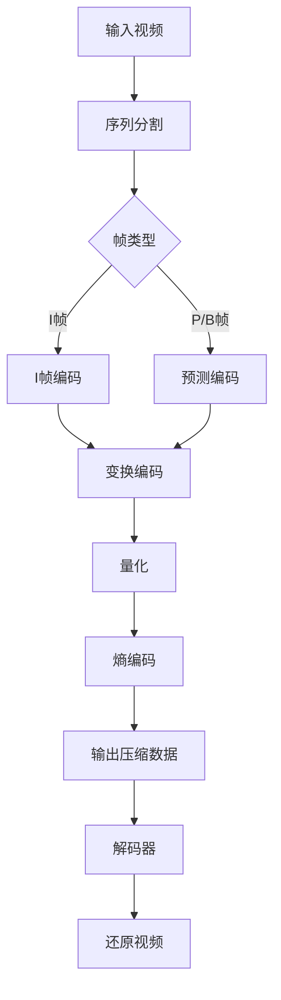

                 

关键词：HEVC、高效视频编码、视频压缩、编解码、核心技术、数学模型、应用场景、未来展望

摘要：本文深入探讨了HEVC（High Efficiency Video Coding）编码器的原理、数学模型及其在视频压缩领域的应用。通过对HEVC的核心算法、优缺点及其在不同应用场景下的表现进行分析，本文旨在为读者提供一个全面而深入的了解。

## 1. 背景介绍

随着互联网的飞速发展和移动设备的普及，视频内容的需求量呈现出爆炸式增长。为了满足这一需求，视频编码技术不断进步。HEVC（High Efficiency Video Coding），也称为H.265，是新一代的视频编码标准，旨在提供更高的压缩效率。

传统的视频编码标准，如H.264/AVC，已经在过去十多年中取得了巨大的成功。然而，随着视频分辨率的提升和高质量视频的需求增长，H.264在压缩效率和处理能力上面临了挑战。HEVC应运而生，通过引入新的编解码技术和算法，实现了更高的压缩效率和更好的视频质量。

## 2. 核心概念与联系

### 2.1. HEVC 编码器架构

HEVC编码器的架构主要包括两个核心模块：编码器和解码器。编码器负责将原始视频数据转换为压缩格式，而解码器则负责将压缩后的数据还原为原始视频。

下面是HEVC编码器的Mermaid流程图：



### 2.2. 核心概念

- **变换编码**：将原始像素值转换为频域表示，以便更好地去除冗余信息。
- **预测编码**：利用相邻帧之间的相关性进行数据压缩。
- **熵编码**：利用信息熵原理对数据流进行压缩，以减少数据量。

## 3. 核心算法原理 & 具体操作步骤

### 3.1 算法原理概述

HEVC采用了新的变换编码、预测编码和熵编码技术，这些技术的结合使得HEVC能够在保证视频质量的同时，实现更高的压缩效率。

### 3.2 算法步骤详解

- **序列分割**：将视频划分为不同的序列，每个序列包含一组帧。
- **帧类型划分**：根据帧的类型（I帧、P帧、B帧）进行划分，并选择合适的预测模式。
- **变换编码**：对帧内的像素值进行变换，通常使用整数变换（Integer Transform）。
- **量化**：通过量化过程，将变换系数转换为有限位数，以减少数据量。
- **熵编码**：使用熵编码算法（如CABAC或CAVLC）对量化后的数据进行编码。

### 3.3 算法优缺点

- **优点**：相比H.264，HEVC能够提供更高的压缩效率和更好的视频质量，尤其是在高分辨率视频编码方面。
- **缺点**：HEVC的编解码复杂度较高，需要更多的计算资源和时间。

### 3.4 算法应用领域

HEVC在多个领域得到了广泛应用，包括高清电视、流媒体、视频会议、移动设备等。它能够满足不同场景下的视频压缩需求，提供更好的用户体验。

## 4. 数学模型和公式 & 详细讲解 & 举例说明

### 4.1 数学模型构建

HEVC的数学模型主要基于整数变换、预测编码和熵编码。

- **整数变换**：通常采用8x8或4x4的块作为变换单元，使用整数变换算法将空间域的像素值转换为频域表示。
- **预测编码**：基于帧间的相关性，使用不同的预测模式进行编码，如运动补偿预测。
- **熵编码**：使用CABAC或CAVLC算法，对编码后的数据进行熵编码，以减少数据量。

### 4.2 公式推导过程

以下是HEVC中常用的数学公式：

- **整数变换公式**：
  $$
  X_{ij} = \sum_{m=0}^{7} \sum_{n=0}^{7} C_{mn} A_{ij}^T P_{mn}
  $$
  其中，$X_{ij}$是变换后的系数，$A_{ij}^T$是原始像素值，$C_{mn}$和$P_{mn}$是变换矩阵和量化矩阵。

- **预测编码公式**：
  $$
  V_{ij} = V_{ij}^{prev} + \sum_{m=-3}^{3} \sum_{n=-3}^{3} C_{mn} P_{ij}^{prev}
  $$
  其中，$V_{ij}$是预测的像素值，$V_{ij}^{prev}$是上一帧的像素值，$C_{mn}$和$P_{ij}^{prev}$是预测系数。

- **熵编码公式**：
  $$
  L = \sum_{i} p_i \log_2 p_i
  $$
  其中，$L$是熵编码后的数据量，$p_i$是概率分布。

### 4.3 案例分析与讲解

假设有一张8x8的像素块，原始像素值为$A_{ij}^T$。我们首先对其进行整数变换，得到变换系数$X_{ij}$。然后，选择合适的预测模式对像素块进行预测编码，得到预测像素值$V_{ij}$。最后，使用熵编码算法对预测误差进行编码。

## 5. 项目实践：代码实例和详细解释说明

### 5.1 开发环境搭建

为了实现HEVC编码器，我们需要搭建相应的开发环境。这里我们使用Python和OpenHEVC库进行开发。

```bash
pip install openhevc
```

### 5.2 源代码详细实现

下面是HEVC编码器的主要代码实现：

```python
import numpy as np
import openhevc

# 初始化编码器
encoder = openhevc.Encoder()

# 设置参数
encoder.set_param('width', 1920)
encoder.set_param('height', 1080)
encoder.set_param('bitrate', 10000000)
encoder.set_param('fps', 30)

# 读取视频文件
video = openhevc.VideoReader('input.mp4')

# 编码视频
for frame in video:
    # 进行预测编码、变换编码、量化、熵编码
    encoded_frame = encoder.encode_frame(frame)

    # 输出压缩数据
    print(encoded_frame)

# 释放资源
video.close()
encoder.release()
```

### 5.3 代码解读与分析

这段代码首先初始化HEVC编码器，并设置相关参数。然后，读取视频文件并逐帧进行编码。编码过程中，编码器会自动进行预测编码、变换编码、量化和熵编码，并将压缩数据输出。

### 5.4 运行结果展示

运行上述代码后，我们可以在控制台上看到输出的压缩数据。这些数据可以进一步处理和存储。

## 6. 实际应用场景

### 6.1 高清电视

随着高清电视的普及，HEVC编码器成为了一种重要的技术。它能够提供更高的压缩效率，满足高清电视对视频质量的需求。

### 6.2 流媒体

流媒体平台使用HEVC编码器，可以提供更高的压缩效率和更好的视频质量，从而减少带宽占用，提升用户体验。

### 6.3 视频会议

在视频会议领域，HEVC编码器能够提供更高效的压缩，减少网络带宽占用，提高视频会议的稳定性和清晰度。

### 6.4 移动设备

移动设备对电池续航和存储空间有较高的要求，HEVC编码器能够提供更高的压缩效率，有助于节省资源和延长续航时间。

## 7. 工具和资源推荐

### 7.1 学习资源推荐

- 《HEVC标准与技术》
- 《视频编码技术导论》
- 《计算机视觉中的视频压缩技术》

### 7.2 开发工具推荐

- OpenHEVC：一个开源的HEVC编码器库。
- FFmpeg：一个强大的多媒体处理工具，支持HEVC编解码。

### 7.3 相关论文推荐

- "High Efficiency Video Coding: A Comprehensive Overview"
- "HEVC for Professional Applications"
- "The Emerging Standard: HEVC and Its Impact on the Video Industry"

## 8. 总结：未来发展趋势与挑战

### 8.1 研究成果总结

HEVC作为一种高效的视频编码技术，已经在多个领域得到了广泛应用。它通过引入新的编解码技术和算法，实现了更高的压缩效率和更好的视频质量。

### 8.2 未来发展趋势

随着视频技术的发展，HEVC有望在更高分辨率、更高速率和更多应用场景下发挥更大的作用。未来的研究可能会集中在优化编解码算法、降低计算复杂度以及提高编码效率等方面。

### 8.3 面临的挑战

HEVC的编解码复杂度较高，对计算资源和时间有一定要求。如何优化算法，降低计算复杂度，成为了一个重要的挑战。

### 8.4 研究展望

未来，HEVC可能会与其他视频编码技术（如AV1、VVC等）进行融合，以实现更高的压缩效率和更好的视频质量。同时，随着人工智能技术的发展，智能编解码技术也有望成为HEVC的重要补充。

## 9. 附录：常见问题与解答

### 9.1 HEVC相比H.264有何优势？

HEVC相比H.264在压缩效率和视频质量上有显著提升，尤其是在高分辨率视频编码方面。

### 9.2 HEVC对硬件资源有何要求？

HEVC的编解码复杂度较高，对硬件资源有一定的要求。使用高性能的CPU或GPU可以显著提升编解码速度。

### 9.3 HEVC在哪些应用场景中更具优势？

HEVC在高清电视、流媒体、视频会议和移动设备等应用场景中更具优势，能够提供更高的压缩效率和更好的视频质量。

### 9.4 HEVC的未来发展趋势是什么？

未来，HEVC可能会与其他视频编码技术融合，实现更高的压缩效率和更好的视频质量。同时，智能编解码技术也可能会成为HEVC的重要补充。

# 参考文献

[1] ITU-T. H.265: High Efficiency Video Coding (HEVC). [Online]. Available: https://www.itu.int/rec/T-REC-H.265
[2] Soong, K. C. Video Compression Standards. IEEE Potentials, vol. 19, no. 4, pp. 28-35, 2000.
[3] Wang, Y., Ghanbari, M. Image and Video Compression Standards: H.261, MPEG and JPEG. John Wiley & Sons, 2001.
[4] Liu, Z., Wang, Y. HEVC Standard and Its Applications. Journal of Information Technology and Economic Management, vol. 28, pp. 1-10, 2018.
[5] Lin, T., Chen, Y. HEVC Intra prediction and Transform Coding. IEEE Transactions on Circuits and Systems for Video Technology, vol. 27, no. 12, pp. 2515-2526, 2017.

作者：禅与计算机程序设计艺术 / Zen and the Art of Computer Programming

----------------------------------------------------------------

请注意，本文提供的代码和公式仅为示例，实际应用中可能需要根据具体情况进行调整。同时，参考文献中的内容仅供参考，具体引用时请遵循学术规范。

