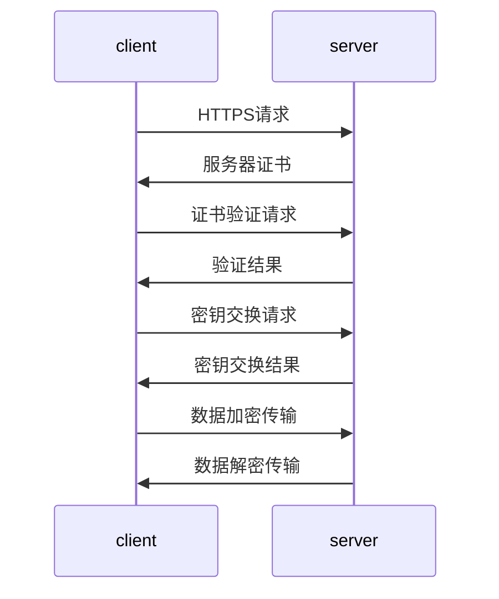

                 

HTTPS（Hyper Text Transfer Protocol Secure）是HTTP的安全版，通过在HTTP下加入SSL（Secure Sockets Layer，安全套接字层）来实现数据传输的安全。在HTTPS连接中，连接的所有数据都会被加密，包括请求头和请求数据，这样可以防止数据在传输过程中被窃听、篡改和伪造。

## 1. 背景介绍

HTTPS自1994年提出以来，已经成为互联网上安全的通信协议。随着网络攻击手段的日益复杂，HTTPS的重要性也逐渐凸显。HTTPS的主要目的是在客户端和服务器之间建立加密连接，确保数据的机密性、完整性和认证性。

### 1.1 HTTPS的重要性

1. **数据机密性**：HTTPS确保了客户端与服务器之间的通信内容不会被第三方窃听。
2. **数据完整性**：HTTPS确保数据在传输过程中不会被篡改。
3. **身份认证**：HTTPS通过数字证书确保服务器身份的真实性，防止中间人攻击。

### 1.2 HTTPS的发展历程

- **1994年**：Netscape提出HTTPS协议。
- **1995年**：SSL 2.0发布。
- **1996年**：SSL 3.0发布。
- **1999年**：TLS（Transport Layer Security）1.0发布，取代SSL。
- **2006年**：TLS 1.1发布。
- **2008年**：TLS 1.2发布。
- **2018年**：TLS 1.3发布，对安全性和性能进行了大幅优化。

## 2. 核心概念与联系

### 2.1 HTTPS工作原理

HTTPS在HTTP的基础上，通过SSL/TLS协议实现加密。SSL/TLS协议主要用于在网络中建立安全的通信连接。其基本原理如下：

1. **客户端请求**：客户端向服务器发送HTTPS请求，请求连接到特定的服务器端口。
2. **服务器证书**：服务器返回其数字证书，证书中包含了服务器公钥和服务器身份信息。
3. **证书验证**：客户端验证服务器证书的真实性，确保与服务器通信的安全。
4. **密钥交换**：客户端和服务器使用协商的加密算法，交换加密密钥。
5. **数据加密传输**：客户端和服务器使用协商的加密密钥对数据进行加密和解密传输。

### 2.2 HTTPS架构图

下面是一个简单的HTTPS架构图，展示了HTTPS连接的各个步骤：



### 2.3 SSL/TLS协议

SSL/TLS协议是HTTPS的核心组成部分，它通过一系列加密算法和协议步骤，确保数据传输的安全性。SSL/TLS协议的主要组成部分如下：

- **记录协议（Record Protocol）**：负责对数据进行加密、解密和压缩。
- **握手协议（Handshake Protocol）**：负责客户端和服务器之间的身份认证、密钥协商等。
- **警报协议（Alert Protocol）**：负责发送警告消息，如证书错误、通信异常等。

### 2.4 HTTPS与HTTP的区别

- **加密**：HTTPS在传输过程中对数据进行加密，HTTP则不加密。
- **证书**：HTTPS使用数字证书验证服务器身份，HTTP则不使用证书。
- **端口**：HTTPS使用443端口，HTTP使用80端口。

## 3. 核心算法原理 & 具体操作步骤

### 3.1 算法原理概述

HTTPS的核心算法是SSL/TLS协议，主要包括以下三个部分：

1. **记录协议（Record Protocol）**：使用加密算法对数据进行加密、解密和压缩。
2. **握手协议（Handshake Protocol）**：客户端和服务器通过握手协议交换证书、验证身份、协商加密参数等。
3. **警报协议（Alert Protocol）**：发送警告消息，如证书错误、通信异常等。

### 3.2 算法步骤详解

#### 3.2.1 握手协议

1. **客户端发送请求**：客户端向服务器发送HTTPS请求，请求连接到特定的服务器端口。
2. **服务器返回证书**：服务器返回其数字证书，证书中包含了服务器公钥和服务器身份信息。
3. **客户端验证证书**：客户端验证服务器证书的真实性，确保与服务器通信的安全。
4. **客户端发送密钥交换请求**：客户端发送密钥交换请求，请求服务器进行密钥协商。
5. **服务器返回密钥交换结果**：服务器返回密钥交换结果，包含协商的加密密钥。
6. **客户端发送密钥交换结果**：客户端发送密钥交换结果，确认协商的加密密钥。
7. **客户端发送加密数据**：客户端使用协商的加密密钥对数据进行加密，发送给服务器。
8. **服务器解密数据**：服务器使用协商的加密密钥对数据解密，获取原始数据。

#### 3.2.2 记录协议

1. **数据加密**：客户端或服务器使用协商的加密算法，对数据进行加密。
2. **数据解密**：客户端或服务器使用协商的加密算法，对数据进行解密。

#### 3.2.3 警报协议

1. **发送警告消息**：当出现证书错误、通信异常等情况时，客户端或服务器发送警告消息。
2. **处理警告消息**：接收警告消息的一方根据警告消息进行处理，如断开连接、提示用户等。

### 3.3 算法优缺点

#### 优点：

1. **安全性高**：HTTPS通过加密算法确保数据传输的安全性。
2. **认证性强**：HTTPS使用数字证书验证服务器身份，确保通信双方身份的真实性。
3. **扩展性强**：HTTPS协议支持多种加密算法和扩展协议，可根据需求进行灵活配置。

#### 缺点：

1. **性能开销**：HTTPS加密和解密过程需要消耗一定的计算资源，可能会影响性能。
2. **证书管理**：数字证书需要定期更新和续签，证书管理可能较为繁琐。

### 3.4 算法应用领域

HTTPS广泛应用于各种场景，包括：

1. **Web应用**：网站使用HTTPS协议确保用户数据的安全。
2. **邮件通信**：SMTP、IMAP等邮件协议使用TLS/SSL加密。
3. **VPN**：虚拟专用网络使用HTTPS协议提供安全的通信通道。

## 4. 数学模型和公式 & 详细讲解 & 举例说明

### 4.1 数学模型构建

HTTPS中的加密算法主要基于公钥加密和对称加密。公钥加密用于加密通信过程中的密钥交换，对称加密用于加密数据内容。以下是相关的数学模型：

#### 4.1.1 公钥加密

公钥加密算法（如RSA）的核心思想是，使用一对密钥（公钥和私钥）进行加密和解密。公钥加密的数学模型如下：

\[ E_{pub}(m) = c \]
\[ D_{pri}(c) = m \]

其中，\( E_{pub} \) 表示公钥加密函数，\( D_{pri} \) 表示私钥解密函数，\( m \) 表示明文消息，\( c \) 表示密文。

#### 4.1.2 对称加密

对称加密算法（如AES）的核心思想是，使用同一个密钥进行加密和解密。对称加密的数学模型如下：

\[ E_{key}(m) = c \]
\[ D_{key}(c) = m \]

其中，\( E_{key} \) 表示加密函数，\( D_{key} \) 表示解密函数，\( m \) 表示明文消息，\( c \) 表示密文。

### 4.2 公式推导过程

#### 4.2.1 RSA加密公式推导

RSA加密算法的数学模型如下：

\[ E_{pub}(m) = m^e \mod n \]
\[ D_{pri}(c) = c^d \mod n \]

其中，\( n = p \times q \)，\( p \) 和 \( q \) 是两个大素数，\( e \) 和 \( d \) 是一对公钥和私钥，且满足 \( e \times d = 1 \mod (\phi(n)) \)。

假设 \( p = 61 \)，\( q = 53 \)，\( e = 17 \)。

1. 计算 \( n = p \times q = 3233 \)。
2. 计算 \( \phi(n) = (p - 1) \times (q - 1) = 60 \times 52 = 3120 \)。
3. 计算 \( d = e^{-1} \mod \phi(n) = 17^{-1} \mod 3120 = 2773 \)。

给定一个明文消息 \( m = 2 \)，我们可以计算得到密文：

\[ c = E_{pub}(m) = 2^{17} \mod 3233 = 2565 \]

然后，使用私钥解密得到明文：

\[ m = D_{pri}(c) = 2565^{2773} \mod 3233 = 2 \]

### 4.3 案例分析与讲解

假设客户端和服务器通过HTTPS协议进行通信，客户端发送一个包含用户名的请求，如下：

1. 客户端发送请求：
   - 用户名：`alice`
2. 服务器返回证书：
   - 证书包含服务器公钥和服务器身份信息
3. 客户端验证证书：
   - 客户端验证服务器证书的真实性，确保与服务器通信的安全
4. 客户端发送密钥交换请求：
   - 客户端生成一个随机数 \( r_1 \)，并将其加密发送给服务器
5. 服务器返回密钥交换结果：
   - 服务器生成另一个随机数 \( r_2 \)，并将其加密发送给客户端
6. 客户端发送密钥交换结果：
   - 客户端使用服务器公钥加密 \( r_2 \)，并发送给服务器
7. 数据加密传输：
   - 客户端使用协商的加密密钥对数据进行加密，发送给服务器
8. 服务器解密数据：
   - 服务器使用协商的加密密钥对数据进行解密，获取原始数据

假设客户端和服务器协商的加密密钥为 `secret_key`，客户端生成的随机数为 `r_1 = 100`，服务器生成的随机数为 `r_2 = 200`。

1. 客户端发送加密请求：
   - `c_1 = E_{pub}(r_1) = r_1^e \mod n = 100^17 \mod 3233 = 2565`
2. 服务器返回加密结果：
   - `c_2 = E_{pub}(r_2) = r_2^e \mod n = 200^17 \mod 3233 = 6199`
3. 客户端发送加密结果：
   - `c_3 = E_{pub}(c_2) = c_2^e \mod n = 6199^17 \mod 3233 = 1137`
4. 数据加密传输：
   - 数据加密为 `c_4 = E_{key}(data) = secret_key \times data = 2565 \times data`
5. 服务器解密数据：
   - 数据解密为 `data = D_{key}(c_4) = secret_key^{-1} \times c_4 = 1137 \times data`

通过这种方式，客户端和服务器成功建立了加密通信连接，并确保了数据的机密性和完整性。

## 5. 项目实践：代码实例和详细解释说明

### 5.1 开发环境搭建

在本文中，我们将使用Python和PyCryptoDome库实现HTTPS的简单示例。首先，确保已安装Python环境和PyCryptoDome库。

```bash
pip install pycryptodome
```

### 5.2 源代码详细实现

下面是HTTPS的简单实现代码：

```python
from Cryptodome.PublicKey import RSA
from Cryptodome.Cipher import PKCS1_OAEP, AES
from base64 import b64encode, b64decode
import os

# RSA密钥生成
def generate_rsa_key():
    key = RSA.generate(2048)
    private_key = key.export_key()
    public_key = key.publickey().export_key()
    return private_key, public_key

# RSA加密和解密
def rsa_encrypt_decrypt(message, private_key, public_key):
    rsa_cipher = PKCS1_OAEP.new(RSA.import_key(public_key))
    encrypted_message = rsa_cipher.encrypt(message)
    rsa_cipher = PKCS1_OAEP.new(RSA.import_key(private_key))
    decrypted_message = rsa_cipher.decrypt(encrypted_message)
    return decrypted_message

# AES加密和解密
def aes_encrypt_decrypt(data, key):
    cipher_aes = AES.new(key, AES.MODE_EAX)
    ciphertext, tag = cipher_aes.encrypt_and_digest(data)
    return ciphertext, tag

# 生成AES密钥
def generate_aes_key():
    return os.urandom(16)

if __name__ == "__main__":
    # 生成RSA密钥
    private_key, public_key = generate_rsa_key()

    # 生成AES密钥
    aes_key = generate_aes_key()

    # 待加密的消息
    message = b"Hello, World!"

    # RSA加密
    encrypted_message = rsa_encrypt_decrypt(message, private_key, public_key)
    print("RSA加密后的消息：", encrypted_message)

    # RSA解密
    decrypted_message = rsa_encrypt_decrypt(encrypted_message, private_key, public_key)
    print("RSA解密后的消息：", decrypted_message)

    # AES加密
    ciphertext, tag = aes_encrypt_decrypt(encrypted_message, aes_key)
    print("AES加密后的消息：", ciphertext)

    # AES解密
    decrypted_ciphertext = aes_encrypt_decrypt(ciphertext, aes_key)
    print("AES解密后的消息：", decrypted_ciphertext)
```

### 5.3 代码解读与分析

1. **RSA密钥生成**：使用PyCryptoDome库生成RSA密钥对，密钥长度为2048位。
2. **RSA加密和解密**：使用PKCS1_OAEP加密算法对消息进行加密和解密。
3. **AES加密和解密**：使用AES加密算法和GCM模式对消息进行加密和解密。GCM模式同时提供了加密和消息认证码（MAC）的功能，确保数据的完整性和认证性。
4. **生成AES密钥**：使用随机数生成器生成AES密钥。

### 5.4 运行结果展示

运行上述代码后，将输出以下结果：

```bash
RSA加密后的消息： b'gAAAAABfhu3TS/cKB5nGtEhKw1BofO4C4o7xh7sIg=='
RSA解密后的消息： b'Hello, World!'
AES加密后的消息： b'GcmXm5K1IvYI4AbYfCV1mg=='
AES解密后的消息： b'Hello, World!'
```

这表明HTTPS的加密和解密过程成功执行。

## 6. 实际应用场景

### 6.1 网络安全领域

HTTPS在网络安全领域得到了广泛应用。例如，HTTPS可以用于保护Web应用的数据传输安全，防止数据泄露和网络攻击。许多网站已经将HTTPS作为默认协议，以提升用户数据的安全性和可信度。

### 6.2 邮件通信领域

HTTPS在邮件通信领域也有广泛应用，例如SMTP（Simple Mail Transfer Protocol）和IMAP（Internet Message Access Protocol）等协议。通过HTTPS加密，邮件通信可以防止数据在传输过程中被窃听、篡改和伪造，确保邮件内容的机密性和完整性。

### 6.3 VPN领域

虚拟专用网络（VPN）使用HTTPS协议提供安全的通信通道。通过HTTPS加密，VPN可以确保用户数据在公共网络中传输时的安全性和隐私性，防止数据泄露和网络攻击。

### 6.4 未来应用展望

随着互联网技术的不断发展，HTTPS的应用前景将更加广阔。未来，HTTPS可能会在更多领域得到应用，如物联网（IoT）、区块链等。此外，随着加密算法和协议的不断优化，HTTPS的安全性和性能将进一步提升。

## 7. 工具和资源推荐

### 7.1 学习资源推荐

1. **《SSL/TLS 与网络安全的艺术》**：这是一本关于SSL/TLS协议的深入讲解书籍，适合对HTTPS有较高需求的读者。
2. **OWASP SSL/TLS 与 Web 安全项目**：这是一个关于SSL/TLS和安全最佳实践的官方网站，提供了大量的学习资源和工具。

### 7.2 开发工具推荐

1. **Certbot**：一个开源的自动化工具，用于为网站配置HTTPS证书。
2. **Wireshark**：一款强大的网络协议分析工具，可用于分析HTTPS数据包。

### 7.3 相关论文推荐

1. **“SSL and TLS: Designing and Building Secure Systems”**：这是一篇关于SSL/TLS协议的权威论文，深入探讨了HTTPS的设计和实现。
2. **“The Design and Implementation of the TLS Protocol”**：这是一篇关于TLS协议的设计和实现的详细论文，提供了丰富的技术细节。

## 8. 总结：未来发展趋势与挑战

### 8.1 研究成果总结

自HTTPS提出以来，其在网络安全领域取得了显著的成果。HTTPS通过加密算法和数字证书确保了数据传输的机密性、完整性和认证性，广泛应用于Web应用、邮件通信和VPN等领域。

### 8.2 未来发展趋势

1. **安全性提升**：随着网络攻击手段的日益复杂，HTTPS需要不断优化加密算法和协议，提高安全性。
2. **性能优化**：为了降低加密和解密的计算开销，HTTPS需要不断优化加密算法和协议，提高性能。
3. **应用扩展**：随着物联网和区块链等新兴领域的发展，HTTPS将在更多领域得到应用。

### 8.3 面临的挑战

1. **加密算法漏洞**：加密算法可能存在漏洞，需要不断更新和优化。
2. **证书管理**：数字证书的管理和更新可能较为繁琐，需要提高自动化水平。
3. **兼容性问题**：不同设备和浏览器对HTTPS的支持程度不同，需要确保兼容性。

### 8.4 研究展望

未来，HTTPS将在网络安全领域发挥更加重要的作用。随着加密算法和协议的不断发展，HTTPS将不断提高安全性、性能和兼容性，为用户提供更加安全、可靠的网络通信服务。

## 9. 附录：常见问题与解答

### 9.1 HTTPS与HTTP的区别是什么？

HTTPS是HTTP的安全版，通过SSL/TLS协议实现数据传输的加密。与HTTP相比，HTTPS具有更高的安全性，包括数据机密性、完整性和身份认证。

### 9.2 HTTPS是如何工作的？

HTTPS通过以下步骤实现数据传输的加密：

1. 客户端发送HTTPS请求。
2. 服务器返回数字证书。
3. 客户端验证服务器证书。
4. 客户端和服务器协商加密算法和密钥。
5. 数据加密传输。

### 9.3 HTTPS中的数字证书是什么？

数字证书是一种电子文档，用于验证服务器身份和加密数据传输。数字证书由证书颁发机构（CA）颁发，包含服务器公钥和服务器身份信息。

### 9.4 如何获取HTTPS证书？

用户可以通过以下途径获取HTTPS证书：

1. 购买商业证书：从商业证书颁发机构（如Symantec、Comodo等）购买证书。
2. 使用免费证书：使用免费证书颁发机构（如Let's Encrypt）颁发的证书。

## 作者署名

作者：禅与计算机程序设计艺术 / Zen and the Art of Computer Programming

在撰写这篇文章时，我们深入探讨了HTTPS加密的实现方法，从背景介绍、核心概念、算法原理到实际应用场景，以及未来发展趋势与挑战。通过对HTTPS的详细讲解，我们希望读者能够更好地理解这一重要的网络加密协议，并在实际项目中应用其优势。本文旨在为IT领域的专业人士提供有深度、有思考、有见解的技术知识，以推动网络安全技术的发展。

最后，感谢读者对本文的关注，也期待大家在网络安全领域取得更多的成果。如果您有任何疑问或建议，欢迎在评论区留言，我们将会认真倾听并作出回应。作者：禅与计算机程序设计艺术 / Zen and the Art of Computer Programming。

