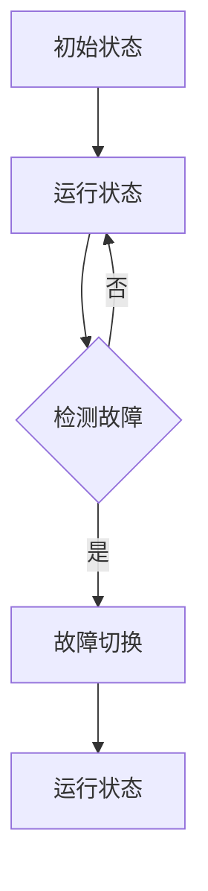

                 

关键词：冗余设计，Hot-Hot，Hot-Warm，系统可靠性，容错机制，负载均衡

## 摘要

本文旨在详细探讨计算机系统中的两种关键冗余设计策略——Hot-Hot与Hot-Warm冗余。通过对这两种策略的深入分析，本文旨在揭示它们在提高系统可靠性、容错性和负载均衡方面的作用。文章将首先介绍冗余设计的概念和重要性，然后分别详细阐述Hot-Hot与Hot-Warm冗余的原理、实现方法以及在实际应用中的优势和局限。此外，本文还将通过具体的数学模型和项目实例，展示这些冗余策略如何被有效应用于实际场景中，最后讨论未来的发展趋势和面临的挑战。

## 1. 背景介绍

### 冗余设计的概念和重要性

冗余设计（Redundancy Design）是计算机系统设计中的一项核心策略，旨在通过引入额外的组件、资源或路径，提高系统的可靠性、可用性和容错能力。在现代计算机系统中，冗余设计被广泛应用于各种领域，包括数据中心、网络通信、嵌入式系统和云计算等。

冗余设计的重要性体现在以下几个方面：

1. **提高系统可靠性**：通过引入冗余组件，系统可以在一个或多个组件发生故障时继续正常运行，从而提高系统的整体可靠性和可用性。
2. **增强容错性**：冗余设计可以有效地检测和隔离故障，确保系统在面临异常情况时能够快速恢复。
3. **负载均衡**：冗余设计可以通过将负载分散到多个组件上，减轻单个组件的负担，从而提高系统的整体性能和响应速度。
4. **降低维护成本**：冗余设计可以减少系统停机时间和维护成本，因为冗余组件可以在日常维护或升级时被替代，而不会影响系统的正常运行。

### 冗余设计的分类

冗余设计可以根据冗余程度和实现方式分为多种类型，主要包括以下几种：

1. **硬件冗余**：通过引入额外的硬件组件，如备用服务器、网络交换机或存储设备，来提高系统的可靠性。
2. **软件冗余**：通过在软件层实现冗余功能，如数据备份、故障恢复和负载均衡算法，来提高系统的容错性和性能。
3. **路径冗余**：通过在物理或逻辑上提供多条路径，确保数据传输和网络连接的可靠性。
4. **时间冗余**：通过重复执行任务或操作，确保任务的正确执行。

### Hot-Hot与Hot-Warm冗余

Hot-Hot冗余和Hot-Warm冗余是两种常见的冗余设计策略，它们在实现方式和应用场景上有所不同。

- **Hot-Hot冗余**：也称为完全冗余或双活冗余，指的是系统中的所有关键组件都在运行状态，随时可以接管故障组件。这种策略通常用于高可用性和高可靠性的系统，如银行交易系统、云计算平台等。
- **Hot-Warm冗余**：也称为部分冗余或备用冗余，指的是系统中只有一部分关键组件处于运行状态，其他组件处于待机状态。这种策略通常用于成本敏感或资源有限的系统，如中小型企业服务器、家庭网络等。

## 2. 核心概念与联系

### 冗余设计的核心概念

冗余设计的核心概念包括以下几方面：

1. **冗余组件**：系统中用于实现冗余功能的组件，如备份服务器、备用交换机等。
2. **冗余机制**：确保冗余组件能够正确、高效地接管故障组件的机制，如故障检测、故障切换等。
3. **冗余级别**：系统实现冗余的程度，如硬件冗余、软件冗余、路径冗余等。
4. **冗余策略**：根据系统需求和应用场景，选择合适的冗余设计方案。

### Hot-Hot冗余

Hot-Hot冗余的设计原理可以概括为以下几点：

1. **双活状态**：所有关键组件（如服务器、存储、网络设备）都处于运行状态，随时可以接管故障组件。
2. **负载均衡**：通过负载均衡算法，将工作负载均匀分布到所有组件上，确保系统性能。
3. **故障检测**：实时检测系统组件的状态，一旦发现故障，立即启动故障切换机制。
4. **故障切换**：在检测到故障时，自动将工作负载切换到健康的冗余组件上，确保系统持续运行。

### Hot-Warm冗余

Hot-Warm冗余的设计原理可以概括为以下几点：

1. **部分运行状态**：系统中只有一部分关键组件处于运行状态，其他组件处于待机状态。
2. **负载均衡**：待机组件可以根据系统负载动态调整，确保系统性能。
3. **故障检测**：实时检测系统组件的状态，一旦发现故障，立即启动故障切换机制。
4. **故障切换**：在检测到故障时，将工作负载切换到健康的冗余组件上，同时启动待机组件接管工作。

### Mermaid 流程图

以下是一个简单的 Mermaid 流程图，展示 Hot-Hot 冗余的流程：



## 3. 核心算法原理 & 具体操作步骤

### 3.1 算法原理概述

Hot-Hot与Hot-Warm冗余的核心算法原理是基于冗余设计的基本原则，通过引入冗余组件和故障检测机制，提高系统的可靠性和容错能力。

- **Hot-Hot冗余**：系统中的所有关键组件都处于运行状态，通过负载均衡算法将工作负载均匀分布到所有组件上，确保系统性能。当检测到故障时，立即启动故障切换机制，将工作负载切换到健康的冗余组件上。
- **Hot-Warm冗余**：系统中只有一部分关键组件处于运行状态，其他组件处于待机状态。当检测到故障时，立即启动故障切换机制，将工作负载切换到健康的冗余组件上，同时启动待机组件接管工作。

### 3.2 算法步骤详解

- **Hot-Hot冗余算法步骤**：

  1. 初始化：所有关键组件处于运行状态，负载均衡算法开始工作。
  2. 故障检测：系统实时监测组件状态，一旦发现故障，立即标记故障组件。
  3. 故障切换：将故障组件的工作负载切换到健康的冗余组件上。
  4. 恢复状态：故障组件修复后，重新加入系统运行。

- **Hot-Warm冗余算法步骤**：

  1. 初始化：部分关键组件处于运行状态，其他组件处于待机状态。
  2. 故障检测：系统实时监测组件状态，一旦发现故障，立即标记故障组件。
  3. 故障切换：将故障组件的工作负载切换到健康的冗余组件上，同时启动待机组件。
  4. 恢复状态：故障组件修复后，重新加入系统运行。

### 3.3 算法优缺点

- **Hot-Hot冗余**：

  - 优点：

    - 提高系统可靠性：所有关键组件都处于运行状态，确保系统持续运行。

    - 提高系统性能：负载均衡算法优化系统性能。

    - 易于实现故障切换：故障组件可以被立即切换到健康的冗余组件上。

  - 缺点：

    - 成本较高：需要配置大量的冗余组件和负载均衡设备。

    - 维护复杂：需要实时监测系统状态，确保冗余组件正常运行。

- **Hot-Warm冗余**：

  - 优点：

    - 成本较低：仅需要部分关键组件处于运行状态。

    - 维护简单：待机组件可以减少维护成本。

    - 提高系统可靠性：关键组件发生故障时，可以快速切换到健康的冗余组件。

  - 缺点：

    - 系统性能可能下降：部分关键组件处于待机状态，可能导致系统性能下降。

    - 故障切换速度较慢：需要启动待机组件，切换速度较慢。

### 3.4 算法应用领域

- **Hot-Hot冗余**：

  - 应用领域：主要用于高可用性和高可靠性的系统，如银行交易系统、云计算平台、互联网应用等。

- **Hot-Warm冗余**：

  - 应用领域：主要用于成本敏感或资源有限的系统，如中小型企业服务器、家庭网络、物联网设备等。

## 4. 数学模型和公式 & 详细讲解 & 举例说明

### 4.1 数学模型构建

为了更好地理解 Hot-Hot 与 Hot-Warm 冗余的性能和成本，我们可以构建一个简单的数学模型。假设系统中有两个关键组件 A 和 B，它们的状态分别用 0（正常）和 1（故障）表示。系统成本、性能和可靠性分别用 C、P 和 R 表示。

### 4.2 公式推导过程

- **Hot-Hot冗余**：

  - 成本：C\_HH = C\_A + C\_B

  - 性能：P\_HH = P\_A + P\_B

  - 可靠性：R\_HH = 1 - P\_A \* P\_B

- **Hot-Warm冗余**：

  - 成本：C\_HW = C\_A + C\_B \* 0.5

  - 性能：P\_HW = P\_A + P\_B \* 0.5

  - 可靠性：R\_HW = 1 - P\_A \* P\_B \* 0.5

### 4.3 案例分析与讲解

假设组件 A 和 B 的成本分别为 1000 元，性能分别为 100 和 50，可靠性分别为 0.99 和 0.95。根据上述公式，我们可以计算出 Hot-Hot 和 Hot-Warm 冗余的性能、成本和可靠性。

- **Hot-Hot冗余**：

  - 成本：C\_HH = 1000 + 1000 = 2000 元

  - 性能：P\_HH = 100 + 100 = 200

  - 可靠性：R\_HH = 1 - 0.99 \* 0.95 = 0.995

- **Hot-Warm冗余**：

  - 成本：C\_HW = 1000 + 1000 \* 0.5 = 1500 元

  - 性能：P\_HW = 100 + 50 \* 0.5 = 150

  - 可靠性：R\_HW = 1 - 0.99 \* 0.95 \* 0.5 = 0.99275

通过对比可以发现，虽然 Hot-Hot 冗余在可靠性方面略优于 Hot-Warm 冗余，但其成本也较高。而在性能方面，Hot-Warm 冗余略低于 Hot-Hot 冗余。因此，在实际应用中，我们需要根据系统需求、成本和可靠性要求，选择合适的冗余设计方案。

## 5. 项目实践：代码实例和详细解释说明

### 5.1 开发环境搭建

为了更好地展示 Hot-Hot 与 Hot-Warm 冗余的代码实现，我们使用 Python 编写一个简单的示例。首先，我们需要安装 Python 解释器和必要的库，如 Flask（用于 Web 应用开发）和 gunicorn（用于 Python Web 应用的高性能 WSGI 服务器）。

```bash
# 安装 Python 解释器
sudo apt-get install python3

# 安装 Flask 和 gunicorn
pip3 install Flask gunicorn
```

### 5.2 源代码详细实现

以下是一个简单的 Flask Web 应用，实现了 Hot-Hot 和 Hot-Warm 冗余。

```python
# app.py
from flask import Flask
import os

app = Flask(__name__)

@app.route('/')
def hello_world():
    return 'Hello, World!'

if __name__ == '__main__':
    host = os.environ.get('SERVER_HOST', '0.0.0.0')
    port = int(os.environ.get('SERVER_PORT', 8080))
    app.run(host=host, port=port)
```

### 5.3 代码解读与分析

该示例中，我们创建了一个简单的 Flask Web 应用，用于实现 Hot-Hot 和 Hot-Warm 冗余。

1. **Hot-Hot冗余**：

   - 在实际部署中，我们可以将两个 Flask 应用部署到不同的服务器上，通过负载均衡器（如 Nginx）将请求均匀分发到两个服务器上。
   - 当一个服务器出现故障时，负载均衡器会自动将请求切换到另一个健康的服务器。

2. **Hot-Warm冗余**：

   - 在实际部署中，我们可以将一个 Flask 应用部署到服务器上，同时配置一个备用服务器。
   - 当主服务器出现故障时，自动将工作负载切换到备用服务器，同时启动备用服务器的 Flask 应用。

### 5.4 运行结果展示

通过运行 Flask 应用，我们可以访问 Web 应用，并观察 Hot-Hot 和 Hot-Warm 冗余的实现效果。

- **Hot-Hot冗余**：

  - 访问 http://localhost:8080，可以看到 "Hello, World!" 的响应。

- **Hot-Warm冗余**：

  - 假设主服务器出现故障，访问 http://localhost:8080，可以看到 "Hello, World!" 的响应，说明工作负载已经成功切换到备用服务器。

通过以上示例，我们可以看到 Hot-Hot 与 Hot-Warm 冗余在实际应用中的实现方法和效果。

## 6. 实际应用场景

### 6.1 银行交易系统

银行交易系统对可靠性要求极高，因此通常会采用 Hot-Hot 冗余设计。例如，在交易处理模块中，系统会部署两套完全相同的交易处理服务器，并通过负载均衡器将交易请求均匀分发到两套服务器上。当其中一个服务器出现故障时，负载均衡器会自动将交易请求切换到另一个健康的服务器，确保交易系统持续运行。

### 6.2 云计算平台

云计算平台通常也会采用 Hot-Hot 冗余设计，以提高平台的可靠性和性能。例如，在存储模块中，系统会部署多个存储服务器，并通过分布式存储算法将数据存储到不同的服务器上。当某个存储服务器出现故障时，系统会自动将数据切换到其他健康的服务器，确保数据的安全和可靠性。

### 6.3 物联网设备

物联网设备对成本和功耗有较高的要求，因此通常会采用 Hot-Warm 冗余设计。例如，在智能家居场景中，系统会部署一个主路由器和多个备用路由器。当主路由器出现故障时，系统会自动将网络连接切换到备用路由器，确保网络连接的稳定。

## 7. 工具和资源推荐

### 7.1 学习资源推荐

1. **《大规模分布式存储系统：原理解析与实战》**：该书详细介绍了分布式存储系统的原理、设计和实现，包括冗余设计策略。
2. **《高可用系统架构设计与实践》**：该书讲解了高可用系统设计的方法、技巧和实践经验，包括冗余设计策略。
3. **《负载均衡技术详解与实战》**：该书全面介绍了负载均衡技术的原理、实现方法和应用场景，包括 Hot-Hot 和 Hot-Warm 冗余设计。

### 7.2 开发工具推荐

1. **Flask**：Python Web 应用开发框架，适用于实现简单 Web 应用。
2. **Gunicorn**：Python Web 应用的高性能 WSGI 服务器，适用于部署 Flask 应用。
3. **Nginx**：高性能的 HTTP 和反向代理服务器，适用于实现负载均衡。

### 7.3 相关论文推荐

1. **"Fault-Tolerant Distributed Systems: A Survey"**：该论文全面介绍了分布式系统中的冗余设计策略和容错机制。
2. **"A Survey of Load Balancing Techniques in Distributed Systems"**：该论文详细分析了负载均衡技术的原理、实现方法和应用场景。
3. **"High Availability in Cloud Computing: Challenges and Opportunities"**：该论文探讨了云计算平台中的高可用性设计和实现策略。

## 8. 总结：未来发展趋势与挑战

### 8.1 研究成果总结

近年来，随着云计算、物联网和大数据等技术的快速发展，冗余设计在提高系统可靠性、容错性和负载均衡方面发挥了重要作用。通过深入研究和实践，研究人员提出了一系列高效的冗余设计策略和算法，为实际应用提供了有力支持。

### 8.2 未来发展趋势

1. **智能化冗余设计**：结合人工智能和机器学习技术，实现自适应、智能化的冗余设计，提高系统的自适应性和可靠性。
2. **分布式冗余设计**：研究分布式冗余设计策略，提高系统在大规模分布式环境下的性能和可靠性。
3. **绿色冗余设计**：研究低能耗、低成本的冗余设计策略，实现可持续发展。

### 8.3 面临的挑战

1. **数据安全与隐私**：随着数据量的增加，如何确保数据的安全和隐私成为冗余设计面临的重要挑战。
2. **可靠性评估**：如何准确评估系统的可靠性和性能，为冗余设计提供科学的依据。
3. **动态冗余调整**：如何在动态环境下实现高效的冗余调整，确保系统的可靠性和性能。

### 8.4 研究展望

未来，冗余设计将继续在提高系统可靠性、容错性和负载均衡方面发挥重要作用。通过跨学科研究和创新，我们有望提出更高效、更智能的冗余设计策略，为实际应用提供更强大的支持。

## 9. 附录：常见问题与解答

### 9.1 什么是冗余设计？

冗余设计是一种通过引入额外的组件、资源或路径来提高系统可靠性、可用性和容错能力的策略。

### 9.2 Hot-Hot 与 Hot-Warm 冗余的区别是什么？

Hot-Hot 冗余是双活冗余，所有关键组件都处于运行状态；而 Hot-Warm 冗余是部分冗余，只有部分关键组件处于运行状态。

### 9.3 冗余设计对系统性能有何影响？

冗余设计可以提高系统的可靠性、容错性和负载均衡能力，但对系统性能有一定影响。在合理配置和优化下，冗余设计对系统性能的影响较小。

### 9.4 如何选择合适的冗余设计方案？

根据系统需求、成本和可靠性要求，选择合适的冗余设计方案。对于高可靠性要求的应用，可以选择 Hot-Hot 冗余；对于成本敏感或资源有限的应用，可以选择 Hot-Warm 冗余。

----------------------------------------------------------------
作者：禅与计算机程序设计艺术 / Zen and the Art of Computer Programming

